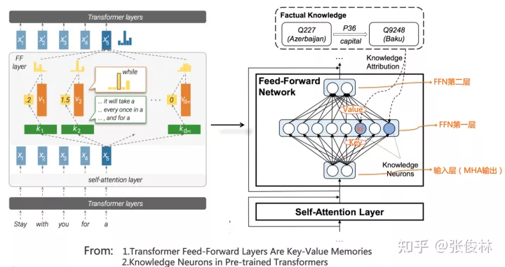
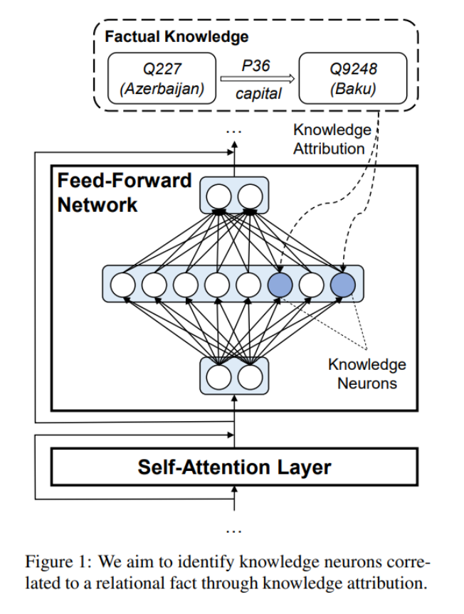
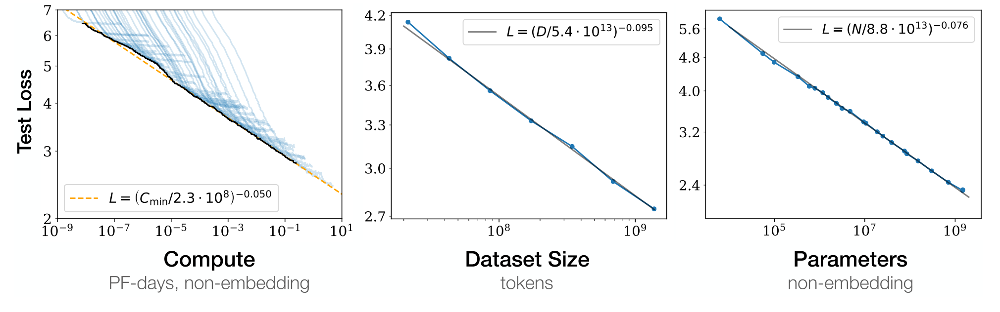
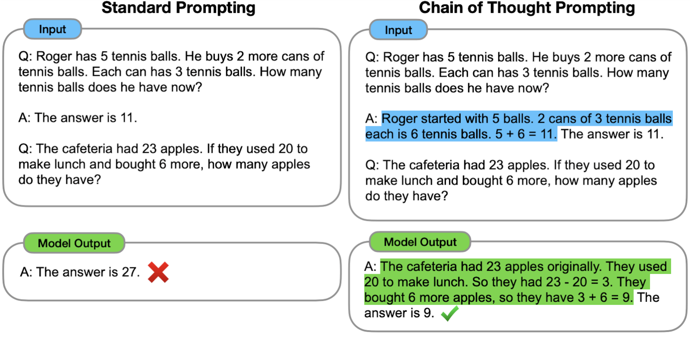
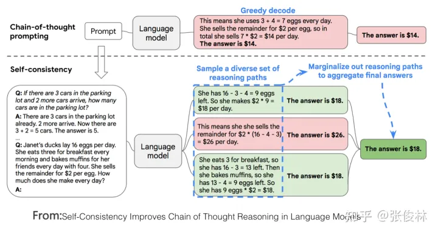

- [深度学习](#深度学习)
- [大型语言模型 属于深度学习吗](#大型语言模型-属于深度学习吗)
- [自注意力机制](#自注意力机制)
- [Transformer架构](#transformer架构)
- [介绍 Bert和GPT模型 的概念和区别](#介绍-bert和gpt模型-的概念和区别)
- [介绍 LSTM模型、CNN模型的概念和区别](#介绍-lstm模型cnn模型的概念和区别)
- [NLP研究范式的转换](#nlp研究范式的转换)
  - [范式转换1.0:从深度学习到两阶段预训练模型](#范式转换10从深度学习到两阶段预训练模型)
    - [影响一：中间任务的消亡](#影响一中间任务的消亡)
    - [影响二：不同研究方向技术路线的统一](#影响二不同研究方向技术路线的统一)
  - [范式转换2.0: 从预训练模型走向通用人工智能 （AGI，Artificial General Intelligence）](#范式转换20-从预训练模型走向通用人工智能-agiartificial-general-intelligence)
    - [过渡期：以GPT 3.0为代表的“自回归语言模型+Prompting”模式占据统治地位](#过渡期以gpt-30为代表的自回归语言模型prompting模式占据统治地位)
    - [影响一：让LLM适配人的新型交互接口](#影响一让llm适配人的新型交互接口)
    - [影响二：很多NLP子领域不再具备独立研究价值](#影响二很多nlp子领域不再具备独立研究价值)
    - [影响三：更多NLP之外的研究领域将被纳入LLM技术体系](#影响三更多nlp之外的研究领域将被纳入llm技术体系)
- [从无尽数据到海量知识](#从无尽数据到海量知识)
- [LLM学到了什么知识](#llm学到了什么知识)
- [LLM如何存取知识](#llm如何存取知识)
- [如何修正LLM里存储的知识](#如何修正llm里存储的知识)
- [当LLM越来越大时会发生什么](#当llm越来越大时会发生什么)
- [人机接口:从In Context Learning到Instruct理解](#人机接口从in-context-learning到instruct理解)
  - [神秘的In Context Learning](#神秘的in-context-learning)
- [神奇的Instruct理解](#神奇的instruct理解)
- [In Context Learning和Instruct的联系](#in-context-learning和instruct的联系)
- [如何增强LLM的推理能力](#如何增强llm的推理能力)
  - [基于Prompt的方法](#基于prompt的方法)
  - [代码预训练增强LLM推理能力](#代码预训练增强llm推理能力)
- [LLM研究趋势及值得研究的重点方向](#llm研究趋势及值得研究的重点方向)
  - [探索LLM模型的规模天花板](#探索llm模型的规模天花板)
  - [增强LLM的复杂推理能力](#增强llm的复杂推理能力)
  - [LLM纳入NLP之外更多其它研究领域](#llm纳入nlp之外更多其它研究领域)
  - [更易用的人和LLM的交互接口](#更易用的人和llm的交互接口)
  - [建设高难度的综合任务评测数据集](#建设高难度的综合任务评测数据集)
  - [高质量数据工程](#高质量数据工程)
  - [超大LLM模型Transformer的稀疏化](#超大llm模型transformer的稀疏化)
- [复刻ChatGPT时要注意些什么](#复刻chatgpt时要注意些什么)
- [ChatGPT:为什么是OpenAI](#chatgpt为什么是openai)

# 深度学习
深度学习是机器学习的一个子领域，它通过模拟人脑神经网络的工作方式，让计算机学习并理解数据的内在规律和表征。具体来说，深度学习模型是由许多层的人工神经网络构成的，这些层可以处理并学习更复杂和高级的数据特征。

**核心原理**：

深度学习的核心原理可以归结为以下几点：

1. **神经网络**：深度学习模型主要是由神经网络构成的，这些网络模拟了人脑神经元之间的连接和交互。每一个神经元都会接收输入，对输入进行处理，然后输出到下一层。每个神经元的输入都与一系列权重相连，这些权重在训练过程中会不断地调整，以使得模型的输出尽可能地接近实际结果。

2. **层级结构**：深度学习模型的层级结构使其能够从原始数据中学习到高层次的特征。例如，在处理图像时，底层可能会学习到边缘和纹理等基本特征，中层可能会学习到部分和形状，而顶层则可能会学习到更复杂的对象表示。

3. **反向传播和梯度下降**：训练深度学习模型的关键技术之一是反向传播和梯度下降。在模型训练过程中，首先会将输入数据前向传播通过网络，然后计算模型的预测与实际结果之间的差距（通常通过一个损失函数来计算）。接着，这个差距会被反向传播回网络，用来调整神经元的权重，以减小预测错误。梯度下降是一种常用的权重调整策略，目标是寻找损失函数的最小值。

4. **大量数据和计算能力**：深度学习需要大量的数据和计算能力。大量的数据能够提供丰富的样本，使得模型能够学习到更多的特征和规律。而高速的计算能力则能够处理这些大量的数据，使得训练过程变得可能。

以上就是深度学习的基本概念和核心原理。在实践中，深度学习已经被广泛地应用于图像识别、语音识别、自然语言处理等许多领域，并取得了显著的成果。

# 大型语言模型 属于深度学习吗
大型语言模型（如OpenAI的GPT系列模型，包括GPT-3和GPT-4，以及Google的BERT等）属于深度学习的一部分，具体来说，它们是自然语言处理（NLP）领域的深度学习模型。

这些模型通过深层神经网络（通常是使用了自注意力机制的变压器（Transformer）架构）学习大量文本数据的模式，以理解和生成人类语言。它们能够根据上下文生成文本，进行文本分类，回答问题，进行机器翻译等任务。

这些模型通常通过在大量的文本数据上进行预训练，学习词汇、短语、句子和其他语言结构的内在模式和关系，然后在特定任务上进行微调，以适应特定的应用，如情感分析、问答系统等。

因此，大型语言模型是深度学习的一个重要应用领域，并且在近年来已经取得了很大的成功。

# 自注意力机制
假设你正在阅读一段话，比如“因为他生病了，所以他没来上课。” 在这句话中，有两个“他”出现。当你读到第二个“他”时，你能理解这个“他”是指前面那个生病的人，而不是一个全新的人。这就是自注意力机制的一种应用 - 它允许模型关注输入的不同部分，以更好地理解上下文中的每个单词。在我们的例子中，自注意力机制会让模型理解两个“他”实际上是指同一个人。

# Transformer架构
Transformer是一种特殊的神经网络结构，它主要由自注意力机制组成。Transformer的特点是能够并行处理所有的输入（比如一句话中的所有单词），而不是像传统的神经网络那样按顺序一个一个处理。这使得Transformer在处理长文本和理解单词之间的复杂关系方面特别有效。

为了更形象地理解Transformer，你可以把它想象成一个工厂的生产线。在这条生产线上，你有很多的工人（自注意力机制）同时工作，每个工人都在独立地处理一部分产品（单词或词组）。这些工人还能相互交流，以了解他们处理的产品部分与其他部分的关系。最后，所有的部分被组装在一起，形成最终的产品（比如一个完成的句子或段落的表示）。

# 介绍 Bert和GPT模型 的概念和区别
**BERT**（Bidirectional Encoder Representations from Transformers）和**GPT**（Generative Pretrained Transformer）都是非常强大的自然语言处理模型，它们都是基于Transformer架构，并且都通过在大量的文本数据上预训练，以理解和生成人类语言。

这是它们的基本概念和区别：

1. **BERT**：BERT模型的一个重要特性是它的双向性，这意味着当它处理一个单词时，它会同时考虑这个单词前面和后面的上下文。这种全方位的理解对于理解每个单词的真正含义是非常有用的，因为在许多情况下，一个单词的含义取决于它周围的上下文。例如，在句子“他把球踢出了场地”中，“踢”这个词的含义很大程度上取决于它前面的“球”和后面的“场地”。

2. **GPT**：与BERT不同，GPT是一个生成模型，它是单向的（从左到右），并且通过预测下一个词来训练自己。这使得GPT非常擅长生成文本，因为它可以持续地生成新的词，形成一个连贯的句子或段落。例如，如果你给GPT一个提示词“今天的天气”，它可能会生成“今天的天气非常晴朗，适合出去郊游”。

它们的主要**区别**在于：

1. **方向性**：如前所述，BERT是双向的，而GPT是单向的。这使得BERT在理解单词的上下文方面更为强大，而GPT在生成连贯的文本方面更为出色。

2. **使用方式**：BERT通常用作分类任务（如情感分析、文本分类等），而GPT由于其生成能力，更常用于生成任务（如文本生成、对话生成等）。

3. **预训练任务**：BERT使用"Masked Language Model"（被遮罩的语言模型）和"Next Sentence Prediction"（下一句预测）两种任务进行预训练，而GPT使用"Autoregressive Language Model"（自回归语言模型）进行预训练。

虽然BERT和GPT有很多不同，但它们都是自然语言处理领域的重要工具，都对推动这个领域的发展起到了关键作用。

# 介绍 LSTM模型、CNN模型的概念和区别
**LSTM（Long Short-Term Memory**和**CNN（Convolutional Neural Networks**都是深度学习中的重要模型，但它们在设计和应用领域上有显著的不同。

**LSTM模型**：LSTM是一种特殊的递归神经网络（RNN），专门设计用来解决RNN在处理长序列数据时遇到的问题，如梯度消失或梯度爆炸。LSTM通过引入"门"结构，可以决定信息何时进入、遗忘和输出，从而有效地存储和处理长期依赖信息。因此，LSTM在处理时间序列数据、自然语言处理等序列相关任务上非常有效。

**CNN模型**：CNN是一种特别适合处理网格形式数据（如图像）的神经网络，它使用卷积层来处理输入数据。卷积层通过在输入数据上滑动小的窗口（或者叫做滤波器或核），从而学习到局部的特征。随着网络深度的增加，这些局部特征会逐渐组合成全局特征。因此，CNN在图像分类、目标检测等视觉任务上表现出色。

**主要区别**：

1. **数据类型**：LSTM主要处理序列数据，如文本、时间序列数据等；而CNN主要处理网格形式的数据，如图像、声音频谱等。

2. **结构**：LSTM包含一个复杂的内部结构（含有输入门、遗忘门和输出门），用来控制信息的流动；而CNN则由一系列的卷积层、池化层（可选）和全连接层（可选）组成，这些层通过滤波器来学习数据的局部特征。

3. **处理信息的方式**：LSTM以顺序的方式处理序列数据，考虑到数据中的长期依赖性；而CNN通过在输入数据上滑动窗口，从局部到全局地理解数据。

虽然LSTM和CNN在设计和应用上有所不同，但它们都是深度学习领域的重要工具，广泛应用在各种任务中，从自然语言处理到图像识别等。

# NLP研究范式的转换
在最近10年来NLP领域的技术发展过程中，可能存在两次大的研究范型转换。
## 范式转换1.0:从深度学习到两阶段预训练模型

这个范式转换所涵盖的时间范围，大致在深度学习引入NLP领域（2013年左右），到GPT 3.0出现之前（2020年5月左右）。
范式转换1.0:从深度学习到两阶段预训练模型

这个范式转换所涵盖的时间范围，大致在深度学习引入NLP领域（2013年左右），到GPT 3.0出现之前（2020年5月左右）。

在Bert和GPT模型出现之前，NLP领域流行的技术是深度学习模型，而NLP领域的深度学习，主要依托于以下几项关键技术：以大量的改进LSTM模型及少量的改进CNN模型作为典型的特征抽取器；以Sequence to Sequence（或叫encoder-decoder亦可）+Attention作为各种具体任务典型的总体技术框架。

在这些核心技术加持下，NLP领域深度学习的主要研究目标，如果归纳一下，是如何有效增加模型层深或模型参数容量。就是说，怎么才能往encoder和decoder里不断叠加更深的LSTM或CNN层，来达成增加层深和模型容量的目标。这种努力，尽管确实不断增加了模型层深，但是从解决具体任务的效果角度看，总体而言，不算很成功，或者说和非深度学习方法相对，带来的优势不算大。

深度学习之所以不够成功，我认为主要原因来自于两个方面：一方面是某个具体任务有限的训练数据总量。随着模型容量的增加，需要靠更大量的训练数据来支撑，否则即使你能把深度做起来，任务效果也做不上去。而在预训练模型出现之前，很明显这是NLP研究领域一个严重问题；另外一个方面是LSTM／CNN特征抽取器，表达能力不够强。意思是就算给你再多的数据也没用，因为你不能有效地吸收数据里蕴含的知识。主要应该是这两个原因，阻碍了深度学习在NLP领域的成功突围。

Bert/GPT这两个预训练模型的出现，无论在学术研究角度看，还是工业应用角度来看，都代表了NLP领域的一个技术飞跃，并带来了整个领域研究范式的转换。这种范式转换带来的影响，体现在两个方面：首先，是部分NLP研究子领域的衰退乃至逐步消亡；其次，NLP不同子领域的技术方法和技术框架日趋统一，在Bert出现后一年左右，技术栈基本收敛到两种技术模式中。关于这两点，我们分头来谈。

### 影响一：中间任务的消亡
**典型的中间任务**包括：中文分词、词性标注、NER、句法分析、指代消解、语义Parser等，这类任务一般并不解决应用中的实际需求，大多数是作为那些解决实际需求任务的中间阶段或者辅助阶段存在的，比如几乎没有需求说，我要一个句法Parser，把这个句子的句法分析树给用户看看，用户不需要看到这些NLP的中间阶段处理结果，他只关心某个具体任务你有没有干好。

**最终任务**包括比如文本分类、文本相似性计算、机器翻译、文本摘要等等，有很多。这类任务的特点是每个子领域都解决某个实际需求，任务结果基本能直接呈现给用户，比如用户确实存在给你一句英文，告诉他中文是什么的需求。

### 影响二：不同研究方向技术路线的统一
如果对“最终任务”进一步进行分类，又大致可以分为两大不同类型的任务：自然语言理解类任务和自然语言生成类任务。

**典型的自然语言理解类任务**包括文本分类、句子关系判断、情感倾向判断等，这种任务本质上都是分类任务

**生成类任务**的特点是给定输入文本，对应地，模型要生成一串输出文本。

自从Bert/GPT模型诞生后，出现了明显的技术统一趋向。首先，NLP中不同的子领域，其特征抽取器都逐渐从LSTM/CNN统一到Transformer上。

目前Transformer不仅统一了NLP诸多领域，也正在逐步地替换图像处理各种任务中被广泛使用的CNN等其它模型的进程之中，类似的，多模态模型目前也基本都采用了Transformer模型。这种Transformer从NLP出发，攻城略地逐步统一AI越来越多领域的趋势。

大多数NLP子领域的研发模式切换到了两阶段模式：模型预训练阶段+应用微调（Fine-tuning）或应用Zero／Few Shot Prompt模式。

对于自然语言理解类任务，其技术体系统一到了以Bert为代表的“双向语言模型预训练+应用Fine-tuning”模式；而对于自然语言生成类任务，其技术体系则统一到了以GPT 2.0为代表的“自回归语言模型（即从左到右单向语言模型）+Zero /Few Shot Prompt”模式。

## 范式转换2.0: 从预训练模型走向通用人工智能 （AGI，Artificial General Intelligence）
这个范式转换所涵盖的时间范围，大致在GPT3.0出现之后（20年6月左右），一直到目前为止，我们应该正处于这个范式转换过程中。

ChatGPT是触发这次范型转换的关键节点，但是在InstructGPT出现之前，其实LLM处于这次范式转换前的一个过渡期。

### 过渡期：以GPT 3.0为代表的“自回归语言模型+Prompting”模式占据统治地位
目前规模最大的LLM模型，几乎清一色都是类似GPT 3.0这种“自回归语言模型+Prompting”模式的，比如GPT 3、PaLM、GLaM、Gopher、Chinchilla、MT-NLG、LaMDA等，没有例外。

自然语言生成任务，在表现形式上可以兼容自然语言理解任务，若反过来，则很难做到这一点。这样的好处是：同一个LLM生成模型，可以解决几乎所有NLP问题。而如果仍然采取Bert模式，则这个LLM模型无法很好处理生成任务。

第二个原因，如果想要以零示例提示语（zero shot prompting）或少数示例提示语（few shot prompting）的方式做好任务，则必须要采取GPT模式。现在已有研究（参考：On the Role of Bidirectionality in Language Model Pre-Training）证明：如果是以fine-tuning方式解决下游任务，Bert模式的效果优于GPT模式；若是以zero shot/few shot prompting这种模式解决下游任务，则GPT模式效果要优于Bert模式。这说明了，生成模型更容易做好zero shot/few shot prompting方式的任务，而Bert模式以这种方式做任务，是天然有劣势的。

### 影响一：让LLM适配人的新型交互接口
ChatGPT 尽管加入了人工标注数据，但是量级只有数万，这个规模的数据量，和训练GPT 3.5模型使用的几千亿token级别的数据量相比，包含的世界知识（数据中包含的事实与常识）可谓沧海一粟，几可忽略，基本不会对增强GPT 3.5的基础能力发挥什么作用。

### 影响二：很多NLP子领域不再具备独立研究价值
就NLP领域而言，这次范式转换，意味着很多目前独立存在的NLP研究领域，将被纳入LLM的技术体系，进而不再独立存在，逐步消失。经过第一次范式转换，尽管NLP中很多“中间任务”，继续作为独立研究领域存在不再必要，但是大多数“最终任务”，仍然是以独立研究领域存在的，只是切换成在“预训练+fine-tuning”框架下，面对领域独有问题，陆续提出新的改进方案。

大多数某领域所谓“独有”的问题，大概率只是缺乏领域知识导致的一种外在表象，只要领域知识足够多，这个所谓领域独有的问题，就可以被很好地解决掉，其实并不需要专门针对某个具体领域问题，冥思苦想去提出专用解决方案。也许AGI的真相超乎意料地简单：你只要把这个领域更多的数据交给LLM，让它自己学习更多知识即可。

判断某个具体领域是否该立即停止独立研究，其判断标准可采取以下两种方法，占其一即可：
- 第一，判断某个任务，是否LLM的研究效果超过人类表现，对于那些LLM效果超过人类的研究领域，已无独立研究的必要。举个例子，GLUE与SuperGLUE测试集合里的很多任务，目前LLM效果已超过人类表现，与这个数据集合密切相关的研究领域，其实就没有继续独立存在的必要。第二，对比两种模式的任务效果，第一种模式是用较大的领域专用数据进行Fine-tuning，
- 第二种是few-shot prompting或instruct-based方法。如果第二种方法效果达到或超过第一种方法，则意味着这个领域没有继续独立存在的必要性。如果用这个标准来看，其实很多研究领域，目前fine-tuning效果还是占优的（因为这种模式领域训练数据量大），看似还可独立存在。但是考虑到很多任务随着模型规模增大，few shot prompting效果持续增长，随着更大模型的出现，这个拐点很可能短期就会达到。

### 影响三：更多NLP之外的研究领域将被纳入LLM技术体系
如果站在AGI的视角，参照之前描述的理想LLM模型，它所能完成的任务，不应局限于NLP领域，或某一两个学科领域，理想中的LLM应该是领域无关的通用人工智能模型，它现在在某一两个领域做得好，不代表只能做这些任务。ChatGPT的出现，证明了现在这个时期，我们去追求AGI是有可行性的，而现在是抛开“领域学科”这个思维束缚的时候了。

如理想LLM模型所示，相关的技术其实可以分为两大类；一类是关于LLM模型如何从数据中吸收知识，也包括模型规模增长对LLM吸收知识能力带来的影响；第二类是关于人如何使用LLM内在能力来解决任务的人机接口，包括In Context Learning和Instruct两种模式。思维链（CoT）prompting这种LLM推理技术，本质上也属于In Context Learning。

# 从无尽数据到海量知识
从目前研究结果看，Transformer是足够强大的特征抽取器，尚不需要做特别的改进。那么通过预训练过程，Transformer学到了什么？知识是如何存取的？我们又如何修正错误知识？

# LLM学到了什么知识
LLM从海量自由文本中学习了大量知识，如果把这些知识做粗略分类的话，可以分为语言类知识和世界知识两大类。

语言类知识指的是词法、词性、句法、语义等有助于人类或机器理解自然语言的知识。关于LLM能否捕获语言知识有较长研究历史，自从Bert出现以来就不断有相关研究，很早就有结论，各种实验充分证明LLM可以学习各种层次类型的语言学知识，这也是为何使用预训练模型后，各种语言理解类自然语言任务获得大幅效果提升的最重要原因之一。另外，各种研究也证明了浅层语言知识比如词法、词性、句法等知识存储在Transformer的低层和中层，而抽象的语言知识比如语义类知识，广泛分布在Transformer的中层和高层结构中。

世界知识指的是在这个世界上发生的一些真实事件（事实型知识，Factual Knowledge），以及一些常识性知识(Common Sense Knowledge)。比如“拜登是现任美国总统”、“拜登是美国人”、“乌克兰总统泽连斯基与美国总统拜登举行会晤”，这些都是和拜登相关的事实类知识；而“人有两只眼睛”、“太阳从东方升起”这些属于常识性知识。关于LLM模型能否学习世界知识的研究也有很多，结论也比较一致：LLM确实从训练数据中吸收了大量世界知识，而这类知识主要分布在Transformer的中层和高层，尤其聚集在中层。而且，随着Transformer模型层深增加，能够学习到的知识数量逐渐以指数级增加（可参考：BERTnesia: Investigating the capture and forgetting of knowledge in BERT）。其实，你把LLM看作是一种以模型参数体现的隐式知识图谱，如果这么理解，我认为是一点问题也没有的。

“When Do You Need Billions of Words of Pre-training Data?”这篇文章研究了预训练模型学习到的知识量与训练数据量的关系，它的结论是：对于Bert类型的语言模型来说，只用1000万到1亿单词的语料，就能学好句法语义等语言学知识，但是要学习事实类知识，则要更多的训练数据。这个结论其实也是在意料中的，毕竟语言学知识相对有限且静态，而事实类知识则数量巨大，且处于不断变化过程中。而目前研究证明了随着增加训练数据量，预训练模型在各种下游任务中效果越好，这说明了从增量的训练数据中学到的更主要是世界知识。

# LLM如何存取知识
知识一定存储在Transformer的模型参数里。从Transformer的结构看，模型参数由两部分构成：多头注意力（MHA）部分占了大约参数总体的三分之一，三分之二的参数集中在FFN结构中。MHA主要用于计算单词或知识间的相关强度，并对全局信息进行集成，更可能是在建立知识之间的联系，大概率不会存储具体知识点，那么很容易推论出LLM模型的知识主体是存储在Transformer的FFN结构里。

(相关论文：Transformer Feed-Forward Layers Are Key-Value Memories 
https://www.semanticscholar.org/reader/4a54d58a4b20e4f3af25cea3c188a12082a95e02)

但这样的定位，粒度还是太粗，无法很好回答具体某条知识是如何存储与提取的，比如 “中国的首都是北京”这条知识，以三元组表达就是<北京，is-capital-of，中国>，其中“is-capital-of”代表实体间关系。这条知识它存储在LLM的哪里呢？

“Transformer Feed-Forward Layers Are Key-Value Memories”给出了一个比较新颖的观察视角，它把Transformer的FFN看成存储大量具体知识的Key-Value存储器。如上图所示（图左是原始论文图，其实不太好理解，可以看做了注释的图右，更好理解些），FFN的第一层是个MLP宽隐层，这是Key层；第二层是MLP窄隐层，是Value层。FFN的输入层其实是某个单词对应的MHA的输出结果Embedding，也就是通过Self Attention，将整个句子有关的输入上下文集成到一起的Embedding，代表了整个输入句子的整体信息。

Key层的每个神经元节点，记载了一对<Key,Value>信息。比如对于上图中FFN第一个隐层的第
个节点 ，也许就是它记载了<北京，is-capital-of，中国>这条知识。 节点对应的key向量，其实指的是节点 和输入层每个节点的权重向量；而对应的Value向量，指的是节点 和FFN第二层的Value层每个节点形成连接的权重向量。每个神经元的Key向量，用于识别输入中的某种语言或者知识模式，是一种模式探测器。如果输入中包含它要检测的某种模式，那么输入向量和 节点的key权重进行向量内积计算，加上Relu，形成 的大数值响应，意味着 检测到了这个模式，于是再把这个响应值，通过

节点的Value权重向量向FFN第二层传播。这等价于将Value向量的值，用响应值加权，然后传递并体现到第二层Value层每个节点的输出上。如此这般，FFN的正向传播计算过程，看起来就像是通过Key检测到某种知识模式，然后取出对应的Value，并把Value体现在FFN的第二层输出上。当然，FFN第二层每个节点，会收集FFN的Key层所有节点信息，所以是一种混合响应，而Value层所有节点的混合响应，可以解读为代表输出单词的概率分布信息。

听着可能还是比较复杂，我们用个极端的例子来说明。我们假设上图的节点
就是记载<北京，is-capital-of，中国>这条知识的Key-Value存储器，它的Key向量，用于检测”中国的首都是…”这个知识模式，它的Value向量，基本存储了与单词“北京”的Embedding比较接近的向量。当Transformer的输入是“中国的首都是[Mask]”的时候， 节点从输入层探测到这个知识模式，所以产生较大的响应输出。我们假设Key层其它神经元对这个输入都没有任何响应，那么对应的Value层的节点，其实只会接收到“北京”这个Value对应的单词embedding，并通过

的大响应值，进行了进一步的数值放大。于是，Mask位置对应的输出，就自然会输出“北京”这个单词。基本就是这么个过程，看着很复杂，其实很简单。

而且这篇文章还指出，Transformer低层对句子的表层模式作出反应，高层对语义模式作出反应，就是说低层FFN存储词法、句法等表层知识，中层和高层存储语义及事实概念知识，这和其它研究结论是一致的。

要我猜，把FFN看成Key-Value存储器这种思路，很可能不是最终的正确答案，但是距离最终正确答案的距离，估计也不太远。

# 如何修正LLM里存储的知识
 既然我们已知具体的某条世界知识存储在某个或者某些FFN节点的参数里，自然会引发另外一个问题：我们能否修正LLM模型里存储的错误或者过时的知识呢？比如对于问题：“英国的现任首相是谁？”鉴于近年来英国首相频繁更迭，你猜LLM更倾向输出“鲍里斯”还是更青睐“苏纳克”？很明显训练数据中包含“鲍里斯”的数据会更多，这种情况很大可能LLM会给出错误回答，于是我们就有修正LLM里存储的过时知识的必要性。

如果归纳下，目前有三类不同方法来修正LLM里蕴含的知识：

- 第一类方法从训练数据的源头来修正知识。“Towards Tracing Factual Knowledge in Language Models Back to the Training Data”这篇文章的研究目标是：对于指定的某条知识，我们是否可以定位到是哪些训练数据导致LLM学会了这条知识？答案是肯定的，这意味着我们可以逆向追踪到某条知识对应的训练数据源头。如果利用这项技术，假设我们想要删除某条知识，则可首先定位到其对应的数据源头，删除数据源，然后重新预训练整个LLM模型，这样即可达成删除LLM中相关知识的目的。但是这里有个问题，如果修正一小部分知识，我们就需要重新做一次模型预训练，这样做明显成本太高。所以这种方法不会太有发展前景，可能比较适合那种对于某个特定类别数据的一次性大规模删除场合，不适合少量多次的常规知识修正场景，比如可能比较适合用来做去除偏见等去toxic内容的处理。

- 第二类方法是对LLM模型做一次fine-tuning来修正知识。一个直观能想到的方法是：我们可以根据要修正成的新知识来构建训练数据，然后让LLM模型在这个训练数据上做fine-tuning，这样指导LLM记住新的知识，遗忘旧的知识。这个方法简单直观，但是也有一些问题，首先它会带来灾难遗忘问题，就是说除了忘掉该忘的知识，还忘掉了不该忘的知识，导致这么做了之后有些下游任务效果下降。另外，因为目前的LLM模型规模非常大，即使是做fine-tuning，如果次数频繁，其实成本也相当高。对这种方法感兴趣的可以参考“Modifying Memories in Transformer Models”。

- 另外一类方法直接修改LLM里某些知识对应的模型参数来修正知识。假设我们想要把旧知识<英国，现任首相，鲍里斯>，修正到<英国，现任首相，苏纳克>。首先我们想办法在LLM模型参数中，定位到存储旧知识的FFN节点，然后可以强行调整更改FFN中对应的模型参数，将旧知识替换成新的知识。可以看出，这种方法涉及到两项关键技术：首先是如何在LLM参数空间中定位某条知识的具体存储位置；其次是如何修正模型参数，来实现旧知识到新知识的修正。关于这类技术的细节，可以参考“Locating and Editing Factual Associations in GPT”和“Mass-Editing Memory in a Transformer”。理解这个修正LLM知识的过程，其实对于更深入理解LLM的内部运作机制是很有帮助的。

# 当LLM越来越大时会发生什么
近年来，LLM模型规模在快速增长，目前效果最好的LLM模型，其参数规模大都超过了千亿（100B）参数规模。比如，OpenAI的GPT 3的规模为175B，Google的LaMDA规模为137B，PaLM的规模为540B，DeepMind的Gogher规模为280B等，不一而足。国内也有中文巨型模型，比如清华&智谱GLM规模130B，华为“盘古”规模200B，百度“文心”规模260B，浪潮“源1.0”规模245B。那么，一个很自然的问题就是：随着LLM模型规模不断增长，会发生些什么呢？

预训练模型的应用往往是两阶段的：预训练阶段，及具体场景应用阶段。在预训练阶段，其优化目标是交叉熵，对GPT这种自回归语言模型来说，也就是看LLM是否正确预测到了下一个单词；而场景应用阶段，一般要看具体场景的评价指标。一般我们的直觉是：如果LLM模型在预训练阶段的指标越好，自然它解决下游任务的能力就越强。然而，事实并非完全如此。现有研究已证明，预训练阶段的优化指标确实和下游任务表现出正相关关系，但是并非完全正相关。也就是说，只看预训练阶段的指标，来判断一个LLM模型是否够好，这是不够的。基于此，我们分头来看在这两个不同阶段，随着LLM模型增大，有什么影响。

首先，我们先看在预训练阶段，随着模型规模逐步增大，会发生什么。OpenAI在“Scaling Laws for Neural Language Models”中专门研究了这个问题，并提出LLM模型所遵循的“伸缩法则”（scaling law）。如上图所示，这个研究证明：当我们独立增加训练数据量、模型参数规模或者延长模型训练时间（比如从1个Epoch到2个Epoch），预训练模型在测试集上的Loss都会单调降低，也就是说模型效果越来越好。

DeepMind的一项研究（参考：Training Compute-Optimal Large Language Models）更深入地探究了这个问题，其基本结论和OpenAI的结论差不多，比如确实需要同时增加训练数据量和模型参数，模型效果才会更好。而很多大模型在做预训练的时候，并没有考虑这一点，很多LLM大模型只是单调增加模型参数，而固定住了训练数据量，这个做法其实是不对的，限制了LLM模型的潜力。但是它修正了两者的比例关系，认为训练数据量和模型参数是同等重要的，也就是说，假设用于训练LLM的算力总预算增加了10倍，那么应该增加3.3倍的模型参数量，3.3倍的训练数据量，这样模型效果才最好。

从预训练阶段来看模型规模的影响，如果从LLM解决下游具体任务效果的角度来看，随着模型规模增大，不同类型的任务有不同的表现，具体而言，有以下三类情况。

第一类任务完美体现了LLM模型的scaling law，就是说随着模型规模逐步放大，任务的表现越来越好，如上图里的（a）图所示。这类任务通常符合如下共性：它们往往都是知识密集型任务，也就是说如果LLM模型包含的知识量越多，这类任务表现越好。而很多研究已经证明越大的LLM模型学习效率越高，也就是说相同训练数据量，模型越大任务效果越好，说明面对的即使是同样的一批训练数据，更大的LLM模型相对规模小一些的模型，从中学到了更多的知识。更何况一般情况下，在增大LLM模型参数的时候，往往会同步增加训练数据量，这意味着大模型可以从更多数据中学习更多的知识点。这些研究可以很好地解释上图，为何随着模型规模增大，这些知识密集型的任务效果越来越好。大多数传统的自然语言理解类任务，其实都属于这种知识密集型任务，而很多任务在近两年获得了极大的效果提升，甚至超过了人类表现。很明显，这大概率是LLM模型的规模增长带来的，而非归功于某项具体的技术改进。

第二类任务展现出LLM具备某种“涌现能力（Emergent Ability）”，如上图（b）所示。所谓“涌现能力”，指的是当模型参数规模未能达到某个阀值时，模型基本不具备解决此类任务的任何能力，体现为其性能和随机选择答案效果相当，但是当模型规模跨过阀值，LLM模型对此类任务的效果就出现突然的性能增长。也就是说，模型规模是解锁(unlock)LLM新能力的关键，随着模型规模越来越大，会逐渐解锁LLM越来越多的新能力。这是个很神奇的现象，因为它意味着如下让人对未来可报乐观预期的可能：或许很多任务，目前LLM还不能很好地解决，甚至站在现在这个时刻的我们看起来，LLM完全没有能力解决这类任务，但因LLM具备“涌现能力”，所以如果我们继续推大模型，也许某一天它的这项能力就被突然解锁了。LLM模型的规模增长会给我们带来意想不到的精彩礼物。

# 人机接口:从In Context Learning到Instruct理解

## 神秘的In Context Learning
Fine-tuning和In Context Learning表面看似都提供了一些例子给LLM，但两者有质的不同（参考上图示意）：Fine-tuning拿这些例子当作训练数据，利用反向传播去修正LLM的模型参数，而修正模型参数这个动作，确实体现了LLM从这些例子学习的过程。但是，In Context Learning只是拿出例子让LLM看了一眼，并没有根据例子，用反向传播去修正LLM模型参数的动作，就要求它去预测新例子。既然没有修正模型参数，这意味着貌似LLM并未经历一个学习过程，如果没有经历学习过程，那它为何能够做到仅看一眼，就能预测对新例子呢？

看似In Context Learning没从例子里学习知识，实际上，难道LLM通过一种奇怪的方式去学习？还是说，它确实也没学啥？关于这个问题的答案，目前仍是未解之谜。

真正对In Context Learning影响比较大的是：x 和 y 的分布，也就是输入文本x的分布和候选答案y有哪些，如果你改变这两个分布，比如把y替换成候选答案之外的内容，则In Context Learning效果急剧下降。

总之，这个工作证明了In Context Learning并未学习映射函数，但是输入和输出的分布很重要，这两个不能乱改。

# 神奇的Instruct理解
我们可以把Instruct当作一种方便人类理解的任务表述，在这个前提下，目前关于Instruct的研究可以分成两种：偏学术研究的Instruct，以及关于人类真实需求描述的Instruct。

我们先来看第一种：偏学术研究的Instruct。它的核心研究主题是多任务场景下，LLM模型对Instruct理解的泛化能力。如上图中FLAN模型所示，就是说有很多NLP任务，对于每个任务，研究人员构造一个或者多个Prompt模版作为任务的Instruct，然后用训练例子对LLM模型进行微调，让LLM以同时学习多个任务。训练好模型后，给LLM模型一个它没见过的全新任务的Instruct，然后让LLM 解决zero shot任务，从任务解决得是否足够好，来判断LLM模型是否有对Instruct理解的泛化能力。

如果归纳下目前的研究结论（可参考“Scaling Instruction-Fine-tuned Language Models”／“Super-NaturalInstructions: Generalization via Declarative Instructions on 1600+ NLP Tasks”），能够有效增加LLM模型Instruct泛化能力的因素包括：增加多任务的任务数量、增加LLM模型大小、提供CoT Prompting， 以及增加任务的多样性。如果采取任意一项措施，都可以增加LLM模型的Instruct理解能力。

第二种是人类真实需求下的Instruct，这类研究以InstructGPT和ChatGPT为代表。这类工作也是基于多任务的，但是和偏向学术研究类工作最大的不同，在于它是面向人类用户真实需求的。为什么这么说呢？因为它们用于LLM多任务训练的任务描述Prompt，是从大量用户提交的真实请求中抽样而来的，而不是固定好研究任务的范围，然后让研究人员来写任务描述prompt。这里所谓的“真实需求”，体现在两个方面：首先，因为是从用户提交的任务描述里随机抽取的，所以涵盖的任务类型更多样化，也更符合用户的真实需求；其次，某个任务的prompt描述，是用户提交的，体现了一般用户在表达任务需求时会怎么说，而不是你认为用户会怎么说。很明显，这类工作改出来的LLM模型，用户体验会更好。

# In Context Learning和Instruct的联系
如果我们假设In Context Learning是用一些例子来具象地表达任务命令，Instruct是一种更符合人类习惯的抽象任务描述。那么，一个很自然的问题是：它们之间有什么联系吗？比如，我们是否能够提供给LLM完成某个任务的若干具体示例，让LLM找出其对应的自然语言描述的Instruct命令？

目前有零星的工作在探索这个问题，我认为这个方向是很有研究价值的。先说答案，答案是：Yes，LLM Can。“Large Language Models Are Human-Level Prompt Engineers”是做这个方向很有趣的工作，如上图所示，对于某项任务，给LLM一些示例，让LLM自动生成能够描述这项任务的自然语言命令，然后它再用LLM生成的任务描述去测试任务效果。它使用的基础模型是GPT 3和InstructGPT，经过这项技术加持后，LLM生成的Instruct的效果相比未采用这项技术的GPT 3 以及InstuctGPT来说，指标有极大地提升，而且在一些任务上超过人类的表现。

这说明了：具象的任务示例和任务的自然语言描述之间，有种神秘的内在联系。至于这种联系到底是什么？我们目前对此还一无所知。

# 如何增强LLM的推理能力
目前很多研究已证明LLM对于知识具有强大的记忆能力，但是，一般我们不会因为一个人记忆能力强，就说这人很聪明，是否具有强大的推理能力，往往是我们判断一个人是否聪明的重要标准。类似的，如果LLM的效果想让人觉得很惊艳，强大的推理能力是必备的。推理能力本质上是综合运用很多相关知识点，去推导出新知识或新结论。关于LLM的推理能力，是最近一年来LLM里最重要和热门的研究领域之一。于是，我们关心的问题就是：LLM具备推理能力吗？如果具备，那么它的推理能力够强吗？

这两个问题目前的答案似乎应该是：当模型规模足够大的时候，LLM本身是具备推理能力的，在简单推理问题上，LLM已经达到了很好的能力，但是复杂推理问题上，还需要更多深入的研究。

如果梳理现有LLM推理相关工作的话，我把它们归到两大类，体现出挖掘或促进LLM推理能力不同的技术思路：第一类研究比较多，可以统称为基于Prompt的方法，核心思想是通过合适的提示语或提示样本，更好地激发出LLM本身就具备的推理能力，Google在这个方向做了大量很有成效的工作。第二类做法是在预训练过程中引入程序代码，和文本一起参与预训练，以此进一步增强LLM的推理能力，这应该是OpenAI实践出的思路。比如ChatGPT肯定具备很强的推理能力，但它并不要求用户必须提供一些推理示例，所以ChatGPT强大的推理能力，大概率来源于使用代码参与GPT 3.5的预训练。

这两种思路其实大方向是迥异的：利用代码增强LLM推理能力，这体现出一种通过增加多样性的训练数据，来直接增强LLM推理能力的思路；而基于Prompt的方法，它并不会促进LLM本身的推理能力，只是让LLM在解决问题过程中更好地展示出这种能力的技术方法。可以看出，前者（代码方法）治本，后者治标。当然，两者其实也是互补的，但从长远看，治本的方法更重要。

## 基于Prompt的方法
这方面工作非常多，如果归纳一下的话，大致可以分为三条技术路线。

第一种思路是直接在问题上追加辅助推理Prompt。这种方法简单直接，但在众多领域都很有效。这个做法是由“Large language models are zero-shot reasoners”提出的，也被称为zero-shot CoT。具体而言，分为两个阶段（如上图所示），第一阶段在提问的问题上追加“Let’s think step by step”这句提示语，LLM会输出具体的推理过程；第二阶段，在第一阶段的问题后，拼接LLM输出的具体推理过程，并再追加Prompt=“Therefore, the answer (arabic numerals) is”，此时LLM会给出答案。如此简单的操作，却可以大幅增加LLM在各项推理任务中的效果，比如在数学推理测试集GSM8K上，加上提示语后，推理准确率直接从原先的10.4%提升到了40.4%，可谓神奇。

为什么LLM会具备给一句“Let’s think step by step”提示语，就能列出详细的推理步骤并算出答案呢？其原因目前尚无定论，我的猜测是：很可能因为预训练数据里面存在大量的此种数据，就是以“Let’s think step by step”开头，然后后面是详细的推理步骤，最后给出答案，而LLM在预训练的时候记住了这些模式。而当我们输入这个提示语的时候，激发LLM模糊得“回忆”起某些例子的推导步骤，于是即可模仿这些例子进行步骤推理并给出答案。当然这只是我的无依据推论，若事实真的如此，如果你看过后面介绍的标准CoT做法，会发现Zero-shot CoT 本质上和标准CoT很可能没什么区别，只是标准CoT由人工来写推理步骤的示例，而Zero-shot CoT大概率是通过提示语，激活了记忆中的某些包含推理步骤的示例，很可能是如此区别。而标准CoT效果比Zero-Shot CoT效果好也完全可以理解，因为毕竟靠LLM回忆示例，精准性估计不会太高，而人工给出的示例，准确性是有保障的，所以自然标准CoT效果会更好。

这侧面说明了一个道理，就是LLM本身是具备推理能力的，只是我们没有办法把它的这种能力激发出来而已，通过合适的提示语来进行两步提示，就在一定程度上可以释放出它的这种潜力。另外，对于中文，很可能存在另外一个黄金提示语，比如“详细解题思路如下”，类似这种，因为中文语料在讲解推理步骤的时候，经常用的引导句和“让我们一步一步来思考”应该是不同的，这是明显的西方说法，而探索出这个中文黄金提示语，其实也是很有必要的。

第二种思路一般被称为基于示例的思维链（few-shot CoT,Chain of Thought）Prompting。这个方向目前是LLM推理研究的主方向，很多工作都是在这个思路上做的，我们简单介绍几个效果显著的代表性工作，基本能代表CoT的技术发展方向。

CoT的主体思想其实很直白；为了教会LLM模型学会推理，给出一些人工写好的推理示例，示例里把得到最终答案前，一步步的具体推理步骤说清楚，而这些人工写的详细推理过程，就是思维链Prompting，具体例子可参照上图中蓝色文字部分。CoT的意思是让LLM模型明白一个道理；就是在推理过程中，步子不要迈得太大，否则很容易出错，改变思维模式，化大问题为小问题，步步为营，积小胜为大胜。最早明确提出CoT这个概念的文章是“Chain of thought prompting elicits reasoning in large language models”，论文发布于22年1月份，虽然做法很简单，但是应用CoT后LLM模型的推理能力得到了巨大提升，GSM8K数学推理测试集准确率提高到60.1%左右。当然，这种给出详细推理步骤和中间过程的思想，并非CoT最早提出的，更早一些的“scratchpad”技术（可参考：Show Your Work: Scratchpads for Intermediate Computation with Language Models）首先采用了类似的思路。

CoT提出不久，很快在22年3月份，一项被称为“Self-Consistency”的改进技术就将GSM8K测试集准确率提高到74.4%，提出这项改进的论文是“Self-Consistency Improves Chain of Thought Reasoning in Language Models”。“Self-Consistency”的思路也很直观（参考上图）：首先可以利用CoT给出几个写了推理过程的示例，然后要求LLM对给定的问题进行推理，如果是CoT，直接输出一个推理过程和答案，整个过程就结束了。“Self-Consistency”则不然，它要求LLM输出多个不同的推理过程和答案，然后采用投票的方式选出最佳答案，思路非常简单直接，但是效果也确实好。“Self-Consistency”其实是教导LLM学会这么一个道理：孔乙己说过茴香豆的“茴”字有四种写法，类似的，一个数学题的正确解法也可以有很多种，每个不同的推导过程都指向最终的答案。条条大路通罗马，虽说也有个别迷路走到北京的，但是迷路的毕竟是少数，看看大多数人走到哪里，哪里就是正确答案。简单的方法往往蕴含着深刻的哲学含义，是不是这道理？

再往后，“On the Advance of Making Language Models Better Reasoners”这个工作在“Self-Consistency”基础上，进一步集成了“从一个Prompt问题拓展到多个Prompt问题、检查推理中间步骤的正确性以及对多个输出的回答加权投票”这三个改进点，将GSM8K测试集准确率提高到83%左右。

第三种思路体现了一种分治算法的思想。当然这个所谓“分治”是我归纳的，别人没这么说。这种思路的核心思想是：对于一个复杂的推理问题，我们把它分解成若干容易解决的子问题，一一解决掉子问题后，我们再从子问题的答案推导复杂问题的答案。你看这确实比较类似分治算法的思想吧。我个人觉得，这种思路可能才是揭示问题本质、最终解决LLM复杂推理问题正宗的道路。我们以“Least-to-most prompting”技术为例来说明这种思路的一种具体实现方式，如上图所示：它分为两个阶段，第一个阶段，从原始问题我们可以得知最终要问的问题是什么，我们假设最终问题是Final Q，然后从原始问题填充Prompt模版：“如果要解决Final Q问题，那么我需要先解决”，然后把原始问题和这个Prompt交给LLM，让LLM模型给出答案，等于让LLM给出最终问题的前置子问题Sub Q；接下来我们进入第二个阶段，让LLM先回答刚才拿到的子问题Sub Q，并拿到对应的答案，然后原始问题拼接子问题Sub Q及对应答案，再去问LLM最终那个问题Final Q，此时LLM会给出最后的答案。如此这般，体现出拆解子问题，并从子问题的答案逐步找出最终答案的思路。

## 代码预训练增强LLM推理能力
以上是目前利用Prompt激发LLM模型推理能力的三种主流做法，而关于LLM的推理能力，目前还观察到一个有趣且费解的现象：除了文本外，如果能够加入程序代码一起参与模型预训练，则能大幅提升LLM模型的推理能力。这个结论从不少论文的实验部分都可以得出（可以参考：AUTOMATIC CHAIN OF THOUGHT PROMPTING IN LARGE LANGUAGE MODELS／Challenging BIG-Bench tasks and whether chain-of-thought can solve them等论文的实验部分）。

上图给出了一份实验数据，来自于论文“On the Advance of Making Language Models Better Reasoners”，其中GPT3 davinci就是标准的GPT 3模型，基于纯文本训练；code-davinci-002（OpenAI内部称为Codex）是同时在Code和NLP数据上训练的模型。如果比较两者效果，可以看出，不论采用具体哪种推理方法，仅仅是从纯文本预训练模型切换到文本和Code混合预训练模型，在几乎所有测试数据集合上，模型推理能力都得到了巨大的效果提升，比如我们以“Self Consistency”方法为例，在大多数据集合上的性能提升，都直接超过了20到50个百分点，这是很恐怖的性能提升，而其实在具体推理模型层面，我们什么也没做，仅仅是预训练的时候除了文本，额外加入了程序代码而已。

除了这个现象，从上图数据中，我们还可以得出其它一些结论，比如GPT 3这种纯文本预训练模型，其实是具备相当程度的推理能力的，除了在GSM8K这种数学推理上效果比较差外，其它推理数据数据集合表现也还可以，前提你需要采用合适的方法，来激发出它本身就具备的这种能力；再比如，text-davinci-002，也就是在code-davinci-002基础上加入instruct fine-tuning后的模型（就是加入InstructGPT或ChatGPT模型的第一步），其推理能力要弱于Codex，但是有其它研究表明它在自然语言处理任务又要强于Codex。而这貌似说明了，加入instruct fine-tuning，会损害LLM模型的推理能力，但是会在一定程度上提升自然语言理解能力。而这些结论其实都是很有意思的，也能启发后续进一步的思考和探索。

那么，一个自然的疑问是：为何预训练模型可以从代码的预训练中获得额外的推理能力？确切原因目前未知，值得深入探索。我猜测可能是因为原始版本的Codex（只使用代码训练，可参考文献：Evaluating Large Language Models Trained on Code）的代码训练是从文本生成代码，而且代码中往往包含很多文本注释，本质上这类似于预训练模型做了<文本,Code>两种数据的多模态对齐工作。而数据中必然包含相当比例的数学或逻辑问题的代码、描述和注释，很明显这些数学类或逻辑推理类的数据，对于解决下游数学推理问题是有帮助的，我猜大概率原因在此。

# LLM研究趋势及值得研究的重点方向
## 探索LLM模型的规模天花板
尽管继续推大LLM模型的规模，这事看似没有技术含量，但是其实这个事情异常重要。我个人判断，自从Bert出现以来，到GPT 3，再到ChatGPT，大概率这些给人印象深刻的关键技术突破，核心贡献都来自于LLM模型规模的增长，而非某项具体技术。说不定，揭开AGI真正的钥匙就是：超大规模及足够多样性的数据、超大规模的模型，以及充分的训练过程。再者，做超大规模的LLM模型，对技术团队的工程实现能力要求是非常高的，也不能认为这事情缺乏技术含量。

那么继续推大LLM模型规模，有什么研究意义呢？我觉得有两方面的价值。首先，如上所述，我们已知，对于知识密集型的任务，随着模型规模越大，各种任务的效果会越来越好；而对很多推理类型的有难度的任务，加上CoT Prompting后，其效果也呈现出遵循Scaling law的趋向。那么，很自然的一个问题就是：对于这些任务，LLM的规模效应，能将这些任务解决到何种程度？这是包括我在内，很多人关心的问题。其次，考虑到LLM具备的神奇的“涌现能力”，如果我们继续增加模型规模，它会解锁哪些让我们意想不到的新能力呢？这也是很有意思的问题。考虑到以上两点，我们仍然需要不断增大模型规模，看看模型规模对解决各类任务的天花板在哪里。

当然，这种事情也就只能说说，对99.99%的从业者来说，是没有机会和能力做这个事情的。要做这个事情，对研究机构的财力及投入意愿、工程能力、技术热情，都有极高的要求，缺一不可。能做这事情的机构，粗估下来，国外不超过5家，国内不超过3家。当然，考虑到成本问题，未来也许会出现“股份制大模型”，就是有能力的几家机构合作，群策群力，一起来共建超级大模型的现象。
## 增强LLM的复杂推理能力
正如之前对LLM推理能力的叙述，尽管LLM在最近一年推理能力得到了很大的提升，但是很多研究（参考：Limitations of Language Models in Arithmetic and Symbolic Induction／Large Language Models Still Can’t Plan）表明，目前LLM能够解决得比较好的推理问题，往往都相对简单，LLM的复杂推理能力仍然薄弱，比如即使是简单的字符拷贝推理或者加减乘除运算，当字符串或者数字非常长的时候，LLM推理能力会极速下降，再比如行为规划能力等复杂推理能力很弱。总而言之，加强LLM的复杂推理能力，应该是LLM未来研究中最重要的环节之一。

前文有述，加入代码加入预训练，这是一种直接增强LLM推理能力的方向。这个方向目前研究尚显不足，更像是实践经验的总结，探索背后的原理，并进而引入更多类型除代码外的新型数据来增强LLM的推理能力，这可能是更本质提升推理能力的方向。
## LLM纳入NLP之外更多其它研究领域
目前的ChatGPT擅长NLP和Code任务，作为通向AGI的重要种子选手，将图像、视频、音频等图像与多模态集成进入LLM，乃至AI for Science、机器人控制等更多、差异化更明显的其它领域逐步纳入LLM，是LLM通往AGI的必经之路。而这个方向才刚刚开始，因此具备很高的研究价值。
## 更易用的人和LLM的交互接口
如前所述，ChatGPT的最大技术贡献即在此。但是很明显，目前的技术并不完美，肯定还有很多命令LLM理解不了。所以，沿着这个方向，寻找更好的技术，来让人类使用自己习惯的命令表达方式，而LLM又能听懂，这是个新的，且非常有前景的技术方向。
## 建设高难度的综合任务评测数据集
好的评测数据集，是引导技术不断进步的基石。随着LLM模型逐步增大，任务效果快速提升，导致很多标准测试集快速过时。也就是说，这些数据集合相对现有技术来说，太容易了，在没有难度的测试集合下，我们不知道目前技术的缺陷和盲点在哪里。所以构建高难度的测试集合，是促进LLM技术进步的关键所在。

目前行业应出现了一些新的测试集，有代表性的包括BIGBench、OPT-IML等。这些测试集合体现出一些特性，比如相对LLM现有技术具备一定的难度、综合了各种各样多种类型的任务等。

受到ChatGPT的启发，我觉得除此外应纳入另一考虑因素：体现真实用户需求。就是说，这些任务的表述由用户真实发起，这种方式构建出来的LLM模型，才能解决用户实际需求。

除此外，相信LLM会快速将能力溢出到NLP之外的领域，而如何融入更多其它领域的评测数据，也是需要提前去考虑。
## 高质量数据工程
对于预训练模型来说，数据是其根本，预训练过程可以理解为从数据中吸取其中所包含知识的过程。因此，我们需要进一步加强对高质量数据的挖掘、收集及清洗等工作。

关于数据，需要考虑两个方面：数据的质量和数量。而根据T5的对比实验，我们可以得出结论：在数量和质量两个因素里，质量优先，正确的道路应该是在保证数据质量的前提下，再去增大数据规模。

数据质量，包括数据的信息含量以及数据的多样性等多个衡量标准，比如Wiki明显就属于世界知识密度极高的高质量数据，这是从信息含量来说的；而增加数据类型的多样性，无疑是激发LLM各种新能力的根本，比如加入问答网站的数据，对于LLM的QA能力提升是有直接帮助的。多样化的数据赋予了LLM更好解决更多不同类型任务的能力，所以，这可能是数据质量里最关键的标准。

关于数据数量，原则上互联网上公开发布的数据都可以纳入LLM模型的预训练过程。那么，它的极限在哪里？“Will we run out of data? An analysis of the limits of scaling datasets in Machine Learning” 对此进行了估算，结论是到2026年左右，高质量的NLP数据将会用光，低质量NLP数据会在2030到2050年用光，而低质量图像数据会在2030到2060年用光。而这意味着：要么到时我们有新类型的数据源，要么我们必须增加LLM模型对数据的利用效率。否则，目前这种数据驱动的模型优化方式将会停止进步，或者收益减少。
## 超大LLM模型Transformer的稀疏化
目前规模最大的LLM中，有相当比例的模型采取了稀疏（Sparse）结构，比如GPT 3、PaLM、GLaM等，GPT 4大概率也会走稀疏模型路线。之所以采用Sparse 化的模型，主要好处是它可以极大减少LLM的训练时间和在线推理时间。Switch Transformer论文里指出：在相同算力预算的前提下，使用稀疏化Transformer，相对Dense Transformer，LLM模型的训练速度可以提升4倍到7倍。为何Sparse模型可以加快训练和推理时间呢？这是因为尽管模型参数巨大，但是对于某个训练实例，Sparse模型通过路由机制，只使用整个参数中的一小部分，参与训练和推理的活跃参数量比较少，所以速度快。

我认为未来超大的LLM模型大概率会收敛到稀疏模型。主要有两个原因：一方面，现有研究表明（参考：Large Models are Parsimonious Learners: Activation Sparsity in Trained Transformers），标准的Dense Transformer在训练和推理时，它本身也是稀疏激活的，就是说只有部分参数会被激活，大部分参数没有参与训练和推理过程。既然这样，我们不如直接迁移到稀疏模型；另外，毫无疑问LLM模型的规模会继续推大，而高昂的训练成本是妨碍其进一步扩大模型的重要阻力，使用稀疏模型可以极大降低超大模型的训练成本，所以随着模型规模越大，稀疏模型带来的收益越明显。考虑到这两个方面，大概率未来更大的LLM模型会采用稀疏模型方案。

那为何目前其它大规模模型不走稀疏模型的路线呢？因为Sparse模型存在训练不稳定、容易过拟合等问题，不太容易训练好。所以，如何修正稀疏模型面临的问题，设计出更容易训练的稀疏模型，是很重要的未来研究方向。

# 复刻ChatGPT时要注意些什么
如果希望能复刻类似ChatGPT这种效果令人惊艳的LLM模型，综合目前的各种研究结论，在做技术选型时需要重点权衡如下问题：

首先，在预训练模式上，我们有三种选择：GPT这种自回归语言模型，Bert这种双向语言模型，以及T5这种混合模式(Encoder-Decoder架构，在Encoder采取双向语言模型，Decoder采取自回归语言模型，所以是一种混合结构，但其本质仍属于Bert模式)。我们应选择GPT这种自回归语言模型，其原因在本文范式转换部分有做分析。目前看，国内LLM在做这方面技术选型的时候，貌似很多都走了Bert双向语言模型或T5混合语言模型的技术路线，很可能方向走偏了。

第二，强大的推理能力是让用户认可LLM的重要心理基础，而如果希望LLM能够具备强大的推理能力，根据目前经验，最好在做预训练的时候，要引入大量代码和文本一起进行LLM训练。至于其中的道理，在本文前面相关部分有对应分析。

第三，如果希望模型参数规模不要那么巨大，但又希望效果仍然足够好，此时有两个技术选项可做配置：要么增强高质量数据收集、挖掘、清理等方面的工作，意思是我模型参数可以是ChatGPT/GPT 4的一半，但是要想达到类似的效果，那么高质量训练数据的数量就需要是ChatGPT/GPT 4模型的一倍（Chinchilla的路子）；另外一个可以有效减小模型规模的路线是采取文本检索（Retrieval based）模型+LLM的路线，这样也可以在效果相当的前提下，极大减少LLM模型的参数规模。这两个技术选型不互斥，反而是互补的，也即是说，可以同时采取这两个技术，在模型规模相对比较小的前提下，达到超级大模型类似的效果。

第四，超级大模型因为模型规模大，所以训练成本过高，导致很少有机构有能力去做这件事。而且由上文分析可见，继续不断推大LLM模型规模是肯定会发生、也应该去做的事情。于是，如何通过技术手段降低LLM的训练成本就很重要。LLM的特征抽取器Sparse化是有效降低模型训练及推理成本的技术选择。由此可见，随着模型越来越大，LLM模型Sparse化是一个应该考虑的选项。

第五，ChatGPT是目前最接近理想LLM的技术方案，而理想中的LLM应该是以一个几乎无所不能的基础通用大模型作为依托，来支持各种各样的上层任务类型。目前看，支持越来越多的任务类型，主要是通过增加LLM预训练数据的多样性来达成的，数据多样性越好，LLM能够支持的任务类型就越丰富。所以，应该重视通过增加数据多样性来增加LLM新能力的思路。

第六，易用的人机操作接口。人类用他们自己习惯的表达方式来描述任务，而LLM要能够理解这些Instruct的真实含义。另外，也要注意这些Instruct是符合人类真实需求的，就是说，要从最终用户那里收集任务表述方式，而不能靠研发人员自己的臆想或猜测。ChatGPT给我最大的启发其实是这一点，至于是否用增强学习我倒觉得不重要，其它替代技术应该也能做类似的事情。

# ChatGPT:为什么是OpenAI
为什么是OpenAI作出了ChatGPT，而不是其它机构呢？我们在这里可以做个简单分析。

在本文开头，我们提到了OpenAI看待LLM的理念。OpenAI是怎么看待LLM的呢？回顾它不断推出的技术，可以看出，它其实从GPT 1.0开始，基本就坚定地把LLM看做是通往AGI的一条必由之路。具体而言，在OpenAI眼中，未来的AGI应该长这个样子：有一个任务无关的超大型LLM，用来从海量数据中学习各种知识，这个LLM以生成一切的方式，来解决各种各样的实际问题，而且它应该能听懂人类的命令，以便于人类使用。其实对LLM发展理念的理解，在前半部分，就是“构建一个任务无关的超大型LLM，让它从海量数据中学习各种知识”，这一点几乎是大家的共识，能体现出OpenAI眼光的其实是后半部分。

OpenAI的理念比较超前，对自我定位从一开始就定得比较高，始终坚定不移地探索上述方式是否可以实现AGI。OpenAI之所以能作出ChatGPT，胜在一个是定位比较高，另一个是不受外界干扰，态度上坚定不移。

我们可以回顾下它走的一些关键路程：GPT 1.0走的是生成模式的自回归语言模型路线，比Bert出来的还早些。Bert证明了：双向语言模型对于很多NLP理解类任务，效果比自回归这种单向语言模型效果更好。尽管如此，GPT 2.0并没有因此切换到双向语言模型这条路上，仍然走文本生成的路，而且开始尝试零示例（zero shot）prompt和少量示例（few shot）prompt。其实这时候， OpenAI心目中的AGI已经开始浮出水面，逐渐显示出轮廓了。只是因为zero shot/few shot效果比Bert+fine-tuning差的比较远，所以大家都没太当回事，甚至不理解它为什么要始终坚持走单向语言模型的路线。这个时候，我估计即使是OpenAI自己，也不一定能确保这条路肯定能走通。

但是，这不妨碍它继续在这条路上往后走。GPT 3.0已经展示出了比较强大的zero shot/few shot prompt能力，这时候OpenAI心目中的AGI已经完全漏出水面，轮廓清晰，而且它的效果也证明了这条路，是有较大可能走得通的。GPT 3.0是一个决定LLM发展方向的叉路口和分水岭，与之对应的另外一条路是“Bert+fine-tuning”模式。在这个岔路口，不同的从业者选择走上了不同的道路，后面的技术差距也是从这里开始拉开的。很遗憾地是，国内很多从业者选择继续在“Bert+fine-tuning”这条路上往后走，这也是造成今天落后局面的一个关键时间节点。再往后，就是InstructGPT和ChatGPT了，OpenAI通过ChatGPT证明了一点；虽然我们距离真正的AGI，可能还有很长的路要走，但是通过超大LLM走向AGI这条路，目前看是可行的。