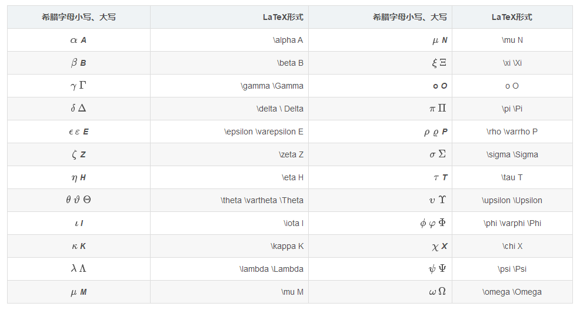
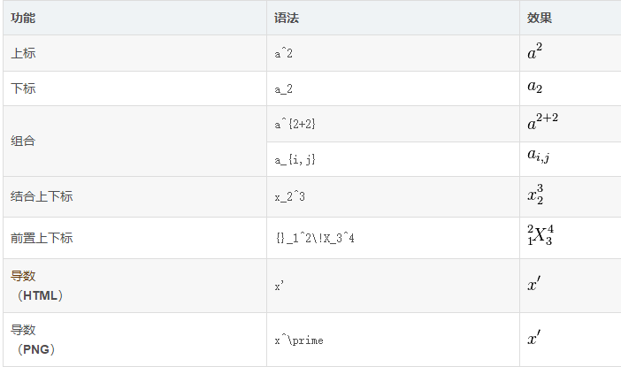

# 安装 
```sh
# 在Ubuntu安装LaTeX的编译器xelatex、中文字体等必需软件
sudo apt-get update
sudo apt-get install texlive-latex-base latex-cjk-all texlive-latex-extra texmaker texlive-xetex texlive-publishers
```
安装LaTeX的VS Code插件 打开VS Code的“插件”（Extensions），搜索框搜索“LaTeX Workshop”，并安装  
配置编译器。点击“插件设置”（Extension Settings），并搜索latex-workshop.latex.recipes。点击“编辑setting.json”（Edit in settings.json），添加以下内容，并保存
```json
"latex-workshop.latex.recipes": [
        {
        "name": "xelatex",
        "tools": [
          "xelatex"
        ]
        },
        {
        "name": "xelatex->bibtex->exlatex*2",
        "tools": [
          "xelatex",
          "bibtex",
          "xelatex",
          "xelatex"
        ]
      }],

    "latex-workshop.latex.tools":[
        {
            "name":"xelatex",
            "command": "xelatex",
            "args": [
                "-synctex=1",
                "-interaction=nonstopmode",
                "-file-line-error",
                "%DOC%"
            ]
        }, 
        {
            "name":"bibtex",
            "command": "bibtex",
            "args": [
            "%DOCFILE%"
            ]
        }
    ]
```
可能需要安装的依赖
```sh
vi /etc/apt/sources.list
# 添加
deb http://mirrors.aliyun.com/ubuntu/ focal main restricted universe multiverse
deb-src http://mirrors.aliyun.com/ubuntu/ focal main restricted universe multiverse
# 执行
apt-get update
apt install python3-pip
python3 -m pip install Pygments
```


1. 公式用\begin{equation} 和 \end{equation}作为开头和结尾，这样会产生公式并标注（1）序号

2. 分数：用要用  \frac{分子}{分母}

3. 希腊字母表  


4. 上标用^下标用_  


5. 求和  
\sum

6. 乘号和点乘  
乘号： \times  
点乘： \cdot