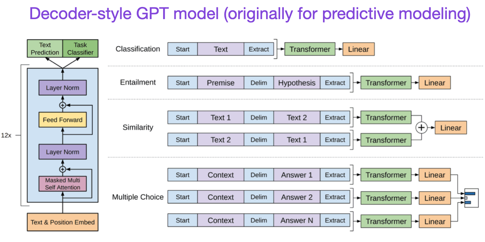

- [Understanding the Main Architecture and Tasks](#understanding-the-main-architecture-and-tasks)
- [Scaling Laws and Improving Efficiency](#scaling-laws-and-improving-efficiency)
- [Alignment – Steering Large Language Models to Intended Goals and Interests](#alignment--steering-large-language-models-to-intended-goals-and-interests)
- [Bonus: Introduction to Reinforcement Learning with Human Feedback (RLHF)](#bonus-introduction-to-reinforcement-learning-with-human-feedback-rlhf)
- [Reading](#reading)

**Understanding Large Language Models -- A Transformative Reading List**

```
Feb 7, 2023 
by Sebastian Raschka
```
Large language models have taken the public attention by storm – no pun intended.
In just half a decade large language models – transformers – have almost
completely changed the field of natural language processing. Moreover,
they have also begun to revolutionize fields such as computer vision and
computational biology.

Since transformers have such a big impact on everyone’s research
agenda, I wanted to flesh out a short reading list (an extended version
of [my comment yesterday](https://www.linkedin.com/feed/update/urn:li:activity:7028449312300834816?commentUrn=urn%3Ali%3Acomment%3A%28activity%3A7028449312300834816%2C7028519126105030656%29&dashCommentUrn=urn%3Ali%3Afsd_comment%3A%287028519126105030656%2Curn%3Ali%3Aactivity%3A7028449312300834816%29)) for machine learning researchers and practitioners getting started.

The following list below is meant to be read mostly chronologically,
and I am entirely focusing on academic research papers. Of course, there
are many additional resources out there that are useful. For example,

* the [Illustrated Transformer](http://jalammar.github.io/illustrated-transformer/) by Jay Alammar;
* a [more technical blog article](https://lilianweng.github.io/posts/2020-04-07-the-transformer-family/) by Lilian Weng;
* [a catalog and family tree](https://amatriain.net/blog/transformer-models-an-introduction-and-catalog-2d1e9039f376/) of all major transformers to date by Xavier Amatriain;
* [a minimal code implementation](https://github.com/karpathy/nanoGPT) of a generative language model for educational purposes by Andrej Karpathy;
* [a lecture series](https://sebastianraschka.com/blog/2021/dl-course.html#l19-self-attention-and-transformer-networks) and[book chapter](https://github.com/rasbt/machine-learning-book/tree/main/ch16) by yours truly.

PS: an extended version of this original list, featuring more papers, can be found here at [https://magazine.sebastianraschka.com/p/understanding-large-language-models](https://magazine.sebastianraschka.com/p/understanding-large-language-models).

# Understanding the Main Architecture and Tasks

If you are new to transformers / large language models, it makes the most sense to start at the beginning.

**(1)** *Neural Machine Translation by Jointly Learning to Align and Translate* (2014) by Bahdanau, Cho, and Bengio, [https://arxiv.org/abs/1409.0473](https://arxiv.org/abs/1409.0473)

I recommend beginning with the above paper if you have a few minutes
to spare. It introduces an attention mechanism for recurrent neural
networks (RNN) to improve long-range sequence modeling capabilities.
This allows RNNs to translate longer sentences more accurately – the
motivation behind developing the original transformer architecture
later.


Source: [https://arxiv.org/abs/1409.0473](https://arxiv.org/abs/1409.0473)

---

**(2)** *Attention Is All You Need* (2017) by Vaswani, Shazeer, Parmar, Uszkoreit, Jones, Gomez, Kaiser, and Polosukhin, [https://arxiv.org/abs/1706.03762](https://arxiv.org/abs/1706.03762)

The paper above introduces the original transformer architecture
consisting of an encoder- and decoder part that will become relevant as
separate modules later. Moreover, this paper introduces concepts such as
the scaled dot product attention mechanism, multi-head attention
blocks, and positional input encoding that remain the foundation of
modern transformers.


Source: [https://arxiv.org/abs/1706.03762](https://arxiv.org/abs/1706.03762)

---

**(3)** *BERT: Pre-training of Deep Bidirectional Transformers for Language Understanding* (2018) by Devlin, Chang, Lee, and Toutanova, [https://arxiv.org/abs/1810.04805](https://arxiv.org/abs/1810.04805)

Following the original transformer architecture, large language model
research started to bifurcate in two directions: encoder-style
transformers for predictive modeling tasks such as text classification
and decoder-style transformers for generative modeling tasks such as
translation, summarization, and other forms of text creation.

The BERT paper above introduces the original concept of
masked-language modeling, and next-sentence prediction remains an
influential decoder-style architecture. If you are interested in this
research branch, I recommend following up with [RoBERTa](https://arxiv.org/abs/1907.11692), which simplified the pretraining objectives by removing the next-sentence prediction tasks.


Source: [https://arxiv.org/abs/1810.04805](https://arxiv.org/abs/1810.04805)

---

**(4)** *Improving Language Understanding by Generative Pre-Training* (2018) by Radford and Narasimhan, [https://www.semanticscholar.org/paper/Improving-Language-Understanding-by-Generative-Radford-Narasimhan/cd18800a0fe0b668a1cc19f2ec95b5003d0a5035](https://www.semanticscholar.org/paper/Improving-Language-Understanding-by-Generative-Radford-Narasimhan/cd18800a0fe0b668a1cc19f2ec95b5003d0a5035)

The original GPT paper introduced the popular decoder-style
architecture and pretraining via next-word prediction. Where BERT can be
considered a bidirectional transformer due to its masked language model
pretraining objective, GPT is a unidirectional, autoregressive model.
While GPT embeddings can also be used for classification, the GPT
approach is at the core of today’s most influential LLMs, such as
chatGPT.

If you are interested in this research branch, I recommend following up with the [GPT-2](https://www.semanticscholar.org/paper/Language-Models-are-Unsupervised-Multitask-Learners-Radford-Wu/9405cc0d6169988371b2755e573cc28650d14dfe) and [GPT-3](https://arxiv.org/abs/2005.14165)
papers. These two papers illustrate that LLMs are capable of zero- and
few-shot learning and highlight the emergent abilities of LLMs. GPT-3 is
also still a popular baseline and base model for training
current-generation LLMs such as ChatGPT – we will cover the InstructGPT
approach that lead to ChatGPT later as a separate entry.



Source: [https://www.semanticscholar.org/paper/Improving-Language-Understanding-by-Generative-Radford-Narasimhan/cd18800a0fe0b668a1cc19f2ec95b5003d0a5035](https://www.semanticscholar.org/paper/Improving-Language-Understanding-by-Generative-Radford-Narasimhan/cd18800a0fe0b668a1cc19f2ec95b5003d0a5035)

---

**(5)** *BART: Denoising Sequence-to-Sequence Pre-training for Natural Language Generation, Translation, and Comprehension* (2019), by Lewis, Liu, Goyal, Ghazvininejad, Mohamed, Levy, Stoyanov, and Zettlemoyer, [https://arxiv.org/abs/1910.13461](https://arxiv.org/abs/1910.13461).

As mentioned earlier, BERT-type encoder-style LLMs are usually
preferred for predictive modeling tasks, whereas GPT-type decoder-style
LLMs are better at generating texts. To get the best of both worlds, the
BART paper above combines both the encoder and decoder parts (not
unlike the original transformer – the second paper in this list).


Source: [https://arxiv.org/abs/1910.13461](https://arxiv.org/abs/1910.13461)
# Scaling Laws and Improving Efficiency

If you want to learn more about the various techniques to improve the efficiency of transformers, I recommend the [2020 *Efficient Transformers: A Survey*](https://arxiv.org/abs/2009.06732) paper followed by the [2023 *A Survey on Efficient Training of Transformers*](https://arxiv.org/abs/2302.01107) paper.

In addition, below are papers that I found particularly interesting and worth reading.

**(6)** *FlashAttention: Fast and Memory-Efficient Exact Attention with IO-Awareness* (2022), by Dao, Fu, Ermon, Rudra, and Ré, [https://arxiv.org/abs/2205.14135](https://arxiv.org/abs/2205.14135).

While most transformer papers don’t bother about replacing the
original scaled dot product mechanism for implementing self-attention,
FlashAttention is one mechanism I have seen most often referenced
lately.


Source: [https://arxiv.org/abs/2205.14135](https://arxiv.org/abs/2205.14135)

---

**(7)** *Cramming: Training a Language Model on a Single GPU in One Day (2022) by Geiping and Goldstein* , [https://arxiv.org/abs/2212.14034](https://arxiv.org/abs/2212.14034).

In this paper, the researchers trained a masked language model /
encoder-style LLM (here: BERT) for 24h on a single GPU. For comparison,
the original 2018 BERT paper trained it on 16 TPUs for four days.
An interesting insight is that while smaller models have higher
throughput, smaller models also learn less efficiently. Thus, larger
models do not require more training time to reach a specific predictive
performance threshold.


Source: [https://arxiv.org/abs/2212.14034](https://arxiv.org/abs/2212.14034)

---

**(8)** *Scaling Down to Scale Up: A Guide to Parameter-Efficient Fine-Tuning (2022)* by Lialin, Deshpande, and Rumshisky, [https://arxiv.org/abs/2303.15647](https://arxiv.org/abs/2303.15647).

Modern large language models that are pretrained on large datasets
show emergent abilities and perform well on various tasks, including
language translation, summarization, coding, and Q&A. However, if we
want to improve the ability of transformers on domain-specific data and
specialized tasks, it’s worthwhile to finetune transformers. This
survey reviews more than 40 papers on parameter-efficient finetuning
methods (including popular techniques such as prefix tuning, adapters,
and low-rank adaptation) to make finetuning (very) computationally
efficient.


Source: [https://arxiv.org/abs/1910.13461](https://arxiv.org/abs/1910.13461)

---

**(9)** *Training Compute-Optimal Large Language Models*
(2022) by Hoffmann, Borgeaud, Mensch, Buchatskaya, Cai, Rutherford, de
Las Casas, Hendricks, Welbl, Clark, Hennigan, Noland, Millican, van den
Driessche, Damoc, Guy, Osindero, Simonyan, Elsen, Rae, Vinyals, and
Sifre, [https://arxiv.org/abs/2203.15556](https://arxiv.org/abs/2203.15556).

This paper introduces the 70-billion parameter Chinchilla model that
outperforms the popular 175-billion parameter GPT-3 model on generative
modeling tasks. However, its main punchline is that contemporary large
language models are “significantly undertrained.”

The paper defines the linear scaling law for large language model
training. For example, while Chinchilla is only half the size of GPT-3,
it outperformed GPT-3 because it was trained on 1.4 trillion (instead of
just 300 billion) tokens. In other words, the number of training tokens
is as vital as the model size.


Source: [https://arxiv.org/abs/2203.15556](https://arxiv.org/abs/2203.15556)
# Alignment – Steering Large Language Models to Intended Goals and Interests

In recent years, we have seen many relatively capable large language
models that can generate realistic texts (for example, GPT-3 and
Chinchilla, among others). It seems that we have reached a ceiling in
terms of what we can achieve with the commonly used pretraining
paradigms.

To make language models more helpful and reduce misinformation and
harmful language, researchers designed additional training paradigms to
fine-tune the pretrained base models.

**(10)**  *Training Language Models to Follow Instructions with Human Feedback*
(2022) by Ouyang, Wu, Jiang, Almeida, Wainwright, Mishkin, Zhang,
Agarwal, Slama, Ray, Schulman, Hilton, Kelton, Miller, Simens, Askell,
Welinder, Christiano, Leike, and Lowe, [https://arxiv.org/abs/2203.02155](https://arxiv.org/abs/2203.02155).

In this so-called InstructGPT paper, the researchers use a
reinforcement learning mechanism with humans in the loop (RLHF). They
start with a pretrained GPT-3 base model and fine-tune it further using
supervised learning on prompt-response pairs generated by humans (Step
1). Next, they ask humans to rank model outputs to train a reward model
(step 2). Finally, they use the reward model to update the pretrained
and fine-tuned GPT-3 model using reinforcement learning via proximal
policy optimization (step 3).

As a sidenote, this paper is also known as the paper describing the
idea behind ChatGPT – according to the recent rumors, ChatGPT is a
scaled-up version of InstructGPT that has been fine-tuned on a larger
dataset.


Source: [https://arxiv.org/abs/2203.02155](https://arxiv.org/abs/2203.02155)

---

**(11)** *Constitutional AI: Harmlessness from AI Feedback*
(2022) by Yuntao, Saurav, Sandipan, Amanda, Jackson, Jones, Chen, Anna,
Mirhoseini, McKinnon, Chen, Olsson, Olah, Hernandez, Drain, Ganguli,
Li, Tran-Johnson, Perez, Kerr, Mueller, Ladish, Landau, Ndousse,
Lukosuite, Lovitt, Sellitto, Elhage, Schiefer, Mercado, DasSarma,
Lasenby, Larson, Ringer, Johnston, Kravec, El Showk, Fort, Lanham,
Telleen-Lawton, Conerly, Henighan, Hume, Bowman, Hatfield-Dodds, Mann,
Amodei, Joseph, McCandlish, Brown, Kaplan, [https://arxiv.org/abs/2212.08073](https://arxiv.org/abs/2212.08073).

In this paper, the researchers are taking the alignment idea one step
further, proposing a training mechanism for creating a “harmless” AI
system. Instead of direct human supervision, the researchers propose a
self-training mechanism that is based on a list of rules (which are
provided by a human). Similar to the InstructGPT paper mentioned above,
the proposed method uses a reinforcement learning approach.


Source: [https://arxiv.org/abs/2212.08073](https://arxiv.org/abs/2212.08073)
# Bonus: Introduction to Reinforcement Learning with Human Feedback (RLHF)

While RLHF (reinforcement learning with human feedback) may not
completely solve the current issues with LLMs, it is currently
considered the best option available, especially when compared to
previous-generation LLMs. It is likely that we will see more creative
ways to apply RLHF to LLMs  other domains.

The two papers above, InstructGPT and Consitutinal AI, make use of
RLHF, and since it is going to be an influential method in the near
future, this section includes additional resources if you want to learn
about RLHF. (To be technicallty correct, the Constitutional AI paper
uses AI instead of human feedback, but it follows a similar concept
using RL.)

**(12)** *Asynchronous Methods for Deep Reinforcement Learning* (2016) by Mnih, Badia, Mirza, Graves, Lillicrap, Harley, Silver, and Kavukcuoglu ([https://arxiv.org/abs/1602.01783](https://arxiv.org/abs/1602.01783)) introduces policy gradient methods as an alternative to Q-learning in deep learning-based RL.

**(13)** *Proximal Policy Optimization Algorithms* (2017) by Schulman, Wolski, Dhariwal, Radford, Klimov ([https://arxiv.org/abs/1707.06347](https://arxiv.org/abs/1707.06347))
presents a modified proximal policy-based reinforcement learning
procedure that is more data-efficient and scalable than the vanilla
policy optimization algorithm above.

**(14)** *Fine-Tuning Language Models from Human Preferences* (2020) by Ziegler, Stiennon, Wu, Brown, Radford, Amodei, Christiano, Irving ([https://arxiv.org/abs/1909.08593](https://arxiv.org/abs/1909.08593))
illustrates the concept of PPO and reward learning to pretrained
language models including KL regularization to prevent the policy from
diverging too far from natural language.

**(15)** *Learning to Summarize from Human Feedback* (2022) by Stiennon, Ouyang, Wu, Ziegler, Lowe, Voss, Radford, Amodei, Christiano [https://arxiv.org/abs/2009.01325](https://arxiv.org/abs/2009.01325) introduces the popular RLHF three-step procedure:

1. pretraining GPT-3
2. fine-tuning it in a supervised fashion, and
3. training a reward model also in a supervised fashion. The
   fine-tuned model is then trained using this reward model with proximal
   policy optimization.

This paper also shows that reinforcement learning with proximal
policy optimization results in better models than just using regular
supervised learning.


Source: [https://arxiv.org/abs/2009.01325](https://arxiv.org/abs/2009.01325)

**(16)**  *Training Language Models to Follow Instructions with Human Feedback*
(2022) by Ouyang, Wu, Jiang, Almeida, Wainwright, Mishkin, Zhang,
Agarwal, Slama, Ray, Schulman, Hilton, Kelton, Miller, Simens, Askell,
Welinder, Christiano, Leike, and Lowe ([https://arxiv.org/abs/2203.02155](https://arxiv.org/abs/2203.02155)), also known as *InstructGPT paper* )uses
a similar three-step procedure for RLHF as above, but instead of
summarizing text, it focuses on generating text based on human
instructions. Also, it uses a labeler to rank the outputs from best to
worst (instead of just a binary comparison between human- and
AI-generated texts).

# Reading

I tried to keep the list above nice and concise, focusing on the
top-10 papers (plus 3 bonus papers on RLHF) to understand the design,
constraints, and evolution behind contemporary large language models.

For further reading, I suggest following the references in the papers
mentioned above. Or, to give you some additional pointers, here are
some additional resources:

**Open-source alternatives to GPT**

* *BLOOM: A 176B-Parameter Open-Access Multilingual Language Model* (2022),[https://arxiv.org/abs/2211.05100](https://arxiv.org/abs/2211.05100)
* *OPT: Open Pre-trained Transformer Language Models* (2022),[https://arxiv.org/abs/2205.01068](https://arxiv.org/abs/2205.01068)

**ChatGPT alternatives**

* *LaMDA: Language Models for Dialog Applications* (2022),[https://arxiv.org/abs/2201.08239](https://arxiv.org/abs/2201.08239)
* (Sparrow)*Improving Alignment of Dialogue Agents via Targeted Human Judgements* (2022),[https://arxiv.org/abs/2209.14375](https://arxiv.org/abs/2209.14375)
* *BlenderBot 3: A Deployed Conversational Agent that Continually Learns to Responsibly Rngage* ,[https://arxiv.org/abs/2208.03188](https://arxiv.org/abs/2208.03188)

**Large language models in computational biology**

* *ProtTrans: Towards Cracking the Language of Life’s Code Through Self-Supervised Deep Learning and High Performance Computing* (2021),[https://arxiv.org/abs/2007.06225](https://arxiv.org/abs/2007.06225)
* *Highly Accurate Protein Structure Prediction with AlphaFold* (2021),[https://www.nature.com/articles/s41586-021-03819-2](https://www.nature.com/articles/s41586-021-03819-2)
* *Large Language Models Generate Functional Protein Sequences Across Diverse Families* (2023),[https://www.nature.com/articles/s41587-022-01618-2](https://www.nature.com/articles/s41587-022-01618-2)
