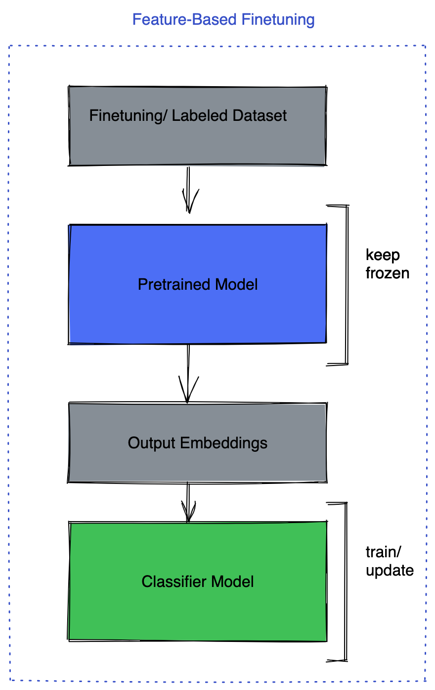
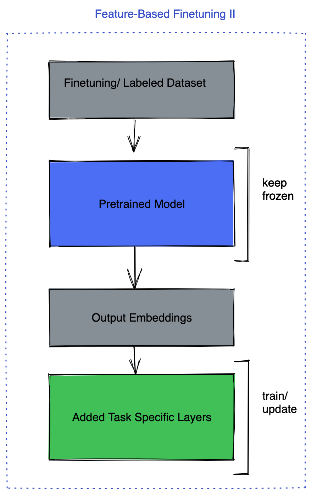

- [官网](#官网)
- [LLAMA 2 微调教程](#llama-2-微调教程)
  - [单GPU、int8、LoRA的微调教程](#单gpuint8lora的微调教程)
- [LLM Finetuning 讲解](#llm-finetuning-讲解)
  - [1. Parameter Efficient Model Finetuning](#1-parameter-efficient-model-finetuning)
  - [2. Full/ Partial Parameter Finetuning](#2-full-partial-parameter-finetuning)
    - [FSDP (FUlly Sharded Data Parallel)](#fsdp-fully-sharded-data-parallel)
- [PEFT: Parameter-Efficient Fine-Tuning of Billion-Scale Models on Low-Resource Hardware](#peft-parameter-efficient-fine-tuning-of-billion-scale-models-on-low-resource-hardware)

# 官网

https://github.com/facebookresearch/llama

# LLAMA 2 微调教程

https://github.com/facebookresearch/llama-recipes

## 单GPU、int8、LoRA的微调教程

https://github.com/facebookresearch/llama-recipes/blob/main/quickstart.ipynb

- Step 0: Install pre-requirements and convert checkpoint
- Step 1: Load the model
- Step 2: Load the preprocessed dataset
- Step 3: Check base model
- Step 4: Prepare model for PEFT
- Step 5: Define an optional profiler
- Step 6: Fine tune the model
- Step 7: Save model checkpoint
- Step 8: Try the fine tuned model on the same example again to see the learning progress

# LLM Finetuning 讲解

Here we discuss finetuning Llama 2 with a couple of different recipes. We will cover two scenarios here:

## 1. Parameter Efficient Model Finetuning

This helps make the fine-tuning process more affordable even on 1 consumer grade GPU. These methods enable us to keep the whole model frozen and to just add tiny learnable parameters/ layers into the model. In this way, we just train a very tiny portion of the parameters. The most famous method in this category is LORA, LLaMA Adapter and Prefix-tuning.

These methods will address three aspects:

- Cost of full finetuning – these methods only train a small set of extra parameters instead of the full model, this makes it possible to run these on consumer GPUs.
- Cost of deployment – for each fine-tuned downstream model we need to deploy a separate model; however, when using these methods, only a small set of parameters (few MB instead of several GBs) of the pretrained model can do the job. In this case, for each task we only add these extra parameters on top of the pretrained model so pretrained models can be assumed as backbone and these parameters as heads for the model on different tasks.
- Catastrophic forgetting — these methods also help with forgetting the first task that can happen in finetunings.

HF PEFT library provides an easy way of using these methods which we make use of here. Please read more here.

## 2. Full/ Partial Parameter Finetuning

Full parameter finetuning has its own advantages, in this method there are multiple strategies that can help:

- Keep the pretrained model frozen and only finetune the task head for example, the classifier model.
- Keep the pretrained model frozen and add a few fully connected layers on the top.
- Finetuning on all the layers.

You can also keep most of the layers frozen and only finetune a few layers. There are many different techniques to choose from to freeze/unfreeze layers based on different criteria.
Image 1 Image 2 Image 3

<div style="display: flex;">
    
    
    
</div>

In this scenario depending on the model size, you might need to go beyond one GPU, especially if your model does not fit into one GPU for training. In this case Llama 2 7B parameter won't fit into one gpu. The way you want to think about it is, you would need enough GPU memory to keep model parameters, gradients and optimizer states. Where each of these, depending on the precision you are training, can take up multiple times of your parameter count x precision( depending on if its fp32/ 4 bytes, fp16/2 bytes/ bf16/2 bytes). For example AdamW optimizer keeps 2 parameters for each of your parameters and in many cases these are kept in fp32. This implies that depending on how many layers you are training/ unfreezing your GPU memory can grow beyond one GPU.

### FSDP (FUlly Sharded Data Parallel)

Pytorch has the FSDP package for training models that do not fit into one GPU. FSDP lets you train a much larger model with the same amount of resources. Prior to FSDP was DDP (Distributed Data Parallel) where each GPU was holding a full replica of the model and would only shard the data. At the end of backward pass it would sync up the gradients.

FSDP extends this idea, not only sharding the data but also model parameters, gradients and optimizer states. This means each GPU will only keep one shard of the model. This will result in huge memory savings that enable us to fit a much larger model into the same number of GPU. As an example in DDP the most you could fit into a GPU with 16GB memory is a model around 700M parameters. So, suppose you had 4 GPUs, in this case even though you access 4 GPUs, you still can't scale beyond the model size that can fit into one GPU. However with FSDP you can fit a 3B model into 4 GPUs, > 4x larger model.

Please read more on FSDP here.

To boost the performance of fine-tuning with FSDP, we can make use a number of features such as:

- **Mixed Precision** which in FSDP is much more flexible compared to Autocast. It gives user control over setting precision for model parameters, buffers and gradients.
- **Activation Checkpointing** which is a technique to save memory by discarding the intermediate activation in forward pass instead of keeping it in the memory with the cost recomputing them in the backward pass. FSDP Activation checkpointing is shard aware meaning we need to apply it after wrapping the model with FSDP. In our script we are making use of that.
- **auto_wrap_policy** Which is the way to specify how FSDP would partition the model, there is default support for transformer wrapping policy. This allows FSDP to form each FSDP unit ( partition of the model ) based on the transformer class in the model. To identify this layer in the model, you need to look at the layer that wraps both the attention layer and MLP. This helps FSDP have more fine-grained units for communication that help with optimizing the communication cost.

# PEFT: Parameter-Efficient Fine-Tuning of Billion-Scale Models on Low-Resource Hardware

https://huggingface.co/blog/peft

## Training your model using 🤗 PEFT

Let's consider the case of fine-tuning [`bigscience/mt0-large`](https://huggingface.co/bigscience/mt0-large) using LoRA.

1. Let's get the necessary imports

```diff
  from transformers import AutoModelForSeq2SeqLM
+ from peft import get_peft_model, LoraConfig, TaskType
  model_name_or_path = "bigscience/mt0-large"
  tokenizer_name_or_path = "bigscience/mt0-large"
```

2. Creating config corresponding to the PEFT method

```py
peft_config = LoraConfig(
    task_type=TaskType.SEQ_2_SEQ_LM, inference_mode=False, r=8, lora_alpha=32, lora_dropout=0.1
)
```

3. Wrapping base 🤗 Transformers model by calling`get_peft_model`

```diff
  model = AutoModelForSeq2SeqLM.from_pretrained(model_name_or_path)
+ model = get_peft_model(model, peft_config)
+ model.print_trainable_parameters()
# output: trainable params: 2359296 || all params: 1231940608 || trainable%: 0.19151053100118282
```

That's it! The rest of the training loop remains the same. Please refer example [peft_lora_seq2seq.ipynb](https://github.com/huggingface/peft/blob/main/examples/conditional_generation/peft_lora_seq2seq.ipynb) for an end-to-end example.

4. When you are ready to save the model for inference, just do the following.

```py
model.save_pretrained("output_dir") 
# model.push_to_hub("my_awesome_peft_model") also works
```

This will only save the incremental PEFT weights that were trained. For example, you can find the `bigscience/T0_3B` tuned using LoRA on the `twitter_complaints` raft dataset here: [smangrul/twitter_complaints_bigscience_T0_3B_LORA_SEQ_2_SEQ_LM](https://huggingface.co/smangrul/twitter_complaints_bigscience_T0_3B_LORA_SEQ_2_SEQ_LM). Notice that it only contains 2 files: adapter_config.json and adapter_model.bin with the latter being just 19MB.

5. To load it for inference, follow the snippet below:

```diff
  from transformers import AutoModelForSeq2SeqLM
+ from peft import PeftModel, PeftConfig

  peft_model_id = "smangrul/twitter_complaints_bigscience_T0_3B_LORA_SEQ_2_SEQ_LM"
  config = PeftConfig.from_pretrained(peft_model_id)
  model = AutoModelForSeq2SeqLM.from_pretrained(config.base_model_name_or_path)
+ model = PeftModel.from_pretrained(model, peft_model_id)
  tokenizer = AutoTokenizer.from_pretrained(config.base_model_name_or_path)

  model = model.to(device)
  model.eval()
  inputs = tokenizer("Tweet text : @HondaCustSvc Your customer service has been horrible during the recall process. I will never purchase a Honda again. Label :", return_tensors="pt")

  with torch.no_grad():
      outputs = model.generate(input_ids=inputs["input_ids"].to("cuda"), max_new_tokens=10)
      print(tokenizer.batch_decode(outputs.detach().cpu().numpy(), skip_special_tokens=True)[0])
# 'complaint'
```

## Next steps

We've released PEFT as an efficient way of tuning large LLMs on downstream tasks and domains, saving a lot of compute and storage while achieving comparable performance to full finetuning. In the coming months, we'll be exploring more PEFT methods, such as (IA)3 and bottleneck adapters. Also, we'll focus on new use cases such as INT8 training of [`whisper-large`](https://huggingface.co/openai/whisper-large) model in Google Colab and tuning of RLHF components such as policy and ranker using PEFT approaches.

In the meantime, we're excited to see how industry practitioners apply PEFT to their use cases - if you have any questions or feedback, open an issue on our [GitHub repo](https://github.com/huggingface/peft) 🤗.

Happy Parameter-Efficient Fine-Tuning!
