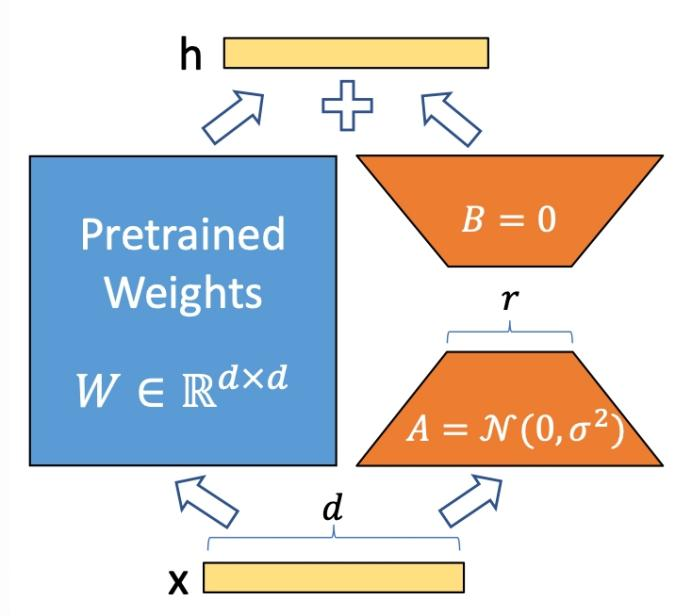
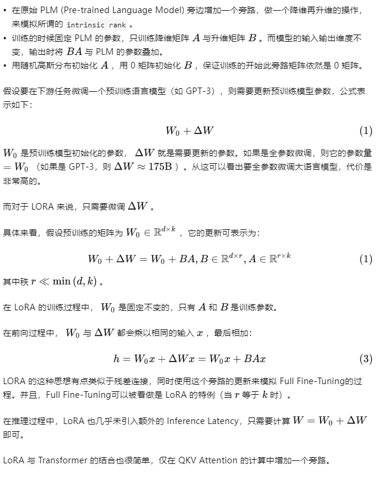
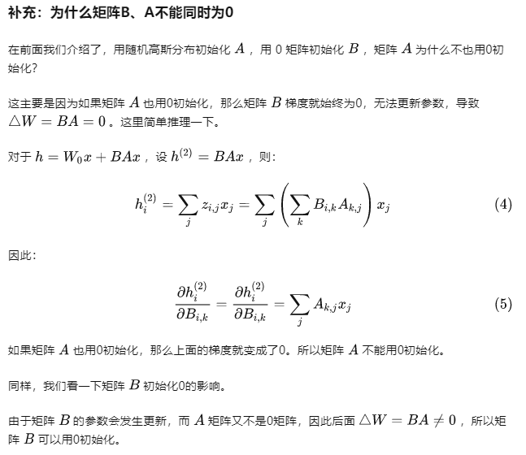

# LoRA微调
LoRA 是一种新技术，它的全称是 Low-Rank Adaptation of Large Language Models，直译为大语言模型的低阶适应。这是微软研究人员为了解决大语言模型微调而开发的一项技术1。LoRA 的基本原理是冻结预训练好的模型权重参数，在冻结原模型参数的情况下，通过往模型中加入额外的网络层，并只训练这些新增的网络层参数。由于这些新增参数数量较少，这样不仅 finetune 的成本显著下降，还能获得和全模型微调类似的效果。

# 微调主流方法
那些小公司或者个人，又怎么能够利用这些开源的大模型，在自己的数据上继续训练，从而应用于自己的业务场景？有没有低成本的方法微调大模型？

答案是有的。
- 目前主流的方法包括2019年 Houlsby N 等人提出的 Adapter Tuning，
- 2021年微软提出的 LORA
- 斯坦福提出的 Prefix-Tuning
- 谷歌提出的 Prompt Tuning
- 2022年清华提出的 P-tuning v2。

这些方法都有各自的特点，从个人使用情况来说，LORA 的效果会好于其它几种方法。其它方法都有各自的一些问题：

- Adapter Tuning 增加了模型层数，引入了额外的推理延迟
- Prefix-Tuning 难于训练，且预留给 Prompt 的序列挤占了下游任务的输入序列空间，影响模型性能
- P-tuning v2 很容易导致旧知识遗忘，微调之后的模型，在之前的问题上表现明显变差

基于上述背景，LORA 得益于前人的一些关于内在维度（intrinsic dimension）的发现：

    模型是过参数化的，它们有更小的内在维度，模型主要依赖于这个低的内在维度（low intrinsic dimension）去做任务适配。
    假设模型在任务适配过程中权重的改变量是低秩（low rank）的，由此提出低秩自适应（LoRA）方法。

LoRA 允许我们通过优化适应过程中密集层变化的秩分解矩阵，来间接训练神经网络中的一些密集层，同时保持预先训练的权重不变。

## 低秩矩阵
是指矩阵的秩较小。秩是指矩阵中线性无关的行或列的最大数量。举个例子，假设我们有一个3x3的矩阵，它的行和列都是线性无关的，那么它的秩就是3。但是，如果其中一行或一列可以由其他行或列线性组合得到，那么这个矩阵就不再是满秩的，它的秩就会小于3。这样的矩阵就可以称为低秩矩阵。

低秩矩阵在实际应用中非常有用。例如，在图像处理中，一张图片可以看作一个矩阵，其中每个元素代表一个像素点的颜色值。如果这张图片中有很多相似的区域，那么它所对应的矩阵就可能是低秩的。这意味着我们可以用更少的信息来表示这张图片，从而实现图像压缩。此外，在机器学习和数据挖掘领埴中，低秩矩阵分解也被广泛应用于降维、特征提取和推荐系统等问题。

# LoRA 的思想

-------------------------------

-------------------------------

-------------------------------

# LORA 开源实现
目前 LORA 已经被 HuggingFace 集成在了 PEFT（Parameter-Efficient Fine-Tuning） 代码库里。

使用也非常简单，比如我们使用 LORA 微调 BigScience 机器翻译模型：
```python
from transformers import AutoModelForSeq2SeqLM
from peft import get_peft_config, get_peft_model, LoraConfig, TaskType
model_name_or_path = "bigscience/mt0-large"
tokenizer_name_or_path = "bigscience/mt0-large"

peft_config = LoraConfig(
    task_type=TaskType.SEQ_2_SEQ_LM, inference_mode=False, r=8, lora_alpha=32, lora_dropout=0.1
)

model = AutoModelForSeq2SeqLM.from_pretrained(model_name_or_path)
model = get_peft_model(model, peft_config)
model.print_trainable_parameters()
# output: trainable params: 2359296 || all params: 1231940608 || trainable%: 0.
```
模型微调好之后，加载也非常简单，只需要额外加载 LORA 参数：
```python
model.load_state_dict(torch.load(peft_path), strict=False)
```
# 参考：
1、https://zhuanlan.zhihu.com/p/623543497

https://zhuanlan.zhihu.com/p/642061865