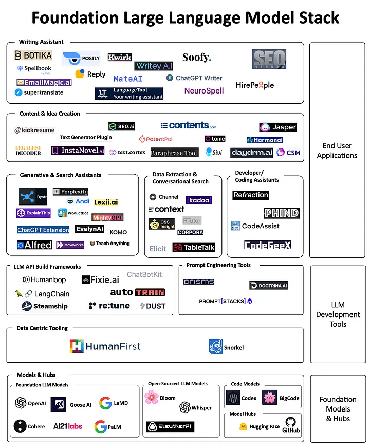

- [LLaMA-7b](#llama-7b)
  - [模型介绍](#模型介绍)
  - [快速使用](#快速使用)
  - [相关信息](#相关信息)
- [ChatGLM2-6B](#chatglm2-6b)
  - [github](#github)
  - [个人体验](#个人体验)
- [OpenAI的github](#openai的github)
- [The Foundation Large Language Model (LLM) \& Tooling Landscape](#the-foundation-large-language-model-llm--tooling-landscape)
- [一些在线模型体验](#一些在线模型体验)
- [llama 2 在线体验](#llama-2-在线体验)
- [claude](#claude)
- [HuggingFace的模型分类](#huggingface的模型分类)

# LLaMA-7b

https://www.heywhale.com/mw/dataset/645b3cec7bf24f1c684d2153/content

## 模型介绍

llama是大模型研究领域内最热门的基座模型，由facebook开源。时下热点的vicuna，koala等模型都是在llama的基础上训练的。 LLaMA是一个自动回归的语言模型，基于transformer结构。

Facebook称LLaMA模型是一个从7B到65B参数的基础语言模型的集合。在数万亿个token上训练们的模型，并表明可以完全使用公开可用的数据集来训练最先进的模型，特别是，LLaMA-13B在大多数基准测试中的表现优于GPT-3（175B）。

LLaMA的主要用途是研究大型语言模型，包括：探索潜在的应用，如问题回答、自然语言理解或阅读理解，了解当前语言模型的能力和限制，并开发技术来改进这些模型，评估和减轻偏见、风险、有毒和有害内容的产生，幻觉。

该模型使用以下数据源进行训练： CCNet[67%], C4[15%], GitHub[4.5%], Wikipedia[4.5%],
Books[4.5%], ArXiv[2.5%], Stack
Exchange[2%]。维基百科和书籍领域包括以下语言的数据：BG，CA，CS，DA，DE，EN，ES，FR，HR，HU，IT，NL，PL，PT，RO，RU，SL，SR，SV，UK。

本仓库上传了llama的7b版本

## 快速使用

```python
from transformers import AutoModelForCausalLM, AutoTokenizer
model = AutoModelForCausalLM.from_pretrained("your model path")
tokenizer = AutoTokenizer.from_pretrained("your model path")

input = "hello, "

input = tokenizer(input, return_tensors='pt')
output = model(**input)
output = tokenizer.decode(output)
```

## 相关信息

github： [https://github.com/facebookresearch/llama](https://github.com/facebookresearch/llama)

paper：[https://arxiv.org/abs/2302.13971](https://arxiv.org/abs/2302.13971)

huggingface：
https://www.thoughtco.com/thmb/wyZ8cwAyrjvSihyt3JxWS2xw7Pk=/1500x0/filters:no_upscale\(\):max_bytes\(150000\):strip_icc\(\):format\(webp\)/125176351-57ab52f35f9b58974a077a94.jpg

# ChatGLM2-6B

## github

https://github.com/THUDM/ChatGLM2-6B

## 个人体验

真的不错，决定用它来训练 NL2SQL

# OpenAI的github

https://github.com/openai/

# The Foundation Large Language Model (LLM) & Tooling Landscape



# 一些在线模型体验

https://chat.lmsys.org/

# llama 2 在线体验

https://huggingface.co/chat/

chinese微调版
https://llama.family/

Llama2-Chinese
https://github.com/FlagAlpha/Llama2-Chinese

# claude
https://claude.ai/login


# HuggingFace的模型分类


| Multimodal                     |          |      |
| ------------------------------ | -------------- | --------------------- |
| Feature Extraction             | 特征提取       | 机器学习/人工智能     |
| Text-to-Image                  | 文本到图像转换 | 图像处理/自然语言处理 |
| Image-to-Text                  | 图像到文本转换 | 图像处理/自然语言处理 |
| Text-to-Video                  | 文本到视频转换 | 视频处理/自然语言处理 |
| Visual Question Answering      | 视觉问答       | 图像处理/自然语言处理 |
| Document Question Answering    | 文档问答       | 文本处理/自然语言处理 |
| Graph Machine Learning         | 图机器学习     | 图数据处理/机器学习   |

| Computer Vision                |      |             |
| ------------------------------ | -------------- | --------------------- |
| Depth Estimation               | 深度估计       | 计算机视觉            |
| Image Classification           | 图像分类       | 计算机视觉            |
| Object Detection               | 目标检测       | 计算机视觉            |
| Image Segmentation             | 图像分割       | 计算机视觉            |
| Image-to-Image                 | 图像到图像转换 | 计算机视觉            |
| Unconditional Image Generation | 无条件图像生成 | 计算机视觉            |
| Video Classification           | 视频分类       | 视频处理/机器学习     |
| Zero-Shot Image Classification | 零样本图像分类 | 计算机视觉            |

| Natural Language Processing    |    |           |
| ------------------------------ | -------------- | --------------------- |
| Text Classification            | 文本分类       | 文本处理/自然语言处理 |
| Token Classification           | 标记分类       | 文本处理/自然语言处理 |
| Table Question Answering       | 表格问答       | 表格处理/自然语言处理 |
| Question Answering             | 问答系统       | 自然语言处理          |
| Zero-Shot Classification       | 零样本分类     | 机器学习/自然语言处理 |
| Translation                    | 翻译           | 自然语言处理          |
| Summarization                  | 文本摘要       | 自然语言处理          |
| Conversational                 | 会话式对话     | 自然语言处理          |
| Text Generation                | 文本生成       | 自然语言处理          |
| Text2Text Generation           | 文本到文本生成 | 自然语言处理          |
| Fill-Mask                      | 填充遮罩       | 自然语言处理          |
| Sentence Similarity            | 句子相似度     | 自然语言处理          |

| Audio                          |            |               |
| ------------------------------ | -------------- | --------------------- |
| Text-to-Speech                 | 文本到语音转换 | 音频处理/自然语言处理 |
| Automatic Speech Recognition   | 自动语音识别   | 音频处理/自然语言处理 |
| Audio-to-Audio                 | 音频到音频转换 | 音频处理              |
| Audio Classification           | 音频分类       | 音频处理              |
| Voice Activity Detection       | 语音活动检测   | 音频处理              |

| Tabular                        |            |               |
| ------------------------------ | -------------- | --------------------- |
| Tabular Classification         | 表格分类       | 表格处理/机器学习     |
| Tabular Regression             | 表格回归       | 表格处理/机器学习     |

| Reinforcement Learning         |        |               |
| ------------------------------ | -------------- | --------------------- |
| Robotics                       | 机器人         | 机器学习/自动化       |

