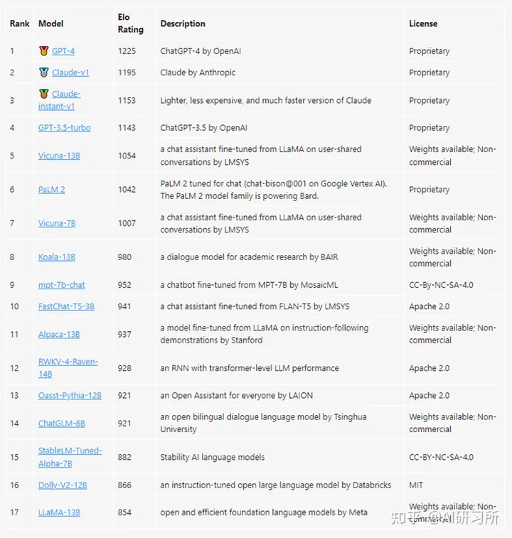
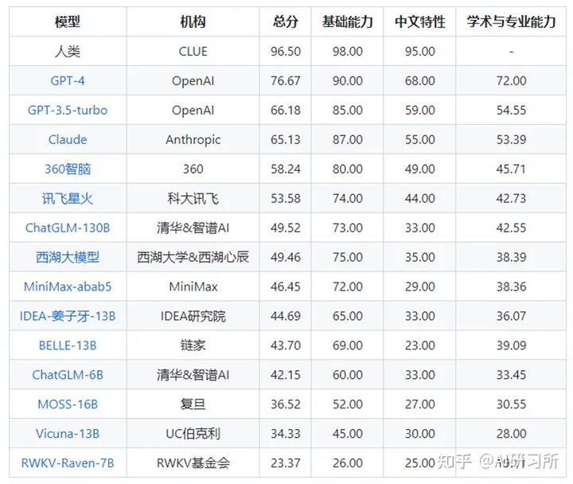
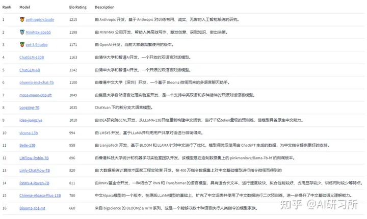
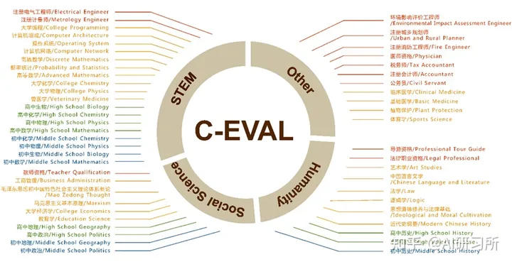
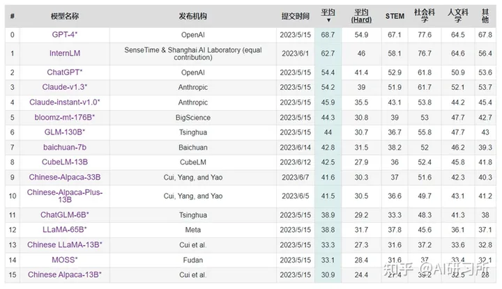
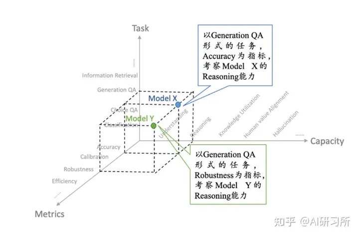
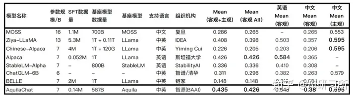

- [**ChatbotArena：借鉴游戏排位赛机制，让人类对模型两两评价**](#chatbotarena借鉴游戏排位赛机制让人类对模型两两评价)
- [**SuperCLUE：中文通用大模型综合性评测基准，尝试全自动测评大模型**](#superclue中文通用大模型综合性评测基准尝试全自动测评大模型)
- [**C-Eval：采用 1.4 万道涵盖 52 个学科的选择题，评估模型中文能力**](#c-eval采用-14-万道涵盖-52-个学科的选择题评估模型中文能力)
- [**FlagEval：采用“能力—任务—指标”三维评测框架**](#flageval采用能力任务指标三维评测框架)

从大模型涌现之初，研究者们就千方百计地来测试模型的性能，利用人工打分，制作测试题集，利用GPT-4评估……随着越来越多的模型发布和开源，迫切需要科学、公正、开放、标准的评测基准及工具来帮助人们更深刻的理解和认识模，评估模型性能。本篇为大家介绍目前海内外较为知名的大模型测评方法。

### **ChatbotArena：借鉴游戏排位赛机制，让人类对模型两两评价**

ChatbotArena是一个大型语言模型 (LLM) 的基准平台，该项目方LMSYS Org是由加州大学伯克利分校、加州大学圣地亚哥分校和卡内基梅隆大学合作创立的研究组织。

ChatbotArena以众包方式让不同的大模型产品进行匿名、随机的对抗测评，其评级基于国际象棋等竞技游戏中广泛使用的Elo评分系统，Elo是一种计算玩家相对技能水平的方法，通过两名玩家之间的评分差异可以预测比赛的结果。评分结果通过用户投票产生，系统每次会随机选择两个不同的大模型机器人和用户聊天，并让用户在匿名的情况下选择哪款大模型产品的表现更好一些。

```text
项目地址：https://github.com/lm-sys/FastChat
网站：https://chat.lmsys.org/
```

**ChatbotArena最新排行榜**



### **SuperCLUE：中文通用大模型综合性评测基准，尝试全自动测评大模型**

SuperCLUE，是针对中文可用的通用大模型的一个测评基准。着眼于综合评价大模型的能力，使其能全面地测试大模型的效果，又能考察模型在中文特有任务上的理解和积累，SuperCLUE从三个不同的维度评价模型的能力：基础能力、专业能力和中文特性能力。SuperCLUE的特点包括：多个维度能力考察（3大类，70+子能力）、

自动化测评（一键测评）、广泛的代表性模型（9个模型）、人类基准。

SuperCLUE琅琊榜，中文通用大模型匿名对战评价基准，与ChatbotArena相同以众包方式让不同的大模型产品进行匿名、随机的对抗测评，结果基于Elo评级系统。

```text
项目地址：
SuperCLUE ：https://github.com/CLUEbenchmark/SuperCLUE
SuperCLUE琅琊榜：https://github.com/CLUEbenchmark/SuperCLUElyb
网站：https://www.cluebenchmarks.com/
```

**SuperCLUE最新排行榜**



**SuperCLUE琅琊榜最新排行榜**



### **C-Eval：采用 1.4 万道涵盖 52 个学科的选择题，评估模型中文能力**

C-Eval项目由上海交通大学，清华大学，爱丁堡大学共同完成。旨在构造一个中文的，有足够区分度的，多学科的基准榜单，来辅助开发者们研发中文大模型。C-Eval花了大概三个月的时间，构造了一个覆盖人文，社科，理工，其他专业四个大方向，52 个学科（微积分，线代 …），从中学到大学研究生以及职业考试，一共 13948 道题目的中文知识和推理型测试集，来帮助中文社区研发大模型。

C-Eval 包含的科目（四个颜色代表四个难度等级：初中、高中、大学和专业）



```text
项目地址：https://github.com/SJTU-LIT/ceval
网站：https://cevalbenchmark.com/
```

**C-Eval 最新排行榜**



### **FlagEval：采用“能力—任务—指标”三维评测框架**

FlagEval（天秤）由智源研究院将联合多个高校团队打造，是一种采用“能力—任务—指标”三维评测框架的大模型评测平台，旨在提供全面、细致的评测结果。该平台已提供了 30 多种能力、5 种任务和 4 大类指标，共 600 多个维度的全面评测，任务维度包括 22 个主客观评测数据集和 84433 道题目。

FlagEval（天秤）第一期已推出大语言模型评测体系、开源多语言文图大模型评测工具mCLIP-Eval 和开源文图生成评测工具 ImageEval。天秤平台还将继续探索语言大模型评测与心理学、教育学、伦理学等社会学科的交叉研究，以期更加科学、全面地评价语言大模型。FlagEval 针对大模型开发者和使用者，旨在帮助各个开发团队了解自身模型的薄弱之处，并推动技术创新。

**能力—任务—指标”三维评测体系**



```text
项目地址：https://github.com/FlagOpen/FlagEval
网站：https://flageval.baai.ac.cn/
```

**FlagEval最新排行榜**



发布于 2023-06-15 19:22・IP 属地上海
