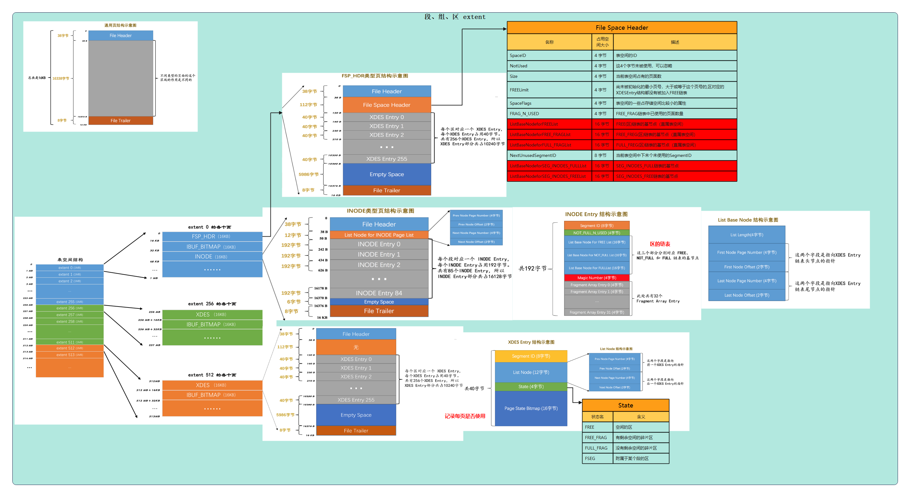
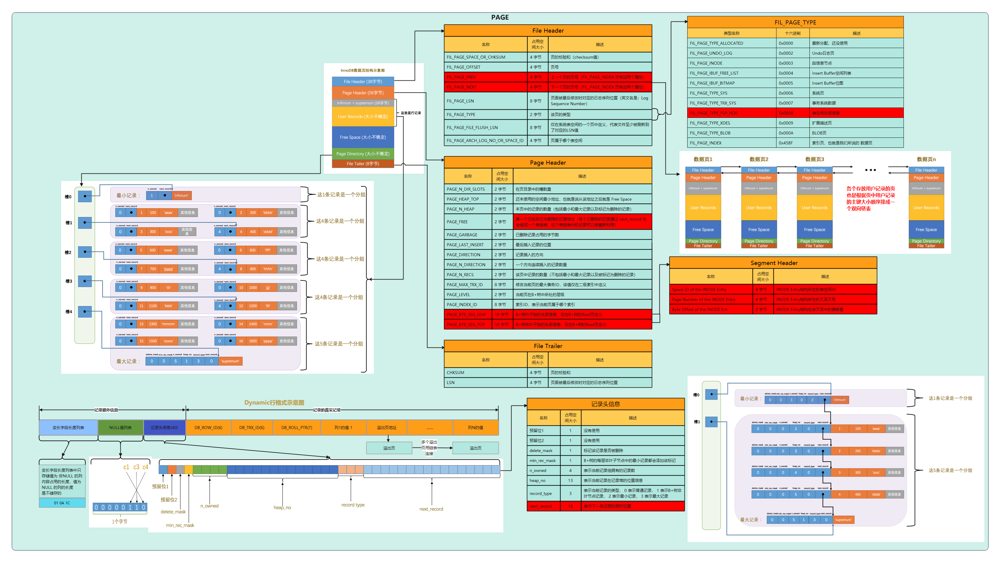
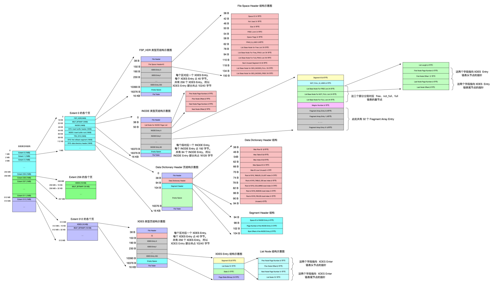
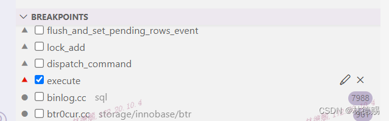

- [画架构图背景](#画架构图背景)
- [INNODB物理用户表空间整体架构图](#innodb物理用户表空间整体架构图)
- [INNODB 物理INDEX PAGE整体架构图](#innodb-物理index-page整体架构图)
- [INNODB 物理系统表空间整体架构图](#innodb-物理系统表空间整体架构图)
- [问题：PAGE\_NO跟物理数据文件是什么关系](#问题page_no跟物理数据文件是什么关系)
- [8.0.30源码分析PAGE\_NO跟物理数据文件关系](#8030源码分析page_no跟物理数据文件关系)
  - [构造数据](#构造数据)
  - [debug package的尝试：失败](#debug-package的尝试失败)
  - [源码调式](#源码调式)
- [参考](#参考)

# 画架构图背景
最近开始学习MYSQL的INNODB文件系统整体架构，书本上的文章都是一段一段地讲解，架构图比较零散，很容易看到后面就忘了前面的知识点。于是决定努力用一张图画出整体架构，方便自己以后忘记时快速查看。


# INNODB物理用户表空间整体架构图

# INNODB 物理INDEX PAGE整体架构图

# INNODB 物理系统表空间整体架构图

# 问题：PAGE_NO跟物理数据文件是什么关系
翻完《mysql是怎样运行的》整本书、查看了很多网上的文章，始终理不清MYSQL是怎么根据space_id跟page_no找到对应的物理数据页。

查阅官方内部参考文章《[MySQL :: MySQL Internals Manual :: 22.2.1.1 Fil Header](https://dev.mysql.com/doc/internals/en/innodb-fil-header.html "MySQL :: MySQL Internals Manual :: 22.2.1.1 Fil Header")》

| `FIL_PAGE_OFFSET` | 4 | ordinal page number from start of space |
| ------------------- | - | --------------------------------------- |

还是一头雾水。

猜测：难道page_no*数据页大小就是文件里偏移量？

决定动手调式源码解疑。

# 8.0.30源码分析PAGE_NO跟物理数据文件关系

## 构造数据
```sql
drop table if exists ldc;
create table ldc(id int primary key,ye varchar(12) default 'hello world');
 
insert into ldc(id) values (1),(2),(3),(4);
insert into ldc(id) select id+4 from ldc;
insert into ldc(id) select id+8 from ldc;
insert into ldc(id) select id+16 from ldc;
insert into ldc(id) select id+32 from ldc;
insert into ldc(id) select id+64 from ldc;
insert into ldc(id) select id+128 from ldc;
insert into ldc(id) select id+256 from ldc;
insert into ldc(id) select id+512 from ldc;
insert into ldc(id) select id+1024 from ldc;
insert into ldc(id) select id+2048 from ldc;
insert into ldc(id) select id+4096 from ldc;
insert into ldc(id) select id+8192 from ldc;
insert into ldc(id) select id+16384 from ldc;
insert into ldc(id) select id+32768 from ldc;
insert into ldc(id) select id+34464 from ldc where id>=31073;
```
然后重启mysql，确保下次select记录时，需要从DISK读取。
## debug package的尝试：失败
希望通过trace文件获取到IO的信息，发现根本没有打印IO相关的栈调用日志。失败。
```sql
set debug = 'd,info:n:N:F:i:L:o,/tmp/mysqld.trace';
select * from ldc where id=100000;
```
## 源码调式
重启数据库后，直接使用execute函数下断点

然后执行
```sql
select * from ldc where id=100000;
```
经过根据函数名的一番猜测和调试，终于定位到PAGE_NO跟物理数据文件关系。可以看出：page_no*数据页大小=文件里偏移量
```sql
storage/innobase/fil/fil0fil.cc:7824
  auto offset = (os_offset_t)page_no * page_size.physical();
```
整个栈的调用关系：
```cpp
Fil_shard::do_io(Fil_shard * const this, const IORequest & type, bool sync, const page_id_t & page_id, const page_size_t & page_size, ulint byte_offset, ulint len, void * buf, void * message) (\data\mysql-8.0.30\storage\innobase\fil\fil0fil.cc:7826)
fil_io(const IORequest & type, bool sync, const page_id_t & page_id, const page_size_t & page_size, ulint byte_offset, ulint len, void * buf, void * message) (\data\mysql-8.0.30\storage\innobase\fil\fil0fil.cc:7981)
buf_read_page_low(dberr_t * err, bool sync, ulint type, ulint mode, const page_id_t & page_id, const page_size_t & page_size, bool unzip) (\data\mysql-8.0.30\storage\innobase\buf\buf0rea.cc:125)
buf_read_page(const page_id_t & page_id, const page_size_t & page_size) (\data\mysql-8.0.30\storage\innobase\buf\buf0rea.cc:290)
Buf_fetch<Buf_fetch_normal>::read_page(Buf_fetch<Buf_fetch_normal> * const this) (\data\mysql-8.0.30\storage\innobase\buf\buf0buf.cc:3889)
Buf_fetch_normal::get(Buf_fetch_normal * const this, buf_block_t *& block) (\data\mysql-8.0.30\storage\innobase\buf\buf0buf.cc:3512)
Buf_fetch<Buf_fetch_normal>::single_page(Buf_fetch<Buf_fetch_normal> * const this) (\data\mysql-8.0.30\storage\innobase\buf\buf0buf.cc:4084)
buf_page_get_gen(const page_id_t & page_id, const page_size_t & page_size, ulint rw_latch, buf_block_t * guess, Page_fetch mode, ut::Location location, mtr_t * mtr, bool dirty_with_no_latch) (\data\mysql-8.0.30\storage\innobase\buf\buf0buf.cc:4279)
btr_cur_search_to_nth_level(dict_index_t * index, ulint level, const dtuple_t * tuple, page_cur_mode_t mode, ulint latch_mode, btr_cur_t * cursor, ulint has_search_latch, const char * file, ulint line, mtr_t * mtr) (\data\mysql-8.0.30\storage\innobase\btr\btr0cur.cc:961)
btr_pcur_t::open_no_init(btr_pcur_t * const this, dict_index_t * index, const dtuple_t * tuple, page_cur_mode_t mode, ulint latch_mode, ulint has_search_latch, mtr_t * mtr, ut::Location location) (\data\mysql-8.0.30\storage\innobase\include\btr0pcur.h:616)
row_search_mvcc(byte * buf, page_cur_mode_t mode, row_prebuilt_t * prebuilt, ulint match_mode, const ulint direction) (\data\mysql-8.0.30\storage\innobase\row\row0sel.cc:4842)
ha_innobase::index_read(ha_innobase * const this, uchar * buf, const uchar * key_ptr, uint key_len, ha_rkey_function find_flag) (\data\mysql-8.0.30\storage\innobase\handler\ha_innodb.cc:10269)
handler::index_read_map(handler * const this, uchar * buf, const uchar * key, key_part_map keypart_map, ha_rkey_function find_flag) (\data\mysql-8.0.30\sql\handler.h:5282)
handler::ha_index_read_map(handler * const this, uchar * buf, const uchar * key, key_part_map keypart_map, ha_rkey_function find_flag) (\data\mysql-8.0.30\sql\handler.cc:3152)
read_const(TABLE * table, TABLE_REF * ref) (\data\mysql-8.0.30\sql\sql_executor.cc:3583)
join_read_const_table(JOIN_TAB * tab, POSITION * pos) (\data\mysql-8.0.30\sql\sql_executor.cc:3486)
JOIN::extract_func_dependent_tables(JOIN * const this) (\data\mysql-8.0.30\sql\sql_optimizer.cc:5706)
JOIN::make_join_plan(JOIN * const this) (\data\mysql-8.0.30\sql\sql_optimizer.cc:5226)
JOIN::optimize(JOIN * const this, bool finalize_access_paths) (\data\mysql-8.0.30\sql\sql_optimizer.cc:625)
Query_block::optimize(Query_block * const this, THD * thd, bool finalize_access_paths) (\data\mysql-8.0.30\sql\sql_select.cc:1818)
Query_expression::optimize(Query_expression * const this, THD * thd, TABLE * materialize_destination, bool create_iterators, bool finalize_access_paths) (\data\mysql-8.0.30\sql\sql_union.cc:701)
Sql_cmd_dml::execute_inner(Sql_cmd_dml * const this, THD * thd) (\data\mysql-8.0.30\sql\sql_select.cc:771)
Sql_cmd_dml::execute(Sql_cmd_dml * const this, THD * thd) (\data\mysql-8.0.30\sql\sql_select.cc:586)
mysql_execute_command(THD * thd, bool first_level) (\data\mysql-8.0.30\sql\sql_parse.cc:4604)
dispatch_sql_command(THD * thd, Parser_state * parser_state) (\data\mysql-8.0.30\sql\sql_parse.cc:5239)
dispatch_command(THD * thd, const COM_DATA * com_data, enum_server_command command) (\data\mysql-8.0.30\sql\sql_parse.cc:1959)
do_command(THD * thd) (\data\mysql-8.0.30\sql\sql_parse.cc:1362)
handle_connection(void * arg) (\data\mysql-8.0.30\sql\conn_handler\connection_handler_per_thread.cc:302)
pfs_spawn_thread(void * arg) (\data\mysql-8.0.30\storage\perfschema\pfs.cc:2942)
libpthread.so.0!start_thread (Unknown Source:0)
libc.so.6!clone (Unknown Source:0)
```
额外收获
```cpp
storage/innobase/buf/buf0buf.cc:3480
dberr_t Buf_fetch_normal::get(buf_block_t *&block) noexcept {
  /* Keep this path as simple as possible. */
  for (;;) {
    /* Lookup the page in the page hash. If it doesn't exist in the
    buffer pool then try and read it in from disk. */
 
    ut_ad(
        !rw_lock_own(buf_page_hash_lock_get(m_buf_pool, m_page_id), RW_LOCK_S));
 
    block = lookup();
 
    if (block != nullptr) {
      if (block->page.was_stale()) {
        if (!buf_page_free_stale(m_buf_pool, &block->page, m_hash_lock)) {
          /* The page is during IO and can't be released. We wait some to not go
           into loop that would consume CPU. This is not something that will be
           hit frequently. */
          std::this_thread::sleep_for(std::chrono::microseconds(100));
        }
        /* The hash lock was released, we should try again lookup for the page
         until it's gone - it should disappear eventually when the IO ends. */
        continue;
      }
 
      buf_block_fix(block);
 
      /* Now safe to release page_hash S lock. */
      rw_lock_s_unlock(m_hash_lock);
      break;
    }
 
    /* Page not in buf_pool: needs to be read from file */
    read_page();
  }
 
  return DB_SUCCESS;
}
```
# 参考

1、《MySQL是怎样运行的 (豆瓣)》 发现该书基本脱离源码在讲解，不适合研究源码的同学阅读。

2、《MySQL · 引擎特性 · InnoDB 文件系统之文件物理结构》提供核心源码入口，更权威完整。