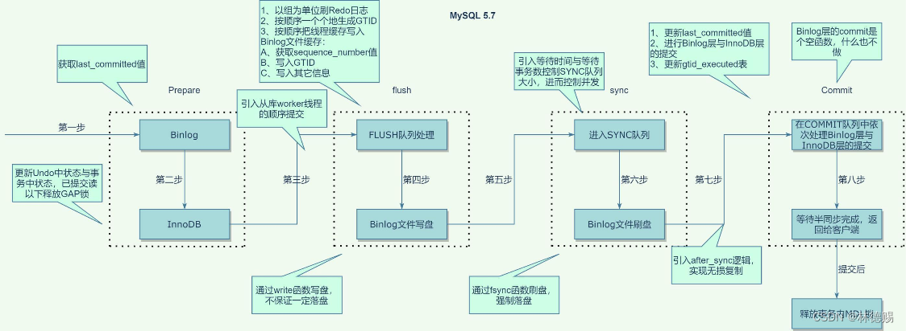

# 构造数据
```sql
CREATE TABLE `t` (
  `id` int NOT NULL,
  `c` varchar(32) DEFAULT NULL,
  PRIMARY KEY (`id`)
);
select * from t;
+----+-----------+
| id | c         |
+----+-----------+
|  1 | test_new  |
|  2 | test_new2 |
|  3 | test_new  |
+----+-----------+
```
# 执行UPDATE进行调试
```sql
begin;
update t set c='test' where id=2;
```
## 栈调用信息汇总
```cpp
                            MYSQL_BIN_LOG::flush_and_set_pending_rows_event(MYSQL_BIN_LOG * const this, THD * thd, Rows_log_event * event, bool is_transactional) (\data\mysql-8.0.30\sql\binlog.cc:6921)
                          THD::binlog_prepare_pending_rows_event<Update_rows_log_event>(THD * const this, TABLE * table, uint32 serv_id, size_t needed, bool is_transactional, const unsigned char * extra_row_info, uint32 source_part_id) (\data\mysql-8.0.30\sql\binlog.cc:10757)
                        THD::binlog_update_row(THD * const this, TABLE * table, bool is_trans, const uchar * before_record, const uchar * after_record, const unsigned char * extra_row_info) (\data\mysql-8.0.30\sql\binlog.cc:11079)
                      Update_rows_log_event::binlog_row_logging_function(THD * thd_arg, TABLE * table, bool is_transactional, const uchar * before_record, const uchar * after_record) (\data\mysql-8.0.30\sql\log_event.cc:12368)
                    |binlog_log_row(TABLE * table, const uchar * before_record, const uchar * after_record, Log_func * log_func) (\data\mysql-8.0.30\sql\handler.cc:7765)
                    |                   mtr_t::Command::execute(mtr_t::Command * const this) (\data\mysql-8.0.30\storage\innobase\mtr\mtr0mtr.cc:887)
                    |                |mtr_t::commit(mtr_t * const this) (\data\mysql-8.0.30\storage\innobase\mtr\mtr0mtr.cc:688)
                    |                |    row_upd_index_replace_new_col_val_func(const dict_index_t * index, dfield_t * dfield, const dict_field_t * field, const dict_col_t * col, const upd_field_t * uf, mem_heap_t * heap, bool is_sdi, const page_size_t & page_size) (\data\mysql-8.0.30\storage\innobase\row\row0upd.cc:1011)
                    |                |  |row_upd_index_replace_new_col_val(const dict_index_t * index, dfield_t * dfield, const dict_field_t * field, const dict_col_t * col, const upd_field_t * uf, mem_heap_t * heap, bool is_sdi, const page_size_t & page_size) (\data\mysql-8.0.30\storage\innobase\row\row0upd.cc:1094)
                    |                |  |dfield_copy(dfield_t * field1, const dfield_t * field2) (\data\mysql-8.0.30\storage\innobase\include\data0data.ic:207)
                    |                |row_upd_index_replace_new_col_vals_index_pos(dtuple_t * entry, const dict_index_t * index, const upd_t * update, bool order_only, mem_heap_t * heap) (\data\mysql-8.0.30\storage\innobase\row\row0upd.cc:1151)
					|                |row_upd_changes_field_size_or_external(const dict_index_t * index, const ulint * offsets, const upd_t * update) (\data\mysql-8.0.30\storage\innobase\row\row0upd.cc:369)
					|             |btr_cur_optimistic_update(ulint flags, btr_cur_t * cursor, ulint ** offsets, mem_heap_t ** heap, const upd_t * update, ulint cmpl_info, que_thr_t * thr, trx_id_t trx_id, mtr_t * mtr) (\data\mysql-8.0.30\storage\innobase\btr\btr0cur.cc:3500)
					|             |      trx_undo_page_report_modify(ib_page_t * undo_page, trx_t * trx, dict_index_t * index, const rec_t * rec, const ulint * offsets, const upd_t * update, ulint cmpl_info, const dtuple_t * row, mtr_t * mtr) (\data\mysql-8.0.30\storage\innobase\trx\trx0rec.cc:1167)
					|			  |    trx_undo_report_row_operation(ulint flags, ulint op_type, que_thr_t * thr, dict_index_t * index, const dtuple_t * clust_entry, const upd_t * update, ulint cmpl_info, const rec_t * rec, const ulint * offsets, roll_ptr_t * roll_ptr) (\data\mysql-8.0.30\storage\innobase\trx\trx0rec.cc:2253)
					|			  |  btr_cur_upd_lock_and_undo(ulint flags, btr_cur_t * cursor, const ulint * offsets, const upd_t * update, ulint cmpl_info, que_thr_t * thr, mtr_t * mtr, roll_ptr_t * roll_ptr) (\data\mysql-8.0.30\storage\innobase\btr\btr0cur.cc:3121)
					|			  |btr_cur_pessimistic_update(ulint flags, btr_cur_t * cursor, ulint ** offsets, mem_heap_t ** offsets_heap, mem_heap_t * entry_heap, big_rec_t ** big_rec, upd_t * update, ulint cmpl_info, que_thr_t * thr, trx_id_t trx_id, undo_no_t undo_no, mtr_t * mtr, btr_pcur_t * pcur) (\data\mysql-8.0.30\storage\innobase\btr\btr0cur.cc:3864)
					|			 row_upd_clust_rec(ulint flags, upd_node_t * node, dict_index_t * index, ulint * offsets, mem_heap_t ** offsets_heap, que_thr_t * thr, mtr_t * mtr) (\data\mysql-8.0.30\storage\innobase\row\row0upd.cc:2800)
					|          |row_upd_clust_step(upd_node_t * node, que_thr_t * const thr) (\data\mysql-8.0.30\storage\innobase\row\row0upd.cc:3062)
					|          |log_free_check() (\data\mysql-8.0.30\storage\innobase\include\log0chkp.h:312)
					| 	    row_upd(upd_node_t * node, que_thr_t * thr) (\data\mysql-8.0.30\storage\innobase\row\row0upd.cc:3149)
					|      row_upd_step(que_thr_t * thr) (\data\mysql-8.0.30\storage\innobase\row\row0upd.cc:3280)
					|    row_update_for_mysql_using_upd_graph(const byte * mysql_rec, row_prebuilt_t * prebuilt) (\data\mysql-8.0.30\storage\innobase\row\row0mysql.cc:2356)
					|  row_update_for_mysql(const byte * mysql_rec, row_prebuilt_t * prebuilt) (\data\mysql-8.0.30\storage\innobase\row\row0mysql.cc:2452)
					|ha_innobase::update_row(ha_innobase * const this, const uchar * old_row, uchar * new_row) (\data\mysql-8.0.30\storage\innobase\handler\ha_innodb.cc:9801)
                  |handler::ha_update_row(handler * const this, const uchar * old_data, uchar * new_data) (\data\mysql-8.0.30\sql\handler.cc:7894)
                  |                                RecLock::lock_add(RecLock * const this, ib_lock_t * lock) (\data\mysql-8.0.30\storage\innobase\lock\lock0lock.cc:1301)
                  |                              RecLock::create(RecLock * const this, trx_t * trx, const lock_prdt_t * prdt) (\data\mysql-8.0.30\storage\innobase\lock\lock0lock.cc:1377)
                  |                            lock_rec_lock_fast(bool impl, ulint mode, const buf_block_t * block, ulint heap_no, dict_index_t * index, que_thr_t * thr) (\data\mysql-8.0.30\storage\innobase\lock\lock0lock.cc:1736)
                  |                          lock_rec_lock(bool impl, select_mode sel_mode, ulint mode, const buf_block_t * block, ulint heap_no, dict_index_t * index, que_thr_t * thr) (\data\mysql-8.0.30\storage\innobase\lock\lock0lock.cc:1953)
                  |                        lock_clust_rec_read_check_and_lock(const lock_duration_t duration, const buf_block_t * block, const rec_t * rec, dict_index_t * index, const ulint * offsets, const select_mode sel_mode, const lock_mode mode, const ulint gap_mode, que_thr_t * thr) (\data\mysql-8.0.30\storage\innobase\lock\lock0lock.cc:5750)
                  |                      sel_set_rec_lock(btr_pcur_t * pcur, const rec_t * rec, dict_index_t * index, const ulint * offsets, select_mode sel_mode, ulint mode, ulint type, que_thr_t * thr, mtr_t * mtr) (\data\mysql-8.0.30\storage\innobase\row\row0sel.cc:1157)
                  |                    row_search_mvcc(byte * buf, page_cur_mode_t mode, row_prebuilt_t * prebuilt, ulint match_mode, const ulint direction) (\data\mysql-8.0.30\storage\innobase\row\row0sel.cc:5178)
                  |                  ha_innobase::index_read(ha_innobase * const this, uchar * buf, const uchar * key_ptr, uint key_len, ha_rkey_function find_flag) (\data\mysql-8.0.30\storage\innobase\handler\ha_innodb.cc:10269)
                  |                handler::index_read_map(handler * const this, uchar * buf, const uchar * key, key_part_map keypart_map, ha_rkey_function find_flag) (\data\mysql-8.0.30\sql\handler.h:5282)
                  |              handler::ha_index_read_map(handler * const this, uchar * buf, const uchar * key, key_part_map keypart_map, ha_rkey_function find_flag) (\data\mysql-8.0.30\sql\handler.cc:3152)
                  |            handler::read_range_first(handler * const this, const key_range * start_key, const key_range * end_key, bool eq_range_arg, bool sorted) (\data\mysql-8.0.30\sql\handler.cc:7182)
                  |          ha_innobase::read_range_first(ha_innobase * const this, const key_range * start_key, const key_range * end_key, bool eq_range_arg, bool sorted) (\data\mysql-8.0.30\storage\innobase\handler\ha_innodb.cc:10757)
                  |        handler::multi_range_read_next(handler * const this, char ** range_info) (\data\mysql-8.0.30\sql\handler.cc:6344)
                  |      DsMrr_impl::dsmrr_next(DsMrr_impl * const this, char ** range_info) (\data\mysql-8.0.30\sql\handler.cc:6686)
                  |    ha_innobase::multi_range_read_next(ha_innobase * const this, char ** range_info) (\data\mysql-8.0.30\storage\innobase\handler\ha_innodb.cc:23390)
                  |  handler::ha_multi_range_read_next(handler * const this, char ** range_info) (\data\mysql-8.0.30\sql\handler.cc:6282)
                  |IndexRangeScanIterator::Read(IndexRangeScanIterator * const this) (\data\mysql-8.0.30\sql\range_optimizer\index_range_scan.cc:365)
                Sql_cmd_update::update_single_table(Sql_cmd_update * const this, THD * thd) (\data\mysql-8.0.30\sql\sql_update.cc:991)
              Sql_cmd_update::execute_inner(Sql_cmd_update * const this, THD * thd) (\data\mysql-8.0.30\sql\sql_update.cc:1814)
            Sql_cmd_dml::execute(Sql_cmd_dml * const this, THD * thd) (\data\mysql-8.0.30\sql\sql_select.cc:586)
          mysql_execute_command(THD * thd, bool first_level) (\data\mysql-8.0.30\sql\sql_parse.cc:3577)
        dispatch_sql_command(THD * thd, Parser_state * parser_state) (\data\mysql-8.0.30\sql\sql_parse.cc:5239)
      dispatch_command(THD * thd, const COM_DATA * com_data, enum_server_command command) (\data\mysql-8.0.30\sql\sql_parse.cc:1959)
    do_command(THD * thd) (\data\mysql-8.0.30\sql\sql_parse.cc:1362)
  handle_connection(void * arg) (\data\mysql-8.0.30\sql\conn_handler\connection_handler_per_thread.cc:302)
pfs_spawn_thread(void * arg) (\data\mysql-8.0.30\storage\perfschema\pfs.cc:2942)
libpthread.so.0!start_thread (Unknown Source:0)
libc.so.6!clone (Unknown Source:0)
```
## 流程图
```cpp
Sql_cmd_update::update_single_table-->RecLock::lock_add-->ha_innobase::update_row-->trx_undo_page_report_modify-->binlog_log_row
```
# 执行COMMIT进行调试
```sql
commit;
```
## 栈调用汇总
```cpp
      |MYSQL_BIN_LOG::finish_commit(MYSQL_BIN_LOG * const this, THD * thd) (\data\mysql-8.0.30\sql\binlog.cc:8654)
      |MYSQL_BIN_LOG::process_after_commit_stage_queue(MYSQL_BIN_LOG * const this, THD * thd, THD * first) (\data\mysql-8.0.30\sql\binlog.cc:8537)
      |  (anonymous namespace)::finish_transaction_in_engines(THD * thd, bool all, bool run_after_commit) (\data\mysql-8.0.30\sql\binlog.cc:11523)
      |      innobase_commit(handlerton * hton, THD * thd, bool commit_trx) (\data\mysql-8.0.30\storage\innobase\handler\ha_innodb.cc:5743)
      |    ha_commit_low(THD * thd, bool all, bool run_after_commit) (\data\mysql-8.0.30\sql\handler.cc:1840)
      |  trx_coordinator::commit_in_engines(THD * thd, bool all, bool run_after_commit) (\data\mysql-8.0.30\sql\tc_log.cc:146)
      |MYSQL_BIN_LOG::process_commit_stage_queue(MYSQL_BIN_LOG * const this, THD * thd, THD * first) (\data\mysql-8.0.30\sql\binlog.cc:8464)
      |call_after_sync_hook(THD * queue_head) (\data\mysql-8.0.30\sql\binlog.cc:8722)
      |MYSQL_BIN_LOG::sync_binlog_file(MYSQL_BIN_LOG * const this, bool force) (\data\mysql-8.0.30\sql\binlog.cc:8612)
      |MYSQL_BIN_LOG::flush_cache_to_file(MYSQL_BIN_LOG * const this, my_off_t * end_pos_var) (\data\mysql-8.0.30\sql\binlog.cc:8599)
      |      binlog_cache_data::flush(binlog_cache_data * const this, THD * thd, my_off_t * bytes_written, bool * wrote_xid) (\data\mysql-8.0.30\sql\binlog.cc:2168)
      |    binlog_cache_mngr::flush(binlog_cache_mngr * const this, THD * thd, my_off_t * bytes_written, bool * wrote_xid) (\data\mysql-8.0.30\sql\binlog.cc:1228)
      |  MYSQL_BIN_LOG::flush_thread_caches(MYSQL_BIN_LOG * const this, THD * thd) (\data\mysql-8.0.30\sql\binlog.cc:8316)
      |MYSQL_BIN_LOG::process_flush_stage_queue(MYSQL_BIN_LOG * const this, my_off_t * total_bytes_var, bool * rotate_var, THD ** out_queue_var) (\data\mysql-8.0.30\sql\binlog.cc:8426)
      |  MYSQL_BIN_LOG::assign_automatic_gtids_to_flush_group(MYSQL_BIN_LOG * const this, THD * first_seen) (\data\mysql-8.0.30\sql\binlog.cc:1549)
      |            innobase_flush_logs(handlerton * hton, bool binlog_group_flush) (\data\mysql-8.0.30\storage\innobase\handler\ha_innodb.cc:5629)
      |          flush_handlerton(plugin_ref plugin, void * arg) (\data\mysql-8.0.30\sql\handler.cc:2345)
      |        plugin_foreach_with_mask(THD * thd, plugin_foreach_func ** funcs, int type, uint state_mask, void * arg) (\data\mysql-8.0.30\sql\sql_plugin.cc:2760)
      |      plugin_foreach_with_mask(THD * thd, plugin_foreach_func * func, int type, uint state_mask, void * arg) (\data\mysql-8.0.30\sql\sql_plugin.cc:2773)
      |    ha_flush_logs(bool binlog_group_flush) (\data\mysql-8.0.30\sql\handler.cc:2351)
      |  MYSQL_BIN_LOG::fetch_and_process_flush_stage_queue(MYSQL_BIN_LOG * const this, const bool check_and_skip_flush_logs) (\data\mysql-8.0.30\sql\binlog.cc:8394)
      |MYSQL_BIN_LOG::process_flush_stage_queue(MYSQL_BIN_LOG * const this, my_off_t * total_bytes_var, bool * rotate_var, THD ** out_queue_var) (\data\mysql-8.0.30\sql\binlog.cc:8409)
      |  Commit_stage_manager::enroll_for(Commit_stage_manager * const this, Commit_stage_manager::StageID stage, THD * thd, mysql_mutex_t * stage_mutex, mysql_mutex_t * enter_mutex) (\data\mysql-8.0.30\sql\rpl_commit_stage_manager.cc:149)
      |MYSQL_BIN_LOG::change_stage(MYSQL_BIN_LOG * const this, THD * thd, Commit_stage_manager::StageID stage, THD * queue, mysql_mutex_t * leave_mutex, mysql_mutex_t * enter_mutex) (\data\mysql-8.0.30\sql\binlog.cc:8581)
    MYSQL_BIN_LOG::ordered_commit(MYSQL_BIN_LOG * const this, THD * thd, bool all, bool skip_commit) (\data\mysql-8.0.30\sql\binlog.cc:8845)
  |MYSQL_BIN_LOG::commit(MYSQL_BIN_LOG * const this, THD * thd, bool all) (\data\mysql-8.0.30\sql\binlog.cc:8267)
  |          trx_undo_set_state_at_prepare(trx_t * trx, trx_undo_t * undo, bool rollback, mtr_t * mtr) (\data\mysql-8.0.30\storage\innobase\trx\trx0undo.cc:1845)
  |        trx_prepare_low(trx_t * trx, trx_undo_ptr_t * undo_ptr, bool noredo_logging) (\data\mysql-8.0.30\storage\innobase\trx\trx0trx.cc:2917)
  |      trx_prepare(trx_t * trx) (\data\mysql-8.0.30\storage\innobase\trx\trx0trx.cc:2961)
  |    trx_prepare_for_mysql(trx_t * trx) (\data\mysql-8.0.30\storage\innobase\trx\trx0trx.cc:3086)
  |  innobase_xa_prepare(handlerton * hton, THD * thd, bool prepare_trx) (\data\mysql-8.0.30\storage\innobase\handler\ha_innodb.cc:19986)
  |  binlog_prepare(THD * thd, bool all) (\data\mysql-8.0.30\sql\binlog.cc:2334)
  |ha_prepare_low(THD * thd, bool all) (\data\mysql-8.0.30\sql\handler.cc:2216)
  |MYSQL_BIN_LOG::prepare(MYSQL_BIN_LOG * const this, THD * thd, bool all) (\data\mysql-8.0.30\sql\binlog.cc:8005)
ha_commit_trans(THD * thd, bool all, bool ignore_global_read_lock) (\data\mysql-8.0.30\sql\handler.cc:1645)
trans_commit(THD * thd, bool ignore_global_read_lock) (\data\mysql-8.0.30\sql\transaction.cc:246)
mysql_execute_command(THD * thd, bool first_level) (\data\mysql-8.0.30\sql\sql_parse.cc:4171)
dispatch_sql_command(THD * thd, Parser_state * parser_state) (\data\mysql-8.0.30\sql\sql_parse.cc:5239)
dispatch_command(THD * thd, const COM_DATA * com_data, enum_server_command command) (\data\mysql-8.0.30\sql\sql_parse.cc:1959)
do_command(THD * thd) (\data\mysql-8.0.30\sql\sql_parse.cc:1362)
handle_connection(void * arg) (\data\mysql-8.0.30\sql\conn_handler\connection_handler_per_thread.cc:302)
pfs_spawn_thread(void * arg) (\data\mysql-8.0.30\storage\perfschema\pfs.cc:2942)
libpthread.so.0!start_thread (Unknown Source:0)
libc.so.6!clone (Unknown Source:0)
```
## 流程图
