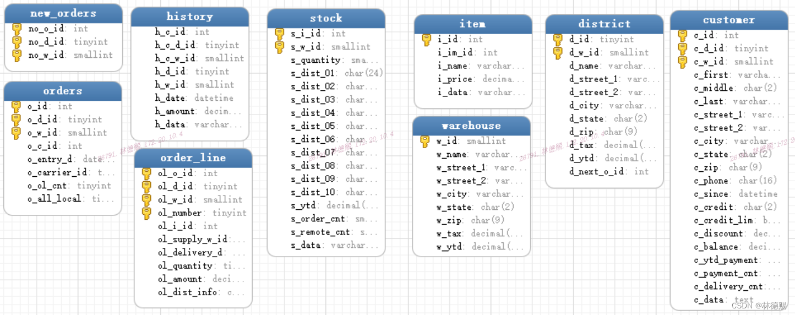

- [关于Tpcc-MySQL](#关于tpcc-mysql)
- [源码地址](#源码地址)
- [全球数据库TPCC排名](#全球数据库tpcc排名)
- [TPCC相关表](#tpcc相关表)
- [TPCC-MYSQL源码分析](#tpcc-mysql源码分析)
  - [源码文件](#源码文件)
  - [main函数](#main函数)
  - [thread\_main线程函数](#thread_main线程函数)
  - [driver函数](#driver函数)
  - [do\_neword函数](#do_neword函数)
  - [neword函数](#neword函数)
- [TPCC一致性校验SQL](#tpcc一致性校验sql)

TPCC是数据库最出名的测试基准，本人很好奇里面的事务模型、工具的压测逻辑，所以决定通过源码了解。

# 关于Tpcc-MySQL

TPC-C 是一个非常严苛的基准测试模型，考验的是一个完备的关系数据库系统全链路的能力。这也是为什么在 TPC-C 的榜单前列，出现的永远只是大家熟知的那几家在业界有着几十年积累、从关系数据库理论开始发展就差不多同步出现的数据库公司。

TPC-C 中的事务模型，主要分为五种事务，订单创建、订单支付、订单查询、订单发货以及库存查询，这五种事务按照一定的比例发生，测试最终衡量的是每分钟订单创建事务的执行个数。

Tpcc-MySQL是percona基于TPC-C衍生出来的产品，专用于MySQL基准测试。用来测试数据库的压力工具，模拟一个电商的业务，主要的业务有新增订单，库存查询，发货，支付等模块的测试。

# 源码地址

[GitHub - Percona-Lab/tpcc-mysql](https://github.com/Percona-Lab/tpcc-mysql)

# 全球数据库TPCC排名

https://www.tpc.org/tpcc/results/tpcc_results5.asp?print=false&orderby=tpm&sortby=desc

[关于OceanBase在2020年第二次上榜TPCC的解读 | Oceanbase列传]([pic/021.png](http://oceanbase.org.cn/?p=312))

# TPCC相关表



# TPCC-MYSQL源码分析

## 源码文件

文件很少，基本可以通过文件名判断功能

```cpp
# tree
.
├── delivery.c
├── driver.c
├── load.c
├── main.c
├── Makefile
├── neword.c
├── ordstat.c
├── parse_port.h
├── payment.c
├── rthist.c
├── rthist.h
├── sb_percentile.c
├── sb_percentile.h
├── sequence.c
├── sequence.h
├── slev.c
├── spt_proc.c
├── spt_proc.h
├── support.c
├── tpc.h
└── trans_if.h
```

## main函数

主函数main调用多线程thread_main函数，并行压测

```cpp
int main( int argc, char *argv[] )
{
    ……
/* EXEC SQL WHENEVER SQLERROR GOTO sqlerr; */
 
  for( t_num=0; t_num < num_conn; t_num++ ){
    thd_arg[t_num].port= port;
    thd_arg[t_num].number= t_num;
    //创建thread_main多线程，进行压测
    pthread_create( &t[t_num], NULL, (void *)thread_main, (void *)&(thd_arg[t_num]) );
  }
    ……
}
```

## thread_main线程函数

thread_main线程函数显示了所有压测的相关SQL。想通过表分片键选择、索引优化来提升性能，就必须了解下面35条SQL的业务逻辑。

```cpp
int thread_main (thread_arg* arg)
{
    ……
  //建立MYSQL连接
  if(is_local==1){
    /* exec sql connect :connect_string; */
    resp = mysql_real_connect(ctx[t_num], "localhost", db_user, db_password, db_string_full, port, db_socket, 0);
  }else{
    /* exec sql connect :connect_string USING :db_string; */
    resp = mysql_real_connect(ctx[t_num], connect_string, db_user, db_password, db_string_full, port, db_socket, 0);
  }
  //每个会话设置35个prepare stmt
for(i=0;i<40;i++){
      stmt[t_num][i] = mysql_stmt_init(ctx[t_num]);
      if(!stmt[t_num][i]) goto sqlerr;
  }
 
  /* Prepare ALL of SQLs */
  if( mysql_stmt_prepare(stmt[t_num][0], "SELECT c_discount, c_last, c_credit, w_tax FROM customer, warehouse WHERE w_id = ? AND c_w_id = w_id AND c_d_id = ? AND c_id = ?", 128) ) goto sqlerr;
  if( mysql_stmt_prepare(stmt[t_num][1], "SELECT d_next_o_id, d_tax FROM district WHERE d_id = ? AND d_w_id = ? FOR UPDATE", 80) ) goto sqlerr;
  if( mysql_stmt_prepare(stmt[t_num][2], "UPDATE district SET d_next_o_id = ? + 1 WHERE d_id = ? AND d_w_id = ?", 69) ) goto sqlerr;
  if( mysql_stmt_prepare(stmt[t_num][3], "INSERT INTO orders (o_id, o_d_id, o_w_id, o_c_id, o_entry_d, o_ol_cnt, o_all_local) VALUES(?, ?, ?, ?, ?, ?, ?)", 111) ) goto sqlerr;
  if( mysql_stmt_prepare(stmt[t_num][4], "INSERT INTO new_orders (no_o_id, no_d_id, no_w_id) VALUES (?,?,?)", 65) ) goto sqlerr;
  if( mysql_stmt_prepare(stmt[t_num][5], "SELECT i_price, i_name, i_data FROM item WHERE i_id = ?", 55) ) goto sqlerr;
  if( mysql_stmt_prepare(stmt[t_num][6], "SELECT s_quantity, s_data, s_dist_01, s_dist_02, s_dist_03, s_dist_04, s_dist_05, s_dist_06, s_dist_07, s_dist_08, s_dist_09, s_dist_10 FROM stock WHERE s_i_id = ? AND s_w_id = ? FOR UPDATE", 189) ) goto sqlerr;
  if( mysql_stmt_prepare(stmt[t_num][7], "UPDATE stock SET s_quantity = ? WHERE s_i_id = ? AND s_w_id = ?", 63) ) goto sqlerr;
  if( mysql_stmt_prepare(stmt[t_num][8], "INSERT INTO order_line (ol_o_id, ol_d_id, ol_w_id, ol_number, ol_i_id, ol_supply_w_id, ol_quantity, ol_amount, ol_dist_info) VALUES (?, ?, ?, ?, ?, ?, ?, ?, ?)", 159) ) goto sqlerr;
  if( mysql_stmt_prepare(stmt[t_num][9], "UPDATE warehouse SET w_ytd = w_ytd + ? WHERE w_id = ?", 53) ) goto sqlerr;
  if( mysql_stmt_prepare(stmt[t_num][10], "SELECT w_street_1, w_street_2, w_city, w_state, w_zip, w_name FROM warehouse WHERE w_id = ?", 91) ) goto sqlerr;
  if( mysql_stmt_prepare(stmt[t_num][11], "UPDATE district SET d_ytd = d_ytd + ? WHERE d_w_id = ? AND d_id = ?", 67) ) goto sqlerr;
  if( mysql_stmt_prepare(stmt[t_num][12], "SELECT d_street_1, d_street_2, d_city, d_state, d_zip, d_name FROM district WHERE d_w_id = ? AND d_id = ?", 105) ) goto sqlerr;
  if( mysql_stmt_prepare(stmt[t_num][13], "SELECT count(c_id) FROM customer WHERE c_w_id = ? AND c_d_id = ? AND c_last = ?", 79) ) goto sqlerr;
  if( mysql_stmt_prepare(stmt[t_num][14], "SELECT c_id FROM customer WHERE c_w_id = ? AND c_d_id = ? AND c_last = ? ORDER BY c_first", 89) ) goto sqlerr;
  if( mysql_stmt_prepare(stmt[t_num][15], "SELECT c_first, c_middle, c_last, c_street_1, c_street_2, c_city, c_state, c_zip, c_phone, c_credit, c_credit_lim, c_discount, c_balance, c_since FROM customer WHERE c_w_id = ? AND c_d_id = ? AND c_id = ? FOR UPDATE", 215) ) goto sqlerr;
  if( mysql_stmt_prepare(stmt[t_num][16], "SELECT c_data FROM customer WHERE c_w_id = ? AND c_d_id = ? AND c_id = ?", 72) ) goto sqlerr;
  if( mysql_stmt_prepare(stmt[t_num][17], "UPDATE customer SET c_balance = ?, c_data = ? WHERE c_w_id = ? AND c_d_id = ? AND c_id = ?", 90) ) goto sqlerr;
  if( mysql_stmt_prepare(stmt[t_num][18], "UPDATE customer SET c_balance = ? WHERE c_w_id = ? AND c_d_id = ? AND c_id = ?", 78) ) goto sqlerr;
  if( mysql_stmt_prepare(stmt[t_num][19], "INSERT INTO history(h_c_d_id, h_c_w_id, h_c_id, h_d_id, h_w_id, h_date, h_amount, h_data) VALUES(?, ?, ?, ?, ?, ?, ?, ?)", 120) ) goto sqlerr;
  if( mysql_stmt_prepare(stmt[t_num][20], "SELECT count(c_id) FROM customer WHERE c_w_id = ? AND c_d_id = ? AND c_last = ?", 79) ) goto sqlerr;
  if( mysql_stmt_prepare(stmt[t_num][21], "SELECT c_balance, c_first, c_middle, c_last FROM customer WHERE c_w_id = ? AND c_d_id = ? AND c_last = ? ORDER BY c_first", 121) ) goto sqlerr;
  if( mysql_stmt_prepare(stmt[t_num][22], "SELECT c_balance, c_first, c_middle, c_last FROM customer WHERE c_w_id = ? AND c_d_id = ? AND c_id = ?", 102) ) goto sqlerr;
  if( mysql_stmt_prepare(stmt[t_num][23], "SELECT o_id, o_entry_d, COALESCE(o_carrier_id,0) FROM orders WHERE o_w_id = ? AND o_d_id = ? AND o_c_id = ? AND o_id = (SELECT MAX(o_id) FROM orders WHERE o_w_id = ? AND o_d_id = ? AND o_c_id = ?)", 196) ) goto sqlerr;
  if( mysql_stmt_prepare(stmt[t_num][24], "SELECT ol_i_id, ol_supply_w_id, ol_quantity, ol_amount, ol_delivery_d FROM order_line WHERE ol_w_id = ? AND ol_d_id = ? AND ol_o_id = ?", 135) ) goto sqlerr;
  if( mysql_stmt_prepare(stmt[t_num][25], "SELECT COALESCE(MIN(no_o_id),0) FROM new_orders WHERE no_d_id = ? AND no_w_id = ?", 81) ) goto sqlerr;
  if( mysql_stmt_prepare(stmt[t_num][26], "DELETE FROM new_orders WHERE no_o_id = ? AND no_d_id = ? AND no_w_id = ?", 72) ) goto sqlerr;
  if( mysql_stmt_prepare(stmt[t_num][27], "SELECT o_c_id FROM orders WHERE o_id = ? AND o_d_id = ? AND o_w_id = ?", 70) ) goto sqlerr;
  if( mysql_stmt_prepare(stmt[t_num][28], "UPDATE orders SET o_carrier_id = ? WHERE o_id = ? AND o_d_id = ? AND o_w_id = ?", 79) ) goto sqlerr;
  if( mysql_stmt_prepare(stmt[t_num][29], "UPDATE order_line SET ol_delivery_d = ? WHERE ol_o_id = ? AND ol_d_id = ? AND ol_w_id = ?", 89) ) goto sqlerr;
  if( mysql_stmt_prepare(stmt[t_num][30], "SELECT SUM(ol_amount) FROM order_line WHERE ol_o_id = ? AND ol_d_id = ? AND ol_w_id = ?", 87) ) goto sqlerr;
  if( mysql_stmt_prepare(stmt[t_num][31], "UPDATE customer SET c_balance = c_balance + ? , c_delivery_cnt = c_delivery_cnt + 1 WHERE c_id = ? AND c_d_id = ? AND c_w_id = ?", 128) ) goto sqlerr;
  if( mysql_stmt_prepare(stmt[t_num][32], "SELECT d_next_o_id FROM district WHERE d_id = ? AND d_w_id = ?", 62) ) goto sqlerr;
  if( mysql_stmt_prepare(stmt[t_num][33], "SELECT DISTINCT ol_i_id FROM order_line WHERE ol_w_id = ? AND ol_d_id = ? AND ol_o_id < ? AND ol_o_id >= (? - 20)", 113) ) goto sqlerr;
  if( mysql_stmt_prepare(stmt[t_num][34], "SELECT count(*) FROM stock WHERE s_w_id = ? AND s_i_id = ? AND s_quantity < ?", 77) ) goto sqlerr;
 
//通过driver选择压测的事务
  r = driver(t_num);
 
  /* EXEC SQL COMMIT WORK; */
  if( mysql_commit(ctx[t_num]) ) goto sqlerr;  
```

**注意：**

MYSQL的参数max_prepared_stmt_count

max_prepared_stmt_count
| | |
| -------- | ------ |
|Command-Line Format | --max-prepared-stmt-count=# |
| System Variable	| max_prepared_stmt_count |
| Scope	| Global |
| Dynamic	| Yes |
| SET_VAR Hint Applies	| No |
| Type	| Integer |
| Default Value	| 16382 |
| Minimum Value	| 0 |
| Maximum Value (≥ 8.0.18)	| 4194304 |
| Maximum Value (≤ 8.0.17)	| 1048576 |

TPCC压测的连接数为t_num，每条连接的prepare stmt个数为35，所以有约束：

1. max_prepared_stmt_count >= 35 * t_num 
2. 或者添加参数允许关闭prepare stmt。
## driver函数
按比例随机0-4数字，然后选择对应的事务模型执行。
```cpp
int driver (int t_num)
{
    int i, j;
    
 
    /* Actually, WaitTimes are needed... */
    while( activate_transaction ){
      switch(seq_get()){
      case 0:
	do_neword(t_num);  //新增订单
	break;
      case 1:
	do_payment(t_num); //支付
	break;
      case 2:
	do_ordstat(t_num); //订单状态
	break;
      case 3:
	do_delivery(t_num); //发货
	break;
      case 4:
	do_slev(t_num);    //库存查询
	break;
      default:
	printf("Error - Unknown sequence.\n");
      }
 
    }
 
    return(0);
 
}
```
## do_neword函数
可以看出并没有重连机制
```cpp
/*
 * prepare data and execute the new order transaction for one order
 * officially, this is supposed to be simulated terminal I/O
 */
static int do_neword (int t_num)
{
    ……
    for (i = 0; i < MAX_RETRY; i++) { //最大可以重试MAX_RETRY 2000次
      ret = neword(t_num, w_id, d_id, c_id, ol_cnt, all_local, itemid, supware, qty);
      clk2 = clock_gettime(CLOCK_MONOTONIC, &tbuf2 );
 
      if(ret){
 
	……
 
	return (1); /* end */
      }else{
```
## neword函数
至少执行了9条SQL，对应stmt[t_num][0-9]
```cpp
/*
 * the new order transaction
 */
int neword( int t_num,
	    int w_id_arg,		/* warehouse id */
	    int d_id_arg,		/* district id */
	    int c_id_arg,		/* customer id */
	    int o_ol_cnt_arg,	        /* number of items */
	    int o_all_local_arg,	/* are all order lines local */
	    int itemid[],		/* ids of items to be ordered */
	    int supware[],		/* warehouses supplying items */
	    int qty[]		        /* quantity of each item */
)
{
    ……
	/* EXEC SQL WHENEVER NOT FOUND GOTO sqlerr;*/
	/* EXEC SQL WHENEVER SQLERROR GOTO sqlerr;*/
 
	/*EXEC SQL CONTEXT USE :ctx[t_num];*/
 
        gettimestamp(datetime, STRFTIME_FORMAT, TIMESTAMP_LEN);
	clk_start = clock_gettime(CLOCK_REALTIME, &tbuf_start );
 
	proceed = 1;
	/*EXEC_SQL SELECT c_discount, c_last, c_credit, w_tax
		INTO :c_discount, :c_last, :c_credit, :w_tax
	        FROM customer, warehouse
	        WHERE w_id = :w_id 
		AND c_w_id = w_id 
		AND c_d_id = :d_id 
		AND c_id = :c_id;*/
	mysql_stmt = stmt[t_num][0];
    ……
	proceed = 2;
	/*EXEC_SQL SELECT d_next_o_id, d_tax INTO :d_next_o_id, :d_tax
	        FROM district
	        WHERE d_id = :d_id
		AND d_w_id = :w_id
		FOR UPDATE;*/
	mysql_stmt = stmt[t_num][1];
    ……
	proceed = 3;
	/*EXEC_SQL UPDATE district SET d_next_o_id = :d_next_o_id + 1
	        WHERE d_id = :d_id 
		AND d_w_id = :w_id;*/
	mysql_stmt = stmt[t_num][2];
    ……
	proceed = 4;
	/*EXEC_SQL INSERT INTO orders (o_id, o_d_id, o_w_id, o_c_id,
			             o_entry_d, o_ol_cnt, o_all_local)
		VALUES(:o_id, :d_id, :w_id, :c_id, 
		       :datetime,
                       :o_ol_cnt, :o_all_local);*/
	mysql_stmt = stmt[t_num][3];
    ……
	proceed = 5;
	/* EXEC_SQL INSERT INTO new_orders (no_o_id, no_d_id, no_w_id)
	   VALUES (:o_id,:d_id,:w_id); */
	mysql_stmt = stmt[t_num][4];
    ……
	for (ol_number = 1; ol_number <= o_ol_cnt; ol_number++) {
		ol_supply_w_id = supware[ol_num_seq[ol_number - 1]];
		ol_i_id = itemid[ol_num_seq[ol_number - 1]];
		ol_quantity = qty[ol_num_seq[ol_number - 1]];
 
		/* EXEC SQL WHENEVER NOT FOUND GOTO invaliditem; */
		proceed = 6;
		/*EXEC_SQL SELECT i_price, i_name, i_data
			INTO :i_price, :i_name, :i_data
		        FROM item
		        WHERE i_id = :ol_i_id;*/
		mysql_stmt = stmt[t_num][5];
        ……
		proceed = 7;
		/*EXEC_SQL SELECT s_quantity, s_data, s_dist_01, s_dist_02,
		                s_dist_03, s_dist_04, s_dist_05, s_dist_06,
		                s_dist_07, s_dist_08, s_dist_09, s_dist_10
			INTO :s_quantity, :s_data, :s_dist_01, :s_dist_02,
		             :s_dist_03, :s_dist_04, :s_dist_05, :s_dist_06,
		             :s_dist_07, :s_dist_08, :s_dist_09, :s_dist_10
		        FROM stock
		        WHERE s_i_id = :ol_i_id 
			AND s_w_id = :ol_supply_w_id
			FOR UPDATE;*/
		mysql_stmt = stmt[t_num][6];
        ……
		proceed = 8;
		/*EXEC_SQL UPDATE stock SET s_quantity = :s_quantity
		        WHERE s_i_id = :ol_i_id 
			AND s_w_id = :ol_supply_w_id;*/
		mysql_stmt = stmt[t_num][7];
        ……
        		proceed = 9;
		/*EXEC_SQL INSERT INTO order_line (ol_o_id, ol_d_id, ol_w_id, 
						 ol_number, ol_i_id, 
						 ol_supply_w_id, ol_quantity, 
						 ol_amount, ol_dist_info)
			VALUES (:o_id, :d_id, :w_id, :ol_number, :ol_i_id,
				:ol_supply_w_id, :ol_quantity, :ol_amount,
				:ol_dist_info);*/
		mysql_stmt = stmt[t_num][8];
        ……
	}			/* End Order Lines */
    ……
    	/*EXEC_SQL COMMIT WORK;*/
	if( mysql_commit(ctx[t_num]) ) goto sqlerr;
    ……
}
```
# TPCC一致性校验SQL
```sql
Select w_id, w_ytd from bmsql_warehouse where (w_id,w_ytd) not in (select d_w_id, sum(d_ytd) from bmsql_district group by d_w_id); 
Select d_w_id, d_id, D_NEXT_O_ID - 1 from bmsql_district  where (d_w_id,d_id,D_NEXT_O_ID - 1) not in (select o_w_id, o_d_id, max(o_id) from bmsql_oorder group by  o_w_id, o_d_id);
Select d_w_id, d_id, D_NEXT_O_ID - 1 from bmsql_district where (d_w_id, d_id, D_NEXT_O_ID - 1) not in (select no_w_id, no_d_id, max(no_o_id) from bmsql_new_order group by no_w_id, no_d_id);
select * from (select (count(no_o_id)-(max(no_o_id)-min(no_o_id)+1)) as diff from bmsql_new_order group by no_w_id, no_d_id) tmp where diff != 0;
-- select o_w_id, o_d_id,tot from (select o_w_id, o_d_id, sum(o_ol_cnt) tot from bmsql_oorder  group by o_w_id, o_d_id) tmp where ( o_w_id, o_d_id, tot) not in ();
drop table if exists check_test1;
drop table if exists check_test2;
create table check_test1(o_w_id int,o_d_id int,tot int);
create table check_test2(o_w_id int,o_d_id int,tot int);
insert into check_test1 select o_w_id, o_d_id, sum(o_ol_cnt) tot from bmsql_oorder  group by o_w_id, o_d_id;
insert into check_test2 select ol_w_id, ol_d_id, count(ol_o_id) from bmsql_order_line group by ol_w_id, ol_d_id;
select o_w_id, o_d_id,tot from check_test1 where (o_w_id, o_d_id,tot) not in (select o_w_id, o_d_id,tot from check_test2);
 
select d_w_id,tot from (select d_w_id, sum(d_ytd) tot from bmsql_district group by d_w_id) tmp where (d_w_id,tot) not in (Select w_id, w_ytd from bmsql_warehouse);
```