- [远程LINUX机器连接配置](#远程linux机器连接配置)
- [连接远程LINUX机器](#连接远程linux机器)
- [配置SSH免密登录](#配置ssh免密登录)
- [vscode给远程服务器安装扩展](#vscode给远程服务器安装扩展)
- [打开远程文件夹](#打开远程文件夹)
- [给项目安装插件、设置编译参数](#给项目安装插件设置编译参数)
- [编译](#编译)
- [设置启动脚本](#设置启动脚本)
- [启动调试](#启动调试)
- [编译参数](#编译参数)
- [调试技巧](#调试技巧)
  - [打印debug信息](#打印debug信息)

# 远程LINUX机器连接配置
按 Ctrl + Shift + p
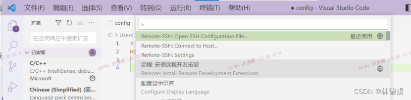
# 连接远程LINUX机器
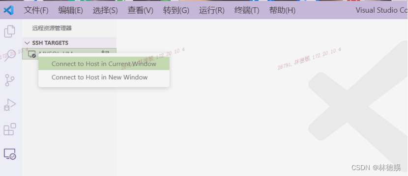
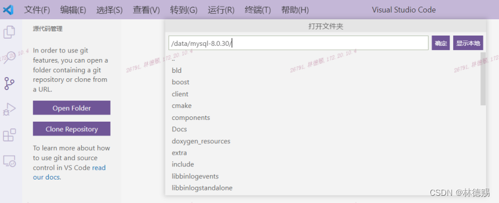
# 配置SSH免密登录
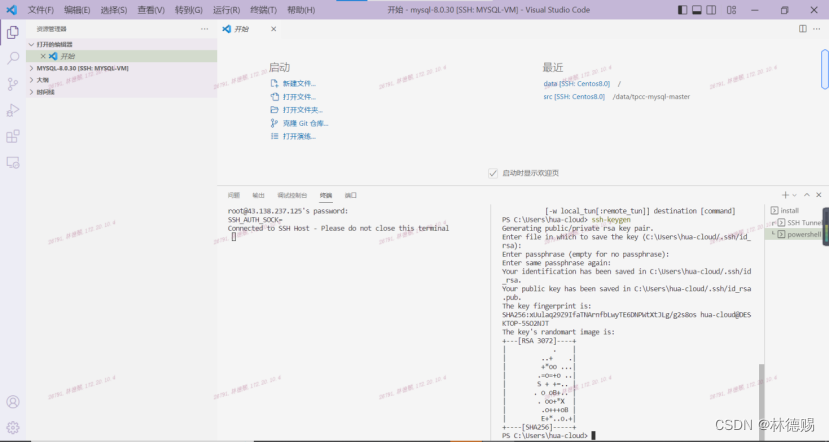
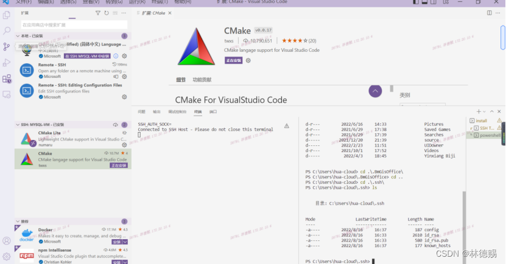
 将刚才本地生成的 id_rsa.pub 中的内容复制到远程 /root/.ssh/authorized_keys 中
 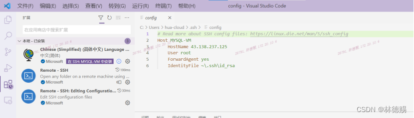
 # vscode给远程服务器安装扩展
 速度慢——安装不上解决方法（在线或离线方式）  
参考：https://blog.csdn.net/weixin_57133901/article/details/125305165
# 打开远程文件夹
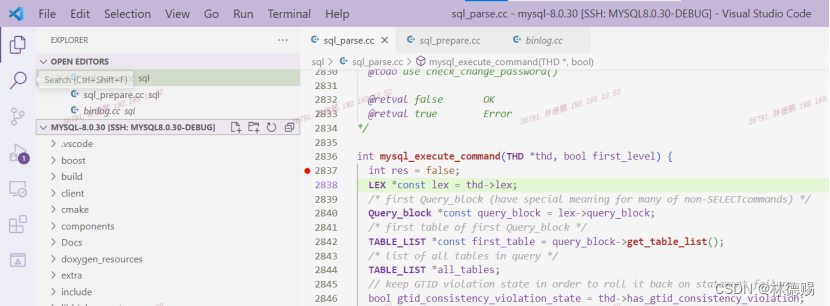
# 给项目安装插件、设置编译参数
![Alt text]pic/013.png)
Ctrl+, 设置cmake tools
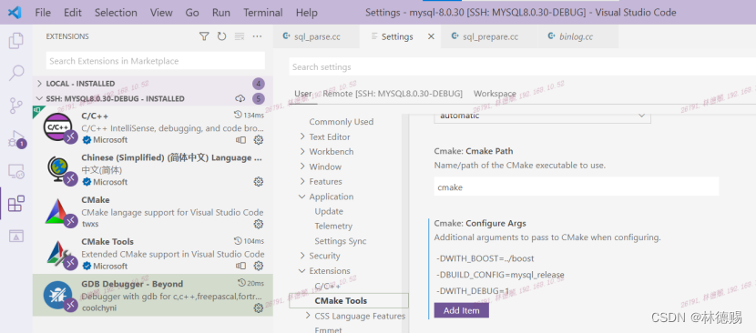
显示cmake的状态栏
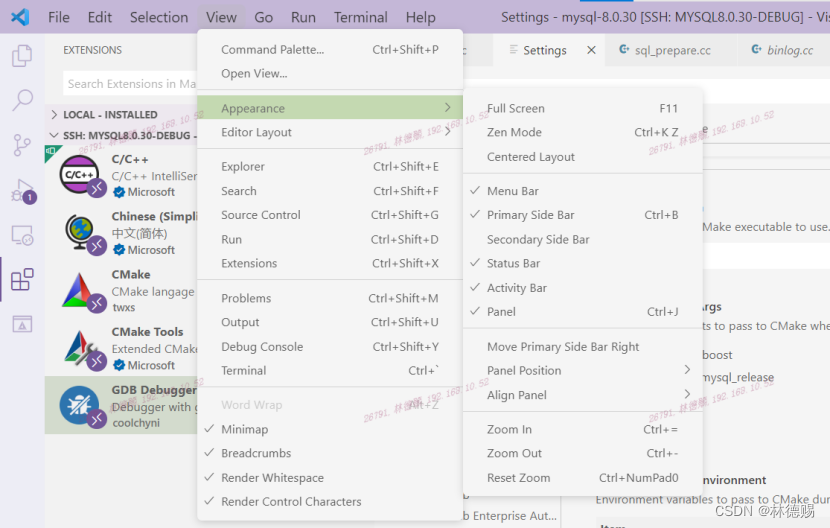
# 编译

# 设置启动脚本
`cat /data/mysql-server/.vscode/launch.json`
```json
{
    // Use IntelliSense to learn about possible attributes.
    // Hover to view descriptions of existing attributes.
    // For more information, visit: https://go.microsoft.com/fwlink/?linkid=830387
    "version": "0.2.0",
    "configurations": [
        {
            
            "name": "(gdb) Launch",
            "type": "cppdbg",
            "request": "launch",
            "program": "${workspaceFolder}/build/runtime_output_directory/mysqld-debug",
            "args": [
                "--user=mysql",
                "--datadir=${workspaceFolder}/build/runtime_output_directory/../data",
                "--socket=${workspaceFolder}/build/runtime_output_directory/../data/mysql.sock.lock"
            ],
            "stopAtEntry": false,
            "cwd": "${fileDirname}",
            "environment": [],
            "externalConsole": false,
            "MIMode": "gdb",
            "setupCommands": [
                {
                    "description": "Enable pretty-printing for gdb",
                    "text": "-enable-pretty-printing",
                    "ignoreFailures": true
                },
                {
                    "description": "Set Disassembly Flavor to Intel",
                    "text": "-gdb-set disassembly-flavor intel",
                    "ignoreFailures": true
                }
            ]
    }
    ]
}
```
# 启动调试
在workspace区设置启动参数
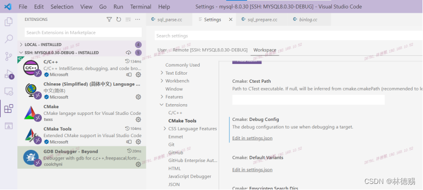
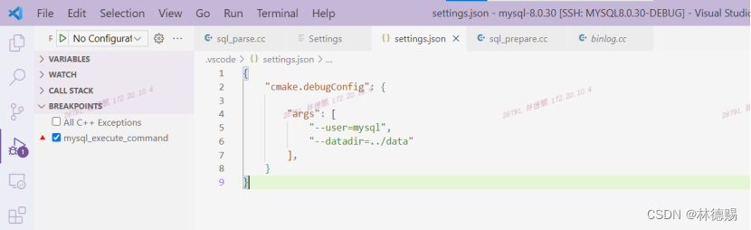
启动调试
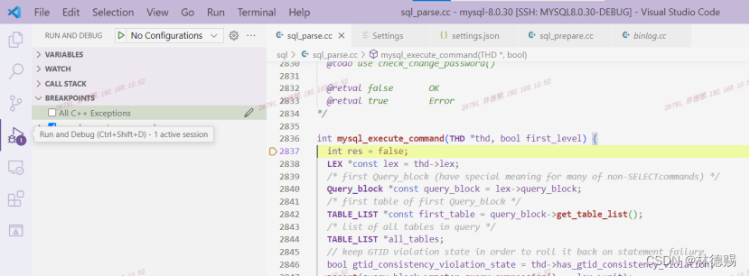

# 编译参数
```json
"cmake.configureArgs": [
  "-DWITH_BOOST=/data/boost_1_77_0",
  "-DWITH_DEBUG=1",
  "-DBUILD_CONFIG=mysql_release",
  "-gdwarf-2",
  "-frtti"
]
```

# 调试技巧
## 打印debug信息
在MySQL源码中，DBUG_EXECUTE_IF和DBUG_PRINT是用于调试的宏。DBUG_EXECUTE_IF("key", code)会在设置了某个关键字key时，执行后面的代码。而DBUG_PRINT("key", ("format", args...))则会在参数中的修饰符列表含有关键字key时，打印出需要的调试信息

比如遇到
```cpp
BUG_EXECUTE_IF("ast", Query_term *qn =
                             pc.select->master_query_expression()->query_term();
                  std::ostringstream buf; qn->debugPrint(0, buf);
                  DBUG_PRINT("ast", ("\n%s", buf.str().c_str()));); 
```

可以在客户端执行
```cpp
SET SESSION debug = '+d,ast';
```