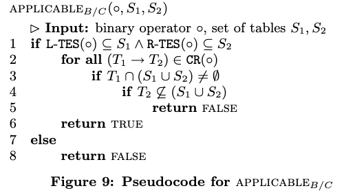

<h1 align="center">MySQL 优化器在 join order 上的弯道超车</h1>

我读完《[Dynamic Programming Strikes Back](https://15721.courses.cs.cmu.edu/spring2020/papers/20-optimizer2/p539-moerkotte.pdf)》、《[On the Correct and Complete Enumeration of the Core Search Space](https://15721.courses.cs.cmu.edu/spring2019/papers/23-optimizer2/p493-moerkotte.pdf)》这两篇论文，第一篇论文提到“our algorithm is way the fastest competitor for join ordering for complex queries”，文中的意思是目前为止在 join order 搜索算法性能中，它是 down-top 方式中最优秀的，并指出 top-down 算法目前还不成熟还在探索中。我仔细阅读 MySQL 8.2 版本在这两篇论文上的实践后，我下了这么一个结论：MySQL 优化器在 join order 上已经完成对其他开源关系型数据库的弯道超车！！！

下面我们分析 MySQL 优化器在 join order 搜索算法。

- [1. 一条 SQL 搜索最低成本执行计划时的计算顺序](#1-一条-sql-搜索最低成本执行计划时的计算顺序)
- [2. gdb 查看 SQL 跟 Hypergraph 的对应关系](#2-gdb-查看-sql-跟-hypergraph-的对应关系)
- [3. join order 的枚举算法源码分析](#3-join-order-的枚举算法源码分析)
  - [把实际问题转换成类似的数学问题](#把实际问题转换成类似的数学问题)
  - [MySQL 对 DPhyp 的源码实现分析](#mysql-对-dphyp-的源码实现分析)
  - [查看 DPhyp 的打印日志](#查看-dphyp-的打印日志)
    - [查看 DPhyp 打印的动态规划表日志](#查看-dphyp-打印的动态规划表日志)
    - [查看 DPhyp 打印的 csg-cmp-pair](#查看-dphyp-打印的-csg-cmp-pair)
    - [查看 DPhyp 打印的函数调用流程](#查看-dphyp-打印的函数调用流程)
  - [官方 DPhyp 测试用例的演示](#官方-dphyp-测试用例的演示)
    - [编译 dphyp-t 测试用例](#编译-dphyp-t-测试用例)
    - [查看 dphyp-t 中的测试用例](#查看-dphyp-t-中的测试用例)
    - [查看 DPhypTest.SmallStar 测试用例的 hypergraph 图形](#查看-dphyptestsmallstar-测试用例的-hypergraph-图形)
    - [执行 DPhypTest.SmallStar 测试用例](#执行-dphyptestsmallstar-测试用例)
    - [查看 DPhypTest.SmallStar 测试用例的 DynamicTable 打印日志](#查看-dphyptestsmallstar-测试用例的-dynamictable-打印日志)
    - [查看 DPhypTest.SmallStar 测试用例的 csg-cmp-pair 打印日志](#查看-dphyptestsmallstar-测试用例的-csg-cmp-pair-打印日志)
    - [查看 DPhypTest.ExampleHypergraph 测试用例的 hypergraph 图形](#查看-dphyptestexamplehypergraph-测试用例的-hypergraph-图形)
    - [查看 DPhypTest.ExampleHypergraph 等价 SQL 的 Hypergraph 图](#查看-dphyptestexamplehypergraph-等价-sql-的-hypergraph-图)
    - [执行 DPhypTest.ExampleHypergraph 测试用例](#执行-dphyptestexamplehypergraph-测试用例)
    - [查看 DPhypTest.ExampleHypergraph 测试用例的 DynamicTable 打印日志](#查看-dphyptestexamplehypergraph-测试用例的-dynamictable-打印日志)
    - [查看 DPhypTest.ExampleHypergraph 测试用例的 csg-cmp-pair 打印日志](#查看-dphyptestexamplehypergraph-测试用例的-csg-cmp-pair-打印日志)
- [4. 对 CD-C 算法完备性的证明](#4-对-cd-c-算法完备性的证明)
  - [归纳法的证明过程](#归纳法的证明过程)
- [5. 对 cascade 架构性能的质疑](#5-对-cascade-架构性能的质疑)
- [6. gdb 打印超图内容的 python 源码](#6-gdb-打印超图内容的-python-源码)

# 1. 一条 SQL 搜索最低成本执行计划时的计算顺序
为什么说 join order 是核心搜索空间？

假设我们有三个表：orders，customers 和 products，我们想要找出2024年1月1日之后购买了最多种类产品的前10名客户。以下是一个可能的SQL查询：
```sql
SELECT c.customer_name, COUNT(DISTINCT p.product_id) AS unique_product_count
FROM orders o
JOIN customers c ON o.customer_id = c.customer_id
JOIN products p ON o.product_id = p.product_id
WHERE o.order_date > '2024-01-01'
GROUP BY c.customer_name
HAVING unique_product_count > 5
ORDER BY unique_product_count DESC
LIMIT 10;
```
MySQL 的 server 层的优化器在搜索最低成本的合法执行计划时，它的总体计算步骤基本是按照以下标准执行：

1. `所有 join 的表，包括 join 谓词`：在这个例子中，我们有三个表orders，customers 和 products，并且我们通过 join 操作将它们连接在一起。
2. `WHERE 谓词 （如果条件允许，我们会把它下推到步骤1中）`：在这个例子中，我们使用了 WHERE 来过滤出 order_date 大于 ’2024-01-01’ 的记录。
3. `GROUP BY（这在一些特殊场景是允许被下推到步骤1中）`：我们按照 c.customer_name 进行了分组。
4. `HAVING`：我们使用了 HAVING 来过滤出 unique_product_count 的数量大于5的组。
5. `窗口函数`：在这个例子中没体现。
6. `DISTINCT`：在这个例子中，我们使用 DISTINCT 确保统计的是购买不同种类产品。
7. `ORDER BY`：在这个例子中，我们按照 unique_product_count DESC 的降序进行了排序。
8. `LIMIT`：在这个例子中，我们使用了 LIMIT 子句来限制查询结果的数量为10。
9. `SQL_BUFFER_RESULT (a MySQL extension)`：在这个例子中没体现。

在这9个步骤中，我们最有发挥空间的地方是步骤1，它通常被称为 join 优化器（表数量多的话，可能有数十亿种不同的 join 顺序），其他8个步骤，除窗口函数外，只能有一两种优化方式完成。我们可以看出搜索最低成本执行计划时，核心搜索空间是表的 join order。

# 2. gdb 查看 SQL 跟 Hypergraph 的对应关系
1、先启动 debug 版的 MySQL server 端

2、构造数据，并开启优化器的 Hypergraph 功能
```sql
-- 构造数据
CREATE TABLE t1 ( id int, a int );
CREATE TABLE t2 LIKE t1;
CREATE TABLE t3 LIKE t1;
CREATE TABLE t4 LIKE t1;
CREATE TABLE t5 LIKE t1;
CREATE TABLE t6 LIKE t1;
INSERT INTO t1 (id, a) VALUES (1,1),(2,2);
INSERT INTO t2 SELECT * FROM t1;
INSERT INTO t3 SELECT * FROM t1;
INSERT INTO t4 SELECT * FROM t1;
INSERT INTO t5 SELECT * FROM t1;
INSERT INTO t6 SELECT * FROM t1;

-- 开启 Hypergraph 优化器
set optimizer_switch="hypergraph_optimizer=on";
```
3、在函数 EnumerateAllConnectedPartitions 内部下断点

4、执行 SQL 进入断点。  
特意选择一条全连接 SQL，不包含超边也不包含超点，方便我们理解 MYSQL 的 join order 搜索算法
```sql
-- 我把该 SQL称为全连接 SQL，因为它任何两张表之间都有连接谓词。
select t1.* from
t1, t2, t3, t4
where 
    t1.id = t2.id and t1.id = t3.id and t1.id = t4.id and
    t2.id = t3.id and t2.id = t4.id and
    t3.id = t4.id;
```
5、gdb 打印 Hypergraph 的信息
```sh
-exec source /data/mysql-server-8.2.0/lindc/gdb_hypergraph.py
-exec mysql hypergraph receiver->m_graph
```
输出结果如下。请确保你理解了下面的数据结构再阅读下面的章节。  
比如 `edge[0]: {left: 0000000001   right: 0000000010}` 的含意是：这条边的左边的点是 `node[0]`,右边的点是 `node[1]`。  
每个连接谓词，都会产生两个 edge。比如 `t1.id = t2.id` 会产生两条边 `edege[0]、edege[1]`。  
由于超边比较抽象，我们先忽略 `complex_edges`。
```yaml
----------------其中 hypergraph 的数据结构及信息----------------------
edge[0]: {left: 0000000001   right: 0000000010}
edge[1]: {left: 0000000010   right: 0000000001}
edge[2]: {left: 0000000010   right: 0000000100}
edge[3]: {left: 0000000100   right: 0000000010}
edge[4]: {left: 0000000100   right: 0000001000}
edge[5]: {left: 0000001000   right: 0000000100}
edge[6]: {left: 0000000001   right: 0000000100}
edge[7]: {left: 0000000100   right: 0000000001}
edge[8]: {left: 0000000001   right: 0000001000}
edge[9]: {left: 0000001000   right: 0000000001}
edge[10]: {left: 0000000010   right: 0000001000}
edge[11]: {left: 0000001000   right: 0000000010}

node[0]: {simple_neighborhood: 0000001110   simple_edges: {0,6,8}   complex_edges: {} }
node[1]: {simple_neighborhood: 0000001101   simple_edges: {1,2,10}   complex_edges: {} }
node[2]: {simple_neighborhood: 0000001011   simple_edges: {3,4,7}   complex_edges: {} }
node[3]: {simple_neighborhood: 0000000111   simple_edges: {5,9,11}   complex_edges: {} }

----------------其中 hypergraph 跟 SQL 的关系----------------------
node[0]: t1
node[1]: t2
node[2]: t3
node[3]: t4

edege[0]、edege[1]:
  0xffff30b6c408 Item_func_eq
  |--> 0xffff30b67aa0 Item_field :   t1.id
  `--> 0xffff30b67c10 Item_field :   t2.id

edege[2]、edege[3]:
  0xffff30b6c680 Item_func_eq
  |--> 0xffff30b67c10 Item_field :   t2.id
  `--> 0xffff30b680c8 Item_field :   t3.id

edege[4]、edege[5]:
  0xffff30b6c8f8 Item_func_eq
  |--> 0xffff30b680c8 Item_field :   t3.id
  `--> 0xffff30b68580 Item_field :   t4.id

edege[6]、edege[7]:
  0xffff30b6dbf0 Item_func_eq
  |--> 0xffff30b67aa0 Item_field :   t1.id
  `--> 0xffff30b680c8 Item_field :   t3.id

edege[8]、edege[9]:
  0xffff30b75110 Item_func_eq
  |--> 0xffff30b67aa0 Item_field :   t1.id
  `--> 0xffff30b68580 Item_field :   t4.id

edege[10]、edege[11]:
  0xffff30b75558 Item_func_eq
  |--> 0xffff30b67c10 Item_field :   t2.id
  `--> 0xffff30b68580 Item_field :   t4.id
```

# 3. join order 的枚举算法源码分析
## 把实际问题转换成类似的数学问题
如果没阅读过 《[Dynamic Programming Strikes Back](https://15721.courses.cs.cmu.edu/spring2020/papers/20-optimizer2/p539-moerkotte.pdf)》这篇论文的话，想直接理解源码的意思，是很有难度的，但这篇论文也不是一篇省油的灯。理解一个数学算法问题可能不难，但理解一个算法问题背后的实际问题，它会牵扯不少实际的专业概念问题，一般不容易理解到位。为了大家快速理解它的算法原理，我从浅到深给出了2个类似的数学问题。

在第二章中我们已经理解 hypergraph 的数据结构。

1、基础版的数学问题：给出一个 hypergraph，已知它连通、没有超边、没有超点，请你用程序计算出它总共能生成多少种连通的二叉树。

2、进阶版的数学问题：给出一个 hypergraph，已知它连通，请你用程序计算出它总共能生成多少种连通的二叉树。

这两个数学问题的处理，都要使用到动态规划算法。这个 DP 算法在第一篇论文中叫做 DPhyp。

虽然超图比较抽象，但它在枚举所有生成二叉树时，算法基本跟基础版的数学问题处理办法一致，区别比较大的地方是怎么判断两个不想交的子图的连通性。

如果你能够掌握基础版的数学问题的解决办法后，我相信你已经接近完全掌握 DPhyp 算法。 

## MySQL 对 DPhyp 的源码实现分析
下面直接贴出 sql/join_optimizer/subgraph_enumeration.h 的源码。  
为了可以打印出 debug 的日志，我把源码中的  `#define DEBUGGING_DPHYP 0` 修改成 `#define DEBUGGING_DPHYP 1`。  
源码中的日志比较简陋，我调整了打印的日志格式和内容，这样我们可以通过打印日志分析 DPhyp 算法的流程。  
源码运用了一些超级绕脑筋的技巧，所以我添加了大量的详细的中文注释。  
当你阅读官方的 DPhyp 源码在一些细节上感到比较困惑时，我相信你基本上可以在我的这个注释里找到你想要的答案。
```cpp
/* Copyright (c) 2020, 2023, Oracle and/or its affiliates.

   This program is free software; you can redistribute it and/or modify
   it under the terms of the GNU General Public License, version 2.0,
   as published by the Free Software Foundation.

   This program is also distributed with certain software (including
   but not limited to OpenSSL) that is licensed under separate terms,
   as designated in a particular file or component or in included license
   documentation.  The authors of MySQL hereby grant you an additional
   permission to link the program and your derivative works with the
   separately licensed software that they have included with MySQL.

   This program is distributed in the hope that it will be useful,
   but WITHOUT ANY WARRANTY; without even the implied warranty of
   MERCHANTABILITY or FITNESS FOR A PARTICULAR PURPOSE.  See the
   GNU General Public License, version 2.0, for more details.

   You should have received a copy of the GNU General Public License
   along with this program; if not, write to the Free Software
   Foundation, Inc., 51 Franklin St, Fifth Floor, Boston, MA 02110-1301  USA */

#ifndef SUBGRAPH_ENUMERATION_H
#define SUBGRAPH_ENUMERATION_H 1

/**
  @file

  This file implements the DPhyp algorithm for enumerating connected
  subgraphs of hypergraphs (see hypergraph.h for a hypergraph definition).

  The core idea of the algorithm is that if the join structure of a
  query is expressed as a hypergraph, where the relations are nodes
  and the join predicates are hyperedges, one can efficiently find
  all legal join orders without Cartesian products by finding all
  possible subpartitions of the hypergraph. (Simple inner joins will
  have regular edges, but outer joins, antijoins etc., can be encoded
  as hyperedges to constrain the allowed join orderings, so that we
  do not join e.g. an inner and outer table together before said inner
  table has been joined to the entire set. Also, hyper-predicates such
  as t1.a + t2.b = t3.c will naturally give rise to hyperedges.)

  The algorithm is described in the paper “Dynamic Programming Strikes
  Back” by Neumann and Moerkotte. There is a somewhat extended version
  of the paper (that also contains a few corrections) in Moerkotte's
  treatise “Building Query Compilers”. Some critical details are still
  missing, which we've had to fill in ourselves. We don't currently
  implement the extension to generalized hypergraphs, but it should be
  fairly straightforward to do later. The algorithm is simple in concept
  but hard to grasp; we will only give a very rough outline here:

    1. Pick a seed node of the graph.
    2. Grow that seed along hyperedges, taking care never to make an
       unconnected graph or seeing the same subgraph twice.
    3. For each connected subgraph (csg): Repeat steps 1–2 independently
       to create a separate connected subgraph (the so-called complement,
       cmp), and try to connect the subgraph and its complement to create
       a larger graph (a so-called csg-cmp-pair).
    4. When such a csg-cmp-pair is found, call the receiver back with the
       csg and cmp. This is a valid subjoin that can be costed.

  The entry point for doing this is EnumerateAllConnectedPartitions().

  For complex joins, we may have to run DPhyp multiple times in a mode
  where we just count the number of partitions over various constrained
  graphs, and this will be a critical part of query planning time.
  Thus, it is coded as a template over a receiver type that gets callbacks
  for each partition. If the receiver just interested in counting,
  this saves a significant amount of call overhead. The templatization
  also allows the microbenchmarks to more accurately measure changes in
  the algorithm itself without having to benchmark the receiver.
 */

#include <assert.h>
#include <string>
#include "sql/join_optimizer/bit_utils.h"
#include "sql/join_optimizer/hypergraph.h"

// You can change 0 to 1 here to get debug traces of the algorithm
// as it is working.
#define DEBUGGING_DPHYP 1

#if DEBUGGING_DPHYP
#include <stdio.h>
#define HYPERGRAPH_PRINTF printf
#else
#define HYPERGRAPH_PRINTF(...)
#endif

namespace hypergraph {

template <class Receiver>
bool EnumerateAllConnectedPartitions(Receiver *receiver);

inline std::string PrintSet(NodeMap x) {
  std::string ret = "{";
  bool first = true;
  for (size_t node_idx : BitsSetIn(x)) {
    if (!first) {
      ret += ",";
    }
    first = false;

    char buf[256];
    snprintf(buf, sizeof(buf), "R%zu", node_idx + 1);
    ret += buf;
  }
  return ret + "}";
}

inline void PrintDynamicTable(size_t lowest_node_idx, NodeMap subgraph, NodeMap forbidden, NodeMap Neighborhood, NodeMap Complement, const char* FunctionName) {
  HYPERGRAPH_PRINTF("DynamicTable: |%25s|%20ld|%20s|%20s|%20s|%20s|\n",
                    FunctionName, lowest_node_idx, PrintSet(subgraph).c_str(), PrintSet(forbidden).c_str(), PrintSet(Neighborhood).c_str(), PrintSet(Complement).c_str());
}
inline void PrintDynamicTableHeader() {
  HYPERGRAPH_PRINTF("DynamicTable: |%-25s|%-20s|%-20s|%-20s|%-20s|%-20s|\n",
                    "FunctionName", "lowest_node_idx", "subgraph", "forbidden", "Neighborhood", "Complement");
}
inline void PrintDynamicTableLine() {
  HYPERGRAPH_PRINTF("DynamicTable: ------------------------------------------------------------------------------------------------------------------------------------\n");
}
/*
  FindNeighborhood() (see below) is crucial for speed. We can speed it up
  somewhat by observing that it is often being called many times with the
  same forbidden set and subgraphs that keep increasing; e.g., when we
  have the neighborhood {R1,R2}, we need to calculate the neighborhood of
  {R1}, {R2} and {R1,R2} -- the latter will start with calculating the
  neighborhood of {R1} and then add {R2} from there. We cannot just union
  the two neighborhoods due to hyperedges, but we can reuse the start.

  To this end, NeighborhoodCache implements a simple one-element cache.
  If we start a neighborhood computation that is a superset of the element
  in the cache, we can just continue with the neighborhood it calculated
  and add the missing elements. The overhead of managing the cache is a
  ~15-20% loss for simple graphs with low degrees (e.g. chains), but a
  huge speedup (60% or more) for graphs with high degrees, such as stars.
  Given that the simple graphs are already so fast that their time is
  hardly noticeable, this seems like a good overall tradeoff.

  The default enumeration of power sets given by NonzeroSubsetsOf
  (e.g. 000, 001, 010, 011, 100, etc. for three nodes in the neighborhood)
  is not optimal for caching. E.g., for four bits, we can brute-force the
  optimal order to be

    0001 *0010 0011 *0100 0101 *0110 0111 1110 *1000 1010 1100 *1001
    1011 *1110 1111

  where we overwrite the element in the cache every time we process a subset
  marked by *. This yields an optimal 17 loop iterations saved, leaving only 15.
  However, it is not clear how to efficiently enumerate these orders and choice
  of elements to cache realtime without huge precalculated tables (e.g., what is
  the optimal order for 14 potential neighbors?), so instead, we keep the normal
  order and add a simple heuristic: Keep every other item. The lowest bit will
  change between 0 and 1 every iteration, so one that ends in 1 cannot possibly
  be a subset of the the next enumerated subset. This yields:

    0001 *0010 0011 *0100 0101 *0110 0111 *1000 1001 *1010 1011 *1100
    1101 *1110 1111

  which saves 16 loop iterations, nearly as good. (This pattern does not seem
  to change markedly for larger subsets; the best pattern for five bits is
  1 *2 3 6 *10 11 14 *4 *5 7 21 *13 15 *8 9 12 *24 25 26 *28 29 30 *16 17 20
  *18 22 *19 23 *27 31, saving 49 bits where the heuristic saves 44. Optimal
  patterns for more than five bits are not known.)

  The only thing that really matters is keeping track of what the lowest bit
  is; we call it the “taboo bit”, as when we process such a subset, it
  signals that the result shouldn't replace whatever is in the cache.

  Note that you cannot reuse the cache across calls with different forbidden
  subsets; that would yield wrong results.
 */

// 在扩展 subgraph 或者 complement 时，会用到 NonzeroSubsetsOf(neighborhood)。
// NonzeroSubsetsOf 会按{v1}，{v2}，{v1，v2}，{v3}，{v1，v3}，{v2，v3}，{v1，v2，v3} …… 从小到大的顺序枚举 neighborhood 的所有非空子集，包含 neighborhood 本身。
// 当我们计算完 {v2，v3} 的直接邻居后，下次查找 {v1，v2，v3} 的直接邻居时，可以利用 ({v2，v3} 的直接邻居) 来帮忙加速查找
class NeighborhoodCache {
 public:
  explicit NeighborhoodCache(NodeMap neighborhood)
      : m_taboo_bit(IsolateLowestBit(neighborhood)) {}

  // Tell the cache we intend to start a neighborhood search.
  // If the cache can reduce our workload, it will update the
  // two neighborhoods. Returns the actual set of bits we need
  // to compute the neighborhood for (whether it could save
  // anything or not).
  inline NodeMap InitSearch(NodeMap just_grown_by, NodeMap *neighborhood,
                            NodeMap *full_neighborhood) {
    if (IsSubset(m_last_just_grown_by, just_grown_by)) {
      // We can use our cache from the last node and continue the search from
      // there.
      *full_neighborhood |= m_last_full_neighborhood;
      *neighborhood = m_last_neighborhood;
      return just_grown_by & ~m_last_just_grown_by;
    }

    // We need to do the entire search as usual.
    return just_grown_by;
  }

  // Tell the cache we just computed a neighborhood. It can choose to
  // store it to accelerate future InitSearch() calls.
  inline void Store(NodeMap just_grown_by, NodeMap neighborhood,
                    NodeMap full_neighborhood, int depth) {
    HYPERGRAPH_PRINTF(
      "%sNeighborhoodCache->Store(just_grown_by:%s, neighborhood:%s, full_neighborhood:%s)     &cache:%p, cache.m_taboo_bit:%s\n",
      std::string(depth * 4, ' ').c_str(), PrintSet(just_grown_by).c_str(), PrintSet(neighborhood).c_str(), PrintSet(full_neighborhood).c_str(), 
      (void*)this, PrintSet(m_taboo_bit).c_str());
    
    assert(IsSubset(neighborhood, full_neighborhood));
    if (Overlaps(just_grown_by, m_taboo_bit)) return;

    m_last_just_grown_by = just_grown_by;
    m_last_full_neighborhood = full_neighborhood;
    m_last_neighborhood = neighborhood;
  }

 public:
  const NodeMap m_taboo_bit;
  NodeMap m_last_just_grown_by =
      ~0;  // Don't try to use the cache the first iteration.
  NodeMap m_last_full_neighborhood = 0;
  NodeMap m_last_neighborhood = 0;
};

/**
  Find the neighborhood of the given subgraph (S); informally, the set of nodes
  immediately reachable from that subgraph. There's an additional constraint
  in that the edges used to do so must not touch the forbidden set of nodes (X).
  The DPhyp paper calls this function N(S, X) (with a calligraphic N).

  How to calculate the neighborhood efficiently is one of the least explicitly
  described parts of the paper. The definition goes about as follows:

    1. Find E↓'(S,X), the set of “interesting hypernodes” (outgoing edge
       destinations from S). These are the (endpoints of) edges that have one
       side entirely within S, that have the other side entirely _outside_ S,
       and none of the sides touch the forbidden set X.
    2. Minimize E↓'(S,X) by removing all “subsumed hypernodes”, giving E↓(S,X).
       u subsumes v if it is a proper subset; if so, we can never go to where v
       points to before we've been at u, so it's pointless to keep v.
    3. For each hypernode in E↓(S,X), pick node with lowest index as a
       representative, because our subset enumeration algorithms cannot
       enumerate subsets of hypernodes, only subsets of normal nodes.
       (Actually, any node that's part of the hypernode would do; it does not
       even need to be consistent.) These nodes together constitute the
       neighborhood.

  There are a couple of points to note here:

  First, adding more nodes than needed to the neighborhood does not affect
  correctness of the algorithm, only speed. We try all combinations of
  included/excluded for the neighborhood (2^N in the number of nodes),
  so this covers all potential subgraphs; in theory, we could even just choose
  all non-forbidden nodes and reduce to the algorithm known as DPhyp, it just
  wouldn't be very efficient.

  Second, step 3 means that we may very well end up with a non-connected
  subgraph. This is harmless; we may eventually grow it to a connected one or
  we may not, we just won't start looking for any complements until we have a
  connected one (and we know whether it's connected or not based on whether we
  saw it as a csg-cmp pair in the algorithm earlier).

  Third, due to the way we grow our subgraph, only the nodes that we have just
  grown by can contribute to the E↓'(S,X). The reason is simple; every node
  from the previous neighborhood will have been added either to S or to X,
  and both exclude them from the new neighborhood. (Step 2 doesn't affect this,
  as any hypernode that was subsumed would also have to touch S or X.
  But there's an exception in that occasionally, we can remove nodes from X;
  see ExpandSubgraph().)

  Fourth, perfect minimization seems to be impossible to actually implement
  efficiently. This is known as the minimum set problem, and the best known
  algorithms to do this are in O(n² / log n) time (see e.g. Pritchard: ”An Old
  Sub-Quadratic Algorithm for Finding Extremal Sets”), which can be quite a
  lot when there are lots of edges. (The trivial O(n²) algorithm is to just test
  every set against every smaller set, and throw it out if it's a superset.)
  Since loops in our hypergraphs are presumed to be fairly rare, it would not
  seem worth it to do full minimization.

  Instead, we pick the low-hanging fruit only: Every _simple_ edge is trivial
  to test against. We just collect the simple edges into a mask, and any
  (complex) hyperedge that overlaps with that bitmap can immediately be
  discarded. Even more, since we don't have to pick min(S) but can pick
  something arbitrary, we can let {R2,R3} (which gets R2 as its representative
  node) subsume {R1,R2}, even though it's not an actual subset, by pretending
  we picked R2 as the representative node for the latter! This is similar to
  what Moerkotte describes in his “Building Query Compilers” document,
  which seems to contain a slightly extended version of the DPhyp paper
  (under a different name). We could have collected all the simple edges in a
  separate pass first, but the microbenchmarks show that the added loop overhead
  isn't worth it.

  Note that we also keep E↓'(S,X), the set of interesting hypernodes; we
  bitwise-or it into “full_neighborhood”. This is useful later when searching
  for edges to connect the connected subgraph and its complement; we know that
  only edges into “full_neighborhood” can connect the two.

  This function accounts for roughly 20–70% of the total DPhyp running time,
  depending on the shape of the graph (~40% average across the microbenchmarks).
  It is fairly big to inline, but it helps speed significantly, probably due
  to the large amount of parameters to be passed back and forth.
 */

// 返回 subgraph 的直连邻居，不含间接邻居，也不包含 subgraph 中的任何元素。这函数参数中的 just_grown_by ⊆ subgraph。
inline NodeMap FindNeighborhood(const Hypergraph &g, NodeMap subgraph,
                                NodeMap forbidden, NodeMap just_grown_by,
                                NeighborhoodCache *cache,
                                NodeMap *full_neighborhood_arg, int depth) {
  HYPERGRAPH_PRINTF(
      "%sFindNeighborhood(subgraph:%s, forbidden:%s, just_grown_by:%s, full_neighborhood_arg:%s),     &cache:%p, cache.m_taboo_bit:%s\n",
      std::string(depth * 4, ' ').c_str(), PrintSet(subgraph).c_str(), PrintSet(forbidden).c_str(), PrintSet(just_grown_by).c_str(), 
      PrintSet(*full_neighborhood_arg).c_str(), (void*)cache, PrintSet(cache->m_taboo_bit).c_str());

  assert(IsSubset(just_grown_by, subgraph));

  NodeMap full_neighborhood =
      *full_neighborhood_arg;  // Keep us out of aliasing trouble.
  NodeMap neighborhood = 0;

  HYPERGRAPH_PRINTF(
      "%s FindNeighborhood     the last cache:{m_last_just_grown_by:%s, m_last_full_neighborhood:%s, m_last_neighborhood:%s, m_taboo_bit:%s},      &cache:%p\n",
       std::string(depth * 4, ' ').c_str(), PrintSet(cache->m_last_just_grown_by).c_str(), 
       PrintSet(cache->m_last_full_neighborhood).c_str(), PrintSet(cache->m_last_neighborhood).c_str(), PrintSet(cache->m_taboo_bit).c_str(), (void*)cache);

  NodeMap to_search =
      cache->InitSearch(just_grown_by, &neighborhood, &full_neighborhood);
  assert(IsSubset(neighborhood, full_neighborhood));

  for (size_t node_idx : BitsSetIn(to_search)) {
    // Simple edges.
    // NOTE: This node's simple neighborhood will be added lazily to
    // full_neighborhood below. Forbidden nodes will also be removed below.
    neighborhood |= g.nodes[node_idx].simple_neighborhood;

    // Now go through the complex edges and see which ones point out of the
    // subgraph.
    for (size_t edge_idx : g.nodes[node_idx].complex_edges) {
      const Hyperedge e = g.edges[edge_idx];

      if (IsSubset(e.left, subgraph) &&
          !Overlaps(e.right, subgraph | forbidden)) {
        // e.right is an interesting hypernode (part of E↓'(S,X)).
        full_neighborhood |= e.right;
        if (!Overlaps(e.right, neighborhood)) {
          // e.right is also not subsumed by another edge (ie., it is part of
          // E↓(S,X)), so add a “representative node” for it to the
          // neighborhood.
          //
          // Is is possible to do the Overlaps() test above branch-free by using
          // -int64_t(e.right & neighborhood) >> 63 as a mask (assuming we do
          // not have more than 63 tables) but it seems to do better on some
          // tests and worse on others, so it's not worth it.
          neighborhood |= IsolateLowestBit(e.right);
        }
      }
    }
  }

  neighborhood &= ~(subgraph | forbidden);
  full_neighborhood |= neighborhood;

  cache->Store(just_grown_by, neighborhood, full_neighborhood, depth + 1);

  HYPERGRAPH_PRINTF(
      "%s FindNeighborhood     Neighborhood of %s (calculated on %s) with forbidden %s = %s,     &cache:%p, cache.m_taboo_bit:%s\n",
      std::string(depth * 4, ' ').c_str(), PrintSet(subgraph).c_str(), PrintSet(just_grown_by).c_str(),
      PrintSet(forbidden).c_str(), PrintSet(neighborhood).c_str(), (void*)cache, PrintSet(cache->m_taboo_bit).c_str());

  *full_neighborhood_arg = full_neighborhood;
  return neighborhood;
}

// Given a subgraph of g, enumerate all possible complements that do
// not include anything from the exclusion subset. Works by looking
// at every possible node of the _neighborhood_ of the given subgraph
// (see FindNeighborhood()); these are then used as seeds for growing
// the complement graph.
//
// Called EmitCsg() in the DPhyp paper.

// 这个函数的总体流程：把 neighborhood 的每个合法 node 当 complement 的 seed，先计算 complement = seed 时 csg-cmp-pair 的最低成本执行计划，然后调用 ExpandComplement 从 seed 的直接邻居扩展 complement
// 整个算法中只有两处调用 EnumerateComplementsTo，一个是 EnumerateAllConnectedPartitions，另外个是 ExpandSubgraph
// subgraph 一定是连通的才会调用这个函数
// 该函数返回 false 表示可以继续，返回 true 表示需要终止
template <class Receiver>
[[nodiscard]] bool EnumerateComplementsTo(
    const Hypergraph &g, size_t lowest_node_idx, NodeMap subgraph,
    NodeMap full_neighborhood, NodeMap neighborhood, Receiver *receiver, int depth) {
  NodeMap forbidden = TablesBetween(0, lowest_node_idx);

  HYPERGRAPH_PRINTF("%sEnumerateComplementsTo(lowest_node_idx:%ld, subgraph:%s, full_neighborhood:%s, neighborhood:%s)\n",
                    std::string(depth * 4, ' ').c_str(), lowest_node_idx, PrintSet(subgraph).c_str(), PrintSet(full_neighborhood).c_str(), PrintSet(neighborhood).c_str());

  PrintDynamicTable(lowest_node_idx, /*subgraph*/subgraph, /*forbidden*/0, /*Neighborhood*/neighborhood, /*Complement*/0, /*FunctionName*/"EnumerateComplementsTo");

  // 从 neighborhood 中剔除 subgraph。理论上 neighborhood 和 subgraph 不会有交集，为什么还要有这个多余的步骤？
  // 整个算法中，发现只有在 ExpandSubgraph 调用 EnumerateComplementsTo 前，会把 forbidden 和 grow_by 添加到 neighborhood
  neighborhood &= ~subgraph;

  // Similar to EnumerateAllConnectedPartitions(), we start at seed nodes
  // counting _backwards_, so that we consider larger and larger potential
  // graphs. This is critical for the property that we want to enumerate smaller
  // subsets before larger ones.
  NeighborhoodCache cache(neighborhood);
  // 后序遍历 neighborhood 的所有 bits。为什么是遍历直接邻居，而不是 （subgraph ∪ forbidden）在 g 中的补集。此时 forbidden ∩ subgraph = ∅
  for (size_t seed_idx : BitsSetInDescending(neighborhood)) {
    // First consider a complement consisting solely of the seed node;
    // see if we can find an edge (or multiple ones) connecting it
    // to the given subgraph.
    NodeMap seed = TableBitmap(seed_idx);
    // Complement 为单独的 node 时，可以用下面的办法搜索 (subgraph, Complement) 之间是否有连接谓词。如果 Complement 多个 node 的组合时，需要用到 TryConnecting 函数来搜索 (subgraph, Complement) 之间是否有连接谓词
    // 如果 seed 跟 subgraph 之间有简单边
    if (Overlaps(g.nodes[seed_idx].simple_neighborhood, subgraph)) {
      // 遍历 seed 的所有简单边。因为两个 node 之间可能会有多个简单边，比如 t1 join t2 using (id,name)
      for (size_t edge_idx : g.nodes[seed_idx].simple_edges) {
        const Hyperedge e = g.edges[edge_idx];
        assert(e.left == seed);
        // 如果简单边的右边跟 subgraph 相连
        if (Overlaps(e.right, subgraph)) {
          // 如果 FoundSubgraphPair 返回 false 则表示可以找到 subgraph 跟 seed node 之间的连接谓词。如果存在连接谓词，它会保存 (subgraph, seed）这个 csg-cmp-pair 的最低成本执行计划。
          // 这里 edge_idx / 2 的原因，是因为每个连接谓词都会生成对两条边(比如R1.id=R2.id会生成{R1,R2}和{R2,R1})，所以除以 2 后可以找到对应的连接谓词
          if (receiver->FoundSubgraphPair(subgraph, seed, edge_idx / 2)) {
            return true;
          }
        }
      }
      HYPERGRAPH_PRINTF("Complete csg-cmp-pair : %s-%s\n", PrintSet(subgraph).c_str(), PrintSet(seed).c_str());
    }
    // 遍历 seed 的所有超边
    for (size_t edge_idx : g.nodes[seed_idx].complex_edges) {
      const Hyperedge e = g.edges[edge_idx];
      // 如果 seed 对应的超点 跟 subgraph 相连
      if (e.left == seed && IsSubset(e.right, subgraph)) {
        if (receiver->FoundSubgraphPair(subgraph, seed, edge_idx / 2)) {
          return true;
        }
        HYPERGRAPH_PRINTF("Complete csg-cmp-pair : %s-%s\n", PrintSet(subgraph).c_str(), PrintSet(seed).c_str());
      }
    }

    // Grow the complement candidate along the neighborhoods to create
    // a larger, connected complement. Note that we do this even if the
    // the seed complement wasn't connected to our subgraph, since it
    // might be connected as we add more nodes.
    //
    // Note that the extension of the forbidden set is required to avoid
    // enumerating the same set twice; consider e.g. if you have a clique
    // R1-R2-R3 and want to find complements to {R1} (ie., {R2,R3} is the
    // neighborhood). When considering the seed {R3}, you don't want to be able
    // to grow it into R2, since the {R2,R3} combination will be seen later when
    // using {R2} as the seed. This is analogous to what we do in
    // EnumerateAllConnectedPartitions(), and the whole reason for iterating
    // backwards, but the DPhyp paper misses this. The “Building Query
    // Compilers” document, however, seems to have corrected it.

    // 在《Building Query Compilers》 这本书的第78页有处理 new_forbidden 的伪代码
    // 为了防止枚举 complement 时出现重复，需要把 neighborhood 集合中的 seed_idx 之前的子集合屏蔽，所以有 | (neighborhood & TablesBetween(0, seed_idx))
    NodeMap new_forbidden =
        forbidden | subgraph | (neighborhood & TablesBetween(0, seed_idx));
    NodeMap new_full_neighborhood = 0;  // Unused; see comment on TryConnecting.
    // 计算 seed 的直接邻居
    NodeMap new_neighborhood = FindNeighborhood(g, /*subgraph*/seed, /*forbidden*/new_forbidden, /*just_grown_by*/seed,
                                                &cache, /**full_neighborhood_arg*/&new_full_neighborhood, /*depth*/depth + 1);
    // 每次进入 ExpandComplement 函数之前，都会把需要用到的参数先计算好，再调用 ExpandComplement 函数。 了解这个对我们分析打印日志信息很有帮助
    if (ExpandComplement(g, /*lowest_node_idx*/lowest_node_idx, /*subgraph*/subgraph, /*subgraph_full_neighborhood*/full_neighborhood, /*complement*/seed,
                         /*neighborhood*/new_neighborhood, /*forbidden*/new_forbidden, receiver, /*depth*/depth + 1)) {
      return true;
    }
  }
  return false;
}

// Given a subgraph of g, grow it recursively along the neighborhood.
// (The subgraph is not necessarily connected, but we hope it eventually
// will be, or it won't be of much use to us.) If the subgraph is connected,
// use it as base for enumerating a complement graph before growing it.
//
// Called EnumerateCsgRec() in the paper.

// 使用 neighborhood 中的 node 扩展 subgraph，如果新的 grown_subgraph 连通，则调用 EnumerateComplementsTo。然后继续扩展 subgraph
// DPhyp 算法总共有两个地方调用 ExpandSubgraph，一个地方是 EnumerateAllConnectedPartitions， 另外个地方是 ExpandSubgraph 中的递归。
// 每次调用 ExpandSubgraph(...subgraph...) 之前，已经枚举过 csg = subgraph 的场景， 所以进入 ExpandSubgraph 后，直接扩展 subgraph
// EnumerateAllConnectedPartitions 调用 ExpandSubgraph 时，subgraph ⊆ forbidden。
// ExpandSubgraph 递归时，subgraph ∩ forbidden = ∅，所以在 ExpandSubgraph 中调用 
// 该函数返回 false 表示可以继续，返回 true 表示需要终止
template <class Receiver>
[[nodiscard]] bool ExpandSubgraph(const Hypergraph &g, size_t lowest_node_idx,
                                  NodeMap subgraph, NodeMap full_neighborhood,
                                  NodeMap neighborhood, NodeMap forbidden,
                                  Receiver *receiver, int depth) {
  HYPERGRAPH_PRINTF(
      "%sExpandSubgraph(lowest_node_idx:%ld, subgraph:%s, full_neighborhood:%s, neighborhood:%s, forbidden:%s)\n",
      std::string(depth * 4, ' ').c_str(), lowest_node_idx, PrintSet(subgraph).c_str(), PrintSet(full_neighborhood).c_str(), PrintSet(neighborhood).c_str(),
      PrintSet(forbidden).c_str());
  
  PrintDynamicTable(lowest_node_idx, /*subgraph*/subgraph, /*forbidden*/forbidden, /*Neighborhood*/neighborhood, /*Complement*/0, /*FunctionName*/"ExpandSubgraph");

  // Given a neighborhood, try growing our subgraph by all possible
  // combinations of included/excluded (except the one where all are
  // excluded).
  NeighborhoodCache cache(neighborhood);
  // 枚举 neighborhood 的所有非空子集，包含 neighborhood 本身
  for (NodeMap grow_by : NonzeroSubsetsOf(neighborhood)) {
    HYPERGRAPH_PRINTF(
        "%s ExpandSubgraph     ->EnumerateComplementsTo     grown_subgraph={%s+%s}, grow_by:%s is subset of neighborhood:%s, [connected=%d]\n",
        std::string(depth * 4, ' ').c_str(), PrintSet(subgraph).c_str(), PrintSet(grow_by).c_str(),  PrintSet(grow_by).c_str(),
        PrintSet(neighborhood).c_str(), receiver->HasSeen(subgraph | grow_by));

    // See if the new subgraph is connected. The candidate subgraphs that are
    // connected will previously have been seen as csg-cmp-pairs, and thus, we
    // can ask the receiver!
    NodeMap grown_subgraph = subgraph | grow_by;
    // 为什么沿着 subgraph 的 neighborhood 扩展，还要判断 grown_subgraph 是否连通
    // 我来分析两种情况
    // 1、如果 subgraph 跟 grow_by 之间存在简单边，那么 grown_subgraph 肯定连通，则下面的判断显得多余
    // 2、如果 subgraph 跟 grow_by 之间是超边连接，是需要判断的。原因是：假设 {R2,R3}-{R4,R5} 是个超边（可以推出在数据结构表示中 R4 属于 {R2,R3} 的邻居），
    //   我们现在开始处理 grown_subgraph = {R2,R3,R4}，这个时候 grown_subgraph 未必连通,所以我们需要从 receiver 中查看它是否连通，
    //   因为 receiver 之前肯定处理过 csg-cmp-pair，其中 {csg ∪ cmp} = grown_subgraph
    if (receiver->HasSeen(grown_subgraph)) {
      // Find the neighborhood of the new subgraph.
      NodeMap new_full_neighborhood = full_neighborhood;
      // 没有先计算 forbidden，就直接计算 new_neighborhood
      NodeMap new_neighborhood =
          FindNeighborhood(g, /*subgraph*/subgraph | grow_by, /*forbidden*/forbidden, /*just_grow_by*/grow_by, &cache,
                           /**full_neighborhood_arg*/&new_full_neighborhood, /*depth*/depth + 1);

      // EnumerateComplementsTo() resets the forbidden set, since nodes that
      // were forbidden under this subgraph may very well be part of the
      // complement. However, this also means that the neighborhood we just
      // computed may be incomplete; it just looks at recently-added nodes,
      // but there are older nodes that may have neighbors that we added to
      // the forbidden set (X) instead of the subgraph itself (S). However,
      // this is also the only time we add to the forbidden set, so we know
      // exactly which nodes they are! Thus, simply add our forbidden set
      // to the neighborhood for purposes of computing the complement.
      //
      // This behavior is tested in the SmallStar unit test.

      // 因为 EnumerateComplementsTo 中会重置 forbidden，这样会导致 forbidden 中的某些点会成为 complement 的一部分。
      // 比如 subgraph={2,3,5},forbidden={1,4},但在 EnumerateComplementsTo 中会把 forbidden 重置成 {1}。
      // 所以我们需要把 (forbidden & ~TablesBetween(0, lowest_node_idx)) 添加到 new_neighborhood ，然后才交给 EnumerateComplementsTo 处理 new_neighborhood

      // 对应的测试用例 unittest/gunit/dphyp-t.cc 中的 TEST(DPhypTest, SmallStar)。测试命令（路径需要根据环境进行调整）：
      // cmake --build /data/mysql-server-8.2.0/build --config Debug --target dphyp-t
      // /data/mysql-server-8.2.0/build/runtime_output_directory/dphyp-t --gtest_filter=DPhypTest.SmallStar

      new_neighborhood |= forbidden & ~TablesBetween(0, lowest_node_idx);

      // This node's neighborhood is also part of the new neighborhood
      // it's just not added to the forbidden set yet, so we missed it in
      // the previous calculation).

      // 等价往 new_neighborhood 中添加 grow_by，在 EnumerateComplementsTo 函数中会执行 neighborhood &= ~subgraph。个人认为这两步是可以去掉的。
      new_neighborhood |= neighborhood;

      if (EnumerateComplementsTo(g, /*lowest_node_idx*/lowest_node_idx, /*subgraph*/grown_subgraph,
                                 /*full_neighborhood*/new_full_neighborhood, /*neighborhood*/new_neighborhood,
                                 receiver, /*depth*/depth + 1)) {
        return true;
      }
    }
  }

  // Now try to grow all the grown subgraphs into larger, connected subgraphs.
  // Note that we do this even if the grown subgraph isn't connected, since it
  // might be connected as we add more nodes.
  //
  // We need to do this after EnumerateComplementsTo() has run on all of them
  // (in turn, generating csg-cmp-pairs and calling FoundSubgraphPair()),
  // to guarantee that we will see any smaller subgraphs before larger ones.

  // 如果 grow_by 都是 简单边的点集合，那么 grown_subgraph 肯定是连通的, 否则 grown_subgraph 未必连通
  // 不管连不连通，我们都需要继续扩展 subgraph，因为扩展后可能会连通
  for (NodeMap grow_by : NonzeroSubsetsOf(neighborhood)) {
    HYPERGRAPH_PRINTF(
        "%s ExpandSubgraph     ->ExpandSubgraph     grown_subgraph={%s+%s}, grow_by:%s is subset of neighborhood:%s, [connected=%d]\n",
        std::string(depth * 4, ' ').c_str(), PrintSet(subgraph).c_str(), PrintSet(grow_by).c_str(),  PrintSet(grow_by).c_str(),
        PrintSet(neighborhood).c_str(), receiver->HasSeen(subgraph | grow_by));

    NodeMap grown_subgraph = subgraph | grow_by;

    // Recursive calls are not allowed to add any of the nodes from
    // our current neighborhood, since we're already trying all
    // combinations of those ourselves.

    // 我们目标是快速搜索所有的 csg-cmp-pairs。因为在当前的循环体会组合 neighborhood 所有子集到 csg，所以进入下一轮的递归之前需要把 neighborhood 添加到 new_forbidden，这样可以避免重复枚举
    // 这里的 & ~grown_subgraph 等价把 grown_subgraph 剔除。为什么要剔除呢？
    // 在 ExpandSubgraph 函数中调用 EnumerateComplementsTo 函数之前，会执行 new_neighborhood |= forbidden & ~TablesBetween(0, lowest_node_idx); 这个 new_neighborhood 的所有 node
    // 会做为 Complement 的 seed。因为 grown_subgraph 跟 Complement 不能相交，所以是有必要剔除 grown_subgraph 的。
    // 其实这里是没必要剔除 grown_subgraph 的，因为在 EnumerateComplementsTo 函数中会执行 neighborhood &= ~subgraph;
    NodeMap new_forbidden = (forbidden | neighborhood) & ~grown_subgraph; //  等价于 {X} = {X} + {{N}-{grow_by}}
    assert(!IsSubset(grown_subgraph, new_forbidden));

    // Find the neighborhood of the new subgraph.
    NodeMap new_full_neighborhood = full_neighborhood;
    // 剔除上面的 grown_subgraph 不会影响这里的 new_neighborhood，因为查找的是 grown_subgraph 直接邻居（不含 grown_subgraph），而且 FindNeighborhood 返回的结果跟参数中的 subgraph 是没有交集的
    // 既然不影响 new_neighborhood，那么就不会影响 subgraph 扩展的准确性，因为 subgraph 是沿着 new_neighborhood 扩展 
    NodeMap new_neighborhood =
        FindNeighborhood(g, /*subgraph*/subgraph | grow_by, /*forbidden*/new_forbidden, /*just_grow_by*/grow_by, &cache,
                         /**full_neighborhood_arg*/&new_full_neighborhood, /*depth*/depth + 1);

    if (ExpandSubgraph(g, /*lowest_node_idx*/lowest_node_idx, /*subgraph*/grown_subgraph,
                       /*full_neighborhood*/new_full_neighborhood, /*neighborhood*/new_neighborhood, /*forbidden*/new_forbidden,
                       receiver, /*depth*/depth + 1)) {
      return true;
    }
  }
  return false;
}

// Given a connected subgraph and a connected complement, see if they are
// connected through some edge, and if so, which edge. (They may be connected
// through multiple edges if there are loops in the graph.)
//
// In order to reduce the amount of searching for a connecting edge, we can use
// the information about the subgraph's full neighborhood that we've been
// connecting earlier. (This helps ~20% on the chain benchmark, and more on the
// hypercycle benchmark.) The edge must touch something that's immediately
// reachable from the subgraph (pretty much by definition), so we don't need to
// look in all the nodes in the complement; those not in the subgraph's full
// neighborhood cannot contain such edges.
//
// We could probably have kept full neighborhoods for both the subgraph and the
// complement, and picked the one with fewest nodes to study, but it doesn't
// seem to be worth it.

// 返回 false 表示可以继续，返回 true 表示需要终止
// 扩展 complement 时，判断新的 complement 跟 subgraph 是否连通。如果新的 complement 是单独的 node，判断连通逻辑在 EnumerateComplementsTo 中
// 如果新的 complement 是多个 node 的集合，判断连通逻辑在这个函数中
template <class Receiver>
[[nodiscard]] bool TryConnecting(const Hypergraph &g, NodeMap subgraph,
                                 NodeMap subgraph_full_neighborhood,
                                 NodeMap complement, Receiver *receiver, int depth) {
  HYPERGRAPH_PRINTF(
      "%sTryConnecting(subgraph:%s, subgraph_full_neighborhood:%s, complement:%s)\n",
      std::string(depth * 4, ' ').c_str(), PrintSet(subgraph).c_str(), PrintSet(subgraph_full_neighborhood).c_str(), PrintSet(complement).c_str());
  
  // 利用 subgraph_full_neighborhood 可以提升搜索效率
  for (size_t node_idx : BitsSetIn(complement & subgraph_full_neighborhood)) {
    // Simple edges.
    // 判断是否有简单边连接 subgraph 和 complement，逻辑跟 EnumerateComplementsTo 中的简单边判断完全一样
    if (Overlaps(g.nodes[node_idx].simple_neighborhood, subgraph)) {
      for (size_t edge_idx : g.nodes[node_idx].simple_edges) {
        // The tests are really IsSubset(), but Overlaps() is equivalent
        // here, and slightly faster.
        const Hyperedge e = g.edges[edge_idx];
        if (Overlaps(e.right, subgraph) && Overlaps(e.left, complement)) {
          if (receiver->FoundSubgraphPair(subgraph, complement, edge_idx / 2)) {
            return true;
          }
        }
      }
    }

    // Complex edges.
    NodeMap node = TableBitmap(node_idx);
    // 判断是否有超边连接 subgraph 和 complement，逻辑跟 EnumerateComplementsTo 中的超边判断基本一样，不一样的地方是需要判断 IsolateLowestBit(e.left) == node
    for (size_t edge_idx : g.nodes[node_idx].complex_edges) {
      const Hyperedge e = g.edges[edge_idx];

      // NOTE: We call IsolateLowestBit() so that we only see the edge once.
      if (IsolateLowestBit(e.left) == node && IsSubset(e.left, complement) &&
          IsSubset(e.right, subgraph)) {
        if (receiver->FoundSubgraphPair(subgraph, complement, edge_idx / 2)) {
          return true;
        }
      }
    }
  }
  return false;
}

// Very similar to ExpandSubgraph: Given a connected subgraph of g and
// another subgraph of g (its complement; not necessarily connected),
// grow the complement recursively along the neighborhood. The former
// subgraph stays unchanged through the recursion, while the second
// is grown. If the complement at any point gets connected, see if we
// can find a connection between the connected subgraph and complement;
// if so, they form a so-called csg-cmp-pair. We tell the receiver about the
// csg-cmp-pair, not only because it is the entire goal of the algorithm,
// but because it will allow us to remember for later that the csg-cmp-pair
// is connected. (This is used for connectivity testing, both in
// ExpandSubgraph() and ExpandComplement().)
//
// Called EnumerateCmpRec() in the paper.

// 使用 neighborhood 中的 node 扩展 complement
// 返回 false 表示可以继续，返回 true 表示需要终止
template <class Receiver>
[[nodiscard]] bool ExpandComplement(const Hypergraph &g, size_t lowest_node_idx,
                                    NodeMap subgraph,
                                    NodeMap subgraph_full_neighborhood,
                                    NodeMap complement, NodeMap neighborhood,
                                    NodeMap forbidden, Receiver *receiver, int depth) {
  HYPERGRAPH_PRINTF(
      "%s ExpandComplement(lowest_node_idx:%ld, subgraph:%s, subgraph_full_neighborhood:%s, complement:%s, neighborhood:%s, forbidden:%s)\n",
      std::string(depth * 4, ' ').c_str(), lowest_node_idx, PrintSet(subgraph).c_str(), PrintSet(subgraph_full_neighborhood).c_str(),
      PrintSet(complement).c_str(), PrintSet(neighborhood).c_str(), PrintSet(forbidden).c_str());

  PrintDynamicTable(lowest_node_idx, /*subgraph*/subgraph, /*forbidden*/forbidden, /*Neighborhood*/neighborhood, /*Complement*/complement, /*FunctionName*/"ExpandComplement");

  assert(IsSubset(subgraph, forbidden));
  assert(!IsSubset(complement, forbidden));
  
  // Given a neighborhood, try growing our subgraph by all possible
  // combinations of included/excluded (except the one where all are
  // excluded).
  //
  // The only difference from ExpandSubgraph() here is that when we
  // find a connected complement (and thus have two disjoint, connected
  // subgraphs), we don't need to recurse to find a third subgraph;
  // we can just check whether they are connected, and if so, tell
  // the receiver.

  // 按{v1}，{v2}，{v1，v2}，{v3}，{v1，3}，{v2，v3}，{v1，v2，v3} …… 从小到大的顺序枚举 neighborhood 的所有非空子集，包含 neighborhood 本身
  for (NodeMap grow_by : NonzeroSubsetsOf(neighborhood)) {
    NodeMap grown_complement = complement | grow_by;
    // 之前肯定处理过 csg-cmp-pair, 其中 {csg ∪ cmp} = grown_complement
    if (receiver->HasSeen(grown_complement)) {
      // 查看 subgraph 与 grown_complement 之间是否连通
      if (TryConnecting(g, subgraph, subgraph_full_neighborhood,
                        grown_complement, receiver, depth + 1)) {
        return true;
      }
      HYPERGRAPH_PRINTF("Complete csg-cmp-pair : %s-%s\n", PrintSet(subgraph).c_str(), PrintSet(grown_complement).c_str());
    }
  }

  // Same logic as in ExpandSubgraph:
  //
  // Try to grow all the grown complements into larger, connected complements.
  // Note that we do this even if the grown complement isn't connected, since it
  // might be connected as we add more nodes.
  //
  // We need to do this after FoundSubgraphPair() has run on all of them,
  // to guarantee that we will see any smaller subgraphs before larger ones.
  NeighborhoodCache cache(neighborhood);
  for (NodeMap grow_by : NonzeroSubsetsOf(neighborhood)) {
    HYPERGRAPH_PRINTF(
        "%s ExpandComplement     ->ExpandComplement     grown_complement={%s+%s}, grow_by:%s is subset of neighborhood:%s\n",
        std::string(depth * 4, ' ').c_str(), PrintSet(complement).c_str(), PrintSet(grow_by).c_str(),  PrintSet(grow_by).c_str(),
        PrintSet(neighborhood).c_str());

    NodeMap grown_complement = complement | grow_by;

    // Recursive calls are not allowed to add any of the nodes from
    // our current neighborhood, since we're already trying all
    // combinations of those ourselves.
    NodeMap new_forbidden = (forbidden | neighborhood) & ~grown_complement;
    assert(!IsSubset(grown_complement, new_forbidden));

    // Find the neighborhood of the new complement.
    NodeMap new_full_neighborhood = 0;  // Unused; see comment on TryConnecting.
    NodeMap new_neighborhood =
        FindNeighborhood(g, /*subgraph*/complement | grow_by, /*forbidden*/new_forbidden, /*just_grown_by*/grow_by,
                         &cache, /**full_neighborhood_arg*/&new_full_neighborhood, /*depth*/depth + 1);

    if (ExpandComplement(g, /*lowest_node_idx*/lowest_node_idx, /*subgraph*/subgraph,
                         /*subgraph_full_neighborhood*/subgraph_full_neighborhood, /*complement*/grown_complement,
                         /*neighborhood*/new_neighborhood, /*forbidden*/new_forbidden, receiver, /*depth*/depth + 1)) {
      return true;
    }
  }
  return false;
}

// Consider increasing subsets of the graph, backwards; first only the
// last node (say, R6), then {R5,R6} with R5 as the seed, then
// {R4,R5,R6} with R4 as the seed, and so on. From the single-node
// seed, we grow the connected subgraph recursively into new connected
// subgraphs; when we such a new subgraph (the paper calls it a csg),
// we do two things with it:
//
//   1. Keep growing it into new and even larger subgraphs.
//   2. Look for _another_, separate subgraph (the paper calls it a
//      complement, or cmp) that can be connected to our subgraph.
//      If we find one such pair (a csg-cmp-pair), that's what the
//      algorithm fundamentally is looking for.
//
// Called Solve() in the DPhyp paper.
//
// If at any point receiver->FoundSingleNode() or receiver->FoundSubgraphPair()
// returns true, the algorithm will abort, and this function also return true.
template <class Receiver>
bool EnumerateAllConnectedPartitions(const Hypergraph &g, Receiver *receiver) {
  PrintDynamicTableHeader();
  PrintDynamicTableLine();
  for (int seed_idx = g.nodes.size() - 1; seed_idx >= 0; --seed_idx) {
    if (receiver->FoundSingleNode(seed_idx)) {
      return true;
    }

    NodeMap seed = TableBitmap(seed_idx);
    HYPERGRAPH_PRINTF("\n\nEnumerateAllConnectedPartitions     Starting main iteration at node %s\n",
                      PrintSet(seed).c_str());
    NodeMap forbidden = TablesBetween(0, seed_idx);
    NodeMap full_neighborhood = 0;
    NeighborhoodCache cache(0);
    // 第一次计算 neighborhood，由于之前没缓存，所以这行里的 just_grown_by = subgraph
    NodeMap neighborhood =
        FindNeighborhood(g, /*subgraph*/seed, /*forbidden*/forbidden, /*just_grown_by*/seed, &cache, /**full_neighborhood_arg*/&full_neighborhood, /*depth*/1);
    // 分析之前需要了解：后续遇到的函数 FoundSubgraphPair 返回 false 则表示可以找到 subgraph 跟 seed node 之间的连接谓词
    if (EnumerateComplementsTo(g, /*lowest_node_idx*/seed_idx, /*subgraph*/seed, /*full_neighborhood*/full_neighborhood,
                               /*neighborhood*/neighborhood, receiver, /*depth*/1)) {
      return true;
    }
    // 进入 ExpandSubgraph 内部之前，先计算好  forbidden = forbidden | seed
    if (ExpandSubgraph(g, /*lowest_node_idx*/seed_idx, /*subgraph*/seed, /*full_neighborhood*/full_neighborhood, /*neighborhood*/neighborhood, 
                       /*forbidden*/forbidden | seed, receiver, /*depth*/1)) {
      return true;
    }
  }
  return false;
}

}  // namespace hypergraph

#endif  // SUBGRAPH_ENUMERATION_H
```

## 查看 DPhyp 的打印日志
执行 sql，然后查看 MySQL server 端的日志
```sql
select t1.* from
t1, t2, t3, t4
where 
    t1.id = t2.id and t1.id = t3.id and t1.id = t4.id and
    t2.id = t3.id and t2.id = t4.id and
    t3.id = t4.id;
```
### 查看 DPhyp 打印的动态规划表日志
```shell
cat log | grep DynamicTable
```
下面我们可以清晰地看到 subgraph、Complement 的扩展步骤
```yaml
DynamicTable: |FunctionName             |lowest_node_idx     |subgraph            |forbidden           |Neighborhood        |Complement          |
DynamicTable: ------------------------------------------------------------------------------------------------------------------------------------
DynamicTable: |   EnumerateComplementsTo|                   3|                {R4}|                  {}|                  {}|                  {}|
DynamicTable: |           ExpandSubgraph|                   3|                {R4}|       {R1,R2,R3,R4}|                  {}|                  {}|
DynamicTable: |   EnumerateComplementsTo|                   2|                {R3}|                  {}|                {R4}|                  {}|
DynamicTable: |         ExpandComplement|                   2|                {R3}|          {R1,R2,R3}|                  {}|                {R4}|
DynamicTable: |           ExpandSubgraph|                   2|                {R3}|          {R1,R2,R3}|                {R4}|                  {}|
DynamicTable: |   EnumerateComplementsTo|                   2|             {R3,R4}|                  {}|             {R3,R4}|                  {}|
DynamicTable: |           ExpandSubgraph|                   2|             {R3,R4}|             {R1,R2}|                  {}|                  {}|
DynamicTable: |   EnumerateComplementsTo|                   1|                {R2}|                  {}|             {R3,R4}|                  {}|
DynamicTable: |         ExpandComplement|                   1|                {R2}|          {R1,R2,R3}|                  {}|                {R4}|
DynamicTable: |         ExpandComplement|                   1|                {R2}|             {R1,R2}|                {R4}|                {R3}|
DynamicTable: |         ExpandComplement|                   1|                {R2}|             {R1,R2}|                  {}|             {R3,R4}|
DynamicTable: |           ExpandSubgraph|                   1|                {R2}|             {R1,R2}|             {R3,R4}|                  {}|
DynamicTable: |   EnumerateComplementsTo|                   1|             {R2,R3}|                  {}|          {R2,R3,R4}|                  {}|
DynamicTable: |         ExpandComplement|                   1|             {R2,R3}|          {R1,R2,R3}|                  {}|                {R4}|
DynamicTable: |   EnumerateComplementsTo|                   1|             {R2,R4}|                  {}|          {R2,R3,R4}|                  {}|
DynamicTable: |         ExpandComplement|                   1|             {R2,R4}|          {R1,R2,R4}|                  {}|                {R3}|
DynamicTable: |   EnumerateComplementsTo|                   1|          {R2,R3,R4}|                  {}|          {R2,R3,R4}|                  {}|
DynamicTable: |           ExpandSubgraph|                   1|             {R2,R3}|             {R1,R4}|                  {}|                  {}|
DynamicTable: |           ExpandSubgraph|                   1|             {R2,R4}|             {R1,R3}|                  {}|                  {}|
DynamicTable: |           ExpandSubgraph|                   1|          {R2,R3,R4}|                {R1}|                  {}|                  {}|
DynamicTable: |   EnumerateComplementsTo|                   0|                {R1}|                  {}|          {R2,R3,R4}|                  {}|
DynamicTable: |         ExpandComplement|                   0|                {R1}|          {R1,R2,R3}|                  {}|                {R4}|
DynamicTable: |         ExpandComplement|                   0|                {R1}|             {R1,R2}|                {R4}|                {R3}|
DynamicTable: |         ExpandComplement|                   0|                {R1}|             {R1,R2}|                  {}|             {R3,R4}|
DynamicTable: |         ExpandComplement|                   0|                {R1}|                {R1}|             {R3,R4}|                {R2}|
DynamicTable: |         ExpandComplement|                   0|                {R1}|             {R1,R4}|                  {}|             {R2,R3}|
DynamicTable: |         ExpandComplement|                   0|                {R1}|             {R1,R3}|                  {}|             {R2,R4}|
DynamicTable: |         ExpandComplement|                   0|                {R1}|                {R1}|                  {}|          {R2,R3,R4}|
DynamicTable: |           ExpandSubgraph|                   0|                {R1}|                {R1}|          {R2,R3,R4}|                  {}|
DynamicTable: |   EnumerateComplementsTo|                   0|             {R1,R2}|                  {}|       {R1,R2,R3,R4}|                  {}|
DynamicTable: |         ExpandComplement|                   0|             {R1,R2}|          {R1,R2,R3}|                  {}|                {R4}|
DynamicTable: |         ExpandComplement|                   0|             {R1,R2}|             {R1,R2}|                {R4}|                {R3}|
DynamicTable: |         ExpandComplement|                   0|             {R1,R2}|             {R1,R2}|                  {}|             {R3,R4}|
DynamicTable: |   EnumerateComplementsTo|                   0|             {R1,R3}|                  {}|       {R1,R2,R3,R4}|                  {}|
DynamicTable: |         ExpandComplement|                   0|             {R1,R3}|          {R1,R2,R3}|                  {}|                {R4}|
DynamicTable: |         ExpandComplement|                   0|             {R1,R3}|             {R1,R3}|                {R4}|                {R2}|
DynamicTable: |         ExpandComplement|                   0|             {R1,R3}|             {R1,R3}|                  {}|             {R2,R4}|
DynamicTable: |   EnumerateComplementsTo|                   0|          {R1,R2,R3}|                  {}|       {R1,R2,R3,R4}|                  {}|
DynamicTable: |         ExpandComplement|                   0|          {R1,R2,R3}|          {R1,R2,R3}|                  {}|                {R4}|
DynamicTable: |   EnumerateComplementsTo|                   0|             {R1,R4}|                  {}|       {R1,R2,R3,R4}|                  {}|
DynamicTable: |         ExpandComplement|                   0|             {R1,R4}|          {R1,R2,R4}|                  {}|                {R3}|
DynamicTable: |         ExpandComplement|                   0|             {R1,R4}|             {R1,R4}|                {R3}|                {R2}|
DynamicTable: |         ExpandComplement|                   0|             {R1,R4}|             {R1,R4}|                  {}|             {R2,R3}|
DynamicTable: |   EnumerateComplementsTo|                   0|          {R1,R2,R4}|                  {}|       {R1,R2,R3,R4}|                  {}|
DynamicTable: |         ExpandComplement|                   0|          {R1,R2,R4}|          {R1,R2,R4}|                  {}|                {R3}|
DynamicTable: |   EnumerateComplementsTo|                   0|          {R1,R3,R4}|                  {}|       {R1,R2,R3,R4}|                  {}|
DynamicTable: |         ExpandComplement|                   0|          {R1,R3,R4}|          {R1,R3,R4}|                  {}|                {R2}|
DynamicTable: |   EnumerateComplementsTo|                   0|       {R1,R2,R3,R4}|                  {}|       {R1,R2,R3,R4}|                  {}|
DynamicTable: |           ExpandSubgraph|                   0|             {R1,R2}|             {R3,R4}|                  {}|                  {}|
DynamicTable: |           ExpandSubgraph|                   0|             {R1,R3}|             {R2,R4}|                  {}|                  {}|
DynamicTable: |           ExpandSubgraph|                   0|          {R1,R2,R3}|                {R4}|                  {}|                  {}|
DynamicTable: |           ExpandSubgraph|                   0|             {R1,R4}|             {R2,R3}|                  {}|                  {}|
DynamicTable: |           ExpandSubgraph|                   0|          {R1,R2,R4}|                {R3}|                  {}|                  {}|
DynamicTable: |           ExpandSubgraph|                   0|          {R1,R3,R4}|                {R2}|                  {}|                  {}|
DynamicTable: |           ExpandSubgraph|                   0|       {R1,R2,R3,R4}|                  {}|                  {}|                  {}|
```
### 查看 DPhyp 打印的 csg-cmp-pair
```
cat log | grep Complete 
```
下面我们可以看到 {R1,R2}-{R3,R4}，这个证明 MySQL 的 join order 已经支持 bushy 树，不再只是简单的 left-deep 树。
```yaml   
Complete csg-cmp-pair : {R3}-{R4}
Complete csg-cmp-pair : {R2}-{R4}
Complete csg-cmp-pair : {R2}-{R3}
Complete csg-cmp-pair : {R2}-{R3,R4}
Complete csg-cmp-pair : {R2,R3}-{R4}
Complete csg-cmp-pair : {R2,R4}-{R3}
Complete csg-cmp-pair : {R1}-{R4}
Complete csg-cmp-pair : {R1}-{R3}
Complete csg-cmp-pair : {R1}-{R3,R4}
Complete csg-cmp-pair : {R1}-{R2}
Complete csg-cmp-pair : {R1}-{R2,R3}
Complete csg-cmp-pair : {R1}-{R2,R4}
Complete csg-cmp-pair : {R1}-{R2,R3,R4}
Complete csg-cmp-pair : {R1,R2}-{R4}
Complete csg-cmp-pair : {R1,R2}-{R3}
Complete csg-cmp-pair : {R1,R2}-{R3,R4}
Complete csg-cmp-pair : {R1,R3}-{R4}
Complete csg-cmp-pair : {R1,R3}-{R2}
Complete csg-cmp-pair : {R1,R3}-{R2,R4}
Complete csg-cmp-pair : {R1,R2,R3}-{R4}
Complete csg-cmp-pair : {R1,R4}-{R3}
Complete csg-cmp-pair : {R1,R4}-{R2}
Complete csg-cmp-pair : {R1,R4}-{R2,R3}
Complete csg-cmp-pair : {R1,R2,R4}-{R3}
Complete csg-cmp-pair : {R1,R3,R4}-{R2}
```
### 查看 DPhyp 打印的函数调用流程
```shell
cat log | grep -v FindNeighborhood | grep -v DynamicTable | grep -v Complete | grep -v NeighborhoodCache | grep -v TryConnecting | grep -v \>
```
```yaml
EnumerateAllConnectedPartitions     Starting main iteration at node {R4}
    EnumerateComplementsTo(lowest_node_idx:3, subgraph:{R4}, full_neighborhood:{}, neighborhood:{})
    ExpandSubgraph(lowest_node_idx:3, subgraph:{R4}, full_neighborhood:{}, neighborhood:{}, forbidden:{R1,R2,R3,R4})


EnumerateAllConnectedPartitions     Starting main iteration at node {R3}
    EnumerateComplementsTo(lowest_node_idx:2, subgraph:{R3}, full_neighborhood:{R4}, neighborhood:{R4})
         ExpandComplement(lowest_node_idx:2, subgraph:{R3}, subgraph_full_neighborhood:{R4}, complement:{R4}, neighborhood:{}, forbidden:{R1,R2,R3})
    ExpandSubgraph(lowest_node_idx:2, subgraph:{R3}, full_neighborhood:{R4}, neighborhood:{R4}, forbidden:{R1,R2,R3})
        EnumerateComplementsTo(lowest_node_idx:2, subgraph:{R3,R4}, full_neighborhood:{R4}, neighborhood:{R3,R4})
        ExpandSubgraph(lowest_node_idx:2, subgraph:{R3,R4}, full_neighborhood:{R4}, neighborhood:{}, forbidden:{R1,R2})


EnumerateAllConnectedPartitions     Starting main iteration at node {R2}
    EnumerateComplementsTo(lowest_node_idx:1, subgraph:{R2}, full_neighborhood:{R3,R4}, neighborhood:{R3,R4})
         ExpandComplement(lowest_node_idx:1, subgraph:{R2}, subgraph_full_neighborhood:{R3,R4}, complement:{R4}, neighborhood:{}, forbidden:{R1,R2,R3})
         ExpandComplement(lowest_node_idx:1, subgraph:{R2}, subgraph_full_neighborhood:{R3,R4}, complement:{R3}, neighborhood:{R4}, forbidden:{R1,R2})
             ExpandComplement(lowest_node_idx:1, subgraph:{R2}, subgraph_full_neighborhood:{R3,R4}, complement:{R3,R4}, neighborhood:{}, forbidden:{R1,R2})
    ExpandSubgraph(lowest_node_idx:1, subgraph:{R2}, full_neighborhood:{R3,R4}, neighborhood:{R3,R4}, forbidden:{R1,R2})
        EnumerateComplementsTo(lowest_node_idx:1, subgraph:{R2,R3}, full_neighborhood:{R3,R4}, neighborhood:{R2,R3,R4})
             ExpandComplement(lowest_node_idx:1, subgraph:{R2,R3}, subgraph_full_neighborhood:{R3,R4}, complement:{R4}, neighborhood:{}, forbidden:{R1,R2,R3})
        EnumerateComplementsTo(lowest_node_idx:1, subgraph:{R2,R4}, full_neighborhood:{R3,R4}, neighborhood:{R2,R3,R4})
             ExpandComplement(lowest_node_idx:1, subgraph:{R2,R4}, subgraph_full_neighborhood:{R3,R4}, complement:{R3}, neighborhood:{}, forbidden:{R1,R2,R4})
        EnumerateComplementsTo(lowest_node_idx:1, subgraph:{R2,R3,R4}, full_neighborhood:{R3,R4}, neighborhood:{R2,R3,R4})
        ExpandSubgraph(lowest_node_idx:1, subgraph:{R2,R3}, full_neighborhood:{R3,R4}, neighborhood:{}, forbidden:{R1,R4})
        ExpandSubgraph(lowest_node_idx:1, subgraph:{R2,R4}, full_neighborhood:{R3,R4}, neighborhood:{}, forbidden:{R1,R3})
        ExpandSubgraph(lowest_node_idx:1, subgraph:{R2,R3,R4}, full_neighborhood:{R3,R4}, neighborhood:{}, forbidden:{R1})


EnumerateAllConnectedPartitions     Starting main iteration at node {R1}
    EnumerateComplementsTo(lowest_node_idx:0, subgraph:{R1}, full_neighborhood:{R2,R3,R4}, neighborhood:{R2,R3,R4})
         ExpandComplement(lowest_node_idx:0, subgraph:{R1}, subgraph_full_neighborhood:{R2,R3,R4}, complement:{R4}, neighborhood:{}, forbidden:{R1,R2,R3})
         ExpandComplement(lowest_node_idx:0, subgraph:{R1}, subgraph_full_neighborhood:{R2,R3,R4}, complement:{R3}, neighborhood:{R4}, forbidden:{R1,R2})
             ExpandComplement(lowest_node_idx:0, subgraph:{R1}, subgraph_full_neighborhood:{R2,R3,R4}, complement:{R3,R4}, neighborhood:{}, forbidden:{R1,R2})
         ExpandComplement(lowest_node_idx:0, subgraph:{R1}, subgraph_full_neighborhood:{R2,R3,R4}, complement:{R2}, neighborhood:{R3,R4}, forbidden:{R1})
             ExpandComplement(lowest_node_idx:0, subgraph:{R1}, subgraph_full_neighborhood:{R2,R3,R4}, complement:{R2,R3}, neighborhood:{}, forbidden:{R1,R4})
             ExpandComplement(lowest_node_idx:0, subgraph:{R1}, subgraph_full_neighborhood:{R2,R3,R4}, complement:{R2,R4}, neighborhood:{}, forbidden:{R1,R3})
             ExpandComplement(lowest_node_idx:0, subgraph:{R1}, subgraph_full_neighborhood:{R2,R3,R4}, complement:{R2,R3,R4}, neighborhood:{}, forbidden:{R1})
    ExpandSubgraph(lowest_node_idx:0, subgraph:{R1}, full_neighborhood:{R2,R3,R4}, neighborhood:{R2,R3,R4}, forbidden:{R1})
        EnumerateComplementsTo(lowest_node_idx:0, subgraph:{R1,R2}, full_neighborhood:{R2,R3,R4}, neighborhood:{R1,R2,R3,R4})
             ExpandComplement(lowest_node_idx:0, subgraph:{R1,R2}, subgraph_full_neighborhood:{R2,R3,R4}, complement:{R4}, neighborhood:{}, forbidden:{R1,R2,R3})
             ExpandComplement(lowest_node_idx:0, subgraph:{R1,R2}, subgraph_full_neighborhood:{R2,R3,R4}, complement:{R3}, neighborhood:{R4}, forbidden:{R1,R2})
                 ExpandComplement(lowest_node_idx:0, subgraph:{R1,R2}, subgraph_full_neighborhood:{R2,R3,R4}, complement:{R3,R4}, neighborhood:{}, forbidden:{R1,R2})
        EnumerateComplementsTo(lowest_node_idx:0, subgraph:{R1,R3}, full_neighborhood:{R2,R3,R4}, neighborhood:{R1,R2,R3,R4})
             ExpandComplement(lowest_node_idx:0, subgraph:{R1,R3}, subgraph_full_neighborhood:{R2,R3,R4}, complement:{R4}, neighborhood:{}, forbidden:{R1,R2,R3})
             ExpandComplement(lowest_node_idx:0, subgraph:{R1,R3}, subgraph_full_neighborhood:{R2,R3,R4}, complement:{R2}, neighborhood:{R4}, forbidden:{R1,R3})
                 ExpandComplement(lowest_node_idx:0, subgraph:{R1,R3}, subgraph_full_neighborhood:{R2,R3,R4}, complement:{R2,R4}, neighborhood:{}, forbidden:{R1,R3})
        EnumerateComplementsTo(lowest_node_idx:0, subgraph:{R1,R2,R3}, full_neighborhood:{R2,R3,R4}, neighborhood:{R1,R2,R3,R4})
             ExpandComplement(lowest_node_idx:0, subgraph:{R1,R2,R3}, subgraph_full_neighborhood:{R2,R3,R4}, complement:{R4}, neighborhood:{}, forbidden:{R1,R2,R3})
        EnumerateComplementsTo(lowest_node_idx:0, subgraph:{R1,R4}, full_neighborhood:{R2,R3,R4}, neighborhood:{R1,R2,R3,R4})
             ExpandComplement(lowest_node_idx:0, subgraph:{R1,R4}, subgraph_full_neighborhood:{R2,R3,R4}, complement:{R3}, neighborhood:{}, forbidden:{R1,R2,R4})
             ExpandComplement(lowest_node_idx:0, subgraph:{R1,R4}, subgraph_full_neighborhood:{R2,R3,R4}, complement:{R2}, neighborhood:{R3}, forbidden:{R1,R4})
                 ExpandComplement(lowest_node_idx:0, subgraph:{R1,R4}, subgraph_full_neighborhood:{R2,R3,R4}, complement:{R2,R3}, neighborhood:{}, forbidden:{R1,R4})
        EnumerateComplementsTo(lowest_node_idx:0, subgraph:{R1,R2,R4}, full_neighborhood:{R2,R3,R4}, neighborhood:{R1,R2,R3,R4})
             ExpandComplement(lowest_node_idx:0, subgraph:{R1,R2,R4}, subgraph_full_neighborhood:{R2,R3,R4}, complement:{R3}, neighborhood:{}, forbidden:{R1,R2,R4})
        EnumerateComplementsTo(lowest_node_idx:0, subgraph:{R1,R3,R4}, full_neighborhood:{R2,R3,R4}, neighborhood:{R1,R2,R3,R4})
             ExpandComplement(lowest_node_idx:0, subgraph:{R1,R3,R4}, subgraph_full_neighborhood:{R2,R3,R4}, complement:{R2}, neighborhood:{}, forbidden:{R1,R3,R4})
        EnumerateComplementsTo(lowest_node_idx:0, subgraph:{R1,R2,R3,R4}, full_neighborhood:{R2,R3,R4}, neighborhood:{R1,R2,R3,R4})
        ExpandSubgraph(lowest_node_idx:0, subgraph:{R1,R2}, full_neighborhood:{R2,R3,R4}, neighborhood:{}, forbidden:{R3,R4})
        ExpandSubgraph(lowest_node_idx:0, subgraph:{R1,R3}, full_neighborhood:{R2,R3,R4}, neighborhood:{}, forbidden:{R2,R4})
        ExpandSubgraph(lowest_node_idx:0, subgraph:{R1,R2,R3}, full_neighborhood:{R2,R3,R4}, neighborhood:{}, forbidden:{R4})
        ExpandSubgraph(lowest_node_idx:0, subgraph:{R1,R4}, full_neighborhood:{R2,R3,R4}, neighborhood:{}, forbidden:{R2,R3})
        ExpandSubgraph(lowest_node_idx:0, subgraph:{R1,R2,R4}, full_neighborhood:{R2,R3,R4}, neighborhood:{}, forbidden:{R3})
        ExpandSubgraph(lowest_node_idx:0, subgraph:{R1,R3,R4}, full_neighborhood:{R2,R3,R4}, neighborhood:{}, forbidden:{R2})
        ExpandSubgraph(lowest_node_idx:0, subgraph:{R1,R2,R3,R4}, full_neighborhood:{R2,R3,R4}, neighborhood:{}, forbidden:{})
```
## 官方 DPhyp 测试用例的演示
官方的测试框架是 `googletest`
### 编译 dphyp-t 测试用例
 ```sh
cmake --build /data/mysql-server-8.2.0/build --config Debug --target dphyp-t
# 对应的测试用例源码在 /data/mysql-server-8.2.0/unittest/gunit/dphyp-t.cc
 ```
### 查看 dphyp-t 中的测试用例
```sh
/data/mysql-server-8.2.0/build/runtime_output_directory/dphyp-t --gtest_list_tests
```
输出结果
```yaml
DPhypTest.
  ExampleHypergraph
  Loop
  AbortWithError
  Chain
  SmallStar
  Clique
  OuterJoinChain
Microbenchmarks.
  BM_Chain20
  BM_NestedOuterJoin20
  BM_HyperCycle16
  BM_Star17
  BM_HyperStar17_ManyHyperedges
  BM_HyperStar17_SingleLargeHyperedge
```
### 查看 DPhypTest.SmallStar 测试用例的 hypergraph 图形
在 `/data/mysql-server-8.2.0/unittest/gunit/dphyp-t.cc` 中搜索 `TEST(DPhypTest, SmallStar)`，可以看到
```
  /*
     R2
     |
     |
     R1---R3
     |
     |
     R4
   */
```
### 执行 DPhypTest.SmallStar 测试用例
```sh
/data/mysql-server-8.2.0/build/runtime_output_directory/dphyp-t --gtest_filter=DPhypTest.SmallStar  --gtest_output=json:/tmp/log.json > /tmp/log
# 这里的 DPhypTest SmallStar 是测试用例名称
```
查看 googletest 测试结果
```
cat /tmp/log.json 
{
  "tests": 1,
  "failures": 0,
  "disabled": 0,
  "errors": 0,
  "timestamp": "2024-03-04T04:58:16Z",
  "time": "0.003s",
  "name": "AllTests",
  "testsuites": [
    {
      "name": "DPhypTest",
      "tests": 1,
      "failures": 0,
      "disabled": 0,
      "errors": 0,
      "timestamp": "2024-03-04T04:58:16Z",
      "time": "0.003s",
      "testsuite": [
        {
          "name": "SmallStar",
          "file": "\/data\/mysql-server-8.2.0\/unittest\/gunit\/dphyp-t.cc",
          "line": 470,
          "status": "RUN",
          "result": "COMPLETED",
          "timestamp": "2024-03-04T04:58:16Z",
          "time": "0.003s",
          "classname": "DPhypTest"
        }
      ]
    }
  ]
}
```
### 查看 DPhypTest.SmallStar 测试用例的 DynamicTable 打印日志
```yaml
cat /tmp/log | grep -v '\[-' | grep -v '\[=' | grep -v '\[ ' | grep DynamicTable

DynamicTable: |FunctionName             |lowest_node_idx     |subgraph            |forbidden           |Neighborhood        |Complement          |
DynamicTable: ------------------------------------------------------------------------------------------------------------------------------------
DynamicTable: |   EnumerateComplementsTo|                   3|                {R4}|                  {}|                  {}|                  {}|
DynamicTable: |           ExpandSubgraph|                   3|                {R4}|       {R1,R2,R3,R4}|                  {}|                  {}|
DynamicTable: |   EnumerateComplementsTo|                   2|                {R3}|                  {}|                  {}|                  {}|
DynamicTable: |           ExpandSubgraph|                   2|                {R3}|          {R1,R2,R3}|                  {}|                  {}|
DynamicTable: |   EnumerateComplementsTo|                   1|                {R2}|                  {}|                  {}|                  {}|
DynamicTable: |           ExpandSubgraph|                   1|                {R2}|             {R1,R2}|                  {}|                  {}|
DynamicTable: |   EnumerateComplementsTo|                   0|                {R1}|                  {}|          {R2,R3,R4}|                  {}|
DynamicTable: |         ExpandComplement|                   0|                {R1}|          {R1,R2,R3}|                  {}|                {R4}|
DynamicTable: |         ExpandComplement|                   0|                {R1}|             {R1,R2}|                  {}|                {R3}|
DynamicTable: |         ExpandComplement|                   0|                {R1}|                {R1}|                  {}|                {R2}|
DynamicTable: |           ExpandSubgraph|                   0|                {R1}|                {R1}|          {R2,R3,R4}|                  {}|
DynamicTable: |   EnumerateComplementsTo|                   0|             {R1,R2}|                  {}|       {R1,R2,R3,R4}|                  {}|
DynamicTable: |         ExpandComplement|                   0|             {R1,R2}|          {R1,R2,R3}|                  {}|                {R4}|
DynamicTable: |         ExpandComplement|                   0|             {R1,R2}|             {R1,R2}|                  {}|                {R3}|
DynamicTable: |   EnumerateComplementsTo|                   0|             {R1,R3}|                  {}|       {R1,R2,R3,R4}|                  {}|
DynamicTable: |         ExpandComplement|                   0|             {R1,R3}|          {R1,R2,R3}|                  {}|                {R4}|
DynamicTable: |         ExpandComplement|                   0|             {R1,R3}|             {R1,R3}|                  {}|                {R2}|
DynamicTable: |   EnumerateComplementsTo|                   0|          {R1,R2,R3}|                  {}|       {R1,R2,R3,R4}|                  {}|
DynamicTable: |         ExpandComplement|                   0|          {R1,R2,R3}|          {R1,R2,R3}|                  {}|                {R4}|
DynamicTable: |   EnumerateComplementsTo|                   0|             {R1,R4}|                  {}|       {R1,R2,R3,R4}|                  {}|
DynamicTable: |         ExpandComplement|                   0|             {R1,R4}|          {R1,R2,R4}|                  {}|                {R3}|
DynamicTable: |         ExpandComplement|                   0|             {R1,R4}|             {R1,R4}|                  {}|                {R2}|
DynamicTable: |   EnumerateComplementsTo|                   0|          {R1,R2,R4}|                  {}|       {R1,R2,R3,R4}|                  {}|
DynamicTable: |         ExpandComplement|                   0|          {R1,R2,R4}|          {R1,R2,R4}|                  {}|                {R3}|
DynamicTable: |   EnumerateComplementsTo|                   0|          {R1,R3,R4}|                  {}|       {R1,R2,R3,R4}|                  {}|
DynamicTable: |         ExpandComplement|                   0|          {R1,R3,R4}|          {R1,R3,R4}|                  {}|                {R2}|
DynamicTable: |   EnumerateComplementsTo|                   0|       {R1,R2,R3,R4}|                  {}|       {R1,R2,R3,R4}|                  {}|
DynamicTable: |           ExpandSubgraph|                   0|             {R1,R2}|             {R3,R4}|                  {}|                  {}|
DynamicTable: |           ExpandSubgraph|                   0|             {R1,R3}|             {R2,R4}|                  {}|                  {}|
DynamicTable: |           ExpandSubgraph|                   0|          {R1,R2,R3}|                {R4}|                  {}|                  {}|
DynamicTable: |           ExpandSubgraph|                   0|             {R1,R4}|             {R2,R3}|                  {}|                  {}|
DynamicTable: |           ExpandSubgraph|                   0|          {R1,R2,R4}|                {R3}|                  {}|                  {}|
DynamicTable: |           ExpandSubgraph|                   0|          {R1,R3,R4}|                {R2}|                  {}|                  {}|
DynamicTable: |           ExpandSubgraph|                   0|       {R1,R2,R3,R4}|                  {}|                  {}|                  {}|
```
### 查看 DPhypTest.SmallStar 测试用例的 csg-cmp-pair 打印日志
可以看出所有的 csg 中都有 {R1}，所有的 cmp 都是单点。
```yaml
cat /tmp/log | grep -v '\[-' | grep -v '\[=' | grep -v '\[ ' | grep Complete

Complete csg-cmp-pair : {R1}-{R4}
Complete csg-cmp-pair : {R1}-{R3}
Complete csg-cmp-pair : {R1}-{R2}
Complete csg-cmp-pair : {R1,R2}-{R4}
Complete csg-cmp-pair : {R1,R2}-{R3}
Complete csg-cmp-pair : {R1,R3}-{R4}
Complete csg-cmp-pair : {R1,R3}-{R2}
Complete csg-cmp-pair : {R1,R2,R3}-{R4}
Complete csg-cmp-pair : {R1,R4}-{R3}
Complete csg-cmp-pair : {R1,R4}-{R2}
Complete csg-cmp-pair : {R1,R2,R4}-{R3}
Complete csg-cmp-pair : {R1,R3,R4}-{R2}
```

### 查看 DPhypTest.ExampleHypergraph 测试用例的 hypergraph 图形
```
  /*
    The example graph from the DPhyp paper. One large
    hyperedge and four simple edges.

      R1-.   ,-R4
      |   \ /   |
      R2---x---R5
      |   / \   |
      R3-'   `-R6
   */
```
### 查看 DPhypTest.ExampleHypergraph 等价 SQL 的 Hypergraph 图
1、在 EnumerateAllConnectedPartitions 处下断点

2、执行 SQL
```sql
select t1.* from t1,t2,t3,t4,t5,t6 where t1.id+t2.id+t3.id=t4.id+t5.id+t6.id;
```

3、 查看 Hypergraph 图
```sh
-exec source /data/mysql-server-8.2.0/lindc/gdb.py
-exec mysql hypergraph receiver->m_graph
```
输出结果：
```yaml
----------------其中 hypergraph 的数据结构及信息----------------------
edge[0]: {left: 0000000001   right: 0000000010}
edge[1]: {left: 0000000010   right: 0000000001}
edge[2]: {left: 0000000011   right: 0000000100}
edge[3]: {left: 0000000100   right: 0000000011}
edge[4]: {left: 0000000111   right: 0000001000}
edge[5]: {left: 0000001000   right: 0000000111}
edge[6]: {left: 0000001111   right: 0000010000}
edge[7]: {left: 0000010000   right: 0000001111}
edge[8]: {left: 0000011111   right: 0000100000}
edge[9]: {left: 0000100000   right: 0000011111}

node[0]: {simple_neighborhood: 0000000010   simple_edges: {0}   complex_edges: {2,4,6,8} }
node[1]: {simple_neighborhood: 0000000001   simple_edges: {1}   complex_edges: {2,4,6,8} }
node[2]: {simple_neighborhood: 0000000000   simple_edges: {complex_edges: {3,4,6,8} }
node[3]: {simple_neighborhood: 0000000000   simple_edges: {complex_edges: {5,6,8} }
node[4]: {simple_neighborhood: 0000000000   simple_edges: {complex_edges: {7,8} }
node[5]: {simple_neighborhood: 0000000000   simple_edges: {complex_edges: {9} }

----------------其中 hypergraph 跟 SQL 的关系----------------------
node[0]: t1
node[1]: t2
node[2]: t3
node[3]: t4
node[4]: t5
node[5]: t6

edege[0]、edege[1]:

edege[2]、edege[3]:

edege[4]、edege[5]:

edege[6]、edege[7]:

edege[8]、edege[9]:
  0xffff30bdbf10 Item_func_eq
  |--> 0xffff30b9c718 Item_func_plus 
  |    |--> 0xffff30b9c528 Item_func_plus 
  |    |    |--> 0xffff30bdb670 Item_field :   t1.id
  |    |    `--> 0xffff30bdb7e0 Item_field :   t2.id
  |    `--> 0xffff30bdb950 Item_field :   t3.id
  `--> 0xffff30b9cbe8 Item_func_plus 
       |--> 0xffff30b9c9f8 Item_func_plus 
       |    |--> 0xffff30bdbac0 Item_field :   t4.id
       |    `--> 0xffff30bdbc30 Item_field :   t5.id
       `--> 0xffff30bdbda0 Item_field :   t6.id
```
### 执行 DPhypTest.ExampleHypergraph 测试用例
```sh
/data/mysql-server-8.2.0/build/runtime_output_directory/dphyp-t --gtest_filter=DPhypTest.ExampleHypergraph  --gtest_output=json:/tmp/log.json > /tmp/log
# 这里的 DPhypTest SmallStar 是测试用例名称
```
查看 googletest 测试结果
```
cat /tmp/log.json 
{
  "tests": 1,
  "failures": 0,
  "disabled": 0,
  "errors": 0,
  "timestamp": "2024-03-04T05:24:26Z",
  "time": "0.002s",
  "name": "AllTests",
  "testsuites": [
    {
      "name": "DPhypTest",
      "tests": 1,
      "failures": 0,
      "disabled": 0,
      "errors": 0,
      "timestamp": "2024-03-04T05:24:26Z",
      "time": "0.002s",
      "testsuite": [
        {
          "name": "ExampleHypergraph",
          "file": "\/data\/mysql-server-8.2.0\/unittest\/gunit\/dphyp-t.cc",
          "line": 53,
          "status": "RUN",
          "result": "COMPLETED",
          "timestamp": "2024-03-04T05:24:26Z",
          "time": "0.002s",
          "classname": "DPhypTest"
        }
      ]
    }
  ]
}
```
### 查看 DPhypTest.ExampleHypergraph 测试用例的 DynamicTable 打印日志
```yaml
cat /tmp/log | grep -v '\[-' | grep -v '\[=' | grep -v '\[ ' | grep DynamicTable

DynamicTable: |FunctionName             |lowest_node_idx     |subgraph            |forbidden           |Neighborhood        |Complement          |
DynamicTable: ------------------------------------------------------------------------------------------------------------------------------------
DynamicTable: |   EnumerateComplementsTo|                   5|                {R6}|                  {}|                  {}|                  {}|
DynamicTable: |           ExpandSubgraph|                   5|                {R6}| {R1,R2,R3,R4,R5,R6}|                  {}|                  {}|
DynamicTable: |   EnumerateComplementsTo|                   4|                {R5}|                  {}|                {R6}|                  {}|
DynamicTable: |         ExpandComplement|                   4|                {R5}|    {R1,R2,R3,R4,R5}|                  {}|                {R6}|
DynamicTable: |           ExpandSubgraph|                   4|                {R5}|    {R1,R2,R3,R4,R5}|                {R6}|                  {}|
DynamicTable: |   EnumerateComplementsTo|                   4|             {R5,R6}|                  {}|             {R5,R6}|                  {}|
DynamicTable: |           ExpandSubgraph|                   4|             {R5,R6}|       {R1,R2,R3,R4}|                  {}|                  {}|
DynamicTable: |   EnumerateComplementsTo|                   3|                {R4}|                  {}|                {R5}|                  {}|
DynamicTable: |         ExpandComplement|                   3|                {R4}|       {R1,R2,R3,R4}|                {R6}|                {R5}|
DynamicTable: |         ExpandComplement|                   3|                {R4}|       {R1,R2,R3,R4}|                  {}|             {R5,R6}|
DynamicTable: |           ExpandSubgraph|                   3|                {R4}|       {R1,R2,R3,R4}|                {R5}|                  {}|
DynamicTable: |   EnumerateComplementsTo|                   3|             {R4,R5}|                  {}|          {R4,R5,R6}|                  {}|
DynamicTable: |         ExpandComplement|                   3|             {R4,R5}|    {R1,R2,R3,R4,R5}|                  {}|                {R6}|
DynamicTable: |           ExpandSubgraph|                   3|             {R4,R5}|          {R1,R2,R3}|                {R6}|                  {}|
DynamicTable: |   EnumerateComplementsTo|                   3|          {R4,R5,R6}|                  {}|                {R6}|                  {}|
DynamicTable: |           ExpandSubgraph|                   3|          {R4,R5,R6}|          {R1,R2,R3}|                  {}|                  {}|
DynamicTable: |   EnumerateComplementsTo|                   2|                {R3}|                  {}|                  {}|                  {}|
DynamicTable: |           ExpandSubgraph|                   2|                {R3}|          {R1,R2,R3}|                  {}|                  {}|
DynamicTable: |   EnumerateComplementsTo|                   1|                {R2}|                  {}|                {R3}|                  {}|
DynamicTable: |         ExpandComplement|                   1|                {R2}|             {R1,R2}|                  {}|                {R3}|
DynamicTable: |           ExpandSubgraph|                   1|                {R2}|             {R1,R2}|                {R3}|                  {}|
DynamicTable: |   EnumerateComplementsTo|                   1|             {R2,R3}|                  {}|             {R2,R3}|                  {}|
DynamicTable: |           ExpandSubgraph|                   1|             {R2,R3}|                {R1}|                  {}|                  {}|
DynamicTable: |   EnumerateComplementsTo|                   0|                {R1}|                  {}|                {R2}|                  {}|
DynamicTable: |         ExpandComplement|                   0|                {R1}|                {R1}|                {R3}|                {R2}|
DynamicTable: |         ExpandComplement|                   0|                {R1}|                {R1}|                  {}|             {R2,R3}|
DynamicTable: |           ExpandSubgraph|                   0|                {R1}|                {R1}|                {R2}|                  {}|
DynamicTable: |   EnumerateComplementsTo|                   0|             {R1,R2}|                  {}|          {R1,R2,R3}|                  {}|
DynamicTable: |         ExpandComplement|                   0|             {R1,R2}|             {R1,R2}|                  {}|                {R3}|
DynamicTable: |           ExpandSubgraph|                   0|             {R1,R2}|                  {}|                {R3}|                  {}|
DynamicTable: |   EnumerateComplementsTo|                   0|          {R1,R2,R3}|                  {}|             {R3,R4}|                  {}|
DynamicTable: |         ExpandComplement|                   0|          {R1,R2,R3}|          {R1,R2,R3}|                {R5}|                {R4}|
DynamicTable: |         ExpandComplement|                   0|          {R1,R2,R3}|          {R1,R2,R3}|                {R6}|             {R4,R5}|
DynamicTable: |         ExpandComplement|                   0|          {R1,R2,R3}|          {R1,R2,R3}|                  {}|          {R4,R5,R6}|
DynamicTable: |           ExpandSubgraph|                   0|          {R1,R2,R3}|                  {}|                {R4}|                  {}|
DynamicTable: |           ExpandSubgraph|                   0|       {R1,R2,R3,R4}|                  {}|                {R5}|                  {}|
DynamicTable: |           ExpandSubgraph|                   0|    {R1,R2,R3,R4,R5}|                  {}|                {R6}|                  {}|
DynamicTable: |           ExpandSubgraph|                   0| {R1,R2,R3,R4,R5,R6}|                  {}|                  {}|                  {}|
```
### 查看 DPhypTest.ExampleHypergraph 测试用例的 csg-cmp-pair 打印日志
```yaml
cat /tmp/log | grep -v '\[-' | grep -v '\[=' | grep -v '\[ ' | grep Complete

Complete csg-cmp-pair : {R5}-{R6}
Complete csg-cmp-pair : {R4}-{R5}
Complete csg-cmp-pair : {R4}-{R5,R6}
Complete csg-cmp-pair : {R4,R5}-{R6}
Complete csg-cmp-pair : {R2}-{R3}
Complete csg-cmp-pair : {R1}-{R2}
Complete csg-cmp-pair : {R1}-{R2,R3}
Complete csg-cmp-pair : {R1,R2}-{R3}
Complete csg-cmp-pair : {R1,R2,R3}-{R4,R5}
Complete csg-cmp-pair : {R1,R2,R3}-{R4,R5,R6}
```

# 4. 对 CD-C 算法完备性的证明
《[On the Correct and Complete Enumeration of the Core Search Space](https://15721.courses.cs.cmu.edu/spring2019/papers/23-optimizer2/p493-moerkotte.pdf)》这篇论文主要介绍了 CD-C 算法的流程，它很重要，它的功能是判断一个 join order 是否合法。

MySQL 的 DPhyp 算法中，调用 FoundSubgraphPair 时会用到 CD-C 算法。

论文中给出了正确性证明，但没给出完备性证明。目前在国内外的互联网上无法找到它的完备性证明。个人觉得应用在这么核心功能上的的算法，如果没有完备性证明的话，就像天天吃泡面没有调料一样难受。

非班科出身的话，想理解它的算法为什么是这样，是很有难度。但如果你理解它是一个怎么样的实际问题后，相信你能看出它的完备性证明不会超过高中一年级的知识范围。下面我用归纳法给出一份完备性证明。


## 归纳法的证明过程
已知 $（|S|>=2） ∧ （|S|<=3）$ 时不会产生误杀。

如果存在误杀，那么肯定存在 $2<=|S|<=n$ 都没误杀，但 $|S|=n+1$ 有误杀。意思是我们寻找产生误杀的最小 $|S|$。

假设 $|S|=n+1$ 时，存在 $(\circ^b,S_1,S_2)|S_1+S_2=S$ 被误杀，那么 $L{-}TES(\circ^b) ⊆  S_1 ∧ R{-}TES(\circ^b) ⊆  S_2 ∧ S_1+S_2=S$ 也会被误杀。但对于 $CR(\circ^b)$ 中的任何一个 $T_2$ 都有 $T_2 ⊆  S$，都不会被误杀。两者矛盾。

已知条件：  
$R_{set}= \lbrace R_0,R_1...R_{n-1}\rbrace$，  
$\circ_{set}=\lbrace \circ^{b_1},\circ^{b_2}...\circ^{b_{n-1}}\rbrace$，  
$CR_{set}=\lbrace CR(\circ^{b_1})，CR(\circ^{b_2})...CR(\circ^{b_{n-1}})\rbrace$。

假设 $(\circ^{b_i},S_1,S_2)$ 和 $(\circ^{b_i},S_3,S_4)$ 都合法（如果存在误杀的话，他们的 $APPLICABLE$ 值不一定为 $TRUE$）。

我们有：  
- 结论1 $L{-}TES(\circ^{b_i}) ⊆  S_1 ∧ R{-}TES(\circ^{b_i}) ⊆  S_2$ ， $L{-}TES(\circ^{b_i}) ⊆  S_3 ∧ R{-}TES(\circ^{b_i}) ⊆  S_4$ 。  
- 结论2：如果 $S_1+S_2=S=S_3+S_3$，那么不会存在 $APPLICABLE(\circ^{b_i},S_1,S_2)=TRUE$ 但 $APPLICABLE(\circ^{b_i},S_3,S_4)=FALSE$。也就是它们两个，不会存在生成其中一个，但误杀另外一个。  

结论1的证明：  
我先研究下 $APPLICABLE$ 算法在上面情况下会产生误杀。  
假设 $(\circ^{b_i},S_1,S_2)$ 合法并被误杀，可以推出 2 个结论：  
结论1、因为 $(\circ^{b_i},S_1,S_2)$ 合法，那么 $APPLICABLE$ 算法的第 1 行运算结果会为 TRUE  
结论2、在 $CD{-}C$ 的定义中，$T_1$ 要么是 $T(left(\circ^{b_i}))$ 要么是 $T(right(\circ^{b_i}))$。 

结论3、因为  $(\circ^{b_i},S_1,S_2)$ 被误杀，那么 $APPLICABLE$ 的返回值肯定是 FALSE。结合结论1，它在 $APPLICABLE$ 算法的第 3、4 行的计算结果肯定都是 TRUE。

因为 $(\circ^{b_i},S_1,S_2)$ 合法，所以有 $L{-}TES(\circ^{b_i}) ⊆  S_1 ∧ R{-}TES(\circ^{b_i}) ⊆  S_2$。  
同理 $L{-}TES(\circ^{b_i}) ⊆  S_3 ∧ R{-}TES(\circ^{b_i}) ⊆  S_4$。
  
结论2的证明：  
我们只需要对比 $(\circ^{b_i},S_1,S_2)$ 和 $(\circ^{b_i},S_3,S_4)$ 它们两个在 $APPLICABLE$ 函数中计算的返回值是否一样。  
因为它们两个的冲突规则都是 $CR(\circ^{b_i})$，可以得出在 $for\ all\ (T_1 → T_2) \in\ CR(\circ^{b_i}))$ 中，  
有：($T_1 ∩ (S_1 ∪ S_2) ≠ ∅ ∧ T_2 ⊈ (S_1 ∪ S_2)$) ≡ ($T_1 ∩ S ≠ ∅ ∧ T_2 ⊈ S$) ≡ ($T_1 ∩ (S_3 ∪ S_4) ≠ ∅ ∧ T_2 ⊈ (S_3 ∪ S_4)$)，  
也就是 $APPLICABLE(\circ^{b_i},S_1,S_2)$ 和 $APPLICABLE(\circ^{b_i},S_3,S_4)$ 的返回结果一样。

提示：下面证明的描述有点绕，但它的思想就是简单的费马无限递降法。

已知 $n=2、3$ 都不会存在误杀。  
假设1：存在某个 $R_{set}$ 产生误杀，令 $k=min\{|存在误杀的R_{set}|\}$。  
基于上面的假设1，那么肯定存在 $R_{set}$，它满足： $|R_{set}|=k$，$(\circ^{b_i},S_1,S_2)$ 被误杀。令 $S_1 ∪ S_2 = S$，可以推出 $|S| \le k$。
- 如果 $|S|<k$，那么我们可以构建出 $R'_{set} = S$，它存在误杀，它满足 $|R'_{set}|=|S| \lt k$。 这时它跟假设1中的 $k=min\{|存在误杀的R_{set}|\}$ 矛盾。
- 如果 $|S|=k$，也就是 $S = R_{set}$。因为 $CR$ 中的所有 $T_2$ 都是 $R_{set}$ 的子集,所以有 $T_2 ⊆ R_{set}$。因为 $S = R_{set}$，所以有 $T_2 ⊆ S$。那么 $APPLICABLE$ 算法的第 4 行逻辑计算结果肯定是 FALSE，它不会进入第 5 行，也就是 $APPLICABLE$ 不会返回 FALSE，意思是它不会误杀 $(\circ^{b_i},S_1,S_2)$。这结论与上面的假设矛盾，证明完毕。


# 5. 对 cascade 架构性能的质疑

# 6. gdb 打印超图内容的 python 源码
```python
import gdb

g_conv = 'g_conv'

def List_to_list(list):
    out_list = []
    nodetype = list.dereference().type.template_argument(0)
    first = list.dereference()['first']
    last = list.dereference()['last'].dereference()
    elements = list.dereference()['elements']
    while first != last:
        info = first['info']
        info_dynamic_type = info.cast(nodetype.pointer()).dynamic_type
        out_list.append(info.cast(info_dynamic_type))
        first = first['next']
    return out_list

def Mem_root_array_to_list(array):
    out_list = []
    m_size = array.dereference()['m_size']
    for i in range(m_size):
        out_list.append(array.dereference()['m_array'][i])
    return out_list

def std_vector_to_list(vector):
    out_list = []
    value_reference = vector['_M_impl']['_M_start']
    while value_reference != vector['_M_impl']['_M_finish']:
        out_list.append(value_reference.dereference())
        value_reference += 1
    return out_list

class MysqlCommand(gdb.Command):
    def __init__(self):
        super(MysqlCommand, self).__init__(
            "mysql", gdb.COMMAND_USER, prefix=True)

class GDB_item(gdb.Command):
    def __init__(self):
        super(GDB_item, self).__init__("mysql item", gdb.COMMAND_USER)

    def invoke(self, arg, from_tty):
        self.graph = []
        item = gdb.parse_and_eval(arg)
        casted_item = item.cast(item.dynamic_type)
        print('    ' * 0, '', casted_item, item.dereference().dynamic_type)
        self.walk(casted_item, 0, ' ')

    def walk(self, item, level, prefix):
        children = []
        gdb.set_convenience_variable('conv',item)
        if (gdb.parse_and_eval('dynamic_cast<Item_cond *>($conv)')):
            #print(1)
            children = self.walk_Item_cond(item)
        elif (gdb.parse_and_eval('dynamic_cast<Item_equal *>($conv)')):
            #print(3)
            children = self.walk_Item_equal(item)
        elif (gdb.parse_and_eval('dynamic_cast<Item_func *>($conv)')):
            #print(2)
            children = self.walk_Item_func(item)
            
        for i in range(len(children)):
            if len(children) == 1:
                print(prefix, '|-->', children[i], children[i].dereference().dynamic_type, self.display_item(children[i]))
                tmp_prefix = prefix + ' |   '
            elif i == len(children) - 1:
                print(prefix, '`-->', children[i], children[i].dereference().dynamic_type, self.display_item(children[i]))
                tmp_prefix = prefix + '     '
            else:
                print(prefix, '|-->', children[i], children[i].dereference().dynamic_type, self.display_item(children[i]))
                tmp_prefix = prefix + ' |   '
            self.walk(children[i], level + 1, tmp_prefix)

            if (str(item.dereference().type) == 'Item_equal'):
                if (item.dereference()['m_const_arg']):
                    m_const_arg = item.dereference()['m_const_arg']
                    print(prefix, '`-->', m_const_arg, m_const_arg.dereference().dynamic_type, self.display_item(m_const_arg))


    def walk_Item_func(self, item):
        children = []
        for i in range(item['arg_count']):
            it = item['args'][i]
            children.append(it.cast(it.dynamic_type))
        return children

    def walk_Item_cond(self, item):
        return List_to_list(item.dereference()['list'].address)

    def walk_Item_equal(self, item):
        return List_to_list(item.dereference()['fields'].address)

    def display_item(self, item):
        result = ''
        dynamic_type = str(item.dereference().dynamic_type)
        if dynamic_type == 'Item_field':
            result += ':   ' + item['table_name'].string() + '.' + item['field_name'].string()
        if dynamic_type == 'Item_int':
            result += ':   ' + str(item['value'])
        if dynamic_type == 'PTI_text_literal_text_string':
            result += ':   ' + '\'' + item['str_value']['m_ptr'].string() + '\''
        return result

class GDB_Hypergraph(gdb.Command):
    def __init__(self):
        super(GDB_Hypergraph, self).__init__("mysql hypergraph", gdb.COMMAND_USER)

    def invoke(self, arg, from_tty):
        join_graph = gdb.parse_and_eval(arg)
        print('\n----------------其中 hypergraph 的数据结构及信息----------------------')
        self.display_Hypergraph(join_graph['graph'])
        print('\n----------------其中 hypergraph 跟 SQL 的关系----------------------')
        self.display_nodes(join_graph['nodes'])
        self.display_equijoin_conditions(join_graph)

    def display_Hypergraph(self, graph):
        edges = Mem_root_array_to_list(graph['edges'].address)
        for i in range(len(edges)):
            self.display_graph_edge(i, edges[i])
        nodes = Mem_root_array_to_list(graph['nodes'].address)
        print('')
        for i in range(len(nodes)):
            self.display_graph_node(i, nodes[i])

    def display_graph_edge(self, index, edge):
        print(f"edge[{index}]: {{"
            f"left: {bin(edge['left'])[2:].zfill(10)}   "
            f"right: {bin(edge['right'])[2:].zfill(10)}}}")

    def display_graph_node(self, index, node):
        simple_edges = std_vector_to_list(node['simple_edges'])
        complex_edges = std_vector_to_list(node['complex_edges'])

        print(f"node[{index}]: {{"
            f"simple_neighborhood: {bin(node['simple_neighborhood'])[2:].zfill(10)}   "
            f"simple_edges: {{", end = '')

        for i in range(len(simple_edges)):
            if (i == len(simple_edges) - 1):
                print(simple_edges[i], end = '}   ')
            else:
                print(simple_edges[i], end = ',')

        print(f"complex_edges: {{", end = '')
        for i in range(len(complex_edges)):
            if (i == len(complex_edges) - 1):
                print(complex_edges[i], end = '}')
            else:
                print(complex_edges[i], end = ',')
        if (len(complex_edges) == 0):
            print('}', end = '')
        print(' }')

    def display_nodes(self,nodes):
        nodes_list = Mem_root_array_to_list(nodes.address)
        for i in range(len(nodes_list)):
            print(f"node[{i}]: {nodes_list[i]['table']['s']['table_name']['str'].string()}")
    
    def display_equijoin_conditions(self,join_graph):
        edges = Mem_root_array_to_list(join_graph['edges'].address)
        for i in range(len(edges)):
            expr = edges[i]['expr']
            print(f"\nedege[{i*2}]、edege[{i*2+1}]:")
            equijoin_conditions = Mem_root_array_to_list(expr['equijoin_conditions'].address)
            for j in range(len(equijoin_conditions)):
                gdb.set_convenience_variable(g_conv,equijoin_conditions[j])
                gdb.execute('mysql item $' + g_conv)

MysqlCommand()
GDB_item()
GDB_Hypergraph()
```
