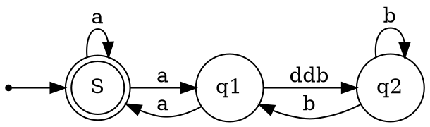

# Item type
```cpp
enum Type {
    INVALID_ITEM = 0,       // 无效项，没有对应的SQL示例
    FIELD_ITEM,             // SELECT name FROM users; -- 选择一个字段
    FUNC_ITEM,              // SELECT COUNT(*) FROM users; -- 使用一个函数
    SUM_FUNC_ITEM,          // SELECT SUM(age) FROM users; -- 使用一个聚合函数
    STRING_ITEM,            // SELECT 'Hello, World!'; -- 使用一个字符串
    INT_ITEM,               // SELECT 12345; -- 使用一个整数
    REAL_ITEM,              // SELECT 123.45; -- 使用一个实数
    NULL_ITEM,              // SELECT NULL; -- 使用一个NULL值
    VARBIN_ITEM,            // SELECT CAST('Hello, World!' AS BINARY); -- 使用一个二进制字符串
    METADATA_COPY_ITEM,     // 在MySQL中，元数据复制是内部处理的，无法直接在SQL中表示
    FIELD_AVG_ITEM,         // SELECT AVG(age) FROM users; -- 使用一个平均函数
    DEFAULT_VALUE_ITEM,     // INSERT INTO users VALUES (DEFAULT); -- 使用一个默认值
    PROC_ITEM,              // CALL my_procedure(); -- 调用一个存储过程
    COND_ITEM,              // SELECT IF(age > 18, 'adult', 'minor') FROM users; -- 使用一个条件表达式
    REF_ITEM,               // SELECT @myvar; -- 使用一个引用
    FIELD_STD_ITEM,         // SELECT STDDEV_POP(age) FROM users; -- 使用一个标准差函数
    FIELD_VARIANCE_ITEM,    // SELECT VAR_POP(age) FROM users; -- 使用一个方差函数
    INSERT_VALUE_ITEM,      // INSERT INTO users VALUES ('John Doe', 30); -- 插入一些值
    SUBSELECT_ITEM,         // SELECT name FROM (SELECT name FROM users) AS u; -- 使用一个子查询
    ROW_ITEM,               // SELECT ROW(1, 2); -- 使用一个行构造器
    CACHE_ITEM,             // 在MySQL中，缓存是内部处理的，无法直接在SQL中表示
    TYPE_HOLDER,            // 类型占位符在MySQL中是内部使用的，无法直接在SQL中表示
    PARAM_ITEM,             // PREPARE stmt FROM 'SELECT ?'; -- 使用一个参数
    TRIGGER_FIELD_ITEM,     // CREATE TRIGGER mytrigger BEFORE INSERT ON mytable FOR EACH ROW SET NEW.col = 0; -- 触发器中引用一个字段
    DECIMAL_ITEM,           // SELECT CAST('123.45' AS DECIMAL(5, 2)); -- 使用一个十进制数
    XPATH_NODESET,          // 在MySQL中，XPath是内部处理的，无法直接在SQL中表示
    XPATH_NODESET_CMP,      // 在MySQL中，XPath比较是内部处理的，无法直接在SQL中表示
    VIEW_FIXER_ITEM,        // 在MySQL中，视图修复是内部处理的，无法直接在SQL中表示
    FIELD_BIT_ITEM,         // SELECT CAST(123 AS BIT); -- 使用一个位字段
    VALUES_COLUMN_ITEM      // INSERT INTO users (name, age) VALUES ('John Doe', 30); -- 插入一些列值
};
```
# Ref_Type
```cpp
  enum Ref_Type { 
    REF,          // 表示普通的引用，通常用于连接查询中的列
    VIEW_REF,     // 表示对视图的引用，用于引用视图中的列
    OUTER_REF,    // 表示外连接中的引用，用于引用外连接中的列
    AGGREGATE_REF // AVG(salary) AS avg_salary   引用聚合函数计算的结果
 };
```

# Item 继承关系




# Item_equal 和 Item_func_eq
在MySQL源码中，`Item_equal` 和 `Item_func_eq` 是两个不同的类，它们用于不同的目的：

1. `Item_equal` 类：
   - 用于表示等式的左右两侧是否相等。
   - 通常用于存储和处理查询中的等式条件，如 `WHERE` 子句中的条件。
   - 不涉及任何函数调用或函数求值，仅表示两个项是否相等。
   - 用于构建和维护多重等式（`COND_EQUAL`）列表，以提高查询性能。

2. `Item_func_eq` 类：
   - 用于表示等式函数，即用于比较两个值是否相等的函数。
   - 在解析查询时，可以使用此类来表示查询中的等式条件。
   - 表示等式的函数，其 `eval()` 方法用于计算等式的结果。
   - 实际上是一个函数调用，它执行相等性比较并返回结果。

因此，主要的区别在于 `Item_equal` 是用于表示等式条件的类，而 `Item_func_eq` 是用于表示等式函数的类。前者用于存储和处理等式的结构信息，而后者用于执行实际的等式比较操作。


static bool check_simple_equality(THD *thd, Item *left_item, Item *right_item,
                                  Item *item, COND_EQUAL *cond_equal,
                                  bool *simple_equality) {
  *simple_equality = false;

  if (left_item->type() == Item::REF_ITEM &&
      down_cast<Item_ref *>(left_item)->ref_type() == Item_ref::VIEW_REF) {     // 如果是 '@试图引用 =' 
    if (down_cast<Item_ref *>(left_item)->is_outer_reference()) return false;   // 如果是外连接的引用则返回成功
    left_item = left_item->real_item();                                         // 返回真实的 item
  }
  if (right_item->type() == Item::REF_ITEM &&
      down_cast<Item_ref *>(right_item)->ref_type() == Item_ref::VIEW_REF) {    // 同上
    if (down_cast<Item_ref *>(right_item)->is_outer_reference()) return false;
    right_item = right_item->real_item();
  }
  const Item_field *left_item_field, *right_item_field;

  if (left_item->type() == Item::FIELD_ITEM &&                                  // 如果是 '字段 = 字段'
      right_item->type() == Item::FIELD_ITEM &&
      (left_item_field = down_cast<const Item_field *>(left_item)) &&
      (right_item_field = down_cast<const Item_field *>(right_item)) &&
      !left_item_field->depended_from && !right_item_field->depended_from) {    // 且这两个字段都没 depended from 别的 query_block
    /* The predicate the form field1=field2 is processed */
    // 处理形式为 field1=field2 的谓词

    const Field *const left_field = left_item_field->field;
    const Field *const right_field = right_item_field->field;

    if (!left_field->eq_def(right_field)) return false;                         // 如果等式左右两边的数据类型不一致，则返回 false

    /* Search for multiple equalities containing field1 and/or field2 */
    // 搜索包含 field1 和/或 field2 的多个等式
    bool left_copyfl, right_copyfl;
    Item_equal *left_item_equal =
        find_item_equal(cond_equal, left_item_field, &left_copyfl);
    Item_equal *right_item_equal =
        find_item_equal(cond_equal, right_item_field, &right_copyfl);

    /* As (NULL=NULL) != TRUE we can't just remove the predicate f=f */
    // 由于 (NULL=NULL) != TRUE，我们不能简单地删除谓词 f=f
    // eq 函数中已经过滤 NULL=NULL 的场景
    if (left_field->eq(right_field)) /* f = f */
    {
      *simple_equality =
          !((left_field->is_nullable() || left_field->table->is_nullable()) &&
            !left_item_equal);
      return false;
    }

    if (left_item_equal && left_item_equal == right_item_equal) {
      /*
        The equality predicate is inference of one of the existing
        multiple equalities, i.e the condition is already covered
        by upper level equalities
      */
      // 等式谓词是已有多个等式的推断，即条件已由上层等式覆盖
      *simple_equality = true;
      return false;
    }

    /* Copy the found multiple equalities at the current level if needed */
    // 如果需要，将找到的多个等式复制到当前级别
    if (left_copyfl) {
      /* left_item_equal of an upper level contains left_item */
      // 上层的 left_item_equal 包含 left_item 
      left_item_equal = new Item_equal(left_item_equal);
      if (left_item_equal == nullptr) return true;
      cond_equal->current_level.push_back(left_item_equal);
    }
    if (right_copyfl) {
      /* right_item_equal of an upper level contains right_item */
      // 上层的 right_item_equal 包含 right_item
      right_item_equal = new Item_equal(right_item_equal);
      if (right_item_equal == nullptr) return true;
      cond_equal->current_level.push_back(right_item_equal);
    }

    if (left_item_equal) {
      /* left item was found in the current or one of the upper levels */
      // 在当前级别或其中一个上层找到了左项
      if (!right_item_equal)
        left_item_equal->add(down_cast<Item_field *>(right_item));
      else {
        /* Merge two multiple equalities forming a new one */
        // 合并两个多个等式以形成新的等式
        if (left_item_equal->merge(thd, right_item_equal)) return true;
        /* Remove the merged multiple equality from the list */
        // 从列表中删除合并的多个等式
        List_iterator<Item_equal> li(cond_equal->current_level);
        while ((li++) != right_item_equal)
          ;
        li.remove();
      }
    } else {
      /* left item was not found neither the current nor in upper levels  */
      // 在当前级别或上层未找到左项
      if (right_item_equal) {
        right_item_equal->add(down_cast<Item_field *>(left_item));
      } else {
        /* None of the fields was found in multiple equalities */
        // 没有在多个等式中找到任何字段
        Item_equal *item_equal =
            new Item_equal(down_cast<Item_field *>(left_item),
                           down_cast<Item_field *>(right_item));
        if (item_equal == nullptr) return true;
        cond_equal->current_level.push_back(item_equal);
      }
    }
    *simple_equality = true;
    return false;
  }

  {
    /* The predicate of the form field=const/const=field is processed */
    // 处理形式为 field=const/const=field 的谓词
    Item *const_item = nullptr;
    Item_field *field_item = nullptr;
    if (left_item->type() == Item::FIELD_ITEM &&
        (field_item = down_cast<Item_field *>(left_item)) &&
        field_item->depended_from == nullptr &&
        right_item->const_for_execution()) {
      const_item = right_item;
    } else if (right_item->type() == Item::FIELD_ITEM &&
               (field_item = down_cast<Item_field *>(right_item)) &&
               field_item->depended_from == nullptr &&
               left_item->const_for_execution()) {
      const_item = left_item;
    }

    // Don't evaluate subqueries if they are disabled during optimization.
    // 如果在优化期间禁用了子查询，则不要计算它们
    if (const_item != nullptr &&
        !evaluate_during_optimization(const_item,
                                      thd->lex->current_query_block()))
      return false;

    /*
      If the constant expression contains a reference to the field
      (for example, a = (a IS NULL)), we don't want to replace the
      field with the constant expression as it makes the predicates
      more complex and may introduce cycles in the Item tree.
    */
    /*
      如果常量表达式包含对字段的引用（例如，a = (a IS NULL)），我们不希望将字段替换为常量表达式，
      因为这会使谓词更复杂，并可能在Item树中引入循环。
    */
    if (const_item != nullptr &&
        const_item->walk(&Item::find_field_processor, enum_walk::POSTFIX,
                         pointer_cast<uchar *>(field_item->field)))
      return false;

    if (const_item && field_item->result_type() == const_item->result_type()) {     // 如果 field_item 和 const_item 的 result_type() 一致
      if (field_item->result_type() == STRING_RESULT) {     // 如果是 STRING_RESULT
        const CHARSET_INFO *cs = field_item->field->charset();
        if (!item) {
          Item_func_eq *const eq_item = new Item_func_eq(left_item, right_item);    // 构建 Item_func_eq，然后赋值给 item
          if (eq_item == nullptr || eq_item->set_cmp_func()) return true;
          eq_item->quick_fix_field();
          item = eq_item;
        }
        if ((cs != down_cast<Item_func *>(item)->compare_collation()) ||     // 如果 const_item 的字符集跟 item 的字符集不一样
            !cs->coll->propagate(cs, nullptr, 0))
          return false;
        // Don't build multiple equalities mixing strings and JSON, not even
        // when they have the same collation, since string comparison and JSON
        // comparison are very different.
        if ((field_item->data_type() == MYSQL_TYPE_JSON) !=     // 如果 field_item 或者 const_item 是 JSON 数据类型，则不构建 MES
            (const_item->data_type() == MYSQL_TYPE_JSON)) {
          return false;
        }
        // Similarly, strings and temporal types have different semantics for
        // equality comparison.
        // 类型为字符串和时间的类型对于等式比较具有不同的语义
        if (const_item->is_temporal()) {
          // No multiple equality for string columns compared to temporal
          // values. See also comment in comparable_in_index().
          // 不要为与时间值进行比较的字符串列构建多个等式。另请参阅comparable_in_index()中的注释
          if (!field_item->is_temporal()) {
            return false;
          }
          // No multiple equality for TIME columns compared to temporal values.
          // See also comment in comparable_in_index().
          // 不要为与时间值进行比较的TIME列构建多个等式。另请参阅comparable_in_index()中的注释
          if (const_item->is_temporal_with_date() &&
              !field_item->is_temporal_with_date()) {
            return false;
          }
        }
      }

      bool copyfl;
      Item_equal *item_equal = find_item_equal(cond_equal, field_item, &copyfl);
      if (copyfl) {
        item_equal = new Item_equal(item_equal);
        if (item_equal == nullptr) return true;
        cond_equal->current_level.push_back(item_equal);
      }
      if (item_equal) {
        if (item_equal->const_arg() != nullptr) {
          // Make sure that the existing const and new one are of comparable
          // collation.
          // 确保现有的常量和新的常量是可比较的排序规则
          DTCollation cmp_collation;
          if (cmp_collation.set(const_item->collation,
                                item_equal->const_arg()->collation,
                                MY_COLL_CMP_CONV) ||
              cmp_collation.derivation == DERIVATION_NONE) {
            return false;
          }
        }
        /*
          The flag cond_false will be set to 1 after this, if item_equal
          already contains a constant and its value is  not equal to
          the value of const_item.
        */
        // 如果 item_equal 已包含常量并且其值与 const_item 的值不相等，则将 cond_false 标志设置为 1
        if (item_equal->add(thd, const_item, field_item)) return true;
      } else {
        item_equal = new Item_equal(const_item, field_item);
        if (item_equal == nullptr) return true;
        cond_equal->current_level.push_back(item_equal);
      }
      *simple_equality = true;
      return false;
    }
  }
  return false;
}

/**
  Convert row equalities into a conjunction of regular equalities.

    The function converts a row equality of the form (E1,...,En)=(E'1,...,E'n)
    into a list of equalities E1=E'1,...,En=E'n. For each of these equalities
    Ei=E'i the function checks whether it is a simple equality or a row
    equality. If it is a simple equality it is used to expand multiple
    equalities of cond_equal. If it is a row equality it converted to a
    sequence of equalities between row elements. If Ei=E'i is neither a
    simple equality nor a row equality the item for this predicate is added
    to eq_list.

  @param thd        thread handle
  @param left_row   left term of the row equality to be processed
  @param right_row  right term of the row equality to be processed
  @param cond_equal multiple equalities that must hold together with the
                    predicate
  @param eq_list    results of conversions of row equalities that are not
                    simple enough to form multiple equalities
  @param[out] simple_equality
                    true if the row equality is composed of only
                    simple equalities.

  @returns false if conversion succeeded, true if any error.
*/
/*
将行相等性转换为正常等式。

  该函数将形如 (E1,...,En)=(E'1,...,E'n) 的行相等性转换为等式列表 E1=E'1,...,En=E'n。
  对于每个等式 Ei=E'i，函数检查它是否是一个简单等式或者行相等性。
  如果它是一个简单等式，它将用于扩展 cond_equal 中的多重相等性。
  如果它是一个行相等性，它将被转换为行元素之间的等式序列。
  如果 Ei=E'i 既不是简单等式也不是行相等性，那么这个谓词的项将被添加到 eq_list 中
*/

static bool check_row_equality(THD *thd, Item *left_row, Item_row *right_row,
                               COND_EQUAL *cond_equal, List<Item> *eq_list,
                               bool *simple_equality) {
  *simple_equality = false;
  const uint n = left_row->cols();
  for (uint i = 0; i < n; i++) {
    bool is_converted;
    Item *left_item = left_row->element_index(i);
    Item *right_item = right_row->element_index(i);
    if (left_item->type() == Item::ROW_ITEM &&
        right_item->type() == Item::ROW_ITEM) {
      if (check_row_equality(thd, down_cast<Item_row *>(left_item),
                             down_cast<Item_row *>(right_item), cond_equal,
                             eq_list, &is_converted))
        return true;
      if (!is_converted) thd->lex->current_query_block()->cond_count++;
    } else {
      if (check_simple_equality(thd, left_item, right_item, nullptr, cond_equal,
                                &is_converted))
        return true;
      thd->lex->current_query_block()->cond_count++;
    }

    if (!is_converted) {
      Item_func_eq *const eq_item = new Item_func_eq(left_item, right_item);
      if (eq_item == nullptr) return true;
      if (eq_item->set_cmp_func()) {
        // Failed to create cmp func -> not only simple equalitities
        return true;
      }
      eq_item->quick_fix_field();
      eq_list->push_back(eq_item);
    }
  }
  *simple_equality = true;
  return false;
}

/**
  Eliminate row equalities and form multiple equalities predicates.

    This function checks whether the item is a simple equality
    i.e. the one that equates a field with another field or a constant
    (field=field_item or field=constant_item), or, a row equality.
    For a simple equality the function looks for a multiple equality
    in the lists referenced directly or indirectly by cond_equal inferring
    the given simple equality. If it doesn't find any, it builds/expands
    multiple equality that covers the predicate.
    Row equalities are eliminated substituted for conjunctive regular
    equalities which are treated in the same way as original equality
    predicates.

  @param thd        thread handle
  @param item       predicate to process
  @param cond_equal multiple equalities that must hold together with the
                    predicate
  @param eq_list    results of conversions of row equalities that are not
                    simple enough to form multiple equalities
  @param[out] equality
                    true if re-writing rules have been applied
                    false otherwise, i.e.
                      if the predicate is not an equality, or
                      if the equality is neither a simple nor a row equality

  @returns false if success, true if error

  @note If the equality was created by IN->EXISTS, it may be removed later by
  subquery materialization. So we don't mix this possibly temporary equality
  with others; if we let it go into a multiple-equality (Item_equal), then we
  could not remove it later. There is however an exception: if the outer
  expression is a constant, it is safe to leave the equality even in
  materialization; all it can do is preventing NULL/FALSE distinction but if
  such distinction mattered the equality would be in a triggered condition so
  we would not come to this function. And injecting constants is good because
  it makes the materialized table smaller.
*/
/**
  消除行相等性并形成多重相等性谓词。

  此函数检查项是否是简单等式，即将字段与另一个字段或常量（field=field_item 或 field=constant_item）相等的项，或者是行相等性。
  对于简单等式，该函数查找通过 cond_equal 直接或间接引用的列表中的多重等式，推断给定的简单等式。
  如果找不到任何等式，则构建/扩展多重等式以覆盖谓词。
  行相等性被消除，替换为作为原始等式谓词的连词规则，以与原始等式谓词相同的方式处理。

  @note 如果等式是由 IN->EXISTS 创建的，则可能稍后会被子查询实现删除。
  因此，我们不将此可能是临时性等式与其他等式混合; 如果让它进入多重等式（Item_equal）中，那么我们以后就无法删除它。
  然而，有一个例外：如果外部表达式是常量，则安全地将等式留在物化表中；它所能做的就是阻止 NULL/FALSE 区分，但如果这种区分很重要，则等式将在触发条件中，所以我们不会来到这个函数。
  并且注入常量是好的，因为它使物化的表更小。
*/

static bool check_equality(THD *thd, Item *item, COND_EQUAL *cond_equal,
                           List<Item> *eq_list, bool *equality) {
  *equality = false;
  assert(item->is_bool_func());
  Item_func *item_func;
  if (item->type() == Item::FUNC_ITEM &&
      (item_func = down_cast<Item_func *>(item))->functype() ==
          Item_func::EQ_FUNC) {    // 如果 item 是 FUNC_ITEM ，则转换为 Item_func，如果转换后是 EQ_FUNC 
    Item *left_item = item_func->arguments()[0];
    Item *right_item = item_func->arguments()[1];

    if (item->created_by_in2exists() && !left_item->const_item())
      return false;  // See note above

    if (left_item->type() == Item::ROW_ITEM &&
        right_item->type() == Item::ROW_ITEM) {     // 如果等式两边都是 ROW_ITEM
      thd->lex->current_query_block()->cond_count--;
      return check_row_equality(thd, down_cast<Item_row *>(left_item),
                                down_cast<Item_row *>(right_item), cond_equal,
                                eq_list, equality);
    } else
      return check_simple_equality(thd, left_item, right_item, item, cond_equal,
                                   equality);
  }

  return false;
}

/**
  Replace all equality predicates in a condition by multiple equality items.

    At each 'and' level the function detects items for equality predicates
    and replaces them by a set of multiple equality items of class Item_equal,
    taking into account inherited equalities from upper levels.
    If an equality predicate is used not in a conjunction it's just
    replaced by a multiple equality predicate.
    For each 'and' level the function set a pointer to the inherited
    multiple equalities in the cond_equal field of the associated
    object of the type Item_cond_and.
    The function also traverses the cond tree and for each field reference
    sets a pointer to the multiple equality item containing the field, if there
    is any. If this multiple equality equates fields to a constant the
    function replaces the field reference by the constant in the cases
    when the field is not of a string type or when the field reference is
    just an argument of a comparison predicate.
    The function also determines the maximum number of members in
    equality lists of each Item_cond_and object assigning it to
    thd->lex->current_query_block()->max_equal_elems.

  @note
    Multiple equality predicate =(f1,..fn) is equivalent to the conjunction of
    f1=f2, .., fn-1=fn. It substitutes any inference from these
    equality predicates that is equivalent to the conjunction.
    Thus, =(a1,a2,a3) can substitute for ((a1=a3) AND (a2=a3) AND (a2=a1)) as
    it is equivalent to ((a1=a2) AND (a2=a3)).
    The function always makes a substitution of all equality predicates occurred
    in a conjunction for a minimal set of multiple equality predicates.
    This set can be considered as a canonical representation of the
    sub-conjunction of the equality predicates.
    E.g. (t1.a=t2.b AND t2.b>5 AND t1.a=t3.c) is replaced by
    (=(t1.a,t2.b,t3.c) AND t2.b>5), not by
    (=(t1.a,t2.b) AND =(t1.a,t3.c) AND t2.b>5);
    while (t1.a=t2.b AND t2.b>5 AND t3.c=t4.d) is replaced by
    (=(t1.a,t2.b) AND =(t3.c=t4.d) AND t2.b>5),
    but if additionally =(t4.d,t2.b) is inherited, it
    will be replaced by (=(t1.a,t2.b,t3.c,t4.d) AND t2.b>5)

    The function performs the substitution in a recursive descent of
    the condition tree, passing to the next AND level a chain of multiple
    equality predicates which have been built at the upper levels.
    The Item_equal items built at the level are attached to other
    non-equality conjuncts as a sublist. The pointer to the inherited
    multiple equalities is saved in the and condition object (Item_cond_and).
    This chain allows us for any field reference occurrence to easily find a
    multiple equality that must be held for this occurrence.
    For each AND level we do the following:
    - scan it for all equality predicate (=) items
    - join them into disjoint Item_equal() groups
    - process the included OR conditions recursively to do the same for
      lower AND levels.

    We need to do things in this order as lower AND levels need to know about
    all possible Item_equal objects in upper levels.

  @param thd          thread handle
  @param cond         condition(expression) where to make replacement
  @param[out] retcond returned condition
  @param inherited    path to all inherited multiple equality items
  @param do_inherit   whether or not to inherit equalities from other parts
                      of the condition

  @returns false if success, true if error
*/

/*
  将条件中的所有等式谓词替换为多重等式项。

  在每个 'and' 级别，该函数检测等式谓词的项，并将它们替换为一组多重等式项（Item_equal），
  同时考虑来自上层的继承等式。
  如果一个等式谓词不是在连词 (如and、not、or) 中使用，它将仅被替换为一个多重等式谓词。
  对于每个 'and' 级别，函数会在与关联对象中设置一个指向继承多重等式的指针。
  函数还遍历条件树，并为每个字段引用设置一个指向包含该字段的多重等式项的指针，
  如果存在的话。如果这个多重等式将字段等于一个常量，当字段不是字符串类型时，
  或者当字段引用只是比较谓词的一个参数时，函数将字段引用替换为常量。
  函数还确定每个 Item_cond_and 对象的等式列表中的最大成员数量，
  并将其分配给 thd->lex->current_query_block()->max_equal_elems。

  @note
    多重等式谓词 =(f1,...fn) 等价于 f1=f2, .., fn-1=fn 的连词。
    它替换了这些等式谓词的任何推断，这些推断等价于合取。
    因此，=(a1,a2,a3) 可以替换 ((a1=a3) AND (a2=a3) AND (a2=a1))，
    因为它等价于 ((a1=a2) AND (a2=a3))。
    函数总是将所有等式谓词的替换作为一个最小集合的多重等式谓词。
    这个集合可以被认为是等式谓词的子连词的规范表示。
    例如，(t1.a=t2.b AND t2.b>5 AND t1.a=t3.c) 被替换为
    (=(t1.a,t2.b,t3.c) AND t2.b>5)，而不是
    (=(t1.a,t2.b) AND =(t1.a,t3.c) AND t2.b>5)；
    而 (t1.a=t2.b AND t2.b>5 AND t3.c=t4.d) 被替换为
    (=(t1.a,t2.b) AND =(t3.c=t4.d) AND t2.b>5)，
    但如果另外继承了 =(t4.d,t2.b)，它将被替换为
    (=(t1.a,t2.b,t3.c,t4.d) AND t2.b>5)。

    函数通过递归遍历条件树进行替换，向下一个 'and' 级别传递一个多重
    等式谓词链，这些谓词已经在更高级别构建。
    在每个 'and' 级别构建的 Item_equal 项被附加到其他非等式合取项作为子列表。
    继承的多重等式的指针保存在 and 条件对象（Item_cond_and）中。
    此链允许我们对于任何字段引用出现轻松地找到必须保持的多重等式。
    对于每个 AND 级别，我们执行以下操作：
    - 扫描它以检测所有等式谓词（=）项
    - 将它们连接成不相交的 Item_equal() 组
    - 递归处理包含的 OR 条件，以便为较低的 AND 级别做同样的处理

    我们需要按照这个顺序进行操作，因为较低的 AND 级别需要知道上层所有可能的 Item_equal 对象。

  @param thd           线程句柄
  @param cond          要进行替换的条件（表达式）
  @param[out] retcond  返回的条件
  @param inherited     所有继承多重等式项的路径
  @param do_inherit    是否继承来自条件的其他部分的等式

  @returns 如果成功则为 false，如果出现任何错误则为 true
*/

static bool build_equal_items_for_cond(THD *thd, Item *cond, Item **retcond,
                                       COND_EQUAL *inherited, bool do_inherit) {
  Item_equal *item_equal;
  COND_EQUAL cond_equal;
  cond_equal.upper_levels = inherited;
  assert(cond->is_bool_func());
  if (check_stack_overrun(thd, STACK_MIN_SIZE, nullptr))
    return true;  // Fatal error flag is set!

  const enum Item::Type cond_type = cond->type();
  if (cond_type == Item::COND_ITEM) {     // 如果 cond 是 COND_ITEM 类型
    List<Item> eq_list;
    Item_cond *const item_cond = down_cast<Item_cond *>(cond);
    const bool and_level = item_cond->functype() == Item_func::COND_AND_FUNC;
    List<Item> *args = item_cond->argument_list();

    List_iterator<Item> li(*args);
    Item *item;

    if (and_level) {
      /*
         Retrieve all conjuncts of this level detecting the equality
         that are subject to substitution by multiple equality items and
         removing each such predicate from the conjunction after having
         found/created a multiple equality whose inference the predicate is.
       */
      /*
         获取此级别的所有连词，并检测那些等于谓词
         可以被多重等式项替换，并在找到/创建了多重等式之后从连词中移除每个这样的谓词。
       */
      while ((item = li++)) {
        /*
          PS/SP note: we can safely remove a node from AND-OR
          structure here because it's restored before each
          re-execution of any prepared statement/stored procedure.
        */
        /*
          PS/SP 注意：我们可以安全地在这里从 AND-OR 结构中移除一个节点，
          因为它会在每次准备执行任何预处理语句/存储过程之前恢复。
         */
        bool equality;
        if (check_equality(thd, item, &cond_equal, &eq_list, &equality))
          return true;
        if (equality) li.remove();
      }

      /*
        Check if we eliminated all the predicates of the level, e.g.
        (a=a AND b=b AND a=a).
      */
      // 检查我们是否消除了该级别的所有谓词，例如 (a=a AND b=b AND a=a)
      if (!args->elements && !cond_equal.current_level.elements &&
          !eq_list.elements) {
        *retcond = new Item_func_true();
        return *retcond == nullptr;
      }

      List_iterator_fast<Item_equal> it(cond_equal.current_level);
      while ((item_equal = it++)) {
        if (item_equal->resolve_type(thd)) return true;
        item_equal->update_used_tables();
        thd->lex->current_query_block()->max_equal_elems =
            std::max(thd->lex->current_query_block()->max_equal_elems,
                     item_equal->members());
      }

      Item_cond_and *const item_cond_and = down_cast<Item_cond_and *>(cond);
      item_cond_and->cond_equal = cond_equal;
      inherited = &item_cond_and->cond_equal;
    }
    /*
       Make replacement of equality predicates for lower levels
       of the condition expression.
    */
    // 替换条件表达式较低级别的等式谓词
    li.rewind();
    while ((item = li++)) {
      Item *new_item;
      if (build_equal_items_for_cond(thd, item, &new_item, inherited,
                                     do_inherit))
        return true;
      if (new_item != item) {
        /* This replacement happens only for standalone equalities */
        /*
          This is ok with PS/SP as the replacement is done for
          arguments of an AND/OR item, which are restored for each
          execution of PS/SP.
        */
        /* 此替换仅发生在独立等式上 */
        /*
          这在 PS/SP 中是可以的，因为替换是针对 AND/OR 项的参数进行的，
          这些参数会在每次执行 PS/SP 时恢复。
        */
        li.replace(new_item);
      }
    }
    if (and_level) {
      args->concat(&eq_list);
      args->concat((List<Item> *)&cond_equal.current_level);
    }
  } else if (cond->type() == Item::FUNC_ITEM) {     // 如果 cond 是 FUNC_ITEM 类型
    List<Item> eq_list;
    /*
      If an equality predicate forms the whole and level,
      we call it standalone equality and it's processed here.
      E.g. in the following where condition
      WHERE a=5 AND (b=5 or a=c)
      (b=5) and (a=c) are standalone equalities.
      In general we can't leave alone standalone eqalities:
      for WHERE a=b AND c=d AND (b=c OR d=5)
      b=c is replaced by =(a,b,c,d).
     */
    /*
      如果等式谓词形成了整个 AND 级别，我们称之为独立等式，它在此处处理。
      例如，在以下 where 条件中
      WHERE a=5 AND (b=5 or a=c)
      (b=5) 和 (a=c) 是独立等式。
      通常情况下，我们不能保留独立等式：
      对于 WHERE a=b AND c=d AND (b=c OR d=5)
      b=c 将被替换为 =(a,b,c,d)。
     */
    bool equality;
    if (check_equality(thd, cond, &cond_equal, &eq_list, &equality))
      return true;
    if (equality) {
      int n = cond_equal.current_level.elements + eq_list.elements;
      if (n == 0) {
        *retcond = new Item_func_true();
        return *retcond == nullptr;
      } else if (n == 1) {
        if ((item_equal = cond_equal.current_level.pop())) {
          if (item_equal->resolve_type(thd)) return true;
          item_equal->update_used_tables();
          thd->lex->current_query_block()->max_equal_elems =
              std::max(thd->lex->current_query_block()->max_equal_elems,
                       item_equal->members());
          *retcond = item_equal;
          return false;
        }

        *retcond = eq_list.pop();
        return false;
      } else {
        /*
          Here a new AND level must be created. It can happen only
          when a row equality is processed as a standalone predicate.
        */
        /*
          在此处必须创建一个新的 AND 级别。
          这只会在将行相等性作为独立谓词处理时发生。
        */
        Item_cond_and *and_cond = new Item_cond_and(eq_list);
        if (and_cond == nullptr) return true;

        and_cond->quick_fix_field();
        List<Item> *args = and_cond->argument_list();
        List_iterator_fast<Item_equal> it(cond_equal.current_level);
        while ((item_equal = it++)) {
          if (item_equal->resolve_type(thd)) return true;
          item_equal->update_used_tables();
          thd->lex->current_query_block()->max_equal_elems =
              std::max(thd->lex->current_query_block()->max_equal_elems,
                       item_equal->members());
        }
        and_cond->cond_equal = cond_equal;
        args->concat((List<Item> *)&cond_equal.current_level);

        *retcond = and_cond;
        return false;
      }
    }

    if (do_inherit) {
      /*
        For each field reference in cond, not from equal item predicates,
        set a pointer to the multiple equality it belongs to (if there is any)
        as soon the field is not of a string type or the field reference is
        an argument of a comparison predicate.
      */
      /*
        对于条件中的每个字段引用，不是来自等式项谓词的字段引用，
        只要字段不是字符串类型，或者字段引用只是比较谓词的一个参数，
        就设置一个指向它所属的多重等式的指针（如果有的话）。
      */
      uchar *is_subst_valid = (uchar *)1;
      cond = cond->compile(&Item::subst_argument_checker, &is_subst_valid,
                           &Item::equal_fields_propagator, (uchar *)inherited);
      if (cond == nullptr) return true;
    }
    cond->update_used_tables();
  }
  *retcond = cond;
  return false;
}

/**
  Build multiple equalities for a WHERE condition and all join conditions that
  inherit these multiple equalities.

    The function first applies the build_equal_items_for_cond function
    to build all multiple equalities for condition cond utilizing equalities
    referred through the parameter inherited. The extended set of
    equalities is returned in the structure referred by the cond_equal_ref
    parameter. After this the function calls itself recursively for
    all join conditions whose direct references can be found in join_list
    and who inherit directly the multiple equalities just having built.

  @note
    The join condition used in an outer join operation inherits all equalities
    from the join condition of the embedding join, if there is any, or
    otherwise - from the where condition.
    This fact is not obvious, but presumably can be proved.
    Consider the following query:
    @code
      SELECT * FROM (t1,t2) LEFT JOIN (t3,t4) ON t1.a=t3.a AND t2.a=t4.a
        WHERE t1.a=t2.a;
    @endcode
    If the join condition in the query inherits =(t1.a,t2.a), then we
    can build the multiple equality =(t1.a,t2.a,t3.a,t4.a) that infers
    the equality t3.a=t4.a. Although the join condition
    t1.a=t3.a AND t2.a=t4.a AND t3.a=t4.a is not equivalent to the one
    in the query the latter can be replaced by the former: the new query
    will return the same result set as the original one.

    Interesting that multiple equality =(t1.a,t2.a,t3.a,t4.a) allows us
    to use t1.a=t3.a AND t3.a=t4.a under the join condition:
    @code
      SELECT * FROM (t1,t2) LEFT JOIN (t3,t4) ON t1.a=t3.a AND t3.a=t4.a
        WHERE t1.a=t2.a
    @endcode
    This query equivalent to:
    @code
      SELECT * FROM (t1 LEFT JOIN (t3,t4) ON t1.a=t3.a AND t3.a=t4.a),t2
        WHERE t1.a=t2.a
    @endcode
    Similarly the original query can be rewritten to the query:
    @code
      SELECT * FROM (t1,t2) LEFT JOIN (t3,t4) ON t2.a=t4.a AND t3.a=t4.a
        WHERE t1.a=t2.a
    @endcode
    that is equivalent to:
    @code
      SELECT * FROM (t2 LEFT JOIN (t3,t4)ON t2.a=t4.a AND t3.a=t4.a), t1
        WHERE t1.a=t2.a
    @endcode
    Thus, applying equalities from the where condition we basically
    can get more freedom in performing join operations.
    Although we don't use this property now, it probably makes sense to use
    it in the future.

  @param thd		     Thread handler
  @param cond                condition to build the multiple equalities for
  @param[out] retcond        Returned condition
  @param inherited           path to all inherited multiple equality items
  @param do_inherit          whether or not to inherit equalities from other
                             parts of the condition
  @param join_list           list of join tables that the condition refers to
  @param[out] cond_equal_ref pointer to the structure to place built
                             equalities in

  @returns false if success, true if error
*/

bool build_equal_items(THD *thd, Item *cond, Item **retcond,
                       COND_EQUAL *inherited, bool do_inherit,
                       mem_root_deque<Table_ref *> *join_list,
                       COND_EQUAL **cond_equal_ref) {
  COND_EQUAL *cond_equal = nullptr;

  if (cond) {
    // 构建多重相等性
    if (build_equal_items_for_cond(thd, cond, &cond, inherited, do_inherit))
      return true;
    // // 更新使用的表
    cond->update_used_tables();
    // update_used_tables() returns void but can still fail.
    if (thd->is_error()) return true;

    const enum Item::Type cond_type = cond->type();
    if (cond_type == Item::COND_ITEM &&
        down_cast<Item_cond *>(cond)->functype() == Item_func::COND_AND_FUNC)
      cond_equal = &down_cast<Item_cond_and *>(cond)->cond_equal;
    else if (cond_type == Item::FUNC_ITEM &&
             down_cast<Item_func *>(cond)->functype() ==
                 Item_func::MULT_EQUAL_FUNC) {
      cond_equal = new (thd->mem_root) COND_EQUAL;     // 创建新的COND_EQUAL结构
      if (cond_equal == nullptr) return true;
      cond_equal->current_level.push_back(down_cast<Item_equal *>(cond));     // 将当前项添加到当前级别的多重相等性列表中
    }
  }
  // 如果存在多重相等性，则设置继承
  if (cond_equal) {
    cond_equal->upper_levels = inherited;
    inherited = cond_equal;
  }
  *cond_equal_ref = cond_equal;

  // 递归构建连接条件的多重相等性
  if (join_list) {
    for (Table_ref *table : *join_list) {
      if (table->join_cond_optim()) {
        mem_root_deque<Table_ref *> *nested_join_list =
            table->nested_join ? &table->nested_join->m_tables : nullptr;
        Item *join_cond;
        if (build_equal_items(thd, table->join_cond_optim(), &join_cond,
                              inherited, do_inherit, nested_join_list,
                              &table->cond_equal))
          return true;
        table->set_join_cond_optim(join_cond);
      }
    }
  }

  *retcond = cond;
  return false;
}


// 如果项不访问任何表, 或者没有子查询，或者查询块未禁用子查询优化选项，则可以在优化期间评估
bool evaluate_during_optimization(const Item *item, const Query_block *select) {
  /*
    Should only be called on items that are const_for_execution(), as those
    items are the only ones that are allowed to be evaluated during optimization
    in the first place.

    Additionally, allow items that only access tables in JOIN::const_table_map.
    This should not be necessary, but the const_for_execution() property is not
    always updated correctly by update_used_tables() for certain subqueries.
  */
  assert(item->const_for_execution() ||
         (item->used_tables() & ~select->join->const_table_map) == 0);

  // If the Item does not access any tables, it can always be evaluated.
  if (item->const_item()) return true;     // 如果项不访问任何表，则始终可以进行评估

  return !item->has_subquery() || (select->active_options() &
                                   OPTION_NO_SUBQUERY_DURING_OPTIMIZATION) == 0;     // 如果项没有子查询，或者查询块未禁用子查询优化选项，则可以在优化期间评估
}
