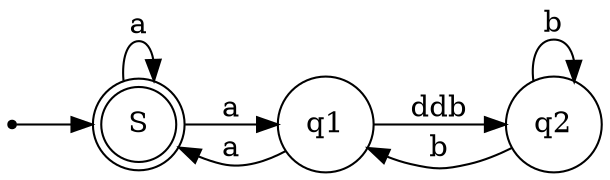

# Item type
```cpp
enum Type {
    INVALID_ITEM = 0,       // 无效项，没有对应的SQL示例
    FIELD_ITEM,             // SELECT name FROM users; -- 选择一个字段
    FUNC_ITEM,              // SELECT COUNT(*) FROM users; -- 使用一个函数
    SUM_FUNC_ITEM,          // SELECT SUM(age) FROM users; -- 使用一个聚合函数
    STRING_ITEM,            // SELECT 'Hello, World!'; -- 使用一个字符串
    INT_ITEM,               // SELECT 12345; -- 使用一个整数
    REAL_ITEM,              // SELECT 123.45; -- 使用一个实数
    NULL_ITEM,              // SELECT NULL; -- 使用一个NULL值
    VARBIN_ITEM,            // SELECT CAST('Hello, World!' AS BINARY); -- 使用一个二进制字符串
    METADATA_COPY_ITEM,     // 在MySQL中，元数据复制是内部处理的，无法直接在SQL中表示
    FIELD_AVG_ITEM,         // SELECT AVG(age) FROM users; -- 使用一个平均函数
    DEFAULT_VALUE_ITEM,     // INSERT INTO users VALUES (DEFAULT); -- 使用一个默认值
    PROC_ITEM,              // CALL my_procedure(); -- 调用一个存储过程
    COND_ITEM,              // SELECT IF(age > 18, 'adult', 'minor') FROM users; -- 使用一个条件表达式
    REF_ITEM,               // SELECT @myvar; -- 使用一个引用
    FIELD_STD_ITEM,         // SELECT STDDEV_POP(age) FROM users; -- 使用一个标准差函数
    FIELD_VARIANCE_ITEM,    // SELECT VAR_POP(age) FROM users; -- 使用一个方差函数
    INSERT_VALUE_ITEM,      // INSERT INTO users VALUES ('John Doe', 30); -- 插入一些值
    SUBSELECT_ITEM,         // SELECT name FROM (SELECT name FROM users) AS u; -- 使用一个子查询
    ROW_ITEM,               // SELECT ROW(1, 2); -- 使用一个行构造器
    CACHE_ITEM,             // 在MySQL中，缓存是内部处理的，无法直接在SQL中表示
    TYPE_HOLDER,            // 类型占位符在MySQL中是内部使用的，无法直接在SQL中表示
    PARAM_ITEM,             // PREPARE stmt FROM 'SELECT ?'; -- 使用一个参数
    TRIGGER_FIELD_ITEM,     // CREATE TRIGGER mytrigger BEFORE INSERT ON mytable FOR EACH ROW SET NEW.col = 0; -- 触发器中引用一个字段
    DECIMAL_ITEM,           // SELECT CAST('123.45' AS DECIMAL(5, 2)); -- 使用一个十进制数
    XPATH_NODESET,          // 在MySQL中，XPath是内部处理的，无法直接在SQL中表示
    XPATH_NODESET_CMP,      // 在MySQL中，XPath比较是内部处理的，无法直接在SQL中表示
    VIEW_FIXER_ITEM,        // 在MySQL中，视图修复是内部处理的，无法直接在SQL中表示
    FIELD_BIT_ITEM,         // SELECT CAST(123 AS BIT); -- 使用一个位字段
    VALUES_COLUMN_ITEM      // INSERT INTO users (name, age) VALUES ('John Doe', 30); -- 插入一些列值
};
```
# Ref_Type
```cpp
  enum Ref_Type { 
    REF,          // 表示普通的引用，通常用于连接查询中的列
    VIEW_REF,     // 表示对视图的引用，用于引用视图中的列
    OUTER_REF,    // 表示外连接中的引用，用于引用外连接中的列
    AGGREGATE_REF // AVG(salary) AS avg_salary   引用聚合函数计算的结果
 };
```

# Item 继承关系




# Item_equal 和 Item_func_eq
在MySQL源码中，`Item_equal` 和 `Item_func_eq` 是两个不同的类，它们用于不同的目的：

1. `Item_equal` 类：
   - 用于表示等式的左右两侧是否相等。
   - 通常用于存储和处理查询中的等式条件，如 `WHERE` 子句中的条件。
   - 不涉及任何函数调用或函数求值，仅表示两个项是否相等。
   - 用于构建和维护多重等式（`COND_EQUAL`）列表，以提高查询性能。

2. `Item_func_eq` 类：
   - 用于表示等式函数，即用于比较两个值是否相等的函数。
   - 在解析查询时，可以使用此类来表示查询中的等式条件。
   - 表示等式的函数，其 `eval()` 方法用于计算等式的结果。
   - 实际上是一个函数调用，它执行相等性比较并返回结果。

因此，主要的区别在于 `Item_equal` 是用于表示等式条件的类，而 `Item_func_eq` 是用于表示等式函数的类。前者用于存储和处理等式的结构信息，而后者用于执行实际的等式比较操作。
