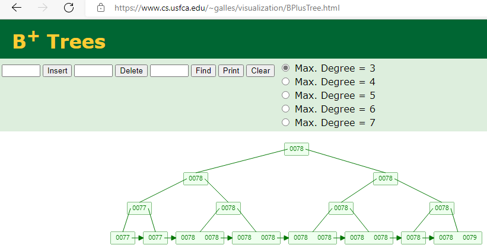

- [版本](#版本)
- [压测](#压测)
- [online ddl测试](#online-ddl测试)
- [mysql线程、锁问题排查](#mysql线程锁问题排查)
  - [事务先行](#事务先行)
- [MRR演示](#mrr演示)
- [MRR介绍](#mrr介绍)
- [BKA介绍](#bka介绍)
- [BKA和MMR的区别](#bka和mmr的区别)
- [Index Merge](#index-merge)
- [mysql优化经验](#mysql优化经验)
- [窗口函数](#窗口函数)
  - [语法](#语法)
  - [例子](#例子)
- [gtid](#gtid)
- [统计各个表DML情况](#统计各个表dml情况)
- [LOCK TYPE](#lock-type)
- [观察锁情况](#观察锁情况)
- [redo log](#redo-log)
- [double write buffer](#double-write-buffer)
- [mysql crash](#mysql-crash)
- [并行复制MTS](#并行复制mts)
  - [slave](#slave)
- [一致性非阻塞读](#一致性非阻塞读)
  - [阻塞读](#阻塞读)
- [插件keyring 表空间加密](#插件keyring-表空间加密)
- [替换mysqldump中的内容](#替换mysqldump中的内容)
- [创建用户](#创建用户)
- [mysql排序规则](#mysql排序规则)
- [mysqlshow](#mysqlshow)
- [统计SQL](#统计sql)
- [主备延迟分析](#主备延迟分析)
- [ARM mariadb的高可用架构](#arm-mariadb的高可用架构)
- [中间件类](#中间件类)
- [mysql bug查找方式：](#mysql-bug查找方式)
- [半同步插件](#半同步插件)
  - [半同步开关](#半同步开关)
- [coredump](#coredump)
  - [如何打开：](#如何打开)
  - [如何关闭：](#如何关闭)
- [processlist收集](#processlist收集)
- [Semaphore 问题](#semaphore-问题)
  - [监控脚本](#监控脚本)
- [mysql crash问题排查](#mysql-crash问题排查)
- [mysqldump](#mysqldump)
- [mysql innodb\_monitor](#mysql-innodb_monitor)
- [uuid的问题](#uuid的问题)
- [分页问题](#分页问题)
- [SQL\_MODE](#sql_mode)
- [统计连接信息](#统计连接信息)
- [收集mysql信息：](#收集mysql信息)
- [客户端字符集设置问题](#客户端字符集设置问题)
- [自动补全](#自动补全)
- [百万QPS](#百万qps)
- [分页优化](#分页优化)
- [如何判断长事务](#如何判断长事务)
- [如何判断大事务](#如何判断大事务)
- [ONLINE DDL调整varchar](#online-ddl调整varchar)
- [History list length](#history-list-length)
- [限制事务的大小](#限制事务的大小)
- [内存使用分析](#内存使用分析)
- [重建表](#重建表)
- [optimizer\_trace](#optimizer_trace)
- [快速定位GTID附近的BINLOG内容](#快速定位gtid附近的binlog内容)
- [Installing Semisynchronous Replication](#installing-semisynchronous-replication)
- [访问频次最多的前20个表 (方法1)](#访问频次最多的前20个表-方法1)
- [访问频次最多的前1个表(方法2)](#访问频次最多的前1个表方法2)
- [获取平均TPS、QPS](#获取平均tpsqps)
- [统计sql执行频率](#统计sql执行频率)
- [performance\_schema 库](#performance_schema-库)
- [sys库](#sys库)
- [临时表大小](#临时表大小)
- [OPEN\_TABLE\_CACHE 跟 Opened\_tables 区别](#open_table_cache-跟-opened_tables-区别)
- [Questions](#questions)
- [max-prepared-stmt-count](#max-prepared-stmt-count)
  - [Prepared Statements](#prepared-statements)
- [系统变量](#系统变量)
- [社区地址](#社区地址)
- [MYSQL线程](#mysql线程)
- [JOIN算法](#join算法)
- [InnoDB Adaptive hash index介绍](#innodb-adaptive-hash-index介绍)
- [MySQL8.0特性之redo logging动态开关](#mysql80特性之redo-logging动态开关)
- [explain](#explain)
- [自适应HASH性能测试](#自适应hash性能测试)
- [AUTO INS锁](#auto-ins锁)
- [EXPLAIN测试](#explain测试)
- [explain 聚合查询](#explain-聚合查询)
- [主键范围查询需要每行进行判断](#主键范围查询需要每行进行判断)
- [mvcc](#mvcc)
- [undo日志](#undo日志)
- [MYSQL B+树索引对相同值的的处理](#mysql-b树索引对相同值的的处理)
- [TRACE](#trace)
- [开发连接串配置](#开发连接串配置)
- [redo log 跟binlog 变化跟踪](#redo-log-跟binlog-变化跟踪)
- [show engine innodb status中查看锁](#show-engine-innodb-status中查看锁)
- [面试问题](#面试问题)
- [MGR实践](#mgr实践)
- [直方图的生成](#直方图的生成)
- [mysql router使用](#mysql-router使用)
- [等待事件表](#等待事件表)
- [MySQL 时区转换](#mysql-时区转换)
  - [MySQL 时区转换的流程](#mysql-时区转换的流程)
- [MySQL 性能模式](#mysql-性能模式)
- [mysql 8 中文手册](#mysql-8-中文手册)
- [redolog跟binlog写入时机对比](#redolog跟binlog写入时机对比)
- [数据内容对比的SQL](#数据内容对比的sql)
- [基于gtid搭建主从MySQL](#基于gtid搭建主从mysql)
- [sysbench 压测](#sysbench-压测)
- [TIDB 尝试](#tidb-尝试)
- [proxysql实践](#proxysql实践)
- [其它](#其它)
- [编译后初始化](#编译后初始化)
- [客户端对中文的显示不对齐](#客户端对中文的显示不对齐)
- [only\_full\_group\_by](#only_full_group_by)
- [通过用户限制 SQL 对资源使用](#通过用户限制-sql-对资源使用)
- [innodb\_table\_stats 和 Innodb\_index\_stats](#innodb_table_stats-和-innodb_index_stats)
  - [innodb\_table\_stats](#innodb_table_stats)
  - [innodb\_index\_stats](#innodb_index_stats)
  - [ANALYZE TABLE](#analyze-table)
- [枚举类型测试](#枚举类型测试)
  - [枚举类型官网讲解](#枚举类型官网讲解)
- [decimal 跟浮点数的区别](#decimal-跟浮点数的区别)

# 版本

8.0.26

# 压测

```sql
SELECT BENCHMARK(10000000,(select 1));
```

# online ddl测试

Performance and Space Requirements
ALTER TABLE operations are processed using one of the following algorithms:
COPY: Operations are performed on a copy of the original table, and table data is copied from the original table to the new table row by row. Concurrent DML is not permitted.
INPLACE: Operations avoid copying table data but may rebuild the table in place. An exclusive metadata lock on the table may be taken briefly during preparation and execution phases of the operation. Typically, concurrent DML is supported.
INSTANT: Operations only modify metadata in the data dictionary. An exclusive metadata lock on the table may be taken briefly during the execution phase of the operation. Table data is unaffected, making operations instantaneous. Concurrent DML is permitted. (Introduced in MySQL 8.0.12)

```sql
CREATE TABLE `sbtest1` (
  `id` int NOT NULL AUTO_INCREMENT,
  `k` int NOT NULL DEFAULT '0',
  `c` char(120) NOT NULL DEFAULT '',
  `pad` char(60) NOT NULL DEFAULT '',
  PRIMARY KEY (`id`),
  KEY `k_1` (`k`)
) ENGINE=InnoDB AUTO_INCREMENT=5000001 DEFAULT CHARSET=utf8mb4 COLLATE=utf8mb4_0900_ai_ci;

插入500W记录

##mysql> alter table sbtest1 add column d varchar(32);
Query OK, 0 rows affected (2.31 sec)
Records: 0  Duplicates: 0  Warnings: 0
sysbench oltp_read_write.lua  不中断

mysql> alter table sbtest1 add column e varchar(32) after c;
Query OK, 0 rows affected (4 min 59.77 sec)
Records: 0  Duplicates: 0  Warnings: 0
sysbench oltp_read_write.lua  不中断

mysql> alter table sbtest1 RENAME COLUMN e to f;
Query OK, 0 rows affected (0.04 sec)
Records: 0  Duplicates: 0  Warnings: 0

mysql> alter table sbtest1 change f g varchar(64) default 'test';
Query OK, 5000000 rows affected (1 min 35.60 sec)
Records: 5000000  Duplicates: 0  Warnings: 0


mysql> alter table sbtest1 drop column g;
Query OK, 0 rows affected (3 min 47.10 sec)
Records: 0  Duplicates: 0  Warnings: 0

mysql> alter table sbtest1 drop index k_1;
Query OK, 0 rows affected (0.01 sec)
Records: 0  Duplicates: 0  Warnings: 0

mysql> alter table sbtest1 add index k_1(k);
Query OK, 0 rows affected (15.94 sec)
Records: 0  Duplicates: 0  Warnings: 0
mysql> select * from performance_schema.metadata_locks;
+-------------+--------------------+------------------+-------------+-----------------------+---------------------+---------------+-------------+--------------------+-----------------+----------------+
| OBJECT_TYPE | OBJECT_SCHEMA      | OBJECT_NAME      | COLUMN_NAME | OBJECT_INSTANCE_BEGIN | LOCK_TYPE           | LOCK_DURATION | LOCK_STATUS | SOURCE             | OWNER_THREAD_ID | OWNER_EVENT_ID |
+-------------+--------------------+------------------+-------------+-----------------------+---------------------+---------------+-------------+--------------------+-----------------+----------------+
| GLOBAL      | NULL               | NULL             | NULL        |       140693398627488 | INTENTION_EXCLUSIVE | STATEMENT     | GRANTED     | sql_base.cc:5435   |              54 |             11 |
| BACKUP LOCK | NULL               | NULL             | NULL        |       140693398377536 | INTENTION_EXCLUSIVE | TRANSACTION   | GRANTED     | sql_base.cc:5442   |              54 |             11 |
| SCHEMA      | sysbench           | NULL             | NULL        |       140693397901936 | INTENTION_EXCLUSIVE | TRANSACTION   | GRANTED     | sql_base.cc:5422   |              54 |             11 |
| TABLE       | sysbench           | sbtest1          | NULL        |       140693398360352 | SHARED_UPGRADABLE   | TRANSACTION   | GRANTED     | sql_parse.cc:5800  |              54 |             11 |
| TABLESPACE  | NULL               | sysbench/sbtest1 | NULL        |       140693398369136 | INTENTION_EXCLUSIVE | TRANSACTION   | GRANTED     | lock.cc:800        |              54 |             11 |
| TABLE       | sysbench           | #sql-35d2dd_9    | NULL        |       140693397899808 | EXCLUSIVE           | STATEMENT     | GRANTED     | sql_table.cc:16567 |              54 |             11 |
| TABLE       | performance_schema | metadata_locks   | NULL        |       140693608288704 | SHARED_READ         | TRANSACTION   | GRANTED     | sql_parse.cc:5800  |              53 |            118 |
+-------------+--------------------+------------------+-------------+-----------------------+---------------------+---------------+-------------+--------------------+-----------------+----------------+
7 rows in set (0.00 sec)

mysql> alter table sbtest1 CHARSET=gbk;
Query OK, 0 rows affected (0.01 sec)
Records: 0  Duplicates: 0  Warnings: 0

ALGORITHM [=] {DEFAULT | INSTANT | INPLACE | COPY}

a pending metadata lock blocks subsequent transactions on the table.
```

# mysql线程、锁问题排查

```sql
select THREAD_ID,PROCESSLIST_ID,PARENT_THREAD_ID,THREAD_OS_ID from performance_schema.threads;
select @@innodb_concurrency_tickets,@@innodb_thread_concurrency;

show full processlist;
select concat('KILL ',id,';') from INFORMATION_SCHEMA.processlist  where info is not null;
select * from INFORMATION_SCHEMA.processlist where info is not null\G

SELECT now(),t.* FROM INFORMATION_SCHEMA.INNODB_TRX t order by trx_started limit 10;
5.7
SELECT * FROM INFORMATION_SCHEMA.INNODB_TRX\G
SELECT * FROM INFORMATION_SCHEMA.INNODB_LOCKs\G
SELECT * FROM INFORMATION_SCHEMA.INNODB_LOCK_waits\G
8
SELECT * FROM INFORMATION_SCHEMA.INNODB_TRX\G
SELECT * FROM INFORMATION_SCHEMA.DATA_LOCK\G
SELECT * FROM performance_schema.data_lock_waits\G
```

## 事务先行

```sql
SELECT * FROM INFORMATION_SCHEMA.INNODB_TRX trx 
left join INFORMATION_SCHEMA.INNODB_LOCK_waits w on trx.trx_id=w.requesting_trx_id
left join INFORMATION_SCHEMA.INNODB_TRX trx2 on trx2.trx_id=w.blocking_trx_id 
left join INFORMATION_SCHEMA.INNODB_LOCKs l on l.lock_id=w.requested_lock_id #and l.lock_trx_id=trx.trx_id
left join INFORMATION_SCHEMA.INNODB_LOCKs l2 on l2.lock_id=w.blocking_lock_id #and l2.lock_trx_id=trx2.trx_id
left join INFORMATION_SCHEMA.PROCESSLIST p on p.ID=trx.trx_mysql_thread_id
left join INFORMATION_SCHEMA.PROCESSLIST p2 on p2.ID=trx2.trx_mysql_thread_id
left join performance_schema.threads t on t.PROCESSLIST_ID=p.ID
left join performance_schema.threads t2 on t2.PROCESSLIST_ID=p2.ID
where trx.trx_state!="RUNNING"\G

#8.0
SELECT * FROM INFORMATION_SCHEMA.INNODB_TRX trx 
left join performance_schema.data_lock_waits w on trx.trx_id=w.REQUESTING_ENGINE_TRANSACTION_ID
left join INFORMATION_SCHEMA.INNODB_TRX trx2 on trx2.trx_id=w.BLOCKING_ENGINE_TRANSACTION_ID 
left join performance_schema.data_locks l on l.engine_lock_id=w.requesting_engine_lock_id #and l.lock_trx_id=trx.trx_id
left join performance_schema.data_locks l2 on l2.engine_lock_id=w.blocking_engine_lock_id #and l2.lock_trx_id=trx2.trx_id
left join INFORMATION_SCHEMA.PROCESSLIST p on p.ID=trx.trx_mysql_thread_id
left join INFORMATION_SCHEMA.PROCESSLIST p2 on p2.ID=trx2.trx_mysql_thread_id
left join performance_schema.threads t on t.PROCESSLIST_ID=p.ID
left join performance_schema.threads t2 on t2.PROCESSLIST_ID=p2.ID
where trx.trx_state!="RUNNING"\G
```

# MRR演示

When MRR is used, the Extra column in EXPLAIN output shows Using MRR.

```sql
select @@read_rnd_buffer_size;
+------------------------+
| @@read_rnd_buffer_size |
+------------------------+
|                 262144 |
+------------------------+

select @@optimizer_switch
mrr=on,mrr_cost_based=on

mysql> explain select * from sbtest1 where k between 1 and 10;
+----+-------------+---------+------------+-------+---------------+-------+---------+------+------+----------+-----------------------+
| id | select_type | table   | partitions | type  | possible_keys | key   | key_len | ref  | rows | filtered | Extra                 |
+----+-------------+---------+------------+-------+---------------+-------+---------+------+------+----------+-----------------------+
|  1 | SIMPLE      | sbtest1 | NULL       | range | idx_k         | idx_k | 4       | NULL |    9 |   100.00 | Using index condition |
+----+-------------+---------+------------+-------+---------------+-------+---------+------+------+----------+-----------------------+
mysql> explain select /*+ MRR(sbtest1)*/ * from sbtest1 where k between 1 and 10;
+----+-------------+---------+------------+-------+---------------+-------+---------+------+------+----------+----------------------------------+
| id | select_type | table   | partitions | type  | possible_keys | key   | key_len | ref  | rows | filtered | Extra                            |
+----+-------------+---------+------------+-------+---------------+-------+---------+------+------+----------+----------------------------------+
|  1 | SIMPLE      | sbtest1 | NULL       | range | idx_k         | idx_k | 4       | NULL |    9 |   100.00 | Using index condition; Using MRR |
+----+-------------+---------+------------+-------+---------------+-------+---------+------+------+----------+----------------------------------+
```

如果走索引，结果集默认按索引排序。如果Using MRR，则按主键排序。
https://dev.mysql.com/doc/refman/8.0/en/optimizer-hints.html

# MRR介绍

MySQL 的 Multi-Range Read（MRR）是一种优化读操作的策略。MRR 主要用于改善全表扫描和索引扫描的性能，尤其是在涉及联接操作或排序操作时。

基本上，MRR 可以减少随机磁盘I/O访问，并使得 I/O 访问更趋向于顺序化，这样可以有效地利用操作系统的 I/O 缓存，并提高查询性能。对于大型表和复杂查询，MRR 的效果更为明显。

在传统的联接操作中，MySQL 会遍历驱动表中的每一行，然后根据联接条件去查找其他表中的匹配行。每次查找都可能涉及到磁盘 I/O，如果驱动表的行数很多，就会导致大量的随机磁盘I/O访问。

而使用 MRR 时，MySQL 会首先遍历驱动表并收集所有需要查找的键值，然后按照键值在磁盘上的物理位置排序，最后按照这个顺序去查找其他表中的匹配行。这样就把原本的随机磁盘 I/O 访问变为了顺序磁盘 I/O 访问，大大提高了性能。

需要注意的是，MRR 是在 MySQL 5.6 版本引入的，而且默认是关闭的。你可以通过设置 `optimizer_switch` 系统变量来启用 MRR，例如：

```sql
SET optimizer_switch='mrr=on,mrr_cost_based=off';
```

这里 `mrr` 参数是用来开启 MRR，而 `mrr_cost_based` 参数是用来指定是否根据成本来决定是否使用 MRR。如果设置为 `off`，则无论成本如何都会使用 MRR。

# BKA介绍

Batched Key Access (BKA) 是 MySQL 中一种用于优化联接操作的策略，通常和 Multi-Range Read (MRR) 一起使用以获取更好的性能。BKA 主要优化了 MySQL 在处理联接查询时的 I/O 操作。

在传统的联接操作中，MySQL 会为驱动表中的每一行单独执行联接操作，这可能会导致大量的随机磁盘 I/O 操作，尤其是在处理大型表时。

使用 BKA 后，MySQL 在处理联接操作时会首先从驱动表中读取一批行（一个“批次”），然后将这个批次中的所有行需要联接的键值一起发送到被驱动表。MySQL 在被驱动表中会按照键值在磁盘上的物理位置顺序来获取匹配的行，这样就把随机磁盘 I/O 操作变为了顺序磁盘 I/O 操作。

BKA 的这种批处理方式减少了磁盘 I/O 操作的次数，从而提高了联接查询的性能。尤其是在处理大型表和复杂查询时，BKA 的效果更为明显。

需要注意的是，BKA 是在 MySQL 5.6 版本引入的，而且默认是关闭的。你可以通过设置 `optimizer_switch` 系统变量来启用 BKA，例如：

```sql
SET optimizer_switch='mrr=on,mrr_cost_based=off,batched_key_access=on';
```

这里 `mrr` 和 `mrr_cost_based` 参数是用来开启和配置 MRR 的，而 `batched_key_access` 参数是用来开启 BKA 的。将这三个参数都开启可以使 MRR 和 BKA 一起工作，从而获取更好的性能。

# BKA和MMR的区别

MRR和BKA都是MySQL优化查询的策略，它们都旨在通过更有效地使用I/O操作来提高查询性能。下面是MRR和BKA的主要特性和差异：

| 特性                   | MRR（Multi-Range Read）                                                                  | BKA（Batched Key Access）                                                                              |
| ---------------------- | ---------------------------------------------------------------------------------------- | ------------------------------------------------------------------------------------------------------ |
| **主要目标**     | 提高全表扫描和索引扫描的性能                                                             | 优化联接查询的性能                                                                                     |
| **工作方式**     | 先收集需要读取的键值，然后按照这些键值在磁盘上的物理位置排序，最后按照这个顺序进行读取。 | 在处理联接操作时，首先从驱动表中读取一批行，然后将这个批次中的所有行需要联接的键值一起发送到被驱动表。 |
| **优势**         | 可以将随机磁盘 I/O 访问变为顺序磁盘 I/O 访问，提高查询性能                               | 可以减少磁盘 I/O 操作的次数，提高联接查询的性能                                                        |
| **最适合的场景** | 全表扫描或索引扫描，尤其是涉及大型表和复杂查询                                           | 联接查询，尤其是处理大型表和复杂查询                                                                   |
| **开启方式**     | `SET optimizer_switch='mrr=on,mrr_cost_based=off';`                                    | `SET optimizer_switch='mrr=on,mrr_cost_based=off,batched_key_access=on';`                            |

在某些情况下，MRR和BKA可以一起使用以获取更好的性能。比如，在处理联接查询时，可以首先用MRR来优化驱动表的扫描，然后用BKA来优化从驱动表到被驱动表的联接操作。使用这两种策略的组合可以进一步减少随机磁盘 I/O 访问，提高查询性能。

# Index Merge

In EXPLAIN output, the Index Merge method appears as index_merge in the type column.
Using intersect(...)
Using union(...)
Using sort_union(...)

# mysql优化经验

time_zone设定具体'+8:00'；尽量少使用timestamp；

# 窗口函数
## 语法
MySQL的窗口函数语法如下：

```sql
函数名 ( [参数]) OVER (PARTITION BY [分组字段] ORDER BY [排序字段] ASC/DESC ROWS/RANGE BETWEEN 起始位置 AND 结束位置)
```

这个语法可以分为两个部分：

1. **函数名称**：窗口函数的数量较少，只有11个窗口函数+聚合函数（所有聚合函数都可以用作开窗函数），根据函数性质，有的要写参数，有的不需要写参数。

2. **OVER语句**：`OVER()`是必须要写的，里面有三个参数，都是非必须参数，根据需求选写：
    - 第一个参数是 `PARTITION BY +分组字段`，将数据根据此字段分成多份，如果不加`PARTITION BY`参数，那会把整个数据当做一个窗口。
    - 第二个参数是 `ORDER BY +排序字段`，每个窗口的数据要不要进行排序。
    - 第三个参数 `ROWS/RANGE BETWEEN 起始位置 AND 结束位置`，这个参数仅针对滑动窗口函数有用，是在当前窗口下分出更小的子窗口。

其中起始位置和结束位置可写：
- `CURRENT ROW` 边界是当前行
- `UNBOUNDED PRECEDING` 边界是分区中的第一行
- `UNBOUNDED FOLLOWING` 边界是分区中的最后一行
- `EXPR PRECEDING` 边界是当前行减去expr的值
- `EXPR FOLLOWING` 边界是当前行加上expr的值。

`ROWS`是基于行数，`RANGE`是基于值的大小。
## 例子
MySQL的窗口函数可以在结果集的行上执行计算，同时考虑当前行的上下文。以下是一个例子，假设我们有一个名为`sales`的表，其中包含`employee_id`和`sale_amount`两个字段。

```sql
CREATE TABLE sales (
  employee_id INT,
  sale_amount DECIMAL(5,2)
);

INSERT INTO sales VALUES
(1, 100.00),
(1, 200.00),
(1, 300.00),
(2, 150.00),
(2, 250.00);
```

我们可以使用`SUM()`窗口函数来计算每个员工的累计销售额：

```sql
SELECT 
  employee_id, 
  sale_amount, 
  SUM(sale_amount) OVER (PARTITION BY employee_id ORDER BY sale_amount) as cumulative_sales
FROM 
  sales;
```

这将返回以下结果集：

| employee_id | sale_amount | cumulative_sales |
|-------------|-------------|------------------|
| 1           | 100.00      | 100.00           |
| 1           | 200.00      | 300.00           |
| 1           | 300.00      | 600.00           |
| 2           | 150.00      | 150.00           |
| 2           | 250.00      | 400.00           |

在这个例子中，`SUM()`函数被用作窗口函数，`PARTITION BY`子句将数据分为每个`employee_id`的分区，`ORDER BY`子句定义了每个分区内的排序。这样，`SUM()`函数就会在每个分区内，对`sale_amount`进行累加，得到`cumulative_sales`。每一行的`cumulative_sales`值都是该行及其在当前分区内的所有前面行的`sale_amount`值的总和。这就是窗口函数的工作方式。注意，窗口函数不会改变结果集的行数。每一行的窗口函数结果都与原始表中的一行相对应。这与聚合函数不同，聚合函数会将多行数据合并为一行。窗口函数在分析数据时非常有用，例如计算运行总计、平均值、排名等。
# gtid

```sql
SELECT MASTER_POS_WAIT(file, position);
Or from MySQL 8.0.26:
SELECT SOURCE_POS_WAIT(file, position);

mysql> show status like '%gtid%';
Empty set (0.00 sec)

select @@GLOBAL.gtid_executed;
mysql> show variables like '%gtid%';
+----------------------------------+-----------------------------------------------+
| Variable_name                    | Value                                         |
+----------------------------------+-----------------------------------------------+
| binlog_gtid_simple_recovery      | ON                                            |
| enforce_gtid_consistency         | ON                                            |
| gtid_executed                    | 91958c1c-a98e-11ec-9539-52540029a651:1-274856 |
| gtid_executed_compression_period | 0                                             |
| gtid_mode                        | ON                                            |
| gtid_next                        | AUTOMATIC                                     |
| gtid_owned                       |                                               |
| gtid_purged                      | 91958c1c-a98e-11ec-9539-52540029a651:1-197671 |
| session_track_gtids              | OFF                                           |
+----------------------------------+-----------------------------------------------+

select * from mysql.gtid_executed;
RESET MASTER;
SELECT * FROM performance_schema.threads WHERE NAME LIKE '%gtid%'\G

xa start '1';
selct 1;
xa end '1';
XA PREPARE '1';
-- xa recover;
xa commit '1';


select @@sql_log_bin;

SET @@GLOBAL.ENFORCE_GTID_CONSISTENCY = WARN;
SET @@GLOBAL.ENFORCE_GTID_CONSISTENCY = ON;
SET @@GLOBAL.GTID_MODE = OFF_PERMISSIVE;
SET @@GLOBAL.GTID_MODE = ON_PERMISSIVE;
SHOW STATUS LIKE 'ONGOING_ANONYMOUS_TRANSACTION_COUNT';
SET @@GLOBAL.GTID_MODE = ON;
set global transaction_isolation='READ-COMMITTED';

mysql> show binlog events in 'binlog.000006' limit 100;
+---------------+-------+----------------+-----------+-------------+-------------------------------------------------------------------------------------------------------------------------------+
| Log_name      | Pos   | Event_type     | Server_id | End_log_pos | Info                                                                                                                          |
+---------------+-------+----------------+-----------+-------------+-------------------------------------------------------------------------------------------------------------------------------+
| binlog.000006 |     4 | Format_desc    |         1 |         125 | Server ver: 8.0.26, Binlog ver: 4                                                                                             |
| binlog.000006 |   125 | Previous_gtids |         1 |         276 | 91958c1c-a98e-11ec-9539-52540029a651:1-267467,
91958c1c-a98e-11ec-9539-52540029a652:1,
91958c1c-a98e-11ec-9539-52540029a653:3 |
| binlog.000006 |   276 | Gtid           |         1 |         355 | SET @@SESSION.GTID_NEXT= '91958c1c-a98e-11ec-9539-52540029a651:267468'                                                        |
| binlog.000006 |   355 | Query          |         1 |         443 | BEGIN                                                                                                                         |
| binlog.000006 |   443 | Table_map      |         1 |         515 | table_id: 290 (sysbench.sbtest1)                                                                                              |
| binlog.000006 |   515 | Update_rows    |         1 |         929 | table_id: 290 flags: STMT_END_F                                                                                               |
| binlog.000006 |   929 | Table_map      |         1 |        1001 | table_id: 290 (sysbench.sbtest1)                                                                                              |
| binlog.000006 |  1001 | Update_rows    |         1 |        1415 | table_id: 290 flags: STMT_END_F                                                                                               |
| binlog.000006 |  1415 | Table_map      |         1 |        1487 | table_id: 290 (sysbench.sbtest1)                                                                                              |
| binlog.000006 |  1487 | Delete_rows    |         1 |        1711 | table_id: 290 flags: STMT_END_F                                                                                               |
| binlog.000006 |  1711 | Table_map      |         1 |        1783 | table_id: 290 (sysbench.sbtest1)                                                                                              |
| binlog.000006 |  1783 | Write_rows     |         1 |        2007 | table_id: 290 flags: STMT_END_F                                                                                               |
| binlog.000006 |  2007 | Xid            |         1 |        2038 | COMMIT /* xid=12767810 */                                                                                                     |
| binlog.000006 |  2038 | Gtid           |         1 |        2117 | SET @@SESSION.GTID_NEXT= '91958c1c-a98e-11ec-9539-52540029a651:267469'                                                        |
| binlog.000006 |  2117 | Query          |         1 |        2205 | BEGIN                                                                                                                         |
| binlog.000006 |  2205 | Table_map      |         1 |        2277 | table_id: 290 (sysbench.sbtest1)                                                                                              |
| binlog.000006 |  2277 | Update_rows    |         1 |        2691 | table_id: 290 flags: STMT_END_F                                                                                               |
| binlog.000006 |  2691 | Table_map      |         1 |        2763 | table_id: 290 (sysbench.sbtest1)                                                                                              |
| binlog.000006 |  2763 | Update_rows    |         1 |        3177 | table_id: 290 flags: STMT_END_F                                                                                               |
| binlog.000006 |  3177 | Table_map      |         1 |        3249 | table_id: 290 (sysbench.sbtest1)                                                                                              |
| binlog.000006 |  3249 | Delete_rows    |         1 |        3473 | table_id: 290 flags: STMT_END_F                                                                                               |
| binlog.000006 |  3473 | Table_map      |         1 |        3545 | table_id: 290 (sysbench.sbtest1)                                                                                              |
| binlog.000006 |  3545 | Write_rows     |         1 |        3769 | table_id: 290 flags: STMT_END_F                                                                                               |
| binlog.000006 |  3769 | Xid            |         1 |        3800 | COMMIT /* xid=12767813 */                                                                                                     |
| binlog.000006 |  3800 | Gtid           |         1 |        3879 | SET @@SESSION.GTID_NEXT= '91958c1c-a98e-11ec-9539-52540029a651:267470'                                                        |

XID 对应 performance_schema.events_statements_current.STATEMENT_ID


记录了事务的开始时间、完成提交时间(包括锁时间，不包括长事务等待时间)，EVENT按提交时间排序
gtid的时间可能逆序。
[root@VM-32-26-centos mysql]# mysqlbinlog  -vv  --base64-output=decode   binlog.000023
# The proper term is pseudo_replica_mode, but we use this compatibility alias
# to make the statement usable on server versions 8.0.24 and older.
/*!50530 SET @@SESSION.PSEUDO_SLAVE_MODE=1*/;
/*!50003 SET @OLD_COMPLETION_TYPE=@@COMPLETION_TYPE,COMPLETION_TYPE=0*/;
DELIMITER /*!*/;
# at 4
#220429 17:09:30 server id 1  end_log_pos 125 CRC32 0x91080301  Start: binlog v 4, server v 8.0.26 created 220429 17:09:30
# Warning: this binlog is either in use or was not closed properly.
# at 125
#220429 17:09:30 server id 1  end_log_pos 196 CRC32 0x5686edc9  Previous-GTIDs
# 91958c1c-a98e-11ec-9539-52540029a651:1-461804
# at 196
#220429 17:09:51 server id 1  end_log_pos 275 CRC32 0x32a73659  GTID    last_committed=0        sequence_number=1       rbr_only=yes    original_committed_timestamp=1651223391964134   immediate_commit_timestamp=1651223391964134     transaction_length=570
/*!50718 SET TRANSACTION ISOLATION LEVEL READ COMMITTED*//*!*/;
# original_commit_timestamp=1651223391964134 (2022-04-29 17:09:51.964134 CST)
# immediate_commit_timestamp=1651223391964134 (2022-04-29 17:09:51.964134 CST)
/*!80001 SET @@session.original_commit_timestamp=1651223391964134*//*!*/;
/*!80014 SET @@session.original_server_version=80026*//*!*/;
/*!80014 SET @@session.immediate_server_version=80026*//*!*/;
SET @@SESSION.GTID_NEXT= '91958c1c-a98e-11ec-9539-52540029a651:461805'/*!*/;
# at 275
#220429 17:09:51 server id 1  end_log_pos 363 CRC32 0x134f392a  Query   thread_id=96    exec_time=0     error_code=0
SET TIMESTAMP=1651223391/*!*/;
SET @@session.pseudo_thread_id=96/*!*/;
SET @@session.foreign_key_checks=1, @@session.sql_auto_is_null=0, @@session.unique_checks=1, @@session.autocommit=1/*!*/;
SET @@session.sql_mode=1168113696/*!*/;
SET @@session.auto_increment_increment=1, @@session.auto_increment_offset=1/*!*/;
/*!\C utf8mb4 *//*!*/;
SET @@session.character_set_client=255,@@session.collation_connection=255,@@session.collation_server=255/*!*/;
SET @@session.lc_time_names=0/*!*/;
SET @@session.collation_database=DEFAULT/*!*/;
/*!80011 SET @@session.default_collation_for_utf8mb4=255*//*!*/;
BEGIN
/*!*/;
# at 363
#220429 17:09:51 server id 1  end_log_pos 435 CRC32 0x4caae6c7  Table_map: `sysbench`.`lock_test` mapped to number 456
# at 435
#220429 17:09:51 server id 1  end_log_pos 735 CRC32 0x0439e0e3  Update_rows: table id 456 flags: STMT_END_F
### UPDATE `sysbench`.`lock_test`
### WHERE
###   @1=10 /* INT meta=0 nullable=0 is_null=0 */
…………
###   @5=30 /* INT meta=0 nullable=1 is_null=0 */
# at 735
#220429 17:09:51 server id 1  end_log_pos 766 CRC32 0x4527fbb5  Xid = 2358
COMMIT/*!*/;
SET @@SESSION.GTID_NEXT= 'AUTOMATIC' /* added by mysqlbinlog */ /*!*/;
DELIMITER ;
# End of log file
/*!50003 SET COMPLETION_TYPE=@OLD_COMPLETION_TYPE*/;
/*!50530 SET @@SESSION.PSEUDO_SLAVE_MODE=0*/;
```

# 统计各个表DML情况

```
xxxx  |  awk '/###/ {if($0~/UPDATE|INSERT|DELETE/)count[$2" "$NF]++}END{for(i in count) print i,"\t",count[i]}' | column -t | sort -k3nr
```

# LOCK TYPE

- exclusive backup metadata lock          : https://dev.mysql.com/doc/refman/8.0/en/lock-instance-for-backup.html
- instance-level backup lock    LOCK INSTANCE FOR BACKUP; UNLOCK INSTANCE;
- upgradeable metadata lock
- index-record lock
- mini-transaction

metadata_locks Table
LOCK_TYPE
The lock type from the metadata lock subsystem. The value is one of INTENTION_EXCLUSIVE, SHARED, SHARED_HIGH_PRIO, SHARED_READ, SHARED_WRITE, SHARED_UPGRADABLE, SHARED_NO_WRITE, SHARED_NO_READ_WRITE, or EXCLUSIVE.

- Shared and Exclusive Locks
- Intention Locks
- Record Locks
- Gap Locks
- Next-Key Locks
- Insert Intention Locks
- AUTO-INC Locks
- Predicate Locks for Spatial Indexes

Record locks always lock index records, even if a table is defined with no indexes.
A gap lock is a lock on a gap between index records, or a lock on the gap before the first or after the last index record.
Gap locking can be disabled explicitly. This occurs if you change the transaction isolation level to READ COMMITTED.

There are also other effects of using the READ COMMITTED isolation level. Record locks for nonmatching rows are released after MySQL has evaluated the WHERE condition.
For UPDATE statements, InnoDB does a “semi-consistent” read, such that it returns the latest committed version to MySQL so that MySQL can determine whether the row matches the WHERE condition of the UPDATE.

- FLUSH TABLES WITH READ LOCK

Closes all open tables and locks all tables for all databases with a global read lock.
This operation is a very convenient way to get backups if you have a file system such as Veritas or ZFS that can take snapshots in time. Use UNLOCK TABLES to release the lock.

而RR隔离级别，默认是使用Next-key Lock，Next-Key Lock加锁有下面几个规则。

- Next-Key Lock是前开后闭区间。
- 查找过程中访问到的对象才会加锁。
- 索引上的等值查询，给唯一索引加锁的时候，next-key lock退化为record lock。
- 索引上的等值查询，向右遍历时且最后一个值不满足等值条件时，next-key lock退化为gap lock。

快照读情况下，InnoDB通过mvcc机制避免了幻读现象。而mvcc机制无法避免当前读情况下出现的幻读现象。因为当前读每次读取的都是最新数据，这时如果两次查询中间有其它事务插入数据，就会产生幻读。

semi-consistent

# 观察锁情况

```sql
drop table if exists lock_test;
CREATE TABLE `lock_test` (
  `id` int NOT NULL AUTO_INCREMENT,
  `a` varchar(10) DEFAULT NULL,
  `b` int DEFAULT NULL,
  `c` varchar(20) DEFAULT NULL,
  `d` int DEFAULT NULL,
  PRIMARY KEY (`id`),
  UNIQUE KEY `uidx1` (`b`),
  KEY `idx2` (`d`)
);
insert into lock_test (id,a,b,c,d) values(10,10,10,10,10),(20,20,20,20,20),(30,30,30,30,30),(40,10,40,10,10),(50,20,50,20,20),(60,30,60,30,30);
mysql> select * from lock_test;
+----+------+------+------+------+
| id | a    | b    | c    | d    |
+----+------+------+------+------+
| 10 | 10   |   10 | 10   |   10 |
| 20 | 20   |   20 | 20   |   20 |
| 30 | 30   |   30 | 30   |   30 |
| 40 | 10   |   40 | 10   |   10 |
| 50 | 20   |   50 | 20   |   20 |
| 60 | 30   |   60 | 30   |   30 |
+----+------+------+------+------+
6 rows in set (0.00 sec)

1、where 唯一索引，等值查询，命中
update lock_test set a='test' where b=20;
RC
mysql> select * from metadata_locks;
+-------------+--------------------+----------------+-------------+-----------------------+--------------+---------------+-------------+-------------------+-----------------+----------------+
| OBJECT_TYPE | OBJECT_SCHEMA      | OBJECT_NAME    | COLUMN_NAME | OBJECT_INSTANCE_BEGIN | LOCK_TYPE    | LOCK_DURATION | LOCK_STATUS | SOURCE            | OWNER_THREAD_ID | OWNER_EVENT_ID |
+-------------+--------------------+----------------+-------------+-----------------------+--------------+---------------+-------------+-------------------+-----------------+----------------+
| TABLE       | sysbench           | lock_test      | NULL        |       140527571892384 | SHARED_WRITE | TRANSACTION   | GRANTED     | sql_parse.cc:5800 |              74 |             19 |
| TABLE       | performance_schema | metadata_locks | NULL        |       140527986256432 | SHARED_READ  | TRANSACTION   | GRANTED     | sql_parse.cc:5800 |              75 |            121 |
+-------------+--------------------+----------------+-------------+-----------------------+--------------+---------------+-------------+-------------------+-----------------+----------------+
2 rows in set (0.00 sec)

mysql> select * from data_locks;
+--------+----------------------------------------+-----------------------+-----------+----------+---------------+-------------+----------------+-------------------+------------+-----------------------+-----------+---------------+-------------+-----------
| ENGINE | ENGINE_LOCK_ID                         | ENGINE_TRANSACTION_ID | THREAD_ID | EVENT_ID | OBJECT_SCHEMA | OBJECT_NAME | PARTITION_NAME | SUBPARTITION_NAME | INDEX_NAME | OBJECT_INSTANCE_BEGIN | LOCK_TYPE | LOCK_MODE     | LOCK_STATUS | LOCK_DATA |
+--------+----------------------------------------+-----------------------+-----------+----------+---------------+-------------+----------------+-------------------+------------+-----------------------+-----------+---------------+-------------+-----------
| INNODB | 140530847683368:1114:140530726034176   |              13538149 |        74 |       19 | sysbench      | lock_test   | NULL           | NULL              | NULL       |       140530726034176 | TABLE     | IX            | GRANTED     | NULL      |
| INNODB | 140530847683368:53:5:3:140530726031264 |              13538149 |        74 |       19 | sysbench      | lock_test   | NULL           | NULL              | uidx1      |       140530726031264 | RECORD    | X,REC_NOT_GAP | GRANTED     | 20, 20    |
| INNODB | 140530847683368:53:4:8:140530726031608 |              13538149 |        74 |       19 | sysbench      | lock_test   | NULL           | NULL              | PRIMARY    |       140530726031608 | RECORD    | X,REC_NOT_GAP | GRANTED     | 20        |
+--------+----------------------------------------+-----------------------+-----------+----------+---------------+-------------+----------------+-------------------+------------+-----------------------+-----------+---------------+-------------+-----------
3 rows in set (0.00 sec)
RR
mysql> select * from metadata_locks;
+-------------+--------------------+----------------+-------------+-----------------------+--------------+---------------+-------------+-------------------+-----------------+----------------+
| OBJECT_TYPE | OBJECT_SCHEMA      | OBJECT_NAME    | COLUMN_NAME | OBJECT_INSTANCE_BEGIN | LOCK_TYPE    | LOCK_DURATION | LOCK_STATUS | SOURCE            | OWNER_THREAD_ID | OWNER_EVENT_ID |
+-------------+--------------------+----------------+-------------+-----------------------+--------------+---------------+-------------+-------------------+-----------------+----------------+
| TABLE       | sysbench           | lock_test      | NULL        |       140527787142976 | SHARED_WRITE | TRANSACTION   | GRANTED     | sql_parse.cc:5800 |              73 |             35 |
| TABLE       | performance_schema | metadata_locks | NULL        |       140527986256432 | SHARED_READ  | TRANSACTION   | GRANTED     | sql_parse.cc:5800 |              75 |            123 |
+-------------+--------------------+----------------+-------------+-----------------------+--------------+---------------+-------------+-------------------+-----------------+----------------+
2 rows in set (0.00 sec)

mysql> select * from data_locks;
+--------+----------------------------------------+-----------------------+-----------+----------+---------------+-------------+----------------+-------------------+------------+-----------------------+-----------+---------------+-------------+-----------
| ENGINE | ENGINE_LOCK_ID                         | ENGINE_TRANSACTION_ID | THREAD_ID | EVENT_ID | OBJECT_SCHEMA | OBJECT_NAME | PARTITION_NAME | SUBPARTITION_NAME | INDEX_NAME | OBJECT_INSTANCE_BEGIN | LOCK_TYPE | LOCK_MODE     | LOCK_STATUS | LOCK_DATA |
+--------+----------------------------------------+-----------------------+-----------+----------+---------------+-------------+----------------+-------------------+------------+-----------------------+-----------+---------------+-------------+-----------
| INNODB | 140530847682560:1114:140530726028160   |              13538151 |        73 |       35 | sysbench      | lock_test   | NULL           | NULL              | NULL       |       140530726028160 | TABLE     | IX            | GRANTED     | NULL      |
| INNODB | 140530847682560:53:5:3:140530726025248 |              13538151 |        73 |       35 | sysbench      | lock_test   | NULL           | NULL              | uidx1      |       140530726025248 | RECORD    | X,REC_NOT_GAP | GRANTED     | 20, 20    |
| INNODB | 140530847682560:53:4:9:140530726025592 |              13538151 |        73 |       35 | sysbench      | lock_test   | NULL           | NULL              | PRIMARY    |       140530726025592 | RECORD    | X,REC_NOT_GAP | GRANTED     | 20        |
+--------+----------------------------------------+-----------------------+-----------+----------+---------------+-------------+----------------+-------------------+------------+-----------------------+-----------+---------------+-------------+-----------
3 rows in set (0.00 sec)
2、where 普通索引，等值查询，命中
update lock_test set a='test' where d=30;
RC
mysql> select * from metadata_locks;
+-------------+--------------------+----------------+-------------+-----------------------+--------------+---------------+-------------+-------------------+-----------------+----------------+
| OBJECT_TYPE | OBJECT_SCHEMA      | OBJECT_NAME    | COLUMN_NAME | OBJECT_INSTANCE_BEGIN | LOCK_TYPE    | LOCK_DURATION | LOCK_STATUS | SOURCE            | OWNER_THREAD_ID | OWNER_EVENT_ID |
+-------------+--------------------+----------------+-------------+-----------------------+--------------+---------------+-------------+-------------------+-----------------+----------------+
| TABLE       | sysbench           | lock_test      | NULL        |       140527571885376 | SHARED_WRITE | TRANSACTION   | GRANTED     | sql_parse.cc:5800 |              74 |             23 |
| TABLE       | performance_schema | metadata_locks | NULL        |       140527986256432 | SHARED_READ  | TRANSACTION   | GRANTED     | sql_parse.cc:5800 |              75 |            125 |
+-------------+--------------------+----------------+-------------+-----------------------+--------------+---------------+-------------+-------------------+-----------------+----------------+
2 rows in set (0.00 sec)

mysql> select * from data_locks;
+--------+-----------------------------------------+-----------------------+-----------+----------+---------------+-------------+----------------+-------------------+------------+-----------------------+-----------+---------------+-------------+----------
| ENGINE | ENGINE_LOCK_ID                          | ENGINE_TRANSACTION_ID | THREAD_ID | EVENT_ID | OBJECT_SCHEMA | OBJECT_NAME | PARTITION_NAME | SUBPARTITION_NAME | INDEX_NAME | OBJECT_INSTANCE_BEGIN | LOCK_TYPE | LOCK_MODE     | LOCK_STATUS | LOCK_DATA |
+--------+-----------------------------------------+-----------------------+-----------+----------+---------------+-------------+----------------+-------------------+------------+-----------------------+-----------+---------------+-------------+----------
| INNODB | 140530847683368:1114:140530726034176    |              13538153 |        74 |       23 | sysbench      | lock_test   | NULL           | NULL              | NULL       |       140530726034176 | TABLE     | IX            | GRANTED     | NULL      |
| INNODB | 140530847683368:53:6:4:140530726031264  |              13538153 |        74 |       23 | sysbench      | lock_test   | NULL           | NULL              | idx2       |       140530726031264 | RECORD    | X,REC_NOT_GAP | GRANTED     | 30, 30    |
| INNODB | 140530847683368:53:6:7:140530726031264  |              13538153 |        74 |       23 | sysbench      | lock_test   | NULL           | NULL              | idx2       |       140530726031264 | RECORD    | X,REC_NOT_GAP | GRANTED     | 30, 60    |
| INNODB | 140530847683368:53:4:10:140530726031608 |              13538153 |        74 |       23 | sysbench      | lock_test   | NULL           | NULL              | PRIMARY    |       140530726031608 | RECORD    | X,REC_NOT_GAP | GRANTED     | 30        |
| INNODB | 140530847683368:53:4:11:140530726031608 |              13538153 |        74 |       23 | sysbench      | lock_test   | NULL           | NULL              | PRIMARY    |       140530726031608 | RECORD    | X,REC_NOT_GAP | GRANTED     | 60        |
+--------+-----------------------------------------+-----------------------+-----------+----------+---------------+-------------+----------------+-------------------+------------+-----------------------+-----------+---------------+-------------+----------
5 rows in set (0.00 sec)
RR
mysql> select * from metadata_locks;
+-------------+--------------------+----------------+-------------+-----------------------+--------------+---------------+-------------+-------------------+-----------------+----------------+
| OBJECT_TYPE | OBJECT_SCHEMA      | OBJECT_NAME    | COLUMN_NAME | OBJECT_INSTANCE_BEGIN | LOCK_TYPE    | LOCK_DURATION | LOCK_STATUS | SOURCE            | OWNER_THREAD_ID | OWNER_EVENT_ID |
+-------------+--------------------+----------------+-------------+-----------------------+--------------+---------------+-------------+-------------------+-----------------+----------------+
| TABLE       | sysbench           | lock_test      | NULL        |       140527787142880 | SHARED_WRITE | TRANSACTION   | GRANTED     | sql_parse.cc:5800 |              73 |             39 |
| TABLE       | performance_schema | metadata_locks | NULL        |       140527986256432 | SHARED_READ  | TRANSACTION   | GRANTED     | sql_parse.cc:5800 |              75 |            127 |
+-------------+--------------------+----------------+-------------+-----------------------+--------------+---------------+-------------+-------------------+-----------------+----------------+
2 rows in set (0.00 sec)

mysql> select * from data_locks;
+--------+-----------------------------------------+-----------------------+-----------+----------+---------------+-------------+----------------+-------------------+------------+-----------------------+-----------+---------------+-------------+----------
| ENGINE | ENGINE_LOCK_ID                          | ENGINE_TRANSACTION_ID | THREAD_ID | EVENT_ID | OBJECT_SCHEMA | OBJECT_NAME | PARTITION_NAME | SUBPARTITION_NAME | INDEX_NAME | OBJECT_INSTANCE_BEGIN | LOCK_TYPE | LOCK_MODE     | LOCK_STATUS | LOCK_DATA              |
+--------+-----------------------------------------+-----------------------+-----------+----------+---------------+-------------+----------------+-------------------+------------+-----------------------+-----------+---------------+-------------+----------
| INNODB | 140530847682560:1114:140530726028160    |              13538155 |        73 |       39 | sysbench      | lock_test   | NULL           | NULL              | NULL       |       140530726028160 | TABLE     | IX            | GRANTED     | NULL                   |
| INNODB | 140530847682560:53:6:1:140530726025248  |              13538155 |        73 |       39 | sysbench      | lock_test   | NULL           | NULL              | idx2       |       140530726025248 | RECORD    | X             | GRANTED     | supremum pseudo-record |
| INNODB | 140530847682560:53:6:4:140530726025248  |              13538155 |        73 |       39 | sysbench      | lock_test   | NULL           | NULL              | idx2       |       140530726025248 | RECORD    | X             | GRANTED     | 30, 30                 |
| INNODB | 140530847682560:53:6:7:140530726025248  |              13538155 |        73 |       39 | sysbench      | lock_test   | NULL           | NULL              | idx2       |       140530726025248 | RECORD    | X             | GRANTED     | 30, 60                 |
| INNODB | 140530847682560:53:4:12:140530726025592 |              13538155 |        73 |       39 | sysbench      | lock_test   | NULL           | NULL              | PRIMARY    |       140530726025592 | RECORD    | X,REC_NOT_GAP | GRANTED     | 30                     |
| INNODB | 140530847682560:53:4:13:140530726025592 |              13538155 |        73 |       39 | sysbench      | lock_test   | NULL           | NULL              | PRIMARY    |       140530726025592 | RECORD    | X,REC_NOT_GAP | GRANTED     | 60                     |
+--------+-----------------------------------------+-----------------------+-----------+----------+---------------+-------------+----------------+-------------------+------------+-----------------------+-----------+---------------+-------------+----------
6 rows in set (0.00 sec)
3、where 没索引，等值查询，命中
update lock_test set a='test' where a=30;
RC
mysql> select * from metadata_locks;
+-------------+--------------------+----------------+-------------+-----------------------+--------------+---------------+-------------+-------------------+-----------------+----------------+
| OBJECT_TYPE | OBJECT_SCHEMA      | OBJECT_NAME    | COLUMN_NAME | OBJECT_INSTANCE_BEGIN | LOCK_TYPE    | LOCK_DURATION | LOCK_STATUS | SOURCE            | OWNER_THREAD_ID | OWNER_EVENT_ID |
+-------------+--------------------+----------------+-------------+-----------------------+--------------+---------------+-------------+-------------------+-----------------+----------------+
| TABLE       | sysbench           | lock_test      | NULL        |       140527571882960 | SHARED_WRITE | TRANSACTION   | GRANTED     | sql_parse.cc:5800 |              74 |             27 |
| TABLE       | performance_schema | metadata_locks | NULL        |       140527986256432 | SHARED_READ  | TRANSACTION   | GRANTED     | sql_parse.cc:5800 |              75 |            129 |
+-------------+--------------------+----------------+-------------+-----------------------+--------------+---------------+-------------+-------------------+-----------------+----------------+
2 rows in set (0.00 sec)

mysql> select * from data_locks;
+--------+-----------------------------------------+-----------------------+-----------+----------+---------------+-------------+----------------+-------------------+------------+-----------------------+-----------+---------------+-------------+----------
| ENGINE | ENGINE_LOCK_ID                          | ENGINE_TRANSACTION_ID | THREAD_ID | EVENT_ID | OBJECT_SCHEMA | OBJECT_NAME | PARTITION_NAME | SUBPARTITION_NAME | INDEX_NAME | OBJECT_INSTANCE_BEGIN | LOCK_TYPE | LOCK_MODE     | LOCK_STATUS | LOCK_DATA |
+--------+-----------------------------------------+-----------------------+-----------+----------+---------------+-------------+----------------+-------------------+------------+-----------------------+-----------+---------------+-------------+----------
| INNODB | 140530847683368:1114:140530726034176    |              13538157 |        74 |       27 | sysbench      | lock_test   | NULL           | NULL              | NULL       |       140530726034176 | TABLE     | IX            | GRANTED     | NULL      |
| INNODB | 140530847683368:53:4:14:140530726031264 |              13538157 |        74 |       27 | sysbench      | lock_test   | NULL           | NULL              | PRIMARY    |       140530726031264 | RECORD    | X,REC_NOT_GAP | GRANTED     | 30        |
| INNODB | 140530847683368:53:4:15:140530726031264 |              13538157 |        74 |       27 | sysbench      | lock_test   | NULL           | NULL              | PRIMARY    |       140530726031264 | RECORD    | X,REC_NOT_GAP | GRANTED     | 60        |
+--------+-----------------------------------------+-----------------------+-----------+----------+---------------+-------------+----------------+-------------------+------------+-----------------------+-----------+---------------+-------------+----------
3 rows in set (0.01 sec)
RR
mysql> select * from metadata_locks;
+-------------+--------------------+----------------+-------------+-----------------------+--------------+---------------+-------------+-------------------+-----------------+----------------+
| OBJECT_TYPE | OBJECT_SCHEMA      | OBJECT_NAME    | COLUMN_NAME | OBJECT_INSTANCE_BEGIN | LOCK_TYPE    | LOCK_DURATION | LOCK_STATUS | SOURCE            | OWNER_THREAD_ID | OWNER_EVENT_ID |
+-------------+--------------------+----------------+-------------+-----------------------+--------------+---------------+-------------+-------------------+-----------------+----------------+
| TABLE       | sysbench           | lock_test      | NULL        |       140527787142976 | SHARED_WRITE | TRANSACTION   | GRANTED     | sql_parse.cc:5800 |              73 |             43 |
| TABLE       | performance_schema | metadata_locks | NULL        |       140527986256432 | SHARED_READ  | TRANSACTION   | GRANTED     | sql_parse.cc:5800 |              75 |            131 |
+-------------+--------------------+----------------+-------------+-----------------------+--------------+---------------+-------------+-------------------+-----------------+----------------+
2 rows in set (0.00 sec)

mysql> select * from data_locks;
+--------+-----------------------------------------+-----------------------+-----------+----------+---------------+-------------+----------------+-------------------+------------+-----------------------+-----------+-----------+-------------+--------------
| ENGINE | ENGINE_LOCK_ID                          | ENGINE_TRANSACTION_ID | THREAD_ID | EVENT_ID | OBJECT_SCHEMA | OBJECT_NAME | PARTITION_NAME | SUBPARTITION_NAME | INDEX_NAME | OBJECT_INSTANCE_BEGIN | LOCK_TYPE | LOCK_MODE | LOCK_STATUS | LOCK_DATA              |
+--------+-----------------------------------------+-----------------------+-----------+----------+---------------+-------------+----------------+-------------------+------------+-----------------------+-----------+-----------+-------------+--------------
| INNODB | 140530847682560:1114:140530726028160    |              13538159 |        73 |       43 | sysbench      | lock_test   | NULL           | NULL              | NULL       |       140530726028160 | TABLE     | IX        | GRANTED     | NULL                   |
| INNODB | 140530847682560:53:4:1:140530726025248  |              13538159 |        73 |       43 | sysbench      | lock_test   | NULL           | NULL              | PRIMARY    |       140530726025248 | RECORD    | X         | GRANTED     | supremum pseudo-record |
| INNODB | 140530847682560:53:4:2:140530726025248  |              13538159 |        73 |       43 | sysbench      | lock_test   | NULL           | NULL              | PRIMARY    |       140530726025248 | RECORD    | X         | GRANTED     | 10                     |
| INNODB | 140530847682560:53:4:5:140530726025248  |              13538159 |        73 |       43 | sysbench      | lock_test   | NULL           | NULL              | PRIMARY    |       140530726025248 | RECORD    | X         | GRANTED     | 40                     |
| INNODB | 140530847682560:53:4:6:140530726025248  |              13538159 |        73 |       43 | sysbench      | lock_test   | NULL           | NULL              | PRIMARY    |       140530726025248 | RECORD    | X         | GRANTED     | 50                     |
| INNODB | 140530847682560:53:4:9:140530726025248  |              13538159 |        73 |       43 | sysbench      | lock_test   | NULL           | NULL              | PRIMARY    |       140530726025248 | RECORD    | X         | GRANTED     | 20                     |
| INNODB | 140530847682560:53:4:16:140530726025248 |              13538159 |        73 |       43 | sysbench      | lock_test   | NULL           | NULL              | PRIMARY    |       140530726025248 | RECORD    | X         | GRANTED     | 30                     |
| INNODB | 140530847682560:53:4:17:140530726025248 |              13538159 |        73 |       43 | sysbench      | lock_test   | NULL           | NULL              | PRIMARY    |       140530726025248 | RECORD    | X         | GRANTED     | 60                     |
+--------+-----------------------------------------+-----------------------+-----------+----------+---------------+-------------+----------------+-------------------+------------+-----------------------+-----------+-----------+-------------+--------------
8 rows in set (0.00 sec)
4、where 唯一索引，等值查询，未命中
update lock_test set a='test' where b=25;
RC
mysql> select * from metadata_locks;
+-------------+--------------------+----------------+-------------+-----------------------+--------------+---------------+-------------+-------------------+-----------------+----------------+
| OBJECT_TYPE | OBJECT_SCHEMA      | OBJECT_NAME    | COLUMN_NAME | OBJECT_INSTANCE_BEGIN | LOCK_TYPE    | LOCK_DURATION | LOCK_STATUS | SOURCE            | OWNER_THREAD_ID | OWNER_EVENT_ID |
+-------------+--------------------+----------------+-------------+-----------------------+--------------+---------------+-------------+-------------------+-----------------+----------------+
| TABLE       | sysbench           | lock_test      | NULL        |       140527571885376 | SHARED_WRITE | TRANSACTION   | GRANTED     | sql_parse.cc:5800 |              74 |             31 |
| TABLE       | performance_schema | metadata_locks | NULL        |       140527986256432 | SHARED_READ  | TRANSACTION   | GRANTED     | sql_parse.cc:5800 |              75 |            135 |
+-------------+--------------------+----------------+-------------+-----------------------+--------------+---------------+-------------+-------------------+-----------------+----------------+
2 rows in set (0.00 sec)

mysql> select * from data_locks;
+--------+--------------------------------------+-----------------------+-----------+----------+---------------+-------------+----------------+-------------------+------------+-----------------------+-----------+-----------+-------------+-----------+
| ENGINE | ENGINE_LOCK_ID                       | ENGINE_TRANSACTION_ID | THREAD_ID | EVENT_ID | OBJECT_SCHEMA | OBJECT_NAME | PARTITION_NAME | SUBPARTITION_NAME | INDEX_NAME | OBJECT_INSTANCE_BEGIN | LOCK_TYPE | LOCK_MODE | LOCK_STATUS | LOCK_DATA |
+--------+--------------------------------------+-----------------------+-----------+----------+---------------+-------------+----------------+-------------------+------------+-----------------------+-----------+-----------+-------------+-----------+
| INNODB | 140530847683368:1114:140530726034176 |              13538162 |        74 |       31 | sysbench      | lock_test   | NULL           | NULL              | NULL       |       140530726034176 | TABLE     | IX        | GRANTED     | NULL      |
+--------+--------------------------------------+-----------------------+-----------+----------+---------------+-------------+----------------+-------------------+------------+-----------------------+-----------+-----------+-------------+-----------+
1 row in set (0.00 sec)
RR
mysql> select * from metadata_locks;
+-------------+--------------------+----------------+-------------+-----------------------+--------------+---------------+-------------+-------------------+-----------------+----------------+
| OBJECT_TYPE | OBJECT_SCHEMA      | OBJECT_NAME    | COLUMN_NAME | OBJECT_INSTANCE_BEGIN | LOCK_TYPE    | LOCK_DURATION | LOCK_STATUS | SOURCE            | OWNER_THREAD_ID | OWNER_EVENT_ID |
+-------------+--------------------+----------------+-------------+-----------------------+--------------+---------------+-------------+-------------------+-----------------+----------------+
| TABLE       | sysbench           | lock_test      | NULL        |       140527787142880 | SHARED_WRITE | TRANSACTION   | GRANTED     | sql_parse.cc:5800 |              73 |             47 |
| TABLE       | performance_schema | metadata_locks | NULL        |       140527986256432 | SHARED_READ  | TRANSACTION   | GRANTED     | sql_parse.cc:5800 |              75 |            133 |
+-------------+--------------------+----------------+-------------+-----------------------+--------------+---------------+-------------+-------------------+-----------------+----------------+
2 rows in set (0.00 sec)

mysql> select * from data_locks;
+--------+----------------------------------------+-----------------------+-----------+----------+---------------+-------------+----------------+-------------------+------------+-----------------------+-----------+-----------+-------------+-----------+
| ENGINE | ENGINE_LOCK_ID                         | ENGINE_TRANSACTION_ID | THREAD_ID | EVENT_ID | OBJECT_SCHEMA | OBJECT_NAME | PARTITION_NAME | SUBPARTITION_NAME | INDEX_NAME | OBJECT_INSTANCE_BEGIN | LOCK_TYPE | LOCK_MODE | LOCK_STATUS | LOCK_DATA |
+--------+----------------------------------------+-----------------------+-----------+----------+---------------+-------------+----------------+-------------------+------------+-----------------------+-----------+-----------+-------------+-----------+
| INNODB | 140530847682560:1114:140530726028160   |              13538161 |        73 |       47 | sysbench      | lock_test   | NULL           | NULL              | NULL       |       140530726028160 | TABLE     | IX        | GRANTED     | NULL      |
| INNODB | 140530847682560:53:5:4:140530726025248 |              13538161 |        73 |       47 | sysbench      | lock_test   | NULL           | NULL              | uidx1      |       140530726025248 | RECORD    | X,GAP     | GRANTED     | 30, 30    |
+--------+----------------------------------------+-----------------------+-----------+----------+---------------+-------------+----------------+-------------------+------------+-----------------------+-----------+-----------+-------------+-----------+
2 rows in set (0.00 sec)
5、where 普通索引，等值查询，未命中
update lock_test set a='test' where d=25;
RC
mysql> select * from metadata_locks;
+-------------+--------------------+----------------+-------------+-----------------------+--------------+---------------+-------------+-------------------+-----------------+----------------+
| OBJECT_TYPE | OBJECT_SCHEMA      | OBJECT_NAME    | COLUMN_NAME | OBJECT_INSTANCE_BEGIN | LOCK_TYPE    | LOCK_DURATION | LOCK_STATUS | SOURCE            | OWNER_THREAD_ID | OWNER_EVENT_ID |
+-------------+--------------------+----------------+-------------+-----------------------+--------------+---------------+-------------+-------------------+-----------------+----------------+
| TABLE       | sysbench           | lock_test      | NULL        |       140527571885376 | SHARED_WRITE | TRANSACTION   | GRANTED     | sql_parse.cc:5800 |              74 |             39 |
| TABLE       | performance_schema | metadata_locks | NULL        |       140527986256432 | SHARED_READ  | TRANSACTION   | GRANTED     | sql_parse.cc:5800 |              75 |            141 |
+-------------+--------------------+----------------+-------------+-----------------------+--------------+---------------+-------------+-------------------+-----------------+----------------+
2 rows in set (0.00 sec)

mysql> select * from data_locks;
+--------+--------------------------------------+-----------------------+-----------+----------+---------------+-------------+----------------+-------------------+------------+-----------------------+-----------+-----------+-------------+-----------+
| ENGINE | ENGINE_LOCK_ID                       | ENGINE_TRANSACTION_ID | THREAD_ID | EVENT_ID | OBJECT_SCHEMA | OBJECT_NAME | PARTITION_NAME | SUBPARTITION_NAME | INDEX_NAME | OBJECT_INSTANCE_BEGIN | LOCK_TYPE | LOCK_MODE | LOCK_STATUS | LOCK_DATA |
+--------+--------------------------------------+-----------------------+-----------+----------+---------------+-------------+----------------+-------------------+------------+-----------------------+-----------+-----------+-------------+-----------+
| INNODB | 140530847683368:1114:140530726034176 |              13538165 |        74 |       39 | sysbench      | lock_test   | NULL           | NULL              | NULL       |       140530726034176 | TABLE     | IX        | GRANTED     | NULL      |
+--------+--------------------------------------+-----------------------+-----------+----------+---------------+-------------+----------------+-------------------+------------+-----------------------+-----------+-----------+-------------+-----------+
1 row in set (0.00 sec)
RR
mysql> select * from metadata_locks;
+-------------+--------------------+----------------+-------------+-----------------------+--------------+---------------+-------------+-------------------+-----------------+----------------+
| OBJECT_TYPE | OBJECT_SCHEMA      | OBJECT_NAME    | COLUMN_NAME | OBJECT_INSTANCE_BEGIN | LOCK_TYPE    | LOCK_DURATION | LOCK_STATUS | SOURCE            | OWNER_THREAD_ID | OWNER_EVENT_ID |
+-------------+--------------------+----------------+-------------+-----------------------+--------------+---------------+-------------+-------------------+-----------------+----------------+
| TABLE       | sysbench           | lock_test      | NULL        |       140527787142880 | SHARED_WRITE | TRANSACTION   | GRANTED     | sql_parse.cc:5800 |              73 |             55 |
| TABLE       | performance_schema | metadata_locks | NULL        |       140527986256432 | SHARED_READ  | TRANSACTION   | GRANTED     | sql_parse.cc:5800 |              75 |            143 |
+-------------+--------------------+----------------+-------------+-----------------------+--------------+---------------+-------------+-------------------+-----------------+----------------+
2 rows in set (0.00 sec)

mysql> select * from data_locks;
+--------+----------------------------------------+-----------------------+-----------+----------+---------------+-------------+----------------+-------------------+------------+-----------------------+-----------+-----------+-------------+-----------+
| ENGINE | ENGINE_LOCK_ID                         | ENGINE_TRANSACTION_ID | THREAD_ID | EVENT_ID | OBJECT_SCHEMA | OBJECT_NAME | PARTITION_NAME | SUBPARTITION_NAME | INDEX_NAME | OBJECT_INSTANCE_BEGIN | LOCK_TYPE | LOCK_MODE | LOCK_STATUS | LOCK_DATA |
+--------+----------------------------------------+-----------------------+-----------+----------+---------------+-------------+----------------+-------------------+------------+-----------------------+-----------+-----------+-------------+-----------+
| INNODB | 140530847682560:1114:140530726028160   |              13538166 |        73 |       55 | sysbench      | lock_test   | NULL           | NULL              | NULL       |       140530726028160 | TABLE     | IX        | GRANTED     | NULL      |
| INNODB | 140530847682560:53:6:4:140530726025248 |              13538166 |        73 |       55 | sysbench      | lock_test   | NULL           | NULL              | idx2       |       140530726025248 | RECORD    | X,GAP     | GRANTED     | 30, 30    |
+--------+----------------------------------------+-----------------------+-----------+----------+---------------+-------------+----------------+-------------------+------------+-----------------------+-----------+-----------+-------------+-----------+
6、where 没索引，等值查询，未命中
update lock_test set a='test' where a=25;
RC
mysql> select * from metadata_locks;
+-------------+--------------------+----------------+-------------+-----------------------+--------------+---------------+-------------+-------------------+-----------------+----------------+
| OBJECT_TYPE | OBJECT_SCHEMA      | OBJECT_NAME    | COLUMN_NAME | OBJECT_INSTANCE_BEGIN | LOCK_TYPE    | LOCK_DURATION | LOCK_STATUS | SOURCE            | OWNER_THREAD_ID | OWNER_EVENT_ID |
+-------------+--------------------+----------------+-------------+-----------------------+--------------+---------------+-------------+-------------------+-----------------+----------------+
| TABLE       | sysbench           | lock_test      | NULL        |       140527571882960 | SHARED_WRITE | TRANSACTION   | GRANTED     | sql_parse.cc:5800 |              74 |             35 |
| TABLE       | performance_schema | metadata_locks | NULL        |       140527986256432 | SHARED_READ  | TRANSACTION   | GRANTED     | sql_parse.cc:5800 |              75 |            137 |
+-------------+--------------------+----------------+-------------+-----------------------+--------------+---------------+-------------+-------------------+-----------------+----------------+
2 rows in set (0.00 sec)

mysql> select * from data_locks;
+--------+--------------------------------------+-----------------------+-----------+----------+---------------+-------------+----------------+-------------------+------------+-----------------------+-----------+-----------+-------------+-----------+
| ENGINE | ENGINE_LOCK_ID                       | ENGINE_TRANSACTION_ID | THREAD_ID | EVENT_ID | OBJECT_SCHEMA | OBJECT_NAME | PARTITION_NAME | SUBPARTITION_NAME | INDEX_NAME | OBJECT_INSTANCE_BEGIN | LOCK_TYPE | LOCK_MODE | LOCK_STATUS | LOCK_DATA |
+--------+--------------------------------------+-----------------------+-----------+----------+---------------+-------------+----------------+-------------------+------------+-----------------------+-----------+-----------+-------------+-----------+
| INNODB | 140530847683368:1114:140530726034176 |              13538163 |        74 |       35 | sysbench      | lock_test   | NULL           | NULL              | NULL       |       140530726034176 | TABLE     | IX        | GRANTED     | NULL      |
+--------+--------------------------------------+-----------------------+-----------+----------+---------------+-------------+----------------+-------------------+------------+-----------------------+-----------+-----------+-------------+-----------+
1 row in set (0.00 sec)
RR
mysql> select * from metadata_locks;
+-------------+--------------------+----------------+-------------+-----------------------+--------------+---------------+-------------+-------------------+-----------------+----------------+
| OBJECT_TYPE | OBJECT_SCHEMA      | OBJECT_NAME    | COLUMN_NAME | OBJECT_INSTANCE_BEGIN | LOCK_TYPE    | LOCK_DURATION | LOCK_STATUS | SOURCE            | OWNER_THREAD_ID | OWNER_EVENT_ID |
+-------------+--------------------+----------------+-------------+-----------------------+--------------+---------------+-------------+-------------------+-----------------+----------------+
| TABLE       | sysbench           | lock_test      | NULL        |       140527787142976 | SHARED_WRITE | TRANSACTION   | GRANTED     | sql_parse.cc:5800 |              73 |             51 |
| TABLE       | performance_schema | metadata_locks | NULL        |       140527986256432 | SHARED_READ  | TRANSACTION   | GRANTED     | sql_parse.cc:5800 |              75 |            139 |
+-------------+--------------------+----------------+-------------+-----------------------+--------------+---------------+-------------+-------------------+-----------------+----------------+
2 rows in set (0.00 sec)

mysql> select * from data_locks;
+--------+-----------------------------------------+-----------------------+-----------+----------+---------------+-------------+----------------+-------------------+------------+-----------------------+-----------+-----------+-------------+--------------
| ENGINE | ENGINE_LOCK_ID                          | ENGINE_TRANSACTION_ID | THREAD_ID | EVENT_ID | OBJECT_SCHEMA | OBJECT_NAME | PARTITION_NAME | SUBPARTITION_NAME | INDEX_NAME | OBJECT_INSTANCE_BEGIN | LOCK_TYPE | LOCK_MODE | LOCK_STATUS | LOCK_DATA              |
+--------+-----------------------------------------+-----------------------+-----------+----------+---------------+-------------+----------------+-------------------+------------+-----------------------+-----------+-----------+-------------+--------------
| INNODB | 140530847682560:1114:140530726028160    |              13538164 |        73 |       51 | sysbench      | lock_test   | NULL           | NULL              | NULL       |       140530726028160 | TABLE     | IX        | GRANTED     | NULL                   |
| INNODB | 140530847682560:53:4:1:140530726025248  |              13538164 |        73 |       51 | sysbench      | lock_test   | NULL           | NULL              | PRIMARY    |       140530726025248 | RECORD    | X         | GRANTED     | supremum pseudo-record |
| INNODB | 140530847682560:53:4:2:140530726025248  |              13538164 |        73 |       51 | sysbench      | lock_test   | NULL           | NULL              | PRIMARY    |       140530726025248 | RECORD    | X         | GRANTED     | 10                     |
| INNODB | 140530847682560:53:4:5:140530726025248  |              13538164 |        73 |       51 | sysbench      | lock_test   | NULL           | NULL              | PRIMARY    |       140530726025248 | RECORD    | X         | GRANTED     | 40                     |
| INNODB | 140530847682560:53:4:6:140530726025248  |              13538164 |        73 |       51 | sysbench      | lock_test   | NULL           | NULL              | PRIMARY    |       140530726025248 | RECORD    | X         | GRANTED     | 50                     |
| INNODB | 140530847682560:53:4:9:140530726025248  |              13538164 |        73 |       51 | sysbench      | lock_test   | NULL           | NULL              | PRIMARY    |       140530726025248 | RECORD    | X         | GRANTED     | 20                     |
| INNODB | 140530847682560:53:4:16:140530726025248 |              13538164 |        73 |       51 | sysbench      | lock_test   | NULL           | NULL              | PRIMARY    |       140530726025248 | RECORD    | X         | GRANTED     | 30                     |
| INNODB | 140530847682560:53:4:17:140530726025248 |              13538164 |        73 |       51 | sysbench      | lock_test   | NULL           | NULL              | PRIMARY    |       140530726025248 | RECORD    | X         | GRANTED     | 60                     |
+--------+-----------------------------------------+-----------------------+-----------+----------+---------------+-------------+----------------+-------------------+------------+-----------------------+-----------+-----------+-------------+--------------
8 rows in set (0.00 sec)
7、where 唯一索引，范围查询，命中
update lock_test set a='test' where b>15 and b<25;
RC
mysql> select * from metadata_locks;
+-------------+--------------------+----------------+-------------+-----------------------+--------------+---------------+-------------+-------------------+-----------------+----------------+
| OBJECT_TYPE | OBJECT_SCHEMA      | OBJECT_NAME    | COLUMN_NAME | OBJECT_INSTANCE_BEGIN | LOCK_TYPE    | LOCK_DURATION | LOCK_STATUS | SOURCE            | OWNER_THREAD_ID | OWNER_EVENT_ID |
+-------------+--------------------+----------------+-------------+-----------------------+--------------+---------------+-------------+-------------------+-----------------+----------------+
| TABLE       | sysbench           | lock_test      | NULL        |       140527571885376 | SHARED_WRITE | TRANSACTION   | GRANTED     | sql_parse.cc:5800 |              74 |             70 |
| TABLE       | performance_schema | metadata_locks | NULL        |       140527986256432 | SHARED_READ  | TRANSACTION   | GRANTED     | sql_parse.cc:5800 |              75 |            151 |
+-------------+--------------------+----------------+-------------+-----------------------+--------------+---------------+-------------+-------------------+-----------------+----------------+
2 rows in set (0.00 sec)

mysql> select * from data_locks;
+--------+-----------------------------------------+-----------------------+-----------+----------+---------------+-------------+----------------+-------------------+------------+-----------------------+-----------+---------------+-------------+----------
| ENGINE | ENGINE_LOCK_ID                          | ENGINE_TRANSACTION_ID | THREAD_ID | EVENT_ID | OBJECT_SCHEMA | OBJECT_NAME | PARTITION_NAME | SUBPARTITION_NAME | INDEX_NAME | OBJECT_INSTANCE_BEGIN | LOCK_TYPE | LOCK_MODE     | LOCK_STATUS | LOCK_DATA |
+--------+-----------------------------------------+-----------------------+-----------+----------+---------------+-------------+----------------+-------------------+------------+-----------------------+-----------+---------------+-------------+----------
| INNODB | 140530847683368:1114:140530726034176    |              13538169 |        74 |       70 | sysbench      | lock_test   | NULL           | NULL              | NULL       |       140530726034176 | TABLE     | IX            | GRANTED     | NULL      |
| INNODB | 140530847683368:53:5:3:140530726031264  |              13538169 |        74 |       70 | sysbench      | lock_test   | NULL           | NULL              | uidx1      |       140530726031264 | RECORD    | X,REC_NOT_GAP | GRANTED     | 20, 20    |
| INNODB | 140530847683368:53:4:18:140530726031608 |              13538169 |        74 |       70 | sysbench      | lock_test   | NULL           | NULL              | PRIMARY    |       140530726031608 | RECORD    | X,REC_NOT_GAP | GRANTED     | 20        |
+--------+-----------------------------------------+-----------------------+-----------+----------+---------------+-------------+----------------+-------------------+------------+-----------------------+-----------+---------------+-------------+----------
3 rows in set (0.00 sec)
RR
mysql> select * from metadata_locks;
+-------------+--------------------+----------------+-------------+-----------------------+--------------+---------------+-------------+-------------------+-----------------+----------------+
| OBJECT_TYPE | OBJECT_SCHEMA      | OBJECT_NAME    | COLUMN_NAME | OBJECT_INSTANCE_BEGIN | LOCK_TYPE    | LOCK_DURATION | LOCK_STATUS | SOURCE            | OWNER_THREAD_ID | OWNER_EVENT_ID |
+-------------+--------------------+----------------+-------------+-----------------------+--------------+---------------+-------------+-------------------+-----------------+----------------+
| TABLE       | sysbench           | lock_test      | NULL        |       140527787142976 | SHARED_WRITE | TRANSACTION   | GRANTED     | sql_parse.cc:5800 |              73 |             59 |
| TABLE       | performance_schema | metadata_locks | NULL        |       140527986256432 | SHARED_READ  | TRANSACTION   | GRANTED     | sql_parse.cc:5800 |              75 |            153 |
+-------------+--------------------+----------------+-------------+-----------------------+--------------+---------------+-------------+-------------------+-----------------+----------------+
2 rows in set (0.00 sec)

mysql> select * from data_locks;
+--------+-----------------------------------------+-----------------------+-----------+----------+---------------+-------------+----------------+-------------------+------------+-----------------------+-----------+---------------+-------------+----------
| ENGINE | ENGINE_LOCK_ID                          | ENGINE_TRANSACTION_ID | THREAD_ID | EVENT_ID | OBJECT_SCHEMA | OBJECT_NAME | PARTITION_NAME | SUBPARTITION_NAME | INDEX_NAME | OBJECT_INSTANCE_BEGIN | LOCK_TYPE | LOCK_MODE     | LOCK_STATUS | LOCK_DATA |
+--------+-----------------------------------------+-----------------------+-----------+----------+---------------+-------------+----------------+-------------------+------------+-----------------------+-----------+---------------+-------------+----------
| INNODB | 140530847682560:1114:140530726028160    |              13538171 |        73 |       59 | sysbench      | lock_test   | NULL           | NULL              | NULL       |       140530726028160 | TABLE     | IX            | GRANTED     | NULL      |
| INNODB | 140530847682560:53:5:3:140530726025248  |              13538171 |        73 |       59 | sysbench      | lock_test   | NULL           | NULL              | uidx1      |       140530726025248 | RECORD    | X             | GRANTED     | 20, 20    |
| INNODB | 140530847682560:53:5:4:140530726025248  |              13538171 |        73 |       59 | sysbench      | lock_test   | NULL           | NULL              | uidx1      |       140530726025248 | RECORD    | X             | GRANTED     | 30, 30    |
| INNODB | 140530847682560:53:4:16:140530726025592 |              13538171 |        73 |       59 | sysbench      | lock_test   | NULL           | NULL              | PRIMARY    |       140530726025592 | RECORD    | X,REC_NOT_GAP | GRANTED     | 30        |
| INNODB | 140530847682560:53:4:19:140530726025592 |              13538171 |        73 |       59 | sysbench      | lock_test   | NULL           | NULL              | PRIMARY    |       140530726025592 | RECORD    | X,REC_NOT_GAP | GRANTED     | 20        |
+--------+-----------------------------------------+-----------------------+-----------+----------+---------------+-------------+----------------+-------------------+------------+-----------------------+-----------+---------------+-------------+----------
5 rows in set (0.00 sec)
insert into lock_test (id,a,b,c,d) values(18,18,18,18,18);
mysql> select * from data_locks;
+--------+-----------------------------------------+-----------------------+-----------+----------+---------------+-------------+----------------+-------------------+------------+-----------------------+-----------+------------------------+-------------+-
| ENGINE | ENGINE_LOCK_ID                          | ENGINE_TRANSACTION_ID | THREAD_ID | EVENT_ID | OBJECT_SCHEMA | OBJECT_NAME | PARTITION_NAME | SUBPARTITION_NAME | INDEX_NAME | OBJECT_INSTANCE_BEGIN | LOCK_TYPE | LOCK_MODE              | LOCK_STATUS | LOCK_DATA |
+--------+-----------------------------------------+-----------------------+-----------+----------+---------------+-------------+----------------+-------------------+------------+-----------------------+-----------+------------------------+-------------+-
| INNODB | 140530847683368:1114:140530726034176    |              13538176 |        74 |       74 | sysbench      | lock_test   | NULL           | NULL              | NULL       |       140530726034176 | TABLE     | IX                     | GRANTED     | NULL      |
| INNODB | 140530847683368:53:5:3:140530726031264  |              13538176 |        74 |       74 | sysbench      | lock_test   | NULL           | NULL              | uidx1      |       140530726031264 | RECORD    | X,GAP,INSERT_INTENTION | WAITING     | 20, 20    |
| INNODB | 140530847682560:1114:140530726028160    |              13538175 |        73 |       67 | sysbench      | lock_test   | NULL           | NULL              | NULL       |       140530726028160 | TABLE     | IX                     | GRANTED     | NULL      |
| INNODB | 140530847682560:53:5:3:140530726025248  |              13538175 |        73 |       67 | sysbench      | lock_test   | NULL           | NULL              | uidx1      |       140530726025248 | RECORD    | X                      | GRANTED     | 20, 20    |
| INNODB | 140530847682560:53:5:4:140530726025248  |              13538175 |        73 |       67 | sysbench      | lock_test   | NULL           | NULL              | uidx1      |       140530726025248 | RECORD    | X                      | GRANTED     | 30, 30    |
| INNODB | 140530847682560:53:4:16:140530726025592 |              13538175 |        73 |       67 | sysbench      | lock_test   | NULL           | NULL              | PRIMARY    |       140530726025592 | RECORD    | X,REC_NOT_GAP          | GRANTED     | 30        |
| INNODB | 140530847682560:53:4:21:140530726025592 |              13538175 |        73 |       67 | sysbench      | lock_test   | NULL           | NULL              | PRIMARY    |       140530726025592 | RECORD    | X,REC_NOT_GAP          | GRANTED     | 20        |
+--------+-----------------------------------------+-----------------------+-----------+----------+---------------+-------------+----------------+-------------------+------------+-----------------------+-----------+------------------------+-------------+-
7 rows in set (0.00 sec)
8、where 普通索引，范围查询，命中
update lock_test set a='test' where d>15 and d<25;
RC
mysql> select * from metadata_locks;
+-------------+--------------------+-------------------+-------------+-----------------------+--------------+---------------+-------------+-------------------+-----------------+----------------+
| OBJECT_TYPE | OBJECT_SCHEMA      | OBJECT_NAME       | COLUMN_NAME | OBJECT_INSTANCE_BEGIN | LOCK_TYPE    | LOCK_DURATION | LOCK_STATUS | SOURCE            | OWNER_THREAD_ID | OWNER_EVENT_ID |
+-------------+--------------------+-------------------+-------------+-----------------------+--------------+---------------+-------------+-------------------+-----------------+----------------+
| TABLE       | sysbench           | lock_test         | NULL        |       140527706065904 | SHARED_WRITE | TRANSACTION   | GRANTED     | sql_parse.cc:5800 |              78 |             14 |
| TABLE       | performance_schema | session_variables | NULL        |       140527707018992 | SHARED_READ  | TRANSACTION   | GRANTED     | sql_parse.cc:5800 |              78 |             15 |
| TABLE       | performance_schema | metadata_locks    | NULL        |       140527574097760 | SHARED_READ  | TRANSACTION   | GRANTED     | sql_parse.cc:5800 |              80 |            134 |
+-------------+--------------------+-------------------+-------------+-----------------------+--------------+---------------+-------------+-------------------+-----------------+----------------+
3 rows in set (0.00 sec)

mysql> select * from data_locks;
+--------+-----------------------------------------+-----------------------+-----------+----------+---------------+-------------+----------------+-------------------+------------+-----------------------+-----------+---------------+-------------+----------
| ENGINE | ENGINE_LOCK_ID                          | ENGINE_TRANSACTION_ID | THREAD_ID | EVENT_ID | OBJECT_SCHEMA | OBJECT_NAME | PARTITION_NAME | SUBPARTITION_NAME | INDEX_NAME | OBJECT_INSTANCE_BEGIN | LOCK_TYPE | LOCK_MODE     | LOCK_STATUS | LOCK_DATA |
+--------+-----------------------------------------+-----------------------+-----------+----------+---------------+-------------+----------------+-------------------+------------+-----------------------+-----------+---------------+-------------+----------
| INNODB | 140530847681752:1114:140530726021952    |              13538180 |        78 |       14 | sysbench      | lock_test   | NULL           | NULL              | NULL       |       140530726021952 | TABLE     | IX            | GRANTED     | NULL      |
| INNODB | 140530847681752:53:6:3:140530726019040  |              13538180 |        78 |       14 | sysbench      | lock_test   | NULL           | NULL              | idx2       |       140530726019040 | RECORD    | X,REC_NOT_GAP | GRANTED     | 20, 20    |
| INNODB | 140530847681752:53:6:6:140530726019040  |              13538180 |        78 |       14 | sysbench      | lock_test   | NULL           | NULL              | idx2       |       140530726019040 | RECORD    | X,REC_NOT_GAP | GRANTED     | 20, 50    |
| INNODB | 140530847681752:53:4:24:140530726019384 |              13538180 |        78 |       14 | sysbench      | lock_test   | NULL           | NULL              | PRIMARY    |       140530726019384 | RECORD    | X,REC_NOT_GAP | GRANTED     | 20        |
| INNODB | 140530847681752:53:4:25:140530726019384 |              13538180 |        78 |       14 | sysbench      | lock_test   | NULL           | NULL              | PRIMARY    |       140530726019384 | RECORD    | X,REC_NOT_GAP | GRANTED     | 50        |
+--------+-----------------------------------------+-----------------------+-----------+----------+---------------+-------------+----------------+-------------------+------------+-----------------------+-----------+---------------+-------------+----------
5 rows in set (0.00 sec)
RR
9、where 没索引，范围查询，命中
update lock_test set a='test2' where c>15 and c<25;
RC
mysql> select * from metadata_locks;
+-------------+--------------------+----------------+-------------+-----------------------+--------------+---------------+-------------+-------------------+-----------------+----------------+
| OBJECT_TYPE | OBJECT_SCHEMA      | OBJECT_NAME    | COLUMN_NAME | OBJECT_INSTANCE_BEGIN | LOCK_TYPE    | LOCK_DURATION | LOCK_STATUS | SOURCE            | OWNER_THREAD_ID | OWNER_EVENT_ID |
+-------------+--------------------+----------------+-------------+-----------------------+--------------+---------------+-------------+-------------------+-----------------+----------------+
| TABLE       | sysbench           | lock_test      | NULL        |       140527706080976 | SHARED_WRITE | TRANSACTION   | GRANTED     | sql_parse.cc:5800 |              78 |             21 |
| TABLE       | performance_schema | metadata_locks | NULL        |       140527574097760 | SHARED_READ  | TRANSACTION   | GRANTED     | sql_parse.cc:5800 |              80 |            136 |
+-------------+--------------------+----------------+-------------+-----------------------+--------------+---------------+-------------+-------------------+-----------------+----------------+
2 rows in set (0.00 sec)

mysql> select * from data_locks;
+--------+-----------------------------------------+-----------------------+-----------+----------+---------------+-------------+----------------+-------------------+------------+-----------------------+-----------+---------------+-------------+----------
| ENGINE | ENGINE_LOCK_ID                          | ENGINE_TRANSACTION_ID | THREAD_ID | EVENT_ID | OBJECT_SCHEMA | OBJECT_NAME | PARTITION_NAME | SUBPARTITION_NAME | INDEX_NAME | OBJECT_INSTANCE_BEGIN | LOCK_TYPE | LOCK_MODE     | LOCK_STATUS | LOCK_DATA |
+--------+-----------------------------------------+-----------------------+-----------+----------+---------------+-------------+----------------+-------------------+------------+-----------------------+-----------+---------------+-------------+----------
| INNODB | 140530847681752:1114:140530726021952    |              13538182 |        78 |       21 | sysbench      | lock_test   | NULL           | NULL              | NULL       |       140530726021952 | TABLE     | IX            | GRANTED     | NULL      |
| INNODB | 140530847681752:53:4:26:140530726019040 |              13538182 |        78 |       21 | sysbench      | lock_test   | NULL           | NULL              | PRIMARY    |       140530726019040 | RECORD    | X,REC_NOT_GAP | GRANTED     | 20        |
| INNODB | 140530847681752:53:4:27:140530726019040 |              13538182 |        78 |       21 | sysbench      | lock_test   | NULL           | NULL              | PRIMARY    |       140530726019040 | RECORD    | X,REC_NOT_GAP | GRANTED     | 50        |
+--------+-----------------------------------------+-----------------------+-----------+----------+---------------+-------------+----------------+-------------------+------------+-----------------------+-----------+---------------+-------------+----------
3 rows in set (0.00 sec)

10、插入


98、flush tables with read lock; 
意义：获取备份的数据一致点和对应的BINLOG 的位置。会关闭所有打开的表,加共享锁。
备份的程序软件,都可以读取系统的BINLOG 的GTID 或  BINLOG+POS的位置,在获得这些信息后,备份程序就通过 unlock tables 来释放锁,让系统正常工作。

实际上 FTWRL 做了以下几个工作 1  对所有的表上了全局的读锁, 2 清理了表缓存  3  上全局commit锁. 
在清理表缓存的过程中,对于每个表都有一个table_cache, 不同表的cache对象通过hash链表维护,访问cache 对象通过lock_open互斥量保护, 
每个会话打开表都会进行计数, 在会话关闭表的情况下会进行减数, 当判断表的打开数字是0 的情况下,就可以将缓存的数据刷入到磁盘. 
那么阻塞读的事情就是从这里来的, 表面上 FTWRL 原理上是不会阻塞读的轻量级锁,但是在上面为了将内存的数据刷入到磁盘,就必然在同一个时刻所有表都进行落盘.
所以 FTWRL 在短时间是必然会影响读操作.


mysql> select * from metadata_locks;
+-------------+--------------------+----------------+-------------+-----------------------+-------------+---------------+-------------+-------------------+-----------------+----------------+
| OBJECT_TYPE | OBJECT_SCHEMA      | OBJECT_NAME    | COLUMN_NAME | OBJECT_INSTANCE_BEGIN | LOCK_TYPE   | LOCK_DURATION | LOCK_STATUS | SOURCE            | OWNER_THREAD_ID | OWNER_EVENT_ID |
+-------------+--------------------+----------------+-------------+-----------------------+-------------+---------------+-------------+-------------------+-----------------+----------------+
| GLOBAL      | NULL               | NULL           | NULL        |       140528009025520 | SHARED      | EXPLICIT      | GRANTED     | lock.cc:1048      |             264 |            144 |
| COMMIT      | NULL               | NULL           | NULL        |       140528008180272 | SHARED      | EXPLICIT      | GRANTED     | lock.cc:1123      |             264 |            144 |
| TABLE       | performance_schema | metadata_locks | NULL        |       140527581674464 | SHARED_READ | TRANSACTION   | GRANTED     | sql_parse.cc:5800 |             265 |            138 |
+-------------+--------------------+----------------+-------------+-----------------------+-------------+---------------+-------------+-------------------+-----------------+----------------+
3 rows in set (0.00 sec)

mysql> select * from data_locks;
Empty set (0.00 sec)


mysql> select count(1),sleep(15) from ldc.test;
+----------+-----------+
| count(1) | sleep(15) |
+----------+-----------+
|    32768 |         0 |
+----------+-----------+
1 row in set (15.09 sec)
会对flush tables with read lock造成阻塞

flush tables with read lock 后，别的会话能SELECT，但不能DML、DDL

FLUSH NO_WRITE_TO_BINLOG TABLES的作用是： 关闭所有打开的表，强制关闭所有正在使用的表，并刷新查询缓存和预准备语句缓存。还会从查询缓存中删除查询结果。
默认情况下flush语句会写入binlog，这里使用no_write_to_binlog禁止记录。查看Binlog发现，binlog内真的啥都没记录。

FLUSH NO_WRITE_TO_BINLOG ENGINE LOGS的作用是：将innodb层的重做日志持久化到磁盘，然后再进行拷贝。说白了就是在所有的事务表和非事务表备份完成，获取全局读锁，
且使用了show master status语句获取了binlog的pos之后，执行刷新redo log buffer中的日志到磁盘中，然后redo log copy线程拷贝这最后的redo log日志数据。
为啥这样数据就是完整的？因为获取了全局读锁到unlock tables释放之前，不会再有请求进来。

99、lock instance for backup;
在执行时会阻止文件被创建,改名,移除
mysql> select * from metadata_locks;
+-------------+--------------------+----------------+-------------+-----------------------+-------------+---------------+-------------+------------------------+-----------------+----------------+
| OBJECT_TYPE | OBJECT_SCHEMA      | OBJECT_NAME    | COLUMN_NAME | OBJECT_INSTANCE_BEGIN | LOCK_TYPE   | LOCK_DURATION | LOCK_STATUS | SOURCE                 | OWNER_THREAD_ID | OWNER_EVENT_ID |
+-------------+--------------------+----------------+-------------+-----------------------+-------------+---------------+-------------+------------------------+-----------------+----------------+
| BACKUP LOCK | NULL               | NULL           | NULL        |       140527581151504 | SHARED      | EXPLICIT      | GRANTED     | sql_backup_lock.cc:100 |             264 |            150 |
| TABLE       | performance_schema | metadata_locks | NULL        |       140527581885728 | SHARED_READ | TRANSACTION   | GRANTED     | sql_parse.cc:5800      |             265 |            146 |
+-------------+--------------------+----------------+-------------+-----------------------+-------------+---------------+-------------+------------------------+-----------------+----------------+
2 rows in set (0.00 sec)

mysql> select * from data_locks;
Empty set (0.00 sec)


select count(1),sleep(15) from ldc.test;
+----------+-----------+
| count(1) | sleep(15) |
+----------+-----------+
|    32768 |         0 |
+----------+-----------+
1 row in set (15.01 sec)
不会对lock instance for backup造成阻塞
lock instance for backup后，别的会话能SELECT,DML，但不能DDL，不能REPAIR , TRUNCATE TABLE, ,OPTIMIZE TABLE
mysql> select * from performance_schema.log_status;
+--------------------------------------+----------------------------------------------------------------------------------------------------------------------------------------+------------------+-----------------------------------------------------------
| SERVER_UUID                          | LOCAL                                                                                                                                  | REPLICATION      | STORAGE_ENGINES                                                 |
+--------------------------------------+----------------------------------------------------------------------------------------------------------------------------------------+------------------+-----------------------------------------------------------
| 91958c1c-a98e-11ec-9539-52540029a651 | {"gtid_executed": "91958c1c-a98e-11ec-9539-52540029a651:1-461812", "binary_log_file": "binlog.000030", "binary_log_position": 4938032} | {"channels": []} | {"InnoDB": {"LSN": 26640623685, "LSN_checkpoint": 26640623685}} |
+--------------------------------------+----------------------------------------------------------------------------------------------------------------------------------------+------------------+-----------------------------------------------------------
1 row in set (0.00 sec)
MYSQL 8 新备份的方式的改变是通过LOCK INSTANCE for BACKUP 和  log_status  联合完成的
```

# redo log

```sql
ls -lh *logfile*
-rw-r----- 1 mysql mysql 48M Apr 18 21:09 ib_logfile0
-rw-r----- 1 mysql mysql 48M Apr 18 21:04 ib_logfile1

Disabling Redo Logging
 ALTER INSTANCE DISABLE INNODB REDO_LOG
 ALTER INSTANCE ENABLE INNODB REDO_LOG
 SHOW GLOBAL STATUS LIKE 'Innodb_redo_log_enabled';
 
mysql> show variables like '%innodb_log_file%';
+---------------------------+----------+
| Variable_name             | Value    |
+---------------------------+----------+
| innodb_log_file_size      | 50331648 |
| innodb_log_files_in_group | 2        |
+---------------------------+----------+
```

# double write buffer

```sql
mysql> show variables like '%double%';
+-------------------------------+-------+
| Variable_name                 | Value |
+-------------------------------+-------+
| innodb_doublewrite            | ON    |
| innodb_doublewrite_batch_size | 0     |
| innodb_doublewrite_dir        |       |
| innodb_doublewrite_files      | 2     |
| innodb_doublewrite_pages      | 4     |
+-------------------------------+-------+

mysql> show global status like '%dblwr%';
+----------------------------+--------+
| Variable_name              | Value  |
+----------------------------+--------+
| Innodb_dblwr_pages_written | 201082 |
| Innodb_dblwr_writes        | 50368  |
+----------------------------+--------+

ls -lh *dblwr
-rw-r----- 1 mysql mysql 192K Apr 18 21:05 '#ib_16384_0.dblwr'
-rw-r----- 1 mysql mysql 8.2M Apr 18 21:05 '#ib_16384_1.dblwr'
```

# mysql crash

```sql
 CREATE TABLE `sbtest1` (
  `id` int NOT NULL AUTO_INCREMENT,
  `k` int NOT NULL DEFAULT '0',
  `c` char(120) CHARACTER SET utf8mb4 COLLATE utf8mb4_0900_ai_ci NOT NULL DEFAULT '',
  `pad` char(60) CHARACTER SET utf8mb4 COLLATE utf8mb4_0900_ai_ci NOT NULL DEFAULT '',
  `d` varchar(32) CHARACTER SET utf8mb4 COLLATE utf8mb4_0900_ai_ci DEFAULT NULL,
  PRIMARY KEY (`id`,`k`),
  KEY `k_1` (`k`)
) ENGINE=InnoDB AUTO_INCREMENT=5000001 DEFAULT CHARSET=utf8mb4 COLLATE=utf8mb4_bin;
alter table sbtest1 add index k_1(k);

mysqld01.log
```

# 并行复制MTS

```sql
replica_parallel_type   DATABASE|LOGICAL_CLOCK
show variables like '%binlog_group%';
+-----------------------------------------+-------+
| Variable_name                           | Value |
+-----------------------------------------+-------+
| binlog_group_commit_sync_delay          | 0     |
| binlog_group_commit_sync_no_delay_count | 0     |
+-----------------------------------------+-------+
binlog_transaction_dependency_history_size
master_info_repository
relay_log_info_repository
relay_log_recovery
replica_preserve_commit_order  #Waiting for preceding transaction to commit

use performance_schema;
show tables like 'replication%';
```

## slave

```sql
replica_parallel_type=LOGICAL_CLOCK
replica_parallel_workers16
master_info_repository=TABLE
relay_log_info_repository=TABLE
relay_log_recovery=ON

mysqlbinlog  -vv  --base64-output=decode  binlog.000002 | grep last_committed
#220422 12:37:01 server id 1  end_log_pos 176435 CRC32 0xf0523b87       GTID    last_committed=82       sequence_number=101     rbr_only=yes    original_committed_timestamp=1650602221048743   immediate_commit_timestamp=1650602221048743        transaction_length=1762
#220422 12:37:01 server id 1  end_log_pos 178197 CRC32 0x2507d45f       GTID    last_committed=82       sequence_number=102     rbr_only=yes    original_committed_timestamp=1650602221048746   immediate_commit_timestamp=1650602221048746        transaction_length=1762
#220422 12:37:01 server id 1  end_log_pos 179959 CRC32 0xbd696303       GTID    last_committed=83       sequence_number=103     rbr_only=yes    original_committed_timestamp=1650602221048749   immediate_commit_timestamp=1650602221048749        transaction_length=1762
#220422 12:37:01 server id 1  end_log_pos 181721 CRC32 0xd3e3a3b8       GTID    last_committed=84       sequence_number=104     rbr_only=yes    original_committed_timestamp=1650602221054286   immediate_commit_timestamp=1650602221054286        transaction_length=1762
#220422 12:37:01 server id 1  end_log_pos 183483 CRC32 0x547f4340       GTID    last_committed=103      sequence_number=105     rbr_only=yes    original_committed_timestamp=1650602221071416   immediate_commit_timestamp=1650602221071416        transaction_length=1762
#220422 12:37:01 server id 1  end_log_pos 185245 CRC32 0x0ac81837       GTID    last_committed=103      sequence_number=106     rbr_only=yes    original_committed_timestamp=1650602221076196   immediate_commit_timestamp=1650602221076196

sequence_number: This is 1 for the first transaction in a given binary log, 2 for the second transaction, and so on. The numbering restarts with 1 in each binary log file.
last_committed: This refers to the sequence_number of the most recently committed transaction found to conflict with the current transaction. This value is always less than sequence_number.

group commit：
 
This optimization reduces the number of operations needed to produce the binary logs by grouping transactions. 
When transactions are committing at the same time, they are written to the binary log in a single operation. 
But if transactions commit at the same time, then they are not sharing any locks, which means they are not conflicting thus can be executed in parallel on slaves. 
So by adding group commit information in the binary logs on the master, the slaves can safely run transactions in parallel.
```

# 一致性非阻塞读

## 阻塞读

```sql
mysql> set transaction_isolation='REPEATABLE-READ';
Query OK, 0 rows affected (0.00 sec)
mysql> begin;
Query OK, 0 rows affected (0.00 sec)
mysql> select * from test_have_pk;
+----+--------+------+------+------+------+
| id | info   | a    | b    | d    | c    |
+----+--------+------+------+------+------+
|  1 | a1a1a1 |    9 |    8 | NULL |    8 |
|  2 | b1b1b1 |    8 |    8 | NULL |    8 |
|  3 | c1c1c1 |    7 |    8 | NULL |    8 |
|  5 | test   |    5 |    8 | NULL |    8 |
+----+--------+------+------+------+------+
4 rows in set (0.00 sec)
mysql> select * from test_have_pk for share;
+----+--------+------+------+------+------+
| id | info   | a    | b    | d    | c    |
+----+--------+------+------+------+------+
|  1 | a1a1a1 |    9 |    8 |    3 |    8 |
|  2 | b1b1b1 |    8 |    8 |    3 |    8 |
|  3 | c1c1c1 |    7 |    8 |    3 |    8 |
|  5 | test   |    5 |    8 |    3 |    8 |
+----+--------+------+------+------+------+
4 rows in set (6.83 sec)
mysql> select * from test_have_pk;
+----+--------+------+------+------+------+
| id | info   | a    | b    | d    | c    |
+----+--------+------+------+------+------+
|  1 | a1a1a1 |    9 |    8 | NULL |    8 |
|  2 | b1b1b1 |    8 |    8 | NULL |    8 |
|  3 | c1c1c1 |    7 |    8 | NULL |    8 |
|  5 | test   |    5 |    8 | NULL |    8 |
+----+--------+------+------+------+------+
4 rows in set (0.00 sec)
mysql> rollback;
```

# 插件keyring 表空间加密

```sql
INSTALL PLUGIN keyring_file SONAME 'keyring_file.so';
uninstall PLUGIN keyring_file;

create table cc (id int) encryption='Y';
drop table cc;
create table cc (id int) encryption='N';
alter table cc encryption='Y';
alter table cc encryption='N';
drop table cc;
```

# 替换mysqldump中的内容

```
sed -i -r 's~/\*!40101 SET~-- /\*!40101 SET~g' mysqldump.sql
```

# 创建用户

```sql
CREATE USER root@'%' IDENTIFIED BY 'root';
GRANT ALL PRIVILEGES ON *.* TO 'root';
FLUSH PRIVILEGES;

ALTER USER 'root'@'localhost' IDENTIFIED WITH mysql_native_password BY '你的新密码'
```

# mysql排序规则

mysql排序规则：低强制值优先；同强制值可区分unicode优先、可区分bin优先;否则报错;

```sql
select table_name 
from information_schema.tables 
where TABLE_SCHEMA='performance_schema' 
order by CAST(table_name AS CHAR CHARACTER SET utf8mb4) COLLATE utf8mb4_bin;
```

# mysqlshow

```
mysqlshow performance_schema --count
```

# 统计SQL

```sql
1、查看数据量、索引、未使用申请空间的大小
SELECT  SUM((DATA_LENGTH+index_length)/1024/1024) AS numofMB,SUM(data_free/1024/1024) as freeofMB   
FROM  INFORMATION_SCHEMA.tables
WHERE TABLE_SCHEMA NOT IN ('mysql','sys','INFORMATION_SCHEMA','performance_schema','query_rewrite','sysdb','xa')  
AND TABLE_TYPE='BASE TABLE';
2、查看具体的索引大小
innodb_stats_persistent=ON
If you manually update statistics, use the FLUSH TABLE tbl_name statement to load the updated statistics.

If you run ANALYZE TABLE to initiate a synchronous recalculation of statistics, 
the statement is replicated (unless you suppressed logging for it), and recalculation takes place on replicas.

SELECT SUM(stat_value) pages, index_name,
       SUM(stat_value)*@@innodb_page_size/1024/1024 sizeofMB
FROM mysql.innodb_index_stats WHERE table_name='t1'
       AND stat_name = 'size' GROUP BY index_name;
3、无主键表
select concat('show create table ',table_schema,'.',table_name,'\\G') as table_structure,CONSTRAINT_NAME,CONSTRAINT_TYPE from 
 (select a.table_schema,a.table_name,b.CONSTRAINT_NAME,b.constraint_type  FROM  information_schema. TABLES a
 left join information_schema.table_constraints b on a.table_name=b.table_name and a.TABLE_SCHEMA=b.TABLE_SCHEMA
 and b.constraint_type = 'PRIMARY KEY'
 where a.TABLE_SCHEMA  not in ('sys','mysql','information_schema','performance_schema') and a.TABLE_TYPE='BASE TABLE'
 ) c where c.CONSTRAINT_NAME is  null;
```

# 主备延迟分析

目前排查确认的几个情况总结：背景：实例总体写入量比昨天翻了一倍，主从高峰期存在200秒的延迟，延迟缓慢上涨后缓慢下降，看同步延迟曲线表现是回放binlog过程堆积

- 1、机器的CPU，IO均没有达到瓶颈
- 2、备机在回放binlog的过程慢，跟网络同步速度无关
- 3、不存在无主键表
- 4、不存在大事务
- 5、并行复制线程没有用满，最多的时候用到18个左右（last_commit 序列最多有18个重复）
- 6、观察一个备机，172.23.1.155:4001的慢查询只有5条（共执行30次），且执行时间都是1秒左右，并没有存在大量的慢查询压力
- 7、是否存在大表扫描导致写入等锁，待确认

建议：

- 1、业务目前写入数据库的量级较大，建议在数据库上一层建设缓冲队列，控制数据库的写入速度
- 2、单个库已经达到同步瓶颈，可以通过拆分实例，或者实现分布式改造，来扩大整体的处理能力

# ARM mariadb的高可用架构

arm环境下mariadb本身目前常见的高可用方案：
比如x86下这些方案都有人用过【但是arm上估计没什么人用过，所以想了解下目前在arm下是否存在比较流行的方案】

vip+dns类：
orchestrator+vip脚本
replication manager + vip脚本.，探测机制相对完善，有一个切换界面,------推荐
MHA + vip脚本（作者不维护）
Galera集群 不管vip 飘移
keeplived+脚本+仲裁节点，vip飘移
consul dns服务注册

# 中间件类

【中间件本身的高可用以及性能、响应时间影响一般比较少用】
mycat
proxysql

# mysql bug查找方式：

- jira.mariadb.org
- bugs.mysql.com
- dev.mysql.com
- site:github.com

create_table_info_t::create_table_update_dict site:bugs.mysql.com
通过堆栈内容中关键字: create_table_info_t::create_table_update_dict site:bugs.mysql.com 到 google 搜索，看看是否是已知的bug。
进一步从搜索结果中确认发现，coredump 堆栈和 bug#90126 基本一致，且 mysqld.err 中的错误信息和 bug#90126 的重复 Bug#89126 一致。

89126  site:dev.mysql.com
打开Release Notes，我们注意到，这个 bug 的修复说明里有两个 bug 号。其中 Bug#89126 是开源社区使用者给官方报的 bug，另一个"长"一些的 Bug#27373959 则是 mysql 开发团队提交代码时用到的。

27373959  site:github.com   #不一定能看到
https://github.com/mysql/mysql-server/search?q=27373959
https://github.com/search?q=org%3Amysql+27373959
通过 mysql 开发团队提交代码时的 bug 号，可以进一步在 mysql-server开源代码 查看改 bug 的具体修复细节。

Got error %d - '%s' during COMMIT
Got error 2 - 'No such file or directory' during COMMIT    site:bugs.mysql.com site:dev.mysql.com  site:github.com

# 半同步插件

```sql
install plugin rpl_semi_sync_master soname 'semisync_master.so';
install plugin rpl_semi_sync_slave soname 'semisync_slave.so';
show variables like '%rpl_semi_sync_master_wait_point%';
+---------------------------------+------------+
| Variable_name                   | Value      |
+---------------------------------+------------+
| rpl_semi_sync_master_wait_point | AFTER_SYNC |
+---------------------------------+------------+
```

## 半同步开关

```sql
select @@rpl_semi_sync_master_enabled;

SET @@GLOBAL.read_only = ON;
CHANGE REPLICATION SOURCE TO SOURCE_HOST = '10.206.16.13', SOURCE_PORT = 3306, SOURCE_USER = 'root', SOURCE_PASSWORD = 'test', SOURCE_AUTO_POSITION = 1;
set global rpl_semi_sync_master_wait_point='AFTER_SYNC';
```

# coredump

```
cat  /proc/sys/kernel/core_pattern
/data/coredump/core-%e-%p-%t
```

core文件默认的存储位置与对应的可执行程序在同一目录下，文件名是core，大家可以通过下面的命令看到core文件的存在位置： (mysqld的运行目录
/proc/进程id/cwd)

```
cat  /proc/sys/kernel/core_pattern
```

缺省值是core

/proc/sys/kernel/core_uses_pid。如果这个文件的内容被配置成1，那么即使core_pattern中没有设置%p，最后生成的core dump文件名仍会加上进程ID.
当前用户必须具有对/proc/sys/kernel/core_pattern的写权限。

```sh
ulimit -a
core file size          (blocks, -c) unlimited
data seg size           (kbytes, -d) unlimited
scheduling priority             (-e) 0
file size               (blocks, -f) unlimited
pending signals                 (-i) 63446
max locked memory       (kbytes, -l) unlimited
max memory size         (kbytes, -m) unlimited
open files                      (-n) 600000
pipe size            (512 bytes, -p) 8
POSIX message queues     (bytes, -q) 819200
real-time priority              (-r) 0
stack size              (kbytes, -s) 8192
cpu time               (seconds, -t) unlimited
max user processes              (-u) 63446
virtual memory          (kbytes, -v) unlimited
file locks                      (-x) unlimited
```

```sh
sysctl -a | grep core_
kernel.core_pattern = /data/coredump/core-%e-%p-%t
kernel.core_pipe_limit = 0
kernel.core_uses_pid = 1

egrep '^[^#]' /etc/security/limits.conf  ;  ulimit -Ha ;  su - tdsql bash -c 'ulimit -Ha' ;


find / -name 'core-mysqld-*'         #文件看着大，其实压缩一下很小的，后面字节都是0
```

core-file的打开和关闭：

```
root               soft    core            unlimited
root            hard    core            unlimited
* hard    core            unlimited
*   soft    core            unlimited
```

```
apt install systemd-coredump
coredumpctl info
```

## 如何打开：

- 1.打开系统的core-file开关：echo 1 >/proc/sys/fs/suid_dumpable；

```
      说明：关闭的时候/proc/sys/fs/suid_dumpable里面是0
This value can be used to query and set the core dump mode for setuid or otherwise protected/tainted binaries. The modes are

0 - (default) - traditional behaviour. Any process which has changed  privilege levels or is execute only will not be dumped
1 - (debug) - all processes dump core when possible. The core dump is owned by the current user and no security is applied. This is  intended for system debugging situations only.
2 - (suidsafe) - any binary which normally not be dumped is dumped readable by root only. This allows the end user to remove such a dump but not access it directly. For security reasons  core dumps in this mode will not overwrite one another or    other files. This mode is appropriate when adminstrators are attempting to debug problems in a normal environment.

此值可用于查询和设置 setuid 或其他受保护/受污染的二进制文件的核心转储模式。 模式是
0 - (默认) - 传统行为。 任何已更改特权级别或仅执行的进程都不会被转储
1 - （调试） - 所有进程尽可能转储核心。 核心转储归当前用户所有，不应用任何安全措施。 这仅适用于系统调试情况。
2 - (suidsafe) - 任何通常不被转储的二进制文件都被转储，只有 root 可读。 这允许最终用户删除此类转储，但不能直接访问它。 出于安全原因，这种模式下的核心转储不会覆盖另一个文件或其他文件。 当管理员尝试在正常环境中调试问题时，此模式是合适的。
```

- 2.确定core-file文件的目录并赋予其权限：确定 /proc/sys/kernel/core_pattern中目录有写权限，最好是chmod 777 core-file的目录 ；

```
      说明：/proc/sys/kernel/core_pattern这个文件里面记录了core-file文件存放的路径和core-file文件的格式，你可以按照自己的需求配置相应的路径和文件格式，文件里面的内容一般是：
       "/data/coredump/core-%e-%p"
       core file路径中参数的含义如下： %p - insert pid into filename 添加pid(进程id) ，%e - insert coredumping executable name into filename 添加导致产生core的命令名，还有其他的参数，可以google下；
1.   打开mysqld的core-file开关：my.cnf中mysqld的配置中加上core-file选项；
```

## 如何关闭：

```
1.  去掉my.cnf中mysqld配置中的core-file选项；
2.  echo 0 >/proc/sys/fs/suid_dumpable；
```

# processlist收集

processlist用shell脚本写个循环连接执行select * from information_schema.processlist order by time输出到文本就可以了

应用日志找执行时间最长且未执行完毕的sql？

# Semaphore 问题

some transaction was waiting on the end user's input, or on the long running statement, some network (or any other) resource or similar
This is because read / write transactions are practically holding many locks , until it is committed or rolled back.

```
root@iZbp1etb69sqxho3ezqpy1Z:~# file -P elf_phnum=9999999 /root/targz/core17
/root/targz/core17: ELF 64-bit LSB core file, ARM aarch64, version 1 (SYSV), SVR4-style, from 'mysqld', real uid: 999, effective uid: 999, real gid: 999, effective gid: 999, execfn: '/usr/sbin/mysqld', platform: 'aarch64'
```

## 监控脚本

```sh
while
TRUE
do
mysql  -uztd -pztd -h127.0.0.1 -P15003 -c -e "show engine innodb status\G" | sed -n '/SEMAPHORES/,/TRANSACTIONS/p';
sleep 1;
done

while true; do mysql -N -e"show engine innodb status\G" | sed -n '/SEMAPHORES/,/TRANSACTIONS/p'; sleep 1; done


mysql -h127.0.0.1 -P3306  -uztd  -pztd  -e 'select concat("kill ",id),";" from information_schema.processlist where COMMAND not like "%sleep%" and COMMAND not like "%Binlog%" and COMMAND not like "%Connect%" and COMMAND not like "%Daemon%"  and TIME > 10 order by TIME desc;
```

kill 长时间select join脚本；  #具体哪些可以kill哪些不能kill由业务应用和运维决定

参数优化，慢查询优化，资源限制coredump内核调整，服务器优化架构优化；

确认show  global variables ; purge thread，instance，opentable；

模拟压测；
pstack
top -H

egrep ' created ' docker-master-json.log  | sort | uniq -c

egrep -o 'waited at.* line.*for' docker-master-json.log  | sort | uniq -c

https://github.com/MariaDB/server/blob/mariadb-10.5.4/storage/innobase/buf/buf0flu.cc

解决办法：

原来linux内核信号量默认设置太小，造成大量等待，

默认 cat /proc/sys/kernel/sem

250     32000   32      128

第一列：表示每个信号集中的最大信号量数目。

第二列：表示系统范围内的最大信号量总数目。

第三列：表示每个信号发生时的最大系统操作数目。

第四列：表示系统范围内的最大信号集数目。

将第三列调大一点，参考网上的数据

echo "kernel.sem=250 32000 100 128" >> /etc/sysctl.conf

然后sysctl -p

重启mysql

# mysql crash问题排查

开启generallog，sql开始执行时会记录，多数crash和sql相关；
使用debug版本执行gdb，可以看到更清晰的堆栈； readelf -S core-mysqld-26062-1644822518 如果没有任何debug信息，则不能被调试。

```
[root@co160 /data/coredump 19:42:33]# file core-mysqld-26062-1644822518 
core-mysqld-26062-1644822518: ELF 64-bit LSB core file x86-64, version 1 (SYSV), SVR4-style, from '/usr/local/mysql/bin/mysqld --basedir=/usr/local/mysql --datadir=/data/mysql/my', real uid: 0, effective uid: 0, real gid: 0, effective gid: 0, execfn: '/usr/local/mysql/bin/mysqld', platform: 'x86_64'
```

file查看strip状况
下面的情况也是不可调试的：

$ file helloWorld
helloWorld: (省略前面内容) stripped
如果最后是 stripped ，则说明该文件的符号表信息和调试信息已被去除，不能使用gdb调试。但是not stripped的情况并不能说明能够被调试。

# mysqldump

```
mysqldump --single-transaction --set-gtid-purged=OFF --no-tablespaces --triggers=0 \
#NAME?
#NAME?
```

# mysql innodb_monitor

```sql
SELECT * FROM INFORMATION_SCHEMA.INNODB_METRICS WHERE NAME="dml_inserts"\G
SET GLOBAL innodb_monitor_reset = dml_inserts;
SET GLOBAL innodb_monitor_disable = dml_inserts;
SET GLOBAL innodb_monitor_reset_all = dml_inserts;
SET GLOBAL innodb_monitor_enable = dml_inserts;

SET GLOBAL innodb_monitor_reset_all = all;
SET GLOBAL innodb_monitor_enable = "log%";
SELECT * FROM INFORMATION_SCHEMA.INNODB_METRICS WHERE NAME LIKE "log%" ;
```

# uuid的问题

```sql
convert(uuid() using utf8)
SELECT UUID(),LENGTH(UUID()),CHAR_LENGTH(UUID()),UUID_SHORT()\G
生成一个64位无符号的整数
SELECT UUID_SHORT()\G
```

==============================================================================================================================================================================

# 分页问题

在很多分页的程序中都这样写:

```sql
SELECT COUNT(*) from `table` WHERE ......;  查出符合条件的记录总数
SELECT * FROM `table` WHERE ...... limit M,N; 查询当页要显示的数据
这样的语句可以改成:
SELECT SQL_CALC_FOUND_ROWS * FROM `table` WHERE ......  limit M, N;
SELECT FOUND_ROWS();
这样只要执行一次较耗时的复杂查询可以同时得到与不带limit同样的记录条数
第二个 SELECT返回一个数字，指示了在没有LIMIT子句的情况下，
第一个SELECT返回了多少行 (若上述的 SELECT语句不包括 SQL_CALC_FOUND_ROWS 选项,则使用LIMIT 和不使用时，FOUND_ROWS() 可能会返回不同的结果）。
```

# SQL_MODE

```sql
SET @@SQL_MODE=CONCAT(@@SQL_MODE,",ONLY_FULL_GROUP_BY")
```

# 统计连接信息

```sql
SELECT SUBSTRING_INDEX(HOST,":",1) AS ip,USER,COUNT(*) AS cnxs 
    FROM INFORMATION_SCHEMA.`PROCESSLIST`  
    GROUP BY ip,USER WITH ROLLUP;
```

# 收集mysql信息：

```
cat > mysqlstatuscollect.sql << "EOF" 
-- information to be collect  start******************************
begin;
select '**************************************show full processlist;';
show full processlist;

select '**************************************SELECT * FROM INFORMATION_SCHEMA.INNODB_TRX;';
SELECT * FROM INFORMATION_SCHEMA.INNODB_TRX;

select '**************************************SELECT * FROM INFORMATION_SCHEMA.INNODB_LOCKs;';
SELECT * FROM INFORMATION_SCHEMA.INNODB_LOCKs;

select '**************************************SELECT * FROM INFORMATION_SCHEMA.INNODB_LOCK_waits;';
SELECT * FROM INFORMATION_SCHEMA.INNODB_LOCK_waits;

select '**************************************SELECT * FROM INFORMATION_SCHEMA.INNODB_TRX trx 
left join INFORMATION_SCHEMA.INNODB_LOCK_waits w on trx.trx_id=w.requesting_trx_id
left join INFORMATION_SCHEMA.INNODB_TRX trx2 on trx2.trx_id=w.blocking_trx_id 
left join INFORMATION_SCHEMA.INNODB_LOCKs l on l.lock_id=w.requested_lock_id #and l.lock_trx_id=trx.trx_id
left join INFORMATION_SCHEMA.INNODB_LOCKs l2 on l2.lock_id=w.blocking_lock_id #and l2.lock_trx_id=trx2.trx_id
left join INFORMATION_SCHEMA.PROCESSLIST p on p.ID=trx.trx_mysql_thread_id
left join INFORMATION_SCHEMA.PROCESSLIST p2 on p2.ID=trx2.trx_mysql_thread_id
left join performance_schema.threads t on t.PROCESSLIST_ID=p.ID
left join performance_schema.threads t2 on t2.PROCESSLIST_ID=p2.ID
where trx.trx_state!="RUNNING"\G';
SELECT * FROM INFORMATION_SCHEMA.INNODB_TRX trx 
left join INFORMATION_SCHEMA.INNODB_LOCK_waits w on trx.trx_id=w.requesting_trx_id
left join INFORMATION_SCHEMA.INNODB_TRX trx2 on trx2.trx_id=w.blocking_trx_id 
left join INFORMATION_SCHEMA.INNODB_LOCKs l on l.lock_id=w.requested_lock_id #and l.lock_trx_id=trx.trx_id
left join INFORMATION_SCHEMA.INNODB_LOCKs l2 on l2.lock_id=w.blocking_lock_id #and l2.lock_trx_id=trx2.trx_id
left join INFORMATION_SCHEMA.PROCESSLIST p on p.ID=trx.trx_mysql_thread_id
left join INFORMATION_SCHEMA.PROCESSLIST p2 on p2.ID=trx2.trx_mysql_thread_id
left join performance_schema.threads t on t.PROCESSLIST_ID=p.ID
left join performance_schema.threads t2 on t2.PROCESSLIST_ID=p2.ID
where trx.trx_state!="RUNNING"\G;


select '**************************************SELECT * FROM INFORMATION_SCHEMA.INNODB_TRX trx 
left join INFORMATION_SCHEMA.INNODB_LOCK_waits w on trx.trx_id=w.requesting_trx_id
left join INFORMATION_SCHEMA.INNODB_TRX trx2 on trx2.trx_id=w.blocking_trx_id 
left join INFORMATION_SCHEMA.INNODB_LOCKs l on l.lock_id=w.requested_lock_id #and l.lock_trx_id=trx.trx_id
left join INFORMATION_SCHEMA.INNODB_LOCKs l2 on l2.lock_id=w.blocking_lock_id #and l2.lock_trx_id=trx2.trx_id
left join INFORMATION_SCHEMA.PROCESSLIST p on p.ID=trx.trx_mysql_thread_id
left join INFORMATION_SCHEMA.PROCESSLIST p2 on p2.ID=trx2.trx_mysql_thread_id
left join performance_schema.threads t on t.PROCESSLIST_ID=p.ID
left join performance_schema.threads t2 on t2.PROCESSLIST_ID=p2.ID';

SELECT * FROM INFORMATION_SCHEMA.INNODB_TRX trx 
left join INFORMATION_SCHEMA.INNODB_LOCK_waits w on trx.trx_id=w.requesting_trx_id
left join INFORMATION_SCHEMA.INNODB_TRX trx2 on trx2.trx_id=w.blocking_trx_id 
left join INFORMATION_SCHEMA.INNODB_LOCKs l on l.lock_id=w.requested_lock_id #and l.lock_trx_id=trx.trx_id
left join INFORMATION_SCHEMA.INNODB_LOCKs l2 on l2.lock_id=w.blocking_lock_id #and l2.lock_trx_id=trx2.trx_id
left join INFORMATION_SCHEMA.PROCESSLIST p on p.ID=trx.trx_mysql_thread_id
left join INFORMATION_SCHEMA.PROCESSLIST p2 on p2.ID=trx2.trx_mysql_thread_id
left join performance_schema.threads t on t.PROCESSLIST_ID=p.ID
left join performance_schema.threads t2 on t2.PROCESSLIST_ID=p2.ID\G;


select '**************************************select * from INFORMATION_SCHEMA.PROCESSLIST p
left join performance_schema.threads t on t.PROCESSLIST_ID=p.ID
union
select * from INFORMATION_SCHEMA.PROCESSLIST p
right join performance_schema.threads t on t.PROCESSLIST_ID=p.ID;';

select * from INFORMATION_SCHEMA.PROCESSLIST p
left join performance_schema.threads t on t.PROCESSLIST_ID=p.ID
union
select * from INFORMATION_SCHEMA.PROCESSLIST p
right join performance_schema.threads t on t.PROCESSLIST_ID=p.ID;


select '**************************************show engine innodb status\G;';
show engine innodb status\G;

select '**************************************show global variables;';
show global variables;

select '**************************************show global status;';
show global status;

select '**************************************show slave status\G';
show slave status\G

select '**************************************show master status\G';
show master status\G

#select '**************************************SELECT * FROM performance_schema.INNODB_TRX\G';
#SELECT * FROM performance_schema.INNODB_TRX\G

#select '**************************************SELECT * FROM performance_schema.INNODB_LOCKs\G';
#SELECT * FROM performance_schema.INNODB_LOCKs\G

#select '**************************************SELECT * FROM performance_schema.INNODB_LOCK_waits\G';
#SELECT * FROM performance_schema.INNODB_LOCK_waits\G

show OPEN TABLES where In_use > 0;
select *from performance_schema.events_statements_current\G;

rollback;

-- information to be collect  end******************************
-- information to be collect  end******************************
-- information to be collect  end******************************

EOF
```

# 客户端字符集设置问题

('🧢'),('🧡'),('🧐'),('🦖'),('🦒'),('🦌'),('🦌'),('🦌'),('🦌'),('🦊'),('🦊'),('🦈'),('🦈'),('🦄'),('🦄'),('🦄'),('🦁'),('🦁'),('🥤'),('🥤'),('🥝'),('🥜'),('🥊'),('🥂'),('🤫'),('🤪'),('🤪'),('🤪'),('🤩'),('🤩'),('🤨'),('🤨'),('🤨'),('🤧'),('🤥'),('🤣'),('🤡'),('🤡'),('🤡'),('🤡'),('🤠'),('🤠'),('🤟'),('🤗'),('🤔'),('🤔'),('🤔'),('🤔'),('🤔'),('🤔'),('🤓'),('🤓'),('🤓'),('🤑'),('🤑'),('🤑'),('🤐'),('🛸'),('🛠'),('🚸'),('🚁'),('🙊'),('🙈'),('🙈'),('🙄'),('🙄'),('🙃'),('🙃'),('🙃'),('🙃'),('😶'),('😶'),('😶'),('😬'),('😫'),('😐'),('😎'),('😎'),('😎'),('😋'),('😈'),('😈'),('😈'),('😇'),('😇'),('😅'),('🖤'),('🖤'),('🖤'),('🕸'),('🕸'),('🕶'),('🕶'),('🔚'),('🔙'),('🔆'),('🔆'),('📍 '),('💯'),('💯'),('💮'),('💭'),('💭'),('💬'),('💬'),('💫'),('💫'),('💫'),('💧'),('💥'),('💥'),('💥'),('💠'),('💕'),('👹'),('👹'),('👹'),('👹'),('👪'),('👤'),('👁'),('🐾'),('🐼'),('🐼'),('🐼'),('🐼'),('🐼'),('🐲'),('🐲'),('🐣'),('🐢'),('🐞'),('🐝'),('🐝'),('🐝'),('🐜'),('🐜'),('🐏'),('🐈'),('🐈'),('🐈'),('🐂'),('🐂'),('🐂'),('🐂'),('🏹'),('🏡'),('🏝'),('🏖'),('🏌'),('🏂'),('🎖'),('🎋'),('🍼 '),('🍼 '),('🍭'),('🍭'),('🍭'),('🍭'),('🍬'),('🍫'),('🍩'),('🍩'),('🍗'),('🍑'),('🍑'),('🍐'),('🍍'),('🍍')

```sql
[root@VM-32-26-centos ~]# mysql --default-character-set=utf8 -sss
mysql> drop table if exists test;
ERROR 1046 (3D000): No database selected
mysql> quit
[root@VM-32-26-centos ~]# mysql --default-character-set=utf8 -sss ldc
mysql> drop table if exists test;
mysql> create table test(id varchar(32) CHARSET utf8mb4);
mysql> \s
--------------
mysql  Ver 8.0.26 for Linux on x86_64 (Source distribution)

Connection id:          225
Current database:       ldc
Current user:           root@localhost
SSL:                    Not in use
Current pager:          stdout
Using outfile:          ''
Using delimiter:        ;
Server version:         8.0.26 Source distribution
Protocol version:       10
Connection:             Localhost via UNIX socket
Server characterset:    utf8mb4
Db     characterset:    utf8mb4
Client characterset:    utf8mb3
Conn.  characterset:    utf8mb3
UNIX socket:            /var/lib/mysql/mysql.sock
Binary data as:         Hexadecimal
Uptime:                 15 days 1 hour 41 min 23 sec

Threads: 2  Questions: 9407  Slow queries: 0  Opens: 3198  Flush tables: 13  Open tables: 462  Queries per second avg: 0.007
--------------

mysql> insert into test select '🧢';
ERROR 1366 (HY000): Incorrect string value: '\xF0\x9F\xA7\xA2' for column 'id' at row 1
mysql> \q
结论：SQL内容超过客户端编码时，会报错

SELECT hex(CONVERT(  '🧢' USING UTF8MB4 ));
F09FA7A2

SELECT CONVERT( unhex('F09FA7A2') USING UTF8MB4);
🧢
```

# 自动补全

mysql -A后按tab键不会自动补全

# 百万QPS

replication_optimize_for_static_plugin_config设置为ON后，性能提升7倍，达到140WQPS

# 分页优化

```sql
CREATE TABLE `sbtest1` (
  `id` int NOT NULL AUTO_INCREMENT,
  `k` int NOT NULL DEFAULT '0',
  `c` char(120) NOT NULL DEFAULT '',
  `pad` char(60) NOT NULL DEFAULT '',
  PRIMARY KEY (`id`),
  KEY `k_1` (`k`)
) ENGINE=InnoDB AUTO_INCREMENT=5000001;

select * from sbtest1 where k>1000000 limit 1000000,100;
100 rows in set (11.29 sec)
explain select * from sbtest1 where k>1000000 limit 1000000,100;
+----+-------------+---------+------------+-------+---------------+------+---------+------+---------+----------+-----------------------+
| id | select_type | table   | partitions | type  | possible_keys | key  | key_len | ref  | rows    | filtered | Extra                 |
+----+-------------+---------+------------+-------+---------------+------+---------+------+---------+----------+-----------------------+
|  1 | SIMPLE      | sbtest1 | NULL       | range | k_1           | k_1  | 4       | NULL | 2402707 |   100.00 | Using index condition |
+----+-------------+---------+------------+-------+---------------+------+---------+------+---------+----------+-----------------------+

select id from sbtest1 where k>1000000 limit 1000000,100;
100 rows in set (0.24 sec)
explain select id from sbtest1 where k>1000000 limit 1000000,100;
+----+-------------+---------+------------+-------+---------------+------+---------+------+---------+----------+--------------------------+
| id | select_type | table   | partitions | type  | possible_keys | key  | key_len | ref  | rows    | filtered | Extra                    |
+----+-------------+---------+------------+-------+---------------+------+---------+------+---------+----------+--------------------------+
|  1 | SIMPLE      | sbtest1 | NULL       | range | k_1           | k_1  | 4       | NULL | 2402707 |   100.00 | Using where; Using index |
+----+-------------+---------+------------+-------+---------------+------+---------+------+---------+----------+--------------------------+

with a as (select id from sbtest1 where k>1000000 limit 1000000,100) select * from sbtest1 where id in (select id from a);
100 rows in set (0.19 sec)
 explain with a as (select id from sbtest1 where k>1000000 limit 1000000,100) select * from sbtest1 where id in (select id from a);
+----+--------------+-------------+------------+--------+---------------+---------+---------+----------------+---------+----------+--------------------------+
| id | select_type  | table       | partitions | type   | possible_keys | key     | key_len | ref            | rows    | filtered | Extra                    |
+----+--------------+-------------+------------+--------+---------------+---------+---------+----------------+---------+----------+--------------------------+
|  1 | PRIMARY      | <subquery2> | NULL       | ALL    | NULL          | NULL    | NULL    | NULL           |    NULL |   100.00 | NULL                     |
|  1 | PRIMARY      | sbtest1     | NULL       | eq_ref | PRIMARY       | PRIMARY | 4       | <subquery2>.id |       1 |   100.00 | NULL                     |
|  2 | MATERIALIZED | <derived3>  | NULL       | ALL    | NULL          | NULL    | NULL    | NULL           | 1000100 |   100.00 | NULL                     |
|  3 | DERIVED      | sbtest1     | NULL       | range  | k_1           | k_1     | 4       | NULL           | 2402707 |   100.00 | Using where; Using index |
+----+--------------+-------------+------------+--------+---------------+---------+---------+----------------+---------+----------+--------------------------+

select * from sbtest1 inner join (select id from sbtest1 where k>1000000 limit 1000000,100) b using (id);
100 rows in set (0.20 sec)
explain select * from sbtest1 inner join (select id from sbtest1 where k>1000000 limit 1000000,100) b using (id);
+----+-------------+------------+------------+--------+---------------+---------+---------+------+---------+----------+--------------------------+
| id | select_type | table      | partitions | type   | possible_keys | key     | key_len | ref  | rows    | filtered | Extra                    |
+----+-------------+------------+------------+--------+---------------+---------+---------+------+---------+----------+--------------------------+
|  1 | PRIMARY     | <derived2> | NULL       | ALL    | NULL          | NULL    | NULL    | NULL | 1000100 |   100.00 | NULL                     |
|  1 | PRIMARY     | sbtest1    | NULL       | eq_ref | PRIMARY       | PRIMARY | 4       | b.id |       1 |   100.00 | NULL                     |
|  2 | DERIVED     | sbtest1    | NULL       | range  | k_1           | k_1     | 4       | NULL | 2402707 |   100.00 | Using where; Using index |
+----+-------------+------------+------------+--------+---------------+---------+---------+------+---------+----------+--------------------------+
```

==============================================================================================================================================================================

# 如何判断长事务

```sql
#查找执行时间超过30秒的事务。
select trx_id,trx_state,trx_started,trx_mysql_thread_id,
trx_query,trx_rows_modified from information_schema.innodb_trx 
where TIME_TO_SEC(timediff(now(),trx_started)) >30;
```

# 如何判断大事务

```sql
#查找修改行数数量前十的事务。 DML不同的表时trx_rows_modified会累加 
select trx_id,trx_state,trx_started,trx_mysql_thread_id,
trx_query,trx_rows_modified from information_schema.innodb_trx 
order by trx_rows_modified desc limit 10;
```

==============================================================================================================================================================================

# ONLINE DDL调整varchar

varchar占用字节小于256时，用一个字节(2^8=256)表示长度，剩余的字节存储字符。

如果时UTF8编码时，可容纳85个字符； 如果时UTF8MB4编码，可容纳63个字符。

varchar占用字节不小于256时，用两个字节(2^16=65536)表示长度，剩余的字节存储字符。

```sql
mysql> show variables like '%online%';
+----------------------------------+-----------+
| Variable_name                    | Value     |
+----------------------------------+-----------+
| innodb_online_alter_log_max_size | 134217728 |
+----------------------------------+-----------+
```

The number of length bytes required by a VARCHAR column must remain the same. For VARCHAR columns of 0 to 255 bytes in size, one length byte is required to encode the value.

For VARCHAR columns of 256 bytes in size or more, two length bytes are required. As a result, in-place ALTER TABLE only supports increasing VARCHAR column size from 0 to 255 bytes,
or from 256 bytes to a greater size. In-place ALTER TABLE does not support increasing the size of a VARCHAR column from less than 256 bytes to a size equal to or greater than 256 bytes.

In this case, the number of required length bytes changes from 1 to 2, which is only supported by a table copy (ALGORITHM=COPY).

For example, attempting to change VARCHAR column size for a single byte character set from VARCHAR(255) to VARCHAR(256) using in-place ALTER TABLE returns this error:

```sql
ALTER TABLE tbl_name ALGORITHM=INPLACE, CHANGE COLUMN c1 c1 VARCHAR(256);
ERROR 0A000: ALGORITHM=INPLACE is not supported. Reason: Cannot change
column type INPLACE. Try ALGORITHM=COPY.
```

Note

The byte length of a VARCHAR column is dependant on the byte length of the character set.

Decreasing VARCHAR size using in-place ALTER TABLE is not supported. Decreasing VARCHAR size requires a table copy (ALGORITHM=COPY).

ALTER TABLE operations are processed using one of the following algorithms:

- COPY: Operations are performed on a copy of the original table, and table data is copied from the original table to the new table row by row. Concurrent DML is not permitted.
- INPLACE: Operations avoid copying table data but may rebuild the table in place. An exclusive metadata lock on the table may be taken briefly during preparation and execution phases of the operation.
  Typically, concurrent DML is supported.
- INSTANT: Operations only modify metadata in the data dictionary. An exclusive metadata lock on the table may be taken briefly during the execution phase of the operation.

Table data is unaffected, making operations instantaneous.

Concurrent DML is permitted. (Introduced in MySQL 8.0.12)

The ALGORITHM clause is optional. If the ALGORITHM clause is omitted, MySQL uses ALGORITHM=INSTANT for storage engines and ALTER TABLE clauses that support it.

Otherwise, ALGORITHM=INPLACE is used. If ALGORITHM=INPLACE is not supported, ALGORITHM=COPY is used.

Methods for rebuilding a table include:

```
Dump and Reload Method
ALTER TABLE Method
REPAIR TABLE Method
```

# History list length

show engine innodb status中的：History list length(History list length是指在回滚空间中的未清除事务数,不是记录数

# 限制事务的大小

```sql
max_binlog_cache_size  可以限制事务的大小
max_binlog_size        单个BINLOG的大小，没有大事务时，如果日志超过阈值，则切换日志
binlog_write_threshold 其他MYSQL分支的控制事务大小参数
```

# 内存使用分析

```sql
select sum(SUM_NUMBER_OF_BYTES_ALLOC-SUM_NUMBER_OF_BYTES_FREE),sum(CURRENT_NUMBER_OF_BYTES_USED) from memory_summary_global_by_event_name ;
select * from memory_summary_global_by_event_name order by CURRENT_NUMBER_OF_BYTES_USED asc;

tmp_table_size
```

# 重建表

alter table t engine = InnoDB 重建表;
analyze table t 其实不是重建表，只是对表的索引信息做重新统计，没有修改数据，这个过程中加了MDL读锁;
optimize table t 等于recreate+analyze。

# optimizer_trace

```sql
/* 打开optimizer_trace，只对本线程有效 */
SET optimizer_trace='enabled=on'; 
/* @a保存Innodb_rows_read的初始值 */
select VARIABLE_VALUE into @a from  performance_schema.session_status where variable_name = 'Innodb_rows_read';
/* 执行语句 */
select city, name,age from t where city='杭州' order by name limit 1000; 
/* 查看 OPTIMIZER_TRACE 输出 */
SELECT * FROM `information_schema`.`OPTIMIZER_TRACE`\G
/* @b保存Innodb_rows_read的当前值 */
select VARIABLE_VALUE into @b from performance_schema.session_status where variable_name = 'Innodb_rows_read';
/* 计算Innodb_rows_read差值 */
select @b-@a;
```

#mysqlbinlog 中的时间分析

```sql
mysql> select now(); begin;
+---------------------+
| now()               |
+---------------------+
| 2022-06-02 21:55:31 |
+---------------------+
1 row in set (0.00 sec)

Query OK, 0 rows affected (0.00 sec)

mysql> select now(); delete from sbtest1 limit 1;
+---------------------+
| now()               |
+---------------------+
| 2022-06-02 21:55:43 |
+---------------------+
1 row in set (0.00 sec)

Query OK, 1 row affected (0.00 sec)

mysql> select now(); delete from sbtest1 limit 1;
+---------------------+
| now()               |
+---------------------+
| 2022-06-02 21:55:53 |
+---------------------+
1 row in set (0.00 sec)

Query OK, 1 row affected (0.00 sec)

mysql> select now(); commit;
+---------------------+
| now()               |
+---------------------+
| 2022-06-02 21:56:14 |
+---------------------+
1 row in set (0.00 sec)

Query OK, 0 rows affected (0.02 sec)
```

```sh
[root@VM-32-26-centos mysql]# mysqlbinlog -vv --base64-output=decode binlog.000026
# The proper term is pseudo_replica_mode, but we use this compatibility alias
# to make the statement usable on server versions 8.0.24 and older.
/*!50530 SET @@SESSION.PSEUDO_SLAVE_MODE=1*/;
/*!50003 SET @OLD_COMPLETION_TYPE=@@COMPLETION_TYPE,COMPLETION_TYPE=0*/;
DELIMITER /*!*/;
# at 4
#220602 21:54:50 server id 1  end_log_pos 125 CRC32 0xcb99f2a0  Start: binlog v 4, server v 8.0.26 created 220602 21:54:50
# Warning: this binlog is either in use or was not closed properly.
# at 125
#220602 21:54:50 server id 1  end_log_pos 196 CRC32 0x935d8158  Previous-GTIDs
# 91958c1c-a98e-11ec-9539-52540029a651:1-3793
# at 196
#220602 21:56:14 server id 1  end_log_pos 275 CRC32 0xa2e8ef05  Anonymous_GTID  last_committed=0        sequence_number=1       rbr_only=yes    original_committed_timestamp=1654178174427087   immediate_commit_timestamp=1654178174427087     transaction_length=773
/*!50718 SET TRANSACTION ISOLATION LEVEL READ COMMITTED*//*!*/;
# original_commit_timestamp=1654178174427087 (2022-06-02 21:56:14.427087 CST)
# immediate_commit_timestamp=1654178174427087 (2022-06-02 21:56:14.427087 CST)
/*!80001 SET @@session.original_commit_timestamp=1654178174427087*//*!*/;
/*!80014 SET @@session.original_server_version=80026*//*!*/;
/*!80014 SET @@session.immediate_server_version=80026*//*!*/;
SET @@SESSION.GTID_NEXT= 'ANONYMOUS'/*!*/;
# at 275
#220602 21:55:43 server id 1  end_log_pos 354 CRC32 0xe0a88dab  Query   thread_id=52    exec_time=0     error_code=0
SET TIMESTAMP=1654178143/*!*/;
SET @@session.pseudo_thread_id=52/*!*/;
SET @@session.foreign_key_checks=1, @@session.sql_auto_is_null=0, @@session.unique_checks=1, @@session.autocommit=1/*!*/;
SET @@session.sql_mode=1168113696/*!*/;
SET @@session.auto_increment_increment=1, @@session.auto_increment_offset=1/*!*/;
/*!\C utf8mb4 *//*!*/;
SET @@session.character_set_client=255,@@session.collation_connection=255,@@session.collation_server=255/*!*/;
SET @@session.lc_time_names=0/*!*/;
SET @@session.collation_database=DEFAULT/*!*/;
/*!80011 SET @@session.default_collation_for_utf8mb4=255*//*!*/;
BEGIN
/*!*/;
# at 354
#220602 21:55:43 server id 1  end_log_pos 421 CRC32 0xc9215f43  Table_map: `sysbench`.`sbtest1` mapped to number 91
# at 421
#220602 21:55:43 server id 1  end_log_pos 646 CRC32 0x6238f45b  Delete_rows: table id 91 flags: STMT_END_F
### DELETE FROM `sysbench`.`sbtest1`
### WHERE
###   @1=511138 /* INT meta=0 nullable=0 is_null=0 */
###   @2=3187436 /* INT meta=0 nullable=0 is_null=0 */
###   @3='68487932199-96439406143-93774651418-41631865787-96406072701-20604855487-25459966574-28203206787-41238978918-19503783443' /* STRING(360) meta=61032 nullable=0 is_null=0 */
###   @4='51276054618-02267075378-99496225187-84972002307-65195774058' /* STRING(180) meta=65204 nullable=0 is_null=0 */
# at 646
#220602 21:55:53 server id 1  end_log_pos 713 CRC32 0xc5d28870  Table_map: `sysbench`.`sbtest1` mapped to number 91
# at 713
#220602 21:55:53 server id 1  end_log_pos 938 CRC32 0x9a859066  Delete_rows: table id 91 flags: STMT_END_F
### DELETE FROM `sysbench`.`sbtest1`
### WHERE
###   @1=511139 /* INT meta=0 nullable=0 is_null=0 */
###   @2=4954629 /* INT meta=0 nullable=0 is_null=0 */
###   @3='68487932199-96439406143-93774651418-41631865787-96406072701-20604855487-25459966574-28203206787-41238978918-19503783443' /* STRING(360) meta=61032 nullable=0 is_null=0 */
###   @4='75144427143-72102732113-97043735954-09316839347-50531048050' /* STRING(180) meta=65204 nullable=0 is_null=0 */
# at 938
#220602 21:56:14 server id 1  end_log_pos 969 CRC32 0x56eece9f  Xid = 640
COMMIT/*!*/;
SET @@SESSION.GTID_NEXT= 'AUTOMATIC' /* added by mysqlbinlog */ /*!*/;
DELIMITER ;
# End of log file
/*!50003 SET COMPLETION_TYPE=@OLD_COMPLETION_TYPE*/;
/*!50530 SET @@SESSION.PSEUDO_SLAVE_MODE=0*/;
[root@VM-32-26-centos mysql]# 
```

# 快速定位GTID附近的BINLOG内容

快速定位GTID附近的BINLOG内容，打印出来可以直接SOURCE来执行

```sql
mysqlbinlog -vv --base64-output=decode binlog.00003* --skip-gtids --include-gtids='91958c1c-a98e-11ec-9539-52540029a651:3794-3795' --exclude-gtids='91958c1c-a98e-11ec-9539-52540029a651:3794-3794'

[root@VM-32-26-centos mysql]# mysqlbinlog -vv --base64-output=decode binlog.00003* --include-gtids='91958c1c-a98e-11ec-9539-52540029a651:3794-3795' --exclude-gtids='91958c1c-a98e-11ec-9539-52540029a651:3794-3794'
# The proper term is pseudo_replica_mode, but we use this compatibility alias
# to make the statement usable on server versions 8.0.24 and older.
/*!50530 SET @@SESSION.PSEUDO_SLAVE_MODE=1*/;
/*!50003 SET @OLD_COMPLETION_TYPE=@@COMPLETION_TYPE,COMPLETION_TYPE=0*/;
DELIMITER /*!*/;
# at 4
#220602 22:23:11 server id 1  end_log_pos 125 CRC32 0xb651b29c  Start: binlog v 4, server v 8.0.26 created 220602 22:23:11
# at 125
#220602 22:23:11 server id 1  end_log_pos 196 CRC32 0xc0e93d23  Previous-GTIDs
# 91958c1c-a98e-11ec-9539-52540029a651:1-3793
# at 196
#220602 22:23:11 server id 1  end_log_pos 240 CRC32 0xe901aa5f  Rotate to binlog.000035  pos: 4
SET @@SESSION.GTID_NEXT= 'AUTOMATIC' /* added by mysqlbinlog */ /*!*/;
# at 4
#220602 22:23:11 server id 1  end_log_pos 125 CRC32 0xb651b29c  Start: binlog v 4, server v 8.0.26 created 220602 22:23:11
# Warning: this binlog is either in use or was not closed properly.
# at 125
#220602 22:23:11 server id 1  end_log_pos 196 CRC32 0xc0e93d23  Previous-GTIDs
# 91958c1c-a98e-11ec-9539-52540029a651:1-3793
# at 196
# at 275
# at 354
# at 421
# at 646
# at 677
#220602 22:37:30 server id 1  end_log_pos 756 CRC32 0xab8b7bac  GTID    last_committed=1        sequence_number=2       rbr_only=yes    original_committed_timestamp=1654180650187157   immediate_commit_timestamp=1654180650187157     transacti1
/*!50718 SET TRANSACTION ISOLATION LEVEL READ COMMITTED*//*!*/;
# original_commit_timestamp=1654180650187157 (2022-06-02 22:37:30.187157 CST)
# immediate_commit_timestamp=1654180650187157 (2022-06-02 22:37:30.187157 CST)
/*!80001 SET @@session.original_commit_timestamp=1654180650187157*//*!*/;
/*!80014 SET @@session.original_server_version=80026*//*!*/;
/*!80014 SET @@session.immediate_server_version=80026*//*!*/;
SET @@SESSION.GTID_NEXT= '91958c1c-a98e-11ec-9539-52540029a651:3795'/*!*/;
# at 756
#220602 22:37:30 server id 1  end_log_pos 835 CRC32 0xeb4e604f  Query   thread_id=55    exec_time=0     error_code=0
SET TIMESTAMP=1654180650/*!*/;
SET @@session.pseudo_thread_id=55/*!*/;
SET @@session.foreign_key_checks=1, @@session.sql_auto_is_null=0, @@session.unique_checks=1, @@session.autocommit=1/*!*/;
SET @@session.sql_mode=1168113696/*!*/;
SET @@session.auto_increment_increment=1, @@session.auto_increment_offset=1/*!*/;
/*!\C utf8mb4 *//*!*/;
SET @@session.character_set_client=255,@@session.collation_connection=255,@@session.collation_server=255/*!*/;
SET @@session.lc_time_names=0/*!*/;
SET @@session.collation_database=DEFAULT/*!*/;
/*!80011 SET @@session.default_collation_for_utf8mb4=255*//*!*/;
BEGIN
/*!*/;
# at 835
#220602 22:37:30 server id 1  end_log_pos 902 CRC32 0xf97e64d2  Table_map: `sysbench`.`sbtest1` mapped to number 91
# at 902
#220602 22:37:30 server id 1  end_log_pos 1127 CRC32 0xc9f6c83d         Delete_rows: table id 91 flags: STMT_END_F
### DELETE FROM `sysbench`.`sbtest1`
### WHERE
###   @1=1311142 /* INT meta=0 nullable=0 is_null=0 */
###   @2=4153352 /* INT meta=0 nullable=0 is_null=0 */
###   @3='68487932199-96439406143-93774651418-41631865787-96406072701-20604855487-25459966574-28203206787-41238978918-19503783443' /* STRING(360) meta=61032 nullable=0 is_null=0 */
###   @4='30332104134-11730842340-57820389615-31291407791-76063854991' /* STRING(180) meta=65204 nullable=0 is_null=0 */
# at 1127
#220602 22:37:30 server id 1  end_log_pos 1158 CRC32 0x46574318         Xid = 707
COMMIT/*!*/;
SET @@SESSION.GTID_NEXT= 'AUTOMATIC' /* added by mysqlbinlog */ /*!*/;
DELIMITER ;
# End of log file
/*!50003 SET COMPLETION_TYPE=@OLD_COMPLETION_TYPE*/;
/*!50530 SET @@SESSION.PSEUDO_SLAVE_MODE=0*/;
[root@VM-32-26-centos mysql]# 
```

# Installing Semisynchronous Replication

8.0.26

```sql
INSTALL PLUGIN rpl_semi_sync_source SONAME 'semisync_source.so';
INSTALL PLUGIN rpl_semi_sync_replica SONAME 'semisync_replica.so';
SELECT PLUGIN_NAME, PLUGIN_STATUS FROM INFORMATION_SCHEMA.PLUGINS WHERE PLUGIN_NAME LIKE '%semi%';
SET GLOBAL rpl_semi_sync_source_enabled = 1;
SET GLOBAL rpl_semi_sync_replica_enabled = 1;
```

# 访问频次最多的前20个表 (方法1)

```sql
mysql> select pst.object_schema as table_schema,pst.object_name as table_name,(pso.count_star-pst.count_star) as exc_star,pso.count_star as pso_rows_star,pst.count_star as pst_rows_star,pst.count_read as rows_read,pst.count_write as rows_write,pst.count_update as rows_updated,pst.count_insert as rows_inserted,pst.count_delete as rows_deleted,pst.count_update as rows_updated,pst.count_fetch as rows_fetch from performance_schema.table_io_waits_summary_by_table pst join performance_schema.objects_summary_global_by_type pso on pst.object_name=pso.object_name and pst.object_schema=pso.object_schema where pst.object_schema not in ( 'information_schema', 'performance_schema', 'mysql', 'sys' ) order by exc_star desc limit 10;
+----------------+-----------------------------+----------+---------------+---------------+-----------+------------+--------------+---------------+--------------+--------------+------------+
| table_schema   | table_name                  | exc_star | pso_rows_star | pst_rows_star | rows_read | rows_write | rows_updated | rows_inserted | rows_deleted | rows_updated | rows_fetch |
+----------------+-----------------------------+----------+---------------+---------------+-----------+------------+--------------+---------------+--------------+--------------+------------+
| homed_ilog     | user_history                | 98254405 |     376392049 |     278137644 | 180671765 |   97465879 |     79369871 |      18096008 |            0 |     79369871 |  180671765 |
| homed_ilog     | user_short_comment          |  6726383 |     329592767 |     322866384 | 322866384 |          0 |            0 |             0 |            0 |            0 |  322866384 |
| homed_ilog     | user_score                  |  5699043 |       5699043 |             0 |         0 |          0 |            0 |             0 |            0 |            0 |          0 |
| homed_ilog     | t_program_hits              |  5695866 |      11663470 |       5967604 |    135875 |    5831729 |       135863 |       5695866 |            0 |       135863 |     135875 |
| homed_ilog     | user_watching_channel       |  1922974 |       3846146 |       1923172 |   1923172 |          0 |            0 |             0 |            0 |            0 |    1923172 |
| homed_maintain | t_dss_stat_playc_http_31615 |        0 |             0 |             0 |         0 |          0 |            0 |             0 |            0 |            0 |          0 |
| homed_ilog     | t_user_hits_info_4          |        0 |             0 |             0 |         0 |          0 |            0 |             0 |            0 |            0 |          0 |
| bb_cookbook    | tb_food                     |        0 |             0 |             0 |         0 |          0 |            0 |             0 |            0 |            0 |          0 |
| hys_import     | t_export_user               |        0 |             0 |             0 |         0 |          0 |            0 |             0 |            0 |            0 |          0 |
| homed_iusm     | t_da_card                   |        0 |             0 |             0 |         0 |          0 |            0 |             0 |            0 |            0 |          0 |
+----------------+-----------------------------+----------+---------------+---------------+-----------+------------+--------------+---------------+--------------+--------------+------------+
10 rows in set (0.43 sec)

mysql> 

truncate performance_schema.table_io_waits_summary_by_table;
truncate performance_schema.objects_summary_global_by_type;
```

# 访问频次最多的前1个表(方法2)

```sql
mysql> select object_schema,object_name,count_star,count_read,count_write,concat(round((count_read/count_star)*100,2),'%') as per_read,concat(round((count_write/count_star)*100,2),'%') as per_write from performance_schema.table_lock_waits_summary_by_table where object_schema not in ( 'information_schema', 'performance_schema', 'mysql', 'sys' ) order by count_star  desc limit 10;
+---------------+-----------------------+------------+------------+-------------+----------+-----------+
| object_schema | object_name           | count_star | count_read | count_write | per_read | per_write |
+---------------+-----------------------+------------+------------+-------------+----------+-----------+
| homed_ilog    | user_history          |   98254405 |         30 |    98254375 | 0.00%    | 100.00%   |
| homed_ilog    | user_short_comment    |    6726383 |    6726383 |           0 | 100.00%  | 0.00%     |
| homed_ilog    | user_score            |    5699043 |    5699043 |           0 | 100.00%  | 0.00%     |
| homed_ilog    | t_program_hits        |    5695866 |          0 |     5695866 | 0.00%    | 100.00%   |
| homed_ilog    | user_watching_channel |    1922974 |          4 |     1922970 | 0.00%    | 100.00%   |
| animal        | tb_cards              |          0 |          0 |           0 | NULL     | NULL      |
| apparel       | tb_cards              |          0 |          0 |           0 | NULL     | NULL      |
| appreciate1   | tb_master_gallery     |          0 |          0 |           0 | NULL     | NULL      |
| appreciate1   | tb_period             |          0 |          0 |           0 | NULL     | NULL      |
| auto_login    | users                 |          0 |          0 |           0 | NULL     | NULL      |
+---------------+-----------------------+------------+------------+-------------+----------+-----------+
10 rows in set (0.03 sec)
```

# 获取平均TPS、QPS

```sql
select sum(count_star)/(TIMESTAMPDIFF(SECOND,'2022-06-01 8:37:36',current_timestamp)) as avg_count_start from performance_schema.table_lock_waits_summary_by_table where object_schema not in ( 'information_schema', 'performance_schema', 'mysql', 'sys' );
```

# 统计sql执行频率

```sql
select * from sys.x\$statement_analysis order by exec_count desc;
```

# performance_schema 库

```sql
select schema_name,digest_text,count_star,avg_timer_wait,sum_rows_sent,sum_rows_examined,first_seen,last_seen from performance_schema.events_statements_summary_by_digest order by avg_timer_wait desc limit 10;
-- 哪个SQL执行最多：
SELECT SCHEMA_NAME,DIGEST_TEXT,COUNT_STAR,SUM_ROWS_SENT,SUM_ROWS_EXAMINED,FIRST_SEEN,LAST_SEEN FROM events_statements_summary_by_digest ORDER BY COUNT_STAR DESC LIMIT 10;
-- 哪个 SQL平均响应时间最多：
SELECT SCHEMA_NAME,DIGEST_TEXT,COUNT_STAR,AVG_TIMER_WAIT,SUM_ROWS_SENT,SUM_ROWS_EXAMINED,FIRST_SEEN,LAST_SEEN FROM events_statements_summary_by_digest ORDER BY AVG_TIMER_WAIT DESC LIMIT 1;
-- 哪个 SQL扫描的行数最多：
SELECT SCHEMA_NAME,DIGEST_TEXT,COUNT_STAR,AVG_TIMER_WAIT,SUM_ROWS_SENT,SUM_ROWS_EXAMINED,FIRST_SEEN,LAST_SEEN FROM performance_schema.events_statements_summary_by_digest ORDER BY SUM_ROWS_EXAMINED DESC LIMIT 10;
-- 哪个 SQL使用的临时表最多:
SELECT events_statements_summary_by_digest.schema_name,events_statements_summary_by_digest.digest_text,events_statements_summary_by_digest.count_star,events_statements_summary_by_digest.avg_timer_wait,events_statements_summary_by_digest.sum_rows_sent,events_statements_summary_by_digest.sum_rows_examined,events_statements_summary_by_digest.first_seen,events_statements_summary_by_digest.last_seen,events_statements_summary_by_digest.sum_created_tmp_disk_tables,events_statements_summary_by_digest.sum_created_tmp_tables FROM events_statements_summary_by_digest ORDER BY sum_created_tmp_disk_tables DESC limit 1;
-- 哪个 SQL返回的结果集最多：
SELECT SCHEMA_NAME,DIGEST_TEXT,COUNT_STAR,AVG_TIMER_WAIT,SUM_ROWS_SENT,SUM_ROWS_EXAMINED,FIRST_SEEN,LAST_SEEN FROM events_statements_summary_by_digest ORDER BY SUM_ROWS_SENT DESC LIMIT 1;
-- 哪个 SQL排序数最多：
SELECT SCHEMA_NAME,DIGEST_TEXT,COUNT_STAR,AVG_TIMER_WAIT,SUM_ROWS_SENT,SUM_ROWS_EXAMINED,FIRST_SEEN,LAST_SEEN FROM events_statements_summary_by_digest ORDER BY SUM_SORT_ROWS DESC LIMIT 1;
-- 哪个表、文件逻辑 IO最多（热数据）：
SELECT FILE_NAME,EVENT_NAME,COUNT_READ,SUM_NUMBER_OF_BYTES_READ,COUNT_WRITE,SUM_NUMBER_OF_BYTES_WRITE FROM performance_schema.file_summary_by_instance ORDER BY SUM_NUMBER_OF_BYTES_READ+SUM_NUMBER_OF_BYTES_WRITE DESC LIMIT 10;
-- 哪个索引使用最多：
SELECT OBJECT_NAME,INDEX_NAME,COUNT_FETCH,COUNT_INSERT,COUNT_UPDATE,COUNT_DELETE FROM table_io_waits_summary_by_index_usage ORDER BY SUM_TIMER_WAIT DESC LIMIT 1;
-- 哪个索引没有使用过：
SELECT OBJECT_SCHEMA,OBJECT_NAME,INDEX_NAME FROM table_io_waits_summary_by_index_usage WHERE INDEX_NAME IS NOT NULL AND COUNT_STAR=0 AND OBJECT_SCHEMA<> 'mysql' ORDER BY OBJECT_SCHEMA,OBJECT_NAME;
-- 哪个等待事件消耗的时间最多：
SELECT EVENT_NAME,COUNT_STAR,SUM_TIMER_WAIT,AVG_TIMER_WAIT FROM events_waits_summary_global_by_event_name WHERE event_name !='idle' ORDER BY SUM_TIMER_WAIT DESC LIMIT 1;
```

# sys库

```sql
1. 谁使用了最多的资源？ 基于IP或是用户？
对于该问题可以从host, user, io三个方面去了解，大概谁的请求最多。对于使用资源问题可以直接从下面四个视图里有一个大概的了解。
select * from host_summary limit 1;
select * from io_global_by_file_by_bytes limit 1;
select * from user_summary limit 1;
select * from memory_global_total;
注意内存部分，不包括innodbbuffer pool。只是server 层申请的内存


2. 大部分连接来自哪里及发送的SQL情况

查看当前连接情况：
select host, current_connections,statements from host_summary;

查看当前正在执行的SQL：
select conn_id, user, current_statement, last_statement from session;

3. 机器执行最多的SQL语句是什么样?
例如查一下系统里执行最多的TOP 10 SQL。
select * from statement_analysis order byexec_count desc limit 10\G;
 
4. 哪张表的IO最多？哪张表访问次数最多
select * from io_global_by_file_by_bytes limit 10;
(参见上面表格说明)
哪张表访问次数最多，可以参考上面先查询执行最多的语句，然后查找对应的表。
select * from statement_analysis order by exec_count desc limit 10\G;

5. 哪些语句延迟比较严重
statement_analysis中avg_latency的最高的。(参考上面写法)
select * from statement_analysis order by avg_latency desc limit 10;

6. 哪些SQL语句使用了磁盘临时表
利用statement_analysis 中tmp_tables ，tmp_disk_tables 进行计算。(参考上面写法)
select db, query, tmp_tables,tmp_disk_tables  from statement_analysis where tmp_tables>0 or tmp_disk_tables >0 order by (tmp_tables+tmp_disk_tables) desc limit 20；

7. 哪张表占用了最多的buffer pool
例如查询在buffer pool中占用前10的表。
select * from innodb_buffer_stats_by_table order by pages desc limit 10;

8. 每个库占用多少buffer pool
select * from innodb_buffer_stats_by_schema;

9. 每个连接分配多少内存
利用session表和memory_by_thread_by_current_bytes分配表进行关联查询。
select b.user, current_count_used,current_allocated, current_avg_alloc, current_max_alloc,total_allocated,current_statement from memory_by_thread_by_current_bytes a,session b where a.thread_id = b.thd_id;

10. MySQL内部现在有多个线程在运行
MySQL内部的线程类型及数量：

select user, count(*) from processlist group by user;
select user, count(*) from processlist 
SELECT f_value FROM t_other where f_key = 'table_index'
```

# 临时表大小

```
default_tmp_storage_engine      | InnoDB
internal_tmp_mem_storage_engine | TempTable
innodb_temp_tablespaces_dir | ./#innodb_temp/
temptable_max_mmap          | 1073741824          
temptable_max_ram           | 1073741824          
temptable_use_mmap          | ON                  
```

SQL 创建内部临时表时，优先选择在内存中，默认使用 TempTable 存储引擎(由参数 internal_tmp_mem_storage_engine 确定)，
当 temptable 使用的内存量超过 temptable_max_ram 定义的大小时，
由 temptable_use_mmap 确定是使用内存映射文件的方式还是 InnoDB 磁盘内部临时表的方式存储数据

```
[root@VM-32-26-centos #innodb_temp]# pwd
/var/lib/mysql/#innodb_temp
[root@VM-32-26-centos #innodb_temp]# ll
total 800
-rw-r----- 1 mysql mysql 81920 Jun  8 04:12 temp_10.ibt
-rw-r----- 1 mysql mysql 81920 Jun  8 04:12 temp_1.ibt
-rw-r----- 1 mysql mysql 81920 Jun  8 04:12 temp_2.ibt
-rw-r----- 1 mysql mysql 81920 Jun  8 04:12 temp_3.ibt
-rw-r----- 1 mysql mysql 81920 Jun  8 04:12 temp_4.ibt
-rw-r----- 1 mysql mysql 81920 Jun  8 04:12 temp_5.ibt
-rw-r----- 1 mysql mysql 81920 Jun  8 04:12 temp_6.ibt
-rw-r----- 1 mysql mysql 81920 Jun  8 04:12 temp_7.ibt
-rw-r----- 1 mysql mysql 81920 Jun  8 04:12 temp_8.ibt
-rw-r----- 1 mysql mysql 81920 Jun  8 04:12 temp_9.ibt
[root@VM-32-26-centos #innodb_temp]#

select * from information_schema.innodb_session_temp_tablespaces ;
```

下面列举一些 server 在处理 SQL 时，可能会创建内部临时表的 SQL ：

```
SQL 包含 union | union distinct 关键字
SQL 中存在派生表
SQL 中包含 with 关键字
SQL 中的order by 和 group by 的字段不同
SQL 为多表 update
SQL 中包含 distinct 和 order by 两个关键字
```

我们可以通过下面两种方式判断 SQL 语句是否使用了临时表空间：
如果 explain 的 Extra 列包含 Using temporary ，那么说明会使用临时空间，如果包含 Using filesort ，那么说明会使用文件排序(临时文件)；

监控 TempTable 从内存和磁盘上分配的空间：

```sql
select * from performance_schema.memory_summary_global_by_event_name where event_name in('memory/temptable/physical_ram','memory/temptable/physical_disk') \G
```

参考资料：https://www.modb.pro/db/84748

# OPEN_TABLE_CACHE 跟 Opened_tables 区别

OPEN_TABLE_CACHE
Opened_tables

The number of tables that have been opened. If Opened_tables is big, your table_open_cache value is probably too small.

# Questions

The number of statements executed by the server. This includes only statements sent to the server by clients and not statements executed within stored programs,
unlike the Queries variable. This variable does not count COM_PING, COM_STATISTICS, COM_STMT_PREPARE, COM_STMT_CLOSE, or COM_STMT_RESET commands.

# max-prepared-stmt-count
| Command-Line Format           | `--max-prepared-stmt-count=#`  |
|----- |------ |
| System Variable| max_prepared_stmt_count |
| Scope | Global|
| Dynamic | Yes |
| [`SET_VAR`](https://dev.mysql.com/doc/refman/8.0/en/optimizer-hints.html#optimizer-hints-set-var "Variable-Setting Hint Syntax") Hint Applies | No  |
| Type | Integer |
| Default Value | `16382` |
| Minimum Value  | `0`  |
| Maximum Value (≥ 8.0.18) | `4194304` |
| Maximum Value (≤ 8.0.17) | `1048576` |

## Prepared Statements
Prepared Statements 是会话级别的

 A prepared statement is specific to the session in which it was created. If you terminate a session without deallocating a previously prepared statement, the server deallocates it automatically.

A prepared statement is also global to the session. If you create a prepared statement within a stored routine, it is not deallocated when the stored routine ends. 

# 系统变量

```
– character_set_server：默认的内部操作字符集
– character_set_client：客户端来源数据使用的字符集
– character_set_connection：连接层字符集
– character_set_results：查询结果字符集
– character_set_database：当前选中数据库的默认字符集
– character_set_system：系统元数据(字段名等)字符集
– 还有以collation_开头的同上面对应的变量，用来描述字符序。
```


# 社区地址

1、《叶问》往期入口：https://zhishutang.com/yewen
2、《叶问》git地址：https://zhishutang.com/yewen-git

# MYSQL线程

```sql
mysql> select distinct name,ROLE,INSTRUMENTED,CONNECTION_TYPE,RESOURCE_GROUP from threads order by name;
+---------------------------------------------+------+--------------+-----------------+----------------+
| name                                        | ROLE | INSTRUMENTED | CONNECTION_TYPE | RESOURCE_GROUP |
+---------------------------------------------+------+--------------+-----------------+----------------+
| thread/innodb/buf_dump_thread               | NULL | YES          | NULL            | NULL           |
| thread/innodb/buf_resize_thread             | NULL | YES          | NULL            | SYS_default    |
| thread/innodb/clone_gtid_thread             | NULL | YES          | NULL            | NULL           |
| thread/innodb/dict_stats_thread             | NULL | YES          | NULL            | SYS_default    |
| thread/innodb/fts_optimize_thread           | NULL | YES          | NULL            | SYS_default    |
| thread/innodb/io_ibuf_thread                | NULL | YES          | NULL            | SYS_default    |
| thread/innodb/io_log_thread                 | NULL | YES          | NULL            | SYS_default    |
| thread/innodb/io_read_thread                | NULL | YES          | NULL            | SYS_default    |
| thread/innodb/io_write_thread               | NULL | YES          | NULL            | SYS_default    |
| thread/innodb/log_checkpointer_thread       | NULL | YES          | NULL            | SYS_default    |
| thread/innodb/log_flusher_thread            | NULL | YES          | NULL            | SYS_default    |
| thread/innodb/log_flush_notifier_thread     | NULL | YES          | NULL            | SYS_default    |
| thread/innodb/log_writer_thread             | NULL | YES          | NULL            | SYS_default    |
| thread/innodb/log_write_notifier_thread     | NULL | YES          | NULL            | SYS_default    |
| thread/innodb/page_flush_coordinator_thread | NULL | YES          | NULL            | SYS_default    |
| thread/innodb/page_flush_thread             | NULL | YES          | NULL            | SYS_default    |
| thread/innodb/srv_error_monitor_thread      | NULL | YES          | NULL            | SYS_default    |
| thread/innodb/srv_lock_timeout_thread       | NULL | YES          | NULL            | SYS_default    |
| thread/innodb/srv_master_thread             | NULL | YES          | NULL            | SYS_default    |
| thread/innodb/srv_monitor_thread            | NULL | YES          | NULL            | SYS_default    |
| thread/innodb/srv_purge_thread              | NULL | YES          | NULL            | NULL           |
| thread/innodb/srv_worker_thread             | NULL | YES          | NULL            | NULL           |
| thread/sql/compress_gtid_table              | NULL | YES          | NULL            | NULL           |
| thread/sql/event_scheduler                  | NULL | YES          | NULL            | NULL           |
| thread/sql/main                             | NULL | YES          | NULL            | SYS_default    |
| thread/sql/one_connection                   | NULL | YES          | Socket          | NULL           |
| thread/sql/one_connection                   | NULL | YES          | SSL/TLS         | NULL           |
| thread/sql/one_connection                   | NULL | YES          | TCP/IP          | NULL           |
| thread/sql/signal_handler                   | NULL | YES          | NULL            | NULL           |
| thread/threadpool/timer_thread              | NULL | YES          | NULL            | SYS_default    |
| thread/threadpool/worker_thread             | NULL | YES          | NULL            | NULL           |
+---------------------------------------------+------+--------------+-----------------+----------------+
```

# JOIN算法

https://www.wangt.cc/2022/01/mysql%E8%B0%83%E4%BC%98%E7%AF%87-%E8%A1%A8%E8%BF%9E%E6%8E%A5%E6%96%B9%E5%BC%8F%E5%8F%8A%E7%AE%97%E6%B3%95%EF%BC%883%EF%BC%89/

```
1、Simple Netsted-Loop Join
2、Index Nested Loops Join
3、Block Nested-Loop Join  多了join buffer
4、Batched Key Access Join   被驱动表需要回表
5、Hash Join  被驱动表没索引,等值查询的场景
```

# InnoDB Adaptive hash index介绍

```
https://zhuanlan.zhihu.com/p/80926332
为了减少了重新寻路的次数，而对于一次寻路的开销，则使用Adaptive hash index来解决。AHI是一个内存结构，严格来说不是传统意义上的索引，
可以把它理解为建立在BTREE索引上的“索引”

https://www.pianshen.com/article/52711618696/
1、索引三大特点
　　1、小：只在一个到多个列建立索引
　　2、有序：可以快速定位终点
　　3、有棵树：可以定位起点，树高一般小于等于3

自适应哈希索引
2、特点
　　1、无序，没有树高
　　2、降低对二级索引树的频繁访问资源
　　　　索引树高<=4，访问索引：访问树、根节点、叶子节点
　　3、自适应
3、缺陷
　　1、hash自适应索引会占用innodb buffer pool；
　　2、自适应hash索引只适合搜索等值的查询，如select * from table where index_col='xxx'，而对于其他查找类型，如范围查找，是不能使用的；无法用于排序
　　3、极端情况下，自适应hash索引才有比较大的意义，可以降低逻辑读。

https://www.jb51.net/article/109815.htm
```

# MySQL8.0特性之redo logging动态开关

```sql
开启或者关闭redo log的语法是：
ALTER INSTANCE DISABLE INNODB REDO_LOG
ALTER INSTANCE ENABLE  INNODB REDO_LOG

SHOW GLOBAL STATUS LIKE 'Innodb_redo_log_enabled';

sql_log_bin
```

# explain

```sql
CREATE TABLE `t` (
  `id` int NOT NULL AUTO_INCREMENT COMMENT '自增主键',
  `c1` int NOT NULL DEFAULT '0' COMMENT 'c1',
  `c2` int NOT NULL DEFAULT '0' COMMENT 'c2',
  `c3` int NOT NULL DEFAULT '0' COMMENT 'c3',
  PRIMARY KEY (`id`),
  UNIQUE KEY `uidx1` (`c1`),
  KEY `idx1` (`c2`)
) ENGINE=InnoDB;

insert into t select 1,1,1,1;
insert into t select id+1,c1+1,c2+2,c3+1 from t;
insert into t select id+2,c1+2,c2+2,c3+2 from t;
insert into t select id+4,c1+4,c2+4,c3+4 from t;
insert into t select id+8,c1+8,c2+8,c3+8 from t;
insert into t select id+16,c1+16,c2+16,c3+16 from t;
insert into t select id+32,c1+32,c2+32,c3+32 from t;
insert into t select id+64,c1+64,c2+64,c3+64 from t;
insert into t select id+128,c1+128,c2+128,c3+128 from t;
insert into t select id+256,c1+256,c2+256,c3+256 from t;
insert into t select id+512,c1+512,c2+512,c3+512 from t;
update t set c2=c2-1 where c2%2=0;
```

# 自适应HASH性能测试

```sql
mysql> show create table t\G
*************************** 1. row ***************************
       Table: t
Create Table: CREATE TABLE `t` (
  `id` int NOT NULL AUTO_INCREMENT COMMENT '自增主键',
  `c1` int NOT NULL DEFAULT '0' COMMENT 'c1',
  `c2` int NOT NULL DEFAULT '0' COMMENT 'c2',
  `c3` int NOT NULL DEFAULT '0' COMMENT 'c3',
  `lc` varchar(64) DEFAULT NULL,
  PRIMARY KEY (`id`),
  UNIQUE KEY `uidx1` (`c1`),
  KEY `idx1` (`c2`),
  KEY `l_idx` (`c3`,`lc`)
) ENGINE=InnoDB AUTO_INCREMENT=8388609 DEFAULT CHARSET=utf8mb4 COLLATE=utf8mb4_0900_ai_ci
1 row in set (0.00 sec)

mysql> select * from t limit 5;
+----+----+----+----+--------------------------------------+
| id | c1 | c2 | c3 | lc                                   |
+----+----+----+----+--------------------------------------+
|  1 |  1 |  1 |  1 | 216b1dc4-189e-11ed-ab96-525400a4ecf2 |
|  2 |  2 |  3 |  2 | 216b2412-189e-11ed-ab96-525400a4ecf2 |
|  3 |  3 |  3 |  3 | 216b24d3-189e-11ed-ab96-525400a4ecf2 |
|  4 |  4 |  5 |  4 | 216b255e-189e-11ed-ab96-525400a4ecf2 |
|  5 |  5 |  5 |  5 | 216b25e6-189e-11ed-ab96-525400a4ecf2 |
+----+----+----+----+--------------------------------------+
5 rows in set (0.00 sec)

mysql> select count(1) from t;
+----------+
| count(1) |
+----------+
|  8388608 |
+----------+
1 row in set (0.62 sec)

set global innodb_adaptive_hash_index=0;
mysqlslap -h127.0.0.1 -P3306 -uroot -p'' --concurrency=10 --iterations=1 --create-schema=sysbench --query="set @test=floor(rand()*1024)+1000000;select * from t where c3=@test" --engine=innodb --number-of-queries=500000
Average number of seconds to run all queries: 23.534 seconds

set global innodb_adaptive_hash_index=1;
mysql> show engine innodb status\G
6751.04 hash searches/s, 20672.32 non-hash searches/s
1 row in set (0.00 sec)
mysqlslap -h127.0.0.1 -P3306 -uroot -p'' --concurrency=10 --iterations=1 --create-schema=sysbench --query="set @test=floor(rand()*1024)+1000000;select * from t where c3=@test" --engine=innodb --number-of-queries=500000
Average number of seconds to run all queries: 23.623 seconds
总结：性能基本一样

mysqlslap -h127.0.0.1 -P3306 -uroot -p'' --concurrency=10 --iterations=1 --create-schema=sysbench --query="set @test=floor(rand()*1024)+8000000;select * from t where c3=@test" --engine=innodb --number-of-queries=500000
性能也基本一样。大概有1/3的概率执行hash searches
```

# AUTO INS锁

```sql
CREATE TABLE `ttt` (
  `id` int NOT NULL AUTO_INCREMENT COMMENT '自增主键',
  `c1` int NOT NULL DEFAULT '0' COMMENT 'c1',
  `c2` int NOT NULL DEFAULT '0' COMMENT 'c2',
  `c3` int NOT NULL DEFAULT '0' COMMENT 'c3',
  `lc` varchar(64) DEFAULT NULL,
  PRIMARY KEY (`id`),
  KEY `idx1` (`c2`),
  KEY `l_idx` (`c3`,`lc`)
) ENGINE=InnoDB;
auto inc 测试
select @@innodb_autoinc_lock_mode;
+----------------------------+
| @@innodb_autoinc_lock_mode |
+----------------------------+
|                          0 |
+----------------------------+
会话A：
insert into ttt(id,c1) select null,id from t limit 3000000;
Query OK, 3000000 rows affected (21.14 sec)
会话B:
insert into ttt (id,c1) select null,0;
Query OK, 1 row affected (19.52 sec)
看得出会话B被会话A阻塞。

这样的SQL对别的会话无法造成AUTO INS锁
insert into ttt (id,c1) select NULL,sleep(10) UNION ALL select NULL,0;
```

# EXPLAIN测试

```sql
insert into ttt select * from t limit 100;
select_type, type, extra

explain select * from t;
+----+-------------+-------+------------+------+---------------+------+---------+------+---------+----------+-------+
| id | select_type | table | partitions | type | possible_keys | key  | key_len | ref  | rows    | filtered | Extra |
+----+-------------+-------+------------+------+---------------+------+---------+------+---------+----------+-------+
|  1 | SIMPLE      | t     | NULL       | ALL  | NULL          | NULL | NULL    | NULL | 8370120 |   100.00 | NULL  |
+----+-------------+-------+------------+------+---------------+------+---------+------+---------+----------+-------+

explain select * from t where id =10;
+----+-------------+-------+------------+-------+---------------+---------+---------+-------+------+----------+-------+
| id | select_type | table | partitions | type  | possible_keys | key     | key_len | ref   | rows | filtered | Extra |
+----+-------------+-------+------------+-------+---------------+---------+---------+-------+------+----------+-------+
|  1 | SIMPLE      | t     | NULL       | const | PRIMARY       | PRIMARY | 4       | const |    1 |   100.00 | NULL  |
+----+-------------+-------+------------+-------+---------------+---------+---------+-------+------+----------+-------+

explain select *,(select 1 from ttt limit 1) sq from t where id =10;
+----+-------------+-------+------------+-------+---------------+---------+---------+-------+---------+----------+-------------+
| id | select_type | table | partitions | type  | possible_keys | key     | key_len | ref   | rows    | filtered | Extra       |
+----+-------------+-------+------------+-------+---------------+---------+---------+-------+---------+----------+-------------+
|  1 | PRIMARY     | t     | NULL       | const | PRIMARY       | PRIMARY | 4       | const |       1 |   100.00 | NULL        |
|  2 | SUBQUERY    | ttt   | NULL       | index | NULL          | idx1    | 4       | NULL  | 2993375 |   100.00 | Using index |
+----+-------------+-------+------------+-------+---------------+---------+---------+-------+---------+----------+-------------+

explain select * from t where lc ='216b25e6-189e-11ed-ab96-525400a4ecf2';
+----+-------------+-------+------------+------+---------------+------+---------+------+---------+----------+-------------+
| id | select_type | table | partitions | type | possible_keys | key  | key_len | ref  | rows    | filtered | Extra       |
+----+-------------+-------+------------+------+---------------+------+---------+------+---------+----------+-------------+
|  1 | SIMPLE      | t     | NULL       | ALL  | NULL          | NULL | NULL    | NULL | 8370120 |    10.00 | Using where |
+----+-------------+-------+------------+------+---------------+------+---------+------+---------+----------+-------------+


explain select * from t where id =10 union all select * from ttt where id =10;
+----+-------------+-------+------------+-------+---------------+---------+---------+-------+------+----------+-------+
| id | select_type | table | partitions | type  | possible_keys | key     | key_len | ref   | rows | filtered | Extra |
+----+-------------+-------+------------+-------+---------------+---------+---------+-------+------+----------+-------+
|  1 | PRIMARY     | t     | NULL       | const | PRIMARY       | PRIMARY | 4       | const |    1 |   100.00 | NULL  |
|  2 | UNION       | ttt   | NULL       | const | PRIMARY       | PRIMARY | 4       | const |    1 |   100.00 | NULL  |
+----+-------------+-------+------------+-------+---------------+---------+---------+-------+------+----------+-------+

explain select * from t left join ttt on t.id=ttt.id where t.id =10;
+----+-------------+-------+------------+-------+---------------+---------+---------+-------+------+----------+-------+
| id | select_type | table | partitions | type  | possible_keys | key     | key_len | ref   | rows | filtered | Extra |
+----+-------------+-------+------------+-------+---------------+---------+---------+-------+------+----------+-------+
|  1 | SIMPLE      | t     | NULL       | const | PRIMARY       | PRIMARY | 4       | const |    1 |   100.00 | NULL  |
|  1 | SIMPLE      | ttt   | NULL       | const | PRIMARY       | PRIMARY | 4       | const |    1 |   100.00 | NULL  |
+----+-------------+-------+------------+-------+---------------+---------+---------+-------+------+----------+-------+

explain select * from t left join ttt on t.id=ttt.c1 where t.id =10;
+----+-------------+-------+------------+-------+---------------+---------+---------+-------+---------+----------+-------------+
| id | select_type | table | partitions | type  | possible_keys | key     | key_len | ref   | rows    | filtered | Extra       |
+----+-------------+-------+------------+-------+---------------+---------+---------+-------+---------+----------+-------------+
|  1 | SIMPLE      | t     | NULL       | const | PRIMARY       | PRIMARY | 4       | const |       1 |   100.00 | NULL        |
|  1 | SIMPLE      | ttt   | NULL       | ALL   | NULL          | NULL    | NULL    | NULL  | 2993375 |   100.00 | Using where |
+----+-------------+-------+------------+-------+---------------+---------+---------+-------+---------+----------+-------------+

explain select * from t left join ttt on t.id=ttt.c2 where t.id =10;
+----+-------------+-------+------------+-------+---------------+---------+---------+-------+------+----------+-------+
| id | select_type | table | partitions | type  | possible_keys | key     | key_len | ref   | rows | filtered | Extra |
+----+-------------+-------+------------+-------+---------------+---------+---------+-------+------+----------+-------+
|  1 | SIMPLE      | t     | NULL       | const | PRIMARY       | PRIMARY | 4       | const |    1 |   100.00 | NULL  |
|  1 | SIMPLE      | ttt   | NULL       | ref   | idx1          | idx1    | 4       | const |    1 |   100.00 | NULL  |
+----+-------------+-------+------------+-------+---------------+---------+---------+-------+------+----------+-------+

explain select * from ttt where id >=10 and id<=20;
+----+-------------+-------+------------+-------+---------------+---------+---------+------+------+----------+-------------+
| id | select_type | table | partitions | type  | possible_keys | key     | key_len | ref  | rows | filtered | Extra       |
+----+-------------+-------+------------+-------+---------------+---------+---------+------+------+----------+-------------+
|  1 | SIMPLE      | ttt   | NULL       | range | PRIMARY       | PRIMARY | 4       | NULL |   11 |   100.00 | Using where |
+----+-------------+-------+------------+-------+---------------+---------+---------+------+------+----------+-------------+

explain select * from ttt where c1 >=10 and c1<=20;
+----+-------------+-------+------------+------+---------------+------+---------+------+---------+----------+-------------+
| id | select_type | table | partitions | type | possible_keys | key  | key_len | ref  | rows    | filtered | Extra       |
+----+-------------+-------+------------+------+---------------+------+---------+------+---------+----------+-------------+
|  1 | SIMPLE      | ttt   | NULL       | ALL  | NULL          | NULL | NULL    | NULL | 2993375 |    11.11 | Using where |
+----+-------------+-------+------------+------+---------------+------+---------+------+---------+----------+-------------+

explain select * from ttt where lc='test';
+----+-------------+-------+------------+------+---------------+------+---------+------+---------+----------+-------------+
| id | select_type | table | partitions | type | possible_keys | key  | key_len | ref  | rows    | filtered | Extra       |
+----+-------------+-------+------------+------+---------------+------+---------+------+---------+----------+-------------+
|  1 | SIMPLE      | ttt   | NULL       | ALL  | NULL          | NULL | NULL    | NULL | 2993375 |    10.00 | Using where |
+----+-------------+-------+------------+------+---------------+------+---------+------+---------+----------+-------------+

explain select * from ttt where id=1000000;
+----+-------------+-------+------------+------+---------------+------+---------+------+------+----------+--------------------------------+
| id | select_type | table | partitions | type | possible_keys | key  | key_len | ref  | rows | filtered | Extra                          |
+----+-------------+-------+------------+------+---------------+------+---------+------+------+----------+--------------------------------+
|  1 | SIMPLE      | NULL  | NULL       | NULL | NULL          | NULL | NULL    | NULL | NULL |     NULL | no matching row in const table |
+----+-------------+-------+------------+------+---------------+------+---------+------+------+----------+--------------------------------+

explain select * from ttt where c3=99 and lc='test';
+----+-------------+-------+------------+------+---------------+-------+---------+-------------+------+----------+-------+
| id | select_type | table | partitions | type | possible_keys | key   | key_len | ref         | rows | filtered | Extra |
+----+-------------+-------+------------+------+---------------+-------+---------+-------------+------+----------+-------+
|  1 | SIMPLE      | ttt   | NULL       | ref  | l_idx         | l_idx | 263     | const,const |    1 |   100.00 | NULL  |
+----+-------------+-------+------------+------+---------------+-------+---------+-------------+------+----------+-------+

explain select * from t1 where (a='99' ) or a is null;
+----+-------------+-------+------------+-------------+---------------+------+---------+-------+------+----------+-----------------------+
| id | select_type | table | partitions | type        | possible_keys | key  | key_len | ref   | rows | filtered | Extra                 |
+----+-------------+-------+------------+-------------+---------------+------+---------+-------+------+----------+-----------------------+
|  1 | SIMPLE      | t1    | NULL       | ref_or_null | idx1          | idx1 | 131     | const |    2 |   100.00 | Using index condition |
+----+-------------+-------+------------+-------------+---------------+------+---------+-------+------+----------+-----------------------+

explain select * from t where c2=99 or c3=88;
+----+-------------+-------+------------+-------------+---------------+------------+---------+------+------+----------+-------------------------------------------+
| id | select_type | table | partitions | type        | possible_keys | key        | key_len | ref  | rows | filtered | Extra                                     |
+----+-------------+-------+------------+-------------+---------------+------------+---------+------+------+----------+-------------------------------------------+
|  1 | SIMPLE      | t     | NULL       | index_merge | idx1,l_idx    | idx1,l_idx | 4,4     | NULL |    3 |   100.00 | Using sort_union(idx1,l_idx); Using where |
+----+-------------+-------+------------+-------------+---------------+------------+---------+------+------+----------+-------------------------------------------+

explain select * from t left join ttt on t.id=ttt.c1 where t.id =10;
+----+-------------+-------+------------+-------+---------------+---------+---------+-------+---------+----------+-------------+
| id | select_type | table | partitions | type  | possible_keys | key     | key_len | ref   | rows    | filtered | Extra       |
+----+-------------+-------+------------+-------+---------------+---------+---------+-------+---------+----------+-------------+
|  1 | SIMPLE      | t     | NULL       | const | PRIMARY       | PRIMARY | 4       | const |       1 |   100.00 | NULL        |
|  1 | SIMPLE      | ttt   | NULL       | ALL   | NULL          | NULL    | NULL    | NULL  | 2993375 |   100.00 | Using where |
+----+-------------+-------+------------+-------+---------------+---------+---------+-------+---------+----------+-------------+

explain select * from t left join ttt on t.id=ttt.c1;
+----+-------------+-------+------------+------+---------------+------+---------+------+---------+----------+--------------------------------------------+
| id | select_type | table | partitions | type | possible_keys | key  | key_len | ref  | rows    | filtered | Extra                                      |
+----+-------------+-------+------------+------+---------------+------+---------+------+---------+----------+--------------------------------------------+
|  1 | SIMPLE      | t     | NULL       | ALL  | NULL          | NULL | NULL    | NULL | 8370121 |   100.00 | NULL                                       |
|  1 | SIMPLE      | ttt   | NULL       | ALL  | NULL          | NULL | NULL    | NULL | 2993375 |   100.00 | Using where; Using join buffer (hash join) |
+----+-------------+-------+------------+------+---------------+------+---------+------+---------+----------+--------------------------------------------+

explain select * from t left join ttt on t.id=ttt.c1 where t.c3>=10 and t.c3<=100;
+----+-------------+-------+------------+-------+---------------+-------+---------+------+---------+----------+--------------------------------------------+
| id | select_type | table | partitions | type  | possible_keys | key   | key_len | ref  | rows    | filtered | Extra                                      |
+----+-------------+-------+------------+-------+---------------+-------+---------+------+---------+----------+--------------------------------------------+
|  1 | SIMPLE      | t     | NULL       | range | l_idx         | l_idx | 4       | NULL |      91 |   100.00 | Using index condition                      |
|  1 | SIMPLE      | ttt   | NULL       | ALL   | NULL          | NULL  | NULL    | NULL | 2993375 |   100.00 | Using where; Using join buffer (hash join) |
+----+-------------+-------+------------+-------+---------------+-------+---------+------+---------+----------+--------------------------------------------+

explain select * from t left join ttt on t.id=ttt.c1 where ttt.c3>=10 and ttt.c3<=100;
+----+-------------+-------+------------+--------+---------------+---------+---------+-----------------+------+----------+------------------------------------+
| id | select_type | table | partitions | type   | possible_keys | key     | key_len | ref             | rows | filtered | Extra                              |
+----+-------------+-------+------------+--------+---------------+---------+---------+-----------------+------+----------+------------------------------------+
|  1 | SIMPLE      | ttt   | NULL       | range  | l_idx         | l_idx   | 4       | NULL            |   91 |   100.00 | Using index condition; Using where |
|  1 | SIMPLE      | t     | NULL       | eq_ref | PRIMARY       | PRIMARY | 4       | sysbench.ttt.c1 |    1 |   100.00 | NULL                               |
+----+-------------+-------+------------+--------+---------------+---------+---------+-----------------+------+----------+------------------------------------+

explain select ttt.* from t left join ttt on t.id=ttt.c1 where t.c3>=10 and t.c3<=100;
+----+-------------+-------+------------+-------+---------------+-------+---------+------+---------+----------+--------------------------------------------+
| id | select_type | table | partitions | type  | possible_keys | key   | key_len | ref  | rows    | filtered | Extra                                      |
+----+-------------+-------+------------+-------+---------------+-------+---------+------+---------+----------+--------------------------------------------+
|  1 | SIMPLE      | t     | NULL       | range | l_idx         | l_idx | 4       | NULL |      91 |   100.00 | Using where; Using index                   |
|  1 | SIMPLE      | ttt   | NULL       | ALL   | NULL          | NULL  | NULL    | NULL | 2993375 |   100.00 | Using where; Using join buffer (hash join) |
+----+-------------+-------+------------+-------+---------------+-------+---------+------+---------+----------+--------------------------------------------+

explain select ttt.id from t left join ttt on t.id=ttt.c2 where t.c3>=10 and t.c3<=100;
+----+-------------+-------+------------+-------+---------------+-------+---------+---------------+---------+----------+--------------------------+
| id | select_type | table | partitions | type  | possible_keys | key   | key_len | ref           | rows    | filtered | Extra                    |
+----+-------------+-------+------------+-------+---------------+-------+---------+---------------+---------+----------+--------------------------+
|  1 | SIMPLE      | t     | NULL       | range | l_idx         | l_idx | 4       | NULL          |      91 |   100.00 | Using where; Using index |
|  1 | SIMPLE      | ttt   | NULL       | ref   | idx1          | idx1  | 4       | sysbench.t.id | 2993375 |   100.00 | Using index              |
+----+-------------+-------+------------+-------+---------------+-------+---------+---------------+---------+----------+--------------------------+

explain select * from t where c3>1000 and c3<10000;
+----+-------------+-------+------------+-------+---------------+-------+---------+------+-------+----------+----------------------------------+
| id | select_type | table | partitions | type  | possible_keys | key   | key_len | ref  | rows  | filtered | Extra                            |
+----+-------------+-------+------------+-------+---------------+-------+---------+------+-------+----------+----------------------------------+
|  1 | SIMPLE      | t     | NULL       | range | l_idx         | l_idx | 4       | NULL | 17964 |   100.00 | Using index condition; Using MRR |
+----+-------------+-------+------------+-------+---------------+-------+---------+------+-------+----------+----------------------------------+

explain select * from t where id in (select id from ttt);

explain select id from t where c3>1000 and c3<10000;
+----+-------------+-------+------------+-------+---------------+-------+---------+------+-------+----------+--------------------------+
| id | select_type | table | partitions | type  | possible_keys | key   | key_len | ref  | rows  | filtered | Extra                    |
+----+-------------+-------+------------+-------+---------------+-------+---------+------+-------+----------+--------------------------+
|  1 | SIMPLE      | t     | NULL       | range | l_idx         | l_idx | 4       | NULL | 17964 |   100.00 | Using where; Using index |
+----+-------------+-------+------------+-------+---------------+-------+---------+------+-------+----------+--------------------------+

SET optimizer_switch='mrr=on,mrr_cost_based=off,batched_key_access=on';
explain select * from t left join ttt on t.c3>=ttt.id and t.c3<=ttt.id+100 and where ttt.id=10;
truncate table ttt;
insert into ttt select * from t limit 100000;
update ttt set c2=c2%100;

explain select * from ttt t1 left join ttt t2 on t2.c2=t1.id ;
+----+-------------+-------+------------+------+---------------+------+---------+----------------+-------+----------+----------------------------------------+
| id | select_type | table | partitions | type | possible_keys | key  | key_len | ref            | rows  | filtered | Extra                                  |
+----+-------------+-------+------------+------+---------------+------+---------+----------------+-------+----------+----------------------------------------+
|  1 | SIMPLE      | t1    | NULL       | ALL  | NULL          | NULL | NULL    | NULL           | 99693 |   100.00 | NULL                                   |
|  1 | SIMPLE      | t2    | NULL       | ref  | idx1          | idx1 | 4       | sysbench.t1.id |  2076 |   100.00 | Using join buffer (Batched Key Access) |
+----+-------------+-------+------------+------+---------------+------+---------+----------------+-------+----------+----------------------------------------+

explain select * from (select 1 id  from dual union all select 2 id from dual ) tmp,ttt where tmp.id=ttt.id;
+----+-------------+------------+------------+--------+---------------+---------+---------+--------+------+----------+----------------+
| id | select_type | table      | partitions | type   | possible_keys | key     | key_len | ref    | rows | filtered | Extra          |
+----+-------------+------------+------------+--------+---------------+---------+---------+--------+------+----------+----------------+
|  1 | PRIMARY     | <derived2> | NULL       | ALL    | NULL          | NULL    | NULL    | NULL   |    2 |   100.00 | NULL           |
|  1 | PRIMARY     | ttt        | NULL       | eq_ref | PRIMARY       | PRIMARY | 4       | tmp.id |    1 |   100.00 | Using where    |
|  2 | DERIVED     | NULL       | NULL       | NULL   | NULL          | NULL    | NULL    | NULL   | NULL |     NULL | No tables used |
|  3 | UNION       | NULL       | NULL       | NULL   | NULL          | NULL    | NULL    | NULL   | NULL |     NULL | No tables used |
+----+-------------+------------+------------+--------+---------------+---------+---------+--------+------+----------+----------------+

explain select distinct c2 from ttt;
+----+-------------+-------+------------+-------+---------------+------+---------+------+------+----------+--------------------------+
| id | select_type | table | partitions | type  | possible_keys | key  | key_len | ref  | rows | filtered | Extra                    |
+----+-------------+-------+------------+-------+---------------+------+---------+------+------+----------+--------------------------+
|  1 | SIMPLE      | ttt   | NULL       | range | idx1          | idx1 | 4       | NULL |   49 |   100.00 | Using index for group-by |
+----+-------------+-------+------------+-------+---------------+------+---------+------+------+----------+--------------------------+

explain select distinct c2,c1 from ttt;
+----+-------------+-------+------------+------+---------------+------+---------+------+-------+----------+-----------------+
| id | select_type | table | partitions | type | possible_keys | key  | key_len | ref  | rows  | filtered | Extra           |
+----+-------------+-------+------------+------+---------------+------+---------+------+-------+----------+-----------------+
|  1 | SIMPLE      | ttt   | NULL       | ALL  | NULL          | NULL | NULL    | NULL | 99693 |   100.00 | Using temporary |
+----+-------------+-------+------------+------+---------------+------+---------+------+-------+----------+-----------------+

explain select 1 from dual where 1=2;
+----+-------------+-------+------------+------+---------------+------+---------+------+------+----------+------------------+
| id | select_type | table | partitions | type | possible_keys | key  | key_len | ref  | rows | filtered | Extra            |
+----+-------------+-------+------------+------+---------------+------+---------+------+------+----------+------------------+
|  1 | SIMPLE      | NULL  | NULL       | NULL | NULL          | NULL | NULL    | NULL | NULL |     NULL | Impossible WHERE |
+----+-------------+-------+------------+------+---------------+------+---------+------+------+----------+------------------+

explain select min(c2) from ttt;
+----+-------------+-------+------------+------+---------------+------+---------+------+------+----------+------------------------------+
| id | select_type | table | partitions | type | possible_keys | key  | key_len | ref  | rows | filtered | Extra                        |
+----+-------------+-------+------------+------+---------------+------+---------+------+------+----------+------------------------------+
|  1 | SIMPLE      | NULL  | NULL       | NULL | NULL          | NULL | NULL    | NULL | NULL |     NULL | Select tables optimized away |
+----+-------------+-------+------------+------+---------------+------+---------+------+------+----------+------------------------------+

Using filesort (JSON property: using_filesort)
MySQL must do an extra pass to find out how to retrieve the rows in sorted order. The sort is done by going through all rows according to the join type 
and storing the sort key and pointer to the row for all rows that match the WHERE clause. The keys then are sorted and the rows are retrieved in sorted order. 
See Section 8.2.1.16, “ORDER BY Optimization”.

explain select * from ttt order by c2;
+----+-------------+-------+------------+------+---------------+------+---------+------+-------+----------+----------------+
| id | select_type | table | partitions | type | possible_keys | key  | key_len | ref  | rows  | filtered | Extra          |
+----+-------------+-------+------------+------+---------------+------+---------+------+-------+----------+----------------+
|  1 | SIMPLE      | ttt   | NULL       | ALL  | NULL          | NULL | NULL    | NULL | 99693 |   100.00 | Using filesort |
+----+-------------+-------+------------+------+---------------+------+---------+------+-------+----------+----------------+

Using index 
Using index condition
Using join buffer
Using MRR

Using temporary (JSON property: using_temporary_table)
To resolve the query, MySQL needs to create a temporary table to hold the result. This typically happens if the query contains GROUP BY and ORDER BY clauses that list columns differently.
explain select c1,count(1) tot from ttt group by c1;
+----+-------------+-------+------------+------+---------------+------+---------+------+-------+----------+-----------------+
| id | select_type | table | partitions | type | possible_keys | key  | key_len | ref  | rows  | filtered | Extra           |
+----+-------------+-------+------------+------+---------------+------+---------+------+-------+----------+-----------------+
|  1 | SIMPLE      | ttt   | NULL       | ALL  | NULL          | NULL | NULL    | NULL | 99693 |   100.00 | Using temporary |
+----+-------------+-------+------------+------+---------------+------+---------+------+-------+----------+-----------------+

explain select c1,count(1) tot from ttt group by c1 order by c1;
+----+-------------+-------+------------+------+---------------+------+---------+------+-------+----------+---------------------------------+
| id | select_type | table | partitions | type | possible_keys | key  | key_len | ref  | rows  | filtered | Extra                           |
+----+-------------+-------+------------+------+---------------+------+---------+------+-------+----------+---------------------------------+
|  1 | SIMPLE      | ttt   | NULL       | ALL  | NULL          | NULL | NULL    | NULL | 99693 |   100.00 | Using temporary; Using filesort |
+----+-------------+-------+------------+------+---------------+------+---------+------+-------+----------+---------------------------------+

Using where (JSON property: attached_condition)
A WHERE clause is used to restrict which rows to match against the next table or send to the client. Unless you specifically intend to fetch or examine all rows from the table, 
you may have something wrong in your query if the Extra value is not Using where and the table join type is ALL or index.
Using where has no direct counterpart in JSON-formatted output; the attached_condition property contains any WHERE condition used.
```

# explain 聚合查询

explain select c2,count(1) tot from ttt having tot<1;

# 主键范围查询需要每行进行判断

```sql
CREATE TABLE `user_test3` (
  `id` int NOT NULL AUTO_INCREMENT,
  `Id2` varchar(36) CHARACTER SET utf8mb4 COLLATE utf8mb4_general_ci NOT NULL COMMENT '用户id',
  `TenantId` varchar(36) CHARACTER SET utf8mb4 COLLATE utf8mb4_general_ci NOT NULL,
  PRIMARY KEY (`id`),
  KEY `idx_tenantid_IsDelete_CreateTime` (`TenantId`)
) ENGINE=InnoDB AUTO_INCREMENT=851956 DEFAULT CHARSET=utf8mb4 COLLATE=utf8mb4_0900_ai_ci

select * from user_test3 limit 10;
+----+--------------------------------------+--------------------------------------+
| id | Id2                                  | TenantId                             |
+----+--------------------------------------+--------------------------------------+
|  1 | ed69a3d7-b755-4eba-937f-3ab7003a435c | 009f83ab-ab0d-4c05-b6fd-6d2f5cde874e |
|  2 | 973a0d94319d4b91a0fc2ecee2bb0487     | 057aaa02ca0246d485f2ed1bcb67a4f2     |
|  3 | 1bc135dd31e44281a6513deb2002003a     | 06e371f56a0945c0a4a48e80b058fe52     |
|  4 | 779958aa2e124b799105ecfa3792a366     | 077680e379d14084bc4f876e9af407ff     |
|  5 | 9f911564e3064040b49f7492c6913b4f     | 07d0974e971e422e9fe5ad1ec3ba2e51     |
|  6 | 0004da66-59f6-4a23-806f-8aa333ae218a | 0ec541aa-d13b-4d35-b294-3731196ee3ad |
|  7 | 0006cbd9-f60c-4708-85ce-fd95e9d86a1a | 0ec541aa-d13b-4d35-b294-3731196ee3ad |
|  8 | 0008396d-31b2-407d-8273-cce21aca4183 | 0ec541aa-d13b-4d35-b294-3731196ee3ad |
|  9 | 000fe995-3653-45e9-a050-f5aaa2e5ff1d | 0ec541aa-d13b-4d35-b294-3731196ee3ad |
| 10 | 001be0cf-8eab-4607-b9ff-b691e8cf2879 | 0ec541aa-d13b-4d35-b294-3731196ee3ad |
+----+--------------------------------------+--------------------------------------+

select count(1) from user_test3 force index (primary);
+----------+
| count(1) |
+----------+
|   851276 |
+----------+
1 row in set (0.04 sec)

select count(1) from user_test3 force index (primary) where id>1;
+----------+
| count(1) |
+----------+
|   851275 |
+----------+
1 row in set (0.23 sec)
```

即使在聚簇索引中，对于id > 1这样的范围查询，MySQL仍然需要检查每一行来确认它是否满足查询条件。MySQL不能仅仅依赖索引的顺序性就预先知道哪些行满足查询条件，因此它需要一一检查。

为什么需要这样做呢？因为索引树中的数据是有序的，但是对于MySQL来说，它并不能确定id > 1这个条件在哪里结束。也就是说，从id = 1开始的后面的所有记录，都有可能满足条件。因此，MySQL需要扫描并检查这些记录，直到索引树的末端，才能确定哪些记录是满足条件的。

# mvcc

```
https://blog.csdn.net/qq_44787816/article/details/119701813
DB_ROW_ID  DB_ROLL_PTR  DB_TRX_ID  flag
```

# undo日志

```
undo log 主要分为两种：
insert undo log
update undo log
```

# MYSQL B+树索引对相同值的的处理

[B+ Tree Visualization (usfca.edu)](https://www.cs.usfca.edu/~galles/visualization/BPlusTree.html)



# TRACE

```json
*************************** 1. row ***************************
                            QUERY: select count(1) from (select distinct pad from sbtest1) tmp
                            TRACE: {
  "steps": [
    {
      "join_preparation": {
        "select#": 1,
        "steps": [
          {
            "join_preparation": {
              "select#": 2,
              "steps": [
                {
                  "expanded_query": "/* select#2 */ select distinct `sbtest1`.`pad` AS `pad` from `sbtest1`"
                }
              ]
            }
          },
          {
            "derived": {
              "table": " `tmp`",
              "select#": 2,
              "materialized": true
            }
          },
          {
            "expanded_query": "/* select#1 */ select count(1) AS `count(1)` from (/* select#2 */ select distinct `sbtest1`.`pad` AS `pad` from `sbtest1`"
          }
        ]
      }
    },
    {
      "join_optimization": {
        "select#": 1,
        "steps": [
          {
            "join_optimization": {
              "select#": 2,
              "steps": [
                {
                  "table_dependencies": [
                    {
                      "table": "`sbtest1`",
                      "row_may_be_null": false,
                      "map_bit": 0,
                      "depends_on_map_bits": [
                      ]
                    }
                  ]
                },
                {
                  "rows_estimation": [
                    {
                      "table": "`sbtest1`",
                      "table_scan": {
                        "rows": 4822560,
                        "cost": 76198
                      }
                    }
                  ]
                },
                {
                  "considered_execution_plans": [
                    {
                      "plan_prefix": [
                      ],
                      "table": "`sbtest1`",
                      "best_access_path": {
                        "considered_access_paths": [
                          {
                            "rows_to_scan": 4822560,
                            "access_type": "scan",
                            "resulting_rows": 4.82256e+06,
                            "cost": 558454,
                            "chosen": true
                          }
                        ]
                      },
                      "condition_filtering_pct": 100,
                      "rows_for_plan": 4.82256e+06,
                      "cost_for_plan": 558454,
                      "chosen": true
                    }
                  ]
                },
                {
                  "attaching_conditions_to_tables": {
                    "original_condition": null,
                    "attached_conditions_computation": [
                    ],
                    "attached_conditions_summary": [
                      {
                        "table": "`sbtest1`",
                        "attached": null
                      }
                    ]
                  }
                },
                {
                  "optimizing_distinct_group_by_order_by": {
                    "changed_distinct_to_group_by": true,
                    "simplifying_group_by": {
                      "original_clause": "`sbtest1`.`pad`",
                      "items": [
                        {
                          "item": "`sbtest1`.`pad`"
                        }
                      ],
                      "resulting_clause_is_simple": true,
                      "resulting_clause": "`sbtest1`.`pad`"
                    }
                  }
                },
                {
                  "finalizing_table_conditions": [
                  ]
                },
                {
                  "refine_plan": [
                    {
                      "table": "`sbtest1`"
                    }
                  ]
                },
                {
                  "considering_tmp_tables": [
                    {
                      "adding_tmp_table_in_plan_at_position": 1,
                      "write_method": "write_all_rows"
                    }
                  ]
                }
              ]
            }
          },
          {
            "table_dependencies": [
              {
                "table": " `tmp`",
                "row_may_be_null": false,
                "map_bit": 0,
                "depends_on_map_bits": [
                ]
              }
            ]
          },
          {
            "rows_estimation": [
              {
                "table": " `tmp`",
                "table_scan": {
                  "rows": 4822560,
                  "cost": 60284.5
                }
              }
            ]
          },
          {
            "considered_execution_plans": [
              {
                "plan_prefix": [
                ],
                "table": " `tmp`",
                "best_access_path": {
                  "considered_access_paths": [
                    {
                      "rows_to_scan": 4822560,
                      "access_type": "scan",
                      "resulting_rows": 4.82256e+06,
                      "cost": 542540,
                      "chosen": true
                    }
                  ]
                },
                "condition_filtering_pct": 100,
                "rows_for_plan": 4.82256e+06,
                "cost_for_plan": 542540,
                "chosen": true
              }
            ]
          },
          {
            "attaching_conditions_to_tables": {
              "original_condition": null,
              "attached_conditions_computation": [
              ],
              "attached_conditions_summary": [
                {
                  "table": " `tmp`",
                  "attached": null
                }
              ]
            }
          },
          {
            "optimizing_distinct_group_by_order_by": {
            }
          },
          {
            "finalizing_table_conditions": [
            ]
          },
          {
            "refine_plan": [
              {
                "table": " `tmp`"
              }
            ]
          },
          {
            "considering_tmp_tables": [
            ]
          }
        ]
      }
    },
    {
      "join_execution": {
        "select#": 1,
        "steps": [
          {
            "creating_tmp_table": {
              "tmp_table_info": {
                "table": " `tmp`",
                "in_plan_at_position": 0,
                "columns": 1,
                "row_length": 181,
                "key_length": 0,
                "unique_constraint": false,
                "makes_grouped_rows": false,
                "cannot_insert_duplicates": false,
                "location": "TempTable"
              }
            }
          },
          {
            "materialize": {
              "select#": 2,
              "steps": [
                {
                  "creating_tmp_table": {
                    "tmp_table_info": {
                      "in_plan_at_position": 1,
                      "columns": 1,
                      "row_length": 181,
                      "key_length": 180,
                      "unique_constraint": false,
                      "makes_grouped_rows": true,
                      "cannot_insert_duplicates": false,
                      "location": "TempTable"
                    }
                  }
                },
                {
                  "materialize": {
                    "select#": 2,
                    "steps": [
                    ]
                  }
                },
                {
                  "converting_tmp_table_to_ondisk": {
                    "cause": "memory_table_size_exceeded",
                    "tmp_table_info": {
                      "table": " `tmp`",
                      "in_plan_at_position": 0,
                      "columns": 1,
                      "row_length": 181,
                      "key_length": 0,
                      "unique_constraint": false,
                      "makes_grouped_rows": false,
                      "cannot_insert_duplicates": false,
                      "location": "disk (InnoDB)",
                      "record_format": "fixed"
                    }
                  }
                }
              ]
            }
          }
        ]
      }
    }
  ]
}
```

# 开发连接串配置

```java
useSSL=false&useConfigs=maxPerformance&rewriteBatchedStatements=true&useServerPrepStmts=true&cachePrepStmts=true&prepStmtCacheSqlLimit=4096&prepStmtCacheSize=500&useLocalSessionState=true
```

# redo log 跟binlog 变化跟踪

```
结论：
begin;
dml;  -- redolog 变化  binlog没变化
dml;  -- redolog 变化  binlog没变化
commit; -- redolog 变化  binlog变化
```

```sql
mysql> pager egrep -A10 'LOG|binlog'
PAGER set to 'egrep -A10 'LOG|binlog''
mysql> begin;
Query OK, 0 rows affected (0.00 sec)

mysql> show engine innodb status\G
LOG
---
Log sequence number          3326702641
Log buffer assigned up to    3326702641
Log buffer completed up to   3326702641
Log written up to            3326702641
Log flushed up to            3326702641
Added dirty pages up to      3326702641
Pages flushed up to          3326702641
Last checkpoint at           3326702641
1433240 log i/o's done, 0.00 log i/o's/second
1 row in set (0.00 sec)

mysql> show binary logs;
| binlog.000015 |       156 | No        |
+---------------+-----------+-----------+
1 row in set (0.00 sec)

mysql> delete from ttt limit 10;
Query OK, 10 rows affected (0.00 sec)

mysql> show binary logs;
| binlog.000015 |       156 | No        |
+---------------+-----------+-----------+
1 row in set (0.00 sec)

mysql> show engine innodb status\G
LOG
---
Log sequence number          3326704266
Log buffer assigned up to    3326704266
Log buffer completed up to   3326704266
Log written up to            3326704266
Log flushed up to            3326704266
Added dirty pages up to      3326704266
Pages flushed up to          3326704266
Last checkpoint at           3326704266
1433242 log i/o's done, 0.10 log i/o's/second
1 row in set (0.00 sec)

mysql> delete from ttt limit 100;
Query OK, 100 rows affected (0.00 sec)

mysql> show engine innodb status\G
LOG
---
Log sequence number          3326719801
Log buffer assigned up to    3326719801
Log buffer completed up to   3326719801
Log written up to            3326719801
Log flushed up to            3326719801
Added dirty pages up to      3326719801
Pages flushed up to          3326719801
Last checkpoint at           3326719801
1433245 log i/o's done, 0.21 log i/o's/second
1 row in set (0.00 sec)

mysql> rollback;
Query OK, 0 rows affected (0.01 sec)

mysql> show engine innodb status\G
LOG
---
Log sequence number          3326727768
Log buffer assigned up to    3326727768
Log buffer completed up to   3326727768
Log written up to            3326727768
Log flushed up to            3326727768
Added dirty pages up to      3326727768
Pages flushed up to          3326727768
Last checkpoint at           3326727768
1433248 log i/o's done, 0.23 log i/o's/second
1 row in set (0.00 sec)

mysql> show binary logs;
| binlog.000015 |       156 | No        |
+---------------+-----------+-----------+
1 row in set (0.00 sec)

mysql> begin;
Query OK, 0 rows affected (0.00 sec)

mysql> show binary logs;
| binlog.000015 |       156 | No        |
+---------------+-----------+-----------+
1 row in set (0.00 sec)

mysql> show engine innodb status\G
LOG
---
Log sequence number          3326727768
Log buffer assigned up to    3326727768
Log buffer completed up to   3326727768
Log written up to            3326727768
Log flushed up to            3326727768
Added dirty pages up to      3326727768
Pages flushed up to          3326727768
Last checkpoint at           3326727768
1433248 log i/o's done, 0.00 log i/o's/second
1 row in set (0.00 sec)

mysql> delete from ttt limit 100;
Query OK, 100 rows affected (0.00 sec)

mysql> commit;
Query OK, 0 rows affected (0.00 sec)

mysql> show binary logs;
| binlog.000015 |      5944 | No        |
+---------------+-----------+-----------+
1 row in set (0.00 sec)

mysql> show engine innodb status\G
LOG
---
Log sequence number          3326782584
Log buffer assigned up to    3326782584
Log buffer completed up to   3326782584
Log written up to            3326782584
Log flushed up to            3326782584
Added dirty pages up to      3326782584
Pages flushed up to          3326782584
Last checkpoint at           3326782584
1433262 log i/o's done, 0.78 log i/o's/second
1 row in set (0.00 sec)

mysql> 
```

# show engine innodb status中查看锁

```sql
show engine innodb status
lock_mode X locks gap before rec表示X型的gap锁
lock_mode X locks rec but not gap表示 X型的记录锁(Record Lock)
lock mode X 一般表示 X型临键锁(next-key 锁)
```

# 面试问题

```
1、ONLINE DDL变更                  4
2、一致性（双1、强同步）           6
3、备份工具、流程、被阻塞          6
4、数据导出导入                    7
5、并行复制原理、binlog里怎么查看  7
6、处理故障      通过BINLOG回档    8
 
4、怎么做压测

5、瓶颈排查、命令
6、分页

7、锁
8、大事务

9、遇到过的大问题及解决
10、怎么查看缓存命中率

11、SQL调优                     
14、buffer                      

15、数据导出导入                  7
12、看过哪些MYSQL书

13、工作内容
14、并行复制原理、binlog里怎么查看 7

15、kill不掉
16、执行一条SQL流程
处理故障      通过BINLOG回档
```

# MGR实践

```
MySQL Group Replication
https://dev.mysql.com/doc/refman/8.0/en/group-replication.html
https://zhuanlan.zhihu.com/p/488802629

MySQL官方于2016年推出的一个全新的高可用解决方案，
采用Paxos分布式一致性协议作为高可用和一致性解决方案
在MGR之前的高可用方案，本质上都是主从架构，多主发生脑裂时可能会导致双写问题，这在金融领域是不可忍受的，因此为了避免脑裂，大多数采用的还是单写。
而MGR在多写模式下支持集群中的所有节点都可以写入，并保证一致性。

特点
支持多节点并发执行事务，并且保证副本之间数据一致。
自动事务冲突检测。
数据强一致性保障
容错性高。只要没有超过半数的节点故障就不影响集群整体可用性。

服务模式
MGR支持单主模式和多主模式，单主模式下只有一个节点负责写，但可以从任意节点读取。多主模式就是多写模式，写操作会下发到组内所有节点，组内所有节点同时可读可写。根据配置文件的参数 group_replication_single_primary_mode 确定是运行在单主模式还是多主模式。
单主模式下，如果主节点故障，MGR会自动选举出一个新的主节点，并设置为可写，其它从节点将指向这个新主节点。但是主节点漂移后，MGR并不会将客户端请求转移到新节点，这需要应用层或者中间件去解决。
多主模式不支持SERIALIZABLE串行隔离级、不完全支持级联外键约束、不完全支持并行执行ddl

注意事项
MGR只支持InnoDB存储引擎，并且表中必须有显式主键

安装docker
yum install docker -y
systemctl restart docker

查看本地镜像
docker images

查看容器配置信息
docker inspect container_id

最新版本mysql
docker pull mysql:latest
docker images
Emulate Docker CLI using podman. Create /etc/containers/nodocker to quiet msg.
REPOSITORY               TAG         IMAGE ID      CREATED     SIZE
docker.io/library/mysql  latest      7b94cda7ffc7  8 days ago  457 MB
[root@VM-32-7-centos ~]# 

本地IP 172.16.32.7

docker network create --subnet=172.16.0.0/24 mysql-network

docker run -d --name mysql_1 --hostname=mgr1 --net=mysql-network --ip 172.16.0.2 -e MYSQL_ROOT_PASSWORD=test -e TZ=Asia/Shanghai --add-host "mgr1:172.16.0.2" --add-host "mgr2:172.16.0.3" --add-host "mgr3:172.16.0.4" mysql:8.0
docker run -d --name mysql_2 --hostname=mgr2 --net=mysql-network --ip 172.16.0.3 -e MYSQL_ROOT_PASSWORD=test -e TZ=Asia/Shanghai --add-host "mgr1:172.16.0.2" --add-host "mgr2:172.16.0.3" --add-host "mgr3:172.16.0.4" mysql:8.0
docker run -d --name mysql_3 --hostname=mgr3 --net=mysql-network --ip 172.16.0.4 -e MYSQL_ROOT_PASSWORD=test -e TZ=Asia/Shanghai --add-host "mgr1:172.16.0.2" --add-host "mgr2:172.16.0.3" --add-host "mgr3:172.16.0.4" mysql:8.0
docker network ls
docker inspect  mysql-network
docker inspect mysql_1 | grep IPAddres
docker cp my1.cnf mysql_1:/etc/my.cnf
docker cp my2.cnf mysql_2:/etc/my.cnf
docker cp my3.cnf mysql_3:/etc/my.cnf
docker restart mysql_1
docker restart mysql_2
docker restart mysql_3

docker stop mysql_1
docker stop mysql_2
docker stop mysql_3
docker rm mysql_1
docker rm mysql_2
docker rm mysql_3

docker exec -it mysql_21bash

第一次运行，创建并运行container
docker run --name 名字 -p 外部端口号:内部端口号 -e MYSQL_ROOT_PASSWORD=密码 -d mysql:版本号
docker run --name mysql_1 -p 13306:3306 -e MYSQL_ROOT_PASSWORD=test -d mysql:8.0
#NAME?
#NAME?
第二次运行
查看处于停止状态的container，获得需要的container_id
docker ps -a
止mysql
查找处于运行状态的container，获得需要的container_id
docker ps
停止container
docker stop container_id

运行container
docker start container_id

docker ps -a
docker rm [CONTAINER ID]
exit

MYSQL修改my.cnf配置
disabled_storage_engines="MyISAM,BLACKHOLE,FEDERATED,ARCHIVE,MEMORY"

sql_require_primary_key=ON
server_id=1
gtid_mode=ON
enforce_gtid_consistency=ON

binlog_checksum=NONE

#log_bin=binlog
#log_slave_updates=ON
#binlog_format=ROW
#master_info_repository=TABLE
#relay_log_info_repository=TABLE
#transaction_write_set_extraction=XXHASH64

plugin_load_add='group_replication.so'
group_replication_group_name="aaaaaaaa-aaaa-aaaa-aaaa-aaaaaaaaaaaa"
group_replication_start_on_boot=off
group_replication_local_address= "172.16.0.2:13306"
group_replication_group_seeds= "172.16.0.2:13306,172.16.0.3:13306,172.16.0.4:13306"

docker cp /tmp/my1.cnf mysql_1:/etc/my.cnf
docker cp /tmp/my2.cnf mysql_2:/etc/my.cnf
docker cp /tmp/my3.cnf mysql_3:/etc/my.cnf
docker restart mysql_1
docker restart mysql_2
docker restart mysql_3

docker exec -it mysql_1 mysql -uroot -ptest -P3306 -h172.16.0.2 -e"show plugins;" | grep group
docker exec -it mysql_1 mysql -uroot -ptest -P3306 -h172.16.0.3 -e"show plugins;" | grep group
docker exec -it mysql_1 mysql -uroot -ptest -P3306 -h172.16.0.4 -e"show plugins;" | grep group


创建用户
三个节点创建用户用于同步，需要注意的是，创建用户和修改密码的操作需要关闭binlog，执行后再打开。

SET SQL_LOG_BIN=0;
CREATE USER rpl_user@'%' IDENTIFIED BY 'test';
CREATE USER rpl_user@'%' IDENTIFIED with mysql_native_password BY 'test';
GRANT REPLICATION SLAVE ON *.* TO rpl_user@'%';
GRANT CONNECTION_ADMIN ON *.* TO rpl_user@'%';
GRANT BACKUP_ADMIN ON *.* TO rpl_user@'%';
GRANT GROUP_REPLICATION_STREAM ON *.* TO rpl_user@'%';
FLUSH PRIVILEGES;
SET SQL_LOG_BIN=1;

CHANGE REPLICATION SOURCE TO SOURCE_USER='rpl_user', SOURCE_PASSWORD='test' FOR CHANNEL 'group_replication_recovery';

在MASTER节点Bootstrapping the Group
SET GLOBAL group_replication_bootstrap_group=ON;
START GROUP_REPLICATION USER='rpl_user', PASSWORD='test';
SET GLOBAL group_replication_bootstrap_group=OFF;
#原来主库repl的plugin是caching_sha2_password 导致连接不上，修改为mysql_native_password即可解决。
ALTER USER 'rpl_user'@'%' IDENTIFIED WITH mysql_native_password BY 'test';

SELECT * FROM performance_schema.replication_group_members;

在2个slave开启group复制
start GROUP_REPLICATION;


Changing to Single-Primary Mode
SELECT group_replication_switch_to_single_primary_mode();

Changing to Multi-Primary Mode
SELECT group_replication_switch_to_multi_primary_mode();
```

# 直方图的生成

生成直方图的sql语句是这样的：

```sql
ANALYZE TABLE tbl_name UPDATE HISTOGRAM ON col_name [, col_name] WITH N BUCKETS;
```

这种分布统计可以帮助查询优化器掌握字段真实的情况，从而得出更高效而切合实际的执行计划。

在有直方图之前，优化器对某字段的数据分布预估有可能是不准确的，甚至可能和实际情况差距比较大，错误的预估会导致不高效的执行计划。

# mysql router使用

```
https://dev.mysql.com/doc/connector-j/8.0/en/connector-j-reference-configuration-properties.html

url: jdbc:mysql://172.18.101.235:15067/fvs?useUnicode=true&characterEncoding=UTF-8&useSSL=false&allowMultiQueries=true&rewriteBatchedStatements=true

jdbc:mysql:loadbalance://ip1:port1,ip2:port2,ip3:port3/dbname

connectionTimeZone=Asia/Shanghai;tinyInt1isBit=false;allowMultiQueries=true;noDatetimeStringSync=true;netTimeoutForStreamingResults=3600;
autoReconnect=true;
failOverReadOnly=false;
autoClosePStmtStreams=false;useCursorFetch=true;rewriteBatchedStatements=true;yearIsDateType=true;
useSSL=false;connectionAttributes=program_name:DBbridge;


mysqlrouter \
   --bootstrap root@'127.0.0.1':3306 \
   --directory /data/mysql-router \
   --conf-use-sockets \
   --account root \
   --account-create always
```

# 等待事件表

```
通常，我们在碰到性能瓶颈时，如果其他的方法难以找出性能瓶颈的时候(例如：硬件负载不高、SQL优化和库表结构优化都难以奏效的时候)，我们常常需要借助于等待事件来进行分析，找出在MySQL Server内部，到底数据库响应慢是慢在哪里。
等待事件记录表包含三张表，这些表记录了当前与最近在MySQL实例中发生了哪些等待事件，时间消耗是多少。events_waits_current表：记录当前正在执行的等待事件的，每个线程只记录1行记录
events_waits_history表：记录已经执行完的最近的等待事件历史，默认每个线程只记录10行记录
events_waits_history_long表：记录已经执行完的最近的等待事件历史，默认所有线程的总记录行数为10000行
```

# MySQL 时区转换

格林威治平时（Greenwich Mean Time，GMT）是以英国伦敦郊区的皇家格林威治天文台所在地的太阳时间为标准的时间。因此，GMT 是零时区，也就是说，它没有与任何其他时区的时间差。所有其他时区都是以与 GMT 的时间差来定义的。

需要注意的是，1972年之后，GMT 不再是一个时间标准了。现在全球通用的时间标准是 UTC（Coodinated Universal Time），协调世界时间。

## MySQL 时区转换的流程

当你在 JDBC 连接字符串中设置了时区，客户端会根据这个时区来处理时间值。具体来说，当客户端发送时间值给 MySQL 服务器时，它会先将这个时间值转换为 GMT（格林尼治标准时间），然后再发送给服务器。

然后，MySQL 服务器会根据其自身的时区设置来处理接收到的时间值。

在 MySQL 中，TIMESTAMP 类型的字段存储的是从 '1970-01-01 00:00:00' UTC 到现在的秒数1。这意味着，无论你在哪个时区插入一个 TIMESTAMP 类型的值，它都会被转换为 UTC 时间并存储。

当你查询一个 TIMESTAMP 类型的字段时，MySQL 会根据当前的时区设置将其转换为相应的本地时间。这就是为什么同一个 TIMESTAMP 类型的字段在不同的时区可能会显示不同的值。

`需要注意的是，这个规则只适用于 TIMESTAMP 类型的字段。对于 DATETIME 和 DATE 类型的字段，MySQL 不会进行任何时区转换，它们总是以你插入它们时的形式存储和显示。`

# MySQL 性能模式

https://www.lanmper.cn/mysql/c372

# mysql 8 中文手册

https://www.lanmper.cn/mysql

# redolog跟binlog写入时机对比

redolog的事务执行过程中 会不断的写入，binlog 是在 事务最终提交前 写入的

# 数据内容对比的SQL

```sql
select sum(crc32(concat_ws('#',id,k,c,pad))) from sbtest1;
```

# 基于gtid搭建主从MySQL

```sh
# 找到my.cnf ，在mysqld模块中加入如下的配置。（主库从库都这样）
# on表示开启，OFF表示关闭
gtid-mode = ON
# 下面的两个变量必须开启，否则MySQL拒绝启动
# 通常情况，从服务器从主服务器接收到的更新不记入它的二进制日志。该选项告诉从服务器将其SQL线程执行的更新记入到从服务器自己的二进制日志
log-slave-updates = 1
log-bin = MySQL-bin
# 必须开启，否则MySQL不启动，因为MySQL的SQL和gtid
# 许多MySQL的SQL和GTID是不兼容的。比如开启ROW 格式时，CREATE TABLE … SELECT
# 在binlog中会形成2个不同的事务，GTID无法唯一。
# 另外在事务中更新MyISAM表也是不允许的。
enforce_gtid_consistency = 1  #
log-bin-index = MySQL-bin.index
```

对主库来说依然需要创建一个用于同步数据的账号

```sql
grant replication slave on *.* to MySQLsync@"10.123.123.213" identified by "MySQLsync123";
```

对从库中执行如下命令：即可完成主从同步

```sql
CHANGE MASTER TO
    MASTER_HOST='10.123.123.123',
    MASTER_USER='MySQLsync',
    MASTER_PASSWORD='MySQLsync123',
    MASTER_PORT=8882,
    MASTER_AUTO_POSITION = 1;
```

这种自动找点对方式，相对于之前使用bin-log+position找点就显得极其方便了。

假设我们想在现有的主从集群上新加一个从库，如果这个主库已经运行很久了，binlog肯定曾经被purge过，所以如果主库中原来的数据不重要，不介意主从数据不一致，在从库中执行：

```sql
reset master; 

-- 缺失的GTID集合设置为purged ，执行这个命令请确保从库：@@global.gtid_executed为空
-- gtid_purged 可以在主库通过 select @@gtid_purged; 获取
set global gtid_purged = ‘主库中曾经purge过的gtid记录’

-- 然后通过MASTER_AUTO_POSITION=1完成自动找点
```

# sysbench 压测

```sh
###### *参与项目POC的过程中，sysbench的压测是必不可少的，sysbench 0.5和1.1的版本使用上有差异，本文总结常见场景的1.1版本用法，并提供对应的0.5版本用法。*


##### 环境变量设置

   	host=127.0.0.x
	port=4001
	user=test
	pass=test123

	db=sysbench
	tablenum=10
	table_size=1000000
	threadnum=200
	timerun=600

	rootdir=~   ;
	bindir=$rootdir/sysbench1.1/sysbench-master/src;
	luadir=$rootdir/sysbench1.1/sysbench-master/src/lua;


##### 1. 安装

    安装依赖包：
        yum install autoconf automake mysql-devel libtool

    cd $rootdir;
    unzip -o sysbench1.1.zip;
    cd sysbench1.1/sysbench-master;
    ./autogen.sh;
    ./configure;
    make -j8 && make install;
    cd $bindir;  ./sysbench --version ;

	version information:
    sysbench 1.1.0

  
##### 2. 压测

###### 2.0 准备数据
	--创建数据库  
	mysql -h${host} -P${port} -u${user} -p${pass} -e "create database if not exists ${db} "

    -- 创建分片表
    cd $luadir;
    ../sysbench oltp_common.lua --threads=${threadnum} --mysql-user=${user} --mysql-password="${pass}" --mysql-host=$host --mysql-port=$port --mysql-db=${db} --report-interval=1 --table-size=${table_size} --tables=${tablenum} prepare

    -- 创建分片表大表(记录数超过2147483647),主要是将id从INTEGER修改成big int
    cd $luadir;
    ../sysbench oltp_common_bigtab.lua --threads=${threadnum} --mysql-user=${user} --mysql-password="${pass}" --mysql-host=$host --mysql-port=$port --mysql-db=${db} --report-interval=1 --table-size=${table_size} --tables=${tablenum}  prepare

    -- 创建非分片表
    cd $luadir;
    ../sysbench oltp_common_noshard.lua --threads=${threadnum} --mysql-user=${user} --mysql-password="${pass}" --mysql-host=$host --mysql-port=$port --mysql-db=${db} --report-interval=1 --table-size=${table_size} --tables=${tablenum}  prepare

    -- 创建非分片大表(记录数超过2147483647),主要是将id从INTEGER修改成big int
	cd $luadir;
    ../sysbench oltp_common_bigtab_noshard.lua --threads=${threadnum} --mysql-user=${user} --mysql-password="${pass}" --mysql-host=$host --mysql-port=$port --mysql-db=${db} --report-interval=1 --table-size=${table_size} --tables=${tablenum}  prepare

    -- 创建二级分区表
    ../sysbench oltp_common_2pt.lua --threads=${threadnum} --mysql-user=${user} --mysql-password="${pass}" --mysql-host=$host --mysql-port=$port --mysql-db=${db} --report-interval=1 --table-size=${table_size} --tables=${tablenum}  prepare


###### 2.1 point-selects
    cd $luadir;
    ../sysbench oltp_point_select.lua --time=${timerun}  --threads=${threadnum}  --table-size=${table_size} --tables=${tablenum}  --forced-shutdown=off --report-interval=1 --events=0 --mysql-user=${user} --mysql-password="${pass}" --mysql-host=$host --mysql-port=$port --mysql-db=${db}  run
  
 
    -- 0.5
    sysbench --test=tests/db/oltp.lua --oltp-point-selects=100000000000000 --num-threads=400 --oltp-tables-count=32 --oltp-table-size=100000000 --max-time=600 --forced-shutdown=0 --report-interval=60 --events=0 --mysql-table-engine=innodb --mysql-user=xxxx  --mysql-password="xxxx" --mysql-port=2407x --mysql-host=1.1.1.x --mysql-db=sbtest run
  
###### 2.2 执行综合只读查询（包含范围查询、sum、order by 和 distinct）
	cd $luadir;
    ../sysbench oltp_read_only.lua --time=${timerun}  --threads=${threadnum}  --table-size=${table_size} --tables=${tablenum}  --forced-shutdown=off --report-interval=1 --events=0 --mysql-user=${user} --mysql-password="${pass}" --mysql-host=$host --mysql-port=$port --mysql-db=${db} run

    -- 0.5
    sysbench --test=tests/db/oltp.lua --oltp-read-only=on --num-threads=200 --oltp-tables-count=32 --oltp-table-size=100000000 --max-time=600 --report-interval=20 --events=0 --mysql-table-engine=innodb --mysql-user=xxxx  --mysql-password="xxxx" --mysql-port=2407x --mysql-host=1.1.1.x --mysql-db=sbtest run
  
###### 2.3 索引更新
	 cd $luadir;
    ../sysbench oltp_update_index.lua --time=${timerun}  --threads=${threadnum}  --table-size=${table_size} --tables=${tablenum}  --forced-shutdown=off --report-interval=1 --events=0 --mysql-user=${user} --mysql-password="${pass}" --mysql-host=$host --mysql-port=$port --mysql-db=${db} run

    -- 0.5 
    sysbench --test=tests/db/oltp.lua --oltp-index-updates=100000000000000 --num-threads=1000 --oltp-tables-count=32 --oltp-table-size=100000000 --max-time=600 --forced-shutdown=0 --report-interval=60 --events=0 --mysql-table-engine=innodb --mysql-user=xxxx  --mysql-password="xxxx" --mysql-port=2407x --mysql-host=1.1.1.x --mysql-db=sbtest run
  

###### 2.4 非索引更新
	cd $luadir;
    ../sysbench oltp_update_non_index.lua --time=${timerun}  --threads=${threadnum}  --table-size=${table_size} --tables=${tablenum}  --forced-shutdown=off --report-interval=1 --events=0 --mysql-user=${user} --mysql-password="${pass}" --mysql-host=$host --mysql-port=$port --mysql-db=${db}  run

    -- 0.5
    sysbench --test=tests/db/oltp.lua --oltp-non-index-updates=100000000000000 --num-threads=1000 --oltp-tables-count=32 --oltp-table-size=100000000 --max-time=600 --forced-shutdown=0 --report-interval=60 --events=0 --mysql-table-engine=innodb --mysql-user=xxxx  --mysql-password="xxxx" --mysql-port=2407x --mysql-host=1.1.1.x --mysql-db=sbtest run
  
###### 2.5 只写(DML)
	cd $luadir;
    ../sysbench oltp_write_only.lua --time=${timerun}  --threads=${threadnum}  --table-size=${table_size} --tables=${tablenum}  --forced-shutdown=off --report-interval=1 --events=0 --mysql-user=${user} --mysql-password="${pass}" --mysql-host=$host --mysql-port=$port --mysql-db=${db} run

    -- 0.5
    sysbench --test=tests/db/oltp_only_write.lua  --num-threads=200 --oltp-tables-count=32 --oltp-table-size=100000000 --max-time=600 --forced-shutdown=0 --report-interval=60 --events=0 --mysql-table-engine=innodb --mysql-user=xxxx  --mysql-password="xxxx" --mysql-port=2407x --mysql-host=1.1.1.x --mysql-db=sbtest run
  
###### 2.6 混合读写（OLTP）
	cd $luadir;
    ../sysbench oltp_read_write.lua --time=${timerun}  --threads=${threadnum}  --table-size=${table_size} --tables=${tablenum}  --forced-shutdown=off --report-interval=1 --events=0 --mysql-user=${user} --mysql-password="${pass}" --mysql-host=$host --mysql-port=$port --mysql-db=${db} run
  
    -- 0.5
    sysbench --test=tests/db/oltp.lua --num-threads=50 --oltp-tables-count=32 --oltp-table-size=100000000 --max-time=600 --report-interval=60 --events=0 --mysql-table-engine=innodb --mysql-user=xxxx  --mysql-password="xxxx" --mysql-port=2407x --mysql-host=1.1.1.x --mysql-db=sbtest run

###### 2.7 读写分离

    *2.7.1 通过proxy方式支持*
    前置条件：修改proxy参数 rw_split为2。
        <single_backend flag="0" rw_split="2" delay_thresh="10" ip_passthrough="1"/>

    ../sysbench oltp_read_write_rwsplit.lua --time=${timerun}  --threads=${threadnum}  --table-size=${table_size} --tables=${tablenum}  --forced-shutdown=off --report-interval=1 --events=0 --mysql-user=${user} --mysql-password="${pass}" --mysql-host=$host --mysql-port=$port --mysql-db=${db} run

    *2.7.2 通过hint方式支持*
    通过hint支持的时候，需要关闭prepare statment。
        --db-ps-mode=disable

        local stmt_defs = {
            point_selects = {
                "/*slave*/SELECT c FROM sbtest%u WHERE id=?",

    当前网关针对slave标签匹配的原则是普通类型sql，也就是sql_type 为3的sql语句。而使用了prepare statment的功能的，prepare是sql_type=22, excute则是sql_type=23。

    ../sysbench oltp_read_write_rwsplit.lua --time=${timerun}  --threads=${threadnum}  --table-size=${table_size} --tables=${tablenum}  --forced-shutdown=off --report-interval=1 --events=0 --mysql-user=${user} --mysql-password="${pass}" --mysql-host=$host --mysql-port=$port --mysql-db=${db} run

###### 2.8 sequence压测(待补充)
    前置条件：修改proxy参数 save_in_db open为1
        <save_in_db open="1"/>

    创建sequence：

###### 2.9 sysbench自动重连
    场景：比如主备切换的场景，希望在切换过程中持续的有模拟的业务请求。
    --mysql-ignore-errors=all
    关注输出结果中的 reconn/s（每秒重连次数）。

    ../sysbench oltp_read_write_rwsplit.lua --time=${timerun}  --threads=${threadnum}  --table-size=${table_size} --tables=${tablenum}  --forced-shutdown=off --report-interval=1 --events=0 --mysql-user=${user} --mysql-password="${pass}" --mysql-host=$host --mysql-port=$port --mysql-db=${db} --mysql-ignore-errors=all run

##### 3. 0.5和1.1部分参数差异


    0.5版本参数带 --oltp，1.1的没有，比如：
    --oltp-table-size=10000000 --oltp-tables-count=10 --oltp-point-selects=1 --oltp-simple-ranges=0 --oltp-sum-ranges=0 --oltp-order-ranges=0 --oltp-index-updates=1 --oltp-non-index-updates=0

    --tables-count 0.5
    --tables       1.1
  
    --num-threads  0.5
    --threads      1.1
  
##### 4. 碰到的问题
  
    -- 解决方法，进去lua目录，用 ../sysbench执行

    [user_00@TENCENT64 /tmp/sysbench-master/src]$ ./sysbench lua/oltp_point_select.lua --time=600 --num-threads=10 --tables=10 --table-size=1000 --forced-shutdown=0 --report-interval=60 --events=0 --mysql-user=xxxx --mysql-password="xxxx" --mysql-host=1.1.1.x --mysql-port=2407x --mysql-db=huayd3 run
    WARNING: --num-threads is deprecated, use --threads instead
    sysbench 1.1.0 (using bundled LuaJIT 2.1.0-beta3)
  
    FATAL: lua/oltp_point_select.lua:22: module 'oltp_common' not found:
        no field package.preload['oltp_common']
        no file './oltp_common.lua'
        no file './oltp_common/init.lua'
        no file './src/lua/oltp_common.lua'
        no file '/home/user_00/.luarocks/share/lua/5.1/oltp_common.lua'
        no file '/home/user_00/.luarocks/share/lua/5.1/oltp_common/init.lua'
        no file '/home/user_00/.luarocks/share/lua/oltp_common.lua'
        no file '/home/user_00/.luarocks/share/lua/oltp_common/init.lua'
        no file '/usr/local/share/sysbench/oltp_common.lua'
        no file './oltp_common.so'
        no file '/home/user_00/.luarocks/lib/lua/5.1/oltp_common.so'
        no file '/home/user_00/.luarocks/lib/lua/oltp_common.so'
        no file '/usr/local/lib/sysbench'
```

# TIDB 尝试

```sh
docker pull pingcap/tidb:latest
docker pull pingcap/tikv:latest
docker pull pingcap/pd:latest

启动PD（1个节点）
docker run -d --name pd1 -p 2379:2379 -p 2380:2380 -v /etc/localtime:/etc/localtime:ro -v /tidb:/tidb pingcap/pd:latest --name="pd1" --data-dir="/tidb/pd1" --client-urls="http://0.0.0.0:2379" --advertise-client-urls="http://172.16.16.10:2379" --peer-urls="http://0.0.0.0:2380" --advertise-peer-urls="http://172.16.16.10:2380" --initial-cluste


https://docs.pingcap.com/zh/tidb/v4.0/deploy-test-cluster-using-docker-compose
yum install python3-devel
pip install docker-compose


https://docs.pingcap.com/zh/tidb/stable/quick-start-with-tidb


# # Global variables are applied to all deployments and used as the default value of
# # the deployments if a specific deployment value is missing.
global:
 user: "tidb"
 ssh_port: 22
 deploy_dir: "/tidb-deploy"
 data_dir: "/tidb-data"

# # Monitored variables are applied to all the machines.
monitored:
 node_exporter_port: 9100
 blackbox_exporter_port: 9115

server_configs:
 tidb:
   log.slow-threshold: 300
 tikv:
   readpool.storage.use-unified-pool: false
   readpool.coprocessor.use-unified-pool: true
 pd:
   replication.enable-placement-rules: true
   replication.location-labels: ["host"]
 tiflash:
   logger.level: "info"

pd_servers:
 - host: 172.16.16.10

tidb_servers:
 - host: 172.16.16.10

tikv_servers:
 - host: 172.16.16.10
   port: 20160
   status_port: 20180
   config:
     server.labels: { host: "logic-host-1" }

 - host: 172.16.16.10
   port: 20161
   status_port: 20181
   config:
     server.labels: { host: "logic-host-2" }

 - host: 172.16.16.10
   port: 20162
   status_port: 20182
   config:
     server.labels: { host: "logic-host-3" }

tiflash_servers:
 - host: 172.16.16.10

monitoring_servers:
 - host: 172.16.16.10

grafana_servers:
 - host: 172.16.16.10
 
 tiup cluster deploy tidb_cluster v6.1.0 ./topo.yaml --user root -p
 
 'LkU+0F$Ws_93571X#Q'
 
tiup cluster stop tidb_cluster
```

# proxysql实践

```
https://hub.docker.com/r/proxysql/proxysql
失败，换下面方案
https://proxysql.com/documentation/installing-proxysql/
cat <<EOF | tee /etc/yum.repos.d/proxysql.repo
[proxysql_repo]
name= ProxySQL YUM repository
baseurl=https://repo.proxysql.com/ProxySQL/proxysql-2.4.x/centos/$releasever
gpgcheck=1
gpgkey=https://repo.proxysql.com/ProxySQL/proxysql-2.4.x/repo_pub_key
EOF
失败，再换下面方案
wget https://repo.proxysql.com/ProxySQL/proxysql-2.4.x/centos/8/proxysql-2.4.3-1-centos8.x86_64.rpm
```

# 其它

```
19870324392xx
skip-character-set-client-handshake
```

# 编译后初始化

# 客户端对中文的显示不对齐
在MySQL中，如果select的结果包含中文字符，而且在终端或客户端工具中显示的格式不对齐，可能是因为终端不支持UTF-8字符集，或者终端字体的设置问题

设置终端字符集

确保你的终端支持UTF-8字符集。在终端中执行以下命令：

```bash
export LANG="en_US.UTF-8"
```
这将设置终端的字符集为UTF-8。如果你使用的是其他语言环境，请相应地更改LANG的值。

# only_full_group_by
```sql
SELECT a, b, COUNT(c) FROM t GROUP BY a;
```
在 ONLY_FULL_GROUP_BY 模式下，这个查询会被 MySQL 拒绝，因为 b 是一个非聚合列，它既没有在 GROUP BY 子句中被命名，也不是函数依赖的。

如果你想要关闭 ONLY_FULL_GROUP_BY 模式，你可以从 sql_mode 设置中移除 ONLY_FULL_GROUP_BY。
```sql
SET GLOBAL sql_mode=(SELECT REPLACE(@@sql_mode,'ONLY_FULL_GROUP_BY',''));
```

# 通过用户限制 SQL 对资源使用
```sql
CREATE USER [IF NOT EXISTS]
    user [auth_option] [, user [auth_option]] ...
    DEFAULT ROLE role [, role ] ...
    [REQUIRE {NONE | tls_option [[AND] tls_option] ...}]
    [WITH resource_option [resource_option] ...]
    [password_option | lock_option] ...
    [COMMENT 'comment_string' | ATTRIBUTE 'json_object']
```
```sql
resource_option: {
    MAX_QUERIES_PER_HOUR count
  | MAX_UPDATES_PER_HOUR count
  | MAX_CONNECTIONS_PER_HOUR count
  | MAX_USER_CONNECTIONS count
}
```
分别对应
```
每小时可以发出的查询数
每小时可以发出的更新数
每小时可以连接到服务器的次数
账户对服务器的同时连接数
```
举例
```sql
CREATE USER 'francis'@'localhost' IDENTIFIED BY 'frank'
WITH MAX_QUERIES_PER_HOUR 20
MAX_UPDATES_PER_HOUR 10
MAX_CONNECTIONS_PER_HOUR 5
MAX_USER_CONNECTIONS 2;
```

# innodb_table_stats 和 Innodb_index_stats
## innodb_table_stats
```sql
select * from innodb_table_stats limit 5;     
+---------------+----------------------+---------------------+--------+----------------------+--------------------------+
| database_name | table_name           | last_update         | n_rows | clustered_index_size | sum_of_other_index_sizes |
+---------------+----------------------+---------------------+--------+----------------------+--------------------------+
| myelink       | sys_device           | 2022-12-26 10:17:40 |      0 |                    1 |                        0 |
| myelink       | sys_dictionary       | 2022-12-29 13:49:11 |     46 |                    1 |                        1 |
| myelink       | sys_workflow         | 2022-12-26 10:17:41 |     73 |                   97 |                        0 |
| myelink       | sys_workflow_history | 2023-05-30 13:44:29 |      2 |                    1 |                        0 |
| myelink       | sys_workflow_line    | 2023-05-29 16:25:11 |     40 |                    1 |                        0 |
+---------------+----------------------+---------------------+--------+----------------------+--------------------------+
database_name：记录相应数据库的名称
table_name：记录相应的表名，分区名或子分区名
last_update：记录最后一次更新统计信息的时间
n_rows：估算的表中包含的行数
cluster_index_size：聚簇索引中的页数（单位page）
sum_of_other_index_sizes：其它索引的总页数（单位page）
```

## innodb_index_stats
```sql
select * from innodb_index_stats limit 5;
+---------------+----------------+------------+---------------------+--------------+------------+-------------+-----------------------------------+
| database_name | table_name     | index_name | last_update         | stat_name    | stat_value | sample_size | stat_description                  |
+---------------+----------------+------------+---------------------+--------------+------------+-------------+-----------------------------------+
| myelink       | sys_device     | PRIMARY    | 2022-12-26 10:17:40 | n_diff_pfx01 |          0 |           1 | Id                                |
| myelink       | sys_device     | PRIMARY    | 2022-12-26 10:17:40 | n_leaf_pages |          1 |        NULL | Number of leaf pages in the index |
| myelink       | sys_device     | PRIMARY    | 2022-12-26 10:17:40 | size         |          1 |        NULL | Number of pages in the index      |
| myelink       | sys_dictionary | KeyValue   | 2022-12-29 13:49:11 | n_diff_pfx01 |         10 |           1 | DictionaryKey                     |
| myelink       | sys_dictionary | KeyValue   | 2022-12-29 13:49:11 | n_diff_pfx02 |         46 |           1 | DictionaryKey,DictionaryValue     |
+---------------+----------------+------------+---------------------+--------------+------------+-------------+-----------------------------------+

其它

| myelink       | hangfire_job_history | JobId_CreateTime_Index | 2022-10-13 19:32:10 | n_diff_pfx01 |         25 |          13 | JobId                             |
| myelink       | hangfire_job_history | JobId_CreateTime_Index | 2022-10-13 19:32:10 | n_diff_pfx02 |     162282 |          20 | JobId,CreateTime                  |
| myelink       | hangfire_job_history | JobId_CreateTime_Index | 2022-10-13 19:32:10 | n_diff_pfx03 |     154800 |          20 | JobId,CreateTime,Id               |
| myelink       | hangfire_job_history | JobId_CreateTime_Index | 2022-10-13 19:32:10 | n_leaf_pages |       1290 |        NULL | Number of leaf pages in the index |
| myelink       | hangfire_job_history | JobId_CreateTime_Index | 2022-10-13 19:32:10 | size         |       1513 |        NULL | Number of pages in the index      |

database_name：记录相应数据库的名称
table_name：记录相应的表名，分区名或子分区名
index_name：索引名称
last_update：记录最后一次更新统计信息的时间
stat_name：记录统计信息的名称，其值在stat_value列中报告
stat_value：stat_name列中命名的统计信息的值
sample_size：stat_value列中提供的估值页面的采样页数
stats_description：stat_name列中统计信息的描述信息

n_diff_pfxNN:索引中前NN列的基数，因此对于多列的索引，就会对应多行来显示，stat_description列包含了该统计信息对应的列。例如上面示例中索引a的统计信息n_diff_pfx01对应列，即统计即基数值为1是对应这一列的，n_diff_pfx02对应列（列a，b），也就是统计的基数值5是对应两个列的。
n_leaf_pages:索引中的叶子页总数。可将其与n_diff_pfxNN统计信息的样本大小进行比较，从而确定索引的采样比例。比如索引a，n_leaf_pages为1，n_diff_pfxNN对应sample_size为1，则采样比例为100%。
size:索引中总页数，包含非叶子页。


个人对于 JobId,CreateTime,Id 的 stat_value 值为什么比 JobId,CreateTime 的 stat_value 值低，一直很疑惑
ANALYZE TABLE 91iot_db_dqh.hangfire_job_history;
| 91iot_db_dqh  | hangfire_job_history | JobId_CreateTime_Index | 2023-12-25 13:56:59 | n_diff_pfx01 |         25 |          13 | JobId                             |
| 91iot_db_dqh  | hangfire_job_history | JobId_CreateTime_Index | 2023-12-25 13:56:59 | n_diff_pfx02 |     164668 |          20 | JobId,CreateTime                  |
| 91iot_db_dqh  | hangfire_job_history | JobId_CreateTime_Index | 2023-12-25 13:56:59 | n_diff_pfx03 |     174408 |          20 | JobId,CreateTime,Id               |
| 91iot_db_dqh  | hangfire_job_history | JobId_CreateTime_Index | 2023-12-25 13:56:59 | n_leaf_pages |       1290 |        NULL | Number of leaf pages in the index |
| 91iot_db_dqh  | hangfire_job_history | JobId_CreateTime_Index | 2023-12-25 13:56:59 | size         |       1513 |        NULL | Number of pages in the index      |
这个时候的 stat_value 值符合预期
```

## ANALYZE TABLE
`ANALYZE TABLE`是MySQL中的一个命令，主要用于收集表的统计信息，包括索引的分布信息¹²³⁴⁵。查询优化器会使用这些统计信息来生成最佳的查询计划³。

以下是`ANALYZE TABLE`的一些主要功能¹²⁴⁵：

- 收集索引的分布信息：`ANALYZE TABLE`会统计索引的值（主键、唯一键、外键等）的分布情况，并记录分布情况¹⁵。
- 更新统计信息：`ANALYZE TABLE`可以更新表的统计信息，这对于查询优化器生成最佳查询计划非常重要³。
- 支持多种存储引擎：`ANALYZE TABLE`支持InnoDB、NDB、MyISAM等存储引擎，但不支持视图²⁵。

需要注意的是，执行`ANALYZE TABLE`时，会对表加上读锁¹⁵。在分析期间，只能读取表中的记录，不能更新和插入记录¹。此外，`ANALYZE TABLE`的操作会记录到binlog。

# 枚举类型测试
```sql
CREATE TABLE test2 (
    id int PRIMARY key,
    col ENUM ('value1','value2','value3') not null default 'value3'
);

insert into test2 values (1,'value1'),(2,'value2'),(3,'value3');

select * from test2;
/* 返回
id	col
1	value1
2	value2
3	value3
*/

select id,col+0 from test2;
/* 返回
id	col+0
1	1
2	2
3	3
*/

select id,col from test2 where col=1;
/* 返回
id	col
1	value1
*/

select id,col from test2 where col='value1';
/* 返回
id	col
1	value1
*/
```
## 枚举类型官网讲解
Modifying the definition of an ENUM or SET column by adding new enumeration or set members to the end of the list of valid member values may be performed in place, as long as the storage size of the data type does not change. For example, adding a member to a SET column that has 8 members changes the required storage per value from 1 byte to 2 bytes; this requires a table copy. Adding members in the middle of the list causes renumbering of existing members, which requires a table copy.

通过在有效成员值列表的末尾添加新的枚举或集合成员来修改ENUM或SET列的定义，只要数据类型的存储大小不变，就可以在原地执行。例如，向一个有8个成员的SET列添加一个成员会将每个值所需的存储空间从1字节变为2字节；这就需要复制整个表。在列表中间添加成员会导致现有成员的重新编号，这也需要复制整个表。

|Operation|	In Place|	Rebuilds Table|	Permits Concurrent DML|	Only Modifies Metadata|
| ------- | --------|-----------------|-----------------------| ----------------------|
|Modifying the definition of an ENUM or SET column|	Yes|	Yes|	No|	Yes|	Yes|

# decimal 跟浮点数的区别

# 阿里巴巴的数据库开发规范中，对于金额的扣减，推荐使用乐观锁
在阿里巴巴的数据库开发规范中，对于金额的扣减，推荐使用乐观锁。乐观锁假设在大多数情况下，数据不会造成冲突，因此在数据提交更新时，才会检查是否存在冲突。

乐观锁的一种常见实现方式是使用版本号控制²。例如，可以在数据表中添加一个`data_version`字段来记录数据的版本号。当更新数据时，同时更新`data_version`字段的值（例如，`data_version = data_version + 1`）。这样，
如果在提交更新时发现版本号已经被其他事务修改，就说明数据已经发生了冲突，此时更新操作就会失败。

具体的SQL可能如下：

```sql
UPDATE your_table
SET amount = amount - 100,  -- 扣减金额
    data_version = data_version + 1  -- 更新版本号
WHERE id = 1 AND data_version = your_old_version and amount - 100 > 0;  -- 检查版本号
```
订单:订单中心服务做消息队列处理,异步下单;使用分布式锁限制扣减库存并发;快速回包确认下单成功。


库存:基于分布式锁和库存监听机制实现高并发下的安全下单;

# 常见问答题
```
1、B+ 树用到哪些数据结构
	树形结构、双向链表
2、联合索引数据结构
	(A,B,C)组成一个字符串形成一个索引，索引的B+树的叶子节点包含主键ID，查询时有可能会回表获取查询的数据
3、介绍MYSQL统计信息的两张表
	mysql.innodb_index_stats 和 mysql.innodb_table_stats
4、一条SQL执行流程
5、MVCC原理
更新数据时，保留原来的版本
每行有事务ID，回滚指针。通过事务ID来判断数据的可见性。
6、GAP锁
```
