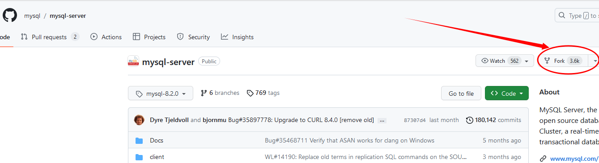

- [MySQL 源码开发环境的容器镜像的使用](#mysql-源码开发环境的容器镜像的使用)
- [制作 MySQL 源码开发环境的 docker 镜像的完整过程](#制作-mysql-源码开发环境的-docker-镜像的完整过程)
  - [1、fork 最新的 MySQL 官方源码](#1fork-最新的-mysql-官方源码)
  - [2、准备依赖库和 MySQL 源码](#2准备依赖库和-mysql-源码)
  - [3、找一台 linux 机器制作 MySQL 源码开发环境的 docker 镜像](#3找一台-linux-机器制作-mysql-源码开发环境的-docker-镜像)
  - [4、导出镜像和压缩](#4导出镜像和压缩)

# MySQL 源码开发环境的容器镜像的使用
```sh

```

# 制作 MySQL 源码开发环境的 docker 镜像的完整过程
## 1、fork 最新的 MySQL 官方源码

登录： `https://github.com/mysql/mysql-server/tree/mysql-8.2.0`

然后 fork 一份最新源码到你的个人仓库



假设 fork 后的个人仓库地址为： `https://github.com/lindeci/mysql-server-8.2.0`

## 2、准备依赖库和 MySQL 源码
```sh
# 下载 boost 库
wget https://boostorg.jfrog.io/artifactory/main/release/1.77.0/source/boost_1_77_0.tar.bz2
tar xvf boost_1_77_0.tar.bz2

# 下载 MySQL 源码
git clone https://github.com/lindeci/mysql-server-8.2.0.git --depth=1
# 对 MySQL 源码进行瘦身
vim mysql-server-8.2.0/CMakeLists.txt +2366
# 把该行注释掉
        #  ADD_SUBDIRECTORY(mysql-test)

vim mysql-server-8.2.0/CMakeLists.txt +2367
# 把该行注释掉
        #  ADD_SUBDIRECTORY(mysql-test/lib/My/SafeProcess)
rm -rf mysql-server-8.2.0/mysql-test mysql-server-8.2.0/.git

# 然后上传到远程仓库 https://github.com/lindeci/mysql-server-8.2.0-debug.git
```

## 3、找一台 linux 机器制作 MySQL 源码开发环境的 docker 镜像
Dockerfile 的内容：
```sh
# 使用本地的 ubuntu 镜像作为基础镜像
FROM ubuntu

# 更新 apt 包列表
RUN apt-get update

# 安装必要的软件包
RUN apt-get install -y apt-utils cmake git bison libssl-dev libncurses5-dev g++ pkg-config bzip2 vim openssh-server

# 添加 mysql 用户和用户组
RUN addgroup mysql
RUN adduser --disabled-password --gecos "" --ingroup mysql mysql

# 创建 SSHD 目录
RUN mkdir /var/run/sshd
# 设置 SSH
RUN echo 'root:root' | chpasswd
RUN sed -i 's/^#\?PermitRootLogin.*/PermitRootLogin yes/' /etc/ssh/sshd_config
# SSH 登陆修复
RUN sed 's@session\s*required\s*pam_loginuid.so@session optional pam_loginuid.so@g' -i /etc/pam.d/sshd
RUN echo "export VISIBLE=now" >> /etc/profile

# 创建 /data 目录并设置为工作目录
WORKDIR /data

# 将当前目录的文件复制到镜像的 /data 目录
COPY boost_1_77_0 /data
# 克隆 GitHub 仓库
RUN git clone https://github.com/lindeci/mysql-server-8.2.0-debug.git --depth 1 mysql-server-8.2.0
COPY init.sh /data

CMD ["/usr/sbin/sshd", "-D"]
```
生成镜像
```sh
docker build -t mysql-debug-docker:8.2.0 -f Dockerfile .
```


## 4、导出镜像和压缩
```sh
docker save -o mysql-debug-docker.tar mysql-debug-docker:8.2.0
# 进一步压缩
tar zcvf mysql-debug-docker.tar.gz mysql-debug-docker.tar
```

```sh
# 开始 cmkae debug 版本的 MySQL
mkdir -p /data/mysql-server-8.2.0/build
cmake --no-warn-unused-cli -DWITH_BOOST=/data/boost_1_77_0 -DWITH_DEBUG=1 -DBUILD_CONFIG=mysql_release -DWITH_RTTI=ON -DWITH_SHOW_PARSE_TREE=ON -DCMAKE_BUILD_TYPE:STRING=Debug -DCMAKE_EXPORT_COMPILE_COMMANDS:BOOL=TRUE -S/data/mysql-server-8.2.0 -B/data/mysql-server-8.2.0/build -G "Unix Makefiles"

# 开始编译 debug 版本的 MySQL
cmake --build /data/mysql-server-8.2.0/build --config Debug --target component_reference_cache -j 34
cmake --build /data/mysql-server-8.2.0/build --config Debug --target mysqld -j 34


# 这步初始化会打印账号密码，需要记录下来（比如 root@localhost: WmqEcEcpx7,t）
/data/mysql-server-8.2.0/build/runtime_output_directory/mysqld-debug --initialize --user=mysql --basedir=/data/mysql-server-8.2.0/build --datadir=/data/mysql-server-8.2.0/data

# 安装 MySQL 客户端
cmake --build /data/mysql-server-8.2.0/build --config Debug --target mysql -j 34
# 启动 MySQL
/data/mysql-server-8.2.0/build/runtime_output_directory/mysqld-debug --user=mysql --datadir=/data/mysql-server-8.2.0/data --socket=/data/mysql-server-8.2.0/data/mysql.sock.lock
```
