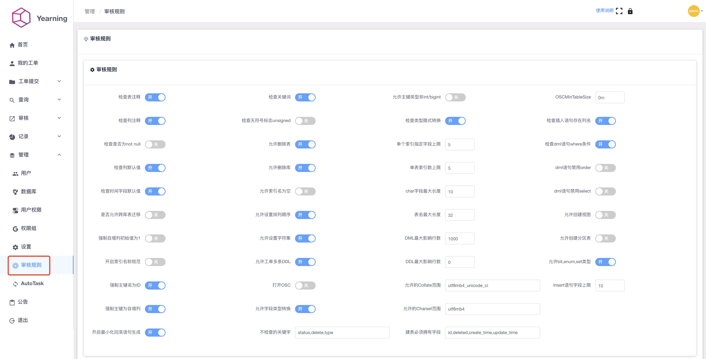
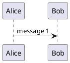

- [查看词法分析、语法分析的函数名](#查看词法分析语法分析的函数名)
- [token 分析的入口](#token-分析的入口)
  - [例子分析](#例子分析)
  - [源码解析](#源码解析)
  - [状态机注释](#状态机注释)
  - [state\_map 介绍](#state_map-介绍)
- [语法分析](#语法分析)
  - [语法解析调用堆栈](#语法解析调用堆栈)
  - [基础数据结构](#基础数据结构)
    - [语法树节点相关的声明和定义文件](#语法树节点相关的声明和定义文件)
    - [语法树根节点的基类： Parse\_tree\_root](#语法树根节点的基类-parse_tree_root)
    - [其他语法树节点](#其他语法树节点)
    - [语法树node节点的基类： Parse\_tree\_node](#语法树node节点的基类-parse_tree_node)
    - [item 类](#item-类)
    - [Item 的构建](#item-的构建)
    - [集中典型的Item 介绍](#集中典型的item-介绍)
      - [常量节点：Item\_num](#常量节点item_num)
      - [常量节点：Item\_string](#常量节点item_string)
      - [常量节点：Item\_date\_literal](#常量节点item_date_literal)
      - [Cond节点：Item\_cond\_and](#cond节点item_cond_and)
      - [字段节点：Item\_field](#字段节点item_field)
      - [聚合节点：Item\_sum](#聚合节点item_sum)
      - [子查询节点：Item\_subselect](#子查询节点item_subselect)
    - [Item表达式求值](#item表达式求值)
    - [Item与谓语下推优化](#item与谓语下推优化)
- [SELECT 语法规则](#select-语法规则)
  - [SELECT Statement](#select-statement)
  - [JOIN Clause](#join-clause)
  - [yearning 审核规则](#yearning-审核规则)
  - [SELECT 语法规则](#select-语法规则-1)
  - [CREATE TABLE Statement](#create-table-statement)
    - [FOREIGN KEY Constraints](#foreign-key-constraints)
    - [create table 语法规则](#create-table-语法规则)
- [分析 bison 构造 create table 核心过程](#分析-bison-构造-create-table-核心过程)
  - [简单分析是否是 create table …… like …… 语法](#简单分析是否是-create-table--like--语法)
- [一些重要函数](#一些重要函数)

# 查看词法分析、语法分析的函数名

在 `sql/sql_yacc.yy` 中定义

```c
%lex-param { class THD *YYTHD }
%define api.pure                                    /* We have threads */
%define api.prefix {my_sql_parser_}
```

最后一行表示 bison 生成解析器的 api 的前缀是 `my_sql_parser_`

sql/CMakeLists.txt 对 sql_yacc.yy 的编译命令是

```cmake
BISON_TARGET(mysql_parser
    ${CMAKE_CURRENT_SOURCE_DIR}/sql_yacc.yy
    ${CMAKE_CURRENT_BINARY_DIR}/sql_yacc.cc
    COMPILE_FLAGS
    "--yacc ${BISON_FLAGS_WARNINGS} ${BISON_NO_LINE_OPT}"
    DEFINES_FILE ${CMAKE_CURRENT_BINARY_DIR}/sql_yacc.h
    ) 
```

查看对应的变量

```cmake
cat cmake/bison.cmake | grep BISON_FLAGS_WARNINGS -a2
# * no-yacc: for --yacc
# * no-precedence: for useless precedence or/and associativity rules
SET(BISON_FLAGS_WARNINGS
  "--warnings=all,no-yacc,no-precedence"
  CACHE INTERNAL "BISON 3.x flags")

cat CMakeLists.txt | grep BISON_NO_LINE_OPT
  SET(BISON_NO_LINE_OPT "--no-lines")
```

转换成 bison 命令 是

```
cd sql
bison --yacc --warnings=all,no-yacc,no-precedence --no-lines -d -o sql_yacc.cc sql_yacc.yy
```

生成的代码 sql_yacc.cc 中可以看到

```c
/* Substitute the variable and function names.  */
#define yyparse         my_sql_parser_parse
#define yylex           my_sql_parser_lex
```

# token 分析的入口

```cpp
handle_connection==>do_command==>dispatch_sql_command==>mysql_parser==>>parse_sql==>THD::sql_parser==>MYSQLparse==>MYSQLlex==>lex_one_token
                                         |                                                                         进行词法分析  解析单个TOKEN
                                         |--> sql_class.cc:5069  if (!(opt_general_log_raw || thd->slave_thread)) { 写GENERAL LOG
                                         |--> sql_class.cc:5135  error = mysql_execute_command(thd, true);
                                         |--> sql_class.cc:5180  thd->lex->destroy();
                                         |--> sql_class.cc:5181  thd->end_statement();

sql_parse.cc:5031  err = parse_sql(thd, parser_state, nullptr);
sql_class.cc:2771  bool THD::sql_parser() {
sql_class.cc:2785  if (MYSQLparse(this, &root) || is_error()) {
sql_lex.cc:1290    int MYSQLlex(YYSTYPE *yacc_yylval, YYLTYPE *yylloc, THD *thd) {
sql_lex.cc:1359    static int lex_one_token(Lexer_yystype *yylval, THD *thd) {
```

状态机：

```cpp
\mysql-8.0.27\include\sql_chars.h:37    enum MY_ATTRIBUTE((__packed__)) my_lex_states {
sql_lex.cc:1374
  lip->next_state = MY_LEX_START;
  for (;;) {
    switch (state) {
      case MY_LEX_START:  // Start of token
        // Skip starting whitespace
        while (state_map[c = lip->yyPeek()] == MY_LEX_SKIP) {                //yyPeek方法获取一个字符,这个字符是否为空格，不是空格后，通过“state = state_map[c];” 返回一个状态机
          if (c == '\n') lip->yylineno++;

          lip->yySkip();
        }
```

## 例子分析

查询SQL:
`SELECT THREAD_ID,HISTORY,THREAD_OS_ID FROM THREADS where (select count(1) ctc from mysql.user where user is not null )>0 and thread_id>29 limit 20,5 \G`

```cpp
断点：
mysql-8.0.27\sql\conn_handler\connection_handler_per_thread.cc:245    static void *handle_connection(void *arg) {    //循环调用do_command
sql_parse.cc:1227    bool do_command(THD *thd) {           //读取客户端发的命令并分发
sql_parse.cc:5007    void dispatch_sql_command(THD *thd, Parser_state *parser_state) {           
sql_parse.cc:5014    lex_start(thd);
sql_parse.cc:5031    err = parse_sql(thd, parser_state, nullptr);
sql_parse.cc:6942    bool mysql_parse_status = thd->sql_parser();
sql_lex.cc:4896

parse_tree->PT_select_stmt->m_qe->PT_query_expression->m_body->PT_query_specification->opt_where_clause->next_free->next_free->next_free

->PTI_simple_ident_ident->ident->str  THREAD_OS_ID
->next_free->PTI_expr_with_alias->expr_loc  THREAD_OS_ID
->next_free->next_free->next_free->PTI_simple_ident_ident->ident->str HISTORY
->next_free->next_free->next_free->next_free->next_free->PTI_simple_ident_ident->ident->str THREAD_ID
->next_free->next_free->next_free->next_free->next_free->next_free->next_free->next_free NULL


arse_tree->PT_select_stmt->m_qe->PT_query_expression->m_limit->limit_options->limit->item-uint->item-int->value 5
arse_tree->PT_select_stmt->m_qe->PT_query_expression->m_limit->limit_options->opt_offset->item-uint->item-int->value 20

断点：
sql_parse.cc:5135   error = mysql_execute_command(thd, true);
sql_parse.cc:5180   thd->lex->destroy();
sql_parse.cc:2308   thd->update_slow_query_status();
sql_parse.cc:2347   thd->set_command(COM_SLEEP);
sql_parse.cc:2382   thd->profiling->finish_current_query();
```

## 源码解析

```cpp
static int lex_one_token(Lexer_yystype *yylval, THD *thd) {
  uchar c = 0;
  bool comment_closed;
  int tokval, result_state;
  uint length;
  enum my_lex_states state;
  Lex_input_stream *lip = &thd->m_parser_state->m_lip;   // 获取输入流信息
  const CHARSET_INFO *cs = thd->charset();    // 获取字符集
  const my_lex_states *state_map = cs->state_maps->main_map;   // 获取状态
  const uchar *ident_map = cs->ident_map;      // 字符串分割符号

  lip->yylval = yylval;  // The global state

  lip->start_token();    // 初始化token 字符串
  state = lip->next_state;    // 获得下一个状态
  lip->next_state = MY_LEX_START;   // 设置下一个状态
  for (;;) {         // 循环解析状态机
    switch (state) {
      case MY_LEX_START:  // Start of token
        // Skip starting whitespace
        while (state_map[c = lip->yyPeek()] == MY_LEX_SKIP) {  // 判断是否为空格
          if (c == '\n') lip->yylineno++;

          lip->yySkip();  // 处理空格
        }

        /* Start of real token */
        lip->restart_token();   // 设置 m_tok_start 和 m_cpp_token_start
        c = lip->yyGet();       // 获得单个字符，并且设置m_cpp_str, 并且 m_ptr 移位
        state = state_map[c];   // 如果是字符串，返回 MY_LEX_IDENT 状态
        break;
        //......
      case MY_LEX_IDENT:    // 解析字符串关键字, 比如select、 tables 等
        const char *start;
        if (use_mb(cs)) {
          result_state = IDENT_QUOTED;
          switch (my_mbcharlen(cs, lip->yyGetLast())) {
            case 1:
              break;
            case 0:
              if (my_mbmaxlenlen(cs) < 2) break;
              [[fallthrough]];
            default:
              int l =
                  my_ismbchar(cs, lip->get_ptr() - 1, lip->get_end_of_query());
              if (l == 0) {
                state = MY_LEX_CHAR;
                continue;
              }
              lip->skip_binary(l - 1);
          }
          while (ident_map[c = lip->yyGet()]) {    // 循环获取字符串
            switch (my_mbcharlen(cs, c)) {
              case 1:
                break;
              case 0:
                if (my_mbmaxlenlen(cs) < 2) break;
                [[fallthrough]];
              default:
                int l;
                if ((l = my_ismbchar(cs, lip->get_ptr() - 1,
                                     lip->get_end_of_query())) == 0)
                  break;
                lip->skip_binary(l - 1);
            }
          }
        } else {
          for (result_state = c; ident_map[c = lip->yyGet()]; result_state |= c)
            ;
          /* If there were non-ASCII characters, mark that we must convert */
          result_state = result_state & 0x80 ? IDENT_QUOTED : IDENT;
        }
        length = lip->yyLength();
        start = lip->get_ptr();
        if (lip->ignore_space) {
          /*
            If we find a space then this can't be an identifier. We notice this
            below by checking start != lex->ptr.
          */
          for (; state_map[c] == MY_LEX_SKIP; c = lip->yyGet()) {
            if (c == '\n') lip->yylineno++;
          }
        }
        if (start == lip->get_ptr() && c == '.' && ident_map[lip->yyPeek()])
          lip->next_state = MY_LEX_IDENT_SEP;
        else {  // '(' must follow directly if function
          lip->yyUnget();
          if ((tokval = find_keyword(lip, length, c == '('))) {      // 查找token
            lip->next_state = MY_LEX_START;  // Allow signed numbers
            return (tokval);                 // Was keyword    // 返回token
          }
          lip->yySkip();  // next state does a unget
        }
        yylval->lex_str = get_token(lip, 0, length);
        //......
        return (result_state);  // IDENT or IDENT_QUOTED
        //......
       case MY_LEX_EOL:     // \0 结束符
          if (lip->eof()) {
          lip->yyUnget();  // Reject the last '\0'
          lip->set_echo(false);
          lip->yySkip();
          lip->set_echo(true);
          /* Unbalanced comments with a missing '*' '/' are a syntax error */
          if (lip->in_comment != NO_COMMENT) return (ABORT_SYM);
          lip->next_state = MY_LEX_END;  // Mark for next loop  设置下一个状态机为 MY_LEX_END
          return (END_OF_INPUT);   // 返回token
        }
```

## 状态机注释

| 对应状态机                     | 备注                                                 |
| ------------------------------ | ---------------------------------------------------- |
| MY_LEX_START                   | 开始解析token                                        |
| MY_LEX_CHAR                    | 解析单个字符例如*、:、;                              |
| MY_LEX_IDENT                   | 解析字符串，匹配关键词，例如“table”、“select” 等 |
| MY_LEX_IDENT_SEP               | 找到字符’.’                                        |
| MY_LEX_IDENT_START             | 从’.'开始解析token                                  |
| MY_LEX_REAL                    | 不完全实数                                           |
| MY_LEX_HEX_NUMBER              | hex字符串                                            |
| MY_LEX_BIN_NUMBER              | bin字符串                                            |
| MY_LEX_CMP_OP                  | 不完全比较运算符                                     |
| MY_LEX_LONG_CMP_OP             | 不完全比较运算符                                     |
| MY_LEX_STRING                  | 字符串                                               |
| MY_LEX_COMMENT                 | 注释                                                 |
| MY_LEX_END                     | 结束                                                 |
| MY_LEX_NUMBER_IDENT            | 数字                                                 |
| MY_LEX_INT_OR_REAL             | 完全整数或不完全实数                                 |
| MY_LEX_REAL_OR_POINT           | 解析.返回不完全实数，或者字符’.’                   |
| MY_LEX_BOOL                    | 布尔                                                 |
| MY_LEX_EOL                     | 如果是eof，则设置状态end结束                         |
| MY_LEX_LONG_COMMENT            | 长注释                                               |
| MY_LEX_END_LONG_COMMENT        | 注释结束                                             |
| MY_LEX_SEMICOLON               | 分隔符;                                              |
| MY_LEX_SET_VAR                 | 检查:=                                               |
| MY_LEX_USER_END                | 结束’@’                                            |
| MY_LEX_HOSTNAME                | 解析hostname                                         |
| MY_LEX_SKIP                    | 空格                                                 |
| MY_LEX_USER_VARIABLE_DELIMITER | 引号字符                                             |
| MY_LEX_SYSTEM_VAR              | 例如解析user@hostname，解析到@                       |
| MY_LEX_IDENT_OR_KEYWORD        | 判断返回字符串状态或者键盘键值                       |
| MY_LEX_IDENT_OR_HEX            | hex-数字                                             |
| MY_LEX_IDENT_OR_BIN            | bin-数字                                             |
| MY_LEX_IDENT_OR_NCHAR          | 判断返回字符状态，或字符串状态                       |
| MY_LEX_STRING_OR_DELIMITER     | 判断返回字符串状态或者空格字符状态                   |

## state_map 介绍

state_map是验证状态机的关键步骤，初始化该过程主要在/mysql-8.0.20/mysys/sql_chars.cc文件的init_state_maps方法中，方法实现如下：
```cpp
bool init_state_maps(CHARSET_INFO *cs) {
  uint i;
  uchar *ident_map;
  enum my_lex_states *state_map = nullptr;

  lex_state_maps_st *lex_state_maps = (lex_state_maps_st *)my_once_alloc(
      sizeof(lex_state_maps_st), MYF(MY_WME));

  if (lex_state_maps == nullptr) return true;  // 空指针 OOM

  cs->state_maps = lex_state_maps;
  state_map = lex_state_maps->main_map;

  if (!(cs->ident_map = ident_map = (uchar *)my_once_alloc(256, MYF(MY_WME))))
    return true;  // OOM

  hint_lex_init_maps(cs, lex_state_maps->hint_map);

  /* 填充状态以获得更快的解析器 */
  for (i = 0; i < 256; i++) {
    if (my_isalpha(cs, i))
      state_map[i] = MY_LEX_IDENT;      // 字符串状态机
    else if (my_isdigit(cs, i))
      state_map[i] = MY_LEX_NUMBER_IDENT;
    else if (my_ismb1st(cs, i))
      /* To get whether it's a possible leading byte for a charset. */
      state_map[i] = MY_LEX_IDENT;
    else if (my_isspace(cs, i))
      state_map[i] = MY_LEX_SKIP;      // 空格状态机
    else
      state_map[i] = MY_LEX_CHAR;     // 字符状态机
  }
  state_map[(uchar)'_'] = state_map[(uchar)'$'] = MY_LEX_IDENT;
  state_map[(uchar)'\''] = MY_LEX_STRING;
  state_map[(uchar)'.'] = MY_LEX_REAL_OR_POINT;
  state_map[(uchar)'>'] = state_map[(uchar)'='] = state_map[(uchar)'!'] =
      MY_LEX_CMP_OP;         // 操作符匹配状态机
  state_map[(uchar)'<'] = MY_LEX_LONG_CMP_OP;
  state_map[(uchar)'&'] = state_map[(uchar)'|'] = MY_LEX_BOOL;
  state_map[(uchar)'#'] = MY_LEX_COMMENT;
  state_map[(uchar)';'] = MY_LEX_SEMICOLON;
  state_map[(uchar)':'] = MY_LEX_SET_VAR;
  state_map[0] = MY_LEX_EOL;       // 结束标志状态机
  state_map[(uchar)'/'] = MY_LEX_LONG_COMMENT;
  state_map[(uchar)'*'] = MY_LEX_END_LONG_COMMENT;   // *字符匹配状态机
  state_map[(uchar)'@'] = MY_LEX_USER_END;   // @字符匹配状态机
  state_map[(uchar)'`'] = MY_LEX_USER_VARIABLE_DELIMITER;
  state_map[(uchar)'"'] = MY_LEX_STRING_OR_DELIMITER;

  /*
    创建第二个映射以加快查找标识符的速度
  */
  for (i = 0; i < 256; i++) {
    ident_map[i] = (uchar)(state_map[i] == MY_LEX_IDENT ||
                           state_map[i] == MY_LEX_NUMBER_IDENT);
  }

  /* Special handling of hex and binary strings */
  state_map[(uchar)'x'] = state_map[(uchar)'X'] = MY_LEX_IDENT_OR_HEX;
  state_map[(uchar)'b'] = state_map[(uchar)'B'] = MY_LEX_IDENT_OR_BIN;
  state_map[(uchar)'n'] = state_map[(uchar)'N'] = MY_LEX_IDENT_OR_NCHAR;

  return false;
}
```
先来看这个for循环，256应该是256个字符了，每个字符的处理应该如下规则：如果是字母，则state = MY_LEX_IDENT；如果是数字，则state = MY_LEX_NUMBER_IDENT，如果是空格，则state = MY_LEX_SKIP，剩下的全为MY_LEX_CHAR。　
for循环之后，又对一些特殊字符进行了处理，由于我们的语句“select @@version_comment limit 1”中有个特殊字符@，这个字符的state进行了特殊处理，为MY_LEX_USER_END。

代码中能快速匹配状态机，就是因为初始化好了一堆的状态机map，根据字符可以匹配不同的状态机。状态机的宏在mysql-8.0.20/include/sql_chars.h文件中。
```cpp
enum MY_ATTRIBUTE((__packed__)) my_lex_states {
  MY_LEX_START,
  MY_LEX_CHAR,
  MY_LEX_IDENT,
  MY_LEX_IDENT_SEP,
  MY_LEX_IDENT_START,
  MY_LEX_REAL,
  MY_LEX_HEX_NUMBER,
  MY_LEX_BIN_NUMBER,
  MY_LEX_CMP_OP,
  MY_LEX_LONG_CMP_OP,
  MY_LEX_STRING,
  MY_LEX_COMMENT,
  MY_LEX_END,
  MY_LEX_NUMBER_IDENT,
  MY_LEX_INT_OR_REAL,
  MY_LEX_REAL_OR_POINT,
  MY_LEX_BOOL,
  MY_LEX_EOL,
  MY_LEX_LONG_COMMENT,
  MY_LEX_END_LONG_COMMENT,
  MY_LEX_SEMICOLON,
  MY_LEX_SET_VAR,
  MY_LEX_USER_END,
  MY_LEX_HOSTNAME,
  MY_LEX_SKIP,
  MY_LEX_USER_VARIABLE_DELIMITER,
  MY_LEX_SYSTEM_VAR,
  MY_LEX_IDENT_OR_KEYWORD,
  MY_LEX_IDENT_OR_HEX,
  MY_LEX_IDENT_OR_BIN,
  MY_LEX_IDENT_OR_NCHAR,
  MY_LEX_STRING_OR_DELIMITER
};
```

# 语法分析
## 语法解析调用堆栈
```cpp
LEX::make_sql_cmd(LEX * const this, Parse_tree_root * parse_tree) (\data\mysql-server\sql\sql_lex.cc:5032)
THD::sql_parser(THD * const this) (\data\mysql-server\sql\sql_class.cc:3082)
parse_sql(THD * thd, Parser_state * parser_state, Object_creation_ctx * creation_ctx) (\data\mysql-server\sql\sql_parse.cc:7213)
dispatch_sql_command(THD * thd, Parser_state * parser_state) (\data\mysql-server\sql\sql_parse.cc:5344)
dispatch_command(THD * thd, const COM_DATA * com_data, enum_server_command command) (\data\mysql-server\sql\sql_parse.cc:2112)
do_command(THD * thd) (\data\mysql-server\sql\sql_parse.cc:1459)
handle_connection(void * arg) (\data\mysql-server\sql\conn_handler\connection_handler_per_thread.cc:303)
pfs_spawn_thread(void * arg) (\data\mysql-server\storage\perfschema\pfs.cc:3043)
libpthread.so.0!start_thread (Unknown Source:0)
libc.so.6!clone (Unknown Source:0)
```
## 基础数据结构
Bison在做语法解析后，会将解析结果（解析树/AST）存储在THD::LEX中，通过存储WHERE的数据结构来查看语法解析的结果。

### 语法树节点相关的声明和定义文件
`ll parse* -h`
```sh
parse_file.cc
parse_file.h
parse_location.h
parser_service.cc
parser_yystype.h
parse_tree_column_attrs.h
parse_tree_handler.cc
parse_tree_handler.h
parse_tree_helpers.cc
parse_tree_helpers.h
parse_tree_hints.cc
parse_tree_hints.h
parse_tree_items.cc
parse_tree_items.h
parse_tree_node_base.cc
parse_tree_node_base.h
parse_tree_nodes.cc
parse_tree_nodes.h
parse_tree_partitions.cc
parse_tree_partitions.h
parse_tree_window.cc
parse_tree_window.h
```
###  语法树根节点的基类： Parse_tree_root
```cpp
class Parse_tree_root {
  Parse_tree_root(const Parse_tree_root &) = delete;   // = delete;：这表示该函数被删除，也就是说你不能使用它
  void operator=(const Parse_tree_root &) = delete;

 protected:
  Parse_tree_root() = default;   // = default;：这表示使用编译器自动生成的默认实现。
  explicit Parse_tree_root(const POS &pos) : m_pos(pos) {}   // explicit关键字用于防止不应该发生的隐式类型转换,不希望使用POS值创建Parse_tree_root对象
  virtual ~Parse_tree_root() = default;

 public:
  /// Textual location of a token just parsed.
  POS m_pos;

  virtual Sql_cmd *make_cmd(THD *thd) = 0;

  // Return Json parse tree generated by SHOW PARSE_TREE.
  virtual std::string get_printable_parse_tree(THD *thd [[maybe_unused]]) {
    my_error(ER_NOT_SUPPORTED_YET, MYF(0),
             "Parse tree display of this statement");
    return "";
  }
};
```
### 其他语法树节点
其他语法树节点例如 PT_select_stmt   PT_insert  PT_delete 均继承 Parse_tree_root 类，Parse_tree_root的子类都代表一类 sql，换句话说，所有Parse_tree_root的子类只能作为树的根节点。下边我们以 PT_select_stmt 为例：
```cpp
class PT_select_stmt : public Parse_tree_root {
  typedef Parse_tree_root super;

 public:
  /**
    @param pos Position of this clause in the SQL statement.
    @param qe The query expression.  // 参数qe, 查询表达式
    @param sql_command The type of SQL command.   // 参数sql_command  SQL命令的类型
  */
  PT_select_stmt(const POS &pos, enum_sql_command sql_command,
                 PT_query_expression_body *qe)
      : super(pos),
        m_sql_command(sql_command),
        m_qe(qe),
        m_into(nullptr),
        m_has_trailing_locking_clauses{false} {}

  /**
    Creates a SELECT command. Only SELECT commands can have into.    // 创建一个查询命令，只有查询可以存在 into ，即 select ... into

    @param pos                          Position of this clause in the SQL
                                        statement.
    @param qe                           The query expression.        // 查询表达式
    @param into                         The own INTO destination.    // into 的目的表 (SELECT * INTO Persons_backup FROM Persons)
    @param has_trailing_locking_clauses True if there are locking clauses (like
                                        `FOR UPDATE`) at the end of the
                                        statement.   // 如果语句末尾有锁定子句（如“FOR UPDATE”），则为True
  */
  explicit PT_select_stmt(const POS &pos, PT_query_expression_body *qe,
                          PT_into_destination *into = nullptr,
                          bool has_trailing_locking_clauses = false)
      : super(pos),
        m_sql_command{SQLCOM_SELECT},
        m_qe{qe},
        m_into{into},
        m_has_trailing_locking_clauses{has_trailing_locking_clauses} {}

  Sql_cmd *make_cmd(THD *thd) override;
  std::string get_printable_parse_tree(THD *thd) override;

 private:
  enum_sql_command m_sql_command;
  PT_query_expression_body *m_qe;
  PT_into_destination *m_into;
  const bool m_has_trailing_locking_clauses;
};
```

### 语法树node节点的基类： Parse_tree_node
Parse tree上所有的node都定义为Parse_tree_node的子类。Parse_tree_node是一个类模板结构体，定义如下：
```cpp
/**
  Base class for parse tree nodes (excluding the Parse_tree_root hierarchy)  // 解析树节点的基类（不包括Parse_tree_root层次结构）
*/
template <typename Context>
class Parse_tree_node_tmpl {
  friend class Item;  // for direct access to the "contextualized" field  // 用于直接访问"contextualized"字段

  Parse_tree_node_tmpl(const Parse_tree_node_tmpl &);  // undefined
  void operator=(const Parse_tree_node_tmpl &);        // undefined

#ifndef NDEBUG
 private:
  bool contextualized = false;  // true if the node object is contextualized  // 如果节点对象已上下文化，则为true
#endif                          // NDEBUG

 public:
  typedef Context context_t;
  POS m_pos;  // Grammar position. is_empty() if node not created in parser.  // 语法位置。如果节点未在解析器中创建，则为空。

  static void *operator new(size_t size, MEM_ROOT *mem_root,
                            const std::nothrow_t &arg
                            [[maybe_unused]] = std::nothrow) noexcept {
    return mem_root->Alloc(size);
  }
  static void operator delete(void *ptr [[maybe_unused]],
                              size_t size [[maybe_unused]]) {
    TRASH(ptr, size);
  }
  static void operator delete(void *, MEM_ROOT *,
                              const std::nothrow_t &) noexcept {}

 protected:
  Parse_tree_node_tmpl() = delete;

  explicit Parse_tree_node_tmpl(const POS &pos) : m_pos(pos) {}

  explicit Parse_tree_node_tmpl(const POS &start_pos, const POS &end_pos) { // 该项目列表的范围应从start_pos的第一个字符位置到end_pos的最后一个字符位置。
    // Range of this item list should be from first character position of
    // start_pos to the last character position of end_pos.
    m_pos.cpp.start = start_pos.cpp.start;
    m_pos.cpp.end = end_pos.cpp.end;
    m_pos.raw.start = start_pos.raw.start;
    m_pos.raw.end = end_pos.raw.end;
  }

  bool begin_parse_tree(Show_parse_tree *tree);
  bool end_parse_tree(Show_parse_tree *tree);

  /**
    Do all context-sensitive things and mark the node as contextualized

    @param      pc      current parse context

    @retval     false   success
    @retval     true    syntax/OOM/etc error
  */
  /**
    执行所有上下文相关的操作，并将节点标记为上下文化

    @param      pc      当前解析上下文

    @retval     false   成功
    @retval     true    语法/OOM等错误
  */
  virtual bool do_contextualize(Context *pc) {
    uchar dummy;
    if (check_stack_overrun(pc->thd, STACK_MIN_SIZE, &dummy)) return true;

#ifndef NDEBUG
    assert(!contextualized);
    contextualized = true;
#endif  // NDEBUG

    return false;
  }

  /**
    Add all the node-specific json fields. Any class that needs to add such
    info should override this function rather than doing it in
    do_contextualize(). E.g. the parse tree node for AVG() may have "distinct"
    field to indicate if AVG(DISTINCT ...) is used or not.

    @param      json_obj      Json object for this parse tree node.
  */
  /**
    添加所有特定于节点的json字段。任何需要添加此类信息的类都应该重写此函数，而不是在do_contextualize()中执行。例如，AVG()的解析树节点可能有一个"distinct"字段，用于指示是否使用了AVG(DISTINCT ...)。

    @param      json_obj      用于此解析树节点的Json对象。
  */
  virtual void add_json_info(Json_object *json_obj [[maybe_unused]]) {}

 public:
  virtual ~Parse_tree_node_tmpl() = default;

#ifndef NDEBUG
  bool is_contextualized() const { return contextualized; }
#endif  // NDEBUG

  // Derived classes should not override this. If needed, they should override
  // do_contextualize().
  // Visual Studio with MSVC_CPPCHECK=ON gives warning C26435:
  // Function <fun> should specify exactly one of
  //    'virtual', 'override', or 'final'
  // 派生类不应重写此方法。如有需要，它们应该重写do_contextualize()。
  // 使用MSVC_CPPCHECK=ON的Visual Studio会给出警告C26435：
  // 函数<fun>应该精确指定一个
  // 'virtual'、'override'或'final'
  MY_COMPILER_DIAGNOSTIC_PUSH()
  MY_COMPILER_MSVC_DIAGNOSTIC_IGNORE(26435)
  virtual bool contextualize(Context *pc) final {
    // For condition#2 below ... If position is empty, this item was not
    // created in the parser; so don't show it in the parse tree.
    // 对于下面的条件#2...如果位置为空，表示此项目未在解析器中创建；因此不要在解析树中显示它。
    if (pc->m_show_parse_tree == nullptr || this->m_pos.is_empty())
      return do_contextualize(pc);

    Show_parse_tree *tree = pc->m_show_parse_tree.get();

    if (begin_parse_tree(tree)) return true;

    if (do_contextualize(pc)) return true;

    if (end_parse_tree(tree)) return true;

    return false;
  }
  MY_COMPILER_DIAGNOSTIC_POP()

  /**
    syntax_error() function replacement for deferred reporting of syntax
    errors

    @param      pc      Current parse context.
    @param      pos     Location of the error in lexical scanner buffers.
  */
  /**
    用于延迟报告语法错误的syntax_error()函数替代品

    @param      pc      当前解析上下文。
    @param      pos     词法扫描器缓冲区中错误的位置。
  */
  void error(Context *pc, const POS &pos) const {
    pc->thd->syntax_error_at(pos);
  }

  /**
    syntax_error() function replacement for deferred reporting of syntax
    errors

    @param      pc      Current parse context.
    @param      pos     Location of the error in lexical scanner buffers.
    @param      msg     Error message.
  */
  /**
    用于延迟报告语法错误的syntax_error()函数替代品

    @param      pc      当前解析上下文。
    @param      pos     词法扫描器缓冲区中错误的位置。
    @param      msg     错误消息。
  */
  void error(Context *pc, const POS &pos, const char *msg) const {
    pc->thd->syntax_error_at(pos, "%s", msg);
  }

  /**
    syntax_error() function replacement for deferred reporting of syntax
    errors

    @param      pc      Current parse context.
    @param      pos     Location of the error in lexical scanner buffers.
    @param      format  Error message format string with optional argument list.
  */
  /**
    用于延迟报告语法错误的syntax_error()函数替代品

    @param      pc      当前解析上下文。
    @param      pos     词法扫描器缓冲区中错误的位置。
    @param      format  带有可选参数列表的错误消息格式字符串。
  */
  void errorf(Context *pc, const POS &pos, const char *format, ...) const
      MY_ATTRIBUTE((format(printf, 4, 5)));
};
```
### item 类
Item是一个类，每一个Item实例都代表一个SQL语句里的对象,它有取值和数据类型指针。下面列出的的SQL相关的对象都是一个Item对象，或者继承至Item：

1. 一段字符  
2. 数据表的某列
3. 一个局部或全局变量
4. 一个存储过程的变量
5. 一个用户参数
6. 一个函数/存储过程(这包括运算符+、||、=、like等)

例如下面的SQL语句：

SELECT UPPER(column1) FROM t WHERE column2 = @x;

MySQL需要一系列的Item来描述上面的SQL：一个描述column1对象，描述UPPER函数的对象，还有描述WHERE语句的几个相关的Item对象。Item对象可以理解为一个特殊的数据对象。

item相关的声明和定义文件  
`ll item*`
```
item_buff.cc
item.cc
item_cmpfunc.cc
item_cmpfunc.h
item_create.cc
item_create.h
item_func.cc
item_func.h
item_geofunc_buffer.cc
item_geofunc.cc
item_geofunc.h
item_geofunc_internal.cc
item_geofunc_internal.h
item_geofunc_relchecks.cc
item_gtid_func.cc
item_gtid_func.h
item.h
item_inetfunc.cc
item_inetfunc.h
item_json_func.cc
item_json_func.h
item_pfs_func.cc
item_pfs_func.h
item_regexp_func.cc
item_regexp_func.h
item_row.cc
item_row.h
item_strfunc.cc
item_strfunc.h
item_subselect.cc
item_subselect.h
item_sum.cc
item_sum.h
item_timefunc.cc
item_timefunc.h
item_xmlfunc.cc
item_xmlfunc.h
```
Item（继承自Parse_tree_node）使得对象和词法语法解析关联起来。用于表示条件表达式查询的结点（包括sub select），Item组织关系逻辑上也是棵树。

一般条件表达式结点的分类是：

1. 常量节点/值节点（对应Item_base_constant）：存储常量值
2. 字段节点/列节点(对应Item_field)：存储列字段的相关元信息
3. 函数计算节点（对应Item_func）：分为系统函数和UDF。系统函数指 +-*/ =><等系统提供的基本函数型操作，也包含一些常用的函数，比如一些数学函数、加密函数等。有的其他AP引擎实现会将大部分的System func基于UDF实现。
4. 逻辑计算节点(对应Item_cond)：主要是and、or、not等。这类函数可以看作是输入值为1个(not)或2个bool参数，返回值为bool的特殊函数。因此实现时也会基于函数计算节点去实现，但在表达式优化和计算时会另外看待。MySQL not实现在Item_func_not中。
5. 聚合函数计算(对应Item_sum)：分为系统聚合函数和UDF(有的也叫UDAF)。系统聚合函数包括sum、count、avg、max、min等。

与大部分表达式节点树不同的是，Item对象除了节点表示之外还承载了计算的功能。以下为Item的主要作用：

表达式节点表示。
- Item_base_constant
- Item_field
- Item_func
6. 计算。每个Item对象都有val_xxx方法，尤其是val_int和val_str这两个方法MySQL内置Item类型都支持调用。以val_int举例，调用其可以得到以该Item为根节点的子树的求值。
7. 遍历（调用入口为walk方法）。Item里定义了很多只属于其子类的Item_processor方法，具体的walk实现也是在相应子类中，除了Item_subselect，其他的walk实现都差不多。
8. Transform&Compile（对应transform和compile方法）：Transform表示对Item tree的转换，可能会添加0或多个新的Item节点；Compile则是会在当前节点transform之前做一次该节点子树的analyze，。
### Item 的构建
MySQL会通过yacc解析将条件表达式解析成一颗Item树（暂称为解析树）。解析树里会有一部分是PTI_开头的Item，PTI_Item都是继承自Parse_tree_item（也是Item的子类），是一种解析过程中过渡的Item（注释里认为这是一种placeholder）。在contextualize阶段时，会对这些PTI_item进行itemize，将它们从解析树节点转化成真正意义的表达式树节点。

需注意：

1. 部分非PTI_Item (比如非date的常量类的等比较简单的节点)会在yacc解析时直接构造。PTI_Item可以认为是一种过渡，只是因为实现方式问题而存在，并非是HighLevel意义上一定要存在的概念。
2. 此时解析出来的表达式树未必是最终的完整版，后面经过transform/compile等操作有可能会改变树的结构。
3. 不同的Item的构造时机不一样，需case by case看，有的是在yacc解析时直接构造，有的是在itemize的时候构造。

常量节点
- 非时间类型的常量，会在yacc解析时直接构造相应的Item
- 时间类型的常量会先解析成PTI_temporal_literal，PTI_temporal_literal::itemize中会调用create_temporal_literal来转换成对应的时间类型的Item。

TODO: 字段节点
- Select 函数内的field，i.e. SELECT sum(l_extendedprice)
- Where 的field, i.e.WHERE l_returnflag='A'
- Where 函数内的field, i.e. WHERE abs(l_extendedprice) > 2

### 集中典型的Item 介绍
#### 常量节点：Item_num
Item_num是表示数值型的常量，类里存储的就是对应数值常量值value，int/bigint统一存成longlong，float/double统一存成double，decimal类型自己有一个Item_decimal实现。

数值型的实现简单可表示成如下：
<details>
<summary>源码</summary>

```cpp

class Item_int : public Item_num {
  typedef Item_num super;

 public:
  longlong value;
  Item_int(int32 i, uint length = MY_INT32_NUM_DECIMAL_DIGITS)
      : value((longlong)i) {
    set_data_type(MYSQL_TYPE_LONGLONG);
    set_max_size(length);
    fixed = true;
  }
  Item_int(const POS &pos, int32 i, uint length = MY_INT32_NUM_DECIMAL_DIGITS)
      : super(pos), value((longlong)i) {
    set_data_type(MYSQL_TYPE_LONGLONG);
    set_max_size(length);
    fixed = true;
  }
  Item_int(longlong i, uint length = MY_INT64_NUM_DECIMAL_DIGITS) : value(i) {
    set_data_type(MYSQL_TYPE_LONGLONG);
    set_max_size(length);
    fixed = true;
  }
  Item_int(ulonglong i, uint length = MY_INT64_NUM_DECIMAL_DIGITS)
      : value((longlong)i) {
    set_data_type(MYSQL_TYPE_LONGLONG);
    unsigned_flag = true;
    set_max_size(length);
    fixed = true;
  }
  Item_int(const Item_int *item_arg) {
    set_data_type(item_arg->data_type());
    value = item_arg->value;
    item_name = item_arg->item_name;
    max_length = item_arg->max_length;
    fixed = true;
  }
  Item_int(const Name_string &name_arg, longlong i, uint length) : value(i) {
    set_data_type(MYSQL_TYPE_LONGLONG);
    set_max_size(length);
    item_name = name_arg;
    fixed = true;
  }
  Item_int(const POS &pos, const Name_string &name_arg, longlong i, uint length)
      : super(pos), value(i) {
    set_data_type(MYSQL_TYPE_LONGLONG);
    set_max_size(length);
    item_name = name_arg;
    fixed = true;
  }
  Item_int(const char *str_arg, uint length) {
    set_data_type(MYSQL_TYPE_LONGLONG);
    init(str_arg, length);
  }
  Item_int(const POS &pos, const char *str_arg, uint length) : super(pos) {
    set_data_type(MYSQL_TYPE_LONGLONG);
    init(str_arg, length);
  }

  Item_int(const POS &pos, const LEX_STRING &num, int dummy_error = 0)
      : Item_int(pos, num, my_strtoll10(num.str, nullptr, &dummy_error),
                 static_cast<uint>(num.length)) {}

 private:
  void init(const char *str_arg, uint length);
  void set_max_size(uint length) {
    max_length = length;
    if (!unsigned_flag && value >= 0) max_length++;
  }

 protected:
  type_conversion_status save_in_field_inner(Field *field,
                                             bool no_conversions) override;

 public:
  enum Type type() const override { return INT_ITEM; }
  Item_result result_type() const override { return INT_RESULT; }
  longlong val_int() override {
    assert(fixed);
    return value;
  }
  double val_real() override {
    assert(fixed);
    return static_cast<double>(value);
  }
  my_decimal *val_decimal(my_decimal *) override;
  String *val_str(String *) override;
  bool get_date(MYSQL_TIME *ltime, my_time_flags_t fuzzydate) override {
    return get_date_from_int(ltime, fuzzydate);
  }
  bool get_time(MYSQL_TIME *ltime) override { return get_time_from_int(ltime); }
  Item *clone_item() const override { return new Item_int(this); }
  void print(const THD *thd, String *str,
             enum_query_type query_type) const override;
  Item_num *neg() override {
    value = -value;
    return this;
  }
  uint decimal_precision() const override {
    return static_cast<uint>(max_length - 1);
  }
  bool eq(const Item *, bool) const override;
  bool check_partition_func_processor(uchar *) override { return false; }
  bool check_function_as_value_generator(uchar *) override { return false; }
};
```
</details>

#### 常量节点：Item_string
存储字符串常量值，类型默认为VARCHAR。varchar变量关注str_value、collation、max_length。

- str_value存储字符串值
- collation存储字符集编码
- max_length存储的是根据编码实际encode后的字符串最大长度 (VARCHAR是变长的)

其中val_int的实现是my_strtoll10，可以理解为是一个string到longlong的hash实现。

<details>
<summary>源码</summary>

```cpp
class Item_string : public Item_basic_constant {
  typedef Item_basic_constant super;

 protected:
  explicit Item_string(const POS &pos) : super(pos), m_cs_specified(false) {// 构造函数，用于初始化字符串常量项目
    set_data_type(MYSQL_TYPE_VARCHAR);
  }

  void init(const char *str, size_t length, const CHARSET_INFO *cs,// 初始化字符串常量项目
            Derivation dv, uint repertoire) {
    set_data_type(MYSQL_TYPE_VARCHAR);
    str_value.set_or_copy_aligned(str, length, cs);
    collation.set(cs, dv, repertoire);
    /*
      We have to have a different max_length than 'length' here to
      ensure that we get the right length if we do use the item
      to create a new table. In this case max_length must be the maximum
      number of chars for a string of this type because we in Create_field::
      divide the max_length with mbmaxlen).
    */
    // 为确保在创建新表时获得正确的长度，必须设置max_length不同于'length'
    max_length = static_cast<uint32>(str_value.numchars() * cs->mbmaxlen);
    item_name.copy(str, length, cs);
    decimals = DECIMAL_NOT_SPECIFIED;
    // it is constant => can be used without fix_fields (and frequently used)
    // 该项目是常量，无需进行fix_fields（经常使用）
    fixed = true;
    /*
      Check if the string has any character that can't be
      interpreted using the relevant charset.
    */
    // 检查字符串中是否存在无法使用相关字符集解释的字符
    check_well_formed_result(&str_value, false, false);
  }
  type_conversion_status save_in_field_inner(Field *field,// 保存字符串常量项目的内部实现
                                             bool no_conversions) override;

 public:
  /* Create from a string, set name from the string itself. */
  /* 从字符串创建，从字符串本身设置名称。 */
  Item_string(const char *str, size_t length, const CHARSET_INFO *cs,
              Derivation dv = DERIVATION_COERCIBLE,
              uint repertoire = MY_REPERTOIRE_UNICODE30)
      : m_cs_specified(false) {
    init(str, length, cs, dv, repertoire);
  }
  Item_string(const POS &pos, const char *str, size_t length,// 带位置信息的构造函数，从字符串创建
              const CHARSET_INFO *cs, Derivation dv = DERIVATION_COERCIBLE,
              uint repertoire = MY_REPERTOIRE_UNICODE30)
      : super(pos), m_cs_specified(false) {
    init(str, length, cs, dv, repertoire);
  }

  /* Just create an item and do not fill string representation */
  Item_string(const CHARSET_INFO *cs, Derivation dv = DERIVATION_COERCIBLE)// 创建一个项目，不填充字符串表示
      : m_cs_specified(false) {
    collation.set(cs, dv);
    set_data_type(MYSQL_TYPE_VARCHAR);
    max_length = 0;
    decimals = DECIMAL_NOT_SPECIFIED;
    fixed = true;
  }

  /* Create from the given name and string. */
  Item_string(const Name_string name_par, const char *str, size_t length,// 从给定的名称和字符串创建
              const CHARSET_INFO *cs, Derivation dv = DERIVATION_COERCIBLE,
              uint repertoire = MY_REPERTOIRE_UNICODE30)
      : m_cs_specified(false) {
    str_value.set_or_copy_aligned(str, length, cs);
    collation.set(cs, dv, repertoire);
    set_data_type(MYSQL_TYPE_VARCHAR);
    max_length = static_cast<uint32>(str_value.numchars() * cs->mbmaxlen);
    item_name = name_par;
    decimals = DECIMAL_NOT_SPECIFIED;
    // it is constant => can be used without fix_fields (and frequently used)
    fixed = true;
  }
  Item_string(const POS &pos, const Name_string name_par, const char *str,// 带位置信息的构造函数，从给定的名称和字符串创建
              size_t length, const CHARSET_INFO *cs,
              Derivation dv = DERIVATION_COERCIBLE,
              uint repertoire = MY_REPERTOIRE_UNICODE30)
      : super(pos), m_cs_specified(false) {
    str_value.set_or_copy_aligned(str, length, cs);
    collation.set(cs, dv, repertoire);
    set_data_type(MYSQL_TYPE_VARCHAR);
    max_length = static_cast<uint32>(str_value.numchars() * cs->mbmaxlen);
    item_name = name_par;
    decimals = DECIMAL_NOT_SPECIFIED;
    // it is constant => can be used without fix_fields (and frequently used)
    fixed = true;
  }

  /* Create from the given name and string. */
  Item_string(const POS &pos, const Name_string name_par,// 从给定的名称和字符串创建
              const LEX_CSTRING &literal, const CHARSET_INFO *cs,
              Derivation dv = DERIVATION_COERCIBLE,
              uint repertoire = MY_REPERTOIRE_UNICODE30)
      : super(pos), m_cs_specified(false) {
    str_value.set_or_copy_aligned(literal.str ? literal.str : "",
                                  literal.str ? literal.length : 0, cs);
    collation.set(cs, dv, repertoire);
    set_data_type(MYSQL_TYPE_VARCHAR);
    max_length = static_cast<uint32>(str_value.numchars() * cs->mbmaxlen);
    item_name = name_par;
    decimals = DECIMAL_NOT_SPECIFIED;
    // it is constant => can be used without fix_fields (and frequently used)
    fixed = true;
  }

  /*
    This is used in stored procedures to avoid memory leaks and
    does a deep copy of its argument.
  */
  void set_str_with_copy(const char *str_arg, uint length_arg) {// 用于避免内存泄漏的深度复制
    str_value.copy(str_arg, length_arg, collation.collation);
    max_length = static_cast<uint32>(str_value.numchars() *
                                     collation.collation->mbmaxlen);
  }
  bool set_str_with_copy(const char *str_arg, uint length_arg,// 通过指定的字符集信息设置字符串副本
                         const CHARSET_INFO *from_cs);
  void set_repertoire_from_value() {// 从值中设置repertoire属性
    collation.repertoire = my_string_repertoire(
        str_value.charset(), str_value.ptr(), str_value.length());
  }
  enum Type type() const override { return STRING_ITEM; }// 返回项目类型
  double val_real() override;// 获取实数值
  longlong val_int() override;// 获取整数值
  String *val_str(String *) override {// 获取字符串值
    assert(fixed == 1);
    return &str_value;
  }
  my_decimal *val_decimal(my_decimal *) override;// 获取十进制数值
  bool get_date(MYSQL_TIME *ltime, my_time_flags_t fuzzydate) override {// 获取日期时间值
    return get_date_from_string(ltime, fuzzydate);
  }
  bool get_time(MYSQL_TIME *ltime) override {// 获取时间值
    return get_time_from_string(ltime);
  }
  Item_result result_type() const override { return STRING_RESULT; }// 获取项目结果类型
  bool eq(const Item *item, bool binary_cmp) const override;
  Item *clone_item() const override {// 克隆项目
    return new Item_string(static_cast<Name_string>(item_name), str_value.ptr(),
                           str_value.length(), collation.collation);
  }
  Item *safe_charset_converter(THD *thd, const CHARSET_INFO *tocs) override;// 字符集转换
  Item *charset_converter(THD *thd, const CHARSET_INFO *tocs, bool lossless);// 字符集转换
  inline void append(char *str, size_t length) {// 追加字符串
    str_value.append(str, length);
    max_length = static_cast<uint32>(str_value.numchars() *
                                     collation.collation->mbmaxlen);
  }
  void print(const THD *thd, String *str,// 打印项目
             enum_query_type query_type) const override;
  bool check_partition_func_processor(uchar *) override { return false; }// 检查分区函数处理器

  /**
    Return true if character-set-introducer was explicitly specified in the
    original query for this item (text literal).

    This operation is to be called from Item_string::print(). The idea is
    that when a query is generated (re-constructed) from the Item-tree,
    character-set-introducers should appear only for those literals, where
    they were explicitly specified by the user. Otherwise, that may lead to
    loss collation information (character set introducers implies default
    collation for the literal).

    Basically, that makes sense only for views and hopefully will be gone
    one day when we start using original query as a view definition.

    @return This operation returns the value of m_cs_specified attribute.
      @retval true if character set introducer was explicitly specified in
      the original query.
      @retval false otherwise.
  */
  /**
    如果字符集引入符在原始查询中明确指定为此项目（文本文字），则返回true。

    此操作应从Item_string::print()中调用。想法是，当从Item树生成查询时，
    字符集引入符应仅出现在用户明确指定的文字中。否则，这可能会导致
    丢失排序信息（字符集引入符意味着文字的默认排序规则）。

    基本上，这只对视图有意义，希望有一天，当我们开始使用原始查询作为视图定义时，它将消失。

    @return 此操作返回m_cs_specified属性的值。
      @retval true 如果在原始查询中明确指定了字符集引入符。
      @retval false 否则。
  */
  inline bool is_cs_specified() const { return m_cs_specified; }

  /**
    Set the value of m_cs_specified attribute.

    m_cs_specified attribute shows whether character-set-introducer was
    explicitly specified in the original query for this text literal or
    not. The attribute makes sense (is used) only for views.

    This operation is to be called from the parser during parsing an input
    query.
  */
  /**
    设置m_cs_specified属性的值。

    m_cs_specified属性显示原始查询中是否明确指定了字符集引入符。
    该属性仅在视图中使用（起作用）。

    此操作应在解析器在解析输入查询时调用。
  */
  inline void set_cs_specified(bool cs_specified) {
    m_cs_specified = cs_specified;
  }

  void mark_result_as_const() { str_value.mark_as_const(); }

 private:
  bool m_cs_specified;// 标记结果为常量
};
```
</details>

#### 常量节点：Item_date_literal
时间类的Item实现都在item_timefunc.h/cc，时间相关的函数在MySQL里一般都包含temporal的命名。

Item_date_literal继承自Item_date_func，是因为MySQL的SQL中表示DATE常量是用DATE '2019-01-01'这种函数形式实现的。内部存储是一个MYSQL_TIME_cache对象，里面的MYSQL_TIME会以struct形式存储年月日时分秒的信息，同时还支持微秒us (microsecond)。需注意内部时间有多种表示，以DATE举例：

- struct MYSQL_TIME，直观的结构体表示
- val_int() ，MYSQL_TIME_cache::time_packed ，将年月日时分秒表示成整型形式，比如2019-01-01表示成整型20190101 。(私以为这个还不如时间戳统一)
- string representation "2019-01-01"
- 存储时encode成3字节的存储格式的int表示

DATE/DATETIME/TIME的实现和上述相似。

#### Cond节点：Item_cond_and
Item_cond_and继承自Item_cond，本身没有什么新的方法或属性。唯一不同的是它的children是存在一个List<Item> list成员变量里，而并非使用Item的arguments来存储。

Item_cond_or类似不再赘述。

#### 字段节点：Item_field
字段节点最主要的成员变量如下：
<details>
<summary>源码</summary>

```cpp
class Item_field : public Item_ident {
  typedef Item_ident super;

 protected:
  void set_field(Field *field);
  void fix_after_pullout(Query_block *parent_query_block,
                         Query_block *removed_query_block) override {
    super::fix_after_pullout(parent_query_block, removed_query_block);

    // Update nullability information, as the table may have taken over
    // null_row status from the derived table it was part of.
    // 更新可空性信息，因为表可能从派生表继承了null_row状态。
    set_nullable(field->is_nullable() || field->is_tmp_nullable() ||
                 field->table->is_nullable());
  }
  type_conversion_status save_in_field_inner(Field *field,
                                             bool no_conversions) override;

 public:
  /**
    Table containing this resolved field. This is required e.g for calculation
    of table map. Notice that for the following types of "tables",
    no Table_ref object is assigned and hence table_ref is NULL:
     - Temporary tables assigned by join optimizer for sorting and aggregation.
     - Stored procedure dummy tables.
    For fields referencing such tables, table number is always 0, and other
    uses of table_ref is not needed.
  */
  /**
    包含此解析字段的表。这对于计算表映射等操作是必需的。
    注意，对于以下类型的“表”，不会分配Table_ref对象，因此table_ref为NULL：
     - 由联接优化器分配的用于排序和聚合的临时表。
     - 存储过程的虚拟表。
    对于引用此类表的字段，表编号始终为0，不需要table_ref的其他用途。
  */
  Table_ref *table_ref;
  /// Source field
  Field *field;/// 源字段

 private:
  /// Result field
  Field *result_field{nullptr};/// 结果字段

  // save_in_field() and save_org_in_field() are often called repeatedly
  // with the same destination field (although the destination for the
  // two are distinct, thus two distinct caches). We detect this case by
  // storing the last destination, and whether it was of a compatible type
  // that we can memcpy into (see fields_are_memcpyable()). This saves time
  // doing the same type checking over and over again.
  //
  // The _memcpyable fields are uint32_t(-1) if the fields are not memcpyable,
  // and pack_length() (ie., the amount of bytes to copy) if they are.
  // See field_conv_with_cache(), where this logic is encapsulated.

  // save_in_field() 和 save_org_in_field() 经常使用相同的目标字段进行多次调用
  // （尽管两者的目标字段是不同的，因此有两个不同的缓存）。我们通过
  // 存储最后的目标字段以及是否是可兼容类型的来检测这种情况
  // （参见fields_are_memcpyable()）。这样可以避免反复进行相同类型检查。
  //
  // 如果字段不可复制，则_memcpyable字段为uint32_t(-1)，
  // 如果字段可复制，则为pack_length()（即要复制的字节数）。
  // 请参阅field_conv_with_cache()，该函数封装了此逻辑。
  Field *last_org_destination_field{nullptr};
  Field *last_destination_field{nullptr};
  uint32_t last_org_destination_field_memcpyable = ~0U;
  uint32_t last_destination_field_memcpyable = ~0U;

  /**
    If this field is derived from another field, e.g. it is reading a column
    from a temporary table which is populated from a base table, this member
    points to the field used to populate the temporary table column.
  */
  /**
    如果此字段派生自另一个字段，例如，它正在从临时表中读取列，该临时表是从基表填充的，
    则此成员指向用于填充临时表列的字段。
  */
  const Item_field *m_base_item_field{nullptr};

  /**
    State used for transforming scalar subqueries to JOINs with derived tables,
    cf.  \c transform_grouped_to_derived. Has accessor.
  */
  /**
    用于将标量子查询转换为带有派生表的JOIN的状态，参见\c transform_grouped_to_derived。
    有访问器。
  */
  bool m_protected_by_any_value{false};

 public:
  /**
    Used during optimization to perform multiple equality analysis,
    this analysis should be performed during preparation instead, so that
    Item_field can be const after preparation.
  */
  /**
    用于在优化期间执行多重等式分析，这个分析应该在准备期间执行，以便
    在准备后Item_field可以是const。
  */
  Item_equal *item_equal{nullptr};
  /**
    Index for this field in table->field array. Holds NO_FIELD_INDEX
    if index value is not known.
  */
  /**
    此字段的表中的索引。如果索引值未知，则持有NO_FIELD_INDEX。
  */
  uint16 field_index;

  void set_item_equal(Item_equal *item_equal_arg) {
    if (item_equal == nullptr && item_equal_arg != nullptr) {
      item_equal = item_equal_arg;
    }
  }

  void set_item_equal_all_join_nests(Item_equal *item_equal) {
    if (item_equal != nullptr) {
      item_equal_all_join_nests = item_equal;
    }
  }

  // A list of fields that are considered "equal" to this field. E.g., a query
  // on the form "a JOIN b ON a.i = b.i JOIN c ON b.i = c.i" would consider
  // a.i, b.i and c.i equal due to equality propagation. This is the same as
  // "item_equal" above, except that "item_equal" will only contain fields from
  // the same join nest. This is used by hash join and BKA when they need to
  // undo multi-equality propagation done by the optimizer. (The optimizer may
  // generate join conditions that references unreachable fields for said
  // iterators.) The split is done because NDB expects the list to only
  // contain fields from the same join nest.
  // 一个字段列表，被认为与该字段“相等”。例如，查询
  // "a JOIN b ON a.i = b.i JOIN c ON b.i = c.i" 会考虑
  // a.i、b.i 和 c.i 相等，因为存在等值传播。这与上面的
  // "item_equal" 相同，只是 "item_equal" 仅包含来自
  // 相同联接嵌套的字段。在优化器需要撤销优化器执行的
  // 多重等值传播时，这是由哈希连接和BKA使用的
  // （优化器可能会生成引用不可达字段的联接条件。）这种分离
  // 是因为NDB期望列表只包含来自同一联接嵌套的字段。
  Item_equal *item_equal_all_join_nests{nullptr};
  /// If true, the optimizer's constant propagation will not replace this item
  /// with an equal constant.
  /// 如果为true，则优化器的常量传播不会将此项替换为相等的常量。
  bool no_constant_propagation{false};
  /*
    if any_privileges set to true then here real effective privileges will
    be stored
  */
  /*
    如果设置了any_privileges为true，则这里将存储真正的有效权限
  */
  uint have_privileges;
  /* field need any privileges (for VIEW creation) */
  /* 字段是否需要任何权限（用于VIEW创建） */
  bool any_privileges;
  /*
    if this field is used in a context where covering prefix keys
    are supported.
  */
  /*
    如果此字段在支持覆盖前缀键的上下文中使用。
  */
  bool can_use_prefix_key{false};
  Item_field(Name_resolution_context *context_arg, const char *db_arg,
             const char *table_name_arg, const char *field_name_arg);
  Item_field(const POS &pos, const char *db_arg, const char *table_name_arg,
             const char *field_name_arg);
  Item_field(THD *thd, Item_field *item);
  Item_field(THD *thd, Name_resolution_context *context_arg, Table_ref *tr,
             Field *field);
  Item_field(Field *field);

  bool do_itemize(Parse_context *pc, Item **res) override;

  enum Type type() const override { return FIELD_ITEM; }
  bool eq(const Item *item, bool binary_cmp) const override;
  double val_real() override;
  longlong val_int() override;
  longlong val_time_temporal() override;
  longlong val_date_temporal() override;
  longlong val_time_temporal_at_utc() override;
  longlong val_date_temporal_at_utc() override;
  my_decimal *val_decimal(my_decimal *) override;
  String *val_str(String *) override;
  bool val_json(Json_wrapper *result) override;
  bool send(Protocol *protocol, String *str_arg) override;
  void reset_field(Field *f);
  bool fix_fields(THD *, Item **) override;
  void make_field(Send_field *tmp_field) override;
  void save_org_in_field(Field *field) override;
  table_map used_tables() const override;
  Item_result result_type() const override { return field->result_type(); }
  Item_result numeric_context_result_type() const override {
    return field->numeric_context_result_type();
  }
  TYPELIB *get_typelib() const override;
  Item_result cast_to_int_type() const override {
    return field->cast_to_int_type();
  }
  enum_monotonicity_info get_monotonicity_info() const override {
    return MONOTONIC_STRICT_INCREASING;
  }
  longlong val_int_endpoint(bool left_endp, bool *incl_endp) override;
  void set_result_field(Field *field_arg) override { result_field = field_arg; }
  Field *get_tmp_table_field() override { return result_field; }
  Field *tmp_table_field(TABLE *) override { return result_field; }
  void set_base_item_field(const Item_field *item) {
    m_base_item_field =
        item->base_item_field() != nullptr ? item->base_item_field() : item;
  }
  const Item_field *base_item_field() const {
    return m_base_item_field ? m_base_item_field : this;
  }
  bool get_date(MYSQL_TIME *ltime, my_time_flags_t fuzzydate) override;
  bool get_time(MYSQL_TIME *ltime) override;
  bool get_timeval(my_timeval *tm, int *warnings) override;
  bool is_null() override {
    // NOTE: May return true even if maybe_null is not set!
    // This can happen if the underlying TABLE did not have a NULL row
    // at set_field() time (ie., table->is_null_row() was false),
    // but does now.
    // 注意：即使没有设置maybe_null，可能也会返回true！
    // 如果底层TABLE在set_field()时间没有NULL行
    // （即，table->is_null_row()为false），但现在有NULL行。
    return field->is_null();
  }
  Item *get_tmp_table_item(THD *thd) override;
  bool collect_item_field_processor(uchar *arg) override;
  bool collect_item_field_or_ref_processor(uchar *arg) override;
  bool collect_item_field_or_view_ref_processor(uchar *arg) override;
  bool add_field_to_set_processor(uchar *arg) override;
  bool add_field_to_cond_set_processor(uchar *) override;
  bool remove_column_from_bitmap(uchar *arg) override;
  bool find_item_in_field_list_processor(uchar *arg) override;
  bool find_field_processor(uchar *arg) override {
    return pointer_cast<Field *>(arg) == field;
  }
  bool check_function_as_value_generator(uchar *args) override;
  bool mark_field_in_map(uchar *arg) override {
    auto mark_field = pointer_cast<Mark_field *>(arg);
    bool rc = Item::mark_field_in_map(mark_field, field);
    if (result_field && result_field != field)
      rc |= Item::mark_field_in_map(mark_field, result_field);
    return rc;
  }
  bool used_tables_for_level(uchar *arg) override;
  bool check_column_privileges(uchar *arg) override;
  bool check_partition_func_processor(uchar *) override { return false; }
  void bind_fields() override;
  bool is_valid_for_pushdown(uchar *arg) override;
  bool check_column_in_window_functions(uchar *arg) override;
  bool check_column_in_group_by(uchar *arg) override;
  Item *replace_with_derived_expr(uchar *arg) override;
  Item *replace_with_derived_expr_ref(uchar *arg) override;
  void cleanup() override;
  void reset_field();
  Item_equal *find_item_equal(COND_EQUAL *cond_equal) const;
  bool subst_argument_checker(uchar **arg) override;
  Item *equal_fields_propagator(uchar *arg) override;
  Item *replace_item_field(uchar *) override;
  bool disable_constant_propagation(uchar *) override {
    no_constant_propagation = true;
    return false;
  }
  Item *replace_equal_field(uchar *) override;
  inline uint32 max_disp_length() { return field->max_display_length(); }
  Item_field *field_for_view_update() override { return this; }
  Item *safe_charset_converter(THD *thd, const CHARSET_INFO *tocs) override;
  int fix_outer_field(THD *thd, Field **field, Item **reference);
  Item *update_value_transformer(uchar *select_arg) override;
  void print(const THD *thd, String *str,
             enum_query_type query_type) const override;
  bool is_outer_field() const override {
    assert(fixed);
    return table_ref->outer_join || table_ref->outer_join_nest();
  }
  Field::geometry_type get_geometry_type() const override {
    assert(data_type() == MYSQL_TYPE_GEOMETRY);
    return field->get_geometry_type();
  }
  const CHARSET_INFO *charset_for_protocol(void) override {
    return field->charset_for_protocol();
  }

#ifndef NDEBUG
  void dbug_print() const {
    fprintf(DBUG_FILE, "<field ");
    if (field) {
      fprintf(DBUG_FILE, "'%s.%s': ", field->table->alias, field->field_name);
      field->dbug_print();
    } else
      fprintf(DBUG_FILE, "NULL");

    fprintf(DBUG_FILE, ", result_field: ");
    if (result_field) {
      fprintf(DBUG_FILE, "'%s.%s': ", result_field->table->alias,
              result_field->field_name);
      result_field->dbug_print();
    } else
      fprintf(DBUG_FILE, "NULL");
    fprintf(DBUG_FILE, ">\n");
  }
#endif

  float get_filtering_effect(THD *thd, table_map filter_for_table,
                             table_map read_tables,
                             const MY_BITMAP *fields_to_ignore,
                             double rows_in_table) override;

  /**
    Returns the probability for the predicate "col OP <val>" to be
    true for a row in the case where no index statistics or range
    estimates are available for 'col'.

    The probability depends on the number of rows in the table: it is by
    default 'default_filter', but never lower than 1/max_distinct_values
    (e.g. number of rows in the table, or the number of distinct values
    possible for the datatype if the field provides that kind of
    information).

    @param max_distinct_values The maximum number of distinct values,
                               typically the number of rows in the table
    @param default_filter      The default filter for the predicate

    @return the estimated filtering effect for this predicate
  */
  /**
    返回谓词“col OP <val>”为true的概率，假设没有针对'col'的索引统计信息或范围估计值。

    该概率取决于表中的行数：默认情况下为“default_filter”，但不低于1/max_distinct_values
    （例如，表中的行数，或字段提供了该数据类型的可能不同值的数量）。

    @param max_distinct_values 最大的不同值数量，通常为表中的行数
    @param default_filter 默认的谓词过滤器
    @return 此谓词的估计过滤效果
  */
  float get_cond_filter_default_probability(double max_distinct_values,
                                            float default_filter) const;

  /**
     @note that field->table->alias_name_used is reliable only if
     thd->lex->need_correct_ident() is true.
  */
  /**
     请注意，只有在thd->lex->need_correct_ident()为true时，field->table->alias_name_used才是可靠的。
  */
  bool alias_name_used() const override {
    return m_alias_of_expr ||
           // maybe the qualifying table was given an alias ("t1 AS foo"):
           (field && field->table && field->table->alias_name_used);
  }

  bool repoint_const_outer_ref(uchar *arg) override;
  bool returns_array() const override { return field && field->is_array(); }

  void set_can_use_prefix_key() override { can_use_prefix_key = true; }

  bool replace_field_processor(uchar *arg) override;
  bool strip_db_table_name_processor(uchar *) override;

  /**
    Checks if the current object represents an asterisk select list item

    @returns false if a regular column reference, true if an asterisk
             select list item.
  */
  /**
    检查当前对象是否表示星号选择列表项

    @returns 如果是常规列引用，则返回false，如果是星号选择列表项，则返回true。
  */
  virtual bool is_asterisk() const { return false; }
  /// See \c m_protected_by_any_value
  bool protected_by_any_value() const { return m_protected_by_any_value; }
};
```
</details>

字段节点最主要的成员变量如下：
```cpp
/**
    Table containing this resolved field. This is required e.g for calculation
    of table map. Notice that for the following types of "tables",
    no TABLE_LIST object is assigned and hence table_ref is NULL:
     - Temporary tables assigned by join optimizer for sorting and aggregation.
     - Stored procedure dummy tables.
    For fields referencing such tables, table number is always 0, and other
    uses of table_ref is not needed.
  */
  TABLE_LIST *table_ref;
  /// Source field 
  Field *field;
  /**
    Item's original field. Used to compare fields in Item_field::eq() in order
    to get proper result when field is transformed by tmp table.
  */
  Field *orig_field;
  /// Result field
  Field *result_field;
  Item_equal *item_equal;
```

- 在一些处理逻辑中，table_ref表示该Field所属的table
- field存储实际的字段值，每次read record后会将record store到相应的field里以便表达式计算。table scan里这一步是在handler::position()方法里由handler自己实现的，从uchar* record提取字段设置到table里。Item_field里的field和table的对应field 指向同一个Field对象。
- orig_field、result_field和item_equal未知

#### 聚合节点：Item_sum
Item_sum不代表sum函数(sum函数实现是Item_sum_sum)，Item_sum是所有agg函数的父类（叫Item_agg可能更合适）。Item_sum都会有一组接口：
```cpp
virtual void clear() = 0;
virtual bool add() = 0;
virtual bool setup(THD *) { return false; }
// 以及 val_xxx 接口
```
#### 子查询节点：Item_subselect
### Item表达式求值
Item的求值的核心方法就是val_xxx函数，统一的接口可以从val_int看进去，因为所有Item都会有个val_int的实现(内部可能会调用它实际的val_xxx类型的实现，然后转为int表示或hash值)。常量节点求值逻辑上面有部分介绍，函数节点就是函数的计算逻辑。

表达式计算调用在evaluate_join_record中，仅需要短短一句condition->val_int()来判断是否被筛选掉。
```cpp
// static enum_nested_loop_state evaluate_join_record(JOIN *join, QEP_TAB *const qep_tab);
 
Item *condition = qep_tab->condition();
bool found = true;
 
if (condition) {
    found = condition->val_int();
 
    if (join->thd->killed) {
      join->thd->send_kill_message();
      DBUG_RETURN(NESTED_LOOP_KILLED);
    }
 
    /* check for errors evaluating the condition */
    if (join->thd->is_error()) DBUG_RETURN(NESTED_LOOP_ERROR);
  }
```
常量表达式会将节点const_for_execution设为true。但是除了eval_const_cond用于判断部分bool值表达式的常量计算外，比如 col > 1+2这种并未优化成 col>3。
### Item与谓语下推优化
谓语下推核心是handler的cond_push函数(默认未实现)或idx_cond_push函数。

5.x版的cond_push会在两个地方被调用，一个是优化器里，一个是records.cc里（for execution）。这里SELECT会触发两次的cond_push，该问题已在社区被汇报成issue。

8.0版的优化器里的cond_push被保留，records.cc里的去掉，相应的移到了sql_update.cc/sql_delete.cc里，避免了SELECT触发两次cond_push的bug。(RDS这边的封了个PushDownCondition，仍未解这个问题)。
```cpp
// JOIN::optimize()
if (thd->optimizer_switch_flag(
                  OPTIMIZER_SWITCH_ENGINE_CONDITION_PUSHDOWN) &&
              first_inner == NO_PLAN_IDX) {
            Item *push_cond = make_cond_for_table(
                thd, tmp, tab->table_ref->map(), tab->table_ref->map(), 0);
            if (push_cond) {
              /* Push condition to handler */
              if (!tab->table()->file->cond_push(push_cond))
                tab->table()->file->pushed_cond = push_cond;
            }
          }
```
make_cond_for_table已经保证抽取出来的push_cond是针对单表的condition了，handler相应实现拿到Item可以遍历或转化成自己想要的结构处理，这部分不在此赘述。

有个未确认的问题。实际的下推接口是一对接口 cond_push & cond_pop，而idx_cond_push不存在pop接口。按照ndb的实现，cond_push的是一个栈push操作，不知道为啥condition会构成一个栈结构存在。事实发现似乎不理会cond_pop，就当每个查询每个表只会调用一次cond_push也是没问题的。

# SELECT 语法规则
## SELECT Statement
```sql
SELECT
    [ALL | DISTINCT | DISTINCTROW ]
    [HIGH_PRIORITY]
    [STRAIGHT_JOIN]
    [SQL_SMALL_RESULT] [SQL_BIG_RESULT] [SQL_BUFFER_RESULT]
    [SQL_NO_CACHE] [SQL_CALC_FOUND_ROWS]
    select_expr [, select_expr] ...
    [into_option]
    [FROM table_references
      [PARTITION partition_list]]
    [WHERE where_condition]
    [GROUP BY {col_name | expr | position}, ... [WITH ROLLUP]]
    [HAVING where_condition]
    [WINDOW window_name AS (window_spec)
        [, window_name AS (window_spec)] ...]
    [ORDER BY {col_name | expr | position}
      [ASC | DESC], ... [WITH ROLLUP]]
    [LIMIT {[offset,] row_count | row_count OFFSET offset}]
    [into_option]
    [FOR {UPDATE | SHARE}
        [OF tbl_name [, tbl_name] ...]
        [NOWAIT | SKIP LOCKED]
      | LOCK IN SHARE MODE]
    [into_option]

into_option: {
    INTO OUTFILE 'file_name'
        [CHARACTER SET charset_name]
        export_options
  | INTO DUMPFILE 'file_name'
  | INTO var_name [, var_name] ...
}
}
```
## JOIN Clause
```sql
table_references:
    escaped_table_reference [, escaped_table_reference] ...

escaped_table_reference: {
    table_reference
  | { OJ table_reference }
}

table_reference: {
    table_factor
  | joined_table
}

table_factor: {
    tbl_name [PARTITION (partition_names)]
        [[AS] alias] [index_hint_list]
  | [LATERAL] table_subquery [AS] alias [(col_list)]
  | ( table_references )
}

joined_table: {
    table_reference {[INNER | CROSS] JOIN | STRAIGHT_JOIN} table_factor [join_specification]
  | table_reference {LEFT|RIGHT} [OUTER] JOIN table_reference join_specification
  | table_reference NATURAL [INNER | {LEFT|RIGHT} [OUTER]] JOIN table_factor
}

join_specification: {
    ON search_condition
  | USING (join_column_list)
}

join_column_list:
    column_name [, column_name] ...

index_hint_list:
    index_hint [, index_hint] ...

index_hint: {
    USE {INDEX|KEY}
      [FOR {JOIN|ORDER BY|GROUP BY}] ([index_list])
  | {IGNORE|FORCE} {INDEX|KEY}
      [FOR {JOIN|ORDER BY|GROUP BY}] (index_list)
}

index_list:
    index_name [, index_name] ...
```

## yearning 审核规则


## SELECT 语法规则
```
start_entry:
          sql_statement
        | GRAMMAR_SELECTOR_EXPR bit_expr END_OF_INPUT
          {
            ITEMIZE($2, &$2);
            static_cast<Expression_parser_state *>(YYP)->result= $2;
          }
        | GRAMMAR_SELECTOR_PART partition_clause END_OF_INPUT
          {
            /*
              We enter here when translating partition info string into
              partition_info data structure.
            */
            CONTEXTUALIZE($2);
            static_cast<Partition_expr_parser_state *>(YYP)->result=
              &$2->part_info;
          }
        | GRAMMAR_SELECTOR_GCOL IDENT_sys '(' expr ')' END_OF_INPUT
          {
            /*
              We enter here when translating generated column info string into
              partition_info data structure.
            */

            // Check gcol expression for the "PARSE_GCOL_EXPR" prefix:
            if (!is_identifier($2, "PARSE_GCOL_EXPR"))
              MYSQL_YYABORT;

            auto gcol_info= NEW_PTN Value_generator;
            if (gcol_info == NULL)
              MYSQL_YYABORT; // OOM
            ITEMIZE($4, &$4);
            gcol_info->expr_item= $4;
            static_cast<Gcol_expr_parser_state *>(YYP)->result= gcol_info;
          }
        | GRAMMAR_SELECTOR_CTE table_subquery END_OF_INPUT
          {
            static_cast<Common_table_expr_parser_state *>(YYP)->result= $2;
          }
        | GRAMMAR_SELECTOR_DERIVED_EXPR expr END_OF_INPUT
         {
           ITEMIZE($2, &$2);
           static_cast<Derived_expr_parser_state *>(YYP)->result= $2;
         }
        ;

sql_statement:
          END_OF_INPUT
          {
            THD *thd= YYTHD;
            if (!thd->is_bootstrap_system_thread() &&
                !thd->m_parser_state->has_comment())
            {
              my_error(ER_EMPTY_QUERY, MYF(0));
              MYSQL_YYABORT;
            }
            thd->lex->sql_command= SQLCOM_EMPTY_QUERY;
            YYLIP->found_semicolon= NULL;
          }
        | simple_statement_or_begin
          {
            Lex_input_stream *lip = YYLIP;

            if (YYTHD->get_protocol()->has_client_capability(CLIENT_MULTI_QUERIES) &&
                lip->multi_statements &&
                ! lip->eof())
            {
              /*
                We found a well formed query, and multi queries are allowed:
                - force the parser to stop after the ';'
                - mark the start of the next query for the next invocation
                  of the parser.
              */
              lip->next_state= MY_LEX_END;
              lip->found_semicolon= lip->get_ptr();
            }
            else
            {
              /* Single query, terminated. */
              lip->found_semicolon= NULL;
            }
          }
          ';'
          opt_end_of_input
        | simple_statement_or_begin END_OF_INPUT
          {
            /* Single query, not terminated. */
            YYLIP->found_semicolon= NULL;
          }
        ;

simple_statement_or_begin:
          simple_statement      { *parse_tree= $1; }
        | begin_stmt
        ;

/* Verb clauses, except begin_stmt */
simple_statement:
          alter_database_stmt           { $$= nullptr; }
        ……
        | create                        { $$= nullptr; }
        ……
        | select_stmt
        ……
        ;

select_stmt:
          query_expression
          {
            $$ = NEW_PTN PT_select_stmt(@$, $1);
          }
        | query_expression locking_clause_list
          {
            $$ = NEW_PTN PT_select_stmt(@$, NEW_PTN PT_locking(@$, $1, $2),
                                        nullptr, true);
          }
        | select_stmt_with_into
        ;

/*
  MySQL has a syntax extension that allows into clauses in any one of two
  places. They may appear either before the from clause or at the end. All in
  a top-level select statement. This extends the standard syntax in two
  ways. First, we don't have the restriction that the result can contain only
  one row: the into clause might be INTO OUTFILE/DUMPFILE in which case any
  number of rows is allowed. Hence MySQL does not have any special case for
  the standard's <select statement: single row>. Secondly, and this has more
  severe implications for the parser, it makes the grammar ambiguous, because
  in a from-clause-less select statement with an into clause, it is not clear
  whether the into clause is the leading or the trailing one.

  While it's possible to write an unambiguous grammar, it would force us to
  duplicate the entire <select statement> syntax all the way down to the <into
  clause>. So instead we solve it by writing an ambiguous grammar and use
  precedence rules to sort out the shift/reduce conflict.

  The problem is when the parser has seen SELECT <select list>, and sees an
  INTO token. It can now either shift it or reduce what it has to a table-less
  query expression. If it shifts the token, it will accept seeing a FROM token
  next and hence the INTO will be interpreted as the leading INTO. If it
  reduces what it has seen to a table-less select, however, it will interpret
  INTO as the trailing into. But what if the next token is FROM? Obviously,
  we want to always shift INTO. We do this by two precedence declarations: We
  make the INTO token right-associative, and we give it higher precedence than
  an empty from clause, using the artificial token EMPTY_FROM_CLAUSE.

  The remaining problem is that now we allow the leading INTO anywhere, when
  it should be allowed on the top level only. We solve this by manually
  throwing parse errors whenever we reduce a nested query expression if it
  contains an into clause.
*/
select_stmt_with_into:
          '(' select_stmt_with_into ')'
          {
            $$ = $2;
            if ($$ != nullptr) $$->m_pos = @$;
          }
        | query_expression into_clause
          {
            $$ = NEW_PTN PT_select_stmt(@$, $1, $2);
          }
        | query_expression into_clause locking_clause_list
          {
            $$ = NEW_PTN PT_select_stmt(@$, NEW_PTN PT_locking(@$, $1, $3), $2, true);
          }
        | query_expression locking_clause_list into_clause
          {
            $$ = NEW_PTN PT_select_stmt(@$, NEW_PTN PT_locking(@$, $1, $2), $3);
          }
        ;

/**
  A <query_expression> within parentheses can be used as an <expr>. Now,
  because both a <query_expression> and an <expr> can appear syntactically
  within any number of parentheses, we get an ambiguous grammar: Where do the
  parentheses belong? Techically, we have to tell Bison by which rule to
  reduce the extra pair of parentheses. We solve it in a somewhat tedious way
  by defining a query_expression so that it can't have enclosing
  parentheses. This forces us to be very explicit about exactly where we allow
  parentheses; while the standard defines only one rule for <query expression>
  parentheses, we have to do it in several places. But this is a blessing in
  disguise, as we are able to define our syntax in a more fine-grained manner,
  and this is necessary in order to support some MySQL extensions, for example
  as in the last two sub-rules here.

  Even if we define a query_expression not to have outer parentheses, we still
  get a shift/reduce conflict for the <subquery> rule, but we solve this by
  using an artifical token SUBQUERY_AS_EXPR that has less priority than
  parentheses. This ensures that the parser consumes as many parentheses as it
  can, and only when that fails will it try to reduce, and by then it will be
  clear from the lookahead token whether we have a subquery or just a
  query_expression within parentheses. For example, if the lookahead token is
  UNION it's just a query_expression within parentheses and the parentheses
  don't mean it's a subquery. If the next token is PLUS, we know it must be an
  <expr> and the parentheses really mean it's a subquery.

  A word about CTE's: The rules below are duplicated, one with a with_clause
  and one without, instead of using a single rule with an opt_with_clause. The
  reason we do this is because it would make Bison try to cram both rules into
  a single state, where it would have to decide whether to reduce a with_clause
  before seeing the rest of the input. This way we force Bison to parse the
  entire query expression before trying to reduce.
*/
query_expression:
          query_expression_body
          opt_order_clause
          opt_limit_clause
          {
            $$ = NEW_PTN PT_query_expression(@$, $1.body, $2, $3);
          }
        | with_clause
          query_expression_body
          opt_order_clause
          opt_limit_clause
          {
            $$= NEW_PTN PT_query_expression(@$, $1, $2.body, $3, $4);
          }
        ;

query_expression_body:
          query_primary
          {
            $$ = {$1, false};
          }
        | query_expression_parens %prec SUBQUERY_AS_EXPR
          {
            $$ = {$1, true};
          }
        | query_expression_body UNION_SYM union_option query_expression_body
          {
            $$ = {NEW_PTN PT_union(@$, $1.body, $3, $4.body, $4.is_parenthesized),
                  false};
          }
        | query_expression_body EXCEPT_SYM union_option query_expression_body
          {
            $$ = {NEW_PTN PT_except(@$, $1.body, $3, $4.body, $4.is_parenthesized),
                  false};
          }
        | query_expression_body INTERSECT_SYM union_option query_expression_body
          {
            $$ = {NEW_PTN PT_intersect(@$, $1.body, $3, $4.body, $4.is_parenthesized),
                  false};
          }
        ;

query_expression_parens:
          '(' query_expression_parens ')'
          { $$ = $2;
            if ($$ != nullptr) $$->m_pos = @$;
          }
        | '(' query_expression_with_opt_locking_clauses')'
          { $$ = $2;
            if ($$ != nullptr) $$->m_pos = @$;
          }
        ;

query_primary:
          query_specification
          {
            // Bison doesn't get polymorphism.
            $$= $1;
          }
        | table_value_constructor
          {
            $$= NEW_PTN PT_table_value_constructor(@$, $1);
          }
        | explicit_table
          {
            // Pass empty position because asterisk is not user-supplied.
            auto item_list= NEW_PTN PT_select_item_list(POS());
            auto asterisk= NEW_PTN Item_asterisk(POS(), nullptr, nullptr);
            if (item_list == nullptr || asterisk == nullptr ||
                item_list->push_back(asterisk))
              MYSQL_YYABORT;
            $$= NEW_PTN PT_explicit_table(@$, {}, item_list, $1);
          }
        ;

query_specification:
          SELECT_SYM
          select_options
          select_item_list
          into_clause
          opt_from_clause
          opt_where_clause
          opt_group_clause
          opt_having_clause
          opt_window_clause
          {
            $$= NEW_PTN PT_query_specification(
                                      @$,
                                      $1,  // SELECT_SYM
                                      $2,  // select_options
                                      $3,  // select_item_list
                                      $4,  // into_clause
                                      $5,  // from
                                      $6,  // where
                                      $7,  // group
                                      $8,  // having
                                      $9,  // windows
                                      @5.raw.is_empty()); // implicit FROM
          }
        | SELECT_SYM
          select_options
          select_item_list
          opt_from_clause
          opt_where_clause
          opt_group_clause
          opt_having_clause
          opt_window_clause
          {
            $$= NEW_PTN PT_query_specification(
                                      @$,
                                      $1,  // SELECT_SYM
                                      $2,  // select_options
                                      $3,  // select_item_list
                                      NULL,// no INTO clause
                                      $4,  // from
                                      $5,  // where
                                      $6,  // group
                                      $7,  // having
                                      $8,  // windows
                                      @4.raw.is_empty()); // implicit FROM
          }
        ;

opt_from_clause:
          %empty %prec EMPTY_FROM_CLAUSE { $$.init(YYMEM_ROOT); }
        | from_clause
        ;

from_clause:
          FROM from_tables { $$= $2; }
        ;

from_tables:
          DUAL_SYM { $$.init(YYMEM_ROOT); }
        | table_reference_list
        ;

table_reference_list:
          table_reference
          {
            $$.init(YYMEM_ROOT);
            if ($$.push_back($1))
              MYSQL_YYABORT; // OOM
          }
        | table_reference_list ',' table_reference
          {
            $$= $1;
            if ($$.push_back($3))
              MYSQL_YYABORT; // OOM
          }
        ;

table_value_constructor:
          VALUES values_row_list
          {
            $$= $2;
          }
        ;

explicit_table:
          TABLE_SYM table_ident
          {
            $$.init(YYMEM_ROOT);
            auto table= NEW_PTN
                PT_table_factor_table_ident(@$, $2, nullptr, NULL_CSTR, nullptr);
            if ($$.push_back(table))
              MYSQL_YYABORT; // OOM
          }
        ;

select_options:
          %empty
          {
            $$.query_spec_options= 0;
          }
        | select_option_list
        ;

select_option_list:
          select_option_list select_option
          {
            if ($$.merge($1, $2))
              MYSQL_YYABORT;
          }
        | select_option
        ;

select_option:
          query_spec_option
          {
            $$.query_spec_options= $1;
          }
        | SQL_NO_CACHE_SYM
          {
            push_deprecated_warn_no_replacement(YYTHD, "SQL_NO_CACHE");
            /* Ignored since MySQL 8.0. */
            $$.query_spec_options= 0;
          }
        ;

locking_clause_list:
          locking_clause_list locking_clause
          {
            $$= $1;
            if ($$->push_back($2))
              MYSQL_YYABORT; // OOM
          }
        | locking_clause
          {
            $$= NEW_PTN PT_locking_clause_list(@$, YYTHD->mem_root);
            if ($$ == nullptr || $$->push_back($1))
              MYSQL_YYABORT; // OOM
          }
        ;

locking_clause:
          FOR_SYM lock_strength opt_locked_row_action
          {
            $$= NEW_PTN PT_query_block_locking_clause(@$, $2, $3);
          }
        | FOR_SYM lock_strength table_locking_list opt_locked_row_action
          {
            $$= NEW_PTN PT_table_locking_clause(@$, $2, $3, $4);
          }
        | LOCK_SYM IN_SYM SHARE_SYM MODE_SYM
          {
            $$= NEW_PTN PT_query_block_locking_clause(@$, Lock_strength::SHARE);
          }
        ;

lock_strength:
          UPDATE_SYM { $$= Lock_strength::UPDATE; }
        | SHARE_SYM  { $$= Lock_strength::SHARE; }
        ;

table_locking_list:
          OF_SYM table_alias_ref_list { $$= $2; }
        ;

opt_locked_row_action:
          %empty { $$= Locked_row_action::WAIT; }
        | locked_row_action
        ;

locked_row_action:
          SKIP_SYM LOCKED_SYM { $$= Locked_row_action::SKIP; }
        | NOWAIT_SYM { $$= Locked_row_action::NOWAIT; }
        ;

select_item_list:
          select_item_list ',' select_item
          {
            if ($1 == NULL || $1->push_back($3))
              MYSQL_YYABORT;
            $$= $1;
            $$->m_pos = @$;
          }
        | select_item
          {
            $$= NEW_PTN PT_select_item_list(@$);
            if ($$ == NULL || $$->push_back($1))
              MYSQL_YYABORT;
          }
        | '*'
          {
            Item *item = NEW_PTN Item_asterisk(@$, nullptr, nullptr);
            $$ = NEW_PTN PT_select_item_list(@$);
            if ($$ == nullptr || item == nullptr || $$->push_back(item))
              MYSQL_YYABORT;
          }
        ;

select_item:
          table_wild { $$= $1; }
        | expr select_alias
          {
            $$= NEW_PTN PTI_expr_with_alias(@$, $1, @1.cpp, to_lex_cstring($2));
          }
        ;


select_alias:
          %empty { $$=null_lex_str;}
        | AS ident { $$=$2; }
        | AS TEXT_STRING_validated { $$=$2; }
        | ident { $$=$1; }
        | TEXT_STRING_validated { $$=$1; }
        ;

optional_braces:
          %empty {}
        | '(' ')' {}
        ;

/* all possible expressions */
expr:
          expr or expr %prec OR_SYM
          {
            $$= flatten_associative_operator<Item_cond_or,
                                             Item_func::COND_OR_FUNC>(
                                                 YYMEM_ROOT, @$, $1, $3);
            if ($$ != nullptr) $$->m_pos = @$;
          }
        | expr XOR expr %prec XOR
          {
            /* XOR is a proprietary extension */
            $$ = NEW_PTN Item_func_xor(@$, $1, $3);
          }
        | expr and expr %prec AND_SYM
          {
            $$= flatten_associative_operator<Item_cond_and,
                                             Item_func::COND_AND_FUNC>(
                                                 YYMEM_ROOT, @$, $1, $3);
            if ($$ != nullptr) $$->m_pos = @$;
          }
        | NOT_SYM expr %prec NOT_SYM
          {
            $$= NEW_PTN PTI_truth_transform(@$, $2, Item::BOOL_NEGATED);
          }
        | bool_pri IS TRUE_SYM %prec IS
          {
            $$= NEW_PTN PTI_truth_transform(@$, $1, Item::BOOL_IS_TRUE);
          }
        | bool_pri IS not TRUE_SYM %prec IS
          {
            $$= NEW_PTN PTI_truth_transform(@$, $1, Item::BOOL_NOT_TRUE);
          }
        | bool_pri IS FALSE_SYM %prec IS
          {
            $$= NEW_PTN PTI_truth_transform(@$, $1, Item::BOOL_IS_FALSE);
          }
        | bool_pri IS not FALSE_SYM %prec IS
          {
            $$= NEW_PTN PTI_truth_transform(@$, $1, Item::BOOL_NOT_FALSE);
          }
        | bool_pri IS UNKNOWN_SYM %prec IS
          {
            $$= NEW_PTN Item_func_isnull(@$, $1);
          }
        | bool_pri IS not UNKNOWN_SYM %prec IS
          {
            $$= NEW_PTN Item_func_isnotnull(@$, $1);
          }
        | bool_pri %prec SET_VAR
        ;

bool_pri:
          bool_pri IS NULL_SYM %prec IS
          {
            $$= NEW_PTN Item_func_isnull(@$, $1);
          }
        | bool_pri IS not NULL_SYM %prec IS
          {
            $$= NEW_PTN Item_func_isnotnull(@$, $1);
          }
        | bool_pri comp_op predicate
          {
            $$= NEW_PTN PTI_comp_op(@$, $1, $2, $3);
          }
        | bool_pri comp_op all_or_any table_subquery %prec EQ
          {
            if ($2 == &comp_equal_creator)
              /*
                We throw this manual parse error rather than split the rule
                comp_op into a null-safe and a non null-safe rule, since doing
                so would add a shift/reduce conflict. It's actually this rule
                and the ones referencing it that cause all the conflicts, but
                we still don't want the count to go up.
              */
              YYTHD->syntax_error_at(@2);
            $$= NEW_PTN PTI_comp_op_all(@$, $1, $2, $3, $4);
          }
        | predicate %prec SET_VAR
        ;

predicate:
          bit_expr IN_SYM table_subquery
          {
            $$= NEW_PTN Item_in_subselect(@$, $1, $3);
          }
        | bit_expr not IN_SYM table_subquery
          {
            Item *item= NEW_PTN Item_in_subselect(@$, $1, $4);
            $$= NEW_PTN PTI_truth_transform(@$, item, Item::BOOL_NEGATED);
          }
        | bit_expr IN_SYM '(' expr ')'
          {
            $$= NEW_PTN PTI_handle_sql2003_note184_exception(@$, $1, false, $4);
          }
        | bit_expr IN_SYM '(' expr ',' expr_list ')'
          {
            if ($6 == NULL || $6->push_front($4) || $6->push_front($1))
              MYSQL_YYABORT;

            $$= NEW_PTN Item_func_in(@$, $6, false);
          }
        | bit_expr not IN_SYM '(' expr ')'
          {
            $$= NEW_PTN PTI_handle_sql2003_note184_exception(@$, $1, true, $5);
          }
        | bit_expr not IN_SYM '(' expr ',' expr_list ')'
          {
            if ($7 == nullptr)
              MYSQL_YYABORT;
            $7->push_front($5);
            $7->value.push_front($1);

            $$= NEW_PTN Item_func_in(@$, $7, true);
          }
        | bit_expr MEMBER_SYM opt_of '(' simple_expr ')'
          {
            $$= NEW_PTN Item_func_member_of(@$, $1, $5);
          }
        | bit_expr BETWEEN_SYM bit_expr AND_SYM predicate
          {
            $$= NEW_PTN Item_func_between(@$, $1, $3, $5, false);
          }
        | bit_expr not BETWEEN_SYM bit_expr AND_SYM predicate
          {
            $$= NEW_PTN Item_func_between(@$, $1, $4, $6, true);
          }
        | bit_expr SOUNDS_SYM LIKE bit_expr
          {
            Item *item1= NEW_PTN Item_func_soundex(@$, $1);
            Item *item4= NEW_PTN Item_func_soundex(@$, $4);
            if ((item1 == NULL) || (item4 == NULL))
              MYSQL_YYABORT;
            $$= NEW_PTN Item_func_eq(@$, item1, item4);
          }
        | bit_expr LIKE simple_expr
          {
            $$ = NEW_PTN Item_func_like(@$, $1, $3);
          }
        | bit_expr LIKE simple_expr ESCAPE_SYM simple_expr %prec LIKE
          {
            $$ = NEW_PTN Item_func_like(@$, $1, $3, $5);
          }
        | bit_expr not LIKE simple_expr
          {
            auto item = NEW_PTN Item_func_like(@$, $1, $4);
            $$ = NEW_PTN Item_func_not(@$, item);
          }
        | bit_expr not LIKE simple_expr ESCAPE_SYM simple_expr %prec LIKE
          {
            auto item = NEW_PTN Item_func_like(@$, $1, $4, $6);
            $$ = NEW_PTN Item_func_not(@$, item);
          }
        | bit_expr REGEXP bit_expr
          {
            auto args= NEW_PTN PT_item_list(@$);
            args->push_back($1);
            args->push_back($3);

            $$= NEW_PTN Item_func_regexp_like(@1, args);
          }
        | bit_expr not REGEXP bit_expr
          {
            auto args= NEW_PTN PT_item_list(@$);
            args->push_back($1);
            args->push_back($4);
            Item *item= NEW_PTN Item_func_regexp_like(@$, args);
            $$= NEW_PTN PTI_truth_transform(@$, item, Item::BOOL_NEGATED);
          }
        | bit_expr %prec SET_VAR
        ;

opt_of:
          OF_SYM
        | %empty
        ;

bit_expr:
          bit_expr '|' bit_expr %prec '|'
          {
            $$= NEW_PTN Item_func_bit_or(@$, $1, $3);
          }
        | bit_expr '&' bit_expr %prec '&'
          {
            $$= NEW_PTN Item_func_bit_and(@$, $1, $3);
          }
        | bit_expr SHIFT_LEFT bit_expr %prec SHIFT_LEFT
          {
            $$= NEW_PTN Item_func_shift_left(@$, $1, $3);
          }
        | bit_expr SHIFT_RIGHT bit_expr %prec SHIFT_RIGHT
          {
            $$= NEW_PTN Item_func_shift_right(@$, $1, $3);
          }
        | bit_expr '+' bit_expr %prec '+'
          {
            $$= NEW_PTN Item_func_plus(@$, $1, $3);
          }
        | bit_expr '-' bit_expr %prec '-'
          {
            $$= NEW_PTN Item_func_minus(@$, $1, $3);
          }
        | bit_expr '+' INTERVAL_SYM expr interval %prec '+'
          {
            $$= NEW_PTN Item_date_add_interval(@$, $1, $4, $5, 0);
          }
        | bit_expr '-' INTERVAL_SYM expr interval %prec '-'
          {
            $$= NEW_PTN Item_date_add_interval(@$, $1, $4, $5, 1);
          }
        | bit_expr '*' bit_expr %prec '*'
          {
            $$= NEW_PTN Item_func_mul(@$, $1, $3);
          }
        | bit_expr '/' bit_expr %prec '/'
          {
            $$= NEW_PTN Item_func_div(@$, $1,$3);
          }
        | bit_expr '%' bit_expr %prec '%'
          {
            $$= NEW_PTN Item_func_mod(@$, $1,$3);
          }
        | bit_expr DIV_SYM bit_expr %prec DIV_SYM
          {
            $$= NEW_PTN Item_func_div_int(@$, $1,$3);
          }
        | bit_expr MOD_SYM bit_expr %prec MOD_SYM
          {
            $$= NEW_PTN Item_func_mod(@$, $1, $3);
          }
        | bit_expr '^' bit_expr
          {
            $$= NEW_PTN Item_func_bit_xor(@$, $1, $3);
          }
        | simple_expr %prec SET_VAR
        ;

or:
          OR_SYM
       | OR2_SYM
       ;

and:
          AND_SYM
       | AND_AND_SYM
         {
           push_deprecated_warn(YYTHD, "&&", "AND");
         }
       ;

not:
          NOT_SYM
        | NOT2_SYM
        ;

not2:
          '!' { push_deprecated_warn(YYTHD, "!", "NOT"); }
        | NOT2_SYM
        ;

comp_op:
          EQ     { $$ = &comp_eq_creator; }
        | EQUAL_SYM { $$ = &comp_equal_creator; }
        | GE     { $$ = &comp_ge_creator; }
        | GT_SYM { $$ = &comp_gt_creator; }
        | LE     { $$ = &comp_le_creator; }
        | LT     { $$ = &comp_lt_creator; }
        | NE     { $$ = &comp_ne_creator; }
        ;

all_or_any:
          ALL     { $$ = 1; }
        | ANY_SYM { $$ = 0; }
        ;

simple_expr:
          simple_ident
        | function_call_keyword
        | function_call_nonkeyword
        | function_call_generic
        | function_call_conflict
        | simple_expr COLLATE_SYM ident_or_text %prec NEG
          {
            warn_on_deprecated_user_defined_collation(YYTHD, $3);
            $$= NEW_PTN Item_func_set_collation(@$, $1, $3);
          }
        | literal_or_null
        | param_marker { $$= $1; }
        | rvalue_system_or_user_variable
        | in_expression_user_variable_assignment
        | set_function_specification
        | window_func_call
        | simple_expr OR_OR_SYM simple_expr
          {
            $$= NEW_PTN Item_func_concat(@$, $1, $3);
          }
        | '+' simple_expr %prec NEG
          {
            $$= $2; // TODO: do we really want to ignore unary '+' before any kind of literals?
            if ($$ != nullptr) $$->m_pos = @$;
          }
        | '-' simple_expr %prec NEG
          {
            $$= NEW_PTN Item_func_neg(@$, $2);
          }
        | '~' simple_expr %prec NEG
          {
            $$= NEW_PTN Item_func_bit_neg(@$, $2);
          }
        | not2 simple_expr %prec NEG
          {
            $$= NEW_PTN PTI_truth_transform(@$, $2, Item::BOOL_NEGATED);
          }
        | row_subquery
          {
            $$= NEW_PTN PTI_singlerow_subselect(@$, $1);
          }
        | '(' expr ')'
          {
            $$= $2;
            if ($$ != nullptr) $$->m_pos = @$;
          }
        | '(' expr ',' expr_list ')'
          {
            $$= NEW_PTN Item_row(@$, $2, $4->value);
          }
        | ROW_SYM '(' expr ',' expr_list ')'
          {
            $$= NEW_PTN Item_row(@$, $3, $5->value);
          }
        | EXISTS table_subquery
          {
            $$= NEW_PTN PTI_exists_subselect(@$, $2);
          }
        | '{' ident expr '}'
          {
            $$= NEW_PTN PTI_odbc_date(@$, $2, $3);
          }
        | MATCH ident_list_arg AGAINST '(' bit_expr fulltext_options ')'
          {
            $$= NEW_PTN Item_func_match(@$, $2, $5, $6);
          }
        | BINARY_SYM simple_expr %prec NEG
          {
            push_deprecated_warn(YYTHD, "BINARY expr", "CAST");
            $$= create_func_cast(YYTHD, @$, $2, ITEM_CAST_CHAR, &my_charset_bin);
          }
        | CAST_SYM '(' expr AS cast_type opt_array_cast ')'
          {
            $$= create_func_cast(YYTHD, @$, $3, $5, $6);
          }
        | CAST_SYM '(' expr AT_SYM LOCAL_SYM AS cast_type opt_array_cast ')'
          {
            my_error(ER_NOT_SUPPORTED_YET, MYF(0), "AT LOCAL");
          }
        | CAST_SYM '(' expr AT_SYM TIME_SYM ZONE_SYM opt_interval
          TEXT_STRING_literal AS DATETIME_SYM type_datetime_precision ')'
          {
            Cast_type cast_type{ITEM_CAST_DATETIME, nullptr, nullptr, $11};
            auto datetime_factor =
                NEW_PTN Item_func_at_time_zone(@3, $3, $8.str, $7);
            $$ = create_func_cast(YYTHD, @$, datetime_factor, cast_type, false);
          }
        | CASE_SYM opt_expr when_list opt_else END
          {
            $$= NEW_PTN Item_func_case(@$, $3, $2, $4 );
          }
        | CONVERT_SYM '(' expr ',' cast_type ')'
          {
            $$= create_func_cast(YYTHD, @$, $3, $5, false);
          }
        | CONVERT_SYM '(' expr USING charset_name ')'
          {
            $$= NEW_PTN Item_func_conv_charset(@$, $3,$5);
          }
        | DEFAULT_SYM '(' simple_ident ')'
          {
            $$= NEW_PTN Item_default_value(@$, $3);
          }
        | VALUES '(' simple_ident_nospvar ')'
          {
            $$= NEW_PTN Item_insert_value(@$, $3);
          }
        | INTERVAL_SYM expr interval '+' expr %prec INTERVAL_SYM
          /* we cannot put interval before - */
          {
            $$= NEW_PTN Item_date_add_interval(@$, $5, $2, $3, 0);
          }
        | simple_ident JSON_SEPARATOR_SYM TEXT_STRING_literal
          {
            Item_string *path=
              NEW_PTN Item_string(@3, $3.str, $3.length,
                                  YYTHD->variables.collation_connection);
            $$= NEW_PTN Item_func_json_extract(YYTHD, @$, $1, path);
          }
         | simple_ident JSON_UNQUOTED_SEPARATOR_SYM TEXT_STRING_literal
          {
            Item_string *path=
              NEW_PTN Item_string(@3, $3.str, $3.length,
                                  YYTHD->variables.collation_connection);
            Item *extr= NEW_PTN Item_func_json_extract(YYTHD, @$, $1, path);
            $$= NEW_PTN Item_func_json_unquote(@$, extr);
          }
        ;

opt_array_cast:
          %empty { $$= false; }
        | ARRAY_SYM { $$= true; }
        ;

function_call_keyword:
          CHAR_SYM '(' expr_list ')'
          {
            $$= NEW_PTN Item_func_char(@$, $3);
          }
        | CHAR_SYM '(' expr_list USING charset_name ')'
          {
            $$= NEW_PTN Item_func_char(@$, $3, $5);
          }
        | CURRENT_USER optional_braces
          {
            $$= NEW_PTN Item_func_current_user(@$);
          }
        | DATE_SYM '(' expr ')'
          {
            $$= NEW_PTN Item_typecast_date(@$, $3);
          }
        | DAY_SYM '(' expr ')'
          {
            $$= NEW_PTN Item_func_dayofmonth(@$, $3);
          }
        | HOUR_SYM '(' expr ')'
          {
            $$= NEW_PTN Item_func_hour(@$, $3);
          }
        | INSERT_SYM '(' expr ',' expr ',' expr ',' expr ')'
          {
            $$= NEW_PTN Item_func_insert(@$, $3, $5, $7, $9);
          }
        | INTERVAL_SYM '(' expr ',' expr ')' %prec INTERVAL_SYM
          {
            $$= NEW_PTN Item_func_interval(@$, YYMEM_ROOT, $3, $5);
          }
        | INTERVAL_SYM '(' expr ',' expr ',' expr_list ')' %prec INTERVAL_SYM
          {
            $$= NEW_PTN Item_func_interval(@$, YYMEM_ROOT, $3, $5, $7);
          }
        | JSON_VALUE_SYM '(' simple_expr ',' text_literal
          opt_returning_type opt_on_empty_or_error ')'
          {
            $$= create_func_json_value(YYTHD, @3, $3, $5, $6,
                                       $7.empty.type, $7.empty.default_string,
                                       $7.error.type, $7.error.default_string);
          }
        | LEFT '(' expr ',' expr ')'
          {
            $$= NEW_PTN Item_func_left(@$, $3, $5);
          }
        | MINUTE_SYM '(' expr ')'
          {
            $$= NEW_PTN Item_func_minute(@$, $3);
          }
        | MONTH_SYM '(' expr ')'
          {
            $$= NEW_PTN Item_func_month(@$, $3);
          }
        | RIGHT '(' expr ',' expr ')'
          {
            $$= NEW_PTN Item_func_right(@$, $3, $5);
          }
        | SECOND_SYM '(' expr ')'
          {
            $$= NEW_PTN Item_func_second(@$, $3);
          }
        | TIME_SYM '(' expr ')'
          {
            $$= NEW_PTN Item_typecast_time(@$, $3);
          }
        | TIMESTAMP_SYM '(' expr ')'
          {
            $$= NEW_PTN Item_typecast_datetime(@$, $3);
          }
        | TIMESTAMP_SYM '(' expr ',' expr ')'
          {
            $$= NEW_PTN Item_func_add_time(@$, $3, $5, 1, 0);
          }
        | TRIM '(' expr ')'
          {
            $$= NEW_PTN Item_func_trim(@$, $3,
                                       Item_func_trim::TRIM_BOTH_DEFAULT);
          }
        | TRIM '(' LEADING expr FROM expr ')'
          {
            $$= NEW_PTN Item_func_trim(@$, $6, $4,
                                       Item_func_trim::TRIM_LEADING);
          }
        | TRIM '(' TRAILING expr FROM expr ')'
          {
            $$= NEW_PTN Item_func_trim(@$, $6, $4,
                                       Item_func_trim::TRIM_TRAILING);
          }
        | TRIM '(' BOTH expr FROM expr ')'
          {
            $$= NEW_PTN Item_func_trim(@$, $6, $4, Item_func_trim::TRIM_BOTH);
          }
        | TRIM '(' LEADING FROM expr ')'
          {
            $$= NEW_PTN Item_func_trim(@$, $5, Item_func_trim::TRIM_LEADING);
          }
        | TRIM '(' TRAILING FROM expr ')'
          {
            $$= NEW_PTN Item_func_trim(@$, $5, Item_func_trim::TRIM_TRAILING);
          }
        | TRIM '(' BOTH FROM expr ')'
          {
            $$= NEW_PTN Item_func_trim(@$, $5, Item_func_trim::TRIM_BOTH);
          }
        | TRIM '(' expr FROM expr ')'
          {
            $$= NEW_PTN Item_func_trim(@$, $5, $3,
                                       Item_func_trim::TRIM_BOTH_DEFAULT);
          }
        | USER '(' ')'
          {
            $$= NEW_PTN Item_func_user(@$);
          }
        | YEAR_SYM '(' expr ')'
          {
            $$= NEW_PTN Item_func_year(@$, $3);
          }
        ;

/*
  Function calls using non reserved keywords, with special syntaxic forms.
  Dedicated grammar rules are needed because of the syntax,
  but also have the potential to cause incompatibilities with other
  parts of the language.
  MAINTAINER:
  The only reasons a function should be added here are:
  - for compatibility reasons with another SQL syntax (CURDATE),
  - for typing reasons (GET_FORMAT)
  Any other 'Syntaxic sugar' enhancements should be *STRONGLY*
  discouraged.
*/
function_call_nonkeyword:
          ADDDATE_SYM '(' expr ',' expr ')'
          {
            $$= NEW_PTN Item_date_add_interval(@$, $3, $5, INTERVAL_DAY, 0);
          }
        | ADDDATE_SYM '(' expr ',' INTERVAL_SYM expr interval ')'
          {
            $$= NEW_PTN Item_date_add_interval(@$, $3, $6, $7, 0);
          }
        | CURDATE optional_braces
          {
            $$= NEW_PTN Item_func_curdate_local(@$);
          }
        | CURTIME func_datetime_precision
          {
            $$= NEW_PTN Item_func_curtime_local(@$, static_cast<uint8>($2));
          }
        | DATE_ADD_INTERVAL '(' expr ',' INTERVAL_SYM expr interval ')'
          %prec INTERVAL_SYM
          {
            $$= NEW_PTN Item_date_add_interval(@$, $3, $6, $7, 0);
          }
        | DATE_SUB_INTERVAL '(' expr ',' INTERVAL_SYM expr interval ')'
          %prec INTERVAL_SYM
          {
            $$= NEW_PTN Item_date_add_interval(@$, $3, $6, $7, 1);
          }
        | EXTRACT_SYM '(' interval FROM expr ')'
          {
            $$= NEW_PTN Item_extract(@$,  $3, $5);
          }
        | GET_FORMAT '(' date_time_type  ',' expr ')'
          {
            $$= NEW_PTN Item_func_get_format(@$, $3, $5);
          }
        | now
          {
            $$= NEW_PTN PTI_function_call_nonkeyword_now(@$,
              static_cast<uint8>($1));
          }
        | POSITION_SYM '(' bit_expr IN_SYM expr ')'
          {
            $$= NEW_PTN Item_func_locate(@$, $5,$3);
          }
        | SUBDATE_SYM '(' expr ',' expr ')'
          {
            $$= NEW_PTN Item_date_add_interval(@$, $3, $5, INTERVAL_DAY, 1);
          }
        | SUBDATE_SYM '(' expr ',' INTERVAL_SYM expr interval ')'
          {
            $$= NEW_PTN Item_date_add_interval(@$, $3, $6, $7, 1);
          }
        | SUBSTRING '(' expr ',' expr ',' expr ')'
          {
            $$= NEW_PTN Item_func_substr(@$, $3,$5,$7);
          }
        | SUBSTRING '(' expr ',' expr ')'
          {
            $$= NEW_PTN Item_func_substr(@$, $3,$5);
          }
        | SUBSTRING '(' expr FROM expr FOR_SYM expr ')'
          {
            $$= NEW_PTN Item_func_substr(@$, $3,$5,$7);
          }
        | SUBSTRING '(' expr FROM expr ')'
          {
            $$= NEW_PTN Item_func_substr(@$, $3,$5);
          }
        | SYSDATE func_datetime_precision
          {
            $$= NEW_PTN PTI_function_call_nonkeyword_sysdate(@$,
              static_cast<uint8>($2));
          }
        | TIMESTAMP_ADD '(' interval_time_stamp ',' expr ',' expr ')'
          {
            $$= NEW_PTN Item_date_add_interval(@$, $7, $5, $3, 0);
          }
        | TIMESTAMP_DIFF '(' interval_time_stamp ',' expr ',' expr ')'
          {
            $$= NEW_PTN Item_func_timestamp_diff(@$, $5,$7,$3);
          }
        | UTC_DATE_SYM optional_braces
          {
            $$= NEW_PTN Item_func_curdate_utc(@$);
          }
        | UTC_TIME_SYM func_datetime_precision
          {
            $$= NEW_PTN Item_func_curtime_utc(@$, static_cast<uint8>($2));
          }
        | UTC_TIMESTAMP_SYM func_datetime_precision
          {
            $$= NEW_PTN Item_func_now_utc(@$, static_cast<uint8>($2));
          }
        ;

// JSON_VALUE's optional JSON returning clause.
opt_returning_type:
          // The default returning type is CHAR(512). (The max length of 512
          // is chosen so that the returned values are not handled as BLOBs
          // internally. See CONVERT_IF_BIGGER_TO_BLOB.)
          %empty
          {
            $$= {ITEM_CAST_CHAR, nullptr, "512", nullptr};
          }
        | RETURNING_SYM cast_type
          {
            $$= $2;
          }
        ;

function_call_conflict:
          ASCII_SYM '(' expr ')'
          {
            $$= NEW_PTN Item_func_ascii(@$, $3);
          }
        | CHARSET '(' expr ')'
          {
            $$= NEW_PTN Item_func_charset(@$, $3);
          }
        | COALESCE '(' expr_list ')'
          {
            $$= NEW_PTN Item_func_coalesce(@$, $3);
          }
        | COLLATION_SYM '(' expr ')'
          {
            $$= NEW_PTN Item_func_collation(@$, $3);
          }
        | DATABASE '(' ')'
          {
            $$= NEW_PTN Item_func_database(@$);
          }
        | IF '(' expr ',' expr ',' expr ')'
          {
            $$= NEW_PTN Item_func_if(@$, $3,$5,$7);
          }
        | FORMAT_SYM '(' expr ',' expr ')'
          {
            $$= NEW_PTN Item_func_format(@$, $3, $5);
          }
        | FORMAT_SYM '(' expr ',' expr ',' expr ')'
          {
            $$= NEW_PTN Item_func_format(@$, $3, $5, $7);
          }
        | MICROSECOND_SYM '(' expr ')'
          {
            $$= NEW_PTN Item_func_microsecond(@$, $3);
          }
        | MOD_SYM '(' expr ',' expr ')'
          {
            $$= NEW_PTN Item_func_mod(@$, $3, $5);
          }
        | QUARTER_SYM '(' expr ')'
          {
            $$= NEW_PTN Item_func_quarter(@$, $3);
          }
        | REPEAT_SYM '(' expr ',' expr ')'
          {
            $$= NEW_PTN Item_func_repeat(@$, $3,$5);
          }
        | REPLACE_SYM '(' expr ',' expr ',' expr ')'
          {
            $$= NEW_PTN Item_func_replace(@$, $3,$5,$7);
          }
        | REVERSE_SYM '(' expr ')'
          {
            $$= NEW_PTN Item_func_reverse(@$, $3);
          }
        | ROW_COUNT_SYM '(' ')'
          {
            $$= NEW_PTN Item_func_row_count(@$);
          }
        | TRUNCATE_SYM '(' expr ',' expr ')'
          {
            $$= NEW_PTN Item_func_round(@$, $3,$5,1);
          }
        | WEEK_SYM '(' expr ')'
          {
            $$= NEW_PTN Item_func_week(@$, $3, NULL);
          }
        | WEEK_SYM '(' expr ',' expr ')'
          {
            $$= NEW_PTN Item_func_week(@$, $3, $5);
          }
        | WEIGHT_STRING_SYM '(' expr ')'
          {
            $$= NEW_PTN Item_func_weight_string(@$, $3, 0, 0, 0);
          }
        | WEIGHT_STRING_SYM '(' expr AS CHAR_SYM ws_num_codepoints ')'
          {
            $$= NEW_PTN Item_func_weight_string(@$, $3, 0, $6, 0);
          }
        | WEIGHT_STRING_SYM '(' expr AS BINARY_SYM ws_num_codepoints ')'
          {
            $$= NEW_PTN Item_func_weight_string(@$, $3, 0, $6, 0, true);
          }
        | WEIGHT_STRING_SYM '(' expr ',' ulong_num ',' ulong_num ',' ulong_num ')'
          {
            $$= NEW_PTN Item_func_weight_string(@$, $3, $5, $7, $9);
          }
        | geometry_function
        ;

geometry_function:
          GEOMETRYCOLLECTION_SYM '(' opt_expr_list ')'
          {
            $$= NEW_PTN Item_func_spatial_collection(@$, $3,
                        Geometry::wkb_geometrycollection,
                        Geometry::wkb_point);
          }
        | LINESTRING_SYM '(' expr_list ')'
          {
            $$= NEW_PTN Item_func_spatial_collection(@$, $3,
                        Geometry::wkb_linestring,
                        Geometry::wkb_point);
          }
        | MULTILINESTRING_SYM '(' expr_list ')'
          {
            $$= NEW_PTN Item_func_spatial_collection(@$, $3,
                        Geometry::wkb_multilinestring,
                        Geometry::wkb_linestring);
          }
        | MULTIPOINT_SYM '(' expr_list ')'
          {
            $$= NEW_PTN Item_func_spatial_collection(@$, $3,
                        Geometry::wkb_multipoint,
                        Geometry::wkb_point);
          }
        | MULTIPOLYGON_SYM '(' expr_list ')'
          {
            $$= NEW_PTN Item_func_spatial_collection(@$, $3,
                        Geometry::wkb_multipolygon,
                        Geometry::wkb_polygon);
          }
        | POINT_SYM '(' expr ',' expr ')'
          {
            $$= NEW_PTN Item_func_point(@$, $3,$5);
          }
        | POLYGON_SYM '(' expr_list ')'
          {
            $$= NEW_PTN Item_func_spatial_collection(@$, $3,
                        Geometry::wkb_polygon,
                        Geometry::wkb_linestring);
          }
        ;

/*
  Regular function calls.
  The function name is *not* a token, and therefore is guaranteed to not
  introduce side effects to the language in general.
  MAINTAINER:
  All the new functions implemented for new features should fit into
  this category. The place to implement the function itself is
  in sql/item_create.cc
*/
function_call_generic:
          IDENT_sys '(' opt_udf_expr_list ')'
          {
            $$= NEW_PTN PTI_function_call_generic_ident_sys(@$, $1, $3);
          }
        | ident '.' ident '(' opt_expr_list ')'
          {
            $$= NEW_PTN PTI_function_call_generic_2d(@$, $1, $3, $5);
          }
        ;

fulltext_options:
          opt_natural_language_mode opt_query_expansion
          { $$= $1 | $2; }
        | IN_SYM BOOLEAN_SYM MODE_SYM
          {
            $$= FT_BOOL;
            DBUG_EXECUTE_IF("simulate_bug18831513",
                            {
                              THD *thd= YYTHD;
                              if (thd->sp_runtime_ctx)
                                YYTHD->syntax_error();
                            });
          }
        ;

opt_natural_language_mode:
          %empty { $$= FT_NL; }
        | IN_SYM NATURAL LANGUAGE_SYM MODE_SYM  { $$= FT_NL; }
        ;

opt_query_expansion:
          %empty { $$= 0;         }
        | WITH QUERY_SYM EXPANSION_SYM          { $$= FT_EXPAND; }
        ;

opt_udf_expr_list:
          %empty { $$= NULL; }
        | udf_expr_list { $$= $1; }
        ;

udf_expr_list:
          udf_expr
          {
            $$= NEW_PTN PT_item_list(@$);
            if ($$ == NULL || $$->push_back($1))
              MYSQL_YYABORT;
          }
        | udf_expr_list ',' udf_expr
          {
            if ($1 == NULL || $1->push_back($3))
              MYSQL_YYABORT;
            $$= $1;
            // This will override earlier udf_expr_list, until
            // we get the whole location.
            $$->m_pos = @$;
          }
        ;

udf_expr:
          expr select_alias
          {
            $$= NEW_PTN PTI_udf_expr(@$, $1, $2, @1.cpp);
          }
        ;

set_function_specification:
          sum_expr
        | grouping_operation
        ;

sum_expr:
          AVG_SYM '(' in_sum_expr ')' opt_windowing_clause
          {
            $$= NEW_PTN Item_sum_avg(@$, $3, false, $5);
          }
        | AVG_SYM '(' DISTINCT in_sum_expr ')' opt_windowing_clause
          {
            $$= NEW_PTN Item_sum_avg(@$, $4, true, $6);
          }
        | BIT_AND_SYM  '(' in_sum_expr ')' opt_windowing_clause
          {
            $$= NEW_PTN Item_sum_and(@$, $3, $5);
          }
        | BIT_OR_SYM  '(' in_sum_expr ')' opt_windowing_clause
          {
            $$= NEW_PTN Item_sum_or(@$, $3, $5);
          }
        | JSON_ARRAYAGG '(' in_sum_expr ')' opt_windowing_clause
          {
            auto wrapper = make_unique_destroy_only<Json_wrapper>(YYMEM_ROOT);
            if (wrapper == nullptr) YYABORT;
            unique_ptr_destroy_only<Json_array> array{::new (YYMEM_ROOT)
                                                          Json_array};
            if (array == nullptr) YYABORT;
            $$ = NEW_PTN Item_sum_json_array(@$, $3, $5, std::move(wrapper),
                                             std::move(array));
          }
        | JSON_OBJECTAGG '(' in_sum_expr ',' in_sum_expr ')' opt_windowing_clause
          {
            auto wrapper = make_unique_destroy_only<Json_wrapper>(YYMEM_ROOT);
            if (wrapper == nullptr) YYABORT;
            unique_ptr_destroy_only<Json_object> object{::new (YYMEM_ROOT)
                                                            Json_object};
            if (object == nullptr) YYABORT;
            $$ = NEW_PTN Item_sum_json_object(
                @$, $3, $5, $7, std::move(wrapper), std::move(object));
          }
        | ST_COLLECT_SYM '(' in_sum_expr ')' opt_windowing_clause
          {
            $$= NEW_PTN Item_sum_collect(@$, $3, $5, false);
          }
        | ST_COLLECT_SYM '(' DISTINCT in_sum_expr ')' opt_windowing_clause
          {
            $$= NEW_PTN Item_sum_collect(@$, $4, $6, true );
          }
        | BIT_XOR_SYM  '(' in_sum_expr ')' opt_windowing_clause
          {
            $$= NEW_PTN Item_sum_xor(@$, $3, $5);
          }
        | COUNT_SYM '(' opt_all '*' ')' opt_windowing_clause
          {
            $$= NEW_PTN PTI_count_sym(@$, $6);
          }
        | COUNT_SYM '(' in_sum_expr ')' opt_windowing_clause
          {
            $$= NEW_PTN Item_sum_count(@$, $3, $5);
          }
        | COUNT_SYM '(' DISTINCT expr_list ')' opt_windowing_clause
          {
            $$= new Item_sum_count(@$, $4, $6);
          }
        | MIN_SYM '(' in_sum_expr ')' opt_windowing_clause
          {
            $$= NEW_PTN Item_sum_min(@$, $3, $5);
          }
        /*
          According to ANSI SQL, DISTINCT is allowed and has
          no sense inside MIN and MAX grouping functions; so MIN|MAX(DISTINCT ...)
          is processed like an ordinary MIN | MAX()
        */
        | MIN_SYM '(' DISTINCT in_sum_expr ')' opt_windowing_clause
          {
            $$= NEW_PTN Item_sum_min(@$, $4, $6);
          }
        | MAX_SYM '(' in_sum_expr ')' opt_windowing_clause
          {
            $$= NEW_PTN Item_sum_max(@$, $3, $5);
          }
        | MAX_SYM '(' DISTINCT in_sum_expr ')' opt_windowing_clause
          {
            $$= NEW_PTN Item_sum_max(@$, $4, $6);
          }
        | STD_SYM '(' in_sum_expr ')' opt_windowing_clause
          {
            $$= NEW_PTN Item_sum_std(@$, $3, 0, $5);
          }
        | VARIANCE_SYM '(' in_sum_expr ')' opt_windowing_clause
          {
            $$= NEW_PTN Item_sum_variance(@$, $3, 0, $5);
          }
        | STDDEV_SAMP_SYM '(' in_sum_expr ')' opt_windowing_clause
          {
            $$= NEW_PTN Item_sum_std(@$, $3, 1, $5);
          }
        | VAR_SAMP_SYM '(' in_sum_expr ')' opt_windowing_clause
          {
            $$= NEW_PTN Item_sum_variance(@$, $3, 1, $5);
          }
        | SUM_SYM '(' in_sum_expr ')' opt_windowing_clause
          {
            $$= NEW_PTN Item_sum_sum(@$, $3, false, $5);
          }
        | SUM_SYM '(' DISTINCT in_sum_expr ')' opt_windowing_clause
          {
            $$= NEW_PTN Item_sum_sum(@$, $4, true, $6);
          }
        | GROUP_CONCAT_SYM '(' opt_distinct
          expr_list opt_gorder_clause
          opt_gconcat_separator
          ')' opt_windowing_clause
          {
            $$= NEW_PTN Item_func_group_concat(@$, $3, $4, $5, $6, $8);
          }
        ;

window_func_call:       // Window functions which do not exist as set functions
          ROW_NUMBER_SYM '(' ')' windowing_clause
          {
            $$=  NEW_PTN Item_row_number(@$, $4);
          }
        | RANK_SYM '(' ')' windowing_clause
          {
            $$= NEW_PTN Item_rank(@$, false, $4);
          }
        | DENSE_RANK_SYM '(' ')' windowing_clause
          {
            $$= NEW_PTN Item_rank(@$, true, $4);
          }
        | CUME_DIST_SYM '(' ')' windowing_clause
          {
            $$=  NEW_PTN Item_cume_dist(@$, $4);
          }
        | PERCENT_RANK_SYM '(' ')' windowing_clause
          {
            $$= NEW_PTN Item_percent_rank(@$, $4);
          }
        | NTILE_SYM '(' stable_integer ')' windowing_clause
          {
            $$=NEW_PTN Item_ntile(@$, $3, $5);
          }
        | LEAD_SYM '(' expr opt_lead_lag_info ')' opt_null_treatment windowing_clause
          {
            PT_item_list *args= NEW_PTN PT_item_list(@expr, @opt_lead_lag_info);
            if (args == NULL || args->push_back($3))
              MYSQL_YYABORT; // OOM
            if ($4.offset != NULL && args->push_back($4.offset))
              MYSQL_YYABORT; // OOM
            if ($4.default_value != NULL && args->push_back($4.default_value))
              MYSQL_YYABORT; // OOM
            $$= NEW_PTN Item_lead_lag(@$, true, args, $6, $7);
          }
        | LAG_SYM '(' expr opt_lead_lag_info ')' opt_null_treatment windowing_clause
          {
            PT_item_list *args= NEW_PTN PT_item_list(@expr, @opt_lead_lag_info);
            if (args == NULL || args->push_back($3))
              MYSQL_YYABORT; // OOM
            if ($4.offset != NULL && args->push_back($4.offset))
              MYSQL_YYABORT; // OOM
            if ($4.default_value != NULL && args->push_back($4.default_value))
              MYSQL_YYABORT; // OOM
            $$= NEW_PTN Item_lead_lag(@$, false, args, $6, $7);
          }
        | FIRST_VALUE_SYM '(' expr ')' opt_null_treatment windowing_clause
          {
            $$= NEW_PTN Item_first_last_value(@$, true, $3, $5, $6);
          }
        | LAST_VALUE_SYM  '(' expr ')' opt_null_treatment windowing_clause
          {
            $$= NEW_PTN Item_first_last_value(@$, false, $3, $5, $6);
          }
        | NTH_VALUE_SYM '(' expr ',' simple_expr ')' opt_from_first_last opt_null_treatment windowing_clause
          {
            PT_item_list *args= NEW_PTN PT_item_list(@expr, @simple_expr);
            if (args == NULL ||
                args->push_back($3) ||
                args->push_back($5))
              MYSQL_YYABORT;
            $$= NEW_PTN Item_nth_value(@$, args, $7 == NFL_FROM_LAST, $8, $9);
          }
        ;

opt_lead_lag_info:
          %empty
          {
            $$.offset= NULL;
            $$.default_value= NULL;
          }
        | ',' stable_integer opt_ll_default
          {
            $$.offset= $2;
            $$.default_value= $3;
          }
        ;

/*
  The stable_integer nonterminal symbol is not really constant, but constant
  for the duration of an execution.
*/
stable_integer:
          int64_literal  { $$ = $1; }
        | param_or_var
        ;

param_or_var:
          param_marker { $$ = $1; }
        | ident        { $$ = NEW_PTN PTI_int_splocal(@$, to_lex_cstring($1)); }
        | '@' ident_or_text     { $$ = NEW_PTN PTI_user_variable(@$, $2); }
        ;

opt_ll_default:
          %empty
          {
            $$= NULL;
          }
        | ',' expr
          {
            $$= $2;
          }
        ;

opt_null_treatment:
          %empty
          {
            $$= NT_NONE;
          }
        | RESPECT_SYM NULLS_SYM
          {
            $$= NT_RESPECT_NULLS;
          }
        | IGNORE_SYM NULLS_SYM
          {
            $$= NT_IGNORE_NULLS;
          }
        ;


opt_from_first_last:
          %empty
          {
            $$= NFL_NONE;
          }
        | FROM FIRST_SYM
          {
            $$= NFL_FROM_FIRST;
          }
        | FROM LAST_SYM
          {
            $$= NFL_FROM_LAST;
          }
        ;

opt_windowing_clause:
          %empty
          {
            $$= NULL;
          }
        | windowing_clause
          {
            $$= $1;
          }
        ;

windowing_clause:
          OVER_SYM window_name_or_spec
          {
            $$= $2;
          }
        ;

window_name_or_spec:
          window_name
          {
            $$= NEW_PTN PT_window(@$, $1);
          }
        | window_spec
          {
            $$= $1;
          }
        ;

window_name:
          ident
          {
            $$= NEW_PTN Item_string($1.str, $1.length, YYTHD->charset());
          }
        ;

window_spec:
          '(' window_spec_details ')'
          {
            $$= $2;
            if ($$ != nullptr) $$->m_pos = @$;
          }
        ;

window_spec_details:
           opt_existing_window_name
           opt_partition_clause
           opt_window_order_by_clause
           opt_window_frame_clause
           {
             auto frame= $4;
             if (!frame) // build an equivalent frame spec
             {
               auto start_bound= NEW_PTN PT_border(POS(), WBT_UNBOUNDED_PRECEDING);
               auto end_bound= NEW_PTN PT_border(POS(), $3 ? WBT_CURRENT_ROW :
                 WBT_UNBOUNDED_FOLLOWING);
               auto bounds= NEW_PTN PT_borders(POS(), start_bound, end_bound);
               frame= NEW_PTN PT_frame(POS(), WFU_RANGE, bounds, nullptr);
               frame->m_originally_absent= true;
             }
             $$= NEW_PTN PT_window(POS(), $2, $3, frame, $1);
           }
         ;

opt_existing_window_name:
          %empty
          {
            $$= NULL;
          }
        | window_name
          {
            $$= $1;
          }
        ;

opt_partition_clause:
          %empty
          {
            $$= NULL;
          }
        | PARTITION_SYM BY group_list
          {
            $$= $3;
            if ($$ != nullptr) $$->m_pos = @$;
          }
        ;

opt_window_order_by_clause:
          %empty
          {
            $$= NULL;
          }
        | ORDER_SYM BY order_list
          {
            $$= $3;
            if ($$ != nullptr) $$->m_pos = @$;
          }
        ;

opt_window_frame_clause:
          %empty
          {
            $$= NULL;
          }
        | window_frame_units
          window_frame_extent
          opt_window_frame_exclusion
          {
            $$= NEW_PTN PT_frame(@$, $1, $2, $3);
          }
        ;

window_frame_extent:
          window_frame_start
          {
            auto end_bound= NEW_PTN PT_border(@$, WBT_CURRENT_ROW);
            $$= NEW_PTN PT_borders(@$, $1, end_bound);
          }
        | window_frame_between
          {
            $$= $1;
          }
        ;

window_frame_start:
          UNBOUNDED_SYM PRECEDING_SYM
          {
            $$= NEW_PTN PT_border(@$, WBT_UNBOUNDED_PRECEDING);
          }
        | NUM_literal PRECEDING_SYM
          {
            $$= NEW_PTN PT_border(@$, WBT_VALUE_PRECEDING, $1);
          }
        | param_marker PRECEDING_SYM
          {
            $$= NEW_PTN PT_border(@$, WBT_VALUE_PRECEDING, $1);
          }
        | INTERVAL_SYM expr interval PRECEDING_SYM
          {
            $$= NEW_PTN PT_border(@$, WBT_VALUE_PRECEDING, $2, $3);
          }
        | CURRENT_SYM ROW_SYM
          {
            $$= NEW_PTN PT_border(@$, WBT_CURRENT_ROW);
          }
        ;

window_frame_between:
          BETWEEN_SYM window_frame_bound AND_SYM window_frame_bound
          {
            $$= NEW_PTN PT_borders(@$, $2, $4);
          }
        ;

window_frame_bound:
          window_frame_start
          {
            $$= $1;
          }
        | UNBOUNDED_SYM FOLLOWING_SYM
          {
            $$= NEW_PTN PT_border(@$, WBT_UNBOUNDED_FOLLOWING);
          }
        | NUM_literal FOLLOWING_SYM
          {
            $$= NEW_PTN PT_border(@$, WBT_VALUE_FOLLOWING, $1);
          }
        | param_marker FOLLOWING_SYM
          {
            $$= NEW_PTN PT_border(@$, WBT_VALUE_FOLLOWING, $1);
          }
        | INTERVAL_SYM expr interval FOLLOWING_SYM
          {
            $$= NEW_PTN PT_border(@$, WBT_VALUE_FOLLOWING, $2, $3);
          }
        ;

opt_window_frame_exclusion:
          %empty
          {
            $$= NULL;
          }
        | EXCLUDE_SYM CURRENT_SYM ROW_SYM
          {
            $$= NEW_PTN PT_exclusion(@$, WFX_CURRENT_ROW);
          }
        | EXCLUDE_SYM GROUP_SYM
          {
            $$= NEW_PTN PT_exclusion(@$, WFX_GROUP);
          }
        | EXCLUDE_SYM TIES_SYM
          {
            $$= NEW_PTN PT_exclusion(@$, WFX_TIES);
          }
        | EXCLUDE_SYM NO_SYM OTHERS_SYM
          { $$= NEW_PTN PT_exclusion(@$, WFX_NO_OTHERS);
          }
        ;

window_frame_units:
          ROWS_SYM    { $$= WFU_ROWS; }
        | RANGE_SYM   { $$= WFU_RANGE; }
        | GROUPS_SYM  { $$= WFU_GROUPS; }
        ;

grouping_operation:
          GROUPING_SYM '(' expr_list ')'
          {
            $$= NEW_PTN Item_func_grouping(@$, $3);
          }
        ;

in_expression_user_variable_assignment:
          '@' ident_or_text SET_VAR expr
          {
            push_warning(YYTHD, Sql_condition::SL_WARNING,
                         ER_WARN_DEPRECATED_SYNTAX,
                         ER_THD(YYTHD, ER_WARN_DEPRECATED_USER_SET_EXPR));
            $$ = NEW_PTN PTI_variable_aux_set_var(@$, $2, $4);
          }
        ;

rvalue_system_or_user_variable:
          '@' ident_or_text
          {
            $$ = NEW_PTN PTI_user_variable(@$, $2);
          }
        | '@' '@' opt_rvalue_system_variable_type rvalue_system_variable
          {
            $$ = NEW_PTN PTI_get_system_variable(@$, $3,
                                                 @4, $4.prefix, $4.name);
          }
        ;

opt_distinct:
          %empty      { $$ = 0; }
        | DISTINCT    { $$ = 1; }
        ;

opt_gconcat_separator:
          %empty
          {
            $$= NEW_PTN String(",", 1, &my_charset_latin1);
            if ($$ == NULL)
              MYSQL_YYABORT;
          }
        | SEPARATOR_SYM text_string { $$ = $2; }
        ;

opt_gorder_clause:
          %empty                    { $$= NULL; }
        | ORDER_SYM BY gorder_list  { $$= $3; }
        ;

gorder_list:
          gorder_list ',' order_expr
          {
            $1->push_back($3);
            $$= $1;
            // This will override earlier list, until
            // we get the whole location.
            $$->m_pos = @$;
          }
        | order_expr
          {
            $$= NEW_PTN PT_gorder_list(@$);
            if ($$ == NULL)
              MYSQL_YYABORT;
            $$->push_back($1);
          }
        ;

in_sum_expr:
          opt_all expr
          {
            $$= NEW_PTN PTI_in_sum_expr(@1, $2);
          }
        ;

cast_type:
          BINARY_SYM opt_field_length
          {
            $$.target= ITEM_CAST_CHAR;
            $$.charset= &my_charset_bin;
            $$.length= $2;
            $$.dec= NULL;
          }
        | CHAR_SYM opt_field_length opt_charset_with_opt_binary
          {
            $$.target= ITEM_CAST_CHAR;
            $$.length= $2;
            $$.dec= NULL;
            if ($3.force_binary)
            {
              // Bugfix: before this patch we ignored [undocumented]
              // collation modifier in the CAST(expr, CHAR(...) BINARY) syntax.
              // To restore old behavior just remove this "if ($3...)" branch.

              $$.charset= get_bin_collation($3.charset ? $3.charset :
                  YYTHD->variables.collation_connection);
              if ($$.charset == NULL)
                MYSQL_YYABORT;
            }
            else
              $$.charset= $3.charset;
          }
        | nchar opt_field_length
          {
            $$.target= ITEM_CAST_CHAR;
            $$.charset= national_charset_info;
            $$.length= $2;
            $$.dec= NULL;
            warn_about_deprecated_national(YYTHD);
          }
        | SIGNED_SYM
          {
            $$.target= ITEM_CAST_SIGNED_INT;
            $$.charset= NULL;
            $$.length= NULL;
            $$.dec= NULL;
          }
        | SIGNED_SYM INT_SYM
          {
            $$.target= ITEM_CAST_SIGNED_INT;
            $$.charset= NULL;
            $$.length= NULL;
            $$.dec= NULL;
          }
        | UNSIGNED_SYM
          {
            $$.target= ITEM_CAST_UNSIGNED_INT;
            $$.charset= NULL;
            $$.length= NULL;
            $$.dec= NULL;
          }
        | UNSIGNED_SYM INT_SYM
          {
            $$.target= ITEM_CAST_UNSIGNED_INT;
            $$.charset= NULL;
            $$.length= NULL;
            $$.dec= NULL;
          }
        | DATE_SYM
          {
            $$.target= ITEM_CAST_DATE;
            $$.charset= NULL;
            $$.length= NULL;
            $$.dec= NULL;
          }
        | YEAR_SYM
          {
            $$.target= ITEM_CAST_YEAR;
            $$.charset= NULL;
            $$.length= NULL;
            $$.dec= NULL;
          }
        | TIME_SYM type_datetime_precision
          {
            $$.target= ITEM_CAST_TIME;
            $$.charset= NULL;
            $$.length= NULL;
            $$.dec= $2;
          }
        | DATETIME_SYM type_datetime_precision
          {
            $$.target= ITEM_CAST_DATETIME;
            $$.charset= NULL;
            $$.length= NULL;
            $$.dec= $2;
          }
        | DECIMAL_SYM float_options
          {
            $$.target=ITEM_CAST_DECIMAL;
            $$.charset= NULL;
            $$.length= $2.length;
            $$.dec= $2.dec;
          }
        | JSON_SYM
          {
            $$.target=ITEM_CAST_JSON;
            $$.charset= NULL;
            $$.length= NULL;
            $$.dec= NULL;
          }
        | real_type
          {
            $$.target = ($1 == Numeric_type::DOUBLE) ?
              ITEM_CAST_DOUBLE : ITEM_CAST_FLOAT;
            $$.charset = nullptr;
            $$.length = nullptr;
            $$.dec = nullptr;
          }
        | FLOAT_SYM standard_float_options
          {
            $$.target = ITEM_CAST_FLOAT;
            $$.charset = nullptr;
            $$.length = $2.length;
            $$.dec = nullptr;
          }
        | POINT_SYM
          {
            $$.target = ITEM_CAST_POINT;
            $$.charset = nullptr;
            $$.length = nullptr;
            $$.dec = nullptr;
          }
        | LINESTRING_SYM
          {
            $$.target = ITEM_CAST_LINESTRING;
            $$.charset = nullptr;
            $$.length = nullptr;
            $$.dec = nullptr;
          }
        | POLYGON_SYM
          {
            $$.target = ITEM_CAST_POLYGON;
            $$.charset = nullptr;
            $$.length = nullptr;
            $$.dec = nullptr;
          }
        | MULTIPOINT_SYM
          {
            $$.target = ITEM_CAST_MULTIPOINT;
            $$.charset = nullptr;
            $$.length = nullptr;
            $$.dec = nullptr;
          }
        | MULTILINESTRING_SYM
          {
            $$.target = ITEM_CAST_MULTILINESTRING;
            $$.charset = nullptr;
            $$.length = nullptr;
            $$.dec = nullptr;
          }
        | MULTIPOLYGON_SYM
          {
            $$.target = ITEM_CAST_MULTIPOLYGON;
            $$.charset = nullptr;
            $$.length = nullptr;
            $$.dec = nullptr;
          }
        | GEOMETRYCOLLECTION_SYM
          {
            $$.target = ITEM_CAST_GEOMETRYCOLLECTION;
            $$.charset = nullptr;
            $$.length = nullptr;
            $$.dec = nullptr;
          }
        ;

opt_expr_list:
          %empty { $$= NULL; }
        | expr_list
        ;

expr_list:
          expr
          {
            $$= NEW_PTN PT_item_list(@$);
            if ($$ == NULL || $$->push_back($1))
              MYSQL_YYABORT;
          }
        | expr_list ',' expr
          {
            if ($1 == NULL || $1->push_back($3))
              MYSQL_YYABORT;
            $$= $1;
            // This will override location of earlier list, until we get the
            // whole location.
            $$->m_pos = @$;
          }
        ;

ident_list_arg:
          ident_list          { $$= $1; }
        | '(' ident_list ')'  { $$= $2; }
        ;

ident_list:
          simple_ident
          {
            $$= NEW_PTN PT_item_list(@$);
            if ($$ == NULL || $$->push_back($1))
              MYSQL_YYABORT;
          }
        | ident_list ',' simple_ident
          {
            if ($1 == NULL || $1->push_back($3))
              MYSQL_YYABORT;
            $$= $1;
            $$->m_pos = @$;
          }
        ;

opt_expr:
          %empty         { $$= NULL; }
        | expr           { $$= $1; }
        ;

opt_else:
          %empty       { $$= NULL; }
        | ELSE expr    { $$= $2; }
        ;

when_list:
          WHEN_SYM expr THEN_SYM expr
          {
            $$= new (YYMEM_ROOT) mem_root_deque<Item *>(YYMEM_ROOT);
            if ($$ == NULL)
              MYSQL_YYABORT;
            $$->push_back($2);
            $$->push_back($4);
          }
        | when_list WHEN_SYM expr THEN_SYM expr
          {
            $1->push_back($3);
            $1->push_back($5);
            $$= $1;
          }
        ;

table_reference:
          table_factor { $$= $1; }
        | joined_table { $$= $1; }
        | '{' OJ_SYM esc_table_reference '}'
          {
            /*
              The ODBC escape syntax for Outer Join.

              All productions from table_factor and joined_table can be escaped,
              not only the '{LEFT | RIGHT} [OUTER] JOIN' syntax.
            */
            $$ = $3;
          }
        ;

esc_table_reference:
          table_factor { $$= $1; }
        | joined_table { $$= $1; }
        ;
/*
  Join operations are normally left-associative, as in

    t1 JOIN t2 ON t1.a = t2.a JOIN t3 ON t3.a = t2.a

  This is equivalent to

    (t1 JOIN t2 ON t1.a = t2.a) JOIN t3 ON t3.a = t2.a

  They can also be right-associative without parentheses, e.g.

    t1 JOIN t2 JOIN t3 ON t2.a = t3.a ON t1.a = t2.a

  Which is equivalent to

    t1 JOIN (t2 JOIN t3 ON t2.a = t3.a) ON t1.a = t2.a

  In MySQL, JOIN and CROSS JOIN mean the same thing, i.e.:

  - A join without a <join specification> is the same as a cross join.
  - A cross join with a <join specification> is the same as an inner join.

  For the join operation above, this means that the parser can't know until it
  has seen the last ON whether `t1 JOIN t2` was a cross join or not. The only
  way to solve the abiguity is to keep shifting the tokens on the stack, and
  not reduce until the last ON is seen. We tell Bison this by adding a fake
  token CONDITIONLESS_JOIN which has lower precedence than all tokens that
  would continue the join. These are JOIN_SYM, INNER_SYM, CROSS,
  STRAIGHT_JOIN, NATURAL, LEFT, RIGHT, ON and USING. This way the automaton
  only reduces to a cross join unless no other interpretation is
  possible. This gives a right-deep join tree for join *with* conditions,
  which is what is expected.

  The challenge here is that t1 JOIN t2 *could* have been a cross join, we
  just don't know it until afterwards. So if the query had been

    t1 JOIN t2 JOIN t3 ON t2.a = t3.a

  we will first reduce `t2 JOIN t3 ON t2.a = t3.a` to a <table_reference>,
  which is correct, but a problem arises when reducing t1 JOIN
  <table_reference>. If we were to do that, we'd get a right-deep tree. The
  solution is to build the tree downwards instead of upwards, as is normally
  done. This concept may seem outlandish at first, but it's really quite
  simple. When the semantic action for table_reference JOIN table_reference is
  executed, the parse tree is (please pardon the ASCII graphic):

                       JOIN ON t2.a = t3.a
                      /    \
                     t2    t3

  Now, normally we'd just add the cross join node on top of this tree, as:

                    JOIN
                   /    \
                 t1    JOIN ON t2.a = t3.a
                      /    \
                     t2    t3

  This is not the meaning of the query, however. The cross join should be
  addded at the bottom:


                       JOIN ON t2.a = t3.a
                      /    \
                    JOIN    t3
                   /    \
                  t1    t2

  There is only one rule to pay attention to: If the right-hand side of a
  cross join is a join tree, find its left-most leaf (which is a table
  name). Then replace this table name with a cross join of the left-hand side
  of the top cross join, and the right hand side with the original table.

  Natural joins are also syntactically conditionless, but we need to make sure
  that they are never right associative. We handle them in their own rule
  natural_join, which is left-associative only. In this case we know that
  there is no join condition to wait for, so we can reduce immediately.
*/
joined_table:
          table_reference inner_join_type table_reference ON_SYM expr
          {
            $$= NEW_PTN PT_joined_table_on(@$, $1, @2, $2, $3, $5);
          }
        | table_reference inner_join_type table_reference USING
          '(' using_list ')'
          {
            $$= NEW_PTN PT_joined_table_using(@$, $1, @2, $2, $3, $6);
          }
        | table_reference outer_join_type table_reference ON_SYM expr
          {
            $$= NEW_PTN PT_joined_table_on(@$, $1, @2, $2, $3, $5);
          }
        | table_reference outer_join_type table_reference USING '(' using_list ')'
          {
            $$= NEW_PTN PT_joined_table_using(@$, $1, @2, $2, $3, $6);
          }
        | table_reference inner_join_type table_reference
          %prec CONDITIONLESS_JOIN
          {
            auto this_cross_join= NEW_PTN PT_cross_join(@$, $1, @2, $2, NULL);

            if ($3 == NULL)
              MYSQL_YYABORT; // OOM

            $$= $3->add_cross_join(this_cross_join);
          }
        | table_reference natural_join_type table_factor
          {
            $$= NEW_PTN PT_joined_table_using(@$, $1, @2, $2, $3);
          }
        ;

natural_join_type:
          NATURAL opt_inner JOIN_SYM       { $$= JTT_NATURAL_INNER; }
        | NATURAL RIGHT opt_outer JOIN_SYM { $$= JTT_NATURAL_RIGHT; }
        | NATURAL LEFT opt_outer JOIN_SYM  { $$= JTT_NATURAL_LEFT; }
        ;

inner_join_type:
          JOIN_SYM                         { $$= JTT_INNER; }
        | INNER_SYM JOIN_SYM               { $$= JTT_INNER; }
        | CROSS JOIN_SYM                   { $$= JTT_INNER; }
        | STRAIGHT_JOIN                    { $$= JTT_STRAIGHT_INNER; }

outer_join_type:
          LEFT opt_outer JOIN_SYM          { $$= JTT_LEFT; }
        | RIGHT opt_outer JOIN_SYM         { $$= JTT_RIGHT; }
        ;

opt_inner:
          %empty
        | INNER_SYM
        ;

opt_outer:
          %empty
        | OUTER_SYM
        ;

/*
  table PARTITION (list of partitions), reusing using_list instead of creating
  a new rule for partition_list.
*/
opt_use_partition:
          %empty { $$= NULL; }
        | use_partition
        ;

use_partition:
          PARTITION_SYM '(' using_list ')'
          {
            $$= $3;
          }
        ;

/**
  MySQL has a syntax extension where a comma-separated list of table
  references is allowed as a table reference in itself, for instance

    SELECT * FROM (t1, t2) JOIN t3 ON 1

  which is not allowed in standard SQL. The syntax is equivalent to

    SELECT * FROM (t1 CROSS JOIN t2) JOIN t3 ON 1

  We call this rule table_reference_list_parens.

  A <table_factor> may be a <single_table>, a <subquery>, a <derived_table>, a
  <joined_table>, or the bespoke <table_reference_list_parens>, each of those
  enclosed in any number of parentheses. This makes for an ambiguous grammar
  since a <table_factor> may also be enclosed in parentheses. We get around
  this by designing the grammar so that a <table_factor> does not have
  parentheses, but all the sub-cases of it have their own parentheses-rules,
  i.e. <single_table_parens>, <joined_table_parens> and
  <table_reference_list_parens>. It's a bit tedious but the grammar is
  unambiguous and doesn't have shift/reduce conflicts.
*/
table_factor:
          single_table
        | single_table_parens
        | derived_table { $$ = $1; }
        | joined_table_parens
          { $$= NEW_PTN PT_table_factor_joined_table(@$, $1); }
        | table_reference_list_parens
          { $$= NEW_PTN PT_table_reference_list_parens(@$, $1); }
        | table_function { $$ = $1; }
        ;

table_reference_list_parens:
          '(' table_reference_list_parens ')' { $$= $2; }
        | '(' table_reference_list ',' table_reference ')'
          {
            $$= $2;
            if ($$.push_back($4))
              MYSQL_YYABORT; // OOM
          }
        ;

single_table_parens:
          '(' single_table_parens ')' { $$= $2; }
        | '(' single_table ')' { $$= $2; }
        ;

single_table:
          table_ident opt_use_partition opt_table_alias opt_key_definition
          {
            $$= NEW_PTN PT_table_factor_table_ident(@$, $1, $2, $3, $4);
          }
        ;

joined_table_parens:
          '(' joined_table_parens ')' { $$= $2; }
        | '(' joined_table ')' { $$= $2; }
        ;

derived_table:
          table_subquery opt_table_alias opt_derived_column_list
          {
            /*
              The alias is actually not optional at all, but being MySQL we
              are friendly and give an informative error message instead of
              just 'syntax error'.
            */
            if ($2.str == nullptr)
              my_message(ER_DERIVED_MUST_HAVE_ALIAS,
                         ER_THD(YYTHD, ER_DERIVED_MUST_HAVE_ALIAS), MYF(0));

            $$= NEW_PTN PT_derived_table(@$, false, $1, $2, &$3);
          }
        | LATERAL_SYM table_subquery opt_table_alias opt_derived_column_list
          {
            if ($3.str == nullptr)
              my_message(ER_DERIVED_MUST_HAVE_ALIAS,
                         ER_THD(YYTHD, ER_DERIVED_MUST_HAVE_ALIAS), MYF(0));

            $$= NEW_PTN PT_derived_table(@$, true, $2, $3, &$4);
          }
        ;

table_function:
          JSON_TABLE_SYM '(' expr ',' text_literal columns_clause ')'
          opt_table_alias
          {
            // Alias isn't optional, follow derived's behavior
            if ($8 == NULL_CSTR)
            {
              my_message(ER_TF_MUST_HAVE_ALIAS,
                         ER_THD(YYTHD, ER_TF_MUST_HAVE_ALIAS), MYF(0));
              MYSQL_YYABORT;
            }

            $$= NEW_PTN PT_table_factor_function(@$, $3, $5, $6, to_lex_string($8));
          }
        ;

columns_clause:
          COLUMNS '(' columns_list ')'
          {
            $$= $3;
          }
        ;

columns_list:
          jt_column
          {
            $$= NEW_PTN Mem_root_array<PT_json_table_column *>(YYMEM_ROOT);
            if ($$ == NULL || $$->push_back($1))
              MYSQL_YYABORT; // OOM
          }
        | columns_list ',' jt_column
          {
            $$= $1;
            if ($$->push_back($3))
              MYSQL_YYABORT; // OOM
          }
        ;

jt_column:
          ident FOR_SYM ORDINALITY_SYM
          {
            $$= NEW_PTN PT_json_table_column_for_ordinality(@$, $1);
          }
        | ident type opt_collate jt_column_type PATH_SYM text_literal
          opt_on_empty_or_error_json_table
          {
            auto column = make_unique_destroy_only<Json_table_column>(
                YYMEM_ROOT, $4, $6, $7.error.type, $7.error.default_string,
                $7.empty.type, $7.empty.default_string);
            if (column == nullptr) MYSQL_YYABORT;  // OOM
            $$ = NEW_PTN PT_json_table_column_with_path(@$, std::move(column), $1,
                                                        $2, $3);
          }
        | NESTED_SYM PATH_SYM text_literal columns_clause
          {
            $$= NEW_PTN PT_json_table_column_with_nested_path(@$, $3, $4);
          }
        ;

jt_column_type:
          %empty
          {
            $$= enum_jt_column::JTC_PATH;
          }
        | EXISTS
          {
            $$= enum_jt_column::JTC_EXISTS;
          }
        ;

// The optional ON EMPTY and ON ERROR clauses for JSON_TABLE and
// JSON_VALUE. If both clauses are specified, the ON EMPTY clause
// should come before the ON ERROR clause.
opt_on_empty_or_error:
          %empty
          {
            $$.empty = {Json_on_response_type::IMPLICIT, nullptr};
            $$.error = {Json_on_response_type::IMPLICIT, nullptr};
          }
        | on_empty
          {
            $$.empty = $1;
            $$.error = {Json_on_response_type::IMPLICIT, nullptr};
          }
        | on_error
          {
            $$.error = $1;
            $$.empty = {Json_on_response_type::IMPLICIT, nullptr};
          }
        | on_empty on_error
          {
            $$.empty = $1;
            $$.error = $2;
          }
        ;

// JSON_TABLE extends the syntax by allowing ON ERROR to come before ON EMPTY.
opt_on_empty_or_error_json_table:
          opt_on_empty_or_error { $$ = $1; }
        | on_error on_empty
          {
            push_warning(
              YYTHD, Sql_condition::SL_WARNING, ER_WARN_DEPRECATED_SYNTAX,
              ER_THD(YYTHD, ER_WARN_DEPRECATED_JSON_TABLE_ON_ERROR_ON_EMPTY));
            $$.error = $1;
            $$.empty = $2;
          }
        ;

on_empty:
          json_on_response ON_SYM EMPTY_SYM     { $$= $1; }
        ;
on_error:
          json_on_response ON_SYM ERROR_SYM     { $$= $1; }
        ;
json_on_response:
          ERROR_SYM
          {
            $$ = {Json_on_response_type::ERROR, nullptr};
          }
        | NULL_SYM
          {
            $$ = {Json_on_response_type::NULL_VALUE, nullptr};
          }
        | DEFAULT_SYM signed_literal
          {
            $$ = {Json_on_response_type::DEFAULT, $2};
          }
        ;

index_hint_clause:
          %empty
          {
            $$= old_mode ?  INDEX_HINT_MASK_JOIN : INDEX_HINT_MASK_ALL;
          }
        | FOR_SYM JOIN_SYM      { $$= INDEX_HINT_MASK_JOIN;  }
        | FOR_SYM ORDER_SYM BY  { $$= INDEX_HINT_MASK_ORDER; }
        | FOR_SYM GROUP_SYM BY  { $$= INDEX_HINT_MASK_GROUP; }
        ;

index_hint_type:
          FORCE_SYM  { $$= INDEX_HINT_FORCE; }
        | IGNORE_SYM { $$= INDEX_HINT_IGNORE; }
        ;

index_hint_definition:
          index_hint_type key_or_index index_hint_clause
          '(' key_usage_list ')'
          {
            init_index_hints($5, $1, $3);
            $$= $5;
          }
        | USE_SYM key_or_index index_hint_clause
          '(' opt_key_usage_list ')'
          {
            init_index_hints($5, INDEX_HINT_USE, $3);
            $$= $5;
          }
       ;

index_hints_list:
          index_hint_definition
        | index_hints_list index_hint_definition
          {
            $2->concat($1);
            $$= $2;
          }
        ;

opt_index_hints_list:
          %empty { $$= NULL; }
        | index_hints_list
        ;

opt_key_definition:
          opt_index_hints_list
        ;

opt_key_usage_list:
          %empty
          {
            $$= NEW_PTN List<Index_hint>;
            Index_hint *hint= NEW_PTN Index_hint(NULL, 0);
            if ($$ == NULL || hint == NULL || $$->push_front(hint))
              MYSQL_YYABORT;
          }
        | key_usage_list
        ;

key_usage_element:
          ident
          {
            $$= NEW_PTN Index_hint($1.str, $1.length);
            if ($$ == NULL)
              MYSQL_YYABORT;
          }
        | PRIMARY_SYM
          {
            $$= NEW_PTN Index_hint(STRING_WITH_LEN("PRIMARY"));
            if ($$ == NULL)
              MYSQL_YYABORT;
          }
        ;

key_usage_list:
          key_usage_element
          {
            $$= NEW_PTN List<Index_hint>;
            if ($$ == NULL || $$->push_front($1))
              MYSQL_YYABORT;
          }
        | key_usage_list ',' key_usage_element
          {
            if ($$->push_front($3))
              MYSQL_YYABORT;
          }
        ;

using_list:
          ident_string_list
        ;

ident_string_list:
          ident
          {
            $$= NEW_PTN List<String>;
            String *s= NEW_PTN String(const_cast<const char *>($1.str),
                                               $1.length,
                                               system_charset_info);
            if ($$ == NULL || s == NULL || $$->push_back(s))
              MYSQL_YYABORT;
          }
        | ident_string_list ',' ident
          {
            String *s= NEW_PTN String(const_cast<const char *>($3.str),
                                               $3.length,
                                               system_charset_info);
            if (s == NULL || $1->push_back(s))
              MYSQL_YYABORT;
            $$= $1;
          }
        ;

interval:
          interval_time_stamp    {}
        | DAY_HOUR_SYM           { $$=INTERVAL_DAY_HOUR; }
        | DAY_MICROSECOND_SYM    { $$=INTERVAL_DAY_MICROSECOND; }
        | DAY_MINUTE_SYM         { $$=INTERVAL_DAY_MINUTE; }
        | DAY_SECOND_SYM         { $$=INTERVAL_DAY_SECOND; }
        | HOUR_MICROSECOND_SYM   { $$=INTERVAL_HOUR_MICROSECOND; }
        | HOUR_MINUTE_SYM        { $$=INTERVAL_HOUR_MINUTE; }
        | HOUR_SECOND_SYM        { $$=INTERVAL_HOUR_SECOND; }
        | MINUTE_MICROSECOND_SYM { $$=INTERVAL_MINUTE_MICROSECOND; }
        | MINUTE_SECOND_SYM      { $$=INTERVAL_MINUTE_SECOND; }
        | SECOND_MICROSECOND_SYM { $$=INTERVAL_SECOND_MICROSECOND; }
        | YEAR_MONTH_SYM         { $$=INTERVAL_YEAR_MONTH; }
        ;

interval_time_stamp:
          DAY_SYM         { $$=INTERVAL_DAY; }
        | WEEK_SYM        { $$=INTERVAL_WEEK; }
        | HOUR_SYM        { $$=INTERVAL_HOUR; }
        | MINUTE_SYM      { $$=INTERVAL_MINUTE; }
        | MONTH_SYM       { $$=INTERVAL_MONTH; }
        | QUARTER_SYM     { $$=INTERVAL_QUARTER; }
        | SECOND_SYM      { $$=INTERVAL_SECOND; }
        | MICROSECOND_SYM { $$=INTERVAL_MICROSECOND; }
        | YEAR_SYM        { $$=INTERVAL_YEAR; }
        ;

date_time_type:
          DATE_SYM  {$$= MYSQL_TIMESTAMP_DATE; }
        | TIME_SYM  {$$= MYSQL_TIMESTAMP_TIME; }
        | TIMESTAMP_SYM {$$= MYSQL_TIMESTAMP_DATETIME; }
        | DATETIME_SYM  {$$= MYSQL_TIMESTAMP_DATETIME; }
        ;

opt_as:
          %empty
        | AS
        ;

opt_table_alias:
          %empty { $$ = NULL_CSTR; }
        | opt_as ident { $$ = to_lex_cstring($2); }
        ;

opt_all:
          %empty
        | ALL
        ;

opt_where_clause:
          %empty { $$ = nullptr; }
        | where_clause
        ;

where_clause:
          WHERE expr    { $$ = NEW_PTN PTI_where(@2, $2); }
        ;

opt_having_clause:
          %empty { $$= NULL; }
        | HAVING expr
          {
            $$= new PTI_having(@$, $2);
          }
        ;

with_clause:
          WITH with_list
          {
            $$= NEW_PTN PT_with_clause(@$, $2, false);
          }
        | WITH RECURSIVE_SYM with_list
          {
            $$= NEW_PTN PT_with_clause(@$, $3, true);
          }
        ;

with_list:
          with_list ',' common_table_expr
          {
            if ($1->push_back($3))
              MYSQL_YYABORT;
            $$->m_pos = @$;
          }
        | common_table_expr
          {
            $$= NEW_PTN PT_with_list(@$, YYTHD->mem_root);
            if ($$ == NULL || $$->push_back($1))
              MYSQL_YYABORT;    /* purecov: inspected */
          }
        ;

common_table_expr:
          ident opt_derived_column_list AS table_subquery
          {
            LEX_STRING subq_text;
            subq_text.length= @4.cpp.length();
            subq_text.str= YYTHD->strmake(@4.cpp.start, subq_text.length);
            if (subq_text.str == NULL)
              MYSQL_YYABORT;   /* purecov: inspected */
            uint subq_text_offset= @4.cpp.start - YYLIP->get_cpp_buf();
            $$= NEW_PTN PT_common_table_expr(@$, $1, subq_text, subq_text_offset,
                                             $4, &$2, YYTHD->mem_root);
            if ($$ == NULL)
              MYSQL_YYABORT;   /* purecov: inspected */
          }
        ;

opt_derived_column_list:
          %empty
          {
            /*
              Because () isn't accepted by the rule of
              simple_ident_list, we can use an empty array to
              designates that the parenthesised list was omitted.
            */
            $$.init(YYTHD->mem_root);
          }
        | '(' simple_ident_list ')'
          {
            $$= $2;
          }
        ;

simple_ident_list:
          ident
          {
            $$.init(YYTHD->mem_root);
            if ($$.push_back(to_lex_cstring($1)))
              MYSQL_YYABORT; /* purecov: inspected */
          }
        | simple_ident_list ',' ident
          {
            $$= $1;
            if ($$.push_back(to_lex_cstring($3)))
              MYSQL_YYABORT;  /* purecov: inspected */
          }
        ;

opt_window_clause:
          %empty
          {
            $$= NULL;
          }
        | WINDOW_SYM window_definition_list
          {
            $$= $2;
          }
        ;

window_definition_list:
          window_definition
          {
            $$= NEW_PTN PT_window_list(@$);
            if ($$ == NULL || $$->push_back($1))
              MYSQL_YYABORT; // OOM
          }
        | window_definition_list ',' window_definition
          {
            if ($1->push_back($3))
              MYSQL_YYABORT; // OOM
            $$= $1;
            $$->m_pos = @$;
          }
        ;

window_definition:
          window_name AS window_spec
          {
            $$= $3;
            if ($$ == NULL)
              MYSQL_YYABORT; // OOM
            $$->m_pos = @$;
            $$->set_name($1);
          }
        ;

/*
   group by statement in select
*/

opt_group_clause:
          %empty { $$= NULL; }
        | GROUP_SYM BY group_list olap_opt
          {
            $$= NEW_PTN PT_group(@$, $3, $4);
          }
        ;

group_list:
          group_list ',' grouping_expr
          {
            $1->push_back($3);
            $$= $1;
            $$->m_pos = @$;
          }
        | grouping_expr
          {
            $$= NEW_PTN PT_order_list(@$);
            if ($$ == NULL)
              MYSQL_YYABORT;
            $$->push_back($1);
          }
        ;


olap_opt:
          %empty { $$= UNSPECIFIED_OLAP_TYPE; }
        | WITH_ROLLUP_SYM { $$= ROLLUP_TYPE; }
            /*
              'WITH ROLLUP' is needed for backward compatibility,
              and cause LALR(2) conflicts.
              This syntax is not standard.
              MySQL syntax: GROUP BY col1, col2, col3 WITH ROLLUP
              SQL-2003: GROUP BY ... ROLLUP(col1, col2, col3)
            */
        ;

/*
  Order by statement in ALTER TABLE
*/

alter_order_list:
          alter_order_list ',' alter_order_item
          {
            $$= $1;
            $$->push_back($3);
            $$->m_pos = @$;
          }
        | alter_order_item
          {
            $$= NEW_PTN PT_order_list(@$);
            if ($$ == NULL)
              MYSQL_YYABORT;
            $$->push_back($1);
          }
        ;

alter_order_item:
          simple_ident_nospvar opt_ordering_direction
          {
            $$= NEW_PTN PT_order_expr(@$, $1, $2);
          }
        ;

opt_order_clause:
          %empty { $$= NULL; }
        | order_clause
        ;

order_clause:
          ORDER_SYM BY order_list
          {
            $$= NEW_PTN PT_order(@$, $3);
          }
        ;

order_list:
          order_list ',' order_expr
          {
            $1->push_back($3);
            $$= $1;
            $$->m_pos = @$;
          }
        | order_expr
          {
            $$= NEW_PTN PT_order_list(@$);
            if ($$ == NULL)
              MYSQL_YYABORT;
            $$->push_back($1);
          }
        ;

opt_ordering_direction:
          %empty { $$= ORDER_NOT_RELEVANT; }
        | ordering_direction
        ;

ordering_direction:
          ASC         { $$= ORDER_ASC; }
        | DESC        { $$= ORDER_DESC; }
        ;

opt_limit_clause:
          %empty { $$= NULL; }
        | limit_clause
        ;

limit_clause:
          LIMIT limit_options
          {
            $$= NEW_PTN PT_limit_clause(@$, $2);
          }
        ;

limit_options:
          limit_option
          {
            $$.limit= $1;
            $$.opt_offset= NULL;
            $$.is_offset_first= false;
          }
        | limit_option ',' limit_option
          {
            $$.limit= $3;
            $$.opt_offset= $1;
            $$.is_offset_first= true;
          }
        | limit_option OFFSET_SYM limit_option
          {
            $$.limit= $1;
            $$.opt_offset= $3;
            $$.is_offset_first= false;
          }
        ;

limit_option:
          ident
          {
            $$= NEW_PTN PTI_limit_option_ident(@$, to_lex_cstring($1));
          }
        | param_marker
          {
            $$= NEW_PTN PTI_limit_option_param_marker(@$, $1);
          }
        | ULONGLONG_NUM
          {
            $$= NEW_PTN Item_uint(@$, $1.str, $1.length);
          }
        | LONG_NUM
          {
            $$= NEW_PTN Item_uint(@$, $1.str, $1.length);
          }
        | NUM
          {
            $$= NEW_PTN Item_uint(@$, $1.str, $1.length);
          }
        ;

opt_simple_limit:
          %empty { $$= NULL; }
        | LIMIT limit_option { $$= $2; }
        ;
ulong_num:
          NUM           { int error; $$= (ulong) my_strtoll10($1.str, nullptr, &error); }
        | HEX_NUM       { $$= (ulong) my_strtoll($1.str, (char**) 0, 16); }
        | LONG_NUM      { int error; $$= (ulong) my_strtoll10($1.str, nullptr, &error); }
        | ULONGLONG_NUM { int error; $$= (ulong) my_strtoll10($1.str, nullptr, &error); }
        | DECIMAL_NUM   { int error; $$= (ulong) my_strtoll10($1.str, nullptr, &error); }
        | FLOAT_NUM     { int error; $$= (ulong) my_strtoll10($1.str, nullptr, &error); }
        ;

real_ulong_num:
          NUM           { int error; $$= (ulong) my_strtoll10($1.str, nullptr, &error); }
        | HEX_NUM       { $$= (ulong) my_strtoll($1.str, (char**) 0, 16); }
        | LONG_NUM      { int error; $$= (ulong) my_strtoll10($1.str, nullptr, &error); }
        | ULONGLONG_NUM { int error; $$= (ulong) my_strtoll10($1.str, nullptr, &error); }
        | dec_num_error { MYSQL_YYABORT; }
        ;

ulonglong_num:
          NUM           { int error; $$= (ulonglong) my_strtoll10($1.str, nullptr, &error); }
        | ULONGLONG_NUM { int error; $$= (ulonglong) my_strtoll10($1.str, nullptr, &error); }
        | LONG_NUM      { int error; $$= (ulonglong) my_strtoll10($1.str, nullptr, &error); }
        | DECIMAL_NUM   { int error; $$= (ulonglong) my_strtoll10($1.str, nullptr, &error); }
        | FLOAT_NUM     { int error; $$= (ulonglong) my_strtoll10($1.str, nullptr, &error); }
        ;

real_ulonglong_num:
          NUM           { int error; $$= (ulonglong) my_strtoll10($1.str, nullptr, &error); }
        | HEX_NUM       { $$= (ulonglong) my_strtoll($1.str, (char**) 0, 16); }
        | ULONGLONG_NUM { int error; $$= (ulonglong) my_strtoll10($1.str, nullptr, &error); }
        | LONG_NUM      { int error; $$= (ulonglong) my_strtoll10($1.str, nullptr, &error); }
        | dec_num_error { MYSQL_YYABORT; }
        ;

dec_num_error:
          dec_num
          { YYTHD->syntax_error(ER_ONLY_INTEGERS_ALLOWED); }
        ;

dec_num:
          DECIMAL_NUM
        | FLOAT_NUM
        ;

select_var_list:
          select_var_list ',' select_var_ident
          {
            $$= $1;
            if ($$ == NULL || $$->push_back($3))
              MYSQL_YYABORT;
          }
        | select_var_ident
          {
            $$= NEW_PTN PT_select_var_list(@$);
            if ($$ == NULL || $$->push_back($1))
              MYSQL_YYABORT;
          }
        ;

select_var_ident:
          '@' ident_or_text
          {
            $$= NEW_PTN PT_select_var(@$, $2);
          }
        | ident_or_text
          {
            $$= NEW_PTN PT_select_sp_var(@$, $1);
          }
        ;

into_clause:
          INTO into_destination
          {
            $$= $2;
          }
        ;

into_destination:
          OUTFILE TEXT_STRING_filesystem
          opt_load_data_charset
          opt_field_term opt_line_term
          {
            $$= NEW_PTN PT_into_destination_outfile(@$, $2, $3, $4, $5);
          }
        | DUMPFILE TEXT_STRING_filesystem
          {
            $$= NEW_PTN PT_into_destination_dumpfile(@$, $2);
          }
        | select_var_list { $$= $1; }
        ;

table_alias_ref_list:
          table_ident_opt_wild
          {
            $$.init(YYMEM_ROOT);
            if ($$.push_back($1))
              MYSQL_YYABORT; // OOM
          }
        | table_alias_ref_list ',' table_ident_opt_wild
          {
            $$= $1;
            if ($$.push_back($3))
              MYSQL_YYABORT; // OOM
          }
        ;

```

## CREATE TABLE Statement
```sql
CREATE [TEMPORARY] TABLE [IF NOT EXISTS] tbl_name
    (create_definition,...)
    [table_options]
    [partition_options]

CREATE [TEMPORARY] TABLE [IF NOT EXISTS] tbl_name
    [(create_definition,...)]
    [table_options]
    [partition_options]
    [IGNORE | REPLACE]
    [AS] query_expression

CREATE [TEMPORARY] TABLE [IF NOT EXISTS] tbl_name
    { LIKE old_tbl_name | (LIKE old_tbl_name) }

create_definition: {
    col_name column_definition
  | {INDEX | KEY} [index_name] [index_type] (key_part,...)
      [index_option] ...
  | {FULLTEXT | SPATIAL} [INDEX | KEY] [index_name] (key_part,...)
      [index_option] ...
  | [CONSTRAINT [symbol]] PRIMARY KEY
      [index_type] (key_part,...)
      [index_option] ...
  | [CONSTRAINT [symbol]] UNIQUE [INDEX | KEY]
      [index_name] [index_type] (key_part,...)
      [index_option] ...
  | [CONSTRAINT [symbol]] FOREIGN KEY
      [index_name] (col_name,...)
      reference_definition
  | check_constraint_definition
}

column_definition: {
    data_type [NOT NULL | NULL] [DEFAULT {literal | (expr)} ]
      [VISIBLE | INVISIBLE]
      [AUTO_INCREMENT] [UNIQUE [KEY]] [[PRIMARY] KEY]
      [COMMENT 'string']
      [COLLATE collation_name]
      [COLUMN_FORMAT {FIXED | DYNAMIC | DEFAULT}]
      [ENGINE_ATTRIBUTE [=] 'string']
      [SECONDARY_ENGINE_ATTRIBUTE [=] 'string']
      [STORAGE {DISK | MEMORY}]
      [reference_definition]
      [check_constraint_definition]
  | data_type
      [COLLATE collation_name]
      [GENERATED ALWAYS] AS (expr)
      [VIRTUAL | STORED] [NOT NULL | NULL]
      [VISIBLE | INVISIBLE]
      [UNIQUE [KEY]] [[PRIMARY] KEY]
      [COMMENT 'string']
      [reference_definition]
      [check_constraint_definition]
}

data_type:
    (see Chapter 11, Data Types)

key_part: {col_name [(length)] | (expr)} [ASC | DESC]

index_type:
    USING {BTREE | HASH}

index_option: {
    KEY_BLOCK_SIZE [=] value
  | index_type
  | WITH PARSER parser_name
  | COMMENT 'string'
  | {VISIBLE | INVISIBLE}
  |ENGINE_ATTRIBUTE [=] 'string'
  |SECONDARY_ENGINE_ATTRIBUTE [=] 'string'
}

check_constraint_definition:
    [CONSTRAINT [symbol]] CHECK (expr) [[NOT] ENFORCED]

reference_definition:
    REFERENCES tbl_name (key_part,...)
      [MATCH FULL | MATCH PARTIAL | MATCH SIMPLE]
      [ON DELETE reference_option]
      [ON UPDATE reference_option]

reference_option:
    RESTRICT | CASCADE | SET NULL | NO ACTION | SET DEFAULT

table_options:
    table_option [[,] table_option] ...

table_option: {
    AUTOEXTEND_SIZE [=] value
  | AUTO_INCREMENT [=] value
  | AVG_ROW_LENGTH [=] value
  | [DEFAULT] CHARACTER SET [=] charset_name
  | CHECKSUM [=] {0 | 1}
  | [DEFAULT] COLLATE [=] collation_name
  | COMMENT [=] 'string'
  | COMPRESSION [=] {'ZLIB' | 'LZ4' | 'NONE'}
  | CONNECTION [=] 'connect_string'
  | {DATA | INDEX} DIRECTORY [=] 'absolute path to directory'
  | DELAY_KEY_WRITE [=] {0 | 1}
  | ENCRYPTION [=] {'Y' | 'N'}
  | ENGINE [=] engine_name
  | ENGINE_ATTRIBUTE [=] 'string'
  | INSERT_METHOD [=] { NO | FIRST | LAST }
  | KEY_BLOCK_SIZE [=] value
  | MAX_ROWS [=] value
  | MIN_ROWS [=] value
  | PACK_KEYS [=] {0 | 1 | DEFAULT}
  | PASSWORD [=] 'string'
  | ROW_FORMAT [=] {DEFAULT | DYNAMIC | FIXED | COMPRESSED | REDUNDANT | COMPACT}
  | START TRANSACTION 
  | SECONDARY_ENGINE_ATTRIBUTE [=] 'string'
  | STATS_AUTO_RECALC [=] {DEFAULT | 0 | 1}
  | STATS_PERSISTENT [=] {DEFAULT | 0 | 1}
  | STATS_SAMPLE_PAGES [=] value
  | tablespace_option
  | UNION [=] (tbl_name[,tbl_name]...)
}

partition_options:
    PARTITION BY
        { [LINEAR] HASH(expr)
        | [LINEAR] KEY [ALGORITHM={1 | 2}] (column_list)
        | RANGE{(expr) | COLUMNS(column_list)}
        | LIST{(expr) | COLUMNS(column_list)} }
    [PARTITIONS num]
    [SUBPARTITION BY
        { [LINEAR] HASH(expr)
        | [LINEAR] KEY [ALGORITHM={1 | 2}] (column_list) }
      [SUBPARTITIONS num]
    ]
    [(partition_definition [, partition_definition] ...)]

partition_definition:
    PARTITION partition_name
        [VALUES
            {LESS THAN {(expr | value_list) | MAXVALUE}
            |
            IN (value_list)}]
        [[STORAGE] ENGINE [=] engine_name]
        [COMMENT [=] 'string' ]
        [DATA DIRECTORY [=] 'data_dir']
        [INDEX DIRECTORY [=] 'index_dir']
        [MAX_ROWS [=] max_number_of_rows]
        [MIN_ROWS [=] min_number_of_rows]
        [TABLESPACE [=] tablespace_name]
        [(subpartition_definition [, subpartition_definition] ...)]

subpartition_definition:
    SUBPARTITION logical_name
        [[STORAGE] ENGINE [=] engine_name]
        [COMMENT [=] 'string' ]
        [DATA DIRECTORY [=] 'data_dir']
        [INDEX DIRECTORY [=] 'index_dir']
        [MAX_ROWS [=] max_number_of_rows]
        [MIN_ROWS [=] min_number_of_rows]
        [TABLESPACE [=] tablespace_name]

tablespace_option:
    TABLESPACE tablespace_name [STORAGE DISK]
  | [TABLESPACE tablespace_name] STORAGE MEMORY

query_expression:
    SELECT ...   (Some valid select or union statement)
```
### FOREIGN KEY Constraints
```sql
[CONSTRAINT [symbol]] FOREIGN KEY
    [index_name] (col_name, ...)
    REFERENCES tbl_name (col_name,...)
    [ON DELETE reference_option]
    [ON UPDATE reference_option]

reference_option:
    RESTRICT | CASCADE | SET NULL | NO ACTION | SET DEFAULT
```
### create table 语法规则
```cpp
create_table_stmt:
          CREATE opt_temporary TABLE_SYM opt_if_not_exists table_ident
          '(' table_element_list ')' opt_create_table_options_etc
          {
            $$= NEW_PTN PT_create_table_stmt(@$, YYMEM_ROOT, $2, $4, $5,
                                             $7,
                                             $9.opt_create_table_options,
                                             $9.opt_partitioning,
                                             $9.on_duplicate,
                                             $9.opt_query_expression);
          }
        | CREATE opt_temporary TABLE_SYM opt_if_not_exists table_ident
          opt_create_table_options_etc
          {
            $$= NEW_PTN PT_create_table_stmt(@$, YYMEM_ROOT, $2, $4, $5,
                                             NULL,
                                             $6.opt_create_table_options,
                                             $6.opt_partitioning,
                                             $6.on_duplicate,
                                             $6.opt_query_expression);
          }
        | CREATE opt_temporary TABLE_SYM opt_if_not_exists table_ident
          LIKE table_ident
          {
            $$= NEW_PTN PT_create_table_stmt(@$, YYMEM_ROOT, $2, $4, $5, $7);
          }
        | CREATE opt_temporary TABLE_SYM opt_if_not_exists table_ident
          '(' LIKE table_ident ')'
          {
            $$= NEW_PTN PT_create_table_stmt(@$, YYMEM_ROOT, $2, $4, $5, $8);
          }
        ;
opt_temporary:
          %empty { $$= false; }
        | TEMPORARY   { $$= true; }
        ;
opt_if_not_exists:
          %empty { $$= false; }
        | IF not EXISTS { $$= true; }
        ;
table_element_list:
          table_element
          {
            $$= NEW_PTN Mem_root_array<PT_table_element *>(YYMEM_ROOT);
            if ($$ == NULL || $$->push_back($1))
              MYSQL_YYABORT; // OOM
          }
        | table_element_list ',' table_element
          {
            $$= $1;
            if ($$->push_back($3))
              MYSQL_YYABORT; // OOM
          }
        ;
table_element:
          column_def            { $$= $1; }
        | table_constraint_def  { $$= $1; }
        ;

column_def:
          ident field_def opt_references
          {
            $$= NEW_PTN PT_column_def(@$, $1, $2, $3);
          }
        ;

ident:
          IDENT_sys    { $$=$1; }
        | ident_keyword
          {
            THD *thd= YYTHD;
            $$.str= thd->strmake($1.str, $1.length);
            if ($$.str == NULL)
              MYSQL_YYABORT;
            $$.length= $1.length;
          }
        ;
IDENT_sys:
          IDENT { $$= $1; }
        | IDENT_QUOTED
          {
            THD *thd= YYTHD;

            if (thd->charset_is_system_charset)
            {
              const CHARSET_INFO *cs= system_charset_info;
              int dummy_error;
              size_t wlen= cs->cset->well_formed_len(cs, $1.str,
                                                     $1.str+$1.length,
                                                     $1.length, &dummy_error);
              if (wlen < $1.length)
              {
                ErrConvString err($1.str, $1.length, &my_charset_bin);
                my_error(ER_INVALID_CHARACTER_STRING, MYF(0),
                         cs->csname, err.ptr());
                MYSQL_YYABORT;
              }
              $$= $1;
            }
            else
            {
              if (thd->convert_string(&$$, system_charset_info,
                                  $1.str, $1.length, thd->charset()))
                MYSQL_YYABORT;
            }
          }
        ;
/*
  Non-reserved keywords are allowed as unquoted identifiers in general.

  OTOH, in a few particular cases statement-specific rules are used
  instead of `ident_keyword` to avoid grammar ambiguities:

    * `label_keyword` for SP label names
    * `role_keyword` for role names
    * `lvalue_keyword` for variable prefixes and names in left sides of
                       assignments in SET statements

  Normally, new non-reserved words should be added to the
  the rule `ident_keywords_unambiguous`. If they cause grammar conflicts, try
  one of `ident_keywords_ambiguous_...` rules instead.
*/
ident_keyword:
          ident_keywords_unambiguous
        | ident_keywords_ambiguous_1_roles_and_labels
        | ident_keywords_ambiguous_2_labels
        | ident_keywords_ambiguous_3_roles
        | ident_keywords_ambiguous_4_system_variables
        ;

/*
  These non-reserved words cannot be used as role names and SP label names:
*/
ident_keywords_ambiguous_1_roles_and_labels:
          EXECUTE_SYM
        | RESTART_SYM
        | SHUTDOWN
        ;

/*
  These non-reserved keywords cannot be used as unquoted SP label names:
*/
ident_keywords_ambiguous_2_labels:
          ASCII_SYM
        | BEGIN_SYM
        | BYTE_SYM
        | CACHE_SYM
        | CHARSET
        | CHECKSUM_SYM
        | CLONE_SYM
        | COMMENT_SYM
        | COMMIT_SYM
        | CONTAINS_SYM
        | DEALLOCATE_SYM
        | DO_SYM
        | END
        | FLUSH_SYM
        | FOLLOWS_SYM
        | HANDLER_SYM
        | HELP_SYM
        | IMPORT
        | INSTALL_SYM
        | LANGUAGE_SYM
        | NO_SYM
        | PRECEDES_SYM
        | PREPARE_SYM
        | REPAIR
        | RESET_SYM
        | ROLLBACK_SYM
        | SAVEPOINT_SYM
        | SIGNED_SYM
        | SLAVE
        | START_SYM
        | STOP_SYM
        | TRUNCATE_SYM
        | UNICODE_SYM
        | UNINSTALL_SYM
        | XA_SYM
        ;

/*
  Keywords that we allow for labels in SPs in the unquoted form.
  Any keyword that is allowed to begin a statement or routine characteristics
  must be in `ident_keywords_ambiguous_2_labels` above, otherwise
  we get (harmful) shift/reduce conflicts.

  Not allowed:

    ident_keywords_ambiguous_1_roles_and_labels
    ident_keywords_ambiguous_2_labels
*/
label_keyword:
          ident_keywords_unambiguous
        | ident_keywords_ambiguous_3_roles
        | ident_keywords_ambiguous_4_system_variables
        ;

/*
  These non-reserved keywords cannot be used as unquoted role names:
*/
ident_keywords_ambiguous_3_roles:
          EVENT_SYM
        | FILE_SYM
        | NONE_SYM
        | PROCESS
        | PROXY_SYM
        | RELOAD
        | REPLICATION
        | RESOURCE_SYM
        | SUPER_SYM
        ;

/*
  These are the non-reserved keywords which may be used for unquoted
  identifiers everywhere without introducing grammar conflicts:
*/
ident_keywords_unambiguous:
          ACTION
        | ACCOUNT_SYM
        | ACTIVE_SYM
        | ADDDATE_SYM
        | ADMIN_SYM
        | AFTER_SYM
        | AGAINST
        | AGGREGATE_SYM
        | ALGORITHM_SYM
        | ALWAYS_SYM
        | ANY_SYM
        | ARRAY_SYM
        | AT_SYM
        | ATTRIBUTE_SYM
        | AUTHENTICATION_SYM
        | AUTOEXTEND_SIZE_SYM
        | AUTO_INC
        | AVG_ROW_LENGTH
        | AVG_SYM
        | BACKUP_SYM
        | BINLOG_SYM
        | BIT_SYM %prec KEYWORD_USED_AS_IDENT
        | BLOCK_SYM
        | BOOLEAN_SYM
        | BOOL_SYM
        | BTREE_SYM
        | BUCKETS_SYM
        | BULK_SYM
        | CASCADED
        | CATALOG_NAME_SYM
        | CHAIN_SYM
        | CHALLENGE_RESPONSE_SYM
        | CHANGED
        | CHANNEL_SYM
        | CIPHER_SYM
        | CLASS_ORIGIN_SYM
        | CLIENT_SYM
        | CLOSE_SYM
        | COALESCE
        | CODE_SYM
        | COLLATION_SYM
        | COLUMNS
        | COLUMN_FORMAT_SYM
        | COLUMN_NAME_SYM
        | COMMITTED_SYM
        | COMPACT_SYM
        | COMPLETION_SYM
        | COMPONENT_SYM
        | COMPRESSED_SYM
        | COMPRESSION_SYM
        | CONCURRENT
        | CONNECTION_SYM
        | CONSISTENT_SYM
        | CONSTRAINT_CATALOG_SYM
        | CONSTRAINT_NAME_SYM
        | CONSTRAINT_SCHEMA_SYM
        | CONTEXT_SYM
        | CPU_SYM
        | CURRENT_SYM /* not reserved in MySQL per WL#2111 specification */
        | CURSOR_NAME_SYM
        | DATAFILE_SYM
        | DATA_SYM
        | DATETIME_SYM
        | DATE_SYM %prec KEYWORD_USED_AS_IDENT
        | DAY_SYM
        | DEFAULT_AUTH_SYM
        | DEFINER_SYM
        | DEFINITION_SYM
        | DELAY_KEY_WRITE_SYM
        | DESCRIPTION_SYM
        | DIAGNOSTICS_SYM
        | DIRECTORY_SYM
        | DISABLE_SYM
        | DISCARD_SYM
        | DISK_SYM
        | DUMPFILE
        | DUPLICATE_SYM
        | DYNAMIC_SYM
        | ENABLE_SYM
        | ENCRYPTION_SYM
        | ENDS_SYM
        | ENFORCED_SYM
        | ENGINES_SYM
        | ENGINE_SYM
        | ENGINE_ATTRIBUTE_SYM
        | ENUM_SYM
        | ERRORS
        | ERROR_SYM
        | ESCAPE_SYM
        | EVENTS_SYM
        | EVERY_SYM
        | EXCHANGE_SYM
        | EXCLUDE_SYM
        | EXPANSION_SYM
        | EXPIRE_SYM
        | EXPORT_SYM
        | EXTENDED_SYM
        | EXTENT_SIZE_SYM
        | FACTOR_SYM
        | FAILED_LOGIN_ATTEMPTS_SYM
        | FAST_SYM
        | FAULTS_SYM
        | FILE_BLOCK_SIZE_SYM
        | FILTER_SYM
        | FINISH_SYM
        | FIRST_SYM
        | FIXED_SYM
        | FOLLOWING_SYM
        | FORMAT_SYM
        | FOUND_SYM
        | FULL
          {
            THD *thd= YYTHD;
            push_warning_printf(thd, Sql_condition::SL_WARNING,
                                ER_WARN_DEPRECATED_IDENT,
                                ER_THD(thd, ER_WARN_DEPRECATED_IDENT), "FULL");
          }
        | GENERAL
        | GENERATE_SYM
        | GEOMETRYCOLLECTION_SYM
        | GEOMETRY_SYM
        | GET_FORMAT
        | GET_MASTER_PUBLIC_KEY_SYM
        | GET_SOURCE_PUBLIC_KEY_SYM
        | GRANTS
        | GROUP_REPLICATION
        | GTID_ONLY_SYM
        | HASH_SYM
        | HISTOGRAM_SYM
        | HISTORY_SYM
        | HOSTS_SYM
        | HOST_SYM
        | HOUR_SYM
        | IDENTIFIED_SYM
        | IGNORE_SERVER_IDS_SYM
        | INACTIVE_SYM
        | INDEXES
        | INITIAL_SIZE_SYM
        | INITIAL_SYM
        | INITIATE_SYM
        | INSERT_METHOD
        | INSTANCE_SYM
        | INVISIBLE_SYM
        | INVOKER_SYM
        | IO_SYM
        | IPC_SYM
        | ISOLATION
        | ISSUER_SYM
        | JSON_SYM
        | JSON_VALUE_SYM
        | KEY_BLOCK_SIZE
        | KEYRING_SYM
        | LAST_SYM
        | LEAVES
        | LESS_SYM
        | LEVEL_SYM
        | LINESTRING_SYM
        | LIST_SYM
        | LOCKED_SYM
        | LOCKS_SYM
        | LOGFILE_SYM
        | LOGS_SYM
        | MASTER_AUTO_POSITION_SYM
        | MASTER_COMPRESSION_ALGORITHM_SYM
        | MASTER_CONNECT_RETRY_SYM
        | MASTER_DELAY_SYM
        | MASTER_HEARTBEAT_PERIOD_SYM
        | MASTER_HOST_SYM
        | NETWORK_NAMESPACE_SYM
        | MASTER_LOG_FILE_SYM
        | MASTER_LOG_POS_SYM
        | MASTER_PASSWORD_SYM
        | MASTER_PORT_SYM
        | MASTER_PUBLIC_KEY_PATH_SYM
        | MASTER_RETRY_COUNT_SYM
        | MASTER_SSL_CAPATH_SYM
        | MASTER_SSL_CA_SYM
        | MASTER_SSL_CERT_SYM
        | MASTER_SSL_CIPHER_SYM
        | MASTER_SSL_CRLPATH_SYM
        | MASTER_SSL_CRL_SYM
        | MASTER_SSL_KEY_SYM
        | MASTER_SSL_SYM
        | MASTER_SYM
        | MASTER_TLS_CIPHERSUITES_SYM
        | MASTER_TLS_VERSION_SYM
        | MASTER_USER_SYM
        | MASTER_ZSTD_COMPRESSION_LEVEL_SYM
        | MAX_CONNECTIONS_PER_HOUR
        | MAX_QUERIES_PER_HOUR
        | MAX_ROWS
        | MAX_SIZE_SYM
        | MAX_UPDATES_PER_HOUR
        | MAX_USER_CONNECTIONS_SYM
        | MEDIUM_SYM
        | MEMBER_SYM
        | MEMORY_SYM
        | MERGE_SYM
        | MESSAGE_TEXT_SYM
        | MICROSECOND_SYM
        | MIGRATE_SYM
        | MINUTE_SYM
        | MIN_ROWS
        | MODE_SYM
        | MODIFY_SYM
        | MONTH_SYM
        | MULTILINESTRING_SYM
        | MULTIPOINT_SYM
        | MULTIPOLYGON_SYM
        | MUTEX_SYM
        | MYSQL_ERRNO_SYM
        | NAMES_SYM %prec KEYWORD_USED_AS_IDENT
        | NAME_SYM
        | NATIONAL_SYM
        | NCHAR_SYM
        | NDBCLUSTER_SYM
        | NESTED_SYM
        | NEVER_SYM
        | NEW_SYM
        | NEXT_SYM
        | NODEGROUP_SYM
        | NOWAIT_SYM
        | NO_WAIT_SYM
        | NULLS_SYM
        | NUMBER_SYM
        | NVARCHAR_SYM
        | OFF_SYM
        | OFFSET_SYM
        | OJ_SYM
        | OLD_SYM
        | ONE_SYM
        | ONLY_SYM
        | OPEN_SYM
        | OPTIONAL_SYM
        | OPTIONS_SYM
        | ORDINALITY_SYM
        | ORGANIZATION_SYM
        | OTHERS_SYM
        | OWNER_SYM
        | PACK_KEYS_SYM
        | PAGE_SYM
        | PARSER_SYM
        | PARSE_TREE_SYM
        | PARTIAL
        | PARTITIONING_SYM
        | PARTITIONS_SYM
        | PASSWORD %prec KEYWORD_USED_AS_IDENT
        | PASSWORD_LOCK_TIME_SYM
        | PATH_SYM
        | PHASE_SYM
        | PLUGINS_SYM
        | PLUGIN_DIR_SYM
        | PLUGIN_SYM
        | POINT_SYM
        | POLYGON_SYM
        | PORT_SYM
        | PRECEDING_SYM
        | PRESERVE_SYM
        | PREV_SYM
        | PRIVILEGES
        | PRIVILEGE_CHECKS_USER_SYM
        | PROCESSLIST_SYM
        | PROFILES_SYM
        | PROFILE_SYM
        | QUARTER_SYM
        | QUERY_SYM
        | QUICK
        | RANDOM_SYM
        | READ_ONLY_SYM
        | REBUILD_SYM
        | RECOVER_SYM
        | REDO_BUFFER_SIZE_SYM
        | REDUNDANT_SYM
        | REFERENCE_SYM
        | REGISTRATION_SYM
        | RELAY
        | RELAYLOG_SYM
        | RELAY_LOG_FILE_SYM
        | RELAY_LOG_POS_SYM
        | RELAY_THREAD
        | REMOVE_SYM
        | ASSIGN_GTIDS_TO_ANONYMOUS_TRANSACTIONS_SYM
        | REORGANIZE_SYM
        | REPEATABLE_SYM
        | REPLICAS_SYM
        | REPLICATE_DO_DB
        | REPLICATE_DO_TABLE
        | REPLICATE_IGNORE_DB
        | REPLICATE_IGNORE_TABLE
        | REPLICATE_REWRITE_DB
        | REPLICATE_WILD_DO_TABLE
        | REPLICATE_WILD_IGNORE_TABLE
        | REPLICA_SYM
        | REQUIRE_ROW_FORMAT_SYM
        | REQUIRE_TABLE_PRIMARY_KEY_CHECK_SYM
        | RESOURCES
        | RESPECT_SYM
        | RESTORE_SYM
        | RESUME_SYM
        | RETAIN_SYM
        | RETURNED_SQLSTATE_SYM
        | RETURNING_SYM
        | RETURNS_SYM
        | REUSE_SYM
        | REVERSE_SYM
        | ROLE_SYM
        | ROLLUP_SYM
        | ROTATE_SYM
        | ROUTINE_SYM
        | ROW_COUNT_SYM
        | ROW_FORMAT_SYM
        | RTREE_SYM
        | SCHEDULE_SYM
        | SCHEMA_NAME_SYM
        | SECONDARY_ENGINE_SYM
        | SECONDARY_ENGINE_ATTRIBUTE_SYM
        | SECONDARY_LOAD_SYM
        | SECONDARY_SYM
        | SECONDARY_UNLOAD_SYM
        | SECOND_SYM
        | SECURITY_SYM
        | SERIALIZABLE_SYM
        | SERIAL_SYM
        | SERVER_SYM
        | SHARE_SYM
        | SIMPLE_SYM
        | SKIP_SYM
        | SLOW
        | SNAPSHOT_SYM
        | SOCKET_SYM
        | SONAME_SYM
        | SOUNDS_SYM
        | SOURCE_AUTO_POSITION_SYM
        | SOURCE_BIND_SYM
        | SOURCE_COMPRESSION_ALGORITHM_SYM
        | SOURCE_CONNECTION_AUTO_FAILOVER_SYM
        | SOURCE_CONNECT_RETRY_SYM
        | SOURCE_DELAY_SYM
        | SOURCE_HEARTBEAT_PERIOD_SYM
        | SOURCE_HOST_SYM
        | SOURCE_LOG_FILE_SYM
        | SOURCE_LOG_POS_SYM
        | SOURCE_PASSWORD_SYM
        | SOURCE_PORT_SYM
        | SOURCE_PUBLIC_KEY_PATH_SYM
        | SOURCE_RETRY_COUNT_SYM
        | SOURCE_SSL_CAPATH_SYM
        | SOURCE_SSL_CA_SYM
        | SOURCE_SSL_CERT_SYM
        | SOURCE_SSL_CIPHER_SYM
        | SOURCE_SSL_CRLPATH_SYM
        | SOURCE_SSL_CRL_SYM
        | SOURCE_SSL_KEY_SYM
        | SOURCE_SSL_SYM
        | SOURCE_SSL_VERIFY_SERVER_CERT_SYM
        | SOURCE_SYM
        | SOURCE_TLS_CIPHERSUITES_SYM
        | SOURCE_TLS_VERSION_SYM
        | SOURCE_USER_SYM
        | SOURCE_ZSTD_COMPRESSION_LEVEL_SYM
        | SQL_AFTER_GTIDS
        | SQL_AFTER_MTS_GAPS
        | SQL_BEFORE_GTIDS
        | SQL_BUFFER_RESULT
        | SQL_NO_CACHE_SYM
        | SQL_THREAD
        | SRID_SYM
        | STACKED_SYM
        | STARTS_SYM
        | STATS_AUTO_RECALC_SYM
        | STATS_PERSISTENT_SYM
        | STATS_SAMPLE_PAGES_SYM
        | STATUS_SYM
        | STORAGE_SYM
        | STREAM_SYM
        | STRING_SYM
        | ST_COLLECT_SYM
        | SUBCLASS_ORIGIN_SYM
        | SUBDATE_SYM
        | SUBJECT_SYM
        | SUBPARTITIONS_SYM
        | SUBPARTITION_SYM
        | SUSPEND_SYM
        | SWAPS_SYM
        | SWITCHES_SYM
        | TABLES
        | TABLESPACE_SYM
        | TABLE_CHECKSUM_SYM
        | TABLE_NAME_SYM
        | TEMPORARY
        | TEMPTABLE_SYM
        | TEXT_SYM
        | THAN_SYM
        | THREAD_PRIORITY_SYM
        | TIES_SYM
        | TIMESTAMP_ADD
        | TIMESTAMP_DIFF
        | TIMESTAMP_SYM %prec KEYWORD_USED_AS_IDENT
        | TIME_SYM %prec KEYWORD_USED_AS_IDENT
        | TLS_SYM
        | TRANSACTION_SYM
        | TRIGGERS_SYM
        | TYPES_SYM
        | TYPE_SYM
        | UNBOUNDED_SYM
        | UNCOMMITTED_SYM
        | UNDEFINED_SYM
        | UNDOFILE_SYM
        | UNDO_BUFFER_SIZE_SYM
        | UNKNOWN_SYM
        | UNREGISTER_SYM
        | UNTIL_SYM
        | UPGRADE_SYM
        | URL_SYM
        | USER
        | USE_FRM
        | VALIDATION_SYM
        | VALUE_SYM
        | VARIABLES
        | VCPU_SYM
        | VIEW_SYM
        | VISIBLE_SYM
        | WAIT_SYM
        | WARNINGS
        | WEEK_SYM
        | WEIGHT_STRING_SYM
        | WITHOUT_SYM
        | WORK_SYM
        | WRAPPER_SYM
        | X509_SYM
        | XID_SYM
        | XML_SYM
        | YEAR_SYM
        | ZONE_SYM
        ;
/*
  Non-reserved keywords that we allow for unquoted role names:

  Not allowed:

    ident_keywords_ambiguous_1_roles_and_labels
    ident_keywords_ambiguous_3_roles
*/
role_keyword:
          ident_keywords_unambiguous
        | ident_keywords_ambiguous_2_labels
        | ident_keywords_ambiguous_4_system_variables
        ;

/*
  Non-reserved words allowed for unquoted unprefixed variable names and
  unquoted variable prefixes in the left side of assignments in SET statements:

  Not allowed:

    ident_keywords_ambiguous_4_system_variables
*/
lvalue_keyword:
          ident_keywords_unambiguous
        | ident_keywords_ambiguous_1_roles_and_labels
        | ident_keywords_ambiguous_2_labels
        | ident_keywords_ambiguous_3_roles
        ;

/*
  These non-reserved keywords cannot be used as unquoted unprefixed
  variable names and unquoted variable prefixes in the left side of
  assignments in SET statements:
*/
ident_keywords_ambiguous_4_system_variables:
          GLOBAL_SYM
        | LOCAL_SYM
        | PERSIST_SYM
        | PERSIST_ONLY_SYM
        | SESSION_SYM
        ;

/*
  To avoid grammar conflicts, we introduce the next few rules in very details:
  we workaround empty rules for optional AS and DUPLICATE clauses by expanding
  them in place of the caller rule:

  opt_create_table_options_etc ::=
    create_table_options opt_create_partitioning_etc
  | opt_create_partitioning_etc

  opt_create_partitioning_etc ::=
    partitioin [opt_duplicate_as_qe] | [opt_duplicate_as_qe]

  opt_duplicate_as_qe ::=
    duplicate as_create_query_expression
  | as_create_query_expression

  as_create_query_expression ::=
    AS query_expression_with_opt_locking_clauses
  | query_expression_with_opt_locking_clauses

*/

opt_create_table_options_etc:
          create_table_options
          opt_create_partitioning_etc
          {
            $$= $2;
            $$.opt_create_table_options= $1;
          }
        | opt_create_partitioning_etc
        ;

opt_create_partitioning_etc:
          partition_clause opt_duplicate_as_qe
          {
            $$= $2;
            $$.opt_partitioning= $1;
          }
        | opt_duplicate_as_qe
        ;

opt_duplicate_as_qe:
          %empty
          {
            $$.opt_create_table_options= NULL;
            $$.opt_partitioning= NULL;
            $$.on_duplicate= On_duplicate::ERROR;
            $$.opt_query_expression= NULL;
          }
        | duplicate
          as_create_query_expression
          {
            $$.opt_create_table_options= NULL;
            $$.opt_partitioning= NULL;
            $$.on_duplicate= $1;
            $$.opt_query_expression= $2;
          }
        | as_create_query_expression
          {
            $$.opt_create_table_options= NULL;
            $$.opt_partitioning= NULL;
            $$.on_duplicate= On_duplicate::ERROR;
            $$.opt_query_expression= $1;
          }
        ;

as_create_query_expression:
          AS query_expression_with_opt_locking_clauses { $$ = $2; }
        | query_expression_with_opt_locking_clauses    { $$ = $1; }
        ;

/*
 This part of the parser is about handling of the partition information.

 It's first version was written by Mikael Ronström with lots of answers to
 questions provided by Antony Curtis.

 The partition grammar can be called from two places.
 1) CREATE TABLE ... PARTITION ..
 2) ALTER TABLE table_name PARTITION ...
*/
partition_clause:
          PARTITION_SYM BY part_type_def opt_num_parts opt_sub_part
          opt_part_defs
          {
            $$= NEW_PTN PT_partition(@$, $3, $4, $5, @6, $6);
          }
        ;

part_type_def:
          opt_linear KEY_SYM opt_key_algo '(' opt_name_list ')'
          {
            $$= NEW_PTN PT_part_type_def_key(@$, $1, $3, $5);
          }
        | opt_linear HASH_SYM '(' bit_expr ')'
          {
            $$= NEW_PTN PT_part_type_def_hash(@$, $1, @4, $4);
          }
        | RANGE_SYM '(' bit_expr ')'
          {
            $$= NEW_PTN PT_part_type_def_range_expr(@$, @3, $3);
          }
        | RANGE_SYM COLUMNS '(' name_list ')'
          {
            $$= NEW_PTN PT_part_type_def_range_columns(@$, $4);
          }
        | LIST_SYM '(' bit_expr ')'
          {
            $$= NEW_PTN PT_part_type_def_list_expr(@$, @3, $3);
          }
        | LIST_SYM COLUMNS '(' name_list ')'
          {
            $$= NEW_PTN PT_part_type_def_list_columns(@$, $4);
          }
        ;

opt_linear:
          %empty { $$= false; }
        | LINEAR_SYM  { $$= true; }
        ;

opt_key_algo:
          %empty { $$= enum_key_algorithm::KEY_ALGORITHM_NONE; }
        | ALGORITHM_SYM EQ real_ulong_num
          {
            switch ($3) {
            case 1:
              $$= enum_key_algorithm::KEY_ALGORITHM_51;
              break;
            case 2:
              $$= enum_key_algorithm::KEY_ALGORITHM_55;
              break;
            default:
              YYTHD->syntax_error();
              MYSQL_YYABORT;
            }
          }
        ;

opt_num_parts:
          %empty { $$= 0; }
        | PARTITIONS_SYM real_ulong_num
          {
            if ($2 == 0)
            {
              my_error(ER_NO_PARTS_ERROR, MYF(0), "partitions");
              MYSQL_YYABORT;
            }
            $$= $2;
          }
        ;

opt_sub_part:
          %empty { $$= NULL; }
        | SUBPARTITION_SYM BY opt_linear HASH_SYM '(' bit_expr ')'
          opt_num_subparts
          {
            $$= NEW_PTN PT_sub_partition_by_hash(@$, $3, @6, $6, $8);
          }
        | SUBPARTITION_SYM BY opt_linear KEY_SYM opt_key_algo
          '(' name_list ')' opt_num_subparts
          {
            $$= NEW_PTN PT_sub_partition_by_key(@$, $3, $5, $7, $9);
          }
        ;


opt_name_list:
          %empty { $$= NULL; }
        | name_list
        ;


name_list:
          ident
          {
            $$= NEW_PTN List<char>;
            if ($$ == NULL || $$->push_back($1.str))
              MYSQL_YYABORT;
          }
        | name_list ',' ident
          {
            $$= $1;
            if ($$->push_back($3.str))
              MYSQL_YYABORT;
          }
        ;

opt_num_subparts:
          %empty { $$= 0; }
        | SUBPARTITIONS_SYM real_ulong_num
          {
            if ($2 == 0)
            {
              my_error(ER_NO_PARTS_ERROR, MYF(0), "subpartitions");
              MYSQL_YYABORT;
            }
            $$= $2;
          }
        ;

opt_part_defs:
          %empty { $$= NULL; }
        | '(' part_def_list ')' { $$= $2; }
        ;

part_def_list:
          part_definition
          {
            $$= NEW_PTN Mem_root_array<PT_part_definition*>(YYMEM_ROOT);
            if ($$ == NULL || $$->push_back($1))
              MYSQL_YYABORT; // OOM
          }
        | part_def_list ',' part_definition
          {
            $$= $1;
            if ($$->push_back($3))
              MYSQL_YYABORT; // OOM
          }
        ;

part_definition:
          PARTITION_SYM ident opt_part_values opt_part_options opt_sub_partition
          {
            $$= NEW_PTN PT_part_definition(@$, @0, $2, $3.type, $3.values, @3,
                                           $4, $5, @5);
          }
        ;

opt_part_values:
          %empty
          {
            $$.type= partition_type::HASH;
          }
        | VALUES LESS_SYM THAN_SYM part_func_max
          {
            $$.type= partition_type::RANGE;
            $$.values= $4;
          }
        | VALUES IN_SYM part_values_in
          {
            $$.type= partition_type::LIST;
            $$.values= $3;
          }
        ;

part_func_max:
          MAX_VALUE_SYM   { $$= NULL; }
        | part_value_item_list_paren
        ;

part_values_in:
          part_value_item_list_paren
          {
            $$= NEW_PTN PT_part_values_in_item(@$, @1, $1);
          }
        | '(' part_value_list ')'
          {
            $$= NEW_PTN PT_part_values_in_list(@$, @3, $2);
          }
        ;

part_value_list:
          part_value_item_list_paren
          {
            $$= NEW_PTN
              Mem_root_array<PT_part_value_item_list_paren *>(YYMEM_ROOT);
            if ($$ == NULL || $$->push_back($1))
              MYSQL_YYABORT; // OOM
          }
        | part_value_list ',' part_value_item_list_paren
          {
            $$= $1;
            if ($$->push_back($3))
              MYSQL_YYABORT; // OOM
          }
        ;

part_value_item_list_paren:
          '('
          {
            /*
              This empty action is required because it resolves 2 reduce/reduce
              conflicts with an anonymous row expression:

              simple_expr:
                        ...
                      | '(' expr ',' expr_list ')'
            */
          }
          part_value_item_list ')'
          {
            $$= NEW_PTN PT_part_value_item_list_paren(@$, $3, @4);
          }
        ;

part_value_item_list:
          part_value_item
          {
            $$= NEW_PTN Mem_root_array<PT_part_value_item *>(YYMEM_ROOT);
            if ($$ == NULL || $$->push_back($1))
              MYSQL_YYABORT; // OOM
          }
        | part_value_item_list ',' part_value_item
          {
            $$= $1;
            if ($$->push_back($3))
              MYSQL_YYABORT; // OOM
          }
        ;

part_value_item:
          MAX_VALUE_SYM { $$= NEW_PTN PT_part_value_item_max(@$); }
        | bit_expr      { $$= NEW_PTN PT_part_value_item_expr(@$, $1); }
        ;


opt_sub_partition:
          %empty { $$= NULL; }
        | '(' sub_part_list ')' { $$= $2; }
        ;

sub_part_list:
          sub_part_definition
          {
            $$= NEW_PTN Mem_root_array<PT_subpartition *>(YYMEM_ROOT);
            if ($$ == NULL || $$->push_back($1))
              MYSQL_YYABORT; // OOM
          }
        | sub_part_list ',' sub_part_definition
          {
            $$= $1;
            if ($$->push_back($3))
              MYSQL_YYABORT; // OOM
          }
        ;

sub_part_definition:
          SUBPARTITION_SYM ident_or_text opt_part_options
          {
            $$= NEW_PTN PT_subpartition(@$, @1, $2.str, $3);
          }
        ;

opt_part_options:
         %empty { $$= NULL; }
       | part_option_list
       ;

part_option_list:
          part_option_list part_option
          {
            $$= $1;
            if ($$->push_back($2))
              MYSQL_YYABORT; // OOM
          }
        | part_option
          {
            $$= NEW_PTN Mem_root_array<PT_partition_option *>(YYMEM_ROOT);
            if ($$ == NULL || $$->push_back($1))
              MYSQL_YYABORT; // OOM
          }
        ;

part_option:
          TABLESPACE_SYM opt_equal ident
          { $$= NEW_PTN PT_partition_tablespace(@$, $3.str); }
        | opt_storage ENGINE_SYM opt_equal ident_or_text
          { $$= NEW_PTN PT_partition_engine(@$, to_lex_cstring($4)); }
        | NODEGROUP_SYM opt_equal real_ulong_num
          { $$= NEW_PTN PT_partition_nodegroup(@$, $3); }
        | MAX_ROWS opt_equal real_ulonglong_num
          { $$= NEW_PTN PT_partition_max_rows(@$, $3); }
        | MIN_ROWS opt_equal real_ulonglong_num
          { $$= NEW_PTN PT_partition_min_rows(@$, $3); }
        | DATA_SYM DIRECTORY_SYM opt_equal TEXT_STRING_sys
          { $$= NEW_PTN PT_partition_data_directory(@$, $4.str); }
        | INDEX_SYM DIRECTORY_SYM opt_equal TEXT_STRING_sys
          { $$= NEW_PTN PT_partition_index_directory(@$, $4.str); }
        | COMMENT_SYM opt_equal TEXT_STRING_sys
          { $$= NEW_PTN PT_partition_comment(@$, $3.str); }
        ;

/*
 End of partition parser part
*/

create_table_options:
          create_table_option
          {
            $$= NEW_PTN Mem_root_array<PT_create_table_option *>(YYMEM_ROOT);
            if ($$ == NULL || $$->push_back($1))
              MYSQL_YYABORT; // OOM
          }
        | create_table_options opt_comma create_table_option
          {
            $$= $1;
            if ($$->push_back($3))
              MYSQL_YYABORT; // OOM
          }
        ;
create_table_option:
          ENGINE_SYM opt_equal ident_or_text
          {
            $$= NEW_PTN PT_create_table_engine_option(@$, to_lex_cstring($3));
          }
        | SECONDARY_ENGINE_SYM opt_equal NULL_SYM
          {
            $$= NEW_PTN PT_create_table_secondary_engine_option(@$);
          }
        | SECONDARY_ENGINE_SYM opt_equal ident_or_text
          {
            $$= NEW_PTN PT_create_table_secondary_engine_option(@$, to_lex_cstring($3));
          }
        | MAX_ROWS opt_equal ulonglong_num
          {
            $$= NEW_PTN PT_create_max_rows_option(@$, $3);
          }
        | MIN_ROWS opt_equal ulonglong_num
          {
            $$= NEW_PTN PT_create_min_rows_option(@$, $3);
          }
        | AVG_ROW_LENGTH opt_equal ulonglong_num
          {
            // The frm-format only allocated 4 bytes for avg_row_length, and
            // there is code which assumes it can be represented as an uint,
            // so we constrain it here.
            if ($3 > std::numeric_limits<std::uint32_t>::max()) {
              YYTHD->syntax_error_at(@3,
              "The valid range for avg_row_length is [0,4294967295]. Error"
              );
              MYSQL_YYABORT;
            }
            $$= NEW_PTN PT_create_avg_row_length_option(@$, $3);
          }
        | PASSWORD opt_equal TEXT_STRING_sys
          {
            $$= NEW_PTN PT_create_password_option(@$, $3.str);
          }
        | COMMENT_SYM opt_equal TEXT_STRING_sys
          {
            $$= NEW_PTN PT_create_commen_option(@$, $3);
          }
        | COMPRESSION_SYM opt_equal TEXT_STRING_sys
          {
            $$= NEW_PTN PT_create_compress_option(@$, $3);
          }
        | ENCRYPTION_SYM opt_equal TEXT_STRING_sys
          {
            $$= NEW_PTN PT_create_encryption_option(@$, $3);
          }
        | AUTO_INC opt_equal ulonglong_num
          {
            $$= NEW_PTN PT_create_auto_increment_option(@$, $3);
          }
        | PACK_KEYS_SYM opt_equal ternary_option
          {
            $$= NEW_PTN PT_create_pack_keys_option(@$, $3);
          }
        | STATS_AUTO_RECALC_SYM opt_equal ternary_option
          {
            $$= NEW_PTN PT_create_stats_auto_recalc_option(@$, $3);
          }
        | STATS_PERSISTENT_SYM opt_equal ternary_option
          {
            $$= NEW_PTN PT_create_stats_persistent_option(@$, $3);
          }
        | STATS_SAMPLE_PAGES_SYM opt_equal ulong_num
          {
            /* From user point of view STATS_SAMPLE_PAGES can be specified as
            STATS_SAMPLE_PAGES=N (where 0<N<=65535, it does not make sense to
            scan 0 pages) or STATS_SAMPLE_PAGES=default. Internally we record
            =default as 0. See create_frm() in sql/table.cc, we use only two
            bytes for stats_sample_pages and this is why we do not allow
            larger values. 65535 pages, 16kb each means to sample 1GB, which
            is impractical. If at some point this needs to be extended, then
            we can store the higher bits from stats_sample_pages in .frm too. */
            if ($3 == 0 || $3 > 0xffff)
            {
              YYTHD->syntax_error_at(@3,
              "The valid range for stats_sample_pages is [1, 65535]. Error");
              MYSQL_YYABORT;
            }
            $$= NEW_PTN PT_create_stats_stable_pages(@$, $3);
          }
        | STATS_SAMPLE_PAGES_SYM opt_equal DEFAULT_SYM
          {
            $$= NEW_PTN PT_create_stats_stable_pages(@$);
          }
        | CHECKSUM_SYM opt_equal ulong_num
          {
            $$= NEW_PTN PT_create_checksum_option(@$, $3);
          }
        | TABLE_CHECKSUM_SYM opt_equal ulong_num
          {
            $$= NEW_PTN PT_create_checksum_option(@$, $3);
          }
        | DELAY_KEY_WRITE_SYM opt_equal ulong_num
          {
            $$= NEW_PTN PT_create_delay_key_write_option(@$, $3);
          }
        | ROW_FORMAT_SYM opt_equal row_types
          {
            $$= NEW_PTN PT_create_row_format_option(@$, $3);
          }
        | UNION_SYM opt_equal '(' opt_table_list ')'
          {
            $$= NEW_PTN PT_create_union_option(@$, $4);
          }
        | default_charset
          {
            $$= NEW_PTN PT_create_table_default_charset(@$, $1);
          }
        | default_collation
          {
            $$= NEW_PTN PT_create_table_default_collation(@$, $1);
          }
        | INSERT_METHOD opt_equal merge_insert_types
          {
            $$= NEW_PTN PT_create_insert_method_option(@$, $3);
          }
        | DATA_SYM DIRECTORY_SYM opt_equal TEXT_STRING_sys
          {
            $$= NEW_PTN PT_create_data_directory_option(@$, $4.str);
          }
        | INDEX_SYM DIRECTORY_SYM opt_equal TEXT_STRING_sys
          {
            $$= NEW_PTN PT_create_index_directory_option(@$, $4.str);
          }
        | TABLESPACE_SYM opt_equal ident
          {
            $$= NEW_PTN PT_create_tablespace_option(@$, $3.str);
          }
        | STORAGE_SYM DISK_SYM
          {
            $$= NEW_PTN PT_create_storage_option(@$, HA_SM_DISK);
          }
        | STORAGE_SYM MEMORY_SYM
          {
            $$= NEW_PTN PT_create_storage_option(@$, HA_SM_MEMORY);
          }
        | CONNECTION_SYM opt_equal TEXT_STRING_sys
          {
            $$= NEW_PTN PT_create_connection_option(@$, $3);
          }
        | KEY_BLOCK_SIZE opt_equal ulonglong_num
          {
            // The frm-format only allocated 2 bytes for key_block_size,
            // even if it is represented as std::uint32_t in HA_CREATE_INFO and
            // elsewhere.
            if ($3 > std::numeric_limits<std::uint16_t>::max()) {
              YYTHD->syntax_error_at(@3,
              "The valid range for key_block_size is [0,65535]. Error");
              MYSQL_YYABORT;
            }

            $$= NEW_PTN
            PT_create_key_block_size_option(@$, static_cast<std::uint32_t>($3));
          }
        | START_SYM TRANSACTION_SYM
          {
            $$= NEW_PTN PT_create_start_transaction_option(@$, true);
	  }
        | ENGINE_ATTRIBUTE_SYM opt_equal json_attribute
          {
            $$ = make_table_engine_attribute(YYMEM_ROOT, $3);
          }
        | SECONDARY_ENGINE_ATTRIBUTE_SYM opt_equal json_attribute
          {
            $$ = make_table_secondary_engine_attribute(YYMEM_ROOT, $3);
          }
        | option_autoextend_size
          {
            $$ = NEW_PTN PT_create_ts_autoextend_size_option(@$, $1);
          }
        ;
```

# 分析 bison 构造 create table 核心过程
```cpp
#define YYMEM_ROOT (YYTHD->mem_root)
#define NEW_PTN new(YYMEM_ROOT)
……
create_table_stmt:
          CREATE opt_temporary TABLE_SYM opt_if_not_exists table_ident
          '(' table_element_list ')' opt_create_table_options_etc
          {
            $$= NEW_PTN PT_create_table_stmt(@$, YYMEM_ROOT, $2, $4, $5,
                                             $7,
                                             $9.opt_create_table_options,
                                             $9.opt_partitioning,
                                             $9.on_duplicate,
                                             $9.opt_query_expression);
          }
        | CREATE opt_temporary TABLE_SYM opt_if_not_exists table_ident
          opt_create_table_options_etc
          {
            $$= NEW_PTN PT_create_table_stmt(@$, YYMEM_ROOT, $2, $4, $5,
                                             NULL,
                                             $6.opt_create_table_options,
                                             $6.opt_partitioning,
                                             $6.on_duplicate,
                                             $6.opt_query_expression);
          }
        | CREATE opt_temporary TABLE_SYM opt_if_not_exists table_ident
          LIKE table_ident
          {
            $$= NEW_PTN PT_create_table_stmt(@$, YYMEM_ROOT, $2, $4, $5, $7);
          }
        | CREATE opt_temporary TABLE_SYM opt_if_not_exists table_ident
          '(' LIKE table_ident ')'
          {
            $$= NEW_PTN PT_create_table_stmt(@$, YYMEM_ROOT, $2, $4, $5, $8);
          }
        ;
```
## 简单分析是否是 create table …… like …… 语法
```
 CREATE opt_temporary TABLE_SYM opt_if_not_exists table_ident
          '(' LIKE table_ident ')'
          {
            $$= NEW_PTN PT_create_table_stmt(@$, YYMEM_ROOT, $2, $4, $5, $8);
          }
```
这对应
```cpp
class PT_create_table_stmt final : public PT_table_ddl_stmt_base {
  bool is_temporary;
  bool only_if_not_exists;
  Table_ident *table_name;
  const Mem_root_array<PT_table_element *> *opt_table_element_list;
  const Mem_root_array<PT_create_table_option *> *opt_create_table_options;
  PT_partition *opt_partitioning;
  On_duplicate on_duplicate;
  PT_query_expression_body *opt_query_expression;
  Table_ident *opt_like_clause;

  HA_CREATE_INFO m_create_info;

 public:
  /**
    @param pos                        Position of this clause in the SQL
                                      statement.
    @param mem_root                   MEM_ROOT to use for allocation
    @param is_temporary               True if @SQL{CREATE @B{TEMPORARY} %TABLE}
    @param only_if_not_exists  True if @SQL{CREATE %TABLE ... @B{IF NOT EXISTS}}
    @param table_name                 @SQL{CREATE %TABLE ... @B{@<table name@>}}
    @param opt_table_element_list     NULL or a list of table column and
                                      constraint definitions.
    @param opt_create_table_options   NULL or a list of
                                      @ref ptn_create_or_alter_table_options
                                      "table options".
    @param opt_partitioning           NULL or the @SQL{PARTITION BY} clause.
    @param on_duplicate               DUPLICATE, IGNORE or fail with an error
                                      on data duplication errors (relevant
                                      for @SQL{CREATE TABLE ... SELECT}
                                      statements).
    @param opt_query_expression       NULL or the @SQL{@B{SELECT}} clause.
  */
  PT_create_table_stmt(
      const POS &pos, MEM_ROOT *mem_root, bool is_temporary,
      bool only_if_not_exists, Table_ident *table_name,
      const Mem_root_array<PT_table_element *> *opt_table_element_list,
      const Mem_root_array<PT_create_table_option *> *opt_create_table_options,
      PT_partition *opt_partitioning, On_duplicate on_duplicate,
      PT_query_expression_body *opt_query_expression)
      : PT_table_ddl_stmt_base(pos, mem_root),
        is_temporary(is_temporary),
        only_if_not_exists(only_if_not_exists),
        table_name(table_name),
        opt_table_element_list(opt_table_element_list),
        opt_create_table_options(opt_create_table_options),
        opt_partitioning(opt_partitioning),
        on_duplicate(on_duplicate),
        opt_query_expression(opt_query_expression),
        opt_like_clause(nullptr) {}
  /**
    @param pos                Position of this clause in the SQL statement.
    @param mem_root           MEM_ROOT to use for allocation
    @param is_temporary       True if @SQL{CREATE @B{TEMPORARY} %TABLE}.
    @param only_if_not_exists True if @SQL{CREATE %TABLE ... @B{IF NOT EXISTS}}.
    @param table_name         @SQL{CREATE %TABLE ... @B{@<table name@>}}.
    @param opt_like_clause    NULL or the @SQL{@B{LIKE @<table name@>}} clause.
  */
  PT_create_table_stmt(const POS &pos, MEM_ROOT *mem_root, bool is_temporary,
                       bool only_if_not_exists, Table_ident *table_name,
                       Table_ident *opt_like_clause)
      : PT_table_ddl_stmt_base(pos, mem_root),
        is_temporary(is_temporary),
        only_if_not_exists(only_if_not_exists),
        table_name(table_name),
        opt_table_element_list(nullptr),
        opt_create_table_options(nullptr),
        opt_partitioning(nullptr),
        on_duplicate(On_duplicate::ERROR),
        opt_query_expression(nullptr),
        opt_like_clause(opt_like_clause) {}

  Sql_cmd *make_cmd(THD *thd) override;
};

class PT_create_role final : public Parse_tree_root {
  Sql_cmd_create_role sql_cmd;

 public:
  PT_create_role(const POS &pos, bool if_not_exists,
                 const List<LEX_USER> *roles)
      : Parse_tree_root(pos), sql_cmd(if_not_exists, roles) {}

  Sql_cmd *make_cmd(THD *thd) override;
};

class PT_drop_role final : public Parse_tree_root {
  Sql_cmd_drop_role sql_cmd;

 public:
  explicit PT_drop_role(const POS &pos, bool ignore_errors,
                        const List<LEX_USER> *roles)
      : Parse_tree_root(pos), sql_cmd(ignore_errors, roles) {}

  Sql_cmd *make_cmd(THD *thd) override;
};

class PT_set_role : public Parse_tree_root {
  Sql_cmd_set_role sql_cmd;

 public:
  explicit PT_set_role(const POS &pos, role_enum role_type,
                       const List<LEX_USER> *opt_except_roles = nullptr)
      : Parse_tree_root(pos), sql_cmd(role_type, opt_except_roles) {
    assert(role_type == role_enum::ROLE_ALL || opt_except_roles == nullptr);
  }
  explicit PT_set_role(const POS &pos, const List<LEX_USER> *roles)
      : Parse_tree_root(pos), sql_cmd(roles) {}

  Sql_cmd *make_cmd(THD *thd) override;
};
```
对应的方法
```cpp
PT_create_table_stmt(const POS &pos, MEM_ROOT *mem_root, bool is_temporary,
                       bool only_if_not_exists, Table_ident *table_name,
                       Table_ident *opt_like_clause)
      : PT_table_ddl_stmt_base(pos, mem_root),
        is_temporary(is_temporary),
        only_if_not_exists(only_if_not_exists),
        table_name(table_name),
        opt_table_element_list(nullptr),
        opt_create_table_options(nullptr),
        opt_partitioning(nullptr),
        on_duplicate(On_duplicate::ERROR),
        opt_query_expression(nullptr),
        opt_like_clause(opt_like_clause) {}
```

# 一些重要函数
```cpp
thd->query().str 获取客户端发送过来的SQL

优化器的入口函数：bool JOIN::optimize()，对应代码文件sql/sql_optimizer.cc
```
往客户端的buffer中填充
```cpp
Item::send(Item * const this, Protocol * protocol, String * buffer) (\data\mysql-server\sql\item.cc:7439)
THD::send_result_set_row(THD * const this, const mem_root_deque<Item*> & row_items) (\data\mysql-server\sql\sql_class.cc:2881)
Query_result_send::send_data(Query_result_send * const this, THD * thd, const mem_root_deque<Item*> & items) (\data\mysql-server\sql\query_result.cc:102)
Query_expression::ExecuteIteratorQuery(Query_expression * const this, THD * thd) (\data\mysql-server\sql\sql_union.cc:1785)
Query_expression::execute(Query_expression * const this, THD * thd) (\data\mysql-server\sql\sql_union.cc:1823)
Sql_cmd_dml::execute_inner(Sql_cmd_dml * const this, THD * thd) (\data\mysql-server\sql\sql_select.cc:1022)
Sql_cmd_dml::execute(Sql_cmd_dml * const this, THD * thd) (\data\mysql-server\sql\sql_select.cc:793)
mysql_execute_command(THD * thd, bool first_level) (\data\mysql-server\sql\sql_parse.cc:4797)
dispatch_sql_command(THD * thd, Parser_state * parser_state) (\data\mysql-server\sql\sql_parse.cc:5447)
dispatch_command(THD * thd, const COM_DATA * com_data, enum_server_command command) (\data\mysql-server\sql\sql_parse.cc:2112)
do_command(THD * thd) (\data\mysql-server\sql\sql_parse.cc:1459)
handle_connection(void * arg) (\data\mysql-server\sql\conn_handler\connection_handler_per_thread.cc:303)
pfs_spawn_thread(void * arg) (\data\mysql-server\storage\perfschema\pfs.cc:3043)
libpthread.so.0!start_thread (Unknown Source:0)
libc.so.6!clone (Unknown Source:0)
```

