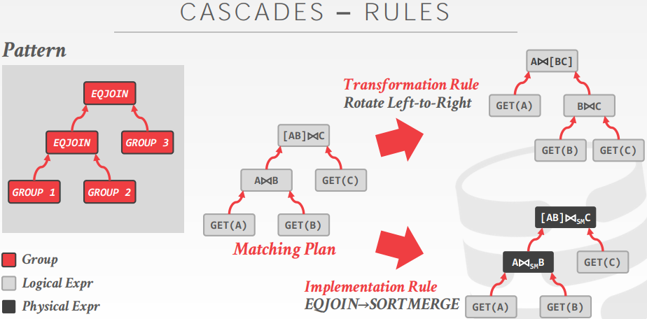

- [OPTIMIZER GENERATORS](#optimizer-generators)
  - [Framework to allow a DBMS implementer to write the declarative rules for optimizing queries.](#framework-to-allow-a-dbms-implementer-to-write-the-declarative-rules-for-optimizing-queries)
  - [Implementation can be independent of the optimizer's search strategy.](#implementation-can-be-independent-of-the-optimizers-search-strategy)
- [UNIFIED SEARCH](#unified-search)
- [CASCADES OPTIMIZER](#cascades-optimizer)
- [CASCADES EXPRESSIONS](#cascades-expressions)
- [CASCADES GROUPS](#cascades-groups)
- [CASCADES MULTI-EXPRESSION](#cascades-multi-expression)
- [CASCADES RULES](#cascades-rules)
- [CASCADES MEMO TABLE](#cascades-memo-table)
- [SEARCH TERMINATION](#search-termination)
  - [Approach #1: Wall-clock Time](#approach-1-wall-clock-time)
  - [Approach #2: Cost Threshold](#approach-2-cost-threshold)
  - [Approach #3: Transformation Exhaustion](#approach-3-transformation-exhaustion)
- [OBSERVATION](#observation)
- [PLAN ENUMERATION](#plan-enumeration)
- [DYNAMIC PROGRAMMING OPTIMIZER](#dynamic-programming-optimizer)
- [PREDICATE EXPRESSIONS](#predicate-expressions)
- [PREDICATE PUSHDOWN](#predicate-pushdown)
  - [Approach #1: Logical Transformation](#approach-1-logical-transformation)
  - [Approach #2: Rewrite Phase](#approach-2-rewrite-phase)
  - [Approach #3: Late Binding](#approach-3-late-binding)
- [PREDICATE MIGRATION](#predicate-migration)

学习来源：https://15721.courses.cs.cmu.edu/spring2019/slides/23-optimizer2.pdf

# OPTIMIZER GENERATORS
## Framework to allow a DBMS implementer to write the declarative rules for optimizing queries.
- Separate the search strategy from the data model.
- Separate the transformation rules and logical operators 
from physical rules and physical operators.
## Implementation can be independent of the optimizer's search strategy.

# UNIFIED SEARCH
Unify the notion of both logical→logical and 
logical→physical transformations.
- No need for separate stages because everything is transformations.

This approach generates a lot more 
transformations so it makes heavy use of 
memoization to reduce redundant work.

# CASCADES OPTIMIZER
Object-oriented implementation of the Volcano query optimizer.

Simplistic expression re-writing can be through a direct mapping function rather than an exhaustive search.

Optimization tasks as data structures.

Rules to place property enforcers.

Ordering of moves by promise.

Predicates as logical/physical operators.

# CASCADES EXPRESSIONS
A expression is an operator with zero or more input expressions.
```sql
SELECT * FROM A
JOIN B ON A.id = B.id
JOIN C ON C.id = A.id;
```
Logical Expression: $(A ⨝ B) ⨝ C$  
Physical Expression: $(A_{Seq} ⨝_{HJ} B_{Seq}) ⨝_{NL} C_{Seq}$

# CASCADES GROUPS
A group is a set of logically equivalent logical and physical expressions that produce the same output.
- All logical forms of an expression.
- All physical expressions that can be derived from selecting the allowable physical operators for the corresponding logical forms.

# CASCADES MULTI-EXPRESSION
Instead of explicitly instantiating all possible expressions in a group, the optimizer implicitly represents edundant expressions in a group as a multi-expression.
- This reduces the number of transformations, storage overhead, and repeated cost estimations.

# CASCADES RULES
A rule is a transformation of an expression to a logically equivalent expression.
- Transformation Rule: Logical to Logical
- Implementation Rule: Logical to Physical

Each rule is represented as a pair of attributes:
- **Pattern**: Defines the structure of the logical expression that can be applied to the rule.
- **Substitute**: Defines the structure of the result after applying the rule.



# CASCADES MEMO TABLE
Stores all previously explored alternatives in a compact graph structure / hash table.

Equivalent operator trees and their corresponding plans are stored together in groups.

Provides memoization, duplicate detection, and property + cost management.

# SEARCH TERMINATION
## Approach #1: Wall-clock Time
- Stop after the optimizer runs for some length of time.
## Approach #2: Cost Threshold
- Stop when the optimizer finds a plan that has a lower cost than some threshold.
## Approach #3: Transformation Exhaustion
- Stop when there are no more ways to transform the target plan. Usually done per group

# OBSERVATION
All of the queries we have looked at so far have had the following properties:
- Equi/Inner Joins
- Simple join predicates that reference only two tables.
- No cross products

Real-world queries are much more complex:
- Outer Joins
- Semi-joins
- Anti-joins

# PLAN ENUMERATION
How to generate different join orderings to feed into the optimizer's search model.
- Need to be efficient to not slowdown the search.

Approach #1: Generate-and-Test  
Approach #2: Graph Partitioning

https://15721.courses.cs.cmu.edu/spring2019/papers/23-optimizer2/p539-moerkotte.pdf  
http://www.vldb.org/pvldb/vol6/p1822-fender.pdf

# DYNAMIC PROGRAMMING OPTIMIZER
Model the query as a hypergraph and then incrementally expand to enumerate new plans.

Algorithm Overview:
- Iterate connected sub-graphs and incrementally add new edges to other nodes to complete query plan.
- Use rules to determine which nodes the traversal is allowed to visit and expand.

# PREDICATE EXPRESSIONS
Predicates are defined as part of each operator.
- These are typically represented as an AST.
- Postgres implements them as flatten lists.

The same logical operator can be represented in multiple physical operators using variations of the same expression.

# PREDICATE PUSHDOWN
## Approach #1: Logical Transformation
- Like any other transformation rule in Cascades.
- Can use cost-model to determine benefit.
## Approach #2: Rewrite Phase
- Perform pushdown before starting search using an initial 
rewrite phase. Tricky to support complex predicates.
## Approach #3: Late Binding
- Perform pushdown after generating optimal plan in Cascades. Will likely produce a bad plan.


# PREDICATE MIGRATION
```sql
SELECT * FROM foo
WHERE foo.id = 1234
AND SHA_512(foo.val) = '...'
```
Observation: Not all predicates cost the same to evaluate on tuples.

The optimizer should consider selectivity and computation cost when determining the evaluation order of predicates.
