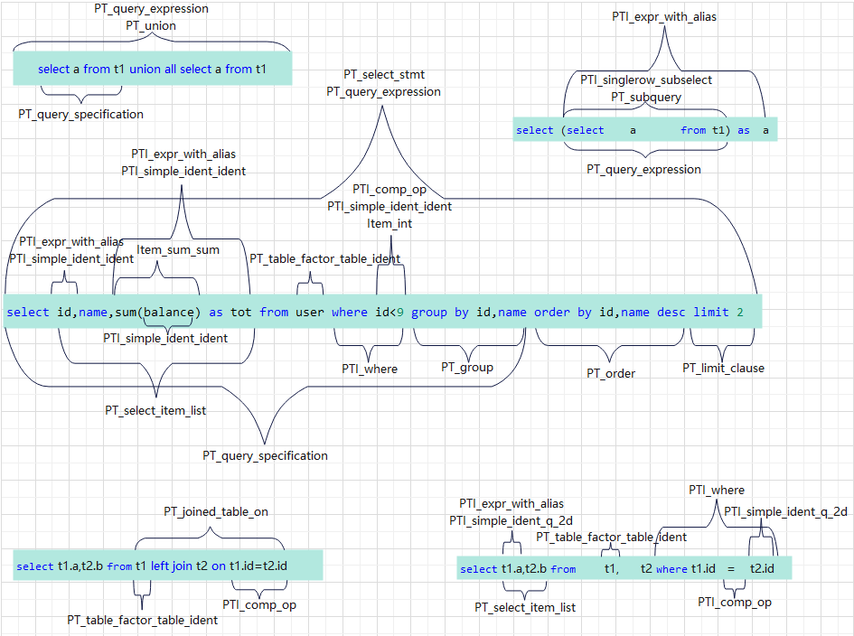
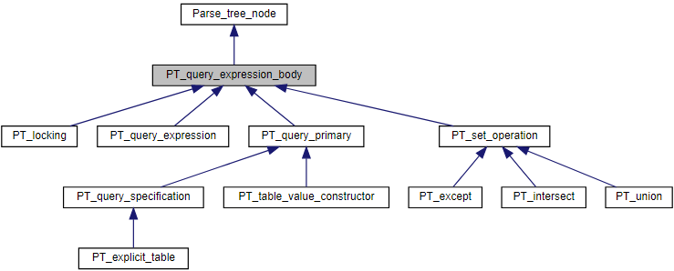
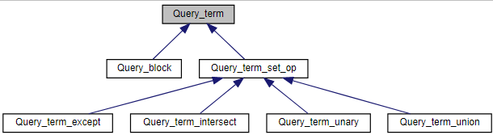

- [Query term tree structure](#query-term-tree-structure)
- [概念](#概念)
  - [美化概念](#美化概念)
  - [show parse\_tree 查看](#show-parse_tree-查看)
- [解析树 和 语法树](#解析树-和-语法树)
  - [解析树](#解析树)
    - [PT\_query\_xxx](#pt_query_xxx)
  - [语法树](#语法树)
    - [Query\_term\_xxx](#query_term_xxx)
    - [Query\_result\_xxx](#query_result_xxx)
    - [Query\_block](#query_block)
    - [Query\_expression](#query_expression)
    - [lex 中的语法树相关变量](#lex-中的语法树相关变量)

# Query term tree structure

# 概念

```
/**
  Query term tree structure. There are five node types, cf. Query_term_type.
  Leaf nodes are Query_block objects. We have three kinds of n-ary set operation
  nodes corresponding to INTERSECT, UNION and EXCEPT. Finally, we have a "unary"
  node which essentially adds a ORDER BY/LIMIT over another node.

  Query blocks serve a dual purpose: they represent the query specification and
  table constructors of the query. As such they are the leaf nodes of the query
  tree.  But they also serve as a way to realize ORDER BY and LIMIT for non-leaf
  nodes, accessed via the function Query_term::query_block().  Therefore, every
  non-leaf node in the tree has a companion Query_block to hold ORDER BY and
  LIMIT information.  For the leaf nodes, which are themselves query blocks, the
  query_block() function just returns a pointer to self, i.e. the leaf nodes
  handle ORDER BY and LIMIT themselves.

  \verbatim
  Example: ((SELECT * FROM t1 UNION SELECT * FROM t2 UNION ALL SELECT * FROM t3
             ORDER BY a LIMIT 5) INTERSECT
            (((SELECT * FROM t3 ORDER BY a LIMIT 4) ) EXCEPT SELECT * FROM t4)
            ORDER BY a LIMIT 4) ORDER BY -a LIMIT 3;

  ->
              m_query_term   +------------------+     slave(s)
              +--------------|-Query_expression |------------------+
              |              +------------------+                  |
              V        post_                                       |
  +-------------------+processing_ +-----------------------+       |
  | Query_term_unary  |block()     |Query_block            |       |
  |                   |----------->|order by -(`a`) limit 3|       |
  +-------------------+            +-----------------------+       |
   |m_children                                                     |
   | +-----------------------+   +----------------------+          |
   | |Query_term_intersect   |   |Query_block           |          |
   +>|last distinct index: 1 |-->|order by `a` limit 4  |          |
     +-----------------------+   +----------------------+          |
      |m_children                                                  |
      |  +-----------------------+   +----------------------+      |
      |  |Query_term_union       |   |Query_block           |      |
      +->|last distinct index: 1 |-->|order by `a`  limit 5 |      |
      |  +-----------------------+   +----------------------+      |
      |    |m_children                                             |
      |    |   +------------+        SELECT * FROM t1             /
      |    +-->|Query_block |  <---------------------------------+
      |    |   +------------+  ----------------------------------+ next
      |    |                                                      \
      |    |   +------------+        SELECT * FROM t2             /
      |    +-->|Query_block |  <---------------------------------+
      |    |   +------------+  ----------------------------------+ next
      |    |                                                      \
      |    |   +------------+        SELECT * FROM t3             /
      |    +-->|Query_block |  <---------------------------------+
      |        +------------+  ----------------------------------+ next
      |                                                           \
      |  +-----------------------+  +------------+                 |
      |  |Query_term_except      |->|Query_block |                 |
      +->|last distinct index: 1 |  +------------+                 |
         +-----------------------+                                 |
           |m_children                                             |
           |   +----------------------+                            |
           |   |Query_block           |      SELECT * FROM t3      /
           +-->|order by `a`  limit 4 |  <------------------------+
           |   +----------------------+  -------------------------+ next
           |                                                       \
           |   +------------+                SELECT * FROM t4      |
           +-->|Query_block | <------------------------------------+
               +------------+
  \endverbatim
  Note that all leaf query blocks representing the query specifications are
  linked under Query_expression via their next pointers. The nesting is achieved
  by the arrows on the left side of the figure, via the nodes' m_children
  members. The four classes Query_term_unary and Query_term_{union, intersect,
  except} are modelled via the base class Query_term_set_op which contains a
  m_children member. Each of these also contain a Query_block which will handle
  its order by and/or limit clauses. These are similar to the old so-called
  "fake_query_block" (which is now gone), and are not linked in with "next"
  pointers.

  The is also a back pointer from the children nodes to the parent Query_term
  object (not shown).

  In the simple case of a single query specification (or table value constructor
  or explicit table), there is no super-structure over the Query_block linked
  from the Query_expression, i.e. Query_expression's m_query_term member is just
  a Query_block.

  The query blocks (QT_QUERY_BLOCK nodes) corresponding to the query
  specification (or table value constructors) are prepared and optimized by
  running over them from the Query_expression via the slave/next pointers as
  before. There are separate methods which handle prepare and optimization for
  non-leaves, i.e. nodes of types QT_UNARY, QT_INTERSECT, QT_EXCEPT and
  QT_UNION.

  We also define an iterator class (Query_terms) for iterating over all
  the nodes in the tree, see also Query_expression::query_terms() for its use.
  When possible, we access all nodes using iterators.

  The built structure can be traced with the debug trace keyword "ast", e.g.
  as SET SESSION debug = 'd,ast:O,/tmp/mysqld.trace';
*/
```

## 美化概念

```sql
(
    (
        SELECT * FROM t1 
        UNION 
        SELECT * FROM t2 
        UNION ALL 
        SELECT * FROM t3            
        ORDER BY a LIMIT 5
    ) 
  
    INTERSECT           
    (
        ((SELECT * FROM t3 ORDER BY a LIMIT 4) ) 
        EXCEPT 
        SELECT * FROM t4
    )
    ORDER BY a LIMIT 4
) ORDER BY -a LIMIT 3


  ->
              m_query_term   +------------------+     slave(s)
              +--------------|-Query_expression |------------------+
              |              +------------------+                  |
              V        post_                                       |
  +-------------------+processing_ +-----------------------+       |
  | Query_term_unary  |block()     |Query_block            |       |
  |                   |----------->|order by -(`a`) limit 3|       |
  +-------------------+            +-----------------------+       |
   |m_children                                                     |
   | +-----------------------+   +----------------------+          |
   | |Query_term_intersect   |   |Query_block           |          |
   +>|last distinct index: 1 |-->|order by `a` limit 4  |          |
     +-----------------------+   +----------------------+          |
      |m_children                                                  |
      |  +-----------------------+   +----------------------+      |
      |  |Query_term_union       |   |Query_block           |      |
      +->|last distinct index: 1 |-->|order by `a`  limit 5 |      |
      |  +-----------------------+   +----------------------+      |
      |    |m_children                                             |
      |    |   +------------+        SELECT * FROM t1             /
      |    +-->|Query_block |  <---------------------------------+
      |    |   +------------+  ----------------------------------+ next
      |    |                                                      \
      |    |   +------------+        SELECT * FROM t2             /
      |    +-->|Query_block |  <---------------------------------+
      |    |   +------------+  ----------------------------------+ next
      |    |                                                      \
      |    |   +------------+        SELECT * FROM t3             /
      |    +-->|Query_block |  <---------------------------------+
      |        +------------+  ----------------------------------+ next
      |                                                           \
      |  +-----------------------+  +------------+                 |
      |  |Query_term_except      |->|Query_block |                 |
      +->|last distinct index: 1 |  +------------+                 |
         +-----------------------+                                 |
           |m_children                                             |
           |   +----------------------+                            |
           |   |Query_block           |      SELECT * FROM t3      /
           +-->|order by `a`  limit 4 |  <------------------------+
           |   +----------------------+  -------------------------+ next
           |                                                       \
           |   +------------+                SELECT * FROM t4      |
           +-->|Query_block | <------------------------------------+
               +------------+
  \endverbatim
```

## show parse_tree 查看



# 解析树 和 语法树
PT_query_xxx 和 Query_xxx 的主要区别在于，前者是解析树中的节点，它直接对应于SQL查询的文本表示，而后者是抽象语法树中的节点，它对应于查询的逻辑结构。
## 解析树
### PT_query_xxx
https://dev.mysql.com/doc/dev/mysql-server/8.1.0/classPT__query__expression__body__inherit__graph_org.svg


## 语法树
### Query_term_xxx
https://dev.mysql.com/doc/dev/mysql-server/8.1.0/classQuery__term__inherit__graph_org.svg



### Query_result_xxx
https://dev.mysql.com/doc/dev/mysql-server/8.1.0/classQuery__result__inherit__graph_org.svg


### Query_block
This class represents a query block, aka a query specification, which is a query consisting of a SELECT keyword, followed by a table list, optionally followed by a WHERE clause, a GROUP BY, etc
```cpp
class Query_block : public Query_term {  // 查询块类，继承自查询项类
public:
    size_t m_added_non_hidden_fields;  // 添加的非隐藏字段数量
    mem_root_deque<Item*> fields;  // 字段列表
    List<Window> m_windows;  // 窗口函数列表
    List<Item_func_match> *ftfunc_list;  // 全文检索函数列表指针
    List<Item_func_match> ftfunc_list_alloc;  // 分配的全文检索函数列表
    mem_root_deque<mem_root_deque<Item*>*> *row_value_list;  // 行值列表
    mem_root_deque<Table_ref*> sj_nests;  // 半连接嵌套表引用列表
    SQL_I_List<Table_ref> m_table_list;  // 表列表
    SQL_I_List<ORDER> order_list;  // 排序列表
    Group_list_ptrs *order_list_ptrs;  // 排序列表指针
    Opt_hints_qb *opt_hints_qb;  // 优化提示查询块
    char *db;  // 数据库名称
    LEX *parent_lex;  // 父级词法分析器
    table_map select_list_tables;  // 选择列表的表映射
    table_map outer_join;  // 外连接表映射
    Name_resolution_context context;  // 名称解析上下文
    Name_resolution_context *first_context;  // 第一个名称解析上下文
    JOIN *join;  // 连接
    mem_root_deque<Table_ref*> m_table_nest;  // 表嵌套列表
    mem_root_deque<Table_ref*> *m_current_table_nest;  // 当前表嵌套列表
    Table_ref *end_lateral_table;  // 结束的Lateral表
    Item *select_limit;  // 选择限制
    Item *offset_limit;  // 偏移限制
    Item::cond_result cond_value;  // 条件值
    Item::cond_result having_value;  // HAVING条件值
    uint select_n_where_fields;  // WHERE字段数量
    uint select_n_having_items;  // HAVING项数量
    uint saved_cond_count;  // 保存的条件计数
    uint cond_count;  // 条件计数
    uint between_count;  // BETWEEN计数
    enum_condition_context condition_context;  // 条件上下文
    sub_select_type linkage;  // 子查询类型
    bool subquery_in_having;  // HAVING中的子查询
    bool m_use_select_limit;  // 使用SELECT限制
    bool m_internal_limit;  // 内部限制
private:
    Query_block *next;  // 下一个查询块
    Query_expression *master;  // 主查询表达式
    Query_expression *slave;  // 从查询表达式
    Query_block *link_next;  // 下一个连接查询块
    Query_block **link_prev;  // 上一个连接查询块
    Query_result *m_query_result;  // 查询结果
public:
    Table_ref *resolve_nest;  // 解析嵌套
private:
    Item *m_where_cond;  // WHERE条件
    Item *m_having_cond;  // HAVING条件
    int hidden_group_field_count;  // 隐藏的分组字段数量
    bool has_sj_nests;  // 是否有半连接嵌套
    bool has_aj_nests;  // 是否有外连接嵌套
    bool m_right_joins;  // 右连接
    bool allow_merge_derived;  // 允许合并派生
    bool m_agg_func_used;  // 聚合函数已使用
    bool m_json_agg_func_used;  // JSON聚合函数已使用
    bool m_empty_query;  // 空查询
    static const char *type_str[13];  // 类型字符串数组
```
### Query_expression
This class represents a query expression (one query block or several query blocks combined with UNION)
```cpp
class Query_expression {
  private:
    Query_expression *next;  // 下一个查询表达式
    Query_expression **prev;  // 前一个查询表达式的指针
    Query_block *master;  // 主查询块
    Query_block *slave;  // 从查询块
    Query_term *m_query_term;  // 查询项
    enum_parsing_context explain_marker;  // 解释标记
    bool prepared;  // 是否已准备好
    bool optimized;  // 是否已优化
    bool executed;  // 是否已执行
    Query_result *m_query_result;  // 查询结果
    unique_ptr_destroy_only m_root_iterator;  // 唯一的根迭代器
    AccessPath *m_root_access_path;  // 根访问路径
    Mem_root_array<MaterializePathParameters::QueryBlock> m_query_blocks_to_materialize;  // 需要实体化的查询块数组
  public:
    uint8 uncacheable;  // 不可缓存的标志
    Query_expression::enum_clean_state cleaned;  // 清理状态
  private:
    mem_root_deque<Item*> types;  // 类型队列
  public:
    ha_rows select_limit_cnt;  // 选择限制行数
    ha_rows offset_limit_cnt;  // 偏移限制行数
    Item_subselect *item;  // 子查询项
    PT_with_clause *m_with_clause;
    Table_ref *derived_table;
    Query_block *first_recursive;
    table_map m_lateral_deps;
    bool m_reject_multiple_rows;
    ha_rows send_records;  // 发送记录数
}
```
图解
```sql
  select *
  from table1
     where table1.field IN (select * from table1_1_1 union
                            select * from table1_1_2)
     union
   select *
     from table2
     where table2.field=(select (select f1 from table2_1_1_1_1
                                   where table2_1_1_1_1.f2=table2_1_1.f3)
                           from table2_1_1
                           where table2_1_1.f1=table2.f2)
     union
   select * from table3;
 
   we will have following structure:
 
   select1: (select * from table1 ...)
   select2: (select * from table2 ...)
   select3: (select * from table3)
   select1.1.1: (select * from table1_1_1)
   ...
 
     main unit
     select1 select2 select3
     |^^     |^
    s|||     ||master
    l|||     |+---------------------------------+
    a|||     +---------------------------------+|
    v|||master                         slave   ||
    e||+-------------------------+             ||
     V|            neighbor      |             V|
     unit1.1<+==================>unit1.2       unit2.1
     select1.1.1 select 1.1.2    select1.2.1   select2.1.1
                                               |^
                                               ||
                                               V|
                                               unit2.1.1.1
                                               select2.1.1.1.1
 
 
   relation in main unit will be following:
   (bigger picture for:
      main unit
      select1 select2 select3
   in the above picture)
 
         main unit
         |^^^
         ||||
         ||||
         |||+------------------------------+
         ||+--------------+                |
    slave||master         |                |
         V|      neighbor |       neighbor |
         select1<========>select2<========>select3
 
    list of all query_block will be following (as it will be constructed by
    parser):
 
    select1->select2->select3->select2.1.1->select 2.1.2->select2.1.1.1.1-+
                                                                          |
    +---------------------------------------------------------------------+
    |
    +->select1.1.1->select1.1.2
```

### lex 中的语法树相关变量
```cpp
 public:
   Query_expression *unit;  // 查询树的根节点
   Query_block *query_block;    // 查询块
   Query_block *all_query_blocks_list;  // 所有查询块的列表
 private:
   Query_block *m_current_query_block;  // 当前查询块
```