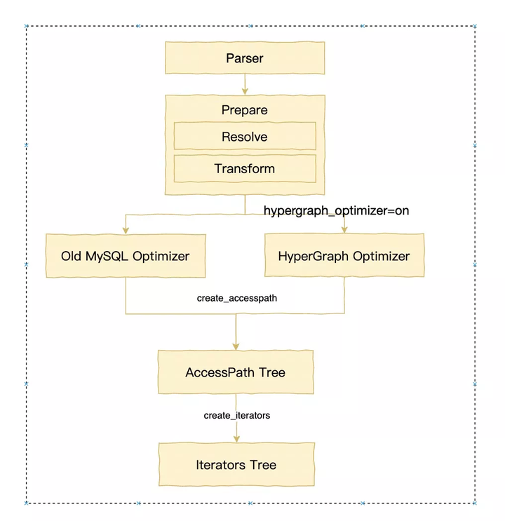

- [Query term tree structure](#query-term-tree-structure)
- [概念](#概念)
  - [美化概念](#美化概念)
  - [show parse\_tree 查看](#show-parse_tree-查看)
- [解析树 和 语法树](#解析树-和-语法树)
  - [解析树](#解析树)
    - [PT\_query\_xxx](#pt_query_xxx)
  - [语法树](#语法树)
    - [Query\_term\_xxx](#query_term_xxx)
    - [Query\_result\_xxx](#query_result_xxx)
    - [Query\_block](#query_block)
    - [Query\_expression](#query_expression)
    - [lex 中的语法树相关变量](#lex-中的语法树相关变量)
- [谓词的选择性](#谓词的选择性)
- [启发式](#启发式)
- [派生表、合并](#派生表合并)
  - [子查询级别](#子查询级别)
  - [怎么样决定是否合并](#怎么样决定是否合并)
    - [举例](#举例)
  - [其它](#其它)
- [表函数](#表函数)
- [移除冗余查询](#移除冗余查询)
- [Scalar Subqueries](#scalar-subqueries)
  - [另外一种解读](#另外一种解读)
- [MySQL Optimize和Planning阶段](#mysql-optimize和planning阶段)
  - [老优化器的入口](#老优化器的入口)
  - [新优化器的入口](#新优化器的入口)
- [𝓢𝓔𝓢 和 𝓣𝓔𝓢](#𝓢𝓔𝓢-和-𝓣𝓔𝓢)
- [join 的符号表示](#join-的符号表示)
- [其它概念的数学符号](#其它概念的数学符号)
- [transformation](#transformation)
  - [commutativity 交换律](#commutativity-交换律)
  - [associativity 结合律](#associativity-结合律)
  - [asscom 交换结合律](#asscom-交换结合律)
- [xx](#xx)

# Query term tree structure

# 概念

```
/**
  Query term tree structure. There are five node types, cf. Query_term_type.
  Leaf nodes are Query_block objects. We have three kinds of n-ary set operation
  nodes corresponding to INTERSECT, UNION and EXCEPT. Finally, we have a "unary"
  node which essentially adds a ORDER BY/LIMIT over another node.

  Query blocks serve a dual purpose: they represent the query specification and
  table constructors of the query. As such they are the leaf nodes of the query
  tree.  But they also serve as a way to realize ORDER BY and LIMIT for non-leaf
  nodes, accessed via the function Query_term::query_block().  Therefore, every
  non-leaf node in the tree has a companion Query_block to hold ORDER BY and
  LIMIT information.  For the leaf nodes, which are themselves query blocks, the
  query_block() function just returns a pointer to self, i.e. the leaf nodes
  handle ORDER BY and LIMIT themselves.

  \verbatim
  Example: ((SELECT * FROM t1 UNION SELECT * FROM t2 UNION ALL SELECT * FROM t3
             ORDER BY a LIMIT 5) INTERSECT
            (((SELECT * FROM t3 ORDER BY a LIMIT 4) ) EXCEPT SELECT * FROM t4)
            ORDER BY a LIMIT 4) ORDER BY -a LIMIT 3;

  ->
              m_query_term   +------------------+     slave(s)
              +--------------|-Query_expression |------------------+
              |              +------------------+                  |
              V        post_                                       |
  +-------------------+processing_ +-----------------------+       |
  | Query_term_unary  |block()     |Query_block            |       |
  |                   |----------->|order by -(`a`) limit 3|       |
  +-------------------+            +-----------------------+       |
   |m_children                                                     |
   | +-----------------------+   +----------------------+          |
   | |Query_term_intersect   |   |Query_block           |          |
   +>|last distinct index: 1 |-->|order by `a` limit 4  |          |
     +-----------------------+   +----------------------+          |
      |m_children                                                  |
      |  +-----------------------+   +----------------------+      |
      |  |Query_term_union       |   |Query_block           |      |
      +->|last distinct index: 1 |-->|order by `a`  limit 5 |      |
      |  +-----------------------+   +----------------------+      |
      |    |m_children                                             |
      |    |   +------------+        SELECT * FROM t1             /
      |    +-->|Query_block |  <---------------------------------+
      |    |   +------------+  ----------------------------------+ next
      |    |                                                      \
      |    |   +------------+        SELECT * FROM t2             /
      |    +-->|Query_block |  <---------------------------------+
      |    |   +------------+  ----------------------------------+ next
      |    |                                                      \
      |    |   +------------+        SELECT * FROM t3             /
      |    +-->|Query_block |  <---------------------------------+
      |        +------------+  ----------------------------------+ next
      |                                                           \
      |  +-----------------------+  +------------+                 |
      |  |Query_term_except      |->|Query_block |                 |
      +->|last distinct index: 1 |  +------------+                 |
         +-----------------------+                                 |
           |m_children                                             |
           |   +----------------------+                            |
           |   |Query_block           |      SELECT * FROM t3      /
           +-->|order by `a`  limit 4 |  <------------------------+
           |   +----------------------+  -------------------------+ next
           |                                                       \
           |   +------------+                SELECT * FROM t4      |
           +-->|Query_block | <------------------------------------+
               +------------+
  \endverbatim
  Note that all leaf query blocks representing the query specifications are
  linked under Query_expression via their next pointers. The nesting is achieved
  by the arrows on the left side of the figure, via the nodes' m_children
  members. The four classes Query_term_unary and Query_term_{union, intersect,
  except} are modelled via the base class Query_term_set_op which contains a
  m_children member. Each of these also contain a Query_block which will handle
  its order by and/or limit clauses. These are similar to the old so-called
  "fake_query_block" (which is now gone), and are not linked in with "next"
  pointers.

  The is also a back pointer from the children nodes to the parent Query_term
  object (not shown).

  In the simple case of a single query specification (or table value constructor
  or explicit table), there is no super-structure over the Query_block linked
  from the Query_expression, i.e. Query_expression's m_query_term member is just
  a Query_block.

  The query blocks (QT_QUERY_BLOCK nodes) corresponding to the query
  specification (or table value constructors) are prepared and optimized by
  running over them from the Query_expression via the slave/next pointers as
  before. There are separate methods which handle prepare and optimization for
  non-leaves, i.e. nodes of types QT_UNARY, QT_INTERSECT, QT_EXCEPT and
  QT_UNION.

  We also define an iterator class (Query_terms) for iterating over all
  the nodes in the tree, see also Query_expression::query_terms() for its use.
  When possible, we access all nodes using iterators.

  The built structure can be traced with the debug trace keyword "ast", e.g.
  as SET SESSION debug = 'd,ast:O,/tmp/mysqld.trace';
*/
```

## 美化概念

```sql
(
    (
        SELECT * FROM t1 
        UNION 
        SELECT * FROM t2 
        UNION ALL 
        SELECT * FROM t3            
        ORDER BY a LIMIT 5
    ) 
  
    INTERSECT           
    (
        ((SELECT * FROM t3 ORDER BY a LIMIT 4) ) 
        EXCEPT 
        SELECT * FROM t4
    )
    ORDER BY a LIMIT 4
) ORDER BY -a LIMIT 3


  ->
              m_query_term   +------------------+     slave(s)
              +--------------|-Query_expression |------------------+
              |              +------------------+                  |
              V        post_                                       |
  +-------------------+processing_ +-----------------------+       |
  | Query_term_unary  |block()     |Query_block            |       |
  |                   |----------->|order by -(`a`) limit 3|       |
  +-------------------+            +-----------------------+       |
   |m_children                                                     |
   | +-----------------------+   +----------------------+          |
   | |Query_term_intersect   |   |Query_block           |          |
   +>|last distinct index: 1 |-->|order by `a` limit 4  |          |
     +-----------------------+   +----------------------+          |
      |m_children                                                  |
      |  +-----------------------+   +----------------------+      |
      |  |Query_term_union       |   |Query_block           |      |
      +->|last distinct index: 1 |-->|order by `a`  limit 5 |      |
      |  +-----------------------+   +----------------------+      |
      |    |m_children                                             |
      |    |   +------------+        SELECT * FROM t1             /
      |    +-->|Query_block |  <---------------------------------+
      |    |   +------------+  ----------------------------------+ next
      |    |                                                      \
      |    |   +------------+        SELECT * FROM t2             /
      |    +-->|Query_block |  <---------------------------------+
      |    |   +------------+  ----------------------------------+ next
      |    |                                                      \
      |    |   +------------+        SELECT * FROM t3             /
      |    +-->|Query_block |  <---------------------------------+
      |        +------------+  ----------------------------------+ next
      |                                                           \
      |  +-----------------------+  +------------+                 |
      |  |Query_term_except      |->|Query_block |                 |
      +->|last distinct index: 1 |  +------------+                 |
         +-----------------------+                                 |
           |m_children                                             |
           |   +----------------------+                            |
           |   |Query_block           |      SELECT * FROM t3      /
           +-->|order by `a`  limit 4 |  <------------------------+
           |   +----------------------+  -------------------------+ next
           |                                                       \
           |   +------------+                SELECT * FROM t4      |
           +-->|Query_block | <------------------------------------+
               +------------+
  \endverbatim
```

## show parse_tree 查看


# 解析树 和 语法树
PT_query_xxx 和 Query_xxx 的主要区别在于，前者是解析树中的节点，它直接对应于SQL查询的文本表示，而后者是抽象语法树中的节点，它对应于查询的逻辑结构。
## 解析树
### PT_query_xxx
https://dev.mysql.com/doc/dev/mysql-server/8.1.0/classPT__query__expression__body__inherit__graph_org.svg


## 语法树
### Query_term_xxx
https://dev.mysql.com/doc/dev/mysql-server/8.1.0/classQuery__term__inherit__graph_org.svg


### Query_result_xxx
https://dev.mysql.com/doc/dev/mysql-server/8.1.0/classQuery__result__inherit__graph_org.svg


### Query_block
This class represents a query block, aka a query specification, which is a query consisting of a SELECT keyword, followed by a table list, optionally followed by a WHERE clause, a GROUP BY, etc
```cpp
class Query_block : public Query_term {  // 查询块类，继承自查询项类
public:
    size_t m_added_non_hidden_fields;  // 添加的非隐藏字段数量
    mem_root_deque<Item*> fields;  // 字段列表
    List<Window> m_windows;  // 窗口函数列表
    List<Item_func_match> *ftfunc_list;  // 全文检索函数列表指针
    List<Item_func_match> ftfunc_list_alloc;  // 分配的全文检索函数列表
    mem_root_deque<mem_root_deque<Item*>*> *row_value_list;  // 行值列表
    mem_root_deque<Table_ref*> sj_nests;  // 半连接嵌套表引用列表
    SQL_I_List<Table_ref> m_table_list;  // 表列表
    SQL_I_List<ORDER> order_list;  // 排序列表
    Group_list_ptrs *order_list_ptrs;  // 排序列表指针
    Opt_hints_qb *opt_hints_qb;  // 优化提示查询块
    char *db;  // 数据库名称
    LEX *parent_lex;  // 父级词法分析器
    table_map select_list_tables;  // 选择列表的表映射
    table_map outer_join;  // 外连接表映射
    Name_resolution_context context;  // 名称解析上下文
    Name_resolution_context *first_context;  // 第一个名称解析上下文
    JOIN *join;  // 连接
    mem_root_deque<Table_ref*> m_table_nest;  // 表嵌套列表
    mem_root_deque<Table_ref*> *m_current_table_nest;  // 当前表嵌套列表
    Table_ref *end_lateral_table;  // 结束的Lateral表
    Item *select_limit;  // 选择限制
    Item *offset_limit;  // 偏移限制
    Item::cond_result cond_value;  // 条件值
    Item::cond_result having_value;  // HAVING条件值
    uint select_n_where_fields;  // WHERE字段数量
    uint select_n_having_items;  // HAVING项数量
    uint saved_cond_count;  // 保存的条件计数
    uint cond_count;  // 条件计数
    uint between_count;  // BETWEEN计数
    enum_condition_context condition_context;  // 条件上下文
    sub_select_type linkage;  // 子查询类型
    bool subquery_in_having;  // HAVING中的子查询
    bool m_use_select_limit;  // 使用SELECT限制
    bool m_internal_limit;  // 内部限制
private:
    Query_block *next;  // 下一个查询块
    Query_expression *master;  // 主查询表达式
    Query_expression *slave;  // 从查询表达式
    Query_block *link_next;  // 下一个连接查询块
    Query_block **link_prev;  // 上一个连接查询块
    Query_result *m_query_result;  // 查询结果
public:
    Table_ref *resolve_nest;  // 解析嵌套
private:
    Item *m_where_cond;  // WHERE条件
    Item *m_having_cond;  // HAVING条件
    int hidden_group_field_count;  // 隐藏的分组字段数量
    bool has_sj_nests;  // 是否有半连接嵌套
    bool has_aj_nests;  // 是否有外连接嵌套
    bool m_right_joins;  // 右连接
    bool allow_merge_derived;  // 允许合并派生
    bool m_agg_func_used;  // 聚合函数已使用
    bool m_json_agg_func_used;  // JSON聚合函数已使用
    bool m_empty_query;  // 空查询
    static const char *type_str[13];  // 类型字符串数组
```
### Query_expression
This class represents a query expression (one query block or several query blocks combined with UNION)
```cpp
class Query_expression {
  private:
    Query_expression *next;  // 下一个查询表达式
    Query_expression **prev;  // 前一个查询表达式的指针
    Query_block *master;  // 主查询块
    Query_block *slave;  // 从查询块
    Query_term *m_query_term;  // 查询项
    enum_parsing_context explain_marker;  // 解释标记
    bool prepared;  // 是否已准备好
    bool optimized;  // 是否已优化
    bool executed;  // 是否已执行
    Query_result *m_query_result;  // 查询结果
    unique_ptr_destroy_only m_root_iterator;  // 唯一的根迭代器
    AccessPath *m_root_access_path;  // 根访问路径
    Mem_root_array<MaterializePathParameters::QueryBlock> m_query_blocks_to_materialize;  // 需要实体化的查询块数组
  public:
    uint8 uncacheable;  // 不可缓存的标志
    Query_expression::enum_clean_state cleaned;  // 清理状态
  private:
    mem_root_deque<Item*> types;  // 类型队列
  public:
    ha_rows select_limit_cnt;  // 选择限制行数
    ha_rows offset_limit_cnt;  // 偏移限制行数
    Item_subselect *item;  // 子查询项
    PT_with_clause *m_with_clause;
    Table_ref *derived_table;
    Query_block *first_recursive;
    table_map m_lateral_deps;
    bool m_reject_multiple_rows;
    ha_rows send_records;  // 发送记录数
}
```
图解
```sql
  select *
  from table1
     where table1.field IN (select * from table1_1_1 union
                            select * from table1_1_2)
     union
   select *
     from table2
     where table2.field=(select (select f1 from table2_1_1_1_1
                                   where table2_1_1_1_1.f2=table2_1_1.f3)
                           from table2_1_1
                           where table2_1_1.f1=table2.f2)
     union
   select * from table3;
 
   we will have following structure:
 
   select1: (select * from table1 ...)
   select2: (select * from table2 ...)
   select3: (select * from table3)
   select1.1.1: (select * from table1_1_1)
   ...
 
     main unit
     select1 select2 select3
     |^^     |^
    s|||     ||master
    l|||     |+---------------------------------+
    a|||     +---------------------------------+|
    v|||master                         slave   ||
    e||+-------------------------+             ||
     V|            neighbor      |             V|
     unit1.1<+==================>unit1.2       unit2.1
     select1.1.1 select 1.1.2    select1.2.1   select2.1.1
                                               |^
                                               ||
                                               V|
                                               unit2.1.1.1
                                               select2.1.1.1.1
 
 
   relation in main unit will be following:
   (bigger picture for:
      main unit
      select1 select2 select3
   in the above picture)
 
         main unit
         |^^^
         ||||
         ||||
         |||+------------------------------+
         ||+--------------+                |
    slave||master         |                |
         V|      neighbor |       neighbor |
         select1<========>select2<========>select3
 
    list of all query_block will be following (as it will be constructed by
    parser):
 
    select1->select2->select3->select2.1.1->select 2.1.2->select2.1.1.1.1-+
                                                                          |
    +---------------------------------------------------------------------+
    |
    +->select1.1.1->select1.1.2
```

### lex 中的语法树相关变量
```cpp
 public:
   Query_expression *unit;  // 查询树的根节点
   Query_block *query_block;    // 查询块
   Query_block *all_query_blocks_list;  // 所有查询块的列表
 private:
   Query_block *m_current_query_block;  // 当前查询块
```

# 谓词的选择性
它描述了一个谓词（即查询条件）能够过滤掉多少数据。选择性的值范围通常在0到1之间，其中0表示谓词过滤掉所有的行（即没有行满足该条件），1表示谓词不过滤任何行（即所有行都满足该条件）。

例如，假设我们有一个包含1000行的表，表中有一个名为age的列。如果我们的查询是SELECT * FROM table WHERE age > 30，并且表中有250行的age值大于30，那么这个谓词的选择性就是0.25（即250/1000）。这意味着这个谓词能够过滤掉75%的数据。

# 启发式
比如你在一个大城市中寻找从点A到点B的最快路径。最优的方法是考虑城市中的每一条街道，但这需要大量的时间和计算资源。一个启发式的方法可能是避开那些你知道常常堵车的街道，或者选择那些你知道通常比较畅通的街道。这种方法可能不会给你最快的路径，但是会在合理的时间内给你一个好的路径。这就是启发式的一个例子。

# 派生表、合并
```sql
SELECT * FROM (SELECT * FROM orders WHERE order_date > '2023-01-01') as derived_table;
```
在这个查询中，derived_table是一个派生表，它是通过子查询创建的。如果不进行合并，数据库需要先执行子查询，将结果存储在一个临时表derived_table中，然后再从这个临时表中选择所有的记录。这就需要额外的存储空间来保存临时表，而且在查询过程中需要进行额外的读写操作，这可能会降低查询效率。

但是，如果我们将派生表合并到主查询中，那么查询就可以直接变为：
```sql
SELECT * FROM orders WHERE order_date > '2023-01-01';
```
## 子查询级别
如果一个子查询是在主查询的SELECT、FROM、WHERE或HAVING子句中定义的，那么这个子查询就是第一级子查询  
例如：
```sql
SELECT order_id, (SELECT COUNT(*) FROM order_items WHERE order_id = o.order_id) as item_count
FROM orders o;
```

如果一个子查询是在另一个子查询中定义的，那么这个子查询就不是第一级子查询  
例如：
```sql
SELECT * FROM (SELECT order_id, (SELECT COUNT(*) FROM order_items WHERE order_id = o.order_id) as item_count
FROM orders o) as derived_table;
```
在这个查询中，(SELECT COUNT(*) FROM order_items WHERE order_id = o.order_id)就不是第一级子查询，因为它是在另一个子查询中定义的。

## 怎么样决定是否合并
    Determine whether it is suggested to merge immediate derived tables, based
    on the placement of the query block:
      - DTs belonging to outermost query block: always
      - DTs belonging to first level subqueries: Yes if inside SELECT statement,
        no otherwise (including UPDATE and DELETE).
        This is required to support a workaround for allowing subqueries
        containing the same table as is target for delete or update,
        by forcing a materialization of the subquery.
      - All other cases inherit status of parent query block.
### 举例
假设我们有一个查询，其中包含一个子查询，这个子查询又包含一个派生表（DT）：

```sql
SELECT * FROM (SELECT * FROM orders WHERE order_date > '2023-01-01') as derived_table;
```

在这个例子中，`derived_table`就是一个直接派生的表，它属于最外层的查询块，所以我们总是可以合并这个派生表。

现在，假设我们有一个更复杂的查询，其中包含一个子查询，这个子查询又包含一个派生表，而这个子查询是在一个`SELECT`语句中：

```sql
SELECT order_id, (SELECT COUNT(*) FROM (SELECT * FROM order_items WHERE order_id = o.order_id) as derived_table) as item_count
FROM orders o;
```

在这个例子中，`derived_table`是一个直接派生的表，它属于第一级子查询，并且这个子查询是在一个`SELECT`语句中，所以我们可以合并这个派生表。

然而，如果这个子查询是在一个`UPDATE`或`DELETE`语句中，那么我们就不能合并这个派生表。例如：

```sql
UPDATE orders
SET order_status = 'processed'
WHERE order_id IN (SELECT order_id FROM (SELECT * FROM orders WHERE order_date > '2023-01-01') as derived_table);
```

在这个例子中，`derived_table`是一个直接派生的表，它属于第一级子查询，但是这个子查询是在一个`UPDATE`语句中，所以我们不能合并这个派生表。

对于所有其他情况，派生表是否可以合并，取决于它所在的父查询块。例如，如果一个派生表在一个子查询中，而这个子查询又在另一个子查询中，那么这个派生表是否可以合并，就取决于它的父查询块（也就是外层的子查询）是否可以合并派生表。如果父查询块可以合并派生表，那么这个派生表也可以合并；如果父查询块不能合并派生表，那么这个派生表也不能合并。例如：

```sql
SELECT * FROM (SELECT * FROM (SELECT * FROM orders WHERE order_date > '2023-01-01') as derived_table_1) as derived_table_2;
```

在这个例子中，`derived_table_1`是一个直接派生的表，它属于一个子查询，这个子查询又属于另一个子查询。因为`derived_table_1`的父查询块（也就是外层的子查询）可以合并派生表，所以`derived_table_1`也可以合并。同样，`derived_table_2`也可以合并，因为它属于最外层的查询块。

## 其它
```
This is required to support a workaround for allowing subqueries
        containing the same table as is target for delete or update,
        by forcing a materialization of the subquery.  
```
这段话的理解：
```sql
DELETE FROM orders
WHERE order_id IN (SELECT order_id FROM orders WHERE order_date > '2023-01-01');
```  
在这个查询中，子查询中的表orders和主查询中要删除的表都是同一个表。如果我们直接执行这个查询，那么主查询的删除操作可能会影响子查询的结果，因为子查询的结果依赖于orders表中的数据。但是，如果我们先将子查询的结果实体化（也就是保存到一个临时表中），那么即使主查询删除了orders表中的数据，也不会影响子查询的结果，因为子查询的结果已经保存在临时表中了。

所以，这段话的含义是，为了支持这种解决方案，需要强制对子查询进行实体化。

# 表函数
```sql
SELECT * 
FROM JSON_TABLE('{"a": 1, "b": 2}', '$.*' COLUMNS(a INT PATH '$.a', b INT PATH '$.b'));
```
这个查询会返回一个包含一行的表，这一行包含两个列a和b，对应JSON对象中的两个属性。

# 移除冗余查询
```
    Permanently remove redundant parts from the query if
      1) This is a subquery
      2) Not normalizing a view. Removal should take place when a
         query involving a view is optimized, not when the view
         is created
```
举例：
```sql
SELECT * FROM (SELECT id, name FROM users WHERE name = 'John') as subquery;
```
在这个查询中，子查询SELECT id, name FROM users WHERE name = 'John'是冗余的，因为它的结果被完全包含在主查询中。所以，这个查询可以被优化为：
```sql
SELECT id, name FROM users WHERE name = 'John';
```

# Scalar Subqueries
标量子查询（Scalar Subqueries）是一种特殊的子查询，它只返回一行中的一个列值。标量子查询表达式的值是子查询的可选列表项的值。如果子查询返回0行，则标量子查询表达式的值为NULL。如果子查询返回多行，则会报错。

以下是一个标量子查询的例子：

```sql
SELECT name, (SELECT MAX(salary) FROM employees WHERE department_id = d.id) as max_salary
FROM departments d;
```

在这个查询中，`(SELECT MAX(salary) FROM employees WHERE department_id = d.id)`就是一个标量子查询。它为每个部门返回最高的工资，这个值被包含在主查询的结果中。

## 另外一种解读
举个例子，假设我们有以下的SQL查询：
```sql
SELECT * FROM orders WHERE order_id IN (SELECT order_id FROM order_items WHERE quantity > 5);
```
在这个查询中，子查询SELECT order_id FROM order_items WHERE quantity > 5是一个标量子查询，它返回一个单列的结果集。这个查询可以被优化为：
```sql
SELECT o.* FROM orders o JOIN (SELECT order_id FROM order_items WHERE quantity > 5) as derived_table ON o.order_id = derived_table.order_id;
```
在这个查询中，我们将子查询转换为一个派生表，然后将这个派生表连接到主查询中。这样，查询就可以更高效地执行，因为它避免了子查询的开销。

# MySQL Optimize和Planning阶段

## 老优化器的入口
老优化器仍然走JOIN::optimize来把query block转换成query execution plan (QEP)。

这个阶段仍然做一些逻辑的重写工作，这个阶段的转换可以理解为基于cost-based优化前做准备。
## 新优化器的入口
新优化器默认不打开，必须通过set optimizer_switch="hypergraph_optimizer=on"; 来打开。主要通过FindBestQueryPlan函数来实现，逻辑如下：

- 先判断是否属于新优化器可以支持的Query语法（CheckSupportedQuery），不支持的直接返回错误ER_HYPERGRAPH_NOT_SUPPORTED_YET。
- 转化top_join_list变成JoinHypergraph结构。由于Hypergraph是比较独立的算法层面的实现，JoinHypergraph结构用来更好的把数据库的结构包装到Hypergraph的edges和nodes的概念上的。
- 通过EnumerateAllConnectedPartitions实现论文中的DPhyp算法。
- CostingReceiver类包含了过去JOIN planning的主要逻辑，包括根据cost选择相应的访问路径，根据DPhyp生成的子计划进行评估，保留cost最小的子计划。
- 得到root_path后，接下来处理group/agg/having/sort/limit的。对于Group by操作，目前Hypergraph使用sorting first + streaming aggregation的方式。

# 𝓢𝓔𝓢 和 𝓣𝓔𝓢
𝓢𝓔𝓢(syntactic eligibility set)是一个join operator从语法上要依赖的表集合，例如这个join condition中涉及的表列都对应哪些表，很显然这是最基本的要求，没有这些列condition是无法计算的

𝓣𝓔𝓢(total eligibility set)则不仅包含SES的语义，还用来表示对于operator的自身属性以及operator之间重排序的依赖关系的约束

举2个例子：

t1 left outer join t2 where t2.b is NULL

这里t2.b is NULL这个condition，其SES是{t2}，因为只涉及到t2表，但由于是where中的，且t2有可能在join中产生NULL列，因此TES就是{t1, t2}，表示在t1,t2都包含的子树上才能做这个operator操作。

t1 left anti join (t2 join t3 on t2.a = t3.a) on t1.b = t2.b

这里由于left join的约束，{t2, t3}的join必须先完成，才能做t1与nest部分的LOJ，为了表示这个约束，TES(LOJ)中，必须右子树包含 {t2, t3}，而TES(nest) = SES(nest) = {t2, t3}。


# join 的符号表示
unicode 字符
https://www.compart.com/en/unicode/

⨝
⨝ nature join
⟗ full outerjoi
⟕ left outerjoin
⟖ right outerjoin
✕ cross join
⋊ 
⋉ 
⋉
▷


# 其它概念的数学符号
- LOP  
表示逻辑的二元算子，比如 ⨝、⟗、⟕、⟖、⋊、⋉、✕ 等

- Null Rejecting  
属性 A 的集合中，每个元组的值都不为 NULL  
比如: A={id,name,phone,create_date} ，这里的 4 个字段都定义为 NOT NULL

- Free Attributes and Tables 𝓕(·), 𝓕$_T$(·)  
e 是表达式，𝓐(e) 表示 e 中的属性或者变量  
𝓕(e) 表示 the set of free attributes/variables in some expression e  
For example, if p ≡ R.a + S.b = S.c + T.d, then 𝓕(p) = {R.a, S.b, S.c, T.d}.

- STO(⚬)/𝓣(⚬)  
假设 A 是一个属性集合，𝓣(A) 表示这些属性所属的表  
我们把 𝓣(𝓕(e)) 缩写为 𝓕$_T$(e)  
对面上面的 p ，我们有 𝓣(𝓕(e)) = {R, S, T }  
假设 ⚬ 是个算子，那么 left(⚬) (right(⚬)) 表示算子的左（右）树。  
𝓣(⚬)表示算子下面子树中的表。  
这里的 𝓣 表示 Set of tables  
STO 表示 subtree operators  

- NEL/SES  
SES 是 syntactic eligibility sets 的缩写  
SES 也叫 NEL  
SES 表示算子中所包含的表  
对面上面的 p ，我们有 SES(⚬$_p$) = {R, S, T }

- Degenerate Predicates  
假设 p 是二元算子 ⚬ 的 Predicates  
如果 𝓣(left(⚬)) ∩ 𝓕$_T$(p) = ∅ ∨ 𝓣(right(⚬)) ∩ 𝓕$_T$(p) = ∅, 那么我们称 p 为 degenerate  
举例：⨝$_{true}$ 这里的 true Predicates 是 degenerate. 还有  cross product(笛卡尔积) 也是 degenerate

# transformation
主要包含3种transformation：
## commutativity 交换律
## associativity 结合律
## asscom 交换结合律

# xx
Set of tables (T ), and subtree operators (STO). For
a set of attributes A, T (A) denotes the set of tables to which
these attributes belong. We abbreviate T (F(e)) by FT(e).
For p we have T (F(e)) = {R, S, T }. Let ◦ be an operator
in the initial operator tree. We denote by left(◦) (right(◦))
its left (right) child. STO(◦) denotes the operators contained
in the operator subtree rooted at ◦. T (◦) denotes the set of
tables contained in the subtree rooted at ◦.

$\triangleright \Gamma$

Unicode Character “𝓛” (U+1D4DB)  
Unicode Character “𝓔” (U+1D4D4)  
Unicode Character “𝓞” (U+1D4DE)  
Unicode Character “𝓟” (U+1D4DF)


U+1D4D0 𝓐  
U+1D4D1 𝓑  
U+1D4D2 𝓒  
U+1D4D3 𝓓  
U+1D4D4 𝓔  
U+1D4D5 𝓕  
U+1D4D6 𝓖  
U+1D4D7 𝓗  
U+1D4D8 𝓘  
U+1D4D9 𝓙  
U+1D4DA 𝓚  
U+1D4DB 𝓛  
U+1D4DC 𝓜  
U+1D4DD 𝓝  
U+1D4DE 𝓞  
U+1D4DF 𝓟  
U+1D4E0 𝓠  
U+1D4E1 𝓡  
U+1D4E2 𝓢  
U+1D4E3 𝓣  
U+1D4E4 𝓤  
U+1D4E5 𝓥  
U+1D4E6 𝓦  
U+1D4E7 𝓧  
U+1D4E8 𝓨  
U+1D4E9 𝓩  

𝓢𝓔𝓢
𝓣𝓔𝓢
𝓛𝓞𝓙
𝓢𝓣𝓞

Unicode Character “𝒜” (U+1D49C)  
Unicode Character “𝒞” (U+1D49E)  
Unicode Character “𝒟” (U+1D49F)  
Unicode Character “𝒢” (U+1D4A2)  
Unicode Character “𝒥” (U+1D4A5)  
Unicode Character “𝒦” (U+1D4A6)  
Unicode Character “𝒩” (U+1D4A9)  
Unicode Character “𝒪” (U+1D4AA)  
Unicode Character “𝒫” (U+1D4AB)  
Unicode Character “𝒬” (U+1D4AC)  
Unicode Character “𝒮” (U+1D4AE)  
Unicode Character “𝒯” (U+1D4AF)  
Unicode Character “𝒰” (U+1D4B0)  
Unicode Character “𝒱” (U+1D4B1)  
Unicode Character “𝒲” (U+1D4B2)  
Unicode Character “𝒳” (U+1D4B3)  
Unicode Character “𝒴” (U+1D4B4)  
Unicode Character “𝒵” (U+1D4B5)  

Unicode Character “𝒜” (U+1D49C)  
Unicode Character “𝒝” (U+1D49D)  
Unicode Character “𝒞” (U+1D49E)  
Unicode Character “𝒟” (U+1D49F)  
Unicode Character “𝒠” (U+1D4A0)  
Unicode Character “𝒡” (U+1D4A1)  
Unicode Character “𝒢” (U+1D4A2)  
Unicode Character “𝒣” (U+1D4A3)  
Unicode Character “𝒤” (U+1D4A4)  
Unicode Character “𝒥” (U+1D4A5)  
Unicode Character “𝒦” (U+1D4A6)  
Unicode Character “𝒧” (U+1D4A7)  
Unicode Character “𝒨” (U+1D4A8)  
Unicode Character “𝒩” (U+1D4A9)  
Unicode Character “𝒪” (U+1D4AA)  
Unicode Character “𝒫” (U+1D4AB)  
Unicode Character “𝒬” (U+1D4AC)  
Unicode Character “𝒭” (U+1D4AD)  
Unicode Character “𝒮” (U+1D4AE)  
Unicode Character “𝒯” (U+1D4AF)  
Unicode Character “𝒰” (U+1D4B0)  
Unicode Character “𝒱” (U+1D4B1)  
Unicode Character “𝒲” (U+1D4B2)  
Unicode Character “𝒳” (U+1D4B3)  
Unicode Character “𝒴” (U+1D4B4)  
Unicode Character “𝒵” (U+1D4B5)  

Unicode Character “⚬” (U+26AC)


