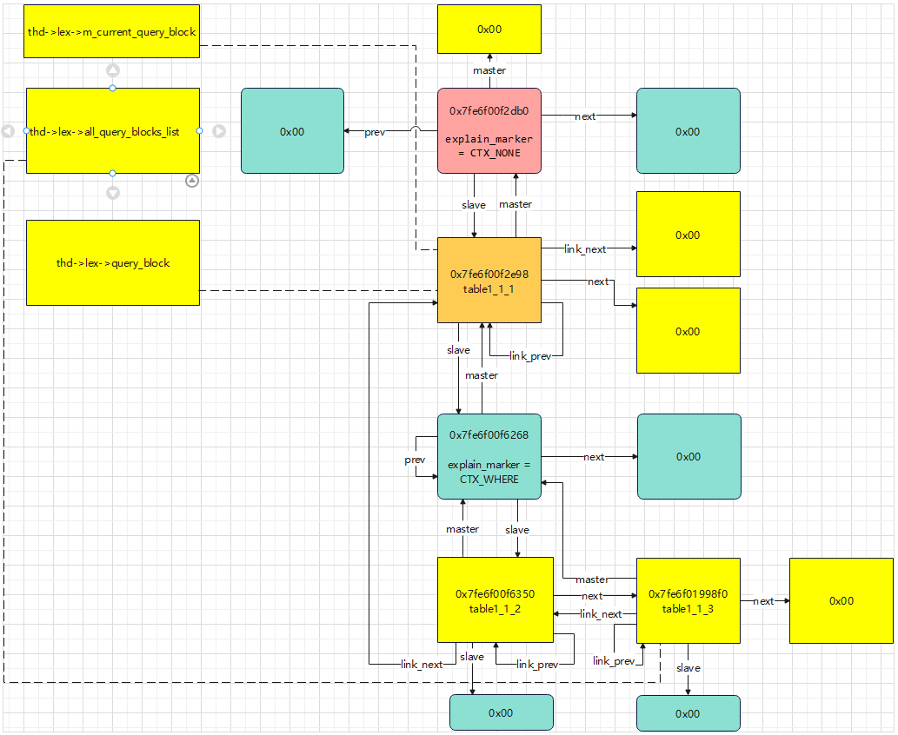
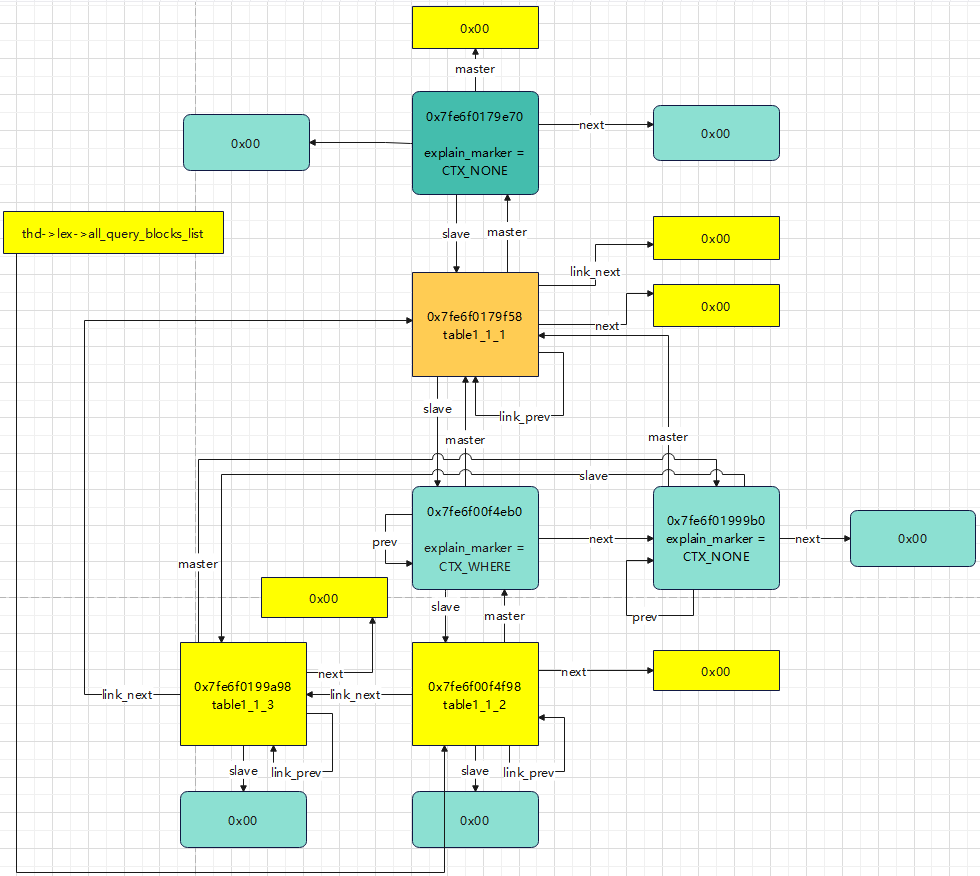

- [对应的 SQL](#对应的-sql)
  - [对应的结构图](#对应的结构图)
  - [相关脚本](#相关脚本)
- [对应的 SQL](#对应的-sql-1)
  - [对应的结构图](#对应的结构图-1)
  - [相关脚本](#相关脚本-1)

# 对应的 SQL
```sql
select * from table1_1_1 where id in ( select id from table1_1_2 union select id from table1_1_3 );
```
## 对应的结构图


## 相关脚本
```cpp
-exec set $expr=thd->lex->unit
-exec p {$expr,$expr->next,*$expr->prev,$expr->master,$expr->slave,$expr->m_query_term}

-exec set $block=thd->lex->query_block
-exec p {$block,$block->next,$block->master,$block->slave,$block->link_next,*$block->link_prev}
```

```cpp
-exec set $expr=thd->lex->unit
-exec p {$expr,$expr->next,$expr->prev?*$expr->prev:$expr->prev,$expr->master,$expr->slave,$expr->m_query_term}
$53 = {0x7fe6f00f2db0, 0x0, 0x0, 0x0, 0x7fe6f00f2e98, 0x7fe6f00f2e98}

-exec set $block=thd->lex->query_block
-exec p {$block,$block->next,$block->master,$block->slave,$block->link_next,$block->link_prev?*$block->link_prev:$block->link_prev}
$56 = {0x7fe6f00f2e98, 0x0, 0x7fe6f00f2db0, 0x7fe6f00f6268, 0x0, 0x7fe6f00f2e98}
-exec p $block->m_table_list->first->table_name
$66 = 0x7fe6f00f4048 "table1_1_1"

-exec set $expr=thd->lex->unit->slave->slave
-exec p {$expr,$expr->next,$expr->prev?*$expr->prev:$expr->prev,$expr->master,$expr->slave,$expr->m_query_term}
$57 = {0x7fe6f00f6268, 0x0, 0x7fe6f00f6268, 0x7fe6f00f2e98, 0x7fe6f00f6350, 0x7fe6f019b090}

-exec set $block=thd->lex->query_block->slave->slave
-exec p {$block,$block->next,$block->master,$block->slave,$block->link_next,$block->link_prev?*$block->link_prev:$block->link_prev}
$62 = {0x7fe6f00f6350, 0x7fe6f01998f0, 0x7fe6f00f6268, 0x0, 0x7fe6f00f2e98, 0x7fe6f00f6350}
-exec p $block->m_table_list->first->table_name
$65 = 0x7fe6f00f4048 "table1_1_2"

-exec set $block=thd->lex->query_block->slave->slave->next
-exec p {$block,$block->next,$block->master,$block->slave,$block->link_next,$block->link_prev?*$block->link_prev:$block->link_prev}
$63 = {0x7fe6f01998f0, 0x0, 0x7fe6f00f6268, 0x0, 0x7fe6f00f6350, 0x7fe6f01998f0}
-exec p $block->m_table_list->first->table_name
$64 = 0x7fe6f00f4840 "table1_1_3"
```

# 对应的 SQL
```sql
select id,(select name from table1_1_3 where id=table1_1_1.id) from table1_1_1 where id in ( select id from table1_1_2);
```
## 对应的结构图


## 相关脚本
```cpp
-exec set $expr=thd->lex->unit
-exec p {$expr,$expr->next,$expr->prev?*$expr->prev:$expr->prev,$expr->master,$expr->slave,$expr->m_query_term}
$66 = {0x7fe6f0179e70, 0x0, 0x0, 0x0, 0x7fe6f0179f58, 0x7fe6f0179f58}


-exec set $block=thd->lex->query_block
-exec p {$block,$block->next,$block->master,$block->slave,$block->link_next,$block->link_prev?*$block->link_prev:$block->link_prev}
$67 = {0x7fe6f0179f58, 0x0, 0x7fe6f0179e70, 0x7fe6f00f4eb0, 0x0, 0x7fe6f0179f58}
-exec p $block->m_table_list->first->table_name
$69 = 0x7fe6f017b6a8"table1_1_1"


-exec set $expr=thd->lex->query_block->slave
-exec p {$expr,$expr->next,$expr->prev?*$expr->prev:$expr->prev,$expr->master,$expr->slave,$expr->m_query_term}
$68 = {0x7fe6f00f4eb0, 0x7fe6f01999b0, 0x7fe6f00f4eb0, 0x7fe6f0179f58, 0x7fe6f00f4f98, 0x7fe6f00f4f98}


-exec p {$block,$block->next,$block->master,$block->slave,$block->link_next,$block->link_prev?*$block->link_prev:$block->link_prev}
$70 = {0x7fe6f00f4f98, 0x0, 0x7fe6f00f4eb0, 0x0, 0x7fe6f0199a98, 0x7fe6f00f4f98}
-exec p $block->m_table_list->first->table_name
$71 = 0x7fe6f0198e70"table1_1_2"


-exec set $block=thd->lex->query_block->slave->slave->link_next
-exec p {$block,$block->next,$block->master,$block->slave,$block->link_next,$block->link_prev?*$block->link_prev:$block->link_prev}
$72 = {0x7fe6f0199a98, 0x0, 0x7fe6f01999b0, 0x0, 0x7fe6f0179f58, 0x7fe6f0199a98}
-exec p $block->m_table_list->first->table_name
$73 = 0x7fe6f017af40 "table1_1_3"


-exec set $expr=thd->lex->query_block->slave->next
-exec p {$expr,$expr->next,$expr->prev?*$expr->prev:$expr->prev,$expr->master,$expr->slave,$expr->m_query_term}
$74 = {0x7fe6f01999b0, 0x0, 0x7fe6f01999b0, 0x7fe6f0179f58, 0x7fe6f0199a98, 0x7fe6f0199a98}

-exec p {thd->lex->unit, thd->lex->query_block, thd->lex->all_query_blocks_list, thd->lex->m_current_query_block}
$78 = {0x7fe6f0179e70, 0x7fe6f0179f58, 0x7fe6f00f4f98, 0x7fe6f0179f58}
```