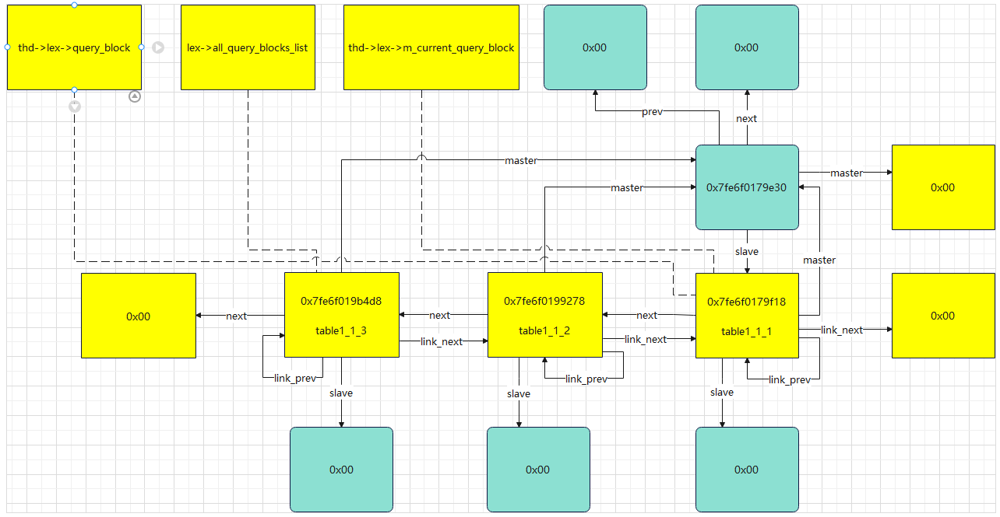

- [对应 SQL](#对应-sql)
- [查看 Query\_expression 和 Query\_block](#查看-query_expression-和-query_block)
- [相关查看脚本](#相关查看脚本)
  - [对应结构体](#对应结构体)
  - [相关脚本](#相关脚本)

# 对应 SQL
```sql
select * from table1_1_1 union select * from table1_1_2 union select * from table1_1_3;
```
# 查看 Query_expression 和 Query_block


# 相关查看脚本
## 对应结构体
```cpp
class Query_block {
  private:
    Query_block *next;  // 下一个查询块
    Query_expression *master;  // 主查询表达式
    Query_expression *slave;  // 从查询表达式
    Query_block *link_next;  // 下一个连接查询块
    Query_block **link_prev;  // 上一个连接查询块
    ……
}

class Query_expression {
  private:
    Query_expression *next;  // 下一个查询表达式
    Query_expression **prev;  // 前一个查询表达式的指针
    Query_block *master;  // 主查询块
    Query_block *slave;  // 从查询块
    Query_term *m_query_term;  // 查询项
    ……
}
```
## 相关脚本
```sh
# 查看 thd->lex
-exec p {thd->lex->unit, thd->lex->query_block, thd->lex->all_query_blocks_list, thd->lex->m_current_query_block}
$9 = {0x7fe6f0179e30, 0x7fe6f0179f18, 0x7fe6f019b4d8, 0x7fe6f0179f18}

# 查看 thd->lex->unit
-exec p {thd->lex->unit->next,thd->lex->unit->prev,thd->lex->unit->master,thd->lex->unit->slave,thd->lex->unit->m_query_term}
$10 = {0x0, 0x0, 0x0, 0x7fe6f0179f18, 0x7fe6f019cb08}

# 查看 thd->lex->query_block
-exec p {thd->lex->query_block->next,thd->lex->query_block->master,thd->lex->query_block->slave,thd->lex->query_block->link_next,*thd->lex->query_block->link_prev}
$11 = {0x7fe6f0199278, 0x7fe6f0179e30, 0x0, 0x0, 0x7fe6f0179f18}

# 查看 thd->lex->all_query_blocks_list
-exec p {thd->lex->all_query_blocks_list->next,thd->lex->all_query_blocks_list->master,thd->lex->all_query_blocks_list->slave,thd->lex->all_query_blocks_list->link_next,*thd->lex->all_query_blocks_list->link_prev}
$12 = {0x0, 0x7fe6f0179e30, 0x0, 0x7fe6f0199278, 0x7fe6f019b4d8}

# 打印所有表名
-exec p thd->lex->query_block->m_table_list->first->table_name
$6 = 0x7fe6f017a888 "table1_1_1"
-exec p thd->lex->query_block->next->m_table_list->first->table_name
$7 = 0x7fe6f017b030 "table1_1_2"
-exec p thd->lex->query_block->next->next->m_table_list->first->table_name
$8 = 0x7fe6f017b830 "table1_1_3"
```

