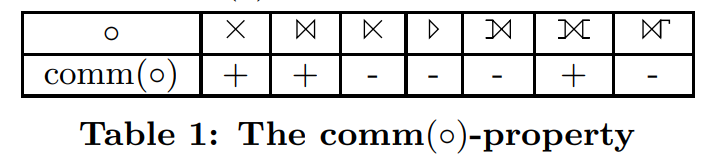

- [摘要](#摘要)
- [1. 引言](#1-引言)
- [2. 初步概念](#2-初步概念)
- [3. 核心搜索空间](#3-核心搜索空间)
  - [3.1 可重排序性](#31-可重排序性)

关于核心搜索空间的正确和完整枚举

# 摘要
重新排序连接（例如，外连接，反连接）需要一些注意，因为并非所有的重新排序都是有效的。 为了防止无效的计划，文献中描述了两种方法。我们证明这两种方法仍然会产生无效的计划。 我们提出了三种冲突检测器。这三种办法都是：
-  (1）正确的，即防止无效的计划
- （2）比以前的（有错误的）方法更容易理解和实现
- （3）更灵活，因为不再需要所有谓词必须拒绝空值的限制
- （4）可扩展的，即易于添加新的运算符

此外，我们的三种方法中的最后一种是完整的，即它允许在核心搜索空间内生成所有有效的计划。

# 1. 引言
对于提供SQL支持的数据库管理系统(DBMS)，查询优化器是至关重要的。查询的声明性质允许其转换为许多等效的计划。从备选方案中选择一个低成本计划的过程被称为查询优化，或者更具体地说，生成计划。计划的成本的关键在于其连接操作的顺序，因为具有不同连接顺序的计划的运行时间可以相差几个数量级。

在设计计划生成器时，有两种适合找到最优连接顺序的方法：通过动态规划(DP)的自下而上的连接枚举和通过记忆化的自上而下的连接枚举。这两种方法面临同样的挑战：考虑的计划必须是有效的，即产生正确的结果。如果只考虑内连接，这很简单，因为它们是可交换和可结合的。因此，每个计划都是一个有效的计划。

如果考虑更多的运算符，如左外连接、全外连接、反连接、半连接和组连接，那么所有的计划都不再有效。事实上，在文献中，我们只找到了两种防止在基于DP的计划生成器中产生无效计划的方法。第一种方法(NEL/EEL)是由Rao、Lindsay、Lohman、Pirahesh和Simmen提出的。他们的冲突检测器允许连接、左外连接和反连接。第二种方法(SES/TES)是由Moerkotte和Neumann提出的。正如我们将在第7和8节中展示的，这两种方法都会生成无效的计划。这使得计划生成器的实现者对于基于DP的计划生成器没有（正确的）选择（参见第8节）。
我们发现这种情况无法忍受，决定对此进行一些研究。在这里，我们将展示我们的结果。亮点将是冲突检测器CD-C，它是：
1. 正确的
2. 完整的
3. 易于理解和实施
4. 灵活的
5. 可扩展的

"正确"意味着只生成有效的计划。"完整"意味着在核心搜索空间（在第3节中定义）中生成所有有效的计划。显然，易于理解和实施是一个很好的特性。CD-C在两个方面具有灵活性。首先，NEL/EEL和SES/TES都要求所有的连接谓词拒绝空值。在我们的方法中，我们消除了这个限制。因此，在一个查询中，一些谓词可能拒绝空值，而其他谓词则不会。这很重要，因为SQL允许谓词不拒绝空值（例如，IS NOT DISTINCT FROM）。其次，我们允许（就像NEL/EEL和SES/TES一样）复杂的连接谓词引用超过两个关系。可扩展性使冲突检测器能够扩大其考虑的二元算子的范围。我们通过表驱动的方法实现可扩展性：几个图表编码了运算符的属性，CD-C简单地探索这些表来检测冲突并防止无效的计划。

本文的其余部分组织如下。第2节定义了一些初步概念。第3节定义了核心搜索空间。为了做到这一点，定义了二元算子的基本属性。第4节明确地陈述了我们的论文的目标，并使用众所周知的DPsub算法来说明如何将冲突检测器集成到基于DP的计划生成器中。第5节介绍了三种冲突检测器。每一种都是正确的，最后一种是完整的。第7节包含实验结果。第8节讨论了相关工作，并展示了由NEL/EEL和SES/TES生成的无效计划。第9节对本文进行了总结。

# 2. 初步概念
本节包含基本定义。

**LOP**   
表示我们在计划中允许的逻辑二元运算符的集合：连接 ( ⨝ )，全外连接 ( ⟗ )，左外连接 ( ⟕ )，左反连接 ( ▷ )，左半连接 ( ⋉ )。在第6节中，我们还考虑交叉积 ( ✕ )。

对于谓词的 **`Null Rejecting`** 定义如下 ：  
定义1. 如果一个谓词对于一组属性 A，在所有 A 中的属性都为空的每个元组上评估为假或未知，则该谓词被称为 Null Rejecting。
举例：假设 A={R.a, S.b, S.c, T.d}，那么这个 SQL 条件： `R.a is not null and S.b is not null and S.c is not null and T.d is not null` 就是 `Null Rejecting`。

自由属性和表 **`𝓕(·), 𝓕`$_T$`(·)`**  
通常，我们用 `𝓐(e)` 表示由某个表达式 e 提供的属性/变量的集合，用 `𝓕(e)` 表示某个表达式 e 中的自由属性/变量的集合。例如，如果 p ≡ R.a + S.b = S.c + T.d，那么 𝓕(p) = {R.a, S.b, S.c, T.d}。

表的集合 (**`𝓣`**)，和子树算子 (**`STO`**)  
对于一组属性 A，𝓣(A) 表示这些属性所属的表的集合。我们用 `𝓕`$_T$`(e)` 表示 `𝓣(𝓕(e))` 的缩写。对于 p，我们有 𝓣(𝓕(e)) = {R, S, T}。设 ⚬ 是初始算子树中的一个算子。我们用 $left(⚬)$ ($right(⚬)$) 表示其左（右）子节点。$STO(⚬)$ 表示包含在以 $⚬$ 为根的算子子树中的算子。$𝓣(⚬)$ 表示包含在以 $⚬$ 为根的子树中的表的集合。

**`NEL/SES`** 模型生产者/消费者约束  
syntactic eligibility sets（简称 SES）。SES 跟算子紧密关联，它包含在应用算子之前必须存在的表的集合。对于形如 $plan(S_1)$ $⚬$ $plan(S_2)$ 的计划，如果 $SES(⚬) ⊆ S1 ∪ S2$ 成立，则满足生产者/消费者约束。SES 也被称为 NEL 。对于非依赖运算符，它们的 SES 等于它们的谓词引用的属性集。对于上面的 p，我们有 $SES(⚬_p) = \{R, S, T\}$。

**`Degenerate Predicates`**   
如果一个谓词与二元算子相关，但它并没有同时引用算子两侧的表，那么这个谓词就被称为 Degenerate Predicates。  
定义2. 设 p 是与二元算子 $⚬$ 关联的谓词，𝓕$_T$(p) 是 p 引用的表。那么，如果 𝓣(left($⚬$)) $∩$ 𝓕$_T$(p) = $\emptyset$ $\lor$ 𝓣(right($⚬$)) $∩$ 𝓕$_T$(p) = $\emptyset$ 成立，则称 p 为 Degenerate Predicates。  
例如，在 $⨝_{true}$ 中，谓词 true 是退化的（比如 R inner join S on 1=1）。此外，该表达式等价于一个交叉积。由于 Degenerate Predicates 是棘手的，我们假设在第6节之前都不会出现 Degenerate Predicates（因此，也不会出现交叉积）。在第6节中，我们放宽了这个假设。此外，在介绍 CALC$_{SES}$ 和 CD-C 时，我们已经对 Degenerate Predicates 和交叉积进行了一些处理。

#  3. 核心搜索空间
本节定义了核心搜索空间。它由一组转换规则定义，这些规则寻找给定初始计划的所有有效替代方案。第3.1节介绍了这些转换规则，第3.2节定义了核心搜索空间。

## 3.1 可重排序性
传统的连接排序方法只重新排序内连接，而不重新排序其他二元算子（例如，外连接，反连接）。由于内连接是可交换和可结合的，所有的计划都是有效的，没有生成无效计划的危险。真正的计划生成器必须重新排序的不仅仅是普通的内连接（例如 ⋉，▷，⟕，⟗）。为了描述这些算子的可重排序性质，我们需要将可交换性和可集合性的概念扩展到算子对。很容易看出，这些运算符中有些是可交换的，而有些则不是（见表1）。如果某个二元算子 $⚬$ 是可交换的，我们用 $comm(⚬)$ 表示。

结合性稍微复杂一点。如果两个算子 $⚬^a$ 和 $⚬^b$ 满足结合性的，则它们满足以下等价关系：  
$(e_1 \space ⚬^a_{12} \space e_2) \space ⚬^b_{23} \space e_3 ≡ e_1 \space ⚬^a_{12} \space (e_2 \space ⚬^b_{23} \space e_3)$  
在这里，我们使用以下约定。如果算子不带谓词或其他表达式，那么它们的下标是无关紧要的，可以忽略。如果一个算子有一个谓词，那么 ij 表示它引用的属性最多来自 $e_i$ 和 $e_j$。因此，（对于 $1 ≤ i, j ≤ 3, i ≠ j$）这也表示 F(e) ∩ ek = ∅ 对于 1 ≤ k ≤ 3 和 k ∉ {i, j}。这确保了等价性在等号的两边都正确地键入。例如，◦a12 的谓词访问来自 e1 和 e2 的表，但不访问 e3。注意，◦a12 可能带有一个复杂的谓词，引用来自 e1 和 e2 的多个表。我们将在下一小节中看到一个例子。如果某个 ◦a123 引用了所有三个表达式 ei 中的表，那么 Eqv. 1 左边的表达式将是无效的，右边的表达式将是有效的，但不能转换为左边的表达式。对于冲突检测来说，访问超过两个关系的复杂谓词并不是挑战，它们只是扩大了在评估复杂谓词之前必须存在的表的集合。复杂谓词的真正挑战是有效地枚举现在更受限制的搜索空间（参见第6.1节）。

如果对于两个运算符 ◦a 和 ◦b，Eqv. 1 成立，我们用 assoc(◦a, ◦b) 表示这一点。重要的是要注意，assoc 不是对称的。因此，运算符的顺序（即，(◦a, ◦b) vs. (◦b, ◦a)）是重要的。因此，我们将 assoc 中的顺序与 Eqv. 1 的语法模式绑定。它必须与等号左边的顺序相同。这意味着，左关联必须在等号的左边，因此，右关联在等号的右边。

如果 comm(◦a) 和 comm(◦b) 成立，那么 assoc(◦a, ◦b) 暗示 assoc(◦b, ◦a)，反之亦然，如下所示： (e1 ◦a12 e2) ◦b23 e3 ≡ e1 ◦a12 (e2 ◦b23 e3) assoc(◦a, ◦b) ≡ (e2 ◦b23 e3) ◦a12 e1 comm(◦a) ≡ (e3 ◦b23 e2) ◦a12 e1 comm(◦b) ≡ e3 ◦b23 (e2 ◦a12 e1) assoc(◦b, ◦a) ≡ (e2 ◦a12 e1) ◦b23 e3 comm(◦b) ≡ (e1 ◦a12 e2) ◦b23 e3 comm(◦a)。

表2总结了关联性属性。小心，因为 assoc 不是对称的，◦a 必须在行中查找，◦b 在列中查找，反之亦然。表2中带有脚注的条目表示 assoc(◦a, ◦b) 只有在谓词拒绝空值时才成立（见定义1）。有关更多详细信息，请参阅表2底部的相应脚注。希望这个翻译对你有所帮助！ user 请你打印出这个表格中的所有符号 assistant to=describe_image.AI