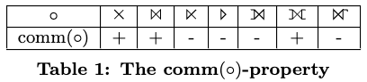
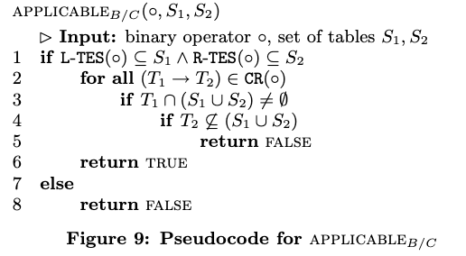

- [摘要](#摘要)
- [1. 引言](#1-引言)
- [2. 初步概念](#2-初步概念)
  - [2.1 算子、谓词、表达式](#21-算子谓词表达式)
  - [2.2 LOP](#22-lop)
  - [2.3 Null Rejecting](#23-null-rejecting)
  - [2.4 自由属性和表](#24-自由属性和表)
  - [2.5 表的集合 (T)，和子树算子 (STO)](#25-表的集合-t和子树算子-sto)
  - [2.6 NEL/SES 模型生产者/消费者约束](#26-nelses-模型生产者消费者约束)
  - [2.7 Degenerate Predicates](#27-degenerate-predicates)
- [3. 核心搜索空间](#3-核心搜索空间)
  - [3.1 可重排序性](#31-可重排序性)
  - [3.2 核心搜索空间的定义](#32-核心搜索空间的定义)
- [4. 论文的目标](#4-论文的目标)
- [5. 冲突检测](#5-冲突检测)
  - [5.1 概述](#51-概述)
  - [5.2 CD-A 方法](#52-cd-a-方法)
  - [5.3 CD-B 方法](#53-cd-b-方法)


关于核心搜索空间的正确和完整枚举


# 摘要
重新排序连接（例如，外连接，反连接）需要一些注意，因为并非所有的重新排序都是有效的。 为了防止无效的计划，文献中描述了两种方法。我们证明这两种方法仍然会产生无效的计划。 我们提出了三种冲突检测器。这三种办法都是：
- （1）正确的，即防止无效的计划
- （2）比以前的（有错误的）方法更容易理解和实现
- （3）更灵活，因为不再需要所有谓词必须拒绝空值的限制
- （4）可扩展的，即易于添加新的运算符

此外，我们的三种方法中的最后一种是完整的，即它允许在核心搜索空间内生成所有有效的计划。

# 1. 引言
对于提供SQL支持的数据库管理系统(DBMS)，查询优化器是至关重要的。查询的声明性质允许其转换为许多等效的计划。从备选方案中选择一个低成本计划的过程被称为查询优化，或者更具体地说，生成计划。计划的成本的关键在于其连接操作的顺序，因为具有不同连接顺序的计划的运行时间可以相差几个数量级。

在设计计划生成器时，有两种适合找到最优连接顺序的方法：通过动态规划(DP)的自下而上的连接枚举和通过记忆化的自上而下的连接枚举。这两种方法面临同样的挑战：考虑的计划必须是有效的，即产生正确的结果。如果只考虑内连接，这很简单，因为它们是可交换和可结合的。因此，每个计划都是一个有效的计划。

如果考虑更多的运算符，如左外连接、全外连接、反连接、半连接和组连接，那么所有的计划都不再有效。事实上，在文献中，我们只找到了两种防止在基于DP的计划生成器中产生无效计划的方法。第一种方法(NEL/EEL)是由Rao、Lindsay、Lohman、Pirahesh和Simmen提出的。他们的冲突检测器允许连接、左外连接和反连接。第二种方法(SES/TES)是由Moerkotte和Neumann提出的。正如我们将在第7和8节中展示的，这两种方法都会生成无效的计划。这使得计划生成器的实现者对于基于DP的计划生成器没有（正确的）选择（参见第8节）。
我们发现这种情况无法忍受，决定对此进行一些研究。在这里，我们将展示我们的结果。亮点将是冲突检测器CD-C，它是：
1. 正确的
2. 完整的
3. 易于理解和实施
4. 灵活的
5. 可扩展的

"正确"意味着只生成有效的计划。"完整"意味着在核心搜索空间（在第3节中定义）中生成所有有效的计划。显然，易于理解和实施是一个很好的特性。CD-C在两个方面具有灵活性。首先，NEL/EEL和SES/TES都要求所有的连接谓词拒绝空值。在我们的方法中，我们消除了这个限制。因此，在一个查询中，一些谓词可能拒绝空值，而其他谓词则不会。这很重要，因为SQL允许谓词不拒绝空值（例如，IS NOT DISTINCT FROM）。其次，我们允许（就像NEL/EEL和SES/TES一样）复杂的连接谓词引用超过两个关系。可扩展性使冲突检测器能够扩大其考虑的二元算子的范围。我们通过表驱动的方法实现可扩展性：几个图表编码了运算符的属性，CD-C简单地探索这些表来检测冲突并防止无效的计划。

本文的其余部分组织如下。第2节定义了一些初步概念。第3节定义了核心搜索空间。为了做到这一点，定义了二元算子的基本属性。第4节明确地陈述了我们的论文的目标，并使用众所周知的DPsub算法来说明如何将冲突检测器集成到基于DP的计划生成器中。第5节介绍了三种冲突检测器。每一种都是正确的，最后一种是完整的。第7节包含实验结果。第8节讨论了相关工作，并展示了由NEL/EEL和SES/TES生成的无效计划。第9节对本文进行了总结。

# 2. 初步概念
本节包含基本定义。

## 2.1 算子、谓词、表达式
翻译者帮助大家理解：举例：
```sql
SELECT S.Name, S.Age * 2 AS DoubleAge, C.CourseName 
FROM Students S 
JOIN Courses C ON S.CourseID = C.CourseID 
WHERE S.Age > 18;
```
在这条SQL语句中：  
1. **算子**：SELECT、FROM 和 JOIN 是算子，它们分别用于选择数据、指定数据来源和连接两个表。
2. **谓词**：S.Age > 18 和 S.CourseID = C.CourseID 是谓词，它们分别在 WHERE 和 ON 子句中用于过滤数据和指定连接条件。
3. **表达式**：S.Age * 2 是一个表达式，它在 SELECT 子句中用于计算每个学生年龄的两倍。

表达式（Expression）和谓词（Predicate）都是用来描述某种条件或计算的语句。它们的主要区别在于，表达式通常有一个返回值，而谓词则用于表示一个返回真或假的条件。

## 2.2 LOP
表示我们在计划中允许的逻辑二元运算符的集合：连接 ( ⨝ )，全外连接 ( ⟗ )，左外连接 ( ⟕ )，左反连接 ( ▷ )，左半连接 ( ⋉ )。在第6节中，我们还考虑交叉积 ( ✕ )。  
举例：
```sql
-- 左半连接
SELECT A.学号, A.姓名, A.籍贯, A.年龄 FROM student A WHERE EXISTS (SELECT 1 FROM major B WHERE A.学号 = B.学号);
-- 连接
select * from A inner join B on A.id=B.id;
-- 全外连接
select * from A full join B on A.id=B.id;
-- 左外连接
select * from A left join B on A.id=B.id;
-- 左反连接
SELECT A.学号, A.姓名, A.籍贯, A.年龄 FROM student A WHERE NOT EXISTS (SELECT 1 FROM major B WHERE A.学号 = B.学号);
```
## 2.3 Null Rejecting
对于谓词的 **`Null Rejecting`** 定义如下 ：  
定义1. 如果一个谓词对于一组属性 A，在所有 A 中的属性都为空的每个元组上评估为假或未知，则该谓词被称为 Null Rejecting。
举例：假设 A={R.a, S.b, S.c, T.d}，那么这个 SQL 条件： `R.a is not null and S.b is not null and S.c is not null and T.d is not null` 就是 `Null Rejecting`。

## 2.4 自由属性和表
自由属性 $F(·)$ 和表 $F_T(·)$。  
通常，我们用 $A(e)$ 表示由某个表达式 $e$ 提供的属性/变量的集合，用 $F(e)$ 表示某个表达式 $e$ 中的自由属性/变量的集合。例如，如果 p ≡ R.a + S.b = S.c + T.d，那么 $F(p)$ = {R.a, S.b, S.c, T.d}。

## 2.5 表的集合 (T)，和子树算子 (STO)  
对于一组属性 $A$，$T(A)$ 表示这些属性所属的表的集合。我们用 $F_T(e)$ 表示 $T(F(e))$ 的缩写。对于 $p$，我们有 $T(F(e)) = \{R, S, T\}$。设 $\circ$ 是初始算子树中的一个算子。我们用 $left(\circ)$ ($right(\circ)$) 表示其左（右）子节点。$STO(\circ)$ 表示包含在以 $\circ$ 为根的算子子树中的算子。$T(\circ)$ 表示包含在以 $\circ$ 为根的子树中的表的集合。

## 2.6 NEL/SES 模型生产者/消费者约束  
syntactic eligibility sets（简称 $SES$）。$SES$ 跟算子紧密关联，它包含在应用算子之前必须存在的表的集合。对于形如 $plan(S_1) \circ plan(S_2)$ 的计划，如果 $SES(\circ) ⊆ S1 ∪ S2$ 成立，则满足生产者/消费者约束。$SES$ 也被称为 $NEL$ 。对于非依赖算子，它们的 $SES$ 等于它们的谓词引用的属性集。对于上面的 $p$，我们有 $SES(\circ_p) = \{R, S, T\}$。

## 2.7 Degenerate Predicates
如果一个谓词与二元算子相关，但它并没有同时引用算子两侧的表，那么这个谓词就被称为 Degenerate Predicates。  
定义2. 设 $p$ 是与二元算子 $\circ$ 关联的谓词，$F_T(p)$ 是 $p$ 引用的表。那么，如果 $T(left(\circ)) ∩ F_T(p) = \emptyset \space \lor T(right(\circ)) ∩ F_T(p) = \emptyset$ 成立，则称 p 为 Degenerate Predicates。  
例如，在 $⨝_{true}$ 中，谓词 $true$ 是退化的（比如 R inner join S on 1=1）。此外，该表达式等价于一个交叉积。由于 Degenerate Predicates 是棘手的，我们假设在第6节之前都不会出现 Degenerate Predicates（因此，也不会出现交叉积）。在第6节中，我们放宽了这个假设。此外，在介绍 $CALC_{SES}$ 和 $CD{-}C$ 时，我们已经对 Degenerate Predicates 和交叉积进行了一些处理。

#  3. 核心搜索空间
本节定义了核心搜索空间。它由一组转换规则定义，这些规则寻找给定初始计划的所有有效替代方案。第3.1节介绍了这些转换规则，第3.2节定义了核心搜索空间。

## 3.1 可重排序性
传统的连接排序方法只重新排序内连接，而不重新排序其他二元算子（例如，外连接，反连接）。由于内连接是可交换和可结合的，所有的计划都是有效的，没有生成无效计划的危险。真正的计划生成器必须重新排序的不仅仅是普通的内连接（例如 ⋉，▷，⟕，⟗）。为了描述这些算子的可重排序性质，我们需要将可交换律和可集合性的概念扩展到算子对。很容易看出，这些运算符中有些是可交换的，而有些则不是（见表1）。如果某个二元算子 $\circ$ 是可交换的，我们用 $comm(\circ)$ 表示。



结合律稍微复杂一点。如果两个算子 $\circ^a$ 和 $\circ^b$ 满足结合律的，则它们满足以下等价关系：  
$$(e_1 \circ^a_{12} e_2) \circ^b_{23} e_3 ≡ e_1 \circ^a_{12} (e_2  \circ^b_{23} e_3)      \quad \quad \quad Eqv.1$$ 

**翻译者帮助大家理解：这里的 $e_1, e_2, e_3$ 可以是实体的表，也可以是查询结果，这也表明他们3个相互之间的交集为空（理解下一段话的时候需要用到）。$\circ^a, \circ^b$ 中可能包含谓词。**

在这里，我们使用以下约定。如果算子不带谓词或其他表达式，那么它们的下标是无关紧要的，可以忽略。如果一个算子有一个谓词，那么 ij 表示它引用的属性最多来自 $e_i$ 和 $e_j$。因此，（对于 $1 ≤ i, j ≤ 3, i ≠ j; 1 ≤ k ≤ 3$ 和 $k ∉ \{i, j\}$）这也表示 $F(e) ∩ e_k = \emptyset$ 

**翻译者帮助大家理解：上面的数学表达式太过于抽象概括、难以通俗易懂，它需要特别注意，比如 $e$≡(select id from a,b) as t)，那么$F(e)=t$，而不是$F(e)=\{id,a,b,t\}$。**

这确保了恒等式两边的等价性。例如，$\circ^a_{12}$ 的谓词访问来自 $e_1$ 和 $e_2$ 的表，但不访问 $e_3$。注意，$\circ^a_{12}$ 可能带有一个复杂的谓词，引用来自 $e_1$ 和 $e_2$ 的多个表。我们将在下一小节中看到一个例子。如果某个 $\circ^a_{123}$ 引用了三个表达式 $e_i$ 中所有的表，那么 $Eqv.1$ 左边的表达式将是无效的，右边的表达式将是有效的，但不能转换为左边的表达式。对于冲突检测来说，访问超过两个关系的复杂谓词并不是挑战，它们只是扩大了在评估复杂谓词之前必须存在的表的集合。复杂谓词的真正挑战是有效地枚举搜索空间（参见第6.1节）。

如果对于两个算子 $\circ^a$ 和 $\circ^b$，$Eqv.1$ 成立，我们用 $assoc(\circ^a, \circ^b)$ 表示。要注意，$assoc$ 不是对称的。因此，算子的顺序（即 $(\circ^a, \circ^b)$ vs. $(\circ^b, \circ^a)$ 是需要注意的。因此，我们将 $assoc$ 中的顺序与 $Eqv.1$ 的语法模式绑定，它必须与等号左边的顺序相同。这意味着，左结合必须在等号的左边，右结合必须在等号的右边。

如果 $comm(\circ^a)$ 和 $comm(\circ^b)$ 成立，那么 $assoc(\circ^a, \circ^b)$ 可以推理出 $assoc(\circ^b, \circ^a)$，反之亦然，如下所示： 

$$
\begin{align*}
(e_1 \circ^a_{12} e_2) \circ^b_{23} e_3 
\equiv e_1 \circ^a_{12} (e_2 \circ^b_{23} e_3)\quad \text{assoc}(\circ^{a}, \circ^{b}) \\ 
\equiv (e_2 \circ^b_{23} e_3) \circ^a_{12} e_1 \quad \text{comm}(\circ^{a}) \quad \\ 
\equiv (e_3 \circ^b_{23} e_2) \circ^a_{12} e_1 \quad \text{comm}(\circ^{b}) \quad \\ 
\equiv e_3 \circ^b_{23} (e_2 \circ^a_{12} e_1) \quad \text{assoc}(\circ^{b}, \circ^{a}) \\ 
\equiv (e_2 \circ^a_{12} e_1) \circ^b_{23} e_3 \quad \text{comm}(\circ^{b}) \quad\\
\equiv (e_1 \circ^a_{12} e_2) \circ^b_{23} e_3 \quad \text{comm}(\circ^{a}) \quad
\end{align*}
$$

表2总结了结合律的属性。因为 assoc 不是对称的，$⚬^a$ 必须在行中查找，$⚬^b$ 在列中查找。表2中带有脚注的表格表示 assoc($⚬^a$, $⚬^b$) 只有在谓词 Null Rejecting 时才成立（见定义1）。更多详细信息，请参阅表2底部的相应脚注。


我们研究工作完成了吗？并没有！考虑半连接的等价性：
$$(e_1⋉_{12}e_2)⋉_{13}e_3 ≡ (e_1⋉_{13}e_3)⋉_{12}e_2$$
很容易看出，我们无法使用 ⋉ 的结合律和交换律从左侧的计划推导出右侧的计划：两者都不成立。因此，我们需要一些新的东西。

我们定义左结合律（简称 $l{-}assocm$）如下：
$$
\begin{align*}
(e_1 \circ^a_{12} e_2) \circ^b_{13} e_3 
\equiv (e_1 \circ^b_{13} e_3) \circ^a_{12} e_2
\end{align*}
\quad \quad \quad Eqv.2
$$
我们用 $l{-}asscom(\circ^a, \circ^b)$ 表示 $Eqv.2$ 中的 $\circ^a$ 和 $\circ^b$。

类似地，我们可以定义右结合律（$r{-}assocm$）：
$$
\begin{align*}
e_1 \circ^a_{13} (e_2 \circ^b_{23} e_3) 
\equiv e_2 \circ^b_{23} (e_1 \circ^a_{13} e_3) 
\end{align*}
\quad \quad \quad Eqv.3
$$
首先，注意到 $l{-}assocm $和 $r{-}assocm$ 是对称的，即
$$l{-}assocm(\circ^a , \circ^b ) \leftrightarrow l{-}asscom(\circ^b , \circ^a )$$
$$r{-}assocm(\circ^a , \circ^b ) \leftrightarrow r{-}asscom(\circ^b , \circ^a )$$
以下等式
$$
\begin{align*}
(e_1 \circ^a_{12} e_2) \circ^b_{23} e_3 
\equiv (e_2 \circ^a_{12} e_1) \circ^b_{23} e_3 \quad \quad \quad \quad \quad if \space comm(\circ^a_{12}) \\
\equiv (e_2 \circ^b_{23} e_3) \circ^a_{12} e_1 \quad if \space l-asscom(\circ^a_{12} , \circ^b_{23}) \\

\equiv e_1 \circ^a_{12} (e_2 \circ^b_{23} e_3) \quad \quad \quad \quad \space \space \space if \space comm(\circ^a_{12}) \\
\equiv (e_1 \circ^a_{12} e_2) \circ^b_{23} e_3 \quad \quad \quad \space if \space assoc(\circ^a_{12} , \circ^b_{23}) \\
\end{align*}
$$
可以推出
$$ comm(\circ^a_{12}) , assoc(\circ^a_{12},\circ^b_{23})\Rightarrow l{-}asscom(\circ^a_{12},\circ^b_{23})$$
$$ comm(\circ^a_{12}) , l{-}asscom(\circ^a_{12},\circ^b_{23}) \Rightarrow assoc(\circ^a_{12},\circ^b_{23}) \quad \quad \quad \quad \space \space \space \space$$

因此，可从交换律和结合律推导出 $l{-}asscom$ 。同理，可以推断出：
$$ comm(\circ^b_{23}) , assoc(\circ^a_{12},\circ^b_{23})\Rightarrow r{-}asscom(\circ^a_{12},\circ^b_{23})$$
$$ comm(\circ^b_{23}) , r{-}asscom(\circ^a_{12},\circ^b_{23}) \Rightarrow assoc(\circ^a_{12},\circ^b_{23}) \quad \quad \quad \quad \space \space \space \space$$

表3总结了 $l{-}/r{-}asscom$ 的性质。带有脚注的表格要求谓词 Null Rejecting。


如果表1至3中的某个表格被标记为“-”，或者其脚注中的条件被违反，我们就会说这个转换存在冲突。冲突意味着应用相应的转换规则会生成无效的计划。

## 3.2 核心搜索空间的定义

通常，对于给定的输入查询，查询优化器会构建一个初始的算子树，然后基于计划生成器的转换规则，穷举所有的有效执行计划。

如果满足交换律、结合律、$l{-}asscom$ 或 $r{-}asscom$，这将产生相应的转换。除了交换律，这些都在图1中显示。所有的等价关系都可以从左到右和从右到左应用。**`我们定义给定初始计划的核心搜索空间为：通过对初始计划穷尽地应用这四种转换生成的计划集`**。

图2显示了一个更大的算子树。让我们考虑最顶层算子 $\circ^b$ 的几种可能的谓词。如果$P_b ≡ R_0.a + R_1.a + R_2.a + R_3.a = R_4.a * R_5.a$，那么由于所有的表都被引用了，所以不可能进行重新排序。如果$P_b ≡ R_2.a+R_3.a = R_4.a*R_5.a$，那么从语法角度来看，应用结合律是可能的，因为 $F(P_b) ⋂ T(e_1)$ 在我们的例子中变成了 $\{R_2,R_3,R_4,R_5\} ⋂ \{R_0,R_1\} = \emptyset$。尽管谓词很复杂，但它只引用了下面关于 $\circ^2$ 和 $\circ^3$ 的表，它们的子树对应图1中的 $e_2$ 和 $e_3$，因此我们写成 $\circ^b_{12}$。


显然，一个二元谓词，例如，$p_b ≡ R_0.a = R_5.a$，在生成最大的搜索空间时，很大概率会生成无效计划或遗漏有效的计划。这就是我们在第7节中将我们的讨论限制为二元谓词的原因。

看一下图1中显示的语法约束，我们可以观察出，对于非 Degenerate Predicates（见定义2），以下结果成立：

观察1. 非 Degenerate Predicates 的语法约束意味着
- (1) 结合律或 $l{-}asscom$ 可以应用于左嵌套，但不能同时应用
- (2) 结合律或 $r{-}asscom$ 可以应用于右嵌套，但不能同时应用

因此，非 Degenerate Predicates 简化了冲突的处理，因为我们只需要处理结合律或 $l/r{-}asscom$，而不需要同时处理。

图3是表达式 $(e_1 \circ^a_{12} e_2) \circ^b_{13} e_3$ 的核心搜索空间的一个例子。我们观察到，核心搜索空间中的任何表达式都可以:
1. 通过最多两次应用交换律，最多一次应用结合律、$l{-}asscom$ 或者 $r{-}asscom$，
2. 最后再最多应用两次交换律来达到。

交换律的应用总数可以限制为2。更具体地说，对计划中的每个算子应用一次交换律就足够了。


# 4. 论文的目标
本节讨论如何通过计划生成器寻找完整的核心搜索空间。

我们将简单的动态规划算法 DPsub [14] 扩展为一个叫做 DPsube 的算法。伪代码显示在图4中。作为输入，DPsube 接受n个关系的集合 $R = \{R_0, . . . , R_{n−1}\}$ 和包含 n - 1 个算子的算子集合 $O$，DPsube 必须应用这些算子来构建执行计划。首先，它为单个关系构建一个计划（伪代码第2行）。然后，它通过位向量来枚举关系的所有子集 $S$。对于每一个关系集合 $S$，DPsube 枚举 $S$ 所有的子集 $S_1$（第7行）和 $S_1$ 的补集 $S_2$ 的（第8行）。它们都必须是非空的。对于每一对 $(S_1 , S_2)$ ，所有在 $O$ 的中的算子 $\circ$ 通过调用 APPLICABLE 来测试其适用性（第10行）。如果算子是适用的，那么最好的计划 $P_1$ 对于 $S_1$ 和 $P_2$ 对于 $S2$ 就会从动态规划表（简称DP-table）中通过 BestPlan 回调并组合成 $S$ 的计划 $P_1 \circ P_2$（第11行）。然后计算这个计划的成本，如果这个计划比现有计划的成本更低，那么它就会被添加到 DP-table 中。注意，只有当一个算子是适用的，DPsube 也会考虑交换律。因此，如果 $comm(\circ)$（第12行）成立，那么计划 $P_2 \circ P_1$ 就会被构建和处理。论文的目标是为 APPLICABLE 提供不同的实现。

# 5. 冲突检测
## 5.1 概述
为了使我们的方法适应新的代数算子，我们采用了基于表格的方法。我们使用四个表格，这些表格包含了代数算子的属性。这些表格包含了表1、2和3的信息（后者包括两个表）。扩展我们的方法只需要扩展这些表格！

我们用三个步骤中开发我们的最终方法。在每个步骤中，我们都会介绍我们的冲突检测器CD-A、CD-B和CD-C。对于这些冲突检测器，我们提供了一个完整的解决方案，它包含三个组件：
1. 冲突的表示
2. 一个冲突检测（CD）算法，它在初始算子树中检测冲突，并为其中的每个算子生成一个冲突表示
3. APPLICABLE 的实现，它使用算子的冲突表示，然后确定在给定的上下文中是否可以应用该算子

接下来讨论的每个方案都是正确的，但只有最后一个是完整的。

接下来的主要思路（与[15, 20, 21]中的相同）是通过添加更多的表来扩展通过SES（NEL）建模的生产者/消费者约束，以便将探索的搜索空间限制为仅包含有效的计划。这是可能的，因为SES用于表示语法约束：所有引用的属性/表必须在表达式可以被求值之前存在。因此，如果我们添加更多的表，探索的搜索空间就会变小。

接下来的主要思路（与[15, 20, 21]中的相同）是通过向SES（NEL）添加更多的表，扩展生产者/消费者约束，以便将搜索空间限制为仅包含有效的计划。这是可能的，因为 SES 用于表示语法约束：所有引用的属性/表必须在表达式可以被求值之前存在。因此，如果我们添加更多的表，搜索空间就会变小。

现在让我们定义 SES。首先，SES 包含谓词引用的表。如果某个算子（如 groupjoin [16]）引入了新的属性，那么它们就被视为属于一个新的表。这个新的表在应用 groupjoin 后出现在可访问表的集合中。设 $R$ 为一个表，$\circ_p$ 为任意一个二元算子（除了 groupjoin）。我们给出 SES 计算的伪代码：


在非 Degenerate Predicates 的情况下，以及在没有依赖算子（参见第6.3节）和表格中的方法的情况下，$\text{CALC}_{SES}(\circ_p) = F_T(p)$。注意，$\text{CALC}_{SES}$ 处理的交叉积，我们在第6.2节之前不需要讨论它。

所有的冲突表示都有一个叫做 total eligibility set（简称TES）的组件，它包含一组表。我们总是用上面计算的 SES 初始化 TES。此外，我们假设我们的冲突表示有两个访问器 L-TES 和 R-TES，返回
$$
L{-}TES(\circ) := TES(\circ) ∩ T(left(\circ)) \quad 和\\
R{-}TES(\circ) := TES(\circ) ∩ T(right(\circ)) \quad \space \space
$$
这种区分是必要的，因为我们想精确地考虑交换律，而在交换律不成立的情况下，我们要防止算子左边的算子移动到右边，反之亦然。

我们所有的 APPLICABLE 实现都包含了测试 $L{-}TES ⊆ S_1 ∧ R{-}TES ⊆ S_2$。

## 5.2 CD-A 方法
首先，让我们考虑一个只有两个算子的简单算子树。看图5的上半部分。


在图中，某个计划应用结合律和 $l{-}asscom$ 的情况已经被展示。如果结合律不成立，我们将 $T(e_1)$ 添加到 $TES(\circ^b)$。这阻止了箭头右侧标有 assoc 的计划。然而，它并没有阻止箭头右侧标有 $l{-}asscom$ 的计划。同样，将 $T(e_2)$ 添加到 $TES(\circ^b)$ 可以阻止由 $l{-}asscom$ 产生的计划，但不能阻止应用结合律产生的计划。图5的下半部分显示了如果一个算子嵌套在右参数中需要采取的措施。同样，我们可以精确地阻止无效的计划。

我们还有一个问题需要解决。如果一个冲突的算子 $\circ_a$ 不是 $\circ_b$ 的直接子节点，而是位于算子树更深处，就会出现这个问题。这是可能的，因为一般来说，$e_i$ 本身就是树。一些重新排序可能会将一个冲突的算子 $\circ_a$ 移动到参数子树的顶部。

因此，我们必须通过对算子树中的每个算子 $\circ^b$ 应用 CD-A，自下而上地计算 $TES$ 。以下是CD-A的伪代码：


如果在初始算子树中的算子之间没有 Degenerate Predicates 和交叉积，我们可以安全地使用 $TES$ 代替 $T$。

冲突表示包括 $TES$ 中的每个算子。以下是适用性的伪代码：


现在让我们分析为什么 APPLICABLE 是正确的。我们需要证明它可以防止生成错误的计划。考虑一下左嵌套的 $¬assoc$ 情况。假设原始的算子树包含 $(e_1 \circ^a_{12} e_2) \circ^b_{23} e_3$。定义表的集合 $R_2 := F_T(o^b_{23}) ∩ T(left(o^b_{23}))$ 和 $R_3 := F_T(o^b_{23}) ∩ T(right(o^b_{23}))$，那么 $SES(o^b_{23}) = R_2 ∪ R_3$。此外，由于 $¬assoc(\circ^a_{12} , \circ^b_{23})$，我们有
$$TES(\circ^b_{23}) ⊇ SES(\circ^b_{23})∪T(e_1)$$
注意我们使用了 $⊇$ 而不是等号，因为由于其他冲突，$TES(\circ^b)$ 可能会更大。接下来，我们观察到
$$L{-}TES(\circ^b_{23}) ⊇ (SES(\circ^b_{23})∪T(e_1)) ∩ T(left(\circ^b_{23})) \quad\quad\quad\quad\quad\quad\quad\quad\quad\quad\quad\quad\quad \\
⊇ SES(\circ^b_{23}) ∩ T(left(\circ^b_{23})) ∪ (T(e_1)) ∩ T(left(\circ^b_{23}))) \\
⊇ ((R_2 ∪ R_3) ∩ T(left(\circ^b_{23}))) ∪ T(e_1) \quad\quad\quad\quad\quad\quad\space\space \\
⊇ R_2 ∪T(e_1) \quad\quad\quad\quad\quad\quad\quad\quad\quad\quad\quad\quad\quad\quad\quad\quad\space\space\space $$
和
$$R{-}TES(\circ^b_{23}) ⊇ (SES(\circ^b_{23})∪T(e_1)) ∩ T(right(\circ^b_{23})) \quad\quad\\
⊇ SES(\circ^b_{23}) ∩ T(right(\circ^b_{23})) \\
⊇ R_3 \quad\quad\quad\quad\quad\quad\quad\quad\quad\space\space\space $$
假设 $S_1$，$S_2$ 是由 DPSUBe 生成的两个任意的表的子集。然后，调用 APPLICABLE($\circ^b, S_1, S_2$) 检查
$$L-TES(\circ^b_{23}) ⊆ S_1$$
$$R-TES(\circ^b_{23}) ⊆ S_2$$
如果 $S_1 ⊉ T(e_1)$，则失败。因此，$e_2\circ^b_{23}e_3$ 和 $e_3\circ^b_{23}e_2$ 都不会生成，还有 $e_1\circ^a_{12}(e_2\circ^b_{23}e_3)$ 也不会生成。同理，如果 $¬asscom(\circ^a, \circ^b)$，那么 $L-TES(\circ^b)$ 会包含 $T(e_2)$，还有上面的测试会阻止 $e_1 \circ^b e_2$ 的生成。剩下的两种情况可以类似地进行检查。

从这个讨论中，我们可以得出 $DPsube$ 只生成有效的计划。然而，它并不能生成所有的有效计划。因此，它是不完整的，正如我们可以从图6中看到的那样。由于 $¬assoc(⋉_{0,1}, ⟕_{2,3})$，$TES(⟕_{2,3})$ 包含 $R_0$（$CD-A(⟕_{2,3})$ 的第4行）。因此，既不会生成有效的计划 Plan 1，也不会生成 Plan 2，也不会生成那些通过应用连接交换律得到的计划。

## 5.3 CD-B 方法 
为了避免这个问题，我们引入了更灵活的冲突规则机制。冲突规则（简称CR）简单来说就是一对由 $T_1 → T_2$ 表示的表集合。对于算子树中的每一个算子节点 $\circ$，我们都关联一组冲突规则。因此，我们现在的冲突表示为每个算子关联一个 TES 和一组冲突规则。


在我们介绍它们的构造之前，让我们说明它们在 APPLICABLE$(\circ, 𝑆_1, 𝑆_2)$ 中的作用。一个冲突规则 $𝑇_1 → 𝑇_2$ 对于 $𝑆_1$ 和 $𝑆_2$ 是有效的，如果 $𝐒 = 𝐒_1 ∪𝐒_2$ 满足以下条件：
$$𝐓_1 ∩ 𝐒 ≠ \emptyset ⟹ 𝐓_2 ⊆ 𝐒$$
因此，如果 $𝐓_1$ 包含 $𝐒$ 中的一个表，那么 $𝐒$ 必须包含 $𝐓_2$ 中的所有表。记住这一点，因为如果遵守这个规则，那么我们可以很容易地从图7看出不会产生无效的计划。正如我们将看到的，$TES$ 在 $CD-B$ 中被限制为 $SES$。因此，冲突规则允许更多的灵活性：$TES$ 包含的在所有情况下都会进行测试，冲突规则则是在满足某些条件后才会进行测试。

新的冲突检测的伪代码在图8中给出，标记为 $CD-B$。和之前一样，我们对树中的每个操作符 $\circ^b$ 自下而上地应用 $CD-B$。

有了冲突规则，我们需要一个新的 applicability 测试。现在，图9中给出的 $APPLICABLE_{B/C}(\circ,S_1,S_2)$ 测试会检查两个条件：

1. $L-TES ⊆ S_1 ∧ R-TES ⊆S_2$ 必须成立（第1行）
2. $\circ$ 的规则集中的所有规则必须被遵守（第2-6行）


注意图6中所有的计划现在都能生成。



