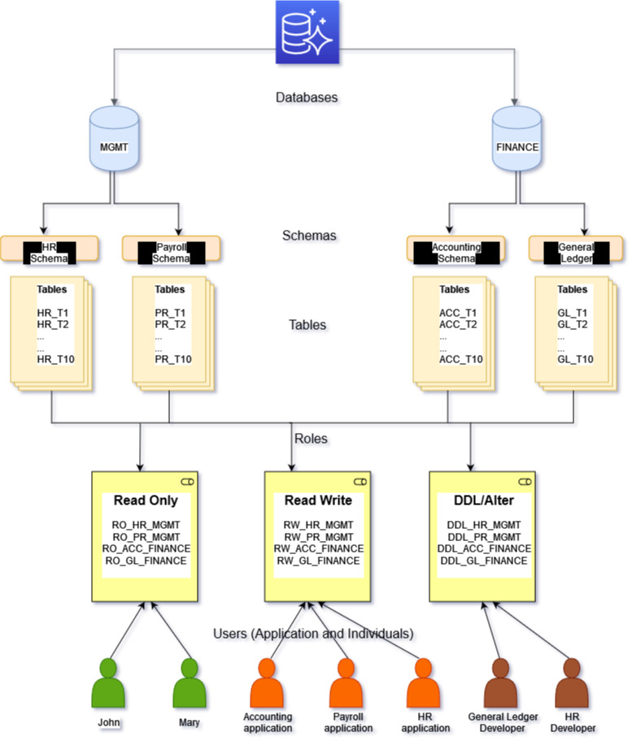
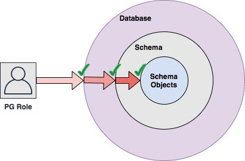
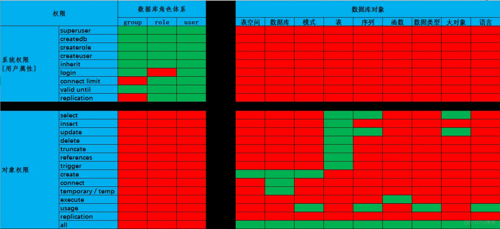
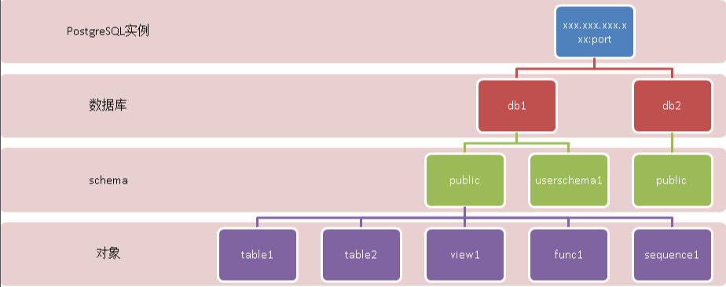
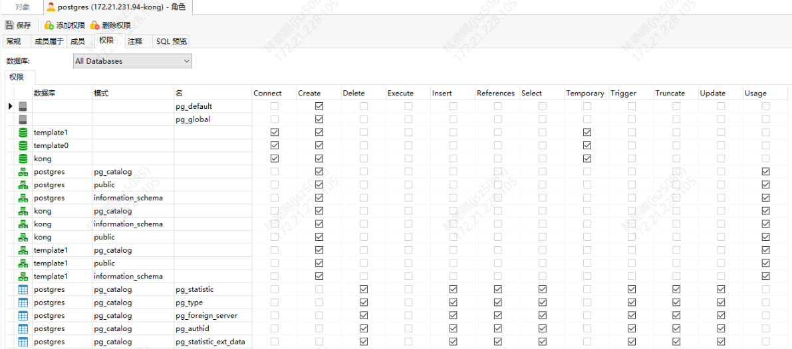
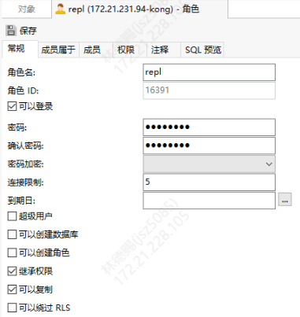

- [用户角色图示](#用户角色图示)
- [角色](#角色)
  - [前言](#前言)
  - [public角色](#public角色)
  - [实验1 用户自动继承public权限](#实验1-用户自动继承public权限)
- [权限](#权限)
  - [创建用户指定系统权限](#创建用户指定系统权限)
    - [如何查询一个用户有哪些系统权限](#如何查询一个用户有哪些系统权限)
  - [修改用户系统权限](#修改用户系统权限)
- [对象权限](#对象权限)
  - [database级权限](#database级权限)
    - [connect](#connect)
    - [temporary/temp](#temporarytemp)
    - [create](#create)
    - [ALL](#all)
  - [schema级权限](#schema级权限)
    - [usage](#usage)
    - [create](#create-1)
  - [table级权限](#table级权限)
    - [读写权限](#读写权限)
    - [删除表与创建索引](#删除表与创建索引)
    - [批量赋权](#批量赋权)
    - [默认权限](#默认权限)
- [ACL含义](#acl含义)
- [参考](#参考)
- [简短版](#简短版)
- [案例分析](#案例分析)
  - [NAVICAT的观察](#navicat的观察)
  - [创建只读用户](#创建只读用户)
  - [添加my\_schema的insert权限](#添加my_schema的insert权限)
  - [添加my\_schema的建表权限](#添加my_schema的建表权限)


# 用户角色图示






# 角色

## 前言

PostgreSQL使用角色的概念管理数据库访问权限。根据角色的设置方式，可以将角色视为数据库用户或数据库用户组。角色可以拥有数据库对象(例如，表和函数)，并可以将对这些对象的权限分配给其他角色，以控制谁有权访问哪些对象。此外，还可以将角色的成员资格授予另一个角色，从而允许成员角色使用分配给另一个角色的权限。

角色的概念包含了“用户”和“组”的概念。任何角色都可以充当用户、组或两者。

角色包含用户和组两个概念，具有login权限的角色称之为用户。任何角色(带或不带rolcanlogin)都可以有其他角色作为成员。

不允许A是B的成员，同时B也是A的成员。

## public角色

public是一个特殊的角色，在元数据表中都查不到该角色

```sql
postgres=# select rolname from pg_roles ;
          rolname  
---------------------------
 postgres
 pg_database_owner
 pg_read_all_data
 pg_write_all_data
 pg_monitor
 pg_read_all_settings
 pg_read_all_stats
 pg_stat_scan_tables
 pg_read_server_files
 pg_write_server_files
 pg_execute_server_program
 pg_signal_backend
 pg_checkpoint
(13 rows)
```

但它确实是存在的，它默认拥有：

1. 数据库：connect,temp/temprary权限，与模式无关任何新建的数据库，系统会自动为public角色赋予connect和在任何schema下创建临时表的权限。
2. public模式：usage，create权限，与数据库无关在任何新建的数据库的public schema下有usage和create的权限。
3. 函数：execute权限，仅限于public模式下
4. language语言：usage权限，与模式无关

更为重要的是，public角色属于一个全局性的角色，这就意味着你所创建的角色都可以理解为是public角色组成员。

而且对public权限的继承完全不受NOINHERIT的控制，一旦创建了一个拥有login权限的角色，它会立即继承拥有上述权限，此时如果想通过revoke（比如revoke connect on database）来回收的话不会成功，因为这是通过组-组成员来继承的，这种继承权限无法通过单纯的对角色成员revoke掉，只能对组进行revoke，通过继承来实现回收。

## 实验1 用户自动继承public权限

```sql
-- 创建用户 ldc
postgres=# CREATE USER ldc;   
CREATE ROLE
Time: 4.781 ms

-- 用户登录数据库
postgres=# \c postgres ldc
You are now connected to database "postgres" as user "ldc".


```

# 权限



postgresql的权限分两大类，系统权限和对象权限。

- 系统权限

系统权限也可以说是角色的属性。

- SUPERUSER|NOSUPERUSER
  这些子句决定新角色是否是一个“超级用户”，它可以越过数据库内的所有访问限制。超级用户状态很危险并且只应该在确实需要时才用。要创建一个新超级用户，你必须自己是一个超级用户。如果没有指定，默认值是NOSUPERUSER。
- CREATEDB|NOCREATEDB
  这些子句定义一个角色创建数据库的能力。如果指定了CREATEDB，被定义的角色将被允许创建新的数据库。指定NOCREATEDB将否定一个角色创建数据库的能力。如果没有指定，默认值是NOCREATEDB。
- CREATEROLE|NOCREATEROLE
  这些子句决定一个角色是否被允许创建新的角色（也就是执行CREATE ROLE）。一个带有CREATEROLE特权的角色也能修改和删除其他角色。如果没有指定，默认值是NOCREATEROLE。
- INHERIT|NOINHERIT
  如果新的角色是其他角色的成员，这些子句决定新角色是否从那些角色中“继承”特权，把新角色作为成员的角色称为新角色的父角色。一个带有INHERIT属性的角色能够自动使用已经被授予给其直接或间接父角色的任何数据库特权。如果没有INHERIT，在另一个角色中的成员关系只会把SET ROLE的能力授予给那个其他角色，只有在这样做后那个其他角色的特权才可用。如果没有指定，默认值是INHERIT。
- LOGIN|NOLOGIN
  这些子句决定一个角色是否被允许登录，也就是在客户端连接期间该角色是否能被给定为初始会话认证名称。一个具有LOGIN属性的角色可以被考虑为一个用户。没有这个属性的角色对于管理数据库特权很有用，但是却不是用户这个词的通常意义。如果没有指定，默认值是NOLOGIN，不过当CREATE ROLE被通过CREATE USER调用时默认值会是LOGIN。
- REPLICATION|NOREPLICATION
  这些子句确定角色是否是复制角色。角色必须具有此属性（或成为超级用户） 才能以复制模式（物理或逻辑复制）连接到服务器，和能够创建或删除复制插槽。 一个具有REPLICATION属性的角色是一个具有非常高特权的角色， 并且只应被用于确实需要复制的角色上。如果没有指定，默认值是 NOREPLICATION。
- BYPASSRLS|NOBYPASSRLS
  这些子句决定是否一个角色可以绕过每一条行级安全性（RLS）策略。 默认是NOBYPASSRLS。注意 pg_dump 将默认 把row_security设置为OFF， 以确保一个表的所有内容被转储出来。如果运行 pg_dump 的用户不 具有适当的权限，将会返回一个错误。超级用户和被转储表的拥有者 总是可以绕过 RLS。
- CONNECTION LIMIT connlimit
  如果角色能登录，这指定该角色能建立多少并发连接。-1（默认值）表示无限制。 请注意，只有正常连接才会计入此限制。预备事务和后台工作连接都不计入此限制。
- [ ENCRYPTED ] PASSWORD password
  设置角色的口令（口令只对具有LOGIN属性的角色有用，但是不管怎样你还是可以为没有该属性的角色定义一个口令）。如果你没有计划使用口令认证，你可以忽略这个选项。如果没有指定口令，口令将被设置为空并且该用户的口令认证总是会失败。也可以用PASSWORD NULL显式地写出一个空口令。

## 创建用户指定系统权限

```sql
postgres@HQ-SIT-kafka013:5432/test=# CREATE USER user1 CREATEDB createrole password 'oracle';
CREATE ROLE
Time: 2.222 ms
```

### 如何查询一个用户有哪些系统权限

```sql
# 方法一
postgres@HQ-SIT-kafka013:5432/test=# \x
Expanded display is on.
postgres@HQ-SIT-kafka013:5432/test=# SELECT * from pg_authid where rolname='user1';
-[ RECORD 1 ]--+------------------------------------
oid            | 16411
rolname        | user1
rolsuper       | f
rolinherit     | t
rolcreaterole  | t
rolcreatedb    | t
rolcanlogin    | t
rolreplication | f
rolbypassrls   | f
rolconnlimit   | -1
rolpassword    | md544cdb245b461c93dc721b9e0b71a03c8
rolvaliduntil  | NULL

#方法二
postgres@HQ-SIT-kafka013:5432/test=# \du+
                                          List of roles
 Role name |                         Attributes                         | Member of | Description
-----------+------------------------------------------------------------+-----------+-------------
 dlq16050  |                                                            | {}        |
 postgres  | Superuser, Create role, Create DB, Replication, Bypass RLS | {}        |
 user1     | Create role, Create DB                                     | {}        |
```

## 修改用户系统权限

```sql
postgres@HQ-SIT-kafka013:5432/test=# ALTER USER user1 NOCREATEROLE nocreatedb superuser;
ALTER ROLE
Time: 2.283 ms
postgres@HQ-SIT-kafka013:5432/test=# \du
                                   List of roles
 Role name |                         Attributes                         | Member of
-----------+------------------------------------------------------------+-----------
 dlq16050  |                                                            | {}
 postgres  | Superuser, Create role, Create DB, Replication, Bypass RLS | {}
 user1     | Superuser                                                  | {}
```

# 对象权限

我们要先了解PostgreSQL的逻辑结构、以及与用户之间的关系。盗用德哥的图;来诠释下逻辑结构；

PostgreSQL逻辑结构有4层：实例->数据库->schema->数据库对象




可以看出用户不在PostgreSQL里面；是独立之外的object；这个跟Oracle逻辑结构不一致。它不属于某个数据库、或者某个schema。

若用户不是数据库属主的用户；要访问对象；该怎么办？有三步。这个类似走后门类似


- 首先你把数据库connect的权限赋予用户（国家允许）
- 再则你需要把对象所在的schema的usage权限赋予用户（省政府允许）
- 最后你需要把对象的权限赋予用户

## database级权限

数据库级的权限有create、connect、temporary/temp三种

语法：

GRANT { { CREATE | CONNECT | TEMPORARY | TEMP } [, ...] | ALL [ PRIVILEGES ] }
    ON DATABASE database_name [, ...]
    TO role_specification [, ...] [ WITH GRANT OPTION ]
### connect
这个比较简单，用户拥有了数据库的connect权限，才能登录数据库

### temporary/temp
在数据库中创建临时表的权限

### create
赋予数据库create权限，只是允许用户在数据库下创建schema，并不包含创建其他对象的权限。

### ALL
对于数据库来说，ALL权限就是create、connect、temporary/temp这三个权限集合，并不是所有权限

## schema级权限

schema级权限包含usage和create两个

语法：
```sql
GRANT { { CREATE | USAGE } [, ...] | ALL [ PRIVILEGES ] }
    ON SCHEMA schema_name [, ...]
    TO role_specification [, ...] [ WITH GRANT OPTION ]
```
### usage
要访问schema中的对象，必须先拥有schema的usage权限。

### create
schema的create权限，允许用户在指定的schema中创建表、sequence、函数、存储过程、视图

## table级权限
表级权限包含SELECT,INSERT,DELTE,UPDATE,TRUNCATE,REFERENCES,TRIGGER

语法
```sql
GRANT { { SELECT | INSERT | UPDATE | DELETE | TRUNCATE | REFERENCES | TRIGGER }
    [, ...] | ALL [ PRIVILEGES ] }
    ON { [ TABLE ] table_name [, ...]
         | ALL TABLES IN SCHEMA schema_name [, ...] }
    TO role_specification [, ...] [ WITH GRANT OPTION ]
```
### 读写权限
### 删除表与创建索引

除了 REFERENCES | TRIGGER这两个权限没有测试，我们会发现，缺少了drop 表和创建索引的权限

### 批量赋权
GRANT SELECT,INSERT,DELETE,UPDATE,TRUNCATE on all tables in schema public to user1;

### 默认权限
如何设置用户新建对象的默认权限？
```sql
ALTER DEFAULT PRIVILEGES
    [ FOR { ROLE | USER } target_role [, ...] ]
    [ IN SCHEMA schema_name [, ...] ]
    abbreviated_grant_or_revoke
```

# ACL含义
```sh
rolename=xxxx -- privileges granted to a role  
        =xxxx -- privileges granted to PUBLIC  
  
            r -- SELECT ("read")  
            w -- UPDATE ("write")  
            a -- INSERT ("append")  
            d -- DELETE  
            D -- TRUNCATE  
            x -- REFERENCES  
            t -- TRIGGER  
            X -- EXECUTE  
            U -- USAGE  
            C -- CREATE  
            c -- CONNECT  
            T -- TEMPORARY  
      arwdDxt -- ALL PRIVILEGES (for tables, varies for other objects)  
            * -- grant option for preceding privilege  
  
        /yyyy -- role that granted this privilege  
```

# 参考
https://blog.51cto.com/lqding/4085482


# 简短版

在 PostgreSQL 中，您可以使用以下方法来查看一个角色（用户或组）是否被授予了权限：

1. 查看角色的授权信息：

   使用 `\du` 命令可以列出所有的角色（用户和组）及其属性，包括角色所拥有的权限。

   ```
   \du
   ```

   这将列出数据库中所有角色的信息，包括角色名称、角色类型、是否是超级用户、是否是登录角色以及角色的权限。角色的权限将显示在 "Member of" 列中。

2. 查看角色拥有的数据库权限：

   使用 `\l` 命令可以列出所有数据库及其属性，包括数据库的权限信息。

   ```
   \l
   ```

   在输出中，您将看到每个数据库的所有者以及数据库的权限信息。

3. 查看角色在特定数据库上的权限：

   使用 `\l` 命令可以列出特定数据库的属性，包括数据库的权限信息。

   ```
   \l my_database
   ```

   在输出中，您将看到该数据库的所有者以及数据库的权限信息。

4. 查看角色的表级权限：

   使用 `\dp` 命令可以列出数据库中所有表的权限信息。

   ```
   \dp
   ```

   这将显示数据库中所有表的权限，包括表名、拥有者以及对应的权限。

5. 查看角色在特定表上的权限：

   使用 `\dp` 命令可以列出特定表的权限信息。

   ```
   \dp my_table
   ```

   这将显示特定表的权限，包括拥有者以及对应的权限。

请注意，要查看一个角色是否被授予了权限，您需要以具有足够权限的用户登录到 PostgreSQL 数据库中。超级用户或具有 `pg_read_all_settings` 权限的用户可以查看所有角色的权限信息。对于一般的用户，只能查看自己所拥有的角色的权限。

# 案例分析
## NAVICAT的观察



## 创建只读用户
```sql
-- 创建用户并指定密码：
CREATE USER user_readonly WITH ENCRYPTED PASSWORD 'ropass';
-- 设置用户默认事务只读：
alter user user_readonly set default_transaction_read_only=on;
```
## 添加my_schema的insert权限
```sql
GRANT INSERT ON ALL TABLES IN SCHEMA my_schema TO user_readonly;
```
## 添加my_schema的建表权限
```sql
GRANT CREATE ON SCHEMA my_schema TO user_readonly;
```
