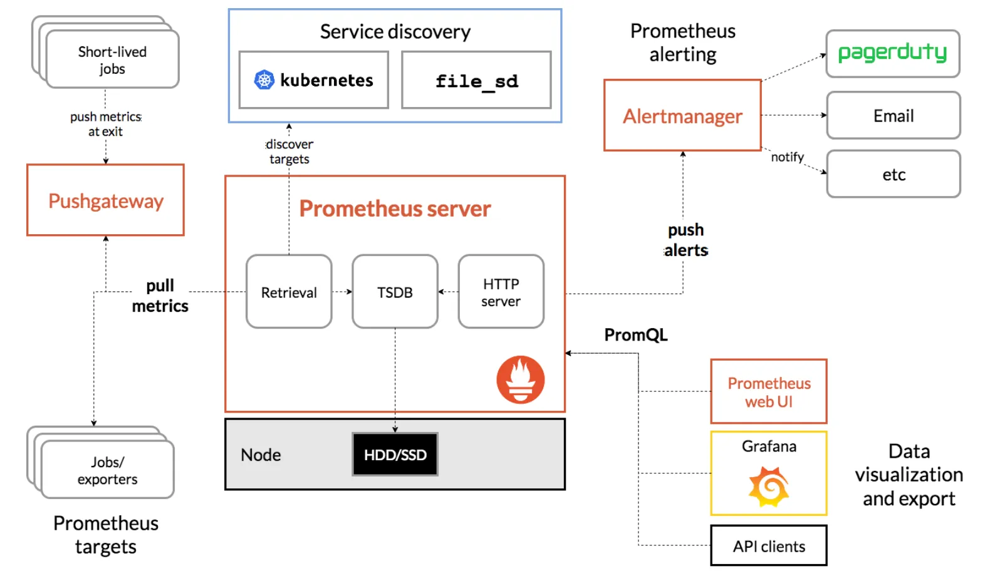
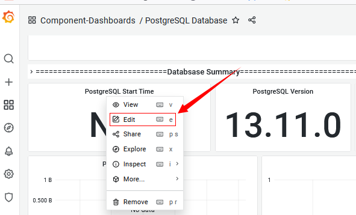
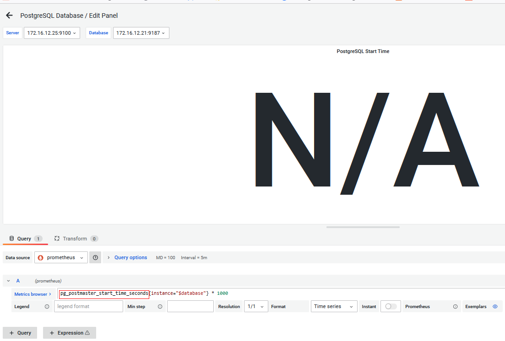
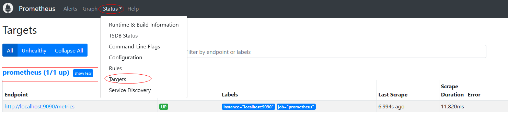
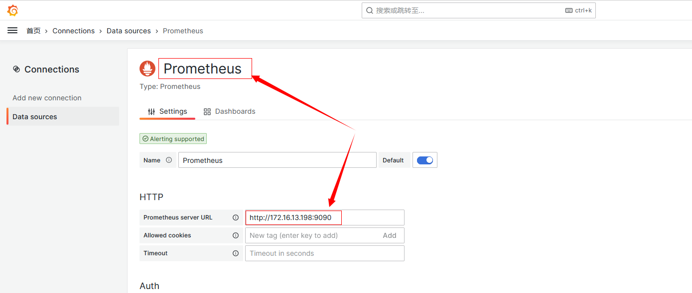
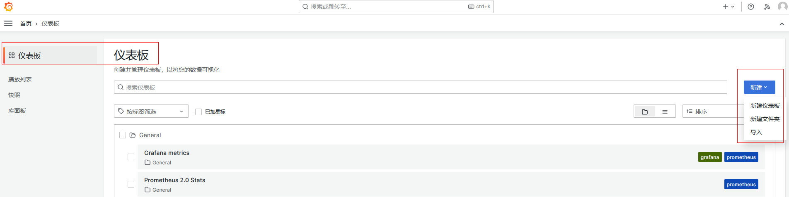
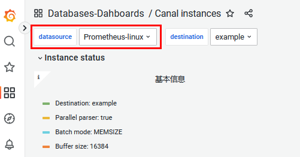
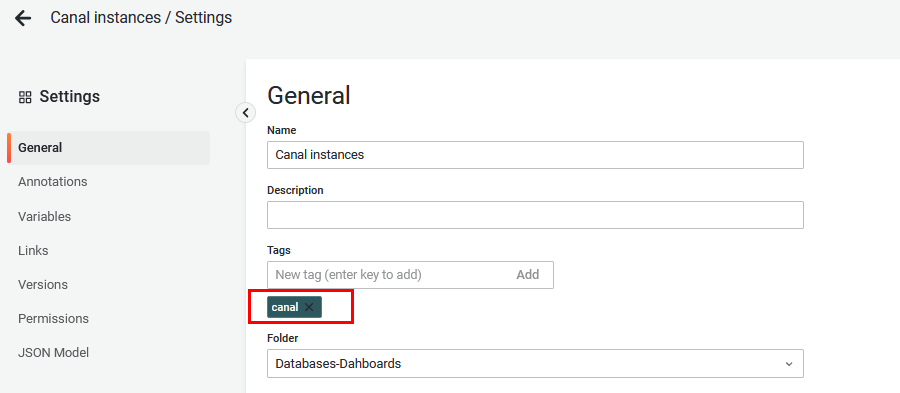

- [官网](#官网)
- [Prometheus简介](#prometheus简介)
  - [Prometheus架构](#prometheus架构)
    - [Prometheus Server](#prometheus-server)
    - [指标采集](#指标采集)
    - [服务发现](#服务发现)
    - [告警管理](#告警管理)
    - [图形化展示](#图形化展示)
    - [对比Zabbix](#对比zabbix)
- [案例分析](#案例分析)
  - [修复GARFANA上的监控指标](#修复garfana上的监控指标)
  - [配置JSON注释](#配置json注释)
- [prometheus 安装部署](#prometheus-安装部署)
- [Grafana 安装部署](#grafana-安装部署)
  - [添加数据源](#添加数据源)
  - [管理仪表盘](#管理仪表盘)
  - [仪表盘跟 prometheus 的 target 关联](#仪表盘跟-prometheus-的-target-关联)
- [prometheus-operator 介绍](#prometheus-operator-介绍)
  - [监控数据的存储选型](#监控数据的存储选型)
  - [Grafana 底层数据库的替换](#grafana-底层数据库的替换)
    - [使用MySQL实现Grafana数据持久化](#使用mysql实现grafana数据持久化)
  - [Prometheus 高可用部署](#prometheus-高可用部署)
  - [Grafana 高可用部署](#grafana-高可用部署)

# 官网
https://github.com/prometheus/prometheus
# Prometheus简介
Prometheus 是一款基于时序数据库的开源监控告警系统，非常适合Kubernetes集群的监控。Prometheus的基本原理是通过HTTP协议周期性抓取被监控组件的状态，任意组件只要提供对应的HTTP接口就可以接入监控。不需要任何SDK或者其他的集成过程。这样做非常适合做虚拟化环境监控系统，比如VM、Docker、Kubernetes等。输出被监控组件信息的HTTP接口被叫做exporter 。目前互联网公司常用的组件大部分都有exporter可以直接使用，比如Varnish、Haproxy、Nginx、MySQL、Linux系统信息(包括磁盘、内存、CPU、网络等等)。Promethus有以下特点：

- 支持多维数据模型：由度量名和键值对组成的时间序列数据
- 内置时间序列数据库TSDB
- 支持PromQL查询语言，可以完成非常复杂的查询和分析，对图表展示和告警非常有意义
- 支持HTTP的Pull方式采集时间序列数据
- 支持PushGateway采集瞬时任务的数据
- 支持服务发现和静态配置两种方式发现目标
- 支持接入Grafana

## Prometheus架构


### Prometheus Server
主要负责数据采集和存储，提供PromQL查询语言的支持。包含了三个组件：

- Retrieval: 获取监控数据
- TSDB: 时间序列数据库(Time Series Database)，我们可以简单的理解为一个优化后用来处理时间序列数据的软件，并且数据中的数组是由时间进行索引的。具备以下特点：
```
1、大部分时间都是顺序写入操作，很少涉及修改数据
2、删除操作都是删除一段时间的数据，而不涉及到删除无规律数据
3、读操作一般都是升序或者降序
```
- HTTP Server: 为告警和出图提供查询接口

### 指标采集
- Exporters: Prometheus的一类数据采集组件的总称。它负责从目标处搜集数据，并将其转化为Prometheus支持的格式。与传统的数据采集组件不同的是，它并不向中央服务器发送数据，而是等待中央服务器主动前来抓取
- Pushgateway: 支持临时性Job主动推送指标的中间网关

### 服务发现
- Kubernetes_sd: 支持从Kubernetes中自动发现服务和采集信息。而Zabbix监控项原型就不适合Kubernets，因为随着Pod的重启或者升级，Pod的名称是会随机变化的。
- file_sd: 通过配置文件来实现服务的自动发现

### 告警管理
通过相关的告警配置，对触发阈值的告警通过页面展示、短信和邮件通知的方式告知运维人员。

### 图形化展示
通过ProQL语句查询指标信息，并在页面展示。虽然Prometheus自带UI界面，但是大部分都是使用Grafana出图。另外第三方也可以通过 API 接口来获取监控指标。

### 对比Zabbix
主要使用场景区别是，Zabbix适合用于虚拟机、物理机的监控，因为每个监控指标是以 IP 地址作为标识进行区分的。而Prometheus的监控指标是由多个 label 组成，IP地址并不是唯一的区分指标，Prometheus 强大在可以支持自动发现规则，因此适合于容器环境。

从自定义监控项角度而言，Prometheus 开发难度较大，zabbix配合shell脚本更加方便。Prometheus在监控虚拟机上业务时，可能需要安装多个 exporter，而zabbix只需要安装一个 Agent。
 
Prometheus 采用拉数据方式，即使采用的是push-gateway，prometheus也是从push-gateway拉取数据。而Zabbix可以推可以拉。

# 案例分析

## 修复GARFANA上的监控指标
1、登录grafana
2、修改监控指标


## 配置JSON注释
```json
{
  // datasource: 指定数据源类型和UID
  "datasource": {
    "type": "prometheus",
    "uid": "P1809F7CD0C75ACF3"
  },

  // fieldConfig: 指定默认值、映射、阈值和单位
  "fieldConfig": {
    "defaults": {
      // color: 指定颜色模式
      "color": {
        "mode": "thresholds"
      },

      // mappings: 指定特殊值映射
      "mappings": [
        {
          // options: 指定匹配和结果
          "options": {
            "match": "null",
            "result": {
              // text: 指定结果文本
              "text": "N/A"
            }
          },
          // type: 指定类型
          "type": "special"
        }
      ],

      // thresholds: 指定阈值
      "thresholds": {
        "mode": "absolute",
        "steps": [
          {
            // color: 指定颜色
            "color": "green",
            // value: 指定值
            "value": null
          },
          {
            // color: 指定颜色
            "color": "red",
            // value: 指定值
            "value": 80
          }
        ]
      },

      // unit: 指定单位
      "unit": "dateTimeAsIso"
    },
    "overrides": []
  },

  // gridPos: 指定网格位置
  "gridPos": {
    "h": 6,
    "w": 3,
    "x": 0,
    "y": 1
  },

  // id: 指定 ID
  "id": 2,

  // links: 指定链接
  "links": [],

  // maxDataPoints: 指定最大数据点数
  "maxDataPoints": 100,

  // options: 指定选项
  "options": {
    // colorMode: 指定颜色模式
    "colorMode": "none",

    // graphMode: 指定图表模式
    "graphMode": "none",

    // justifyMode: 指定对齐方式
    "justifyMode": "auto",

    // orientation: 指定方向
    "orientation": "horizontal",

    // reduceOptions: 指定 reduce 选项
    "reduceOptions": {
      // calcs: 指定 calcs 列表
      "calcs": [
        "lastNotNull"
      ],

      // fields: 指定 fields 列表
      "fields": "",

      // values: 指定值是否为布尔值
      "values": false
    },

    // textMode: 指定文本模式
    "textMode": "auto"
  },

  // pluginVersion: 指定插件版本
  "pluginVersion": "8.3.3",

  // targets: 指定目标
  "targets": [
    {
      // expr: 指定表达式
      "expr": "node_boot_time_seconds{instance=\"$server\"} * 1000",

      // format: 指定格式
      "format": "time_series",

      // intervalFactor: 指定间隔因子
      "intervalFactor": 1,

      // legendFormat: 指定图例格式
      "legendFormat": "System Uptime(days)",

      // refId: 指定 refId
      "refId": "A"
    }
  ],

  // title: 指定标题
  "title": "System Start Time",

  // type: 指定类型
  "type": "stat"
}
```

# prometheus 安装部署
下载页面 https://github.com/prometheus/prometheus/releases/  
```sh
wget https://github.com/prometheus/prometheus/releases/download/v2.37.9/prometheus-2.37.9.linux-amd64.tar.gz

tar -xzvf prometheus-2.37.9.linux-amd64.tar.gz
cd prometheus-2.37.9.linux-amd64

# 启动
./prometheus 
```
配置说明
```sh
# 
# my global config
global: # 全局配置
  scrape_interval: 15s # 设置抓取间隔为每 15 秒。默认值为每 1 分钟。
  evaluation_interval: 15s # 每 15 秒评估一次规则。默认值为每 1 分钟。
  # scrape_timeout is set to the global default (10s). # 抓取超时时间设置为全局默认值（10 秒）。

# Alertmanager configuration
alerting: # Alertmanager 配置
  alertmanagers:
    - static_configs:
        - targets:
          # - alertmanager:9093

# Load rules once and periodically evaluate them according to the global 'evaluation_interval'.
rule_files: # 加载规则文件，并根据全局 'evaluation_interval' 周期性地评估它们。
  # - "first_rules.yml"
  # - "second_rules.yml"

# A scrape configuration containing exactly one endpoint to scrape:
# Here it's Prometheus itself.
scrape_configs: # 抓取配置，包含一个要抓取的端点：
  # The job name is added as a label `job=<job_name>` to any timeseries scraped from this config.
  - job_name: "prometheus" # 工作名称被添加为标签 `job=<job_name>` 到从此配置抓取的任何时间序列。

    # metrics_path defaults to '/metrics'
    # scheme defaults to 'http'.
    static_configs:
      - targets: ["localhost:9090"] # 默认指标路径为 '/metrics'，默认方案为 'http'。

```
查看监控目标
```sh
http://172.1.1.198:9090/
```


# Grafana 安装部署
Grafana 提供了两个版本：开源版（OSS）和企业版（Enterprise）

官方地址: https://github.com/grafana/grafana  
下载地址:   
https://github.com/grafana/grafana/releases  
https://grafana.com/grafana/download/10.1.0
```sh
wget https://dl.grafana.com/oss/release/grafana-10.1.0.linux-amd64.tar.gz
tar xvf grafana-10.1.0.linux-amd64.tar.gz
cd grafana-10.1.0
```
配置概览
```sh
##################### Grafana Configuration Defaults ##################### # Grafana 配置默认值
#################################### Paths ############################### # 路径
#################################### Server ############################## # 服务器
#################################### GRPC Server ######################### # GRPC 服务器
#################################### Database ############################ # 数据库
#################################### Cache server ############################# # 缓存服务器
#################################### Data proxy ########################### # 数据代理
#################################### Analytics ########################### # 分析
#################################### Security ############################ # 安全
#################################### Snapshots ########################### # 快照
#################################### Dashboards ################## # 仪表盘
################################### Data sources ######################### # 数据源
################################### SQL Data Sources ##################### # SQL 数据源
#################################### Users ############################### # 用户
#################################### Anonymous Auth ###################### # 匿名认证
#################################### GitHub Auth ######################### # GitHub 认证
#################################### GitLab Auth ######################### # GitLab 认证
#################################### Google Auth ######################### # Google 认证
#################################### Grafana.com Auth #################### # Grafana.com 认证
#################################### Azure AD OAuth ####################### # Azure AD OAuth 认证
#################################### Okta OAuth ####################### # Okta OAuth 认证
#################################### Generic OAuth ####################### # 通用 OAuth 认证
#################################### Basic Auth ########################## # 基本认证
#################################### Auth Proxy ########################## # 认证代理
#################################### Auth JWT ########################## # JWT 认证
#################################### Auth LDAP ########################### # LDAP 认证
#################################### AWS ########################### # AWS 配置
#################################### Azure ############################### # Azure 配置
#################################### Role-based Access Control ########### # 基于角色的访问控制 (RBAC)
#################################### SMTP / Emailing ##################### # SMTP / 邮件发送配置
#################################### Logging ########################## # 日志记录配置
#################################### Usage Quotas ######################## # 使用配额配置
#### set quotas to -1 to make unlimited. ####  设置配额为 -1 表示无限制。
#################################### Unified Alerting #################### # 统一报警配置 (Unified Alerting)
#################################### Alerting ############################ # 报警配置 (Alerting)
#################################### Annotations ######################### # 注释配置 (Annotations)
#################################### Explore ############################# # 探索配置 (Explore)
#################################### Help #############################    帮助配置 (Help)
#################################### Profile ############################# 个人资料配置 (Profile)
#################################### News #############################    新闻配置 (News)
#################################### Query #############################   查询配置 (Query)
#################################### Query History ############################# 查询历史记录配置 (Query History)
#################################### Internal Grafana Metrics ############
``````
调整配置
```sh
[analytics]
# 禁止自动更新
check_for_updates = false
```
```sh
# 启动
bin/grafana-server
```
登录
```sh
http://172.1.1.198:3000
用户名密码 admin/admin
```
## 添加数据源

## 管理仪表盘

## 仪表盘跟 prometheus 的 target 关联 
 

这里的 canal 跟 prometheus 配置中的 scrape_configs.job_name 对应
# prometheus-operator 介绍
Prometheus Operator 是一个开源项目，旨在简化和自动化在 Kubernetes 集群中基于 Prometheus 的监控堆栈的配置。它提供了 Kubernetes 原生的部署和管理 Prometheus 和相关监控组件的方法。

Prometheus Operator 提供了一些功能，包括但不限于：
- Kubernetes 自定义资源：使用 Kubernetes 自定义资源来部署和管理 Prometheus、Alertmanager 和相关组件。
- 简化的部署配置：从本地 Kubernetes 资源配置 Prometheus 的基础，如版本、持久性、保留策略和副本。
- Prometheus 目标配置：根据熟悉的 Kubernetes 标签查询自动生成监控目标配置；无需学习特定于 Prometheus 的配置语言。

## 监控数据的存储选型
Prometheus 自带一个本地磁盘时间序列数据库，用于存储数据。它还可以选择与远程存储系统集成。

## Grafana 底层数据库的替换
默认使用的是 sqlite3  
建议改造成其它支持高可用的数据库  
### 使用MySQL实现Grafana数据持久化
在 grafana.ini 文件中，可以添加以下内容：
```yaml
[database]
type = mysql
host = your_mysql_host:3306
name = your_grafana_database
user = your_mysql_user
password = your_mysql_password
```
然后导出 dashboard 相关的SQL语句,最后导入mysql

## Prometheus 高可用部署

## Grafana 高可用部署
