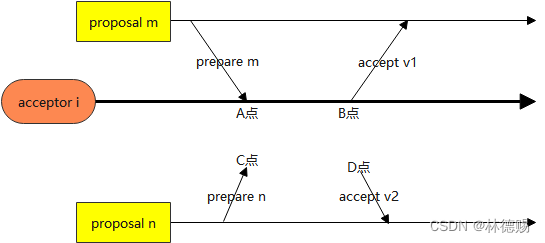

- [1、引用原文](#1引用原文)
  - [1.1 两阶段提交过程](#11-两阶段提交过程)
  - [1.2 原文中的论证关键过程](#12-原文中的论证关键过程)
- [2、重新简洁证明](#2重新简洁证明)
- [3、Multi-Paxos学习](#3multi-paxos学习)

# 1、引用原文
## 1.1 两阶段提交过程
**1. Phase 1.**

(a) A proposer selects a proposal number n and sends a prepare
request with number n to a majority of acceptors.

(b) If an acceptor receives a prepare request with number n greater
than that of any prepare request to which it has already responded,
then it responds to the request with a promise not to accept any more
proposals numbered less than n and with the highest-numbered pro-
posal (if any) that it has accepted.

**2. Phase 2.**

(a) If the proposer receives a response to its prepare requests
(numbered n) from a majority of acceptors, then it sends an accept
request to each of those acceptors for a proposal numbered n with a
value v, where v is the value of the highest-numbered proposal among
the responses, or is any value if the responses reported no proposals.

(b) If an acceptor receives an accept request for a proposal numbered
n, it accepts the proposal unless it has already responded to a prepare
request having a number greater than n.

## 1.2 原文中的论证关键过程
**结论:**  
If a proposal with value v is chosen, then every higher-numbered pro-
posal issued by any proposer has value v.  
**论证过程**  
We would assume that some proposal with number m and value
v is chosen and show that any proposal issued with number n > m also
has value v. We would make the proof easier by using induction on n,
so we can prove that proposal number n has value v under the additional
assumption that every proposal issued with a number in m ..(n − 1) has
value v, where i ..j denotes the set of numbers from i through j. For the
proposal numbered m to be chosen, there must be some set C consisting of a
majority of acceptors such that every acceptor in C accepted it. Combining
this with the induction assumption, the hypothesis that m is chosen implies:
Every acceptor in C has accepted a proposal with number in
m ..(n − 1), and every proposal with number in m ..(n − 1)
accepted by any acceptor has value v.  

Since any set S consisting of a majority of acceptors contains at least one
member of C, we can conclude that a proposal numbered n has value v by
ensuring that the following invariant is maintained:
P2 c . For any v and n, if a proposal with value v and number n is issued,
then there is a set S consisting of a majority of acceptors such that
either (a) no acceptor in S has accepted any proposal numbered less
than n, or (b) v is the value of the highest-numbered proposal among
all proposals numbered less than n accepted by the acceptors in S.
We can therefore satisfy P2 b by maintaining the invariance of P2 c .
To maintain the invariance of P2 c , a proposer that wants to issue a pro-
posal numbered n must learn the highest-numbered proposal with number
less than n, if any, that has been or will be accepted by each acceptor in
some majority of acceptors. Learning about proposals already accepted is
easy enough; predicting future acceptances is hard. Instead of trying to pre-
dict the future, the proposer controls it by extracting a promise that there
won’t be any such acceptances. In other words, the proposer requests that
the acceptors not accept any more proposals numbered less than n.

# 2、重新简洁证明
用反证论证acceptors集群不可能存在: 确认两个不同的值。
1. 如果该集群确认了(m,v1)和(n,v2)，m<n且v1\neqv2。
2. 那么我们假设acceptors中的子集Sm accept v1，acceptors中的子集Sn accept v2。

根据约束p2a（表示第二个阶段中的a步骤），Sm过半、Sn过半，推出 Sm\bigcap Sn\neq \o ，假设acceptor i属于这个交集，如下图，假设A点、B点已经确认时间点，C点、D点未确认时间点。

3. 根据约束P1b前半段，推出C点只能在A点右侧。

根据约束P2a，推出C点只能在B点右侧，否则B点就不会accept编号m，因为m<n。

再根据约束P1b后半段、C点在B点右侧，推出proposal n 的值会被改为v1，也就是v2=v1。

这与我们之前假设的v1\neqv1矛盾。

# 3、Multi-Paxos学习
引用分布式数据库书的章节

Multi-Paxos 算法是一个统称，它是指基于 Multi-Paxos 思想，通过多个 Basic Paxos 实例实现一系列值的共识的算法。

如果直接通过多次执行 Basic Paxos 实例，来实现一系列值的共识，就会存在这样几个问题：

1. 如果多个提议者同时提交提案，可能出现因为提案编号冲突，在准备阶段没有提议者接收到大多数准备响应，协商失败，需要重新协商。想象一下，一个 5 节点的集群，如果 3 个节点作为提议者同时提案，就可能发生因为没有提议者接收大多数响应（比如 1 个提议者接收到 1 个准备响应，另外 2 个提议者分别接收到 2 个准备响应）而准备失败，需要重新协商。

2.  轮 RPC 通讯（准备阶段和接受阶段）往返消息多、耗性能、延迟大。你要知道，分布式系统的运行是建立在 RPC 通讯的基础之上的，因此，延迟一直是分布式系统的痛点，是需要我们在开发分布式系统时认真考虑和优化的。

如何解决上面的 2 个问题呢？可以通过引入领导者和优化 Basic Paxos 执行来解决。

1. 通过引入领导者节点，也就是说，领导者节点作为唯一提议者，这样就不存在多个提议者同时提交提案的情况，也就不存在提案冲突的情况了

2. 优化 Basic Paxos 执行。“当领导者处于稳定状态时，省掉准备阶段，直接进入接受阶段”这个优化机制，优化 Basic Paxos 执行。不再需要通过准备请求来发现之前被大多数节点通过的提案。

Chubby对Multi-Paxos的应用：为了实现了强一致性，读操作也只能在主节点上执行。