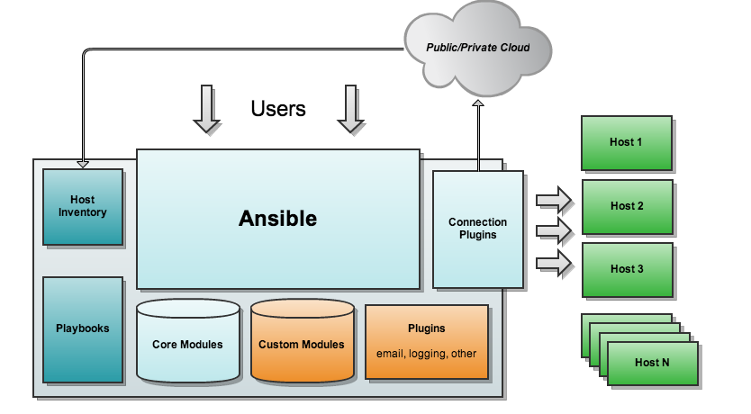

- [官网](#官网)
- [Ansible Architecture](#ansible-architecture)
- [安装](#安装)
- [ansible 用法](#ansible-用法)
- [Ansible concepts](#ansible-concepts)
- [演示](#演示)
  - [hosts](#hosts)
  - [ping](#ping)
  - [yaml](#yaml)
  - [playbook](#playbook)
- [tdsql 的 es 安装](#tdsql-的-es-安装)
  - [playbook](#playbook-1)
  - [role](#role)
  - [ansible.cfg](#ansiblecfg)
- [帮助文档](#帮助文档)
  - [ansible 命令集](#ansible-命令集)
  - [ansible-doc 命令](#ansible-doc-命令)
  - [以mysql相关的为例](#以mysql相关的为例)
  - [ansible 命令详解](#ansible-命令详解)
  - [ansible 配置公私钥](#ansible-配置公私钥)
- [ansible 常用模块](#ansible-常用模块)
  - [主机连通性测试](#主机连通性测试)
  - [command 模块](#command-模块)
  - [shell 模块](#shell-模块)
  - [copy 模块](#copy-模块)
  - [file 模块](#file-模块)
  - [fetch 模块](#fetch-模块)
  - [cron 模块](#cron-模块)
  - [yum 模块](#yum-模块)
  - [service 模块](#service-模块)
  - [user 模块](#user-模块)
  - [group 模块](#group-模块)
  - [script 模块](#script-模块)
  - [setup 模块](#setup-模块)
- [role 中常用的系统变量](#role-中常用的系统变量)
- [制作 ansible 镜像](#制作-ansible-镜像)
- [路径变量](#路径变量)
- [role 脚本案例](#role-脚本案例)
  - [hosts](#hosts-1)
  - [main.yml](#mainyml)
  - [ansible-playbook -i hosts playbooks/es.yml](#ansible-playbook--i-hosts-playbooksesyml)
- [自己编写安装 ES 的脚本](#自己编写安装-es-的脚本)
  - [main.yml](#mainyml-1)
  - [其中 init\_es\_machine.sh](#其中-init_es_machinesh)
  - [其中 elasticsearch.yml.j2](#其中-elasticsearchymlj2)
  - [kibana 安装](#kibana-安装)

# 官网
https://docs.ansible.com/ansible/latest/getting_started/index.html

# Ansible Architecture

Ansible runs on a central computer. Playbooks define configuration policy and orchestration workflows. Ansible then uses SSH to execute modules on remote machines without having to install any systems management software. Ansible comes with a large selection of modules for automating common tasks, and users can also write their own in their choice of favorite language. Inventory can be sourced from simple text files, the cloud, or configuration management databases (CMDBs). Results can be stored and processed into a variety of systems

# 安装
```sh
python3 -m pip install --user ansible  # 默认会安装到 $HOME/.local/bin
或者
python3 -m pip install --target=/data/ansible ansible
```
# ansible 用法
```yml
usage: ansible [-h] [--version] [-v] [-b] [--become-method BECOME_METHOD]
               [--become-user BECOME_USER] [-K] [-i INVENTORY] [--list-hosts]
               [-l SUBSET] [-P POLL_INTERVAL] [-B SECONDS] [-o] [-t TREE] [-k]
               [--private-key PRIVATE_KEY_FILE] [-u REMOTE_USER]
               [-c CONNECTION] [-T TIMEOUT]
               [--ssh-common-args SSH_COMMON_ARGS]
               [--sftp-extra-args SFTP_EXTRA_ARGS]
               [--scp-extra-args SCP_EXTRA_ARGS]
               [--ssh-extra-args SSH_EXTRA_ARGS] [-C] [--syntax-check] [-D]
               [-e EXTRA_VARS] [--vault-id VAULT_IDS]
               [--ask-vault-password | --vault-password-file VAULT_PASSWORD_FILES]
               [-f FORKS] [-M MODULE_PATH] [--playbook-dir BASEDIR]
               [--task-timeout TASK_TIMEOUT] [-a MODULE_ARGS] [-m MODULE_NAME]
               pattern

Define and run a single task 'playbook' against a set of hosts

positional arguments:
  pattern               host pattern

optional arguments:
  --ask-vault-password, --ask-vault-pass
                        ask for vault password
  --list-hosts          outputs a list of matching hosts; does not execute
                        anything else
  --playbook-dir BASEDIR
                        Since this tool does not use playbooks, use this as a
                        substitute playbook directory.This sets the relative
                        path for many features including roles/ group_vars/
                        etc.
  --syntax-check        perform a syntax check on the playbook, but do not
                        execute it
  --task-timeout TASK_TIMEOUT
                        set task timeout limit in seconds, must be positive
                        integer.
  --vault-id VAULT_IDS  the vault identity to use
  --vault-password-file VAULT_PASSWORD_FILES, --vault-pass-file VAULT_PASSWORD_FILES
                        vault password file
  --version             show program's version number, config file location,
                        configured module search path, module location,
                        executable location and exit
  -B SECONDS, --background SECONDS
                        run asynchronously, failing after X seconds
                        (default=N/A)
  -C, --check           don't make any changes; instead, try to predict some
                        of the changes that may occur
  -D, --diff            when changing (small) files and templates, show the
                        differences in those files; works great with --check
  -M MODULE_PATH, --module-path MODULE_PATH
                        prepend colon-separated path(s) to module library (def
                        ault=~/.ansible/plugins/modules:/usr/share/ansible/plu
                        gins/modules)
  -P POLL_INTERVAL, --poll POLL_INTERVAL
                        set the poll interval if using -B (default=15)
  -a MODULE_ARGS, --args MODULE_ARGS
                        The action's options in space separated k=v format: -a
                        'opt1=val1 opt2=val2'
  -e EXTRA_VARS, --extra-vars EXTRA_VARS
                        set additional variables as key=value or YAML/JSON, if
                        filename prepend with @
  -f FORKS, --forks FORKS
                        specify number of parallel processes to use
                        (default=5)
  -h, --help            show this help message and exit
  -i INVENTORY, --inventory INVENTORY, --inventory-file INVENTORY
                        specify inventory host path or comma separated host
                        list. --inventory-file is deprecated
  -l SUBSET, --limit SUBSET
                        further limit selected hosts to an additional pattern
  -m MODULE_NAME, --module-name MODULE_NAME
                        Name of the action to execute (default=command)
  -o, --one-line        condense output
  -t TREE, --tree TREE  log output to this directory
  -v, --verbose         verbose mode (-vvv for more, -vvvv to enable
                        connection debugging)

Privilege Escalation Options:
  control how and which user you become as on target hosts

  --become-method BECOME_METHOD
                        privilege escalation method to use (default=sudo), use
                        `ansible-doc -t become -l` to list valid choices.
  --become-user BECOME_USER
                        run operations as this user (default=root)
  -K, --ask-become-pass
                        ask for privilege escalation password
  -b, --become          run operations with become (does not imply password
                        prompting)

Connection Options:
  control as whom and how to connect to hosts

  --private-key PRIVATE_KEY_FILE, --key-file PRIVATE_KEY_FILE
                        use this file to authenticate the connection
  --scp-extra-args SCP_EXTRA_ARGS
                        specify extra arguments to pass to scp only (e.g. -l)
  --sftp-extra-args SFTP_EXTRA_ARGS
                        specify extra arguments to pass to sftp only (e.g. -f,
                        -l)
  --ssh-common-args SSH_COMMON_ARGS
                        specify common arguments to pass to sftp/scp/ssh (e.g.
                        ProxyCommand)
  --ssh-extra-args SSH_EXTRA_ARGS
                        specify extra arguments to pass to ssh only (e.g. -R)
  -T TIMEOUT, --timeout TIMEOUT
                        override the connection timeout in seconds
                        (default=10)
  -c CONNECTION, --connection CONNECTION
                        connection type to use (default=smart)
  -k, --ask-pass        ask for connection password
  -u REMOTE_USER, --user REMOTE_USER
                        connect as this user (default=None)

Some actions do not make sense in Ad-Hoc (include, meta, etc)
```

# Ansible concepts
- **Control node**  
The machine from which you run the Ansible CLI tools (ansible-playbook , ansible, ansible-vault and others). You can use any computer that meets the software requirements as a control node - laptops, shared desktops, and servers can all run Ansible. Multiple control nodes are possible, but Ansible itself does not coordinate across them, see AAP for such features.
- **Managed nodes**  
Also referred to as ‘hosts’, these are the target devices (servers, network appliances or any computer) you aim to manage with Ansible. Ansible is not normally installed on managed nodes, unless you are using ansible-pull, but this is rare and not the recommended setup.
- **Inventory**  
A list of managed nodes provided by one or more ‘inventory sources’. Your inventory can specify information specific to each node, like IP address. It is also used for assigning groups, that both allow for node selection in the Play and bulk variable assignment. To learn more about inventory, see the Working with Inventory section. Sometimes an inventory source file is also referred to as a ‘hostfile’.
- **Playbooks**  
They contain Plays (which are the basic unit of Ansible execution). This is both an ‘execution concept’ and how we describe the files on which ansible-playbook operates. Playbooks are written in YAML and are easy to read, write, share and understand. To learn more about playbooks, see Ansible playbooks.
1. **Plays**  
The main context for Ansible execution, this playbook object maps managed nodes (hosts) to tasks. The Play contains variables, roles and an ordered lists of tasks and can be run repeatedly. It basically consists of an implicit loop over the mapped hosts and tasks and defines how to iterate over them.
1. **Roles**  
A limited distribution of reusable Ansible content (tasks, handlers, variables, plugins, templates and files) for use inside of a Play. To use any Role resource, the Role itself must be imported into the Play.
1. **Tasks**  
The definition of an ‘action’ to be applied to the managed host. Tasks must always be contained in a Play, directly or indirectly (Role, or imported/included task list file). You can execute a single task once with an ad hoc command using ansible or ansible-console (both create a virtual Play).
1. **Handlers**  
A special form of a Task, that only executes when notified by a previous task which resulted in a ‘changed’ status.
- **Modules**  
The code or binaries that Ansible copies to and executes on each managed node (when needed) to accomplish the action defined in each Task. Each module has a particular use, from administering users on a specific type of database to managing VLAN interfaces on a specific type of network device. You can invoke a single module with a task, or invoke several different modules in a playbook. Ansible modules are grouped in collections. For an idea of how many collections Ansible includes, see the Collection Index.
- **Plugins**  
Pieces of code that expand Ansible’s core capabilities, they can control how you connect to a managed node (connection plugins), manipulate data (filter plugins) and even control what is displayed in the console (callback plugins). See Working with plugins for details.
- **Collections**  
A format in which Ansible content is distributed that can contain playbooks, roles, modules, and plugins. You can install and use collections through Ansible Galaxy. To learn more about collections, see Using Ansible collections. Collection resources can be used independently and discretely from each other.
- **AAP**  
Short for ‘Ansible Automation Platform’. This is a product that includes enterprise level features and integrates many tools of the Ansible ecosystem: ansible-core, awx, galaxyNG, and so on.

# 演示
## hosts
```sh
cat /data/hosts
[myvirtualmachines]
192.0.2.50
192.0.2.51
192.0.2.52

ansible -i /data/hosts all --list-hosts
  hosts (3):
    192.0.2.50
    192.0.2.51
    192.0.2.52
```
## ping
```sh
ansible all -m ping
```
```
172.1.1.198 | SUCCESS => {
    "ansible_facts": {
        "discovered_interpreter_python": "/usr/bin/python"
    },
    "changed": false,
    "ping": "pong"
}
172.1.1.197 | SUCCESS => {
    "ansible_facts": {
        "discovered_interpreter_python": "/usr/bin/python"
    },
    "changed": false,
    "ping": "pong"
}
172.1.1.196 | SUCCESS => {
    "ansible_facts": {
        "discovered_interpreter_python": "/usr/bin/python"
    },
    "changed": false,
    "ping": "pong"
}
```
## yaml
```
vi /data/inventory.yaml
```
```yaml
dbservers:
  hosts:
    dbserver01:
      ansible_host: 172.1.1.196
      db_port: 3306
    dbserver02:
      ansible_host: 172.1.1.197
      db_port: 3307

appservers:
  hosts:
    appserver01:
      ansible_host: 172.1.1.197
    appserver02:
      ansible_host: 172.1.1.198
  vars:
    ansible_user: root
```
```
ansible dbservers -m ping -i inventory.yaml
```
```
dbserver01 | SUCCESS => {
    "ansible_facts": {
        "discovered_interpreter_python": "/usr/bin/python"
    },
    "changed": false,
    "ping": "pong"
}
dbserver02 | SUCCESS => {
    "ansible_facts": {
        "discovered_interpreter_python": "/usr/bin/python"
    },
    "changed": false,
    "ping": "pong"
}
```

## playbook
Playbooks are automation blueprints, in YAML format, that Ansible uses to deploy and configure managed nodes.
- **Playbook**

A list of plays that define the order in which Ansible performs operations, from top to bottom, to achieve an overall goal.

- **Play**

An ordered list of tasks that maps to managed nodes in an inventory.

- **Task**

A list of one or more modules that defines the operations that Ansible performs.

- **Module**

A unit of code or binary that Ansible runs on managed nodes. Ansible modules are grouped in collections with a Fully Qualified Collection Name (FQCN) for each module.

```yaml
cat playbook.yaml
- name: My first play
  hosts: dbservers
  tasks:
   - name: Ping my hosts
     ansible.builtin.ping:
   - name: Print message
     ansible.builtin.debug:
       msg: Hello world
```

```
ansible-playbook -i inventory.yaml playbook.yaml
```
```
PLAY [My first play] *******************************************************************************************************

TASK [Gathering Facts] *******************************************************************************************************
ok: [dbserver01]
ok: [dbserver02]

TASK [Ping my hosts] *******************************************************************************************************
ok: [dbserver01]
ok: [dbserver02]

TASK [Print message] *******************************************************************************************************
ok: [dbserver01] => {
    "msg": "Hello world"
}
ok: [dbserver02] => {
    "msg": "Hello world"
}

PLAY RECAP *******************************************************************************************************
dbserver01                 : ok=3    changed=0    unreachable=0    failed=0    skipped=0    rescued=0    ignored=0   
dbserver02                 : ok=3    changed=0    unreachable=0    failed=0    skipped=0    rescued=0    ignored=0
```

# tdsql 的 es 安装
## playbook
```
cat  playbooks/tdsql_es7.yml
```
```yml
---
- name: install es beginning
  hosts: tdsql_es
  remote_user: root
  gather_facts: false
  roles:
    - tdsql_beginning

- name: install es7 server
  hosts: tdsql_es
  remote_user: root
  gather_facts: false
  roles:
    - tdsql_es7

- name: update conf on clouddba
  hosts: tdsql_chitu1
  remote_user: root
  gather_facts: false
  roles:
    - tdsql_update_clouddba
```
## role
```sh
tree  roles/tdsql_es7
roles/tdsql_es7
├── files
│   ├── profile_add
│   ├── shell_scripts
│   │   ├── check_es_alive.sh
│   │   └── install_es7.sh
│   └── tdsql_crontab
├── tasks
│   └── main.yml
└── templates
    ├── elasticsearch.yml.j2
    └── kibana.yml.j2
```
查看 `tdsql_es7/tasks/main.yml`
```
cat roles/tdsql_es7/tasks/main.yml 
```
```yml
---
- name: create es7 directory
  shell: "mkdir -p {{ tdsql_es7_base_path }}"

- name: change es7 mode
  shell: "chmod 755 {{ tdsql_es7_base_path }}"

- name: change es7 owner
  shell: "chown tdsql:users {{ tdsql_es7_base_path }}"

- name: mkdir -p /data/application/elastic-stack
  shell: "umask 0022 && mkdir -p /data/application/elastic-stack"

- name: upload es
  synchronize:
    src: "{{ playbook_dir }}/../../group_files/tdsql_filebeat/elasticsearch.tgz"
    dest: /data/application/elastic-stack

- name: upload kibana
  synchronize:
    src: "{{ playbook_dir }}/../../group_files/tdsql_filebeat/kibana.tgz"
    dest: /data/application/elastic-stack

- name: install es7 packet
  shell: "cd /data/application/elastic-stack ; test -d elasticsearch || tar xf elasticsearch.tgz ; test -d kibana || tar xf kibana.tgz"

- name: copy the es7 config file
  synchronize:
    src: ../templates/elasticsearch.yml.j2
    dest: /data/application/elastic-stack/elasticsearch/config/elasticsearch.yml

- name: copy the kibana7 config file
  synchronize:
    src: ../templates/kibana.yml.j2
    dest: /data/application/elastic-stack/kibana/config/kibana.yml

- name: replace kibana.yml esip
  replace:
    dest: /data/application/elastic-stack/kibana/config/kibana.yml
    regexp: 'wait_for_change_esip'
    replace: "{{ hostvars.tdsql_es1.ansible_ssh_host }}"

- name: replace elasticsearch.yml esip
  replace:
    dest: /data/application/elastic-stack/elasticsearch/config/elasticsearch.yml
    regexp: 'wait_for_change_esip'
    replace: "{{ hostvars.tdsql_es1.ansible_ssh_host }}"  # hostvars 变量是从 Ansible 的 inventory 文件中获取的

- name: replace elasticsearch.yml esdir
  replace:  # 模块用于替换文件中的字符串
    dest: /data/application/elastic-stack/elasticsearch/config/elasticsearch.yml  # 指定了要替换的文件的路径
    regexp: 'wait_for_change_esdir' # 指定了要替换的字符串的正则表达式
    replace: "{{ tdsql_es7_base_path }}"  # 指定了要替换字符串的新值

- name: set es jvm.options
  shell: "sed -i 's/^-Xms1g/-Xms{{ tdsql_es7_mem }}g/g' /data/application/elastic-stack/elasticsearch/config/jvm.options && sed -i 's/^-Xms4g/-Xms{{ tdsql_es7_mem }}g/g' /data/application/elastic-stack/elasticsearch/config/jvm.options && sed -i 's/^-Xmx1g/-Xmx{{ tdsql_es7_mem }}g/g' /data/application/elastic-stack/elasticsearch/config/jvm.options && sed -i 's/^-Xmx4g/-Xmx{{ tdsql_es7_mem }}g/g' /data/application/elastic-stack/elasticsearch/config/jvm.options"

- name: chown es7 dir
  shell: "chown -R tdsql:users /data/application/elastic-stack && chmod 777 -R /data/application/elastic-stack"

- name: local read profile_add
  shell: "cat {{ role_path }}/files/profile_add"
  connection: local
  register: info
  run_once: true

- name: write /etc/profile
  blockinfile: path=/etc/profile block="{{ info['stdout'] }}" create=yes marker="# {mark} jdk_es_env"

- name: copy the check_es_alive.sh to the dst host
  synchronize:
    src: "../files/shell_scripts/check_es_alive.sh"
    dest: /data/tools/

- name: local read tdsql_crontab
  shell: "cat {{ role_path }}/files/tdsql_crontab"
  connection: local  # 指定使用本地连接
  register: tdsql_cron  # 将命令的输出结果注册到变量 "tdsql_cron" 中
  run_once: true  # 指定该任务只在一台主机上运行一次

- name: write /etc/crontab
  blockinfile: path=/etc/crontab block="{{ tdsql_cron['stdout'] }}" create=yes marker="# {mark} tdsql_es"
  # 使用 blockinfile 模块将 "tdsql_cron['stdout']" 的内容写入到 "/etc/crontab" 文件中，如果文件不存在则创建，使用 "# {mark} tdsql_es" 作为标记

- name: wait es start, estimated 100s
  shell: "for i in $(seq 1 50); do ps -ef | grep 'data/application/elastic-stack/elasticsearch' | grep 'org.elasticsearch.bootstrap.Elasticsearch' | grep -v grep && exit 0; sleep 2; done; echo 'es not started.'; exit 1"

- name: wait kibana start, estimated 100s
  shell: "for i in $(seq 1 50); do netstat -nalp | grep LISTEN | grep ':5601' && exit 0; sleep 2; done; echo 'kibana port 5601 not started.'; exit 1"

- name: wait 10s and check es is work
  shell: "sleep 10; ps -ef | grep 'data/application/elastic-stack/elasticsearch' | grep 'org.elasticsearch.bootstrap.Elasticsearch' | grep -v grep && exit 0; echo 'es not work.'; exit 1"

- name: check kibana is work
  shell: "netstat -nalp | grep LISTEN | grep ':5601' && exit 0; echo 'kibana port 5601 not work.'; exit 1"

- name: save version
  shell: "cd {{ playbook_dir }}/../scripts/register_version && python3 register_version.py --module='es' --host='{{ hostvars[item]['ansible_ssh_host'] }}' --version='auto' "
  with_items: "{{ groups['tdsql_es'] }}"  # 这个 with_items 循环将任务应用于 tdsql_es 组中的每个主机
  connection: local
  run_once: true

- name: import component_template
  shell: "cd /data/filebeat_helper/bin; ./dump_tool -esHost='{{ hostvars.tdsql_es1.ansible_ssh_host }}:9200' -dumpType=component_template -op=import -filePath=./dump_files/component_template.json -method=POST -tabFlag=_component_template | grep Success || exit 1"
  delegate_to: tdsql_proxy1  # 此任务将委派给 tdsql_proxy1 主机
  become_user: tdsql # 此任务将以 tdsql 用户身份运行
  become: true # 指定使用提权方式执行该任务
  run_once: true
  tags: es_init # 此任务将使用 es_init 标记

- name: import index_template
  shell: "cd /data/filebeat_helper/bin; ./dump_tool -esHost='{{ hostvars.tdsql_es1.ansible_ssh_host }}:9200' -dumpType=index_template -op=import -filePath=./dump_files/index_template.json -method=POST -tabFlag=_index_template | grep Success || exit 1 "
  delegate_to: tdsql_proxy1
  become_user: tdsql
  become: true
  run_once: true
  tags: es_init

- name: import pipeline
  shell: "cd /data/filebeat_helper/bin; ./dump_tool -esHost='{{ hostvars.tdsql_es1.ansible_ssh_host }}:9200' -dumpType=pipeline -op=import -filePath=./dump_files/pipeline.json -method=PUT -tabFlag=_ingest/pipeline | grep Success || exit 1"
  delegate_to: tdsql_proxy1
  become_user: tdsql
  become: true
  run_once: true
  tags: es_init

- name: import ndjson to kibana
  shell: "export LANG='en_US.UTF-8' && cd /data/filebeat_helper/bin/dump_files && curl 'http://{{ hostvars.tdsql_es1.ansible_ssh_host }}:5601/api/saved_objects/_import?overwrite=true'  -H 'kbn-version: 7.10.0' -H 'Content-Type: multipart/form-data' -H 'Accept: */*'  -H 'Accept-Language: zh-CN,zh;q=0.9' -F 'file=@kibana导出.ndjson' | grep successCount | grep '\"success\":true' && exit 0; exit 1 "
  delegate_to: tdsql_proxy1
  run_once: true
  tags: es_init
```
其它
```yaml
- name: set tdsql_res_mngr=comb when not defined # 定义任务名称为 "set tdsql_res_mngr=comb when not defined"
  set_fact: # 使用 set_fact 模块设置变量
    tdsql_res_mngr: 'comb' # 设置变量 tdsql_res_mngr 的值为 'comb'
  when: tdsql_res_mngr is not defined # 当变量 tdsql_res_mngr 没有定义时执行该任务
  run_once: true # 指定该任务只在一台主机上运行一次
  connection: local # 指定使用本地连接
  tags: generate_scheduler_config # 给该任务添加 "generate_scheduler_config" 标签

- name: define defalut cpu arch # 定义任务名称为 "define defalut cpu arch"
  set_fact: # 使用 set_fact 模块设置变量
    tdsql_default_cpu_arch: "ARM" # 设置变量 tdsql_default_cpu_arch 的值为 "ARM"
  when: info4['stdout'] is match(".*aarch64.*") # 当 info4['stdout'] 匹配正则表达式 ".*aarch64.*" 时执行该任务
  run_once: true # 指定该任务只在一台主机上运行一次
  connection: local # 指定使用本地连接

- name: generate the zkconfig.j2 on dest host # 定义任务名称为 "generate the zkconfig.j2 on dest host"
  template: # 使用 template 模块生成文件
    backup: no # 不备份原文件
    force: yes # 强制覆盖原文件
    src: ../templates/zkconfig.j2 # 指定模板文件的位置
    dest: /data/application/scheduler/data/zkconfig.xml.tmp # 指定生成文件的位置
  tags: generate_scheduler_config # 给该任务添加 "generate_scheduler_config" 标签

- name: modify max_open_files in oc_pull_mysqld.sh # 定义任务名称为 "modify max_open_files in oc_pull_mysqld.sh"
  lineinfile: # 使用 lineinfile 模块修改文件中的指定行
    dest: /data/home/tdsql/tdsqlinstall/oc_pull_mysqld.sh # 指定要修改的文件的位置
    regexp: '^ulimit -n ' # 指定要修改的行的正则表达式
    line: 'ulimit -n 600000' # 指定要修改成的内容
```

## ansible.cfg
```
cat /etc/ansible/ansible.cfg | grep -v '#' | grep -v '^$'
```
```
[defaults]
forks          = 20
timeout = 20
log_path = /var/log/ansible.log
[inventory]
[privilege_escalation]
[paramiko_connection]
[ssh_connection]
[persistent_connection]
[accelerate]
[selinux]
[colors]
[diff]
```
# 帮助文档

`ansible-doc <module-name>`  
比如  
`ansible-doc replace`  

## ansible 命令集
`/usr/bin/ansibl`e　　Ansibe AD-Hoc 临时命令执行工具，常用于临时命令的执行  
`/usr/bin/ansible-doc` 　　Ansible 模块功能查看工具  
`/usr/bin/ansible-galaxy`　　下载/上传优秀代码或Roles模块 的官网平台，基于网络的  
`/usr/bin/ansible-playbook`　　Ansible 定制自动化的任务集编排工具  
`/usr/bin/ansible-pull`　　Ansible远程执行命令的工具，拉取配置而非推送配置（使用较少，海量机器时使用，对运维的架构能力要求较高）  
`/usr/bin/ansible-vault`　　Ansible 文件加密工具  
`/usr/bin/ansible-console`　　Ansible基于Linux Consoble界面可与用户交互的命令执行工具  

其中，我们比较常用的是`/usr/bin/ansible`和`/usr/bin/ansible-playbook`

## ansible-doc 命令
`ansible-doc` 命令常用于获取模块信息及其使用帮助，一般用法如下：

`ansible-doc -l`				#获取全部模块的信息
`ansible-doc -s MOD_NAME`		#获取指定模块的使用帮助

## 以mysql相关的为例
```json
ansible-doc -l |grep mysql

    "community.mysql.mysql_db": "Add or remove MySQL databases from a remote host",
    "community.mysql.mysql_info": "Gather information about MySQL servers",
    "community.mysql.mysql_query": "Run MySQL queries",
    "community.mysql.mysql_replication": "Manage MySQL replication",
    "community.mysql.mysql_role": "Adds, removes, or updates a MySQL role",
    "community.mysql.mysql_user": "Adds or removes a user from a MySQL database",
    "community.mysql.mysql_variables": "Manage MySQL global variables",
``````

## ansible 命令详解
命令的具体格式如下：

`ansible <host-pattern> [-f forks] [-m module_name] [-a args]`

也可以通过ansible -h来查看帮助，下面我们列出一些比较常用的选项，并解释其含义：

```sh
-a MODULE_ARGS　　　#模块的参数，如果执行默认COMMAND的模块，即是命令参数，如： “date”，“pwd”等等
-k，--ask-pass	#ask for SSH password。登录密码，提示输入SSH密码而不是假设基于密钥的验证
--ask-su-pass	#ask for su password。su切换密码
-K，--ask-sudo-pass	#ask for sudo password。提示密码使用sudo，sudo表示提权操作
--ask-vault-pass	#ask for vault password。假设我们设定了加密的密码，则用该选项进行访问
-B SECONDS	#后台运行超时时间
-C	#模拟运行环境并进行预运行，可以进行查错测试
-c CONNECTION	#连接类型使用
-f FORKS	#并行任务数，默认为5
-i INVENTORY	#指定主机清单的路径，默认为/etc/ansible/hosts
--list-hosts	#查看有哪些主机组
-m MODULE_NAME	#执行模块的名字，默认使用 command 模块，所以如果是只执行单一命令可以不用 -m参数
-o	#压缩输出，尝试将所有结果在一行输出，一般针对收集工具使用
-S	#用 su 命令
-R SU_USER	#指定 su 的用户，默认为 root 用户
-s	#用 sudo 命令
-U SUDO_USER	#指定 sudo 到哪个用户，默认为 root 用户
-T TIMEOUT	#指定 ssh 默认超时时间，默认为10s，也可在配置文件中修改
-u REMOTE_USER	#远程用户，默认为 root 用户
-v	#查看详细信息，同时支持-vvv，-vvvv可查看更详细信息
```

## ansible 配置公私钥
```sh
#1.生成私钥
[root@server ~]# ssh-keygen 
#2.向主机分发私钥
[root@server ~]# ssh-copy-id root@192.168.37.122
[root@server ~]# ssh-copy-id root@192.168.37.133
```

# ansible 常用模块
## 主机连通性测试
我们使用ansible web -m ping命令来进行主机连通性测试，效果如下：
```sh
[root@server ~]# ansible web -m ping
192.168.37.122 | SUCCESS => {
    "changed": false, 
    "ping": "pong"
}
192.168.37.133 | SUCCESS => {
    "changed": false, 
    "ping": "pong"
}
```

## command 模块
这个模块可以直接在远程主机上执行命令，并将结果返回本主机。  
举例如下：
```sh
ansible -i hosts  myvirtualmachines -m command -a "date"

172.1.1.198 | CHANGED | rc=0 >>
Mon Aug 21 09:11:11 CST 2023
172.1.1.196 | CHANGED | rc=0 >>
Mon Aug 21 09:11:11 CST 2023
172.1.1.197 | CHANGED | rc=0 >>
Mon Aug 21 09:11:11 CST 2023
```

命令模块接受命令名称，后面是空格分隔的列表参数。给定的命令将在所有选定的节点上执行。它不会通过shell进行处理，比如$HOME和操作如"<"，">"，"|"，";"，"&" 工作（需要使用（shell）模块实现这些功能）。注意，该命令不支持| 管道命令。

下面来看一看该模块下常用的几个命令：
```sh
chdir　　　　　　 # 在执行命令之前，先切换到该目录
executable # 切换shell来执行命令，需要使用命令的绝对路径
free_form 　 # 要执行的Linux指令，一般使用Ansible的-a参数代替。
creates 　# 一个文件名，当这个文件存在，则该命令不执行,可以
用来做判断
removes # 一个文件名，这个文件不存在，则该命令不执行
```
看看这些命令的执行效果：
```sh
ansible -i hosts  myvirtualmachines -m command -a "chdir=/data pwd"

172.1.1.198 | CHANGED | rc=0 >>
/data
172.1.1.196 | CHANGED | rc=0 >>
/data
172.1.1.197 | CHANGED | rc=0 >>
/data
```

## shell 模块
shell模块可以在远程主机上调用shell解释器运行命令，支持shell的各种功能，例如管道等。

```
ansible web -m shell -a 'cat /etc/passwd |grep "keer"'
```
只要是我们的shell命令，都可以通过这个模块在远程主机上运行
## copy 模块
这个模块用于将文件复制到远程主机，同时支持给定内容生成文件和修改权限等

其相关选项如下：
```sh
src　　　　#被复制到远程主机的本地文件。可以是绝对路径，也可以是相对路径。如果路径是一个目录，则会递归复制，用法类似于"rsync"
content　　　#用于替换"src"，可以直接指定文件的值
dest　　　　#必选项，将源文件复制到的远程主机的绝对路径
backup　　　#当文件内容发生改变后，在覆盖之前把源文件备份，备份文件包含时间信息
directory_mode　　　　#递归设定目录的权限，默认为系统默认权限
force　　　　#当目标主机包含该文件，但内容不同时，设为"yes"，表示强制覆盖；设为"no"，表示目标主机的目标位置不存在该文件才复制。默认为"yes"
others　　　　#所有的 file 模块中的选项可以在这里使用
```
用法举例如下：
```sh
ansible web -m copy -a 'src=~/hello dest=/data/hello' 
```
给定内容生成文件，并制定权限  
```sh
ansible web -m copy -a 'content="I am keer\n" dest=/data/name mode=666'
```
我们把文件的内容修改一下，然后选择覆盖备份
```sh
ansible web -m copy -a 'content="I am keerya\n" backup=yes dest=/data/name mode=666'
```
## file 模块
该模块主要用于设置文件的属性，比如创建文件、创建链接文件、删除文件等。

下面是一些常见的命令：
```sh
force　　#需要在两种情况下强制创建软链接，一种是源文件不存在，但之后会建立的情况下；另一种是目标软链接已存在，需要先取消之前的软链，然后创建新的软链，有两个选项：yes|no
group　　#定义文件/目录的属组。后面可以加上mode：定义文件/目录的权限
owner　　#定义文件/目录的属主。后面必须跟上path：定义文件/目录的路径
recurse　　#递归设置文件的属性，只对目录有效，后面跟上src：被链接的源文件路径，只应用于state=link的情况
dest　　#被链接到的路径，只应用于state=link的情况
state　　#状态，有以下选项：
        directory：#如果目录不存在，就创建目录
        file：#即使文件不存在，也不会被创建
        link：#创建软链接
        hard：#创建硬链接
        touch：#如果文件不存在，则会创建一个新的文件，如果文件或目录已存在，则更新其最后修改时间
        absent：#删除目录、文件或者取消链接文件
```
创建目录
```sh
ansible web -m file -a 'path=/data/app state=directory'
```
创建链接文件
```sh
ansible web -m file -a 'path=/data/bbb.jpg src=aaa.jpg state=link'
```
删除文件
```sh
ansible web -m file -a 'path=/data/a state=absent'
```
## fetch 模块
该模块用于从远程某主机获取（复制）文件到本地。

有两个选项：
```sh
dest：#用来存放文件的目录
src： #在远程拉取的文件，并且必须是一个file，不能是目录
```
具体举例如下：
```json
ansible web -m fetch -a 'src=/data/hello dest=/data'

192.168.37.122 | SUCCESS => {
    "changed": true, 
    "checksum": "22596363b3de40b06f981fb85d82312e8c0ed511", 
    "dest": "/data/192.168.37.122/data/hello", 
    "md5sum": "6f5902ac237024bdd0c176cb93063dc4", 
    "remote_checksum": "22596363b3de40b06f981fb85d82312e8c0ed511", 
    "remote_md5sum": null
}
192.168.37.133 | SUCCESS => {
    "changed": true, 
    "checksum": "22596363b3de40b06f981fb85d82312e8c0ed511", 
    "dest": "/data/192.168.37.133/data/hello", 
    "md5sum": "6f5902ac237024bdd0c176cb93063dc4", 
    "remote_checksum": "22596363b3de40b06f981fb85d82312e8c0ed511", 
    "remote_md5sum": null
}
```
## cron 模块
该模块适用于管理cron计划任务的。

其使用的语法跟我们的crontab文件中的语法一致，同时，可以指定以下选项：
```sh
day= #日应该运行的工作( 1-31, *, */2, )
hour= # 小时 ( 0-23, *, */2, )
minute= #分钟( 0-59, *, */2, )
month= # 月( 1-12, *, /2, )
weekday= # 周 ( 0-6 for Sunday-Saturday,, )
job= #指明运行的命令是什么
name= #定时任务描述
reboot # 任务在重启时运行，不建议使用，建议使用special_time
special_time #特殊的时间范围，参数：reboot（重启时），annually（每年），monthly（每月），weekly（每周），daily（每天），hourly（每小时）
state #指定状态，present表示添加定时任务，也是默认设置，absent表示删除定时任务
user # 以哪个用户的身份执行
```
添加计划任务
```sh
ansible web -m cron -a 'name="ntp update every 5 min" minute=*/5 job="/sbin/ntpdate 172.17.0.1 &> /dev/null"'
```
删除计划任务
```sh
# 首先我们查看一下现有的计划任务：
ansible web -m shell -a 'crontab -l'
# 然后执行删除操作：
ansible web -m cron -a 'name="df everyday" hour=15 job="df -lh >> /tmp/disk_total &> /dev/null" state=absent'
# 删除完成后，我们再查看一下现有的计划任务确认一下：
ansible web -m shell -a 'crontab -l'
```
## yum 模块
顾名思义，该模块主要用于软件的安装。

其选项如下：
```sh
name=　　#所安装的包的名称
state=　　#present--->安装， latest--->安装最新的, absent---> 卸载软件。
update_cache　　#强制更新yum的缓存
conf_file　　#指定远程yum安装时所依赖的配置文件（安装本地已有的包）。
disable_pgp_check　　#是否禁止GPG checking，只用于presentor latest。
disablerepo　　#临时禁止使用yum库。 只用于安装或更新时。
enablerepo　　#临时使用的yum库。只用于安装或更新时。
```
安装一个包试试看：
```sh
ansible web -m yum -a 'name=htop state=present'
```
## service 模块
该模块用于服务程序的管理。
其主要选项如下：
```sh
arguments #命令行提供额外的参数
enabled #设置开机启动。
name= #服务名称
runlevel #开机启动的级别，一般不用指定。
sleep #在重启服务的过程中，是否等待。如在服务关闭以后等待2秒再启动。(定义在剧本中。)
state #有四种状态，分别为：started--->启动服务， stopped--->停止服务， restarted--->重启服务， reloaded--->重载配置
```
开启服务并设置自启动
```sh
ansible web -m service -a 'name=nginx state=started enabled=true' 
```
关闭服务
```sh
ansible web -m service -a 'name=nginx state=stopped'
```
## user 模块
该模块主要是用来管理用户账号。

其主要选项如下：
```sh
comment　　# 用户的描述信息
createhome　　# 是否创建家目录
force　　# 在使用state=absent时, 行为与userdel –force一致.
group　　# 指定基本组
groups　　# 指定附加组，如果指定为(groups=)表示删除所有组
home　　# 指定用户家目录
move_home　　# 如果设置为home=时, 试图将用户主目录移动到指定的目录
name　　# 指定用户名
non_unique　　# 该选项允许改变非唯一的用户ID值
password　　# 指定用户密码
remove　　# 在使用state=absent时, 行为是与userdel –remove一致
shell　　# 指定默认shell
state　　# 设置帐号状态，不指定为创建，指定值为absent表示删除
system　　# 当创建一个用户，设置这个用户是系统用户。这个设置不能更改现有用户
uid　　# 指定用户的uid
```
添加一个用户并指定其 uid
```sh
ansible web -m user -a 'name=keer uid=11111'
```
删除用户
```sh
ansible web -m user -a 'name=keer state=absent'
```

## group 模块
该模块主要用于添加或删除组。

常用的选项如下
```sh
gid=　　#设置组的GID号
name=　　#指定组的名称
state=　　#指定组的状态，默认为创建，设置值为absent为删除
system=　　#设置值为yes，表示创建为系统组
```
创建组
```sh
ansible web -m group -a 'name=sanguo gid=12222'
```
删除组
```sh
ansible web -m group -a 'name=sanguo state=absent'
```
## script 模块
该模块用于将本机的脚本在被管理端的机器上运行。

例子：
```sh
ansible web -m script -a '/tmp/df.sh'
```
## setup 模块
该模块主要用于收集信息，是通过调用facts组件来实现的。

facts组件是Ansible用于采集被管机器设备信息的一个功能，我们可以使用setup模块查机器的所有facts信息，可以使用filter来查看指定信息。整个facts信息被包装在一个JSON格式的数据结构中，ansible_facts是最上层的值。

facts就是变量，内建变量 。每个主机的各种信息，cpu颗数、内存大小等。会存在facts中的某个变量中。调用后返回很多对应主机的信息，在后面的操作中可以根据不同的信息来做不同的操作。如redhat系列用yum安装，而debian系列用apt来安装软件。

查看信息
```sh
ansible web -m setup -a 'filter="*mem*"'	#查看内存
#或者
ansible web -m shell -a 'free -m'
```
保存信息  
我们的setup模块还有一个很好用的功能就是可以保存我们所筛选的信息至我们的主机上，同时，文件名为我们被管制的主机的IP，这样方便我们知道是哪台机器出的问题。
```sh
ansible web -m setup -a 'filter="*mem*"' --tree /tmp/facts

cd /tmp/facts/
[root@server facts]# ls
192.168.37.122  192.168.37.133
[root@server facts]# cat 192.168.37.122 
{"ansible_facts": {"ansible_memfree_mb": 1115, "ansible_memory_mb": {"nocache": {"free": 1396, "used": 588}, "real": {"free": 1115, "total": 1984, "used": 869}, "swap": {"cached": 0, "free": 3813, "total": 3813, "used": 0}}, "ansible_memtotal_mb": 1984}, "changed": false}
```

# role 中常用的系统变量
```
role_path：这个变量包含当前角色的绝对路径。你可以使用它来引用角色中的文件或目录。

role_name：这个变量包含当前角色的名称。你可以使用它来在日志或调试输出中引用角色。

inventory_hostname：这个变量包含当前目标主机的名称，就像在 inventory 文件中定义的那样。

inventory_hostname_short：这个变量包含当前目标主机的短名称，也就是 inventory_hostname 中第一个点（.）之前的部分。

ansible_play_hosts：这个变量包含当前 play 应用的所有主机的列表。

groups：这个变量包含一个字典，字典的键是组名，值是每个组中主机的列表。你可以使用它来访问 inventory 中定义的组。

group_names：这个变量包含当前主机所属的所有组的列表。

hostvars：这个变量包含一个字典，字典的键是主机名，值是包含该主机所有变量的字典。你可以使用它来访问其他主机的变量
```

# 制作 ansible 镜像
Dockerfile
```
FROM ubuntu:latest
RUN apt-get update
RUN apt-get install -y python3-pip
RUN pip3 install ansible
RUN export TZ=Asia/Shanghai
RUN DEBIAN_FRONTEND=noninteractive apt-get install -y tzdata
RUN apt-get install -y vim iputils-ping sshpass expect
RUN sed -i '/^#/!s/GSSAPIAuthentication yes/GSSAPIAuthentication no/' /etc/ssh/ssh_config
WORKDIR /data
```
# 创建role 
```sh
ansible-galaxy init roles/es
```
# 路径变量
Ansible提供了一些特殊的变量来帮助你处理路径。以下是一些常用的路径变量¹：

- `ansible_playbook_dir`：这个变量包含了当前playbook的路径¹。
- `role_path`：这个变量包含了当前角色的路径¹。
- `ansible_parent_role_paths`：当当前角色是通过`include_role`或`import_role`动作执行时，这个变量包含了所有父角色的路径列表，最近的角色（也就是包含/导入这个角色的角色）是列表中的第一个项目¹。
- `ansible_config_file`：这个变量包含了使用的Ansible配置文件的完整路径¹。


# role 脚本案例
## hosts
```yml
[es_mc]
es_mc01 ansible_ssh_host=172.21.251.174
es_mc02 ansible_ssh_host=172.21.251.181
es_mc03 ansible_ssh_host=172.21.251.186

[node]
node_01 ansible_ssh_host=172.21.251.174
node_02 ansible_ssh_host=172.21.251.181
node_03 ansible_ssh_host=172.21.251.186

[master]
master_mc01 ansible_ssh_host=172.21.251.174
master_mc02 ansible_ssh_host=172.21.251.181
master_mc03 ansible_ssh_host=172.21.251.186

[data]
data_mc01 ansible_ssh_host=172.21.251.174
data_mc02 ansible_ssh_host=172.21.251.181
data_mc03 ansible_ssh_host=172.21.251.186

[kibana]
kibana_mc01 ansible_ssh_host=172.21.251.174
kibana_mc02 ansible_ssh_host=172.21.251.181
```
## main.yml
```yml
- name: Concatenate group values into a string
  debug:
    msg: "{{ ansible_play_hosts | join(',') }}"

- name: Concatenate group values into a string2
  debug:
    msg: ansible_play_hosts:{{ ansible_play_hosts }} | inventory_hostname:{{ inventory_hostname }} | group_names:{{ group_names }} | hostvars[inventory_hostname]['ansible_ssh_host']:{{ hostvars[inventory_hostname]['ansible_ssh_host'] }}

- name: Get ansible_ssh_host values and concatenate into a string2
  debug:
    msg: "{{ groups['node'] | map('extract', hostvars, 'ansible_ssh_host') | join('\",\"') }}"

- name: Get ansible_ssh_host values and concatenate into a string3
  debug:
    msg: "{{ groups['kibana'] | map('extract', hostvars, 'ansible_ssh_host') | join('\",\"') }}"
```
## ansible-playbook -i hosts playbooks/es.yml
```yml
PLAY [install es beginning] ***********************

TASK [es_beginning : Concatenate group values into a string] ***********************
ok: [node_01] => {
    "msg": "node_01,node_02,node_03"
}
ok: [node_02] => {
    "msg": "node_01,node_02,node_03"
}
ok: [node_03] => {
    "msg": "node_01,node_02,node_03"
}

TASK [es_beginning : Concatenate group values into a string2] ***********************
ok: [node_01] => {
    "msg": "ansible_play_hosts:['node_01', 'node_02', 'node_03'] | inventory_hostname:node_01 | group_names:['node'] | hostvars[inventory_hostname]['ansible_ssh_host']:172.21.251.174"
}
ok: [node_02] => {
    "msg": "ansible_play_hosts:['node_01', 'node_02', 'node_03'] | inventory_hostname:node_02 | group_names:['node'] | hostvars[inventory_hostname]['ansible_ssh_host']:172.21.251.181"
}
ok: [node_03] => {
    "msg": "ansible_play_hosts:['node_01', 'node_02', 'node_03'] | inventory_hostname:node_03 | group_names:['node'] | hostvars[inventory_hostname]['ansible_ssh_host']:172.21.251.186"
}

TASK [es_beginning : Get ansible_ssh_host values and concatenate into a string2] ***********************
ok: [node_01] => {
    "msg": "172.21.251.174\",\"172.21.251.181\",\"172.21.251.186"
}
ok: [node_02] => {
    "msg": "172.21.251.174\",\"172.21.251.181\",\"172.21.251.186"
}
ok: [node_03] => {
    "msg": "172.21.251.174\",\"172.21.251.181\",\"172.21.251.186"
}

TASK [es_beginning : Get ansible_ssh_host values and concatenate into a string3] ***********************
ok: [node_01] => {
    "msg": "172.21.251.174\",\"172.21.251.181"
}
ok: [node_02] => {
    "msg": "172.21.251.174\",\"172.21.251.181"
}
ok: [node_03] => {
    "msg": "172.21.251.174\",\"172.21.251.181"
}

PLAY [install es server] ***********************

PLAY RECAP ***********************
node_01                    : ok=4    changed=0    unreachable=0    failed=0    skipped=0    rescued=0    ignored=0   
node_02                    : ok=4    changed=0    unreachable=0    failed=0    skipped=0    rescued=0    ignored=0   
node_03                    : ok=4    changed=0    unreachable=0    failed=0    skipped=0    rescued=0    ignored=0
```

# 自己编写安装 ES 的脚本
## main.yml
```yml
---
# tasks file for roles/es_beginning
- name: copy the init_es_machine.sh
  copy:
    src: "{{ role_path }}/files/init_es_machine.sh"
    dest: /data

- name: init machine
  shell: "sh /data/init_es_machine.sh"

- name: create es user
  shell: "getent group es || groupadd es && id -u es &>/dev/null || useradd es -g es"
  
- name: create es directory
  shell: "mkdir -p {{ es_base_path }}"

- name: change es mode
  shell: "chmod 755 {{ es_base_path }}"

- name: change es7 owner
  shell: "chown es:es {{ es_base_path }}"

- name: Ensure rsync is installed
  package:
    name: rsync
    state: present
  become: yes

- name: upload es
  copy:
    src: /data/elasticsearch-7.17.0-linux-x86_64.tar.gz
    dest: /data

- name: install es packet
  shell: "cd /data && tar xvf elasticsearch-7.17.0-linux-x86_64.tar.gz"

- name: copy the es config file
  copy:
    src: ../templates/elasticsearch.yml.j2
    dest: "{{ es_base_path }}/config/elasticsearch.yml"

- name: replace elasticsearch.yml es_ip
  replace:
    dest: "{{ es_base_path }}/config/elasticsearch.yml"
    regexp: 'wait_for_change_es_ip'
    replace: "{{ groups['node'] | map('extract', hostvars, 'ansible_ssh_host') | join('\",\"') }}"

- name: replace elasticsearch.yml node_name
  replace:
    dest: "{{ es_base_path }}/config/elasticsearch.yml"
    regexp: 'wait_for_change_es_node_name'
    replace: "{{ inventory_hostname }}"

- name: replace elasticsearch.yml esdir
  replace:
    dest: "{{ es_base_path }}/config/elasticsearch.yml"
    regexp: 'wait_for_change_esdir'
    replace: "/data/elasticsearch-7.17.0"

- name: replace elasticsearch.yml master_nodes
  replace:
    dest: "{{ es_base_path }}/config/elasticsearch.yml"
    regexp: 'wait_for_change_es_master_nodes'
    replace: "{{ ansible_play_hosts | join('\",\"') }}"

- name: elasticsearch-certutil ca only run on node_01
  shell: "cd {{ es_base_path }} && bin/elasticsearch-certutil ca --days 10950 --pass '' --out elastic-stack-ca.p12"
  when: inventory_hostname == 'node_01'
  
- name: elasticsearch-certutil cert only run on node_01
  shell: "cd {{ es_base_path }} && bin/elasticsearch-certutil cert --ca elastic-stack-ca.p12 --days 10950 --pass '' --ca-pass '' --out elastic-certificates.p12"
  when: inventory_hostname == 'node_01'

- name: fetch elastic-certificates.p12 to ansible machine
  fetch:
    src: "{{ es_base_path }}/elastic-certificates.p12"
    dest: "{{ role_path }}/files/"
    flat: yes
  when: inventory_hostname == 'node_01'

- name: copy the elastic-certificates.p12 file
  copy:
    src: "{{ role_path }}/files/elastic-certificates.p12"
    dest: "{{ es_base_path }}/config/elastic-certificates.p12"

- name: chown -R es:es es_base_path
  shell: "chown -R es:es {{ es_base_path }}"

- name: start es
  shell: "su - es -c '{{ es_base_path }}/bin/elasticsearch -d'"
```

## 其中 init_es_machine.sh
```sh
```

## 其中 elasticsearch.yml.j2
```sh
cluster.name: es-cluster
node.name: wait_for_change_es_node_name
node.master: true
node.data: true
node.ingest: true
path.data: wait_for_change_esdir/data
path.logs: wait_for_change_esdir/logs
bootstrap.memory_lock: true
network.host: 0.0.0.0
http.port: 9200
discovery.seed_hosts: ["wait_for_change_es_ip"]
cluster.initial_master_nodes: ["wait_for_change_es_master_nodes"]
xpack.security.enabled: true
xpack.security.transport.ssl.enabled: true
xpack.security.transport.ssl.verification_mode: certificate
xpack.security.transport.ssl.client_authentication: required
xpack.security.transport.ssl.keystore.path: elastic-certificates.p12
xpack.security.transport.ssl.truststore.path: elastic-certificates.p12
xpack.security.audit.enabled: true
```

## kibana 安装
```yml
---
# tasks file for roles/kibana_install
- name: upload kibana
  copy:
    src: /data/kibana-7.17.0-linux-x86_64.tar.gz
    dest: /data

- name: install kibana packet
  shell: "cd /data && tar xvf kibana-7.17.0-linux-x86_64.tar.gz"

- name: copy the kibana config file
  copy:
    src: ../templates/kibana.yml.j2
    dest: "{{ kibana_base_path }}/config/kibana.yml"

- name: replace kibana.yml kibana_ip
  replace:
    dest: "{{ kibana_base_path }}/config/kibana.yml"
    regexp: 'wait_for_change_kibana_ip'
    replace: "{{ hostvars[inventory_hostname]['ansible_ssh_host'] }}"

- name: wait_for_change_es_ip
  replace:
    dest: "{{ kibana_base_path }}/config/kibana.yml"
    regexp: 'wait_for_change_es_ip'
    replace: "{{ groups['node'] | map('extract', hostvars, 'ansible_ssh_host') | join(':9200\",\"http://') }}"

- name: get es passwd
  shell: cat "{{ role_path }}/../es_beginning/files/passwords.txt" | grep 'PASSWORD elastic = ' | awk '{print $4}'
  register: es_pwd
  delegate_to: localhost
 
- name: replace kibana.yml es_pwd
  replace:
    dest: "{{ kibana_base_path }}/config/kibana.yml"
    regexp: 'wait_for_change_es_pwd'
    replace: "{{ es_pwd.stdout }}"

- name: chown -R es:es kibana_base_path
  shell: "chown -R es:es {{ kibana_base_path }}"

- name: start es
  shell: "su - es -c 'cd {{ kibana_base_path }} && nohup bin/kibana &'"
```
kibana.yml.j2
```yml
server.port: 5601
server.host: "wait_for_change_kibana_ip"
server.publicBaseUrl: "http://wait_for_change_kibana_ip:5601"
elasticsearch.hosts: ["http://wait_for_change_es_ip:9200"]
elasticsearch.username: "elastic"
elasticsearch.password: "wait_for_change_es_pwd"
i18n.locale: "zh-CN"
```