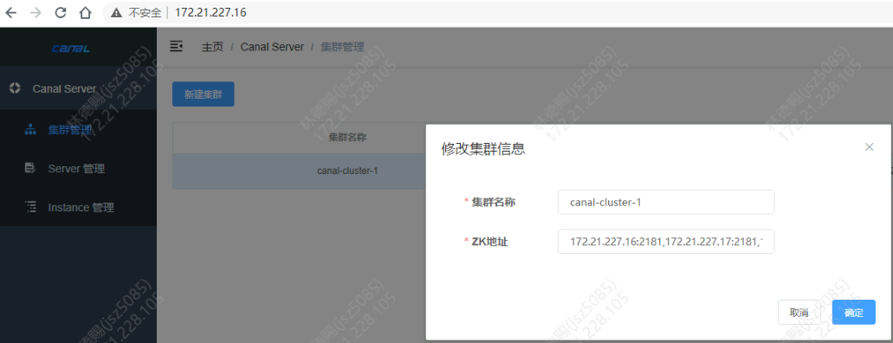
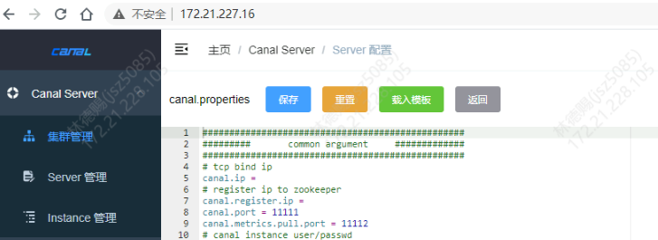
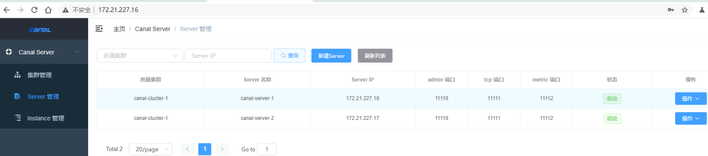
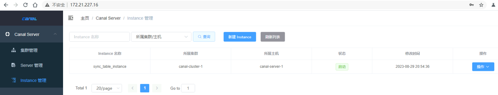

- [简介](#简介)
- [工作原理](#工作原理)
- [安装](#安装)
  - [Canal Admin QuickStart](#canal-admin-quickstart)
    - [背景](#背景)
    - [准备](#准备)
    - [部署](#部署)
  - [安装 canal server](#安装-canal-server)
    - [准备](#准备-1)
    - [部署](#部署-1)
    - [查看 zookeeper 中的信息](#查看-zookeeper-中的信息)
  - [创建 instance](#创建-instance)
- [查看 canal\_manager 表中信息](#查看-canal_manager-表中信息)
  - [表概览](#表概览)
  - [canal\_user 表](#canal_user-表)
  - [canal\_node\_server 表](#canal_node_server-表)
  - [canal\_instance\_config 表](#canal_instance_config-表)
  - [canal\_cluster 表](#canal_cluster-表)
  - [canal\_adapter\_config 表](#canal_adapter_config-表)
- [查看 canal\_tsdb 中的表](#查看-canal_tsdb-中的表)
  - [meta\_history 表](#meta_history-表)
  - [meta\_snapshot 表](#meta_snapshot-表)
- [zookeeper 新增了3个节点](#zookeeper-新增了3个节点)
- [MySQL 订阅消息 canal 格式说明](#mysql-订阅消息-canal-格式说明)
- [client-adapter 的使用](#client-adapter-的使用)
  - [基本说明](#基本说明)
  - [安装](#安装-1)
  - [设置配置文件](#设置配置文件)
- [官方压测报告](#官方压测报告)
- [问题集](#问题集)
  - [什么时候偏移量存储在 canal\_tsdb.meta\_history](#什么时候偏移量存储在-canal_tsdbmeta_history)
  - [KAFKA需要密码](#kafka需要密码)
  - [同步表的正则匹配](#同步表的正则匹配)

# 简介


主要用途是基于 MySQL 数据库增量日志解析，提供增量数据订阅和消费

# 工作原理

- canal 模拟 MySQL slave 的交互协议，伪装自己为 MySQL slave ，向 MySQL master 发送 dump 协议
- MySQL master 收到 dump 请求，开始推送 binary log 给 slave (即 canal )
- canal 解析 binary log 对象(原始为 byte 流)

# 安装

## Canal Admin QuickStart

### 背景

canal-admin设计上是为canal提供整体配置管理、节点运维等面向运维的功能，提供相对友好的WebUI操作界面，方便更多用户快速和安全的操作

### 准备

canal-admin的限定依赖：

- MySQL，用于存储配置和节点等相关数据
- canal版本，要求>=1.1.4 (需要依赖canal-server提供面向admin的动态运维管理接口)
- zookerper 集群

### 部署

1. 下载 canal-admin, 访问 release 页面 , 选择需要的包下载, 如以 1.1.5 版本为例

```sh
wget https://github.com/alibaba/canal/releases/download/canal-1.1.4/canal.admin-1.1.4.tar.gz
mkdir /data/canal-admin
tar zxvf canal.admin-$version.tar.gz  -C /data/canal-admin
```

2. 配置修改

```yml
vi /data/canal-admin/conf/application.yml
server:
  port: 8089                    # 服务器端口号
spring:
  jackson:
    date-format: yyyy-MM-dd HH:mm:ss    # Jackson日期格式
    time-zone: GMT+8            # Jackson时区

spring.datasource:
  address: 172.1.1.16:3306       # 数据库地址和端口
  database: canal_manager       # 数据库名称
  username: canal               #数据库用户名
  password: canal               # 数据库密码  
  driver-class-name: com.mysql.jdbc.Driver      # 数据库驱动类名
  url: jdbc:mysql://${spring.datasource.address}/${spring.datasource.database}?useUnicode=true&characterEncoding=UTF-8&useSSL=false          # 数据库连接URL
  hikari:
    maximum-pool-size: 30       # Hikari连接池最大连接数
    minimum-idle: 1             # Hikari连接池最小空闲连接数

canal:
  adminUser: admin              # Canal Admin用户名
  adminPasswd: admin            # Canal Admin密码
```

3. 初始化元数据库

```sql
mysql -h172.1.1.16 -uroot -p
# 导入初始化SQL
> source /data/canal-admin/conf/canal_manager.sql
CREATE USER 'canal'@'%' IDENTIFIED BY 'canal';
GRANT insert, delete, update, SELECT ON canal_manager.* TO 'canal'@'%';

# 初始化canal_tsdb数据库
create database canal_tsdb;
CREATE USER 'canal'@'%' IDENTIFIED BY 'canal';
GRANT all ON canal_tsdb.* TO 'canal'@'%';
```

4. 运维

```sh
cd /data/canal-admin/
# 启动
sh bin/startup.sh
# 关闭
sh bin/stop.sh
# 登录
 http://172.1.1.16:8089/ 访问，默认密码：admin/123456 
```

5. 新建集群
6. 载入模板，然后修改
   

```yaml
#################################################
######### 		common argument		#############
#################################################
# tcp bind ip
canal.ip =  # Canal 服务的 IP 地址。如果不配置，Canal 将使用所有可用的 IP 地址
# register ip to zookeeper
canal.register.ip = # Canal 注册到 Zookeeper 的 IP 地址。如果不配置，Canal 将使用 canal.ip 作为注册地址
canal.port = 11111  # Canal 服务的端口号
canal.metrics.pull.port = 11112 # Canal 的 metrics 端口号。该端口用于 Canal 的监控
# canal instance user/passwd
# canal.user = canal    # Canal 服务的用户名
# canal.passwd = E3619321C1A937C46A0D8BD1DAC39F93B27D4458   # Canal 服务的密码

# canal admin config
#canal.admin.manager = 127.0.0.1:8089
canal.admin.port = 11110    # Canal Admin 的端口号。Canal Admin 是一个 web 管理工具，用于管理 Canal 服务
canal.admin.user = admin    # Canal Admin 的用户名
canal.admin.passwd = 4ACFE3202A5FF5CF467898FC58AAB1D615029441   # Canal Admin 的密码
# admin auto register
#canal.admin.register.auto = true
#canal.admin.register.cluster =
#canal.admin.register.name =

canal.zkServers = 172.1.1.16:2181,172.1.1.17:2181,172.1.1.18:2181  # Canal 连接 Zookeeper 的地址列表
# flush data to zk
canal.zookeeper.flush.period = 1000 # Canal 每隔 canal.zookeeper.flush.period 毫秒将数据刷新到 Zookeeper
canal.withoutNetty = false  # 是否使用 Netty 作为网络框架。如果为 true，则使用 NIO 作为网络框架
# tcp, kafka, rocketMQ, rabbitMQ
canal.serverMode = kafka  # Canal 服务的模式。可以是 tcp、kafka、rocketMQ 或 rabbitMQ
# flush meta cursor/parse position to file
canal.file.data.dir = ${canal.conf.dir} # Canal 将 binlog 文件和元数据文件保存到该目录
canal.file.flush.period = 1000  # Canal 每隔 canal.file.flush.period 毫秒将数据刷新到文件
## memory store RingBuffer size, should be Math.pow(2,n)
canal.instance.memory.buffer.size = 16384   # Canal 内存中 RingBuffer 的大小。RingBuffer 用于缓存 binlog 数据
## memory store RingBuffer used memory unit size , default 1kb
canal.instance.memory.buffer.memunit = 1024 # Canal 内存中 RingBuffer 使用的内存单元大小
## meory store gets mode used MEMSIZE or ITEMSIZE
canal.instance.memory.batch.mode = MEMSIZE  # Canal 从 RingBuffer 中获取数据的模式。可以是 MEMSIZE 或 ITEMSIZE
canal.instance.memory.rawEntry = true   # 是否将 binlog 数据以原始格式存储在 RingBuffer 中。如果为 true，则将 binlog 数据以原始格式存储在 RingBuffer 中。否则，将 binlog 数据转换为 JSON 格式存储在 RingBuffer 中

## detecing config
canal.instance.detecting.enable = false # 是否启用 Canal 的检测功能。检测功能用于检测 Canal 连接是否正常
#canal.instance.detecting.sql = insert into retl.xdual values(1,now()) on duplicate key update x=now()
canal.instance.detecting.sql = select 1 # Canal 检测功能使用的 SQL 语句
canal.instance.detecting.interval.time = 3  # Canal 检测功能的执行间隔
canal.instance.detecting.retry.threshold = 3    # Canal 检测功能的最大重试次数
canal.instance.detecting.heartbeatHaEnable = false

# support maximum transaction size, more than the size of the transaction will be cut into multiple transactions delivery
canal.instance.transaction.size =  1024 # 支持最大事务大小，超过事务大小的事务将被切割成多个事务传输
# mysql fallback connected to new master should fallback times
canal.instance.fallbackIntervalInSeconds = 60     # Canal 连接失败后，Canal 将尝试重新连接的间隔时间（单位：秒）

# network config
canal.instance.network.receiveBufferSize = 16384    # Canal 接收数据的缓冲区大小
canal.instance.network.sendBufferSize = 16384   # Canal 发送数据的缓冲区大小
canal.instance.network.soTimeout = 30   # Canal 的连接超时时间（单位：毫秒）

# binlog filter config
canal.instance.filter.druid.ddl = true  # 是否过滤 Druid 的 DDL 语句
canal.instance.filter.query.dcl = false # 是否过滤查询 DCL 语句(跟授权相关)
canal.instance.filter.query.dml = false # 是否过滤查询 DML 语句
canal.instance.filter.query.ddl = false # 是否过滤查询 DDL 语句
canal.instance.filter.table.error = false   # 是否过滤表错误信息
canal.instance.filter.rows = false  # 是否过滤行数据
canal.instance.filter.transaction.entry = false # 是否过滤事务条目
canal.instance.filter.dml.insert = false    # 是否过滤 DML 的 INSERT 语句
canal.instance.filter.dml.update = false    # 是否过滤 DML 的 update 语句
canal.instance.filter.dml.delete = false    # 是否过滤 DML 的 delete 语句

# binlog format/image check
canal.instance.binlog.format = ROW,STATEMENT,MIXED  # Canal 服务解析 binlog 的格式，可以是 ROW、STATEMENT 或 MIXED
canal.instance.binlog.image = FULL,MINIMAL,NOBLOB   # Canal 服务解析 binlog 的 image 类型，可以是 FULL、MINIMAL 或 NOBLOB

# binlog ddl isolation
canal.instance.get.ddl.isolation = false    # Canal 服务是否在获取 DDL 语句时开启事务隔离，默认是

# parallel parser config
canal.instance.parser.parallel = true   # Canal 服务是否启用并行解析，默认是开启的
## concurrent thread number, default 60% available processors, suggest not to exceed Runtime.getRuntime().availableProcessors()
#canal.instance.parser.parallelThreadSize = 16  # Canal 服务并行解析时使用的线程数，默认是 CPU 核数的 60%
## disruptor ringbuffer size, must be power of 2
canal.instance.parser.parallelBufferSize = 256  # Canal 服务并行解析时使用的 RingBuffer 大小，默认是 256

# table meta tsdb info
canal.instance.tsdb.enable = true   # Canal 服务是否启用表元数据存储，默认是开启的
# canal.instance.tsdb.dir = ${canal.file.data.dir:../conf}/${canal.instance.destination:}
# canal.instance.tsdb.url = jdbc:h2:${canal.instance.tsdb.dir}/h2;CACHE_SIZE=1000;MODE=MYSQL;
canal.instance.tsdb.url = jdbc:mysql://172.1.1.16:3306/canal_tsdb    # Canal 服务表元数据存储的地址
canal.instance.tsdb.dbUsername = root   # Canal 服务表元数据存储的用户名
canal.instance.tsdb.dbPassword = root   # Canal 服务表元数据存储的密码
# dump snapshot interval, default 24 hour
canal.instance.tsdb.snapshot.interval = 24  # Canal 服务表元数据快照生成的间隔时间，默认是 24 小时
# purge snapshot expire , default 360 hour(15 days)
canal.instance.tsdb.snapshot.expire = 360   # Canal 服务表元数据快照的过期时间，默认是 15 天

#################################################
######### 		destinations		#############
#################################################
canal.destinations =    # Canal 服务要监听的 binlog 目标，可以是多个
# conf root dir
canal.conf.dir = ../conf    # Canal 服务配置文件所在的目录
# auto scan instance dir add/remove and start/stop instance
canal.auto.scan = true  # Canal 服务是否自动扫描 canal.destinations 配置文件，默认是开启的
canal.auto.scan.interval = 5    # Canal 服务自动扫描 canal.destinations 配置文件的间隔时间，默认是 5 秒
# set this value to 'true' means that when binlog pos not found, skip to latest.
# WARN: pls keep 'false' in production env, or if you know what you want.
canal.auto.reset.latest.pos.mode = false    # Canal 服务在 binlog 位置丢失时是否跳转到最新位置，默认是关闭的

# canal.instance.tsdb.spring.xml = classpath:spring/tsdb/h2-tsdb.xml
canal.instance.tsdb.spring.xml = classpath:spring/tsdb/mysql-tsdb.xml   # 设置TSDB的Spring配置文件为MySQL

canal.instance.global.mode = manager    # 设置Canal实例的模式为Manager
canal.instance.global.lazy = false  # 关闭懒加载模式，即在启动时立即初始化
canal.instance.global.manager.address = ${canal.admin.manager}  # 设置Manager模式下Canal Admin的地址
#canal.instance.global.spring.xml = classpath:spring/memory-instance.xml
#canal.instance.global.spring.xml = classpath:spring/file-instance.xml
canal.instance.global.spring.xml = classpath:spring/default-instance.xml    # 设置全局Spring配置文件为默认的实例配置

##################################################
######### 	      MQ Properties      #############
##################################################
# aliyun ak/sk , support rds/mq
canal.aliyun.accessKey =
canal.aliyun.secretKey =
canal.aliyun.uid=

canal.mq.flatMessage = true # 是否为flat json格式对象
canal.mq.canalBatchSize = 50    # Canal的batch size, 默认50K, 由于kafka最大消息体限制请勿超过1M(900K以下)
canal.mq.canalGetTimeout = 100  # Canal get数据的超时时间, 单位: 毫秒, 空为不限超时
# Set this value to "cloud", if you want open message trace feature in aliyun.
canal.mq.accessChannel = local

canal.mq.database.hash = true
canal.mq.send.thread.size = 30
canal.mq.build.thread.size = 8

##################################################
######### 		     Kafka 		     #############
##################################################
kafka.bootstrap.servers = 172.1.1.186:9092,172.1.1.187:9092,172.1.1.188:9092
kafka.acks = all
kafka.compression.type = none
kafka.batch.size = 16384
kafka.linger.ms = 1
kafka.max.request.size = 1048576
kafka.buffer.memory = 33554432
kafka.max.in.flight.requests.per.connection = 1
kafka.retries = 0

kafka.kerberos.enable = false
kafka.kerberos.krb5.file = "../conf/kerberos/krb5.conf"
kafka.kerberos.jaas.file = "../conf/kerberos/jaas.conf"

##################################################
######### 		    RocketMQ	     #############
##################################################
rocketmq.producer.group = test
rocketmq.enable.message.trace = false
rocketmq.customized.trace.topic =
rocketmq.namespace =
rocketmq.namesrv.addr = 127.0.0.1:9876
rocketmq.retry.times.when.send.failed = 0
rocketmq.vip.channel.enabled = false
rocketmq.tag = 

##################################################
######### 		    RabbitMQ	     #############
##################################################
rabbitmq.host =
rabbitmq.virtual.host =
rabbitmq.exchange =
rabbitmq.username =
rabbitmq.password =
rabbitmq.deliveryMode =
```

## 安装 canal server

### 准备

- 对于自建 MySQL , 需要先开启 Binlog 写入功能，配置 binlog-format 为 ROW 模式，my.cnf 中配置如下

```sh
[mysqld]
log-bin=mysql-bin # 开启 binlog
binlog-format=ROW # 选择 ROW 模式
server_id=1 # 配置 MySQL replaction 需要定义，不要和 canal 的 slaveId 重复
```

- 授权 canal 链接 MySQL 账号具有作为 MySQL slave 的权限, 如果已有账户可直接 grant

```sql
CREATE USER canal IDENTIFIED BY 'canal';  
GRANT SELECT, REPLICATION SLAVE, REPLICATION CLIENT ON *.* TO 'canal'@'%';
-- GRANT ALL PRIVILEGES ON *.* TO 'canal'@'%' ;
FLUSH PRIVILEGES;
```

### 部署

1. 下载 canal, 访问 release 页面 , 选择需要的包下载, 如以 1.1.5 版本为例

```sh
wget https://github.com/alibaba/canal/releases/download/canal-1.1.5/canal.deployer-1.1.5.tar.gz

mkdir /data/canal.deployer
tar zxvf canal.deployer-$version.tar.gz  -C /data/canal.deployer
```

2. 配置修改

```sh
cat /data/canal.deployer/conf/canal_local.properties 
# register ip
canal.register.ip =172.1.1.16

# canal admin config
canal.admin.manager = 172.1.1.16:8089
canal.admin.port = 11110
canal.admin.user = admin
canal.admin.passwd = 4ACFE3202A5FF5CF467898FC58AAB1D615029441
# admin auto register
canal.admin.register.auto = true
canal.admin.register.cluster = canal-cluster-1
canal.admin.register.name = canal-server-1
```

3. 启动

```sh
sh /data/canal.deployer/bin/startup.sh local
```



### 查看 zookeeper 中的信息

```json
/otter/canal/destinations/sync_table_instance/cluster
/otter/canal/destinations/sync_table_instance/running

/otter/canal/cluster/172.1.1.16:11111
/otter/canal/cluster/172.1.1.17:11111

get /otter/canal/destinations/sync_table_instance/running 
{"active":true,"address":"172.1.1.16:11111"}
# 其它节点的值全都是 null
```

## 创建 instance


其中 instance 配置

```yaml
#################################################
## mysql serverId , v1.0.26+ will autoGen
# canal.instance.mysql.slaveId=0 #mysql服务器ID，v1.0.26+将自动生成

# enable gtid use true/false
canal.instance.gtidon=false #是否启用gtid，使用true/false

# position info
canal.instance.master.address=172.1.1.17:3306 #主库地址
canal.instance.master.journal.name=mariadb-bin.000002 #主库日志名称
canal.instance.master.position=2212 #主库位置
canal.instance.master.timestamp= #主库时间戳
canal.instance.master.gtid= #主库gtid

# rds oss binlog
canal.instance.rds.accesskey= #rds oss binlog访问密钥
canal.instance.rds.secretkey= #rds oss binlog访问密钥
canal.instance.rds.instanceId= #rds oss binlog实例ID

# table meta tsdb info
canal.instance.tsdb.enable=true #是否启用表元tsdb信息
canal.instance.tsdb.url=jdbc:mysql://172.1.1.16:3306/canal_tsdb #表元tsdb信息URL
canal.instance.tsdb.dbUsername=root #表元tsdb信息数据库用户名
canal.instance.tsdb.dbPassword=root #表元tsdb信息数据库密码

#canal.instance.standby.address = #备用地址
#canal.instance.standby.journal.name = #备用日志名称
#canal.instance.standby.position = #备用位置
#canal.instance.standby.timestamp = #备用时间戳
#canal.instance.standby.gtid= #备用gtid

# username/password
canal.instance.dbUsername=canal #数据库用户名
canal.instance.dbPassword=canal #数据库密码
canal.instance.connectionCharset = UTF-8 #连接字符集
# enable druid Decrypt database password
canal.instance.enableDruid=false #是否启用druid解密数据库密码
#canal.instance.pwdPublicKey=MFwwDQYJKoZIhvcNAQEBBQADSwAwSAJBALK4BUxdDltRRE5/zXpVEVPUgunvscYFtEip3pmLlhrWpacX7y7GCMo2/JM6LeHmiiNdH1FWgGCpUfircSwlWKUCAwEAAQ==

# table regex
canal.instance.filter.regex=.*\\..* #表正则表达式
# table black regex
canal.instance.filter.black.regex= #表黑名单正则表达式
# table field filter(format: schema1.tableName1:field1/field2,schema2.tableName2:field1/field2)
#canal.instance.filter.field=test1.t_product:id/subject/keywords,test2.t_company:id/name/contact/ch #表字段过滤器（格式：schema1.tableName1:field1/field2,schema2.tableName2:field1/field2）
# table field black filter(format: schema1.tableName1:field1/field2,schema2.tableName2:field1/field2)
#canal.instance.filter.black.field=test1.t_product:subject/product_image,test2.t_company:id/name/contact/ch #表字段黑名单过滤器（格式：schema1.tableName1:field1/field2,schema2.tableName2:field1/field2）

# mq config
canal.mq.topic=example #mq配置主题
# dynamic topic route by schema or table regex
#canal.mq.dynamicTopic=mytest1.user,mytest2\\..*,.*\\..* #动态主题路由，通过模式或表正则表达式进行路由。 # 针对库名或者表名发送动态topic
canal.mq.partition=0 #mq分区号码。
# hash partition config
#canal.mq.partitionsNum=3 #哈希分区配置数量。
#canal.mq.partitionHash=test.table:id^name,.*\\..*  #哈希分区配置。#库名.表名: 唯一主键，多个表之间用逗号分隔
#################################################
```

# 查看 canal_manager 表中信息

## 表概览

```sql
mysql -h127.0.0.1 -P3306 -uroot -proot canal_manager

MariaDB [canal_manager]> show table status;
+-----------------------+--------+---------+------------+------+----------------+-------------+-----------------+--------------+-----------+----------------+---------------------+-------------+------------+-----------------+----------+----------------+---------+
| Name                  | Engine | Version | Row_format | Rows | Avg_row_length | Data_length | Max_data_length | Index_length | Data_free | Auto_increment | Create_time         | Update_time | Check_time | Collation       | Checksum | Create_options | Comment |
+-----------------------+--------+---------+------------+------+----------------+-------------+-----------------+--------------+-----------+----------------+---------------------+-------------+------------+-----------------+----------+----------------+---------+
| canal_adapter_config  | InnoDB |      10 | Compact    |    0 |              0 |       16384 |               0 |            0 |   9437184 |              1 | 2023-08-29 17:34:20 | NULL        | NULL       | utf8_general_ci |     NULL |                |         |
| canal_cluster         | InnoDB |      10 | Compact    |    1 |          16384 |       16384 |               0 |            0 |   9437184 |              2 | 2023-08-29 17:34:20 | NULL        | NULL       | utf8_general_ci |     NULL |                |         |
| canal_config          | InnoDB |      10 | Compact    |    1 |          16384 |       16384 |               0 |        16384 |   9437184 |              2 | 2023-08-29 17:34:20 | NULL        | NULL       | utf8_general_ci |     NULL |                |         |
| canal_instance_config | InnoDB |      10 | Compact    |    1 |          16384 |       16384 |               0 |        16384 |   9437184 |              2 | 2023-08-29 17:34:20 | NULL        | NULL       | utf8_general_ci |     NULL |                |         |
| canal_node_server     | InnoDB |      10 | Compact    |    2 |           8192 |       16384 |               0 |            0 |   9437184 |              3 | 2023-08-29 17:34:20 | NULL        | NULL       | utf8_general_ci |     NULL |                |         |
| canal_user            | InnoDB |      10 | Compact    |    1 |          16384 |       16384 |               0 |            0 |   9437184 |              2 | 2023-08-29 17:34:20 | NULL        | NULL       | utf8_general_ci |     NULL |                |         |
+-----------------------+--------+---------+------------+------+----------------+-------------+-----------------+--------------+-----------+----------------+---------------------+-------------+------------+-----------------+----------+----------------+---------+
6 rows in set (0.00 sec)
```

## canal_user 表

```sql
MariaDB [canal_manager]> select * from canal_user\G
*************************** 1. row ***************************
           id: 1
     username: admin
     password: 6BB4837EB74329105EE4568DDA7DC67ED2CA2AD9
         name: Canal Manager
        roles: admin
 introduction: NULL
       avatar: NULL
creation_date: 2019-07-14 00:05:28
1 row in set (0.00 sec)
```

## canal_node_server 表

```sql
MariaDB [canal_manager]> select * from canal_node_server\G
*************************** 1. row ***************************
           id: 1
   cluster_id: 1
         name: canal-server-1
           ip: 172.1.1.16
   admin_port: 11110
     tcp_port: 11111
  metric_port: 11112
       status: -1
modified_time: 2023-08-29 17:50:15
*************************** 2. row ***************************
           id: 2
   cluster_id: 1
         name: canal-server-2
           ip: 172.1.1.17
   admin_port: 11110
     tcp_port: 11111
  metric_port: 11112
       status: -1
modified_time: 2023-08-29 17:52:08
2 rows in set (0.00 sec)
```

## canal_instance_config 表

```sql
MariaDB [canal_manager]> select * from canal_instance_config\G
*************************** 1. row ***************************
           id: 1
   cluster_id: 1
    server_id: NULL
         name: sync_table_instance
       status: 1
      content: #################################################
## mysql serverId , v1.0.26+ will autoGen
# canal.instance.mysql.slaveId=0

# enable gtid use true/false
canal.instance.gtidon=false

# position info
canal.instance.master.address=172.1.1.17:3306
canal.instance.master.journal.name=mariadb-bin.000002
canal.instance.master.position=2212
canal.instance.master.timestamp=
canal.instance.master.gtid=

# rds oss binlog
canal.instance.rds.accesskey=
canal.instance.rds.secretkey=
canal.instance.rds.instanceId=

# table meta tsdb info
canal.instance.tsdb.enable=true
#canal.instance.tsdb.url=jdbc:mysql://127.0.0.1:3306/canal_tsdb
#canal.instance.tsdb.dbUsername=canal
#canal.instance.tsdb.dbPassword=canal

#canal.instance.standby.address =
#canal.instance.standby.journal.name =
#canal.instance.standby.position =
#canal.instance.standby.timestamp =
#canal.instance.standby.gtid=

# username/password
canal.instance.dbUsername=canal
canal.instance.dbPassword=canal
canal.instance.connectionCharset = UTF-8
# enable druid Decrypt database password
canal.instance.enableDruid=false
#canal.instance.pwdPublicKey=MFwwDQYJKoZIhvcNAQEBBQADSwAwSAJBALK4BUxdDltRRE5/zXpVEVPUgunvscYFtEip3pmLlhrWpacX7y7GCMo2/JM6LeHmiiNdH1FWgGCpUfircSwlWKUCAwEAAQ==

# table regex
canal.instance.filter.regex=.*\\..*
# table black regex
canal.instance.filter.black.regex=
# table field filter(format: schema1.tableName1:field1/field2,schema2.tableName2:field1/field2)
#canal.instance.filter.field=test1.t_product:id/subject/keywords,test2.t_company:id/name/contact/ch
# table field black filter(format: schema1.tableName1:field1/field2,schema2.tableName2:field1/field2)
#canal.instance.filter.black.field=test1.t_product:subject/product_image,test2.t_company:id/name/contact/ch

# mq config
canal.mq.topic=example
# dynamic topic route by schema or table regex
#canal.mq.dynamicTopic=mytest1.user,mytest2\\..*,.*\\..*
canal.mq.partition=0
# hash partition config
#canal.mq.partitionsNum=3
#canal.mq.partitionHash=test.table:id^name,.*\\..*
#################################################

  content_md5: 65a297cbfe84eada9a5a551d725b3076
modified_time: 2023-08-29 20:54:36
1 row in set (0.00 sec)
```

```sql
MariaDB [canal_manager]> select * from canal_config\G
*************************** 1. row ***************************
           id: 1
   cluster_id: 1
    server_id: NULL
         name: canal.properties
       status: NULL
      content: #################################################
#########               common argument         #############
#################################################
# tcp bind ip
canal.ip =
# register ip to zookeeper
canal.register.ip =
canal.port = 11111
canal.metrics.pull.port = 11112
# canal instance user/passwd
# canal.user = canal
# canal.passwd = E3619321C1A937C46A0D8BD1DAC39F93B27D4458

# canal admin config
#canal.admin.manager = 127.0.0.1:8089
canal.admin.port = 11110
canal.admin.user = admin
canal.admin.passwd = 4ACFE3202A5FF5CF467898FC58AAB1D615029441
# admin auto register
#canal.admin.register.auto = true
#canal.admin.register.cluster =
#canal.admin.register.name =

canal.zkServers = 172.1.1.16:2181,172.1.1.17:2181,172.1.1.18:2181
# flush data to zk
canal.zookeeper.flush.period = 1000
canal.withoutNetty = false
# tcp, kafka, rocketMQ, rabbitMQ
canal.serverMode = tcp
# flush meta cursor/parse position to file
canal.file.data.dir = ${canal.conf.dir}
canal.file.flush.period = 1000
## memory store RingBuffer size, should be Math.pow(2,n)
canal.instance.memory.buffer.size = 16384
## memory store RingBuffer used memory unit size , default 1kb
canal.instance.memory.buffer.memunit = 1024 
## meory store gets mode used MEMSIZE or ITEMSIZE
canal.instance.memory.batch.mode = MEMSIZE
canal.instance.memory.rawEntry = true

## detecing config
canal.instance.detecting.enable = false
#canal.instance.detecting.sql = insert into retl.xdual values(1,now()) on duplicate key update x=now()
canal.instance.detecting.sql = select 1
canal.instance.detecting.interval.time = 3
canal.instance.detecting.retry.threshold = 3
canal.instance.detecting.heartbeatHaEnable = false

# support maximum transaction size, more than the size of the transaction will be cut into multiple transactions delivery
canal.instance.transaction.size =  1024
# mysql fallback connected to new master should fallback times
canal.instance.fallbackIntervalInSeconds = 60

# network config
canal.instance.network.receiveBufferSize = 16384
canal.instance.network.sendBufferSize = 16384
canal.instance.network.soTimeout = 30

# binlog filter config
canal.instance.filter.druid.ddl = true
canal.instance.filter.query.dcl = false
canal.instance.filter.query.dml = false
canal.instance.filter.query.ddl = false
canal.instance.filter.table.error = false
canal.instance.filter.rows = false
canal.instance.filter.transaction.entry = false
canal.instance.filter.dml.insert = false
canal.instance.filter.dml.update = false
canal.instance.filter.dml.delete = false

# binlog format/image check
canal.instance.binlog.format = ROW,STATEMENT,MIXED 
canal.instance.binlog.image = FULL,MINIMAL,NOBLOB

# binlog ddl isolation
canal.instance.get.ddl.isolation = false

# parallel parser config
canal.instance.parser.parallel = true
## concurrent thread number, default 60% available processors, suggest not to exceed Runtime.getRuntime().availableProcessors()
#canal.instance.parser.parallelThreadSize = 16
## disruptor ringbuffer size, must be power of 2
canal.instance.parser.parallelBufferSize = 256

# table meta tsdb info
canal.instance.tsdb.enable = true
# canal.instance.tsdb.dir = ${canal.file.data.dir:../conf}/${canal.instance.destination:}
# canal.instance.tsdb.url = jdbc:h2:${canal.instance.tsdb.dir}/h2;CACHE_SIZE=1000;MODE=MYSQL;
canal.instance.tsdb.url = jdbc:mysql://172.1.1.16:3306/canal_tsdb
canal.instance.tsdb.dbUsername = root
canal.instance.tsdb.dbPassword = root
# dump snapshot interval, default 24 hour
canal.instance.tsdb.snapshot.interval = 24
# purge snapshot expire , default 360 hour(15 days)
canal.instance.tsdb.snapshot.expire = 360

#################################################
#########               destinations            #############
#################################################
canal.destinations = 
# conf root dir
canal.conf.dir = ../conf
# auto scan instance dir add/remove and start/stop instance
canal.auto.scan = true
canal.auto.scan.interval = 5
# set this value to 'true' means that when binlog pos not found, skip to latest.
# WARN: pls keep 'false' in production env, or if you know what you want.
canal.auto.reset.latest.pos.mode = false

# canal.instance.tsdb.spring.xml = classpath:spring/tsdb/h2-tsdb.xml
canal.instance.tsdb.spring.xml = classpath:spring/tsdb/mysql-tsdb.xml

canal.instance.global.mode = manager
canal.instance.global.lazy = false
canal.instance.global.manager.address = ${canal.admin.manager}
#canal.instance.global.spring.xml = classpath:spring/memory-instance.xml
#canal.instance.global.spring.xml = classpath:spring/file-instance.xml
canal.instance.global.spring.xml = classpath:spring/default-instance.xml

##################################################
#########             MQ Properties      #############
##################################################
# aliyun ak/sk , support rds/mq
canal.aliyun.accessKey =
canal.aliyun.secretKey =
canal.aliyun.uid=

canal.mq.flatMessage = true
canal.mq.canalBatchSize = 50    # Canal的batch size, 默认50K, 由于kafka最大消息体限制请勿超过1M(900K以下)
canal.mq.canalGetTimeout = 100  # Canal get数据的超时时间, 单位: 毫秒, 空为不限超时
# Set this value to "cloud", if you want open message trace feature in aliyun.
canal.mq.accessChannel = local

canal.mq.database.hash = true
canal.mq.send.thread.size = 30
canal.mq.build.thread.size = 8

##################################################
#########                    Kafka                   #############
##################################################
kafka.bootstrap.servers = 127.0.0.1:6667
kafka.acks = all
kafka.compression.type = none
kafka.batch.size = 16384
kafka.linger.ms = 1
kafka.max.request.size = 1048576
kafka.buffer.memory = 33554432
kafka.max.in.flight.requests.per.connection = 1
kafka.retries = 0

kafka.kerberos.enable = false
kafka.kerberos.krb5.file = "../conf/kerberos/krb5.conf"
kafka.kerberos.jaas.file = "../conf/kerberos/jaas.conf"

##################################################
#########                   RocketMQ         #############
##################################################
rocketmq.producer.group = test
rocketmq.enable.message.trace = false
rocketmq.customized.trace.topic =
rocketmq.namespace =
rocketmq.namesrv.addr = 127.0.0.1:9876
rocketmq.retry.times.when.send.failed = 0
rocketmq.vip.channel.enabled = false
rocketmq.tag = 

##################################################
#########                   RabbitMQ         #############
##################################################
rabbitmq.host =
rabbitmq.virtual.host =
rabbitmq.exchange =
rabbitmq.username =
rabbitmq.password =
rabbitmq.deliveryMode =
  content_md5: 29925aa5a28d9fa75b2b00637c929db6
modified_time: 2023-08-29 20:32:31
1 row in set (0.00 sec)
```

## canal_cluster 表

```sql
MariaDB [canal_manager]> select * from canal_cluster\G
*************************** 1. row ***************************
           id: 1
         name: canal-cluster-1
     zk_hosts: 172.1.1.16:2181,172.1.1.17:2181,172.1.1.18:2181
modified_time: 2023-08-29 17:43:51
1 row in set (0.00 sec)
```

## canal_adapter_config 表

```sql
MariaDB [canal_manager]> select * from canal_adapter_config\G
Empty set (0.00 sec)
```

# 查看 canal_tsdb 中的表

## meta_history 表

```sql
select * from meta_history\G
*************************** 1. row ***************************
              id: 1
      gmt_create: 2023-08-30 17:20:13
    gmt_modified: 2023-08-30 17:20:13
     destination: sync_table_instance
     binlog_file: mariadb-bin.000002
   binlog_offest: 2381
binlog_master_id: 1
binlog_timestamp: 1693386973000
      use_schema: test
      sql_schema: test
       sql_table: a
        sql_text: DROP TABLE `a` /* generated by server */
        sql_type: ERASE
           extra: NULL
1 row in set (0.01 sec)
```

## meta_snapshot 表

```sql
select * from meta_snapshot\G
*************************** 1. row ***************************
              id: 1
      gmt_create: 2023-08-29 20:54:41
    gmt_modified: 2023-08-29 20:54:41
     destination: sync_table_instance
     binlog_file: 0
   binlog_offest: 0
binlog_master_id: -1
binlog_timestamp: -2
            data: {"`mysql`":"CREATE TABLE `columns_priv` (\n\t`Host` char(60) COLLATE utf8_bin NOT NULL DEFAULT '',\n\t`Db` char(64) COLLATE utf8_bin NOT NULL DEFAULT '',\n\t`User` char(16) COLLATE utf8_bin NOT NULL DEFAULT '',\n\t`Table_name` char(64) COLLATE utf8_bin NOT NULL DEFAULT '',\n\t`Column_name` char(64) COLLATE utf8_bin NOT NULL DEFAULT '',\n\t`Timestamp` timestamp NOT NULL DEFAULT CURRENT_TIMESTAMP ON UPDATE CURRENT_TIMESTAMP,\n\t`Column_priv` set('Select', 'Insert', 'Update', 'References') CHARACTER SET utf8 NOT NULL DEFAULT '',\n\tPRIMARY KEY (`Host`, `Db`, `User`, `Table_name`, `Column_name`)\n) ENGINE = MyISAM CHARSET = utf8 COLLATE = utf8_bin COMMENT 'Column privileges'; \nCREATE TABLE `db` (\n\t`Host` char(60) COLLATE utf8_bin NOT NULL DEFAULT '',\n\t`Db` char(64) COLLATE utf8_bin NOT NULL DEFAULT '',\n\t`User` char(16) COLLATE utf8_bin NOT NULL DEFAULT '',\n\t`Select_priv` enum('N', 'Y') CHARACTER SET utf8 NOT NULL DEFAULT 'N',\n\t`Insert_priv` enum('N', 'Y') CHARACTER SET utf8 NOT NULL DEFAULT 'N',\n\t`Update_priv` enum('N', 'Y') CHARACTER SET utf8 NOT NULL DEFAULT 'N',\n\t`Delete_priv` enum('N', 'Y') CHARACTER SET utf8 NOT NULL DEFAULT 'N',\n\t`Create_priv` enum('N', 'Y') CHARACTER SET utf8 NOT NULL DEFAULT 'N',\n\t`Drop_priv` enum('N', 'Y') CHARACTER SET utf8 NOT NULL DEFAULT 'N',\n\t`Grant_priv` enum('N', 'Y') CHARACTER SET utf8 NOT NULL DEFAULT 'N',\n\t`References_priv` enum('N', 'Y') CHARACTER SET utf8 NOT NULL DEFAULT 'N',\n\t`Index_priv` enum('N', 'Y') CHARACTER SET utf8 NOT NULL DEFAULT 'N',\n\t`Alter_priv` enum('N', 'Y') CHARACTER SET utf8 NOT NULL DEFAULT 'N',\n\t`Create_tmp_table_priv` enum('N', 'Y') CHARACTER SET utf8 NOT NULL DEFAULT 'N',\n\t`Lock_tables_priv` enum('N', 'Y') CHARACTER SET utf8 NOT NULL DEFAULT 'N',\n\t`Create_view_priv` enum('N', 'Y') CHARACTER SET utf8 NOT NULL DEFAULT 'N',\n\t`Show_view_priv` enum('N', 'Y') CHARACTER SET utf8 NOT NULL DEFAULT 'N',\n\t`Create_routine_priv` enum('N', 'Y') CHARACTER SET utf8 NOT NULL DEFAULT 'N',\n\t`Alter_routine_priv` enum('N', 'Y') CHARACTER SET utf8 NOT NULL DEFAULT 'N',\n\t`Execute_priv` enum('N', 'Y') CHARACTER SET utf8 NOT NULL DEFAULT 'N',\n\t`Event_priv` enum('N', 'Y') CHARACTER SET utf8 NOT NULL DEFAULT 'N',\n\t`Trigger_priv` enum('N', 'Y') CHARACTER SET utf8 NOT NULL DEFAULT 'N',\n\tPRIMARY KEY (`Host`, `Db`, `User`),\n\tKEY `User` (`User`)\n) ENGINE = MyISAM CHARSET = utf8 COLLATE = utf8_bin COMMENT 'Database privileges'; \nCREATE TABLE `event` (\n\t`db` char(64) CHARACTER SET utf8 COLLATE utf8_bin NOT NULL DEFAULT '',\n\t`name` char(64) NOT NULL DEFAULT '',\n\t`body` longblob NOT NULL,\n\t`definer` char(77) CHARACTER SET utf8 COLLATE utf8_bin NOT NULL DEFAULT '',\n\t`execute_at` datetime DEFAULT NULL,\n\t`interval_value` int(11) DEFAULT NULL,\n\t`interval_field` enum('YEAR', 'QUARTER', 'MONTH', 'DAY', 'HOUR', 'MINUTE', 'WEEK', 'SECOND', 'MICROSECOND', 'YEAR_MONTH', 'DAY_HOUR', 'DAY_MINUTE', 'DAY_SECOND', 'HOUR_MINUTE', 'HOUR_SECOND', 'MINUTE_SECOND', 'DAY_MICROSECOND', 'HOUR_MICROSECOND', 'MINUTE_MICROSECOND', 'SECOND_MICROSECOND') DEFAULT NULL,\n\t`created` timestamp NOT NULL DEFAULT CURRENT_TIMESTAMP ON UPDATE CURRENT_TIMESTAMP,\n\t`modified` timestamp NOT NULL DEFAULT '0000-00-00 00:00:00',\n\t`last_executed` datetime DEFAULT NULL,\n\t`starts` datetime DEFAULT NULL,\n\t`ends` datetime DEFAULT NULL,\n\t`status` enum('ENABLED', 'DISABLED', 'SLAVESIDE_DISABLED') NOT NULL DEFAULT 'ENABLED',\n\t`on_completion` enum('DROP', 'PRESERVE') NOT NULL DEFAULT 'DROP',\n\t`sql_mode` set('REAL_AS_FLOAT', 'PIPES_AS_CONCAT', 'ANSI_QUOTES', 'IGNORE_SPACE', 'IGNORE_BAD_TABLE_OPTIONS', 'ONLY_FULL_GROUP_BY', 'NO_UNSIGNED_SUBTRACTION', 'NO_DIR_IN_CREATE', 'POSTGRESQL', 'ORACLE', 'MSSQL', 'DB2', 'MAXDB', 'NO_KEY_OPTIONS', 'NO_TABLE_OPTIONS', 'NO_FIELD_OPTIONS', 'MYSQL323', 'MYSQL40', 'ANSI', 'NO_AUTO_VALUE_ON_ZERO', 'NO_BACKSLASH_ESCAPES', 'STRICT_TRANS_TABLES', 'STRICT_ALL_TABLES', 'NO_ZERO_IN_DATE', 'NO_ZERO_DATE', 'INVALID_DATES', 'ERROR_FOR_DIVISION_BY_ZERO', 'TRADITIONAL', 'NO_AUTO_CREATE_USER', 'HIGH_NOT_PRECEDENCE', 'NO_ENGINE_SUBSTITUTION', 'PAD_CHAR_TO_FULL_LENGTH') NOT NULL DEFAULT '',\n\t`comment` char(64) CHARACTER SET utf8 COLLATE utf8_bin NOT NULL DEFAULT '',\n\t`originator` int(10) UNSIGNED NOT NULL,\n\t`time_zone` char(64) CHARACTER SET latin1 NOT NULL DEFAULT 'SYSTEM',\n\t`character_set_client` char(32) CHARACTER SET utf8 COLLATE utf8_bin DEFAULT NULL,\n\t`collation_connection` char(32) CHARACTER SET utf8 COLLATE utf8_bin DEFAULT NULL,\n\t`db_collation` char(32) CHARACTER SET utf8 COLLATE utf8_bin DEFAULT NULL,\n\t`body_utf8` longblob,\n\tPRIMARY KEY (`db`, `name`)\n) ENGINE = MyISAM CHARSET = utf8 COMMENT 'Events'; \nCREATE TABLE `func` (\n\t`name` char(64) COLLATE utf8_bin NOT NULL DEFAULT '',\n\t`ret` tinyint(1) NOT NULL DEFAULT '0',\n\t`dl` char(128) COLLATE utf8_bin NOT NULL DEFAULT '',\n\t`type` enum('function', 'aggregate') CHARACTER SET utf8 NOT NULL,\n\tPRIMARY KEY (`name`)\n) ENGINE = MyISAM CHARSET = utf8 COLLATE = utf8_bin COMMENT 'User defined functions'; \nCREATE TABLE `general_log` (\n\t`event_time` timestamp(6) NOT NULL DEFAULT CURRENT_TIMESTAMP ON UPDATE CURRENT_TIMESTAMP,\n\t`user_host` mediumtext NOT NULL,\n\t`thread_id` int(11) NOT NULL,\n\t`server_id` int(10) UNSIGNED NOT NULL,\n\t`command_type` varchar(64) NOT NULL,\n\t`argument` mediumtext NOT NULL\n) ENGINE = CSV CHARSET = utf8 COMMENT 'General log'; \nCREATE TABLE `help_category` (\n\t`help_category_id` smallint(5) UNSIGNED NOT NULL,\n\t`name` char(64) NOT NULL,\n\t`parent_category_id` smallint(5) UNSIGNED DEFAULT NULL,\n\t`url` text NOT NULL,\n\tPRIMARY KEY (`help_category_id`),\n\tUNIQUE KEY `name` (`name`)\n) ENGINE = MyISAM CHARSET = utf8 COMMENT 'help categories'; \nCREATE TABLE `help_keyword` (\n\t`help_keyword_id` int(10) UNSIGNED NOT NULL,\n\t`name` char(64) NOT NULL,\n\tPRIMARY KEY (`help_keyword_id`),\n\tUNIQUE KEY `name` (`name`)\n) ENGINE = MyISAM CHARSET = utf8 COMMENT 'help keywords'; \nCREATE TABLE `help_relation` (\n\t`help_topic_id` int(10) UNSIGNED NOT NULL,\n\t`help_keyword_id` int(10) UNSIGNED NOT NULL,\n\tPRIMARY KEY (`help_keyword_id`, `help_topic_id`)\n) ENGINE = MyISAM CHARSET = utf8 COMMENT 'keyword-topic relation'; \nCREATE TABLE `help_topic` (\n\t`help_topic_id` int(10) UNSIGNED NOT NULL,\n\t`name` char(64) NOT NULL,\n\t`help_category_id` smallint(5) UNSIGNED NOT NULL,\n\t`description` text NOT NULL,\n\t`example` text NOT NULL,\n\t`url` text NOT NULL,\n\tPRIMARY KEY (`help_topic_id`),\n\tUNIQUE KEY `name` (`name`)\n) ENGINE = MyISAM CHARSET = utf8 COMMENT 'help topics'; \nCREATE TABLE `host` (\n\t`Host` char(60) COLLATE utf8_bin NOT NULL DEFAULT '',\n\t`Db` char(64) COLLATE utf8_bin NOT NULL DEFAULT '',\n\t`Select_priv` enum('N', 'Y') CHARACTER SET utf8 NOT NULL DEFAULT 'N',\n\t`Insert_priv` enum('N', 'Y') CHARACTER SET utf8 NOT NULL DEFAULT 'N',\n\t`Update_priv` enum('N', 'Y') CHARACTER SET utf8 NOT NULL DEFAULT 'N',\n\t`Delete_priv` enum('N', 'Y') CHARACTER SET utf8 NOT NULL DEFAULT 'N',\n\t`Create_priv` enum('N', 'Y') CHARACTER SET utf8 NOT NULL DEFAULT 'N',\n\t`Drop_priv` enum('N', 'Y') CHARACTER SET utf8 NOT NULL DEFAULT 'N',\n\t`Grant_priv` enum('N', 'Y') CHARACTER SET utf8 NOT NULL DEFAULT 'N',\n\t`References_priv` enum('N', 'Y') CHARACTER SET utf8 NOT NULL DEFAULT 'N',\n\t`Index_priv` enum('N', 'Y') CHARACTER SET utf8 NOT NULL DEFAULT 'N',\n\t`Alter_priv` enum('N', 'Y') CHARACTER SET utf8 NOT NULL DEFAULT 'N',\n\t`Create_tmp_table_priv` enum('N', 'Y') CHARACTER SET utf8 NOT NULL DEFAULT 'N',\n\t`Lock_tables_priv` enum('N', 'Y') CHARACTER SET utf8 NOT NULL DEFAULT 'N',\n\t`Create_view_priv` enum('N', 'Y') CHARACTER SET utf8 NOT NULL DEFAULT 'N',\n\t`Show_view_priv` enum('N', 'Y') CHARACTER SET utf8 NOT NULL DEFAULT 'N',\n\t`Create_routine_priv` enum('N', 'Y') CHARACTER SET utf8 NOT NULL DEFAULT 'N',\n\t`Alter_routine_priv` enum('N', 'Y') CHARACTER SET utf8 NOT NULL DEFAULT 'N',\n\t`Execute_priv` enum('N', 'Y') CHARACTER SET utf8 NOT NULL DEFAULT 'N',\n\t`Trigger_priv` enum('N', 'Y') CHARACTER SET utf8 NOT NULL DEFAULT 'N',\n\tPRIMARY KEY (`Host`, `Db`)\n) ENGINE = MyISAM CHARSET = utf8 COLLATE = utf8_bin COMMENT 'Host privileges;  Merged with database privileges'; \nCREATE TABLE `ndb_binlog_index` (\n\t`Position` bigint(20) UNSIGNED NOT NULL,\n\t`File` varchar(255) NOT NULL,\n\t`epoch` bigint(20) UNSIGNED NOT NULL,\n\t`inserts` bigint(20) UNSIGNED NOT NULL,\n\t`updates` bigint(20) UNSIGNED NOT NULL,\n\t`deletes` bigint(20) UNSIGNED NOT NULL,\n\t`schemaops` bigint(20) UNSIGNED NOT NULL,\n\tPRIMARY KEY (`epoch`)\n) ENGINE = MyISAM CHARSET = latin1; \nCREATE TABLE `plugin` (\n\t`name` varchar(64) NOT NULL DEFAULT '',\n\t`dl` varchar(128) NOT NULL DEFAULT '',\n\tPRIMARY KEY (`name`)\n) ENGINE = MyISAM CHARSET = utf8 COMMENT 'MySQL plugins'; \nCREATE TABLE `proc` (\n\t`db` char(64) CHARACTER SET utf8 COLLATE utf8_bin NOT NULL DEFAULT '',\n\t`name` char(64) NOT NULL DEFAULT '',\n\t`type` enum('FUNCTION', 'PROCEDURE') NOT NULL,\n\t`specific_name` char(64) NOT NULL DEFAULT '',\n\t`language` enum('SQL') NOT NULL DEFAULT 'SQL',\n\t`sql_data_access` enum('CONTAINS_SQL', 'NO_SQL', 'READS_SQL_DATA', 'MODIFIES_SQL_DATA') NOT NULL DEFAULT 'CONTAINS_SQL',\n\t`is_deterministic` enum('YES', 'NO') NOT NULL DEFAULT 'NO',\n\t`security_type` enum('INVOKER', 'DEFINER') NOT NULL DEFAULT 'DEFINER',\n\t`param_list` blob NOT NULL,\n\t`returns` longblob NOT NULL,\n\t`body` longblob NOT NULL,\n\t`definer` char(77) CHARACTER SET utf8 COLLATE utf8_bin NOT NULL DEFAULT '',\n\t`created` timestamp NOT NULL DEFAULT CURRENT_TIMESTAMP ON UPDATE CURRENT_TIMESTAMP,\n\t`modified` timestamp NOT NULL DEFAULT '0000-00-00 00:00:00',\n\t`sql_mode` set('REAL_AS_FLOAT', 'PIPES_AS_CONCAT', 'ANSI_QUOTES', 'IGNORE_SPACE', 'IGNORE_BAD_TABLE_OPTIONS', 'ONLY_FULL_GROUP_BY', 'NO_UNSIGNED_SUBTRACTION', 'NO_DIR_IN_CREATE', 'POSTGRESQL', 'ORACLE', 'MSSQL', 'DB2', 'MAXDB', 'NO_KEY_OPTIONS', 'NO_TABLE_OPTIONS', 'NO_FIELD_OPTIONS', 'MYSQL323', 'MYSQL40', 'ANSI', 'NO_AUTO_VALUE_ON_ZERO', 'NO_BACKSLASH_ESCAPES', 'STRICT_TRANS_TABLES', 'STRICT_ALL_TABLES', 'NO_ZERO_IN_DATE', 'NO_ZERO_DATE', 'INVALID_DATES', 'ERROR_FOR_DIVISION_BY_ZERO', 'TRADITIONAL', 'NO_AUTO_CREATE_USER', 'HIGH_NOT_PRECEDENCE', 'NO_ENGINE_SUBSTITUTION', 'PAD_CHAR_TO_FULL_LENGTH') NOT NULL DEFAULT '',\n\t`comment` text CHARACTER SET utf8 COLLATE utf8_bin NOT NULL,\n\t`character_set_client` char(32) CHARACTER SET utf8 COLLATE utf8_bin DEFAULT NULL,\n\t`collation_connection` char(32) CHARACTER SET utf8 COLLATE utf8_bin DEFAULT NULL,\n\t`db_collation` char(32) CHARACTER SET utf8 COLLATE utf8_bin DEFAULT NULL,\n\t`body_utf8` longblob,\n\tPRIMARY KEY (`db`, `name`, `type`)\n) ENGINE = MyISAM CHARSET = utf8 COMMENT 'Stored Procedures'; \nCREATE TABLE `procs_priv` (\n\t`Host` char(60) COLLATE utf8_bin NOT NULL DEFAULT '',\n\t`Db` char(64) COLLATE utf8_bin NOT NULL DEFAULT '',\n\t`User` char(16) COLLATE utf8_bin NOT NULL DEFAULT '',\n\t`Routine_name` char(64) CHARACTER SET utf8 NOT NULL DEFAULT '',\n\t`Routine_type` enum('FUNCTION', 'PROCEDURE') COLLATE utf8_bin NOT NULL,\n\t`Grantor` char(77) COLLATE utf8_bin NOT NULL DEFAULT '',\n\t`Proc_priv` set('Execute', 'Alter Routine', 'Grant') CHARACTER SET utf8 NOT NULL DEFAULT '',\n\t`Timestamp` timestamp NOT NULL DEFAULT CURRENT_TIMESTAMP ON UPDATE CURRENT_TIMESTAMP,\n\tPRIMARY KEY (`Host`, `Db`, `User`, `Routine_name`, `Routine_type`),\n\tKEY `Grantor` (`Grantor`)\n) ENGINE = MyISAM CHARSET = utf8 COLLATE = utf8_bin COMMENT 'Procedure privileges'; \nCREATE TABLE `proxies_priv` (\n\t`Host` char(60) COLLATE utf8_bin NOT NULL DEFAULT '',\n\t`User` char(16) COLLATE utf8_bin NOT NULL DEFAULT '',\n\t`Proxied_host` char(60) COLLATE utf8_bin NOT NULL DEFAULT '',\n\t`Proxied_user` char(16) COLLATE utf8_bin NOT NULL DEFAULT '',\n\t`With_grant` tinyint(1) NOT NULL DEFAULT '0',\n\t`Grantor` char(77) COLLATE utf8_bin NOT NULL DEFAULT '',\n\t`Timestamp` timestamp NOT NULL DEFAULT CURRENT_TIMESTAMP ON UPDATE CURRENT_TIMESTAMP,\n\tPRIMARY KEY (`Host`, `User`, `Proxied_host`, `Proxied_user`),\n\tKEY `Grantor` (`Grantor`)\n) ENGINE = MyISAM CHARSET = utf8 COLLATE = utf8_bin COMMENT 'User proxy privileges'; \nCREATE TABLE `servers` (\n\t`Server_name` char(64) NOT NULL DEFAULT '',\n\t`Host` char(64) NOT NULL DEFAULT '',\n\t`Db` char(64) NOT NULL DEFAULT '',\n\t`Username` char(64) NOT NULL DEFAULT '',\n\t`Password` char(64) NOT NULL DEFAULT '',\n\t`Port` int(4) NOT NULL DEFAULT '0',\n\t`Socket` char(64) NOT NULL DEFAULT '',\n\t`Wrapper` char(64) NOT NULL DEFAULT '',\n\t`Owner` char(64) NOT NULL DEFAULT '',\n\tPRIMARY KEY (`Server_name`)\n) ENGINE = MyISAM CHARSET = utf8 COMMENT 'MySQL Foreign Servers table'; \nCREATE TABLE `slow_log` (\n\t`start_time` timestamp(6) NOT NULL DEFAULT CURRENT_TIMESTAMP ON UPDATE CURRENT_TIMESTAMP,\n\t`user_host` mediumtext NOT NULL,\n\t`query_time` time(6) NOT NULL,\n\t`lock_time` time(6) NOT NULL,\n\t`rows_sent` int(11) NOT NULL,\n\t`rows_examined` int(11) NOT NULL,\n\t`db` varchar(512) NOT NULL,\n\t`last_insert_id` int(11) NOT NULL,\n\t`insert_id` int(11) NOT NULL,\n\t`server_id` int(10) UNSIGNED NOT NULL,\n\t`sql_text` mediumtext NOT NULL\n) ENGINE = CSV CHARSET = utf8 COMMENT 'Slow log'; \nCREATE TABLE `tables_priv` (\n\t`Host` char(60) COLLATE utf8_bin NOT NULL DEFAULT '',\n\t`Db` char(64) COLLATE utf8_bin NOT NULL DEFAULT '',\n\t`User` char(16) COLLATE utf8_bin NOT NULL DEFAULT '',\n\t`Table_name` char(64) COLLATE utf8_bin NOT NULL DEFAULT '',\n\t`Grantor` char(77) COLLATE utf8_bin NOT NULL DEFAULT '',\n\t`Timestamp` timestamp NOT NULL DEFAULT CURRENT_TIMESTAMP ON UPDATE CURRENT_TIMESTAMP,\n\t`Table_priv` set('Select', 'Insert', 'Update', 'Delete', 'Create', 'Drop', 'Grant', 'References', 'Index', 'Alter', 'Create View', 'Show view', 'Trigger') CHARACTER SET utf8 NOT NULL DEFAULT '',\n\t`Column_priv` set('Select', 'Insert', 'Update', 'References') CHARACTER SET utf8 NOT NULL DEFAULT '',\n\tPRIMARY KEY (`Host`, `Db`, `User`, `Table_name`),\n\tKEY `Grantor` (`Grantor`)\n) ENGINE = MyISAM CHARSET = utf8 COLLATE = utf8_bin COMMENT 'Table privileges'; \nCREATE TABLE `time_zone` (\n\t`Time_zone_id` int(10) UNSIGNED NOT NULL AUTO_INCREMENT,\n\t`Use_leap_seconds` enum('Y', 'N') NOT NULL DEFAULT 'N',\n\tPRIMARY KEY (`Time_zone_id`)\n) ENGINE = MyISAM CHARSET = utf8 COMMENT 'Time zones'; \nCREATE TABLE `time_zone_leap_second` (\n\t`Transition_time` bigint(20) NOT NULL,\n\t`Correction` int(11) NOT NULL,\n\tPRIMARY KEY (`Transition_time`)\n) ENGINE = MyISAM CHARSET = utf8 COMMENT 'Leap seconds information for time zones'; \nCREATE TABLE `time_zone_name` (\n\t`Name` char(64) NOT NULL,\n\t`Time_zone_id` int(10) UNSIGNED NOT NULL,\n\tPRIMARY KEY (`Name`)\n) ENGINE = MyISAM CHARSET = utf8 COMMENT 'Time zone names'; \nCREATE TABLE `time_zone_transition` (\n\t`Time_zone_id` int(10) UNSIGNED NOT NULL,\n\t`Transition_time` bigint(20) NOT NULL,\n\t`Transition_type_id` int(10) UNSIGNED NOT NULL,\n\tPRIMARY KEY (`Time_zone_id`, `Transition_time`)\n) ENGINE = MyISAM CHARSET = utf8 COMMENT 'Time zone transitions'; \nCREATE TABLE `time_zone_transition_type` (\n\t`Time_zone_id` int(10) UNSIGNED NOT NULL,\n\t`Transition_type_id` int(10) UNSIGNED NOT NULL,\n\t`Offset` int(11) NOT NULL DEFAULT '0',\n\t`Is_DST` tinyint(3) UNSIGNED NOT NULL DEFAULT '0',\n\t`Abbreviation` char(8) NOT NULL DEFAULT '',\n\tPRIMARY KEY (`Time_zone_id`, `Transition_type_id`)\n) ENGINE = MyISAM CHARSET = utf8 COMMENT 'Time zone transition types'; \nCREATE TABLE `user` (\n\t`Host` char(60) COLLATE utf8_bin NOT NULL DEFAULT '',\n\t`User` char(16) COLLATE utf8_bin NOT NULL DEFAULT '',\n\t`Password` char(41) CHARACTER SET latin1 COLLATE latin1_bin NOT NULL DEFAULT '',\n\t`Select_priv` enum('N', 'Y') CHARACTER SET utf8 NOT NULL DEFAULT 'N',\n\t`Insert_priv` enum('N', 'Y') CHARACTER SET utf8 NOT NULL DEFAULT 'N',\n\t`Update_priv` enum('N', 'Y') CHARACTER SET utf8 NOT NULL DEFAULT 'N',\n\t`Delete_priv` enum('N', 'Y') CHARACTER SET utf8 NOT NULL DEFAULT 'N',\n\t`Create_priv` enum('N', 'Y') CHARACTER SET utf8 NOT NULL DEFAULT 'N',\n\t`Drop_priv` enum('N', 'Y') CHARACTER SET utf8 NOT NULL DEFAULT 'N',\n\t`Reload_priv` enum('N', 'Y') CHARACTER SET utf8 NOT NULL DEFAULT 'N',\n\t`Shutdown_priv` enum('N', 'Y') CHARACTER SET utf8 NOT NULL DEFAULT 'N',\n\t`Process_priv` enum('N', 'Y') CHARACTER SET utf8 NOT NULL DEFAULT 'N',\n\t`File_priv` enum('N', 'Y') CHARACTER SET utf8 NOT NULL DEFAULT 'N',\n\t`Grant_priv` enum('N', 'Y') CHARACTER SET utf8 NOT NULL DEFAULT 'N',\n\t`References_priv` enum('N', 'Y') CHARACTER SET utf8 NOT NULL DEFAULT 'N',\n\t`Index_priv` enum('N', 'Y') CHARACTER SET utf8 NOT NULL DEFAULT 'N',\n\t`Alter_priv` enum('N', 'Y') CHARACTER SET utf8 NOT NULL DEFAULT 'N',\n\t`Show_db_priv` enum('N', 'Y') CHARACTER SET utf8 NOT NULL DEFAULT 'N',\n\t`Super_priv` enum('N', 'Y') CHARACTER SET utf8 NOT NULL DEFAULT 'N',\n\t`Create_tmp_table_priv` enum('N', 'Y') CHARACTER SET utf8 NOT NULL DEFAULT 'N',\n\t`Lock_tables_priv` enum('N', 'Y') CHARACTER SET utf8 NOT NULL DEFAULT 'N',\n\t`Execute_priv` enum('N', 'Y') CHARACTER SET utf8 NOT NULL DEFAULT 'N',\n\t`Repl_slave_priv` enum('N', 'Y') CHARACTER SET utf8 NOT NULL DEFAULT 'N',\n\t`Repl_client_priv` enum('N', 'Y') CHARACTER SET utf8 NOT NULL DEFAULT 'N',\n\t`Create_view_priv` enum('N', 'Y') CHARACTER SET utf8 NOT NULL DEFAULT 'N',\n\t`Show_view_priv` enum('N', 'Y') CHARACTER SET utf8 NOT NULL DEFAULT 'N',\n\t`Create_routine_priv` enum('N', 'Y') CHARACTER SET utf8 NOT NULL DEFAULT 'N',\n\t`Alter_routine_priv` enum('N', 'Y') CHARACTER SET utf8 NOT NULL DEFAULT 'N',\n\t`Create_user_priv` enum('N', 'Y') CHARACTER SET utf8 NOT NULL DEFAULT 'N',\n\t`Event_priv` enum('N', 'Y') CHARACTER SET utf8 NOT NULL DEFAULT 'N',\n\t`Trigger_priv` enum('N', 'Y') CHARACTER SET utf8 NOT NULL DEFAULT 'N',\n\t`Create_tablespace_priv` enum('N', 'Y') CHARACTER SET utf8 NOT NULL DEFAULT 'N',\n\t`ssl_type` enum('', 'ANY', 'X509', 'SPECIFIED') CHARACTER SET utf8 NOT NULL DEFAULT '',\n\t`ssl_cipher` blob NOT NULL,\n\t`x509_issuer` blob NOT NULL,\n\t`x509_subject` blob NOT NULL,\n\t`max_questions` int(11) UNSIGNED NOT NULL DEFAULT '0',\n\t`max_updates` int(11) UNSIGNED NOT NULL DEFAULT '0',\n\t`max_connections` int(11) UNSIGNED NOT NULL DEFAULT '0',\n\t`max_user_connections` int(11) NOT NULL DEFAULT '0',\n\t`plugin` char(64) CHARACTER SET latin1 NOT NULL DEFAULT '',\n\t`authentication_string` text COLLATE utf8_bin NOT NULL,\n\tPRIMARY KEY (`Host`, `User`)\n) ENGINE = MyISAM CHARSET = utf8 COLLATE = utf8_bin COMMENT 'Users and global privileges'; \n","`performance_schema`":"CREATE TABLE `cond_instances` (\n\t`NAME` varchar(128) NOT NULL,\n\t`OBJECT_INSTANCE_BEGIN` bigint(20) NOT NULL\n) ENGINE = PERFORMANCE_SCHEMA CHARSET = utf8; \nCREATE TABLE `events_waits_current` (\n\t`THREAD_ID` int(11) NOT NULL,\n\t`EVENT_ID` bigint(20) UNSIGNED NOT NULL,\n\t`EVENT_NAME` varchar(128) NOT NULL,\n\t`SOURCE` varchar(64) DEFAULT NULL,\n\t`TIMER_START` bigint(20) UNSIGNED DEFAULT NULL,\n\t`TIMER_END` bigint(20) UNSIGNED DEFAULT NULL,\n\t`TIMER_WAIT` bigint(20) UNSIGNED DEFAULT NULL,\n\t`SPINS` int(10) UNSIGNED DEFAULT NULL,\n\t`OBJECT_SCHEMA` varchar(64) DEFAULT NULL,\n\t`OBJECT_NAME` varchar(512) DEFAULT NULL,\n\t`OBJECT_TYPE` varchar(64) DEFAULT NULL,\n\t`OBJECT_INSTANCE_BEGIN` bigint(20) NOT NULL,\n\t`NESTING_EVENT_ID` bigint(20) UNSIGNED DEFAULT NULL,\n\t`OPERATION` varchar(16) NOT NULL,\n\t`NUMBER_OF_BYTES` bigint(20) UNSIGNED DEFAULT NULL,\n\t`FLAGS` int(10) UNSIGNED DEFAULT NULL\n) ENGINE = PERFORMANCE_SCHEMA CHARSET = utf8; \nCREATE TABLE `events_waits_history` (\n\t`THREAD_ID` int(11) NOT NULL,\n\t`EVENT_ID` bigint(20) UNSIGNED NOT NULL,\n\t`EVENT_NAME` varchar(128) NOT NULL,\n\t`SOURCE` varchar(64) DEFAULT NULL,\n\t`TIMER_START` bigint(20) UNSIGNED DEFAULT NULL,\n\t`TIMER_END` bigint(20) UNSIGNED DEFAULT NULL,\n\t`TIMER_WAIT` bigint(20) UNSIGNED DEFAULT NULL,\n\t`SPINS` int(10) UNSIGNED DEFAULT NULL,\n\t`OBJECT_SCHEMA` varchar(64) DEFAULT NULL,\n\t`OBJECT_NAME` varchar(512) DEFAULT NULL,\n\t`OBJECT_TYPE` varchar(64) DEFAULT NULL,\n\t`OBJECT_INSTANCE_BEGIN` bigint(20) NOT NULL,\n\t`NESTING_EVENT_ID` bigint(20) UNSIGNED DEFAULT NULL,\n\t`OPERATION` varchar(16) NOT NULL,\n\t`NUMBER_OF_BYTES` bigint(20) UNSIGNED DEFAULT NULL,\n\t`FLAGS` int(10) UNSIGNED DEFAULT NULL\n) ENGINE = PERFORMANCE_SCHEMA CHARSET = utf8; \nCREATE TABLE `events_waits_history_long` (\n\t`THREAD_ID` int(11) NOT NULL,\n\t`EVENT_ID` bigint(20) UNSIGNED NOT NULL,\n\t`EVENT_NAME` varchar(128) NOT NULL,\n\t`SOURCE` varchar(64) DEFAULT NULL,\n\t`TIMER_START` bigint(20) UNSIGNED DEFAULT NULL,\n\t`TIMER_END` bigint(20) UNSIGNED DEFAULT NULL,\n\t`TIMER_WAIT` bigint(20) UNSIGNED DEFAULT NULL,\n\t`SPINS` int(10) UNSIGNED DEFAULT NULL,\n\t`OBJECT_SCHEMA` varchar(64) DEFAULT NULL,\n\t`OBJECT_NAME` varchar(512) DEFAULT NULL,\n\t`OBJECT_TYPE` varchar(64) DEFAULT NULL,\n\t`OBJECT_INSTANCE_BEGIN` bigint(20) NOT NULL,\n\t`NESTING_EVENT_ID` bigint(20) UNSIGNED DEFAULT NULL,\n\t`OPERATION` varchar(16) NOT NULL,\n\t`NUMBER_OF_BYTES` bigint(20) UNSIGNED DEFAULT NULL,\n\t`FLAGS` int(10) UNSIGNED DEFAULT NULL\n) ENGINE = PERFORMANCE_SCHEMA CHARSET = utf8; \nCREATE TABLE `events_waits_summary_by_instance` (\n\t`EVENT_NAME` varchar(128) NOT NULL,\n\t`OBJECT_INSTANCE_BEGIN` bigint(20) NOT NULL,\n\t`COUNT_STAR` bigint(20) UNSIGNED NOT NULL,\n\t`SUM_TIMER_WAIT` bigint(20) UNSIGNED NOT NULL,\n\t`MIN_TIMER_WAIT` bigint(20) UNSIGNED NOT NULL,\n\t`AVG_TIMER_WAIT` bigint(20) UNSIGNED NOT NULL,\n\t`MAX_TIMER_WAIT` bigint(20) UNSIGNED NOT NULL\n) ENGINE = PERFORMANCE_SCHEMA CHARSET = utf8; \nCREATE TABLE `events_waits_summary_by_thread_by_event_name` (\n\t`THREAD_ID` int(11) NOT NULL,\n\t`EVENT_NAME` varchar(128) NOT NULL,\n\t`COUNT_STAR` bigint(20) UNSIGNED NOT NULL,\n\t`SUM_TIMER_WAIT` bigint(20) UNSIGNED NOT NULL,\n\t`MIN_TIMER_WAIT` bigint(20) UNSIGNED NOT NULL,\n\t`AVG_TIMER_WAIT` bigint(20) UNSIGNED NOT NULL,\n\t`MAX_TIMER_WAIT` bigint(20) UNSIGNED NOT NULL\n) ENGINE = PERFORMANCE_SCHEMA CHARSET = utf8; \nCREATE TABLE `events_waits_summary_global_by_event_name` (\n\t`EVENT_NAME` varchar(128) NOT NULL,\n\t`COUNT_STAR` bigint(20) UNSIGNED NOT NULL,\n\t`SUM_TIMER_WAIT` bigint(20) UNSIGNED NOT NULL,\n\t`MIN_TIMER_WAIT` bigint(20) UNSIGNED NOT NULL,\n\t`AVG_TIMER_WAIT` bigint(20) UNSIGNED NOT NULL,\n\t`MAX_TIMER_WAIT` bigint(20) UNSIGNED NOT NULL\n) ENGINE = PERFORMANCE_SCHEMA CHARSET = utf8; \nCREATE TABLE `file_instances` (\n\t`FILE_NAME` varchar(512) NOT NULL,\n\t`EVENT_NAME` varchar(128) NOT NULL,\n\t`OPEN_COUNT` int(10) UNSIGNED NOT NULL\n) ENGINE = PERFORMANCE_SCHEMA CHARSET = utf8; \nCREATE TABLE `file_summary_by_event_name` (\n\t`EVENT_NAME` varchar(128) NOT NULL,\n\t`COUNT_READ` bigint(20) UNSIGNED NOT NULL,\n\t`COUNT_WRITE` bigint(20) UNSIGNED NOT NULL,\n\t`SUM_NUMBER_OF_BYTES_READ` bigint(20) UNSIGNED NOT NULL,\n\t`SUM_NUMBER_OF_BYTES_WRITE` bigint(20) UNSIGNED NOT NULL\n) ENGINE = PERFORMANCE_SCHEMA CHARSET = utf8; \nCREATE TABLE `file_summary_by_instance` (\n\t`FILE_NAME` varchar(512) NOT NULL,\n\t`EVENT_NAME` varchar(128) NOT NULL,\n\t`COUNT_READ` bigint(20) UNSIGNED NOT NULL,\n\t`COUNT_WRITE` bigint(20) UNSIGNED NOT NULL,\n\t`SUM_NUMBER_OF_BYTES_READ` bigint(20) UNSIGNED NOT NULL,\n\t`SUM_NUMBER_OF_BYTES_WRITE` bigint(20) UNSIGNED NOT NULL\n) ENGINE = PERFORMANCE_SCHEMA CHARSET = utf8; \nCREATE TABLE `mutex_instances` (\n\t`NAME` varchar(128) NOT NULL,\n\t`OBJECT_INSTANCE_BEGIN` bigint(20) NOT NULL,\n\t`LOCKED_BY_THREAD_ID` int(11) DEFAULT NULL\n) ENGINE = PERFORMANCE_SCHEMA CHARSET = utf8; \nCREATE TABLE `performance_timers` (\n\t`TIMER_NAME` enum('CYCLE', 'NANOSECOND', 'MICROSECOND', 'MILLISECOND', 'TICK') NOT NULL,\n\t`TIMER_FREQUENCY` bigint(20) DEFAULT NULL,\n\t`TIMER_RESOLUTION` bigint(20) DEFAULT NULL,\n\t`TIMER_OVERHEAD` bigint(20) DEFAULT NULL\n) ENGINE = PERFORMANCE_SCHEMA CHARSET = utf8; \nCREATE TABLE `rwlock_instances` (\n\t`NAME` varchar(128) NOT NULL,\n\t`OBJECT_INSTANCE_BEGIN` bigint(20) NOT NULL,\n\t`WRITE_LOCKED_BY_THREAD_ID` int(11) DEFAULT NULL,\n\t`READ_LOCKED_BY_COUNT` int(10) UNSIGNED NOT NULL\n) ENGINE = PERFORMANCE_SCHEMA CHARSET = utf8; \nCREATE TABLE `setup_consumers` (\n\t`NAME` varchar(64) NOT NULL,\n\t`ENABLED` enum('YES', 'NO') NOT NULL\n) ENGINE = PERFORMANCE_SCHEMA CHARSET = utf8; \nCREATE TABLE `setup_instruments` (\n\t`NAME` varchar(128) NOT NULL,\n\t`ENABLED` enum('YES', 'NO') NOT NULL,\n\t`TIMED` enum('YES', 'NO') NOT NULL\n) ENGINE = PERFORMANCE_SCHEMA CHARSET = utf8; \nCREATE TABLE `setup_timers` (\n\t`NAME` varchar(64) NOT NULL,\n\t`TIMER_NAME` enum('CYCLE', 'NANOSECOND', 'MICROSECOND', 'MILLISECOND', 'TICK') NOT NULL\n) ENGINE = PERFORMANCE_SCHEMA CHARSET = utf8; \nCREATE TABLE `threads` (\n\t`THREAD_ID` int(11) NOT NULL,\n\t`PROCESSLIST_ID` int(11) DEFAULT NULL,\n\t`NAME` varchar(128) NOT NULL\n) ENGINE = PERFORMANCE_SCHEMA CHARSET = utf8; \n","`test`":"CREATE TABLE `a` (\n\t`id` int(11) NOT NULL,\n\tPRIMARY KEY (`id`)\n) ENGINE = InnoDB CHARSET = latin1; \n"}
           extra: NULL
1 row in set (0.00 sec)
```

# zookeeper 新增了3个节点

```json
/otter/canal/destinations/sync_table_instance/cluster/172.1.1.17:11111
/otter/canal/destinations/sync_table_instance/cluster/172.1.1.16:11111
/otter/canal/destinations/sync_table_instance/1001/cursor 

get /otter/canal/destinations/sync_table_instance/1001/cursor 
{"@type":"com.alibaba.otter.canal.protocol.position.LogPosition","identity":{"slaveId":-1,"sourceAddress":{"address":"es-master-172-21-227-17","port":3306}},"postion":{"gtid":"","included":false,"journalName":"mariadb-bin.000002","position":2381,"serverId":1,"timestamp":1693386973000}}

# 另外两个节点的值为 null
```

# MySQL 订阅消息 canal 格式说明

https://cloud.tencent.com/document/product/597/83345#1834084c-ced0-424e-ae5b-758f1c92c5e3

# client-adapter 的使用

## 基本说明

canal 1.1.1版本之后, 增加客户端数据落地的适配及启动功能, 目前支持功能:

- 客户端启动器
- 同步管理REST接口
- 日志适配器, 作为DEMO
- 关系型数据库的数据同步(表对表同步), ETL功能
- HBase的数据同步(表对表同步), ETL功能
- (后续支持) ElasticSearch多表数据同步,ETL功能

## 安装

```sh
wget https://github.com/alibaba/canal/releases/download/canal-1.1.5/canal.adapter-1.1.5.tar.gz
mkdir -p canal.adapter
tar xvf canal.adapter-1.1.5.tar.gz -C canal.adapter
cd canal.adapter
```

## 设置配置文件

cat conf/application.yml | grep -v '#'

```yaml
server:
  port: 8081
spring:
  jackson:
    date-format: yyyy-MM-dd HH:mm:ss
    time-zone: GMT+8
    default-property-inclusion: non_null

canal.conf:
  flatMessage: true
  zookeeperHosts:
  syncBatchSize: 1000
  retries: 0
  timeout:
  accessKey:
  secretKey:
  consumerProperties:
    canal.tcp.server.host:
    canal.tcp.zookeeper.hosts: 172.1.1.16:2181,172.1.1.17:2181,172.1.1.18:2181
    canal.tcp.batch.size: 500
    canal.tcp.username:
    canal.tcp.password:
    kafka.bootstrap.servers: 172.1.1.19:9092,172.1.1.20:9092,172.1.1.21:9092
    kafka.enable.auto.commit: false
    kafka.auto.commit.interval.ms: 1000
    kafka.auto.offset.reset: latest
    kafka.request.timeout.ms: 40000
    kafka.session.timeout.ms: 30000
    kafka.isolation.level: read_committed
    kafka.max.poll.records: 1000
    rocketmq.namespace:
    rocketmq.namesrv.addr: 127.0.0.1:9876
    rocketmq.batch.size: 1000
    rocketmq.enable.message.trace: false
    rocketmq.customized.trace.topic:
    rocketmq.access.channel:
    rocketmq.subscribe.filter:
    rabbitmq.host:
    rabbitmq.virtual.host:
    rabbitmq.username:
    rabbitmq.password:
    rabbitmq.resource.ownerId:

  srcDataSources:
    defaultDS:
      url: jdbc:mysql://172.1.1.96:3305/sysbench?useUnicode=true
      username: root
      password: root
  canalAdapters:
    groups:
    - groupId: g1
      outerAdapters:
      - name: rdb
        key: mysql1
        properties:
          jdbc.driverClassName: com.mysql.jdbc.Driver
          jdbc.url: jdbc:mysql://172.1.1.17:3306/sysbench?useUnicode=true
          jdbc.username: canal
          jdbc.password: canal
```

cat conf/bootstrap.yml

```yml
canal:
  manager:
    jdbc:
      url: jdbc:mysql://172.1.1.16:3306/canal_manager?useUnicode=true&characterEncoding=UTF-8
      username: root
      password: root
```

cat conf/rdb/mytest_user.yml | grep -v '#'

```yml
dataSourceKey: defaultDS
destination: example
groupId: g1
outerAdapterKey: mysql1
concurrent: true
dbMapping:
  mirrorDb: true
  database: sysbench
  table: sbtest1
  targetTable: sbtest1
  targetPk:
    id: id
  mapAll: true
```

`conf/rdb/mytest_user.yml` 中的 `dataSourceKey: defaultDS` 跟 `conf/application.yml` 中的 `canal.conf.srcDataSources.defaultDS` 对应

# 官方压测报告

https://github.com/alibaba/canal/wiki/Performance

测试环境

| 类型         | 配置                                                             |
| ------------ | ---------------------------------------------------------------- |
| MySQL A      | Intel(R) Xeon(R) CPU E5-2430 0 @ 2.20GHz (24core 96G)            |
| MySQL B      | Intel(R) Xeon(R) CPU E5-2430 0 @ 2.20GHz (24core 96G) 日常业务库 |
| Canal Server | Intel(R) Xeon(R) CPU E5-2430 0 @ 2.20GHz (24core 96G)            |
| Canal Client | Intel(R) Xeon(R) CPU E5-2430 0 @ 2.20GHz (24core 96G)            |

测试数据

| 序号 | 阶段                                | 批量操作Insert/Update/Delete (导入业务)                                                | 单条操作 (普通业务)                                                            |
| ---- | ----------------------------------- | -------------------------------------------------------------------------------------- | ------------------------------------------------------------------------------ |
| 1    | Binlog接收                          | 200w TPS (网络 117MB/s)                                                                | 71w TPS (网络 112MB/s)                                                         |
| 2    | Binlog Event解析                    | 200w TPS (网络 117MB/s)                                                                | 70w TPS (网络 110MB/s)                                                         |
| 3    | Insert/Update/Delete深度解析        | 200w TPS (网络 117MB/s)                                                                | 65w TPS (网络 105MB/s)                                                         |
| 4    | 生成CanalEntry (存储到memory store) | 130w TPS (网络 75MB/s)                                                                 | 50w TPS (网络 90MB/s)                                                          |
| 5    | client接收                          | 20w TPS 1.canal server机器网络 11MB/s2.canal client机器网络 75MB/sbinlog膨胀率为 1:6.8 | 10w TPS 1.canal server网络 22MB/s2.canal client网络 42MB/sbinlog膨胀率为 1:1.9 |

# 问题集

## 什么时候偏移量存储在 canal_tsdb.meta_history

开启 instance 的 canal.instance.gtidon=true 后，canal_tsdb.meta_history不在记录信息，
gtid 存储在

```json
get /otter/canal/destinations/press-test/1001/cursor 
{"@type":"com.alibaba.otter.canal.protocol.position.LogPosition","identity":{"slaveId":-1,"sourceAddress":{"address":"172.1.1.96","port":3305}},"postion":{"gtid":"89190175-d2ce-11ed-896b-fa163eefcff4:1-5218948,8914f224-d2ce-11ed-8a23-fa163e307593:1-92943406","included":false,"journalName":"mysql-bin.000215","position":113481686,"serverId":10779,"timestamp":1693446483000}}
```
## KAFKA需要密码
需要在`canal.properties`配置中加
```sh
kafka.sasl.jaas.config = org.apache.kafka.common.security.plain.PlainLoginModule required username='user' password='pwd';
kafka.sasl.mechanism = PLAIN
kafka.security.protocol = SASL_PLAINTEXT
```

## 同步表的正则匹配
```sh
# 例子： 
# 1. 所有表：.* or .*\\..* 
# 2. canal schema 下所有表： canal\\..* 
# 3. canal 下的以 canal 打头的表：canal\\.canal.* 
# 4. canal schema 下的一张表：canal.test1 
# 5. 多个规则组合使用逗号分隔：canal\\..*,mysql.test1,mysql.test2
```