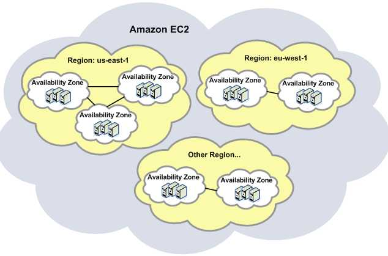
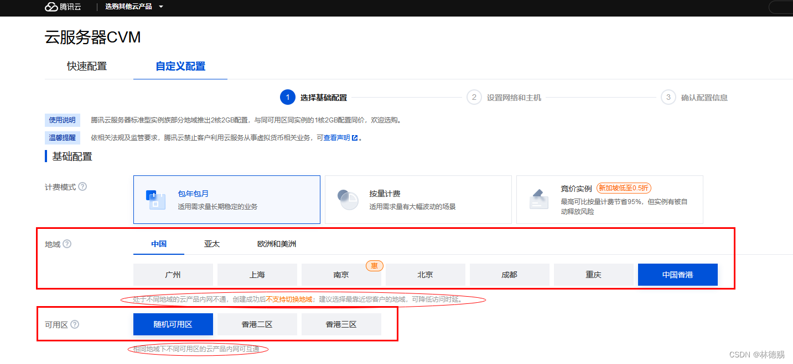
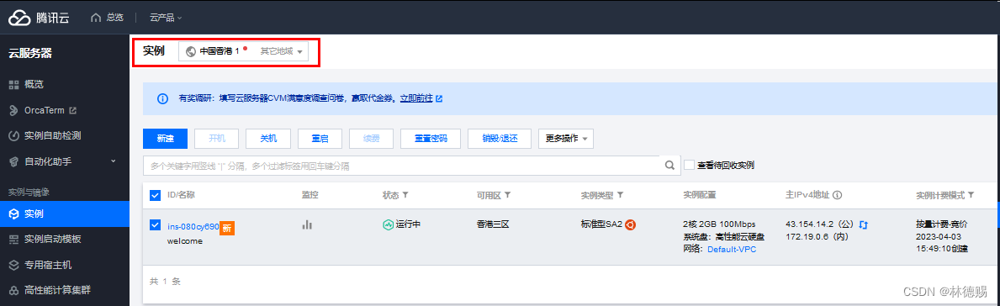

# 云服务器可用区是什么
可用区是指同一个区域下网络、水、火及电力相互独立的区域，可用区之间可以做到故障隔离

云服务器可用区英文Availability Zone，简称AZ。按照华为云官方关于可用区的定义：一个AZ是一个或多个物理数据中心的集合，有独立的风火水电，AZ内逻辑上再将计算、网络、存储等资源划分成多个集群。一个Region中的多个AZ间通过高速光纤相连，以满足用户跨AZ构建高可用性系统的需求。

# 腾讯云的可用区分析

- 处于不同地域的云产品内网不通，创建成功后不支持切换地域；建议选择最靠近您客户的地域，可降低访问时延。
- 相同地域下不同可用区的云产品内网可互通

- 可以查看同个区域下所有可用区的实例列表