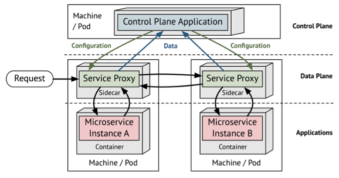

- [云服务器可用区是什么](#云服务器可用区是什么)
- [腾讯云的可用区分析](#腾讯云的可用区分析)
- [PAAS和SAAS的区别](#paas和saas的区别)
- [微服务](#微服务)
- [数据湖的底座](#数据湖的底座)
- [服务网格](#服务网格)
  - [Istio Architecture](#istio-architecture)

# 云服务器可用区是什么
可用区是指同一个区域下网络、水、火及电力相互独立的区域，可用区之间可以做到故障隔离

云服务器可用区英文Availability Zone，简称AZ。按照华为云官方关于可用区的定义：一个AZ是一个或多个物理数据中心的集合，有独立的风火水电，AZ内逻辑上再将计算、网络、存储等资源划分成多个集群。一个Region中的多个AZ间通过高速光纤相连，以满足用户跨AZ构建高可用性系统的需求。

# 腾讯云的可用区分析

- 处于不同地域的云产品内网不通，创建成功后不支持切换地域；建议选择最靠近您客户的地域，可降低访问时延。
- 相同地域下不同可用区的云产品内网可互通

- 可以查看同个区域下所有可用区的实例列表

# PAAS和SAAS的区别
PAAS（Platform as a Service）和SAAS（Software as a Service）是云计算中两个不同的服务模型，它们有着明显的区别：

    PAAS提供的是开发平台，为开发者提供开发、测试和部署的基础架构，开发者需要自行编写和维护应用程序代码。
    SAAS提供的是完整的应用程序，用户只需要通过浏览器或移动应用程序访问云上提供的应用程序即可，无需管理或维护基础架构。

简单来说，PAAS提供了一种构建自己的应用程序的方式，而SAAS提供的是已经构建好的应用程序。

在实际应用中，一些云服务可能同时提供PAAS和SAAS服务，因此需要根据具体的情况来进行严格的区分

# 微服务
What is Microservice architecture?

Microservice architecture is a development pattern that includes multiple independent and loosely coupled services. Each service has a separate codebase, which small developer teams can well manage.

Developers can deploy all these services independently, providing a faster and easier application development. The application in this architecture can be developed as smaller independent parts.

Moreover, the architecture provides a framework to develop, deploy, and maintain services independently. You can know more about this architecture by understanding its characteristics.

# 数据湖的底座
数据湖的底座通常包括以下几个方面的技术和组件：

1. 存储系统：数据湖需要一个可扩展、高效、低成本的存储系统，以存储海量的数据。常用的存储系统包括HDFS、S3、Azure Blob Storage等。

2. 数据采集和传输：数据湖需要从各种数据源中采集和传输数据，包括传感器、应用程序、第三方服务等。常用的数据采集和传输工具包括Kafka、Flume、Logstash、Filebeat等。

3. 数据管理和元数据：数据湖需要一个元数据系统来管理和跟踪所有数据和数据资产。常用的数据管理和元数据工具包括Hive、Glue、Atlas等。

4. 数据处理和计算：数据湖需要一组数据处理和计算工具，以支持各种数据分析和挖掘工作，包括ETL工具、数据挖掘工具、机器学习工具等。常用的数据处理和计算工具包括Spark、Flink、Presto、Hadoop等。

5. 安全和权限控制：数据湖需要一个安全的访问和权限控制机制，以确保数据的机密性和完整性。常用的安全和权限控制工具包括Kerberos、LDAP、Apache Ranger等。

6. 监控和警报：数据湖需要一个监控和警报系统，以及时检测和响应各种数据问题和故障。常用的监控和警报工具包括Nagios、Zabbix、Prometheus等。

# 服务网格
Microservices service mesh
Service mesh is a technology pattern that can be applied to a microservice-based system to manage networked communication between services. With a service mesh, the networking functionality is decoupled from the service's application logic, which means it can be managed independently.  

## Istio Architecture
