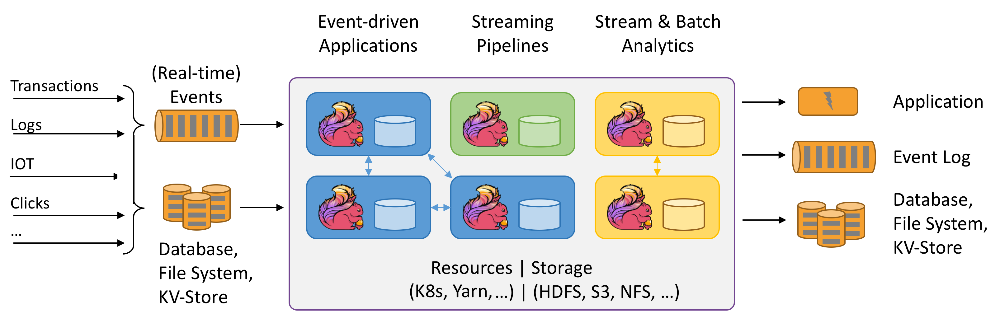
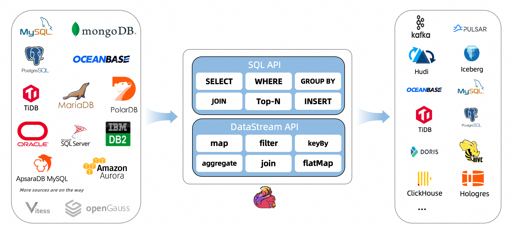

- [FLINK](#flink)
  - [官网](#官网)
  - [概念](#概念)
  - [使用场景](#使用场景)
- [FLINK-CDC](#flink-cdc)
  - [官网](#官网-1)
  - [概念](#概念-1)

# FLINK
## 官网
https://flink.apache.org/

## 概念
Stateful Computations over Data Streams

Apache Flink is a framework and distributed processing engine for stateful computations over unbounded and bounded data streams. Flink has been designed to run in all common cluster environments, perform computations at in-memory speed and at any scale.

## 使用场景
Flink 的一些使用场景：

    流式 ETL：Flink 可以对实时数据流进行转换、清洗、聚合和连接，使数据更易于消费和使用。

    流式计算：Flink 可以对实时数据流进行实时计算和数据分析，如流式统计、流式机器学习和流式图形处理等。

    数据管道：Flink 可以用作数据管道，将多个数据源集成到一个流式处理管道中，以实现数据聚合、转换和传输。

    数据流应用程序：Flink 可以支持流式应用程序，如实时推荐、欺诈检测、实时监控等。

    批处理：Flink 可以在批处理场景下使用，支持对大规模数据进行高效处理和计算。

总的来说，Flink 可以用于任何需要实时处理和实时计算的场景，如广告实时竞价、IoT、电信、金融、电子商务、物联网等。
# FLINK-CDC
## 官网
https://ververica.github.io/flink-cdc-connectors/master/index.html

## 概念
CDC Connectors for Apache Flink® is a set of source connectors for Apache Flink®, ingesting changes from different databases using change data capture (CDC). The CDC Connectors for Apache Flink® integrate Debezium as the engine to capture data changes. So it can fully leverage the ability of Debezium. 

