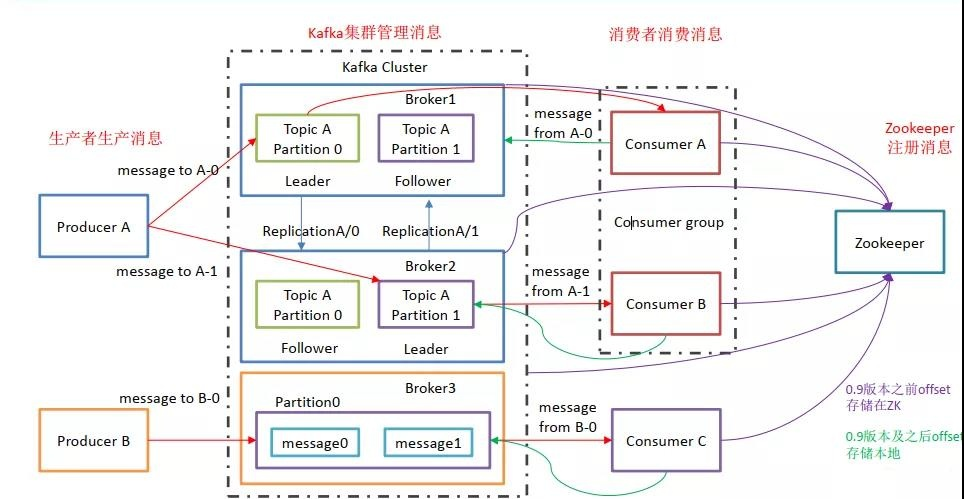
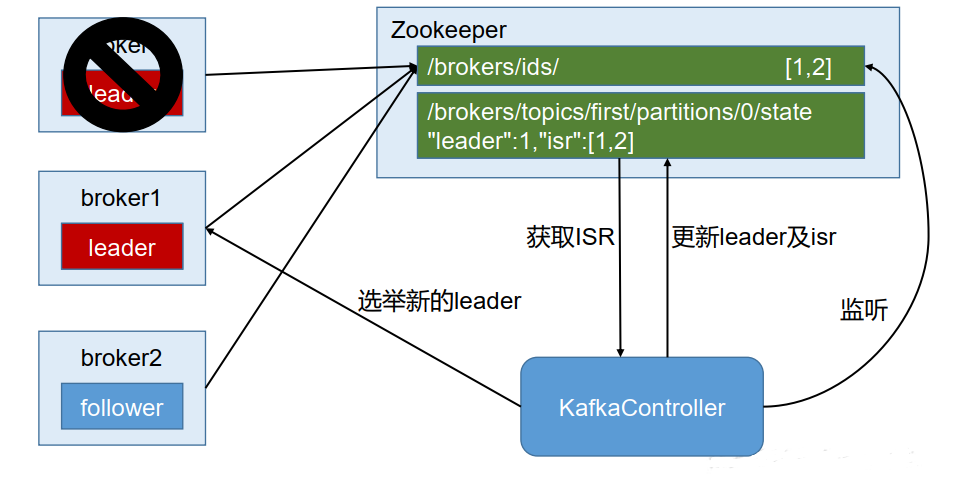
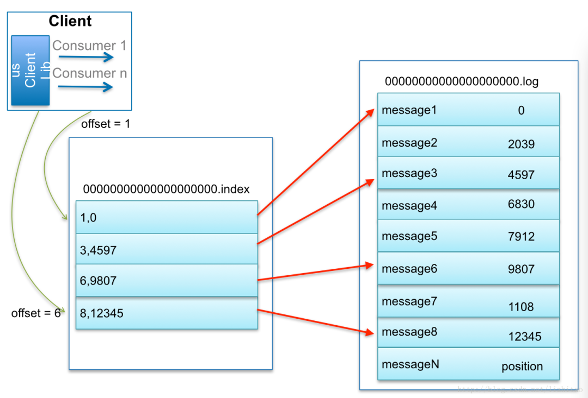

- [名词解释](#名词解释)
- [Zookeeper在Kafka中的作用](#zookeeper在kafka中的作用)
- [Cluster \& Controller](#cluster--controller)
- [Producer](#producer)
- [Topic](#topic)
- [Kafka文件存储机制](#kafka文件存储机制)
- [ISR集合](#isr集合)
- [Consumer](#consumer)
- [Consumer Group](#consumer-group)
- [kafka幂等性原理](#kafka幂等性原理)
  - [解决的问题](#解决的问题)
  - [解决的办法](#解决的办法)
  - [解决的原理](#解决的原理)
  - [限制条件](#限制条件)
- [docker 安装zookeeper 集群](#docker-安装zookeeper-集群)
- [docker 安装 kafka 集群](#docker-安装-kafka-集群)
- [常用的运维操作](#常用的运维操作)
  - [查看主题](#查看主题)
  - [查看主题里数据](#查看主题里数据)
  - [查看策略](#查看策略)
  - [调整删除策略](#调整删除策略)
  - [删除topic](#删除topic)
  - [删除策略](#删除策略)
  - [查看集群有哪些节点](#查看集群有哪些节点)
- [kafka 2.2.0 版本](#kafka-220-版本)
- [kafka 3.1.0 版本安装](#kafka-310-版本安装)
  - [安装 kafka 集群](#安装-kafka-集群)
  - [运维命令](#运维命令)
- [压测](#压测)
- [配置参数调优](#配置参数调优)
  - [硬件和OS](#硬件和os)
  - [内存](#内存)
  - [CPU](#cpu)
  - [Disk](#disk)
  - [Network](#network)
  - [Filesystem](#filesystem)
  - [Application vs. OS Flush Management](#application-vs-os-flush-management)
  - [节点配置](#节点配置)
  - [JVM配置](#jvm配置)
  - [kafka核心配置](#kafka核心配置)
    - [重要的客户端配置](#重要的客户端配置)
    - [broker核心配置](#broker核心配置)
    - [Topic级别的动态参数调整](#topic级别的动态参数调整)
    - [Producer核心参数](#producer核心参数)
    - [Consumer核心参数](#consumer核心参数)

# 名词解释

```
1）Producer ：消息生产者，就是向 kafka broker 发消息的客户端；
2）Consumer：消息消费者，向kafka broker 取消息的客户端；
3）Consumer Group （CG）：消费者组，由多个 consumer 组成。消费者组内每个消费者负责消费不同分区的数据，一个分区只能由一个组内消费者消费；消费者组之间互不影响。所有的消费者都属于某个消费者组，即消费者组是逻辑上的一个订阅者。
4）Broker ：一台 kafka 服务器就是一个 broker。一个集群由多个 broker 组成。一个 broker可以容纳多个 topic。
5）Topic ：可以理解为一个队列， 生产者和消费者面向的都是一个topic；
6）Partition：为了实现扩展性，一个非常大的 topic 可以分布到多个 broker（即服务器）上，一个 topic 可以分为多个 partition，每个 partition 是一个有序的队列；
7）Replica：副本，为保证集群中的某个节点发生故障时， 该节点上的 partition 数据不丢失，且 kafka 仍然能够继续工作， kafka 提供了副本机制，一个 topic 的每个分区都有若干个副本，一个 leader 和若干个 follower。
8）leader：每个分区多个副本的“主”，生产者发送数据的对象，以及消费者消费数据的对象都是 leader。
9）follower：每个分区多个副本中的“从”，实时从 leader 中同步数据，保持和 leader 数据的同步。leader 发生故障时，某个 follower 会成为新的 follower。
```

Kafka中发布订阅的对象是topic。我们可以为每类数据创建一个topic，把向topic发布消息的客户端称作producer，从topic订阅消息的客户端称作consumer。
Producers和consumers可以同时从多个topic读写数据。一个kafka集群由一个或多个broker服务器组成，它负责持久化和备份具体的kafka消息。

#集群架构


# Zookeeper在Kafka中的作用

所有的Kafka Broker节点一起去Zookeeper上注册，只有一个 broker 会被选举为 Controller，Controller负责管理集群 broker 的上下线，所有 topic 的分区副本分配和 leader 选举等工作。



# Cluster & Controller

多个Broker构成一个Cluster（集群）对外提供服务，每个集群会选取一个Broker来担任Controller。

Controller职责：管理分区的状态、管理每个分区的副本状态、监听Zookeeper中数据的变化等工作。

其他Broker：监听Controller Leader的状态。

当Controller出现故障时会重新选取Controller Leader。

# Producer

主要工作是生产消息，Broker响应producer的请求返回topic的元信息，比如哪些leader partition可访问；

写入方式：根据消息key的Hash值选择分区、随机轮询、或者按序轮询全部分区。

通过Producer的参数控制批量写入到partition，参数值可以设置为累计的消息的数量（如500条）、累计的时间间隔（如100ms）或者累计的数据大小(64KB)。

生产者数据可靠性保证和ACK机制：为保证 producer 发送的数据，能可靠的发送到指定的 topic， topic 的每个 partition 收到producer 发送的数据后， 都需要向 producer 发送 ack，如果producer 收到 ack， 就会进行下一轮的发送，否则重新发送数据。

acks参数配置：

0：producer 不等待 broker 的 ack，这一操作提供了一个最低的延迟， broker 一接收到还没有写入磁盘就已经返回，当 broker 故障时有可能丢失数据；

1：producer 等待 broker 的 ack， partition 的 leader 落盘成功后返回 ack，如果在 follower同步成功之前 leader 故障，那么将会丢失数据；

-1（all） ：producer 等待 broker 的 ack， partition 的 leader 和 follower 全部落盘成功后才返回 ack。但是如果在 follower 同步完成后， broker 发送 ack 之前， leader 发生故障，那么会造成数据重复。

# Topic

Kafka 中消息是以 topic 进行分类， 生产者生产消息，消费者消费消息，都是面向 topic；

topic 是逻辑上的概念，而 partition 是物理上的概念，每个 partition 对应于一个log文件，该 log 文件中存储的就是 producer 生产的数据；

Producer 生产的数据会被不断追加到该log 文件末端，且每条数据都有自己的 offset；

消费者组中的每个消费者， 都会实时记录自己消费到了哪个 offset，以便出错恢复时，从上次的位置继续消费。

# Kafka文件存储机制

由于生产者生产的消息会不断追加到 log 文件末尾， 为防止 log 文件过大导致数据定位效率低下， Kafka 采取了分片和索引机制，将每个partition 分为多个 segment。

每个 segment对应两个文件——“.index”文件和“.log”文件。这些文件位于一个文件夹下， 该文件夹的命名规则为：topic 名称+分区序号。

index 和 log 文件以当前 segment 的第一条消息的 offset 命名。


# ISR集合

ISR是In-Sync Replica的缩写，ISR集合表示的是目前“可用”（alive）**且消息量与Leader相差不多的副本集合。ISR集合中的副本必须满足下面两个条件：

- 副本所在节点必须维持着与zookeeper的连接；
- 副本最后一条消息的offset 与 leader副本的最后一条消息的offset之间 的差值不能超出指定的阈值。

每个分区的leader副本会维护此分区的ISR集合，会将不符合上面两个条件的副本踢出ISR集合外。

1. 每个Topic可以划分成多个分区，同一Topic下的不同分区包含的消息是不同的；
2. Topic的Partition数量大于等于Broker的数量，可以提高吞吐率；
3. 同一个Partition的Replica尽量分散到不同的机器，高可用；
4. 添加Partition时，Partition里面的信息不会重新分配，新增的Partition是空的；
5. Replica数量最小为1，最大为broker的数量；
6. Replica副本数越高，系统虽然越稳定，但是回来带资源和性能上的下降；
7. producer先把message发送到partition leader，再由leader发送给其他partition follower；
8. leader和follower分布在不同的broker，leader所在的broker宕机后，重新选举新的leader继续对外提供服务；
9. 数据保留策略可以有全局配置，也可以针对某个Topic覆盖全局配置；

# Consumer

consumer 采用 pull（拉）模式从 broker 中读取数据。由于 consumer 在消费过程中可能会出现断电宕机等故障， consumer 恢复后，需要从故障前的位置的继续消费，所以 consumer 需要实时记录自己消费到了哪个 offset，以便故障恢复后继续消费；Kafka 0.9 版本之前， consumer 默认将 offset 保存在 Zookeeper 中，从 0.9 版本开始，consumer 默认将 offset 保存在 Kafka 一个内置的 topic 中，该 topic 为__consumer_offsets；用户也可根据需要自行维护offset信息。

# Consumer Group

1. Consumer group是由各个consumer线程组成的组，partition中的每个message只能被组内的一个consumer线程消费；
2. 新启动的consumer默认从partition队列最头端最新的地方开始阻塞的读message；
3. 一个消费组内不管有多少个线程，都会去消费所有的partition，消费者线程数等于partition数量时效率最高；
4. 消费组支持指定位置消费，从头开始，从最新开始，指定位置，详见KafkaConsumer重置Offset
5. Consumer增加或删除，或者Broker的增加或者减少都会触发 Consumer Rebalance
6. 如果producer的流量增大，可以增加分区数，同时调整consumer线程数，提高吞吐量；

# kafka幂等性原理

## 解决的问题

Producer和Broker之间的通信总有可能出现异常，如果消息已经写入，但ACK在半途丢失了，Producer就会再次发送该消息，造成重复。

## 解决的办法

只需要将Producer的enable.idempotence配置项设为true，就能保证消息就算重发也仅写入一次。

## 解决的原理

究其原因，Kafka加入了以下两个标记值：

- PID，在Producer初始化时分配，作为每个Producer会话的唯一标识；
- 序列号（sequence number），Producer发送的每条消息（更准确地说是每一个消息批次，即ProducerBatch）都会带有此序列号，从0开始单调递增。Broker根据它来判断写入的消息是否可接受。

Broker会为每个TopicPartition组合维护PID和序列号。对每条接收到的消息，都会检查它的序列号是否比Broker所维护的值严格+1，只有这样才是合法的，其他情况都会丢弃。

## 限制条件

Kafka的幂等性实现了对于单个Producer会话、单个TopicPartition级别的不重不漏，也就是最细粒度的保证。如果Producer重启（PID发生变化），或者写入是跨Topic、跨Partition的，单纯的幂等性就会失效，需要更高级别的事务性来解决了。

# docker 安装zookeeper 集群

```sh
# 拉取镜像
```sh
下载镜像
docker pull docker.io/yandex/clickhouse-server
docker pull docker.io/yandex/zookeeper
docker pull bitnami/kafka

cat /etc/containers/registries.conf
设置
unqualified-search-registries = ["docker.io"]

# zookeeper
## docker安装zookeeper集群
```sh
docker pull docker.io/zookeeper
docker network create --subnet=10.206.13.0/24 zookeeper-network

docker run --restart=always --name zk01 -d --net=zookeeper-network --ip 10.206.13.2 docker.io/library/zookeeper
docker run --restart=always --name zk02 -d --net=zookeeper-network --ip 10.206.13.3 docker.io/library/zookeeper
docker run --restart=always --name zk03 -d --net=zookeeper-network --ip 10.206.13.4 docker.io/library/zookeeper
# 不是同台机器上的话直接 
docker run --restart=always -d  --name zk01 -p 2181:2181 zookeeper

#进入docker设置myid
docker exec -it zk01 bash
echo 1 >/data/myid
docker exec -it zk02 bash
echo 2 >/data/myid
docker exec -it zk03 bash
echo 3 >/data/myid

#配置zoo.cfg
#vim /tmp/zoo_1.cfg
server.1=localhost:2888:3888;2181
dataDir=/data
dataLogDir=/datalog
tickTime=2000
initLimit=5
syncLimit=2
autopurge.snapRetainCount=3
autopurge.purgeInterval=0
maxClientCnxns=60
standaloneEnabled=true
admin.enableServer=true
server.1=0.0.0.0:2888:3888;2181
server.2=10.206.13.3:2888:3888;2181
server.3=10.206.13.4:2888:3888;2181

#vim /tmp/zoo_2.cfg
dataDir=/data
dataLogDir=/datalog
tickTime=2000
initLimit=5
syncLimit=2
autopurge.snapRetainCount=3
autopurge.purgeInterval=0
maxClientCnxns=60
standaloneEnabled=true
admin.enableServer=true
server.1=10.206.13.2:2888:3888;2181
server.2=0.0.0.0:2888:3888;2181
server.3=10.206.13.4:2888:3888;2181

#vim /tmp/zoo_3.cfg
dataDir=/data
dataLogDir=/datalog
tickTime=2000
initLimit=5
syncLimit=2
autopurge.snapRetainCount=3
autopurge.purgeInterval=0
maxClientCnxns=60
standaloneEnabled=true
admin.enableServer=true
server.1=10.206.13.2:2888:3888;2181
server.2=10.206.13.3:2888:3888;2181
server.3=0.0.0.0:2888:3888;2181

#修改docker里的zk配置
docker cp /tmp/zoo_1.cfg zk01:/conf/zoo.cfg
docker cp /tmp/zoo_2.cfg zk02:/conf/zoo.cfg
docker cp /tmp/zoo_3.cfg zk03:/conf/zoo.cfg

#启动zk
docker restart zk01
docker restart zk02
docker restart zk03

#查看zk状态
/apache-zookeeper-3.8.0-bin/bin/zkServer.sh status
/apache-zookeeper-3.8.0-bin/bin/zkCli.sh

#其他操作
docker stop zk01
docker stop zk02
docker stop zk03
docker rm zk01
docker rm zk02
docker rm zk03
```

dataDir=/data
dataLogDir=/datalog
tickTime=2000
initLimit=5
syncLimit=2
autopurge.snapRetainCount=3
autopurge.purgeInterval=0
maxClientCnxns=60
standaloneEnabled=true
admin.enableServer=true
server.1=10.206.13.2:2888:3888;2181
server.2=10.206.13.3:2888:3888;2181
server.3=0.0.0.0:2888:3888;2181

docker cp /tmp/zoo_1.cfg zk01:/conf/zoo.cfg
docker cp /tmp/zoo_2.cfg zk02:/conf/zoo.cfg
docker cp /tmp/zoo_3.cfg zk03:/conf/zoo.cfg

docker restart zk01
docker restart zk02
docker restart zk03

/apache-zookeeper-3.8.0-bin/bin/zkServer.sh status
/apache-zookeeper-3.8.0-bin/bin/zkCli.sh

docker stop zk01
docker stop zk02
docker stop zk03
docker rm zk01
docker rm zk02
docker rm zk03

# docker 安装 kafka 集群

```sh
# docker安装kafka集群
docker run -it --restart=always \
--name kafka01 --net=zookeeper-network --ip 10.206.13.8 -e KAFKA_BROKER_ID=0 \
-e KAFKA_ZOOKEEPER_CONNECT=10.206.13.2:2181,10.206.13.3:2181,10.206.13.4:2181 \
-e ALLOW_PLAINTEXT_LISTENER=yes \
-e KAFKA_ADVERTISED_LISTENERS=PLAINTEXT://10.206.13.8:9092 \
-e KAFKA_LISTENERS=PLAINTEXT://10.206.13.8:9092 \
-d docker.io/bitnami/kafka

docker run -it --restart=always \
--name kafka02 --net=zookeeper-network --ip 10.206.13.9 -e KAFKA_BROKER_ID=1 \
-e KAFKA_ZOOKEEPER_CONNECT=10.206.13.2:2181,10.206.13.3:2181,10.206.13.4:2181 \
-e ALLOW_PLAINTEXT_LISTENER=yes \
-e KAFKA_ADVERTISED_LISTENERS=PLAINTEXT://10.206.13.9:9092 \
-e KAFKA_LISTENERS=PLAINTEXT://10.206.13.9:9092 \
-d docker.io/bitnami/kafka

docker run -it --restart=always \
--name kafka03 --net=zookeeper-network --ip 10.206.13.10 -e KAFKA_BROKER_ID=2 \
-e KAFKA_ZOOKEEPER_CONNECT=10.206.13.2:2181,10.206.13.3:2181,10.206.13.4:2181 \
-e ALLOW_PLAINTEXT_LISTENER=yes \
-e KAFKA_ADVERTISED_LISTENERS=PLAINTEXT://10.206.13.10:9092 \
-e KAFKA_LISTENERS=PLAINTEXT://10.206.13.10:9092 \
-d docker.io/bitnami/kafka

#查看zookeeper
docker exec -it zk01 bash
./bin/zkCli.sh
ls /brokers/ids
[2, 1, 0]

#其他操作
docker stop kafka01
docker stop kafka02
docker stop kafka03
docker rm kafka01
docker rm kafka02
docker rm kafka03

#创建topic
docker exec -it kafka01 bash
/opt/bitnami/kafka/bin/kafka-topics.sh --bootstrap-server 10.206.13.8:9092 --create --topic test --partitions 1 --replication-factor 1

# 连接另外两台查看新创建的test topics
/opt/bitnami/kafka/bin/kafka-topics.sh --list --bootstrap-server 10.206.13.9:9092
/opt/bitnami/kafka/bin/kafka-topics.sh --list --bootstrap-server 10.206.13.10:9092

# 写（CTRL+D结束写内容）
/opt/bitnami/kafka/bin/kafka-console-producer.sh --broker-list 10.206.13.8:9092 --topic test
>hello
# 读（CTRL+C结束读内容）
/opt/bitnami/kafka/bin/kafka-console-consumer.sh --bootstrap-server 10.206.13.10:9092 --topic test --from-beginning
hello
```

# 常用的运维操作

```sh
cd /data/application/kafka/bin
```

## 查看主题

```sh
./kafka-topics.sh --list --zookeeper tdsql_test_zk:2118,tdsq2_test_zk:2118,tdsq2_test_zk:2118/kafka
```

## 查看主题里数据

```sh
./kafka-console-consumer.sh --bootstrap-server 127.0.0.0:9092 --topic test --from-beginning|more
```

## 查看策略

```sh
./kafka-configs.sh --zookeeper tdsql_test_zk:2118,tdsq2_test_zk:2118,tdsq2_test_zk:2118/kafka --describe --detity-type --entity_name test
```

## 调整删除策略

```sh
cat ../conf/server.properties|grep log.retention.check.interval.ms
kafka-configs.sh --zookeeper tdsql_test_zk:2118,tdsq2_test_zk:2118,tdsq2_test_zk:2118/kafka --describe --entity-type topics --entity-name test --alter --add-config retention.ms=10000
```

## 删除topic

```sh
kafka-topics.sh --delete --topic test --zookeeper tdsql_test_zk:2118,tdsq2_test_zk:2118,tdsq2_test_zk:2118/kafka
```

## 删除策略

```sh
kafka-configs.sh --zookeeper tdsql_test_zk:2118,tdsq2_test_zk:2118,tdsq2_test_zk:2118/kafka --entity-type topics --entity-name test --alter --delete-config retention.ms
```

## 查看集群有哪些节点
```sh
zookeeper-shell.sh 172.1.1.1:2181 ls /brokers/ids
zookeeper-shell.sh 172.1.1.1:2181 get /brokers/ids/0
zookeeper-shell.sh 172.1.1.1:2181 get /brokers/ids/1
zookeeper-shell.sh 172.1.1.1:2181 get /brokers/ids/2
```

# kafka 2.2.0 版本

从Kafka 2.2.0版本开始，`kafka-topics.sh`脚本不再支持 `--zookeeper`选项，而是使用 `--bootstrap-server`选项来指定Kafka集群的地址。您可以使用以下命令来列出Kafka主题：

```
./kafka-topics.sh --list --bootstrap-server <broker1>:<port1>,<broker2>:<port2>,...
```

请注意，您需要将上述命令中的 `<broker>`和 `<port>`替换为您的Kafka集群中broker的地址和端口号。

# kafka 3.1.0 版本安装

kafka官网：http://kafka.apache.org/
kafka下载页面：http://kafka.apache.org/downloads
kafka配置快速入门：http://kafka.apache.org/quickstart

## 安装 kafka 集群

前置条件：已经按照好 zookeeper 和 java

```sh
wget https://archive.apache.org/dist/kafka/3.1.0/kafka_2.13-3.1.0.tgz
tar xvf kafka_2.13-3.1.0.tgz
cd kafka_2.13-3.1.0/config

cat server.properties | grep -v '^#' | grep -v '^$'

broker.id=1 #Kafka broker的唯一标识符
advertised.listeners=PLAINTEXT://172.1.1.19:9092 #Kafka broker对外公布的监听器地址
num.network.threads=3 #用于处理网络请求的线程数
num.io.threads=8 #用于执行I/O操作的线程数
socket.send.buffer.bytes=102400 #发送缓冲区大小
socket.receive.buffer.bytes=102400 #接收缓冲区大小
socket.request.max.bytes=104857600 #请求的最大字节数
log.dirs=/data/kafka_2.13-3.1.0/logs #Kafka日志目录
num.partitions=3 #默认分区数
num.recovery.threads.per.data.dir=1 #每个数据目录用于日志恢复的线程数
offsets.topic.replication.factor=1 #__consumer_offsets主题的副本因子
transaction.state.log.replication.factor=1 #__transaction_state主题的副本因子
transaction.state.log.min.isr=1 #__transaction_state主题的最小ISR数量
log.retention.hours=168 #日志保留时间（以小时为单位）
log.segment.bytes=1073741824 #日志段大小（以字节为单位）
log.retention.check.interval.ms=300000 #检查日志保留时间间隔（以毫秒为单位）
zookeeper.connect=172.1.1186:2181,172.1.1187:2181,172.1.1188:2181 #Zookeeper连接地址
zookeeper.connection.timeout.ms=18000 #Zookeeper连接超时时间（以毫秒为单位）
group.initial.rebalance.delay.ms=0 #初始再平衡延迟时间（以毫秒为单位）
```

## 运维命令

```sh
cd ../bin
./kafka-server-start.sh -daemon ../config/server.properties
./kafka-server-stop.sh -daemon ../config/server.properties

# 查看主题
./kafka-topics.sh --list --bootstrap-server 172.1.1.19:9092,172.1.1.20:9092,172.1.1.21:9092
# 可以添加鉴权参数 --command-config /home/kafka/config/kafka_client_producer_jaas.conf

# 删除主题
./kafka-topics.sh --delete --topic example --zookeeper tdsql_test_zk:2118,tdsq2_test_zk:2118,tdsq2_test_zk:2118/kafka

# 创建主题
./kafka-topics.sh --bootstrap-server 172.1.1.19:9092,172.1.1.20:9092,172.1.1.21:9092 --create --topic example --partitions 3 --replication-factor 1

# 在指定的broker上创建主题（replica-assignment 跟 partitions、replication-factor不能一起使用）
./kafka-topics.sh --bootstrap-server 172.21.227.19:9092,172.21.227.20:9092,172.21.227.21:9092 --create --topic example3 --replica-assignment 1

# 查看数据
./kafka-console-consumer.sh --bootstrap-server 172.1.1.19:9092,172.1.1.20:9092,172.1.1.21:9092 --topic example

# 查看最后几条记录
# 使用 kafka-run-class 命令来获取 topic 的最大 offset 和最小 offset
./kafka-run-class.sh kafka.tools.GetOffsetShell --broker-list 172.1.1.19:9092,172.1.1.20:9092,172.1.1.21:9092 --topic example --time -2
./kafka-run-class.sh kafka.tools.GetOffsetShell --broker-list 172.1.1.19:9092,172.1.1.20:9092,172.1.1.21:9092 --topic example --time -1
# 使用kafka-console-consumer 命令来查看指定分区的最后几条记录
./kafka-console-consumer.sh --bootstrap-server 172.1.1.19:9092,172.1.1.20:9092,172.1.1.21:9092 --topic example --partition 0 --offset 4

# 查看记录条数
./kafka-run-class.sh kafka.tools.GetOffsetShell --broker-list 172.1.1.19:9092,172.1.1.20:9092,172.1.1.21:9092 --topic example --time -1

# 查看消费组的消费偏移量
./kafka-consumer-groups.sh --bootstrap-server 172.21.227.19:9092,172.21.227.20:9092,172.21.227.21:9092 --describe --group g1

# 重新设置消费者组所有topic的偏移量
kafka-consumer-groups.sh --bootstrap-server 172.21.227.19:9092,172.21.227.20:9092,172.21.227.21:9092 --reset-offsets --to-earliest --execute --all-topics
# 重新设置消费者组某个topic的偏移量
kafka-consumer-groups.sh --bootstrap-server 172.21.227.19:9092,172.21.227.20:9092,172.21.227.21:9092 --reset-offsets --to-earliest --execute --topic example

# kafka查看第N条记录
# 获取最小和最大的偏移量
kafka-run-class kafka.tools.GetOffsetShell --broker-list localhost:9092 --topic test-topic --time -1 
# 返回每个分区的最大偏移量
kafka-run-class kafka.tools.GetOffsetShell --broker-list localhost:9092 --topic test-topic --time -2 
# 返回每个分区的最小偏移量
# 从特定偏移量开始消费
kafka-console-consumer --bootstrap-server localhost:9092 --topic test-topic --partition 0 --offset 60 --max-messages 1

# 查看某条记录的插入时间
./kafka-console-consumer.sh --bootstrap-server  172.21.227.19:9092,172.21.227.20:9092,172.21.227.21:9092 --topic example3 --partition 0 --offset 0 –property print.timestamp=true --max-messages 1
# 结果中字段 ts 就是 timestamp，单位是毫秒
```

# 压测

```sh
./kafka-producer-perf-test.sh --topic test-topic --num-records 1000000 --record-size 100 --throughput -1 --producer-props bootstrap.servers=127.0.0.1:9092
```

此脚本用于测试 Kafka **生产** 消息的性能，可选参数列表如下，加粗项为常用参数

| 参数名                      | 含义                                                                                                                                                                            |
| --------------------------- | ------------------------------------------------------------------------------------------------------------------------------------------------------------------------------- |
| -h, --help                  | 显示使用帮助并退出                                                                                                                                                              |
| **--topic**           | **指定生产的消息发往的 topic**                                                                                                                                            |
| **--num-records**     | **指定生产的消息总数**                                                                                                                                                    |
| --payload-delimeter         | 如果通过 --payload-file 指定了从文件中获取消息内容，那么这个参数的意义是指定文件的消息分隔符，默认值为 \n，即文件的每一行视为一条消息；如果未指定 --payload-file 则此参数不生效 |
| **--throughput**      | **限制每秒发送的最大的消息数，设为 -1 表示不限制**                                                                                                                        |
| **--producer-props**  | **直接指定 Producer 配置，格式为 NAME=VALUE，例如 bootstrap.server=127.0.0.1:9092，通过此种方式指定的配置优先级高于 --producer.config**                                         |
| --producer-config           | 指定 Producer 的配置文件，格式参照官方的 config/producer.properties                                                                                                             |
| --print-metrics             | 在测试结束后打印更详尽的指标，默认为 false                                                                                                                                      |
| --transactional-id          | 指定事务 ID，测试并发事务的性能时需要，只有在 --transaction-duration-ms > 0 时生效，默认值为 performance-producer-default-transactional-id                                      |
| --transactional-duration-ms | 指定事务持续的最长时间，超过这段时间后就会调用 commitTransaction 来提交事务，只有指定了 > 0 的值才会开启事务，默认值为 0                                                        |
| **--record-size**     | **指定每条消息的大小，单位是字节，和 --payload-file 两个中必须指定一个，但不能同时指定**                                                                                  |
| --payload-file              | 指定消息的来源文件，只支持 UTF-8 编码的文本文件，文件的消息分隔符通过 --payload-delimeter 指定，和 --record-size 两个中必须指定一个，但不能同时指定                             |

```sh
kafka-consumer-perf-test.sh
```

此脚本用于测试 Kafka **消费** 消息的性能，可选参数列表如下，加粗项为常用参数。

| **参数名**                | **含义**                                                                                     |
| ------------------------------- | -------------------------------------------------------------------------------------------------- |
| **--bootstrap-server**    | **指定 broker 地址，必选，除非用 --broker-list 代替（不建议）**                              |
| **--topic**               | **指定消费的 topic，必选**                                                                   |
| --version                       | 输出 Kafka 版本                                                                                    |
| **--consumer.config**     | **指定 Consumer 配置文件**                                                                   |
| --date-format                   | 指定用于格式化 *.time 的规则，默认为 yyyy-MM-dd HH:mm:ss:SSS                                       |
| **--fetch-size**          | **指定一次请求消费的大小，默认为 1048576 即 1 MB**                                           |
| --from-latest                   | 如果 Consumer 没有已经建立的 offset，则指定从 log 中最新的位点开始消费，而不是从最早的位点开始消费 |
| --group                         | 指定 ConsumerGroup ID，默认为 perf-consumer-40924                                                  |
| --help                          | 显示使用帮助并退出                                                                                 |
| --hide-header                   | 指定后不输出 header 信息                                                                           |
| **--messages**            | **指定消费的消息数量，必选**                                                                 |
| --num-fetch-threads             | 指定 fetcher 线程的数量                                                                            |
| --print-metrics                 | 指定打印 metrics 信息                                                                              |
| **--reporting-interval**  | **指定打印进度信息的时间间隔，默认为 5000 即 5 秒**                                          |
| **--show-detailed-stats** | **指定每隔一段时间（由 --reporting-interval 指定）输出显示详细的状态信息**                   |
| --socket-buffer-size            | 指定 TCP 的 RECV 大小，默认为 2097152 即 2 MB                                                      |
| **--threads**             | **指定消费的线程数，默认为 10**                                                              |
| --timeout                       | 指定允许的最大超时时间，即每条消息返回的最大时间间隔，默认为 10000 即 10 秒                        |

# 配置参数调优
## 硬件和OS
对于运行Linux中的kafka集群不需要过多的OS以及kernel参数调整。  
kafka使用大量的文件以及socket和客户端进行通讯，我们都知道，在Linux下，一切皆文件，因此系统需要设置更多的可用文件描述符>。

在大多数的默认系统配置中，单个进程可用使用1024个文件描述符，对于kafka来说太小了，建议调整到至少100000，但是通常和操作 系统以及发行版本有关系，需要根据具体的OS进行调整。

可用通过计算Kafka数据目录中的.index文件来计算当前的mmap编号。.index文件大多数代表了内存映射文件。
```sh
# 1.统计.index文件个数
$ find . -name '*index' | wc -l

# 2.为每个session设置vm.max_map_count参数，这将计算当前内存映射文件的数量，mmap限制的最小值就是打开文件的ulimit限制
# 该值要远大于index的数量
$ sysctl -w vm.max_map_count=262144

# 3.持久化mmap参数
$ echo 'vm.max_map_count=262144' >> /etc/sysctl.conf
$ sysctl -p
```
OS limit 调优
```sh
 cat /etc/security/limits.conf
* soft nofile 655360
* hard nofile 655360
* soft nproc 655350
* hard nproc 655350
* soft memlock unlimited
* hard memlock unlimited
```
## 内存
Kafka严重依赖文件系统来存储和缓存消息。

所有数据都会立即写入文件系统上的持久日志中，而不必刷新到磁盘。实际上，这仅意味着将其转移到内核的页面缓存pagecache中。 当回收内存时，操作系统会将可用内存转移到磁盘缓存中，而对性能的影响很小。

同时，Kafka非常小心地使用堆空间heap space，不需要将堆大小设置为超过6 GB，这样将会在32G内存的机器上缓存28-30G的数据到文件系统。
```sh
cat kafka-server-start.sh  | grep KAFKA_HEAP_OPTS
if [ "x$KAFKA_HEAP_OPTS" = "x" ]; then
    export KAFKA_HEAP_OPTS="-Xmx6G -Xms6G"
```
## CPU
大多数的kafka集群对于cpu的要求不是那么高，因此对于CPU的配置没有像其他资源那么重要(但是通常同等资源都是由一定比例配比的)。

## Disk
生产集群建议使用多块磁盘来最大化整体的吞吐，不要与应用程序日志或其他OS文件系统活动共享用于Kafka数据的相同驱动器，以确保良好的延迟。

在官方的最佳实践中建议，可以将多块磁盘构建成RAID，或者直接将独立的多块磁盘作为kafka的数据存储，也就是JBOD方案(Just Bunch Of Disks)。
```
备注:如果软RAID的话其实会在存储方面增加一层数据均衡，增加了集群的复杂度，因此一般可用选择后者，而且RAID主要用于提供冗余，对于开源分布式服务来讲，在软件层面上基本都会保证数据的冗余。
```
不过在实际的场景中，具体选择使用多块盘做RAID还是直接使用多块盘挂载，以下有几种场景可以考虑:

如果配置多个数据目录，则Broker将在路径中放置一个新分区，该分区中当前存储的分区数最少。每个分区将完全位于数据目录之一中，如果分区之间的数据不平衡，就会导致磁盘之间的负载不平衡。

RAID在平衡磁盘之间的负载方面做得更好，它能在较低的水平上平衡负载。RAID的主要缺点是减少了可用的磁盘空间(RAID0除外)，好处是可以容忍磁盘故障(RAID1，RAID5等)。

在生产中强烈不建议使用RAID 5 or RAID 6 ,会严重影响到写吞吐的性能，并且在磁盘故障时会有重建阵列的I/O成本(RAID0下也存在重建I/O的成本)

如果额外的成本可以接受，建议使用RAID10(容量减半，多一份冗余)，否则，建议Kafka服务器配置多个日志目录，每个目录都安装在单独的驱动器上。

linked使用8x7200转的sata磁盘，一般来说，磁盘吞吐量是性能瓶颈，磁盘越多越好。

kafka官方文档中其实建议使用多个驱动器以获得良好的吞吐量，因为每个路径都独立挂载在不同的磁盘上，这使得多块物理磁盘磁头同时执行物理I/O写操作，可以极大地加速Kafka消息生产的速度。

```
注意: 通常在使用本地盘时，容量可能会比较大，当磁盘容量超过2T时，Linux下默认的MBR分区就不能满足容量的要求了，此时需要在分区时进行GPT分区，否则等线上业务真正上线后会发现超过2T的空间就被浪费了。
```

另外一个问题就是，磁盘容量规划的问题，虽然kafka默认为全部的日志数据设置了7天保留时间，但是往往在海量的数据消费场景中，单天的数据量也可能达到好几个T，这就导致了需要提前对业务的场景和使用方式进行提前规划，并提前计算最少的存储量。

但一般对于磁盘空间的规划可以根据消息量大概估算，比如一天7亿条消息，单条1kb，消息副本为3(可保证2节点同时挂)，那么大概的存储空间为7亿*3*1KB/1000/1000=2100G，也就是这种规模下的数据，一天产生2T的数据，实际使用数据为700G，1400G数据为冗余数据，此时我们在规划磁盘容量时就需要考虑到单天数据量的大小，以及数据的保留时间。

```
注意: 如果客户端开启了消息压缩，整体的数据能再相对小一些，可以根据具体情况来考虑
```
## Network
在分布式系统中，快速可靠的网络是性能的一个重要组成部分(因此通常分布式系统中建议在同机房)。

低延迟确保节点可以轻松通信，而高带宽有助于集群节点之前的副本移动和恢复(往往在kafka集群中优先瓶颈点都是带宽)。

目前大多数的数据中心基本都是千兆(1 GbE)或万兆网络(10 GbE)，对于大多数集群通常都是足够的。

应该尽量避免集群跨越多个数据中心，即使数据中心在很近的距离同地区，也要避免跨越巨大地理距离的集群。
```
备注:实际上在分布式系统中分区是肯定会发生的，通过避免跨机房部署能够降低分区的概率
```
Kafka集群假设所有节点都是相等的，较大的延迟可能会加剧分布式系统中的问题，并使调试和解决变得更加困难。
```
注意: 如果业务上需要异地进行数据读写，推荐的方法是在每个数据中心中部署一个本地Kafka集群，每个数据中心中的应用程序实例只与它们的本地集群交互，并在集群之间进行镜像(kafka提供了mirror-maker工具)。
```
## Filesystem
现在操作系统中，大部分的系统应该都使用了Ext4或XFS系统，官方也推荐使用这两种文件系统，但是对于具体的文件系统的选择，官方提供了如下几种场景和需要注意的点。

使用各种文件系统创建和挂载选项，在具有大量消息负载的集群上执行了比较测试，XFS带来了更好的本地时间(最好的EXT4配置是160ms vs. 250ms+)，以及更低的平均等待时间。XFS性能在磁盘性能方面的可变性也较小。

不论是使用哪种文件系统，推荐修改默认的挂载参数:

- noatime: 此选项禁止在读取文件时更新文件的atime(最后访问时间)属性,这可以消除大量的文件系统写操作，特别是在引导消费者的情况下,Kafka完全不依赖于atime属性，所以禁用它是安全的
```sh
$ cat /etc/fstab
UUID="4231b126-7e67-45c4-b8bf-554006291d35"  /export1    xfs    defaults,noatime  
```
XFS文件系统挂载参数优化:
- largeio: 这会影响stat调用报告的首选I/O大小，尽管这可以在较大的磁盘写入上实现更高的性能，但实际上对性能的影响很小或没有影响
- nobarrier: 于具有电池后备缓存的基础设备，此选项可以通过禁用定期写刷新来提供更高的性能。 但是，如果基础设备的行为良>好，它将向文件系统报告它不需要刷新，并且此选项将无效。


EXT文件系统挂载参数优化:
```
注意: 在ext4文件系统下，要获得最佳性能，则需要调整几个参数。这些选项在故障情况下通常是不安全的，并且将导致更多的数据丢失和损坏，对于单个broker故障，可以擦除磁盘并从群集重建副本，在多数情况下，多broker异常意味着潜在的文件系统损坏，无法轻易恢复。
```
- data=writeback: Ext4默认为data = ordered，这使某些写入操作具有很强的顺序，在Kafka场景下其实不需要该参数，此设置消除了排序约束，并且似乎大大减少了延迟
- Disabling journaling: 日志记录是一个折衷:它使服务器崩溃后重新引导更快，但它引入了大量额外的锁定，增加了写入性能的差异
- commit=num_secs: 这调整了ext4提交到其元数据日志的频率。 将此值设置为较低的值可以减少崩溃期间未刷新数据的丢失。 将此值设置为较高的值将提高吞吐量。
- nobh: 此设置控制在使用data=writeback模式时附加的排序保证，可以提高吞吐量和延迟
- delalloc: 延迟分配意味着文件系统避免在物理写入发生之前分配任何块，此功能非常适合吞吐量

## Application vs. OS Flush Management
当从崩溃中恢复任何未知的日志段时，Kafka将通过检查其消息的CRC来检查每条消息的完整性，并在启动时执行的恢复过程中重建附带的偏移索引文件。

请注意，Kafka中的持久性不需要将数据同步到磁盘，因为发生故障的节点将始终从其副本中恢复。

我们建议使用默认刷新设置，该设置将完全禁用应用程序的fsync。

这意味着依靠操作系统和Kafka自己的后台刷新来完成后台刷新。

这为所有用途提供了最佳的解决方案：无需调节配置，提高吞吐量和延迟，并提供完全恢复保证。

通常，我们认为复制提供的保证要强于同步到本地磁盘，但是偏执狂仍然更愿意同时拥有两者，并且仍然支持应用程序级fsync策略。

使用应用程序级刷新设置的缺点是，其磁盘使用模式效率较低（它给操作系统减少了重新排序写操作的余地），并且由于大多数Linux文件系统中的fsync阻止了文件写入，因此它会引入延迟。

## 节点配置
1. 避免使用太小的节点配置，因为这样整个集群的节点数可能会特别多，在这种机器上运行kafka将会有更多的开销
2. 避免使用太高配计算机，因为它们经常导致资源使用不平衡，比如内存优先不够了，但cpu还剩余很多。如果在每个高配机器上运行多个broker节点，将会增加整体的复杂度

## JVM配置
在当前大多数Java类应用下，基本都在使用JDK8(建议使用最新的jdk8)，在此环境下默认使用的是G1的垃圾回收器，因此一般情况下仅需要修改如下参数即可:
- MaxGCPauseMillis: 指定每次垃圾回收默认的停顿时间，默认值200ms
- InitiatingHeapOccupancyPercent: G1 启动新一轮垃圾回收之前可以使用的堆内存百分比，默认值是45

官方推荐的GC参数如下:
```
-Xms6g -Xmx6g -XX:MetaspaceSize=96m -XX:+UseG1GC -XX:MaxGCPauseMillis=20
       -XX:InitiatingHeapOccupancyPercent=35 -XX:G1HeapRegionSize=16M
       -XX:MinMetaspaceFreeRatio=50 -XX:MaxMetaspaceFreeRatio=80
```
作为参考，LinkedIn最繁忙的集群当前是如下情况:
```
60 brokers
50k partitions (replication factor 2)
800k messages/sec in
300 MBps inbound, 1 GBps + outbound
```
上面的GC调优看起来比较激进，但集群中的所有broker都会有90%的gc中止时间，大概21ms，它们做不到每秒一个young GC

## kafka核心配置
Kafka默认设置在大多数情况下都能工作，特别是与性能相关的设置和选项，但是考虑到集群的规划以及场景用途，有一些补充的配置参数可以对生产环境进行调优。

通常配置上来讲会分为broker端配置、produser端配置、consumer端配置，由于各个业务方当前均使用开源客户端，因此对于客户端的配置无法做到严格管控(如果有内部的sdk封装可能会比较好)。
```
注意:如下相关参数仅为官网中重要程度较高的参数，参数较多，建议收藏保存，仔细研读。
```
### 重要的客户端配置
- acks: 消息一致性保证(0:投递即成功,1:副本同步即成功,all/-1:全部ISR同步即成功)
- compression: 压缩类型
- batch size: 批处理大小
注意: 对于消费者来说，最重要的参数为fetch size

kafka详细参数列表：https://kafka.apache.org/24/documentation.html#configuration

鉴于集群的整体可用性可靠性其实很大一部分和客户端的使用方式有关，后面会列举一些常见的生产者和消费者端的核心参数
### broker核心配置
- zookeeper.connect

zk连接串，建议写全部的zk节点地址。

brokers链接的zk集群地址，该值默认采用host:ip/path来指定一个zk中的znode节点，通常情况下用来隔离环境. kafka的zk路径中使 用了chroot环境，如果不指定使用默认的/来作为存储路径。

- broker.id

broker唯一标识，该值可以任意设定(int类型)。默认reserved.broker.max开始，每次+1

在分布式集群中，可以手动指定每个broker的节点信息，同时也可以使用如下方式来自动生成每个broker的id
```
#broker.id
broker.id.generation.enable=true
```
- log.dirs

kafka存储的日志消息都是保存在该参数指定的日志路径下，该值可以指定多个磁盘路径，通常我们会绑定到多个磁盘上。比如log.dirs=/exoprt/kafka1,/export/kafka2,/export/kafka3

对应的另外一个默认参数为log.dir，默认值为/tmp/kafka-logs

- listeners

broker监听列表，默认将为PLAINTEXT://myhost:9092

- advertised.listeners

监听器发布到zk集群中的地址，供客户端使用，默认采用listeners参数值
- num.recovery.threads.per.data.dir

每个数据目录用于在启动时进行日志恢复和在关闭时进行刷新的线程数，默认值为: 1

对于如下几种情况，kafka会使用可配置的线程池来处理日志片段.

服务器正常启动: 用于打开每个分区的日志片段  
服务器崩溃后重启: 用于检查和截断每个分区的日志片段  
服务器正常关闭: 用于关闭日志片段  
默认情况下，每个日志目录采用一个线程，因为这些线程仅有在启动和关闭时才用到，所以可以适当设置大一点，并不会影响到整体服务的性能，特别是对于包含大量分区的服务器来说，一旦发生崩愤，在进行恢复时使用井行操作可能会省下数小时的时间。

需要注意的是，该值是每个日志目录的线程数，因此总线程数需要考虑到log.dirs的配置

备注: 这也是在使用RAID和JBOD两种磁盘方案的另外一个考虑点
- delete.topic.enable

是否允许删除topic，默认为: true

如果为false，通过管理工具删除topic仅为标记删除，此时使用describe命令可以查看到topic的详情信息，但是无法写入，可以通过删除zk中的节点来删除

备注: 生产环境建议设置为false，由集群管理员定期统一的进行删除和管理
- auto.create.topics.enable

默认情况下，kafka会使用如下三种方式创建topic:

当一个生产者开始往主题写入消息时  
当一个消费者开始从主题读取消息时
当任意一个客户端向主题发送元数据请求时  
推荐是设置成false，不允许客户端直接创建topic，否则topic会无法管理。默认值为true
- auto.leader.rebalance.enable

是否开启leader自动平衡，默认值为true。后台会有线程进行定期检查leader的分布情况

kafka中有一个被称为优先副本（preferred replicas）的概念(通常分区会有主分区和副本分区的概念，主分区先写入，然后push到其他副本分区)。

如果一个分区有3个副本，且这3个副本的优先级别分别为0,1,2，根据优先副本的概念，0会作为leader 。

当0节点的broker挂掉时，会启动1这个节点broker当做leader。

当0节点的broker再次启动后，会自动恢复为此partition的leader。不会导致负载不均衡和资源浪费，这就是leader的均衡机制(前提是第一次partition在分配的时候，它本身就是一个相对平均的分配)
```
auto.leader.rebalance.enable=true
# 对应影响的其他两个参数
# leader.imbalance.per.broker.percentage : 每个broker允许leader不平衡比例(如果每个broker上超过了这个值，controller将会>执行分区再平衡)，默认值10.
# leader.imbalance.check.interval.seconds: 主分区再平衡的频率，默认值为300s
```
- num.partitions

自动创建topic的默认分区数，默认为1，通常生产集群不建议打开topic自动创建，一方面是不便于管理和追溯，另外一方面因为自动创建默认分区时1，且无法动态变更，造成的风险可能会比较大。

多分区的topic有这更好的数据平衡能力，并且可以帮助消费者进行并行化消费。

注意: 对于有key的数据，避免改变分区的数量

- default.replication.factor

适用于自动创建的主题的默认复制因子，推荐至少设置为2，默认为1
- min.insync.replicas

当使用required.acks=-1(all)提交到生产请求所需的ISR中的最小副本数，默认为1，建议在数据一致性要求较高的topic中设置至少为2

指定ISR的最小数量。当producer设置ack=all(-1)时，该值指定的副本必须全部写成功，才认为消息写入成功，否则生产者将抛异常(either NotEnoughReplicas or NotEnoughReplicasAfterAppend)

注意: min.insync.replicas参数和生产者ack参数一起使用，可以加强整个消息的持久性

示例:(3副本的topic,可以设置该值为2,同时生产者ack设置为all，这将确保大多数副本没有收到写操作时，生产者直接异常)

默认值为:1
- unclean.leader.election.enable

是否启用不在ISR集中的副本以选作领导者，即使这样做可能会导致数据丢失。该参数可以提高整体Topic的可用性，但是可能会造成数据的整体不一致性(部分数据的丢失)。

默认值为:false

为false，就只从ISR中获取leader保证了数据的可靠性，但是partition就失效了，true则从replica中获取，则可用性增强，但是数据可能存在丢失情况

注意: 该参数实际上在设置的时候也有一定的争议性，比如，我们知道副本是有ISR的，即正在同步的副本，如果当前的broker宕>机导致需要选举leader partition，此时如果ISR内除了leader之外还有其他副本(但谁又能保证一定有呢)，那直接从ISR中选举leader>即可，如果没有的话，当auto.leader.rebalance.enable=true时，就会去其他存活的副本中选举leader，此时可以增强整体的可用性，但是如果存活的副本不在ISR中，即意味着数据可能有一定的丢失了。但是如果该参数为false的话，ISR中没有，就直接异常了，为了保证数据的一致性。

该参数的存在其实是在可用性和可靠性之间做了一个权衡，为true时保证了可用性AP，为false时保证了一致性CP

数据一致性保证: ISR就保存了kafka认为可靠的副本，它们具备这样的条件：

落后leader的消息条数在一定阈值内  
或者落后在一定时间内；
- num.replica.fetchers

该参数指定了fetch线程的数量(从源broker中复制消息的fetch线程)，默认值: 1

其实可以适当的调整大一些，可以增强副本之前的同步效率
- num.io.threads

broker处理请求的 IO 线程数，需要考虑到磁盘的IO状况。默认值为:8
- num.network.threads

指定broker用来接收来自网络的请求和发送网络的响应的线程数，默认值为: 3
- background.threads

后台任务处理线程数(例如过期消息删除等)。默认值为:10
- socket相关

socket.send.buffer.bytes: (socket发送缓冲区:SO_SNDBUFF) 默认值:102400  
socket.receive.buffer.bytes: (socket接收缓冲区:SO_RCVBUFF) 默认值:102400  
socket.request.max.bytes: (请求最大值，message.max.bytes要小于该值较好) 默认值:104857600
- message.max.bytes

该值表示kafka允许的最大的batch大小(不是单个message的大小)，默认值为1000012，即1Mb.

在最新的消息格式版本中，为了提高效率，一般消息的提交都是采用batch的方式。

注意: 在以前的消息格式版本中，未压缩的记录不会分组成批，在这种情况下，此限制仅适用于单个记录。

在每个topic级别可以使用max.message.bytes设置
- log相关(具体到topic级别)
```
log.segment.bytes: 单个日志段(segment)的大小，默认为1073741824,即1GB
log.segment.delete.delay.ms: 日志段从文件系统中删除前等待的时间，默认为60000，即1min
log.cleanup.policy: 保留窗口之外的日志清理策略可同时指定多个策略如: [delete,compact]
log.cleaner.enable: 启用日志清除器进程，和cleanup.policy = compact参数结合使用，默认为true
log.cleaner.threads: 日志清理的后台线程数量，默认为1
log.cleaner.delete.retention.ms: 删除的日志保留的时间，默认为86400000
log.retention.bytes: 删除日志前，日志最大的大小，超过该值即删除，默认-1，作用在每个partition，会影响整个topic的容量
log.retention.minutes(hours|ms): 日志保留时间，如果没指定，默认使用hours参数
log.retention.check.interval.ms: 日志清理器检查日志是否符合删除条件的频率，默认为300000
log.flush.interval.messages: 将消息刷新到磁盘之前在日志分区上累积的消息数，默认为9223372036854775807
log.flush.interval.ms: 主题中的消息在刷新到磁盘之前保存在内存中的最大时间，默认为null(log.flush.scheduler.interval.ms参数的值)
log.flush.scheduler.interval.ms: 日志刷新器检查是否需要将日志刷新到磁盘的频率，默认9223372036854775807
log.flush.offset.checkpoint.interval.ms: 更新最后一次刷新的持久记录(被作为恢复点)的频率，默认为60000
log.flush.start.offset.checkpoint.interval.ms: 更新日志起始偏移量的持久记录的频率，默认60000
log.roll.hours: 新日志段(segment)被创建前的最大时间，默认168，如果没设置优先使用log.roll.ms
```
- offsets相关
```
offsets.commit.required.acks: offset提交之前是否需要ack确认,默认值:-1
offsets.commit.timeout.ms: 当偏移量注意_offset的所有副本接收到提交或超时达到该时间时，offset提交将延迟. 默认值:5000
offsets.load.buffer.size: 偏移量加载到缓存中时从偏移量段读取的批处理大小. 默认值:5242880
offsets.retention.check.interval.ms: 历史offset检查的频率，默认值:600000
offsets.retention.minutes: 在消费者组的消费者全部异常之后，offset保留的时间，默认值:10080
offsets.topic.compression.codec: 偏移量主题的压缩解码器，默认:0
offsets.topic.num.partitions: offset提交主题的分区数量，默认:50(注意:集群部署后不要改变)
offsets.topic.replication.factor: offset提交主题的副本数，默认:3 (在集群大小满足此复制因子要求之前，内部主题创建将>失败,该主题非常重要，需要要求强一致性)
offsets.topic.segment.bytes: offset提交主题的段大小，设置相对较小，以便更快地实现日志压缩和缓存负载，默认值:104857600，即1Mb
```
- queue相关

queued.max.requests: 在网络阻塞线程前，数据平面允许的排队请求数，默认值:500
- replica相关
```
replica.fetch.min.bytes:每个fetch响应所需的最小字节数，默认值:1
replica.fetch.wait.max.ms: 由follow副本发起的每个fetch请求的最大等待时间，该值应小于replica.lag.time.max.ms，以避免 为低吞吐量的主题频繁地收缩ISR，默认值:500
replica.lag.time.max.ms: follow副本在该时间内没有和leader副本同步，或没有发送任何同步请求，将会被leader副本从ISR中删>除. 默认值:10000，即10s
replica.socket.receive.buffer.bytes: 副本接收请求的网络缓冲区，默认值:65535
replica.socket.timeout.ms: 网络请求的超时时间，默认值:30000
replica.fetch.backoff.ms: 发生获取分区错误时要休眠的时间，参数不是很重要，默认值:1000
replica.fetch.max.bytes: 尝试为每个分区获取的消息字节数，参数不是很重要，默认值:1048576,即1M
```
- broker.rack

broker所在的机架，用来感知机架的变化，通常多个分区不会放在同一个机架上

示例: RACK1, us-east-1d

- controller控制器相关

controlled.shutdown.enable: 启用控制器关闭，默认:true
controlled.shutdown.max.retries: 控制器会因为各种原因而宕机，该值表示控制器的重试次数，默认:3
controlled.shutdown.retry.backoff.ms: 在每次重试之前，系统从前一次故障(控制器fail over或副本延迟)的状态中恢复过来的时 间，默认:5000
controller.socket.timeout.ms: 控制器到broker角色转换的socket超时时间，默认:30000
- group相关(消费组)
```
group.max.size: 消费组中最大消费者数量
group.initial.rebalance.delay.ms:注册消费者允许的最小会话超时，默认:6000
注意: 很多参数是有不同级别的生效范围的，比如:

read-only: 仅在broker重启后才能生效
per-broker: 可以为每个broker动态更新
cluster-wide: 可作为集群范围内的值动态更新，也可以在每个broker上更新进行测试
```
### Topic级别的动态参数调整
```sh
注意: 如下topic的参数可以在使用过程中进行动态调整，使用kafka-topic.sh工具中的alter参数来直接修改topic相关的参数。
```
- cleanup.policy

一个字符串是“删除”或“压缩”或两者兼而有之. 默认值: [compact, delete]

- compression.type

日志压缩类型，默认值为producer

- delete.retention.ms

用于日志压缩主题的删除保留时间。默认值:86400000

- max.message.bytes

指定每个topic可发送的最大消息(batch size)字节数.(区别于全局的message.max.bytes参数)

- num.partitions

指定创建topic的默认分区数量，该值默认为1，建议根据具体的情况进行设定，越多的分区对于海量数据来说可以提高吞吐，但是对于>少量数据来说，也可能增加网络消耗

注意:分区数一旦指定，只能增加，不能减少

- default.replication.factor

指定kafka副本数，默认每个主题分区均有一个副本，当该副本所在主机异常，可能造成数据的丢失，建议在适当场景将副本至少设置成 2个，以尽快保证数据的一致性。默认值:1

注意:自动创建主题的副本因子

- log.retention.ms

kafka的log保留时间，也可以使用log.retention.hours参数来配置保留时间，默认168小时，即一周

- log.retention.bytes

指定log保留的大小，作用在每一个partition上，加入一个topic有3个partition，设置了log.retention.bytes为1GB，则表示整个topic仅可以存储3GB的数据，超过该容量的数据会被进行自动删除。

此时，临时增加该topic的容量的方法就是调整该参数，或调整topic的partition个数。

- log.segment.bytes

指定每个日志段的大小，通常在消息到达broker时，会被追加到分区的当前日志段上(segment)，当日志段大小超过该参数指定的值(默认1GB)，当前日志段就会被关闭，一个新的日志段被打开。

如果一个日志片段被关闭，就开始等待过期，该值不建议设置太小。

- log.segment.ms

上面会指定日志段的分割，该参数会指定历史的日志段的过期时间。该参数会和log.retention.bytes一起校验，谁先满足就生效。

- message.max.bytes

该值用来限制单个消息的大小，默认值为1000 000即1MB，如果超过该大小，broker不会接受，而且会抛出相关异常

注意:该参数指的是消息被压缩后的大小，通常生产中的消息生产会使用gzip或snappy来进行压缩

注意:消息的大小对于性能有比较显著的影响，越大负责处理网络连接和请求的线程就需要花越多的时间来处理这些请求，还会增加磁 盘写入块的大小，从而影响 IO 吞吐量。

- retention.ms

规定了该主题消息被保存的时常，默认是7天，即该主题只能保存7天的消息，该值可设定在topic级别，此时会覆盖broker端的全局参数

- retention.bytes

该值规定了要为该 Topic 预留多大的磁盘空间，默认为-1，该值通常情况用来设置topic的配额

### Producer核心参数
- bootstrap.servers

指定broker地址

- key.serializer

broker 需要接收到序列化之后的k/v值，所以生产者需要将序列化后的值发送过来。

org.apache.kafka.common.serialization.Serializer该类表示把键对象序列化为字节数组
```
ByteArraySerializer: 默认的序列化方式
StringSerializer:
IntegerSerializer:
```
- value.serializer

指定序列化后的value，需要实现org.apache.kafka.common.serialization.Serializer接口

org.apache.kafka.common.serialization.StringSerializer

- compression.type 
指定消息压缩类型:gzip,snappy等，

broker端也有该参数，默认值为:producer，表示遵循生产者的压缩方式

注意:生产者使用何种压缩方式，消费者将必须使用该方式进行解压缩

- acks

该参数用来声明要有多少个分区副本接收消息后，生产者才认为消息写入成功，也就是数据一致性衡量，该参数对消息的丢失的影响较>大. 默认值为:1

acks=0: 表示生产者不知道消息是否被broker成功接收被处理，反正自己发出去了就认为是成功了，该种清理增加了吞吐，但是也>增加的数据丢失的风险，因为程序的稳定性，网络的稳定性都可能会影响到消息的生产

acks=1: 只要集群中leader接收到消息并成功处理，就返回给生产者写入成功的消息。该种情况，如果发送过程中网络出现问题或>者kafka集群异常导致leader没工作而导致消息写入失败，生产者会受到写入失败相关的异常，此时生产者可进行重试

acks=all/-1: 表示所有参与复制的节点都收到消息时，生产者才会接收到来自服务器端写入成功的消息，该种情况下，整体的消息 确认延迟会更高一些，但是数据的一致性也更强一些

注意: 消息的发送其实也分sync和async，即同步和异步，kafka为了保证消息高效传输会决定是同步发送还是异步发送。如果让>客户端等待服务器的响应(通过调用get()方法)也会增加延迟，如果采用客户端回调方式，延迟问题可能会有好转。

- buffer.memory

该参数用来设置生产者内存缓冲区的大小，生产者会用它来缓冲要发送到服务器的消息，以此来提供消息传递的效率。默认值:33554432

注意:如果应用程序发送消息的速度超过发送到服务器的速度，会导致生产者空间不足，此时send()方法就会阻塞或者直接异常，取 决于block.on.buffer.null参数

- retries

生产者从服务器收到的错误有可能是临时性的错误，比如暂时找不到leader或者当前partition正在迁移无法找到相关的partition，>这种情况下，该参数可以决定生产者的行为，如果重试次数超过之后，生产者就会放弃重试，并返回错误。

默认情况下，生产者在每次重试之间等待100ms，这个等待参数可以通过retry.backoff.ms来修改

- batch.size

指定每次提交的batch大小，默认值:16384

当有多个消息需要被发送同一个分区(如何决定是发送到同一个分区?)时，生产者会把他们发送到同一个批次里.

该参数用来指定一个批次提交的大小，当达到该batch的大小，所有的消息会被统一发送至broker

- client.id

该参数用来指定客户端的id，不过可以不用指定，注册后为每个客户端生成64为的id

- max.in.flight.requests.per.connection

此参数指定了生产者在收到服务器响应之前可以发送多少消息，它的值越高，就会占用越多的内存，不过也会提高吞吐量

把它设为1 可以保证消息是按照发送的顺序写入服务器。

- timeout相关参数
```
request.timeout.ms: 生产者在发送数据时等待服务器返回的响应时间，默认值:30000
metadata.fetch.timeout.ms: 指定了生产者在获取元数据（比如目标分区的首领是谁）时等待服务器返回响应的时间
timeout.ms: 指定了 broker 等待同步副本返回消息确认的时间，与 asks 的配置相匹配
```
- max.block.ms

此参数指定了在调用 send() 方法或使用 partitionFor() 方法获取元数据时生产者的阻塞时间.

当生产者的发送缓冲区已捕，或者没有可用的元数据时，这些方法就会阻塞，阻塞时间超过该参数值时，生产者抛出异常

- max.request.size

该参数用于控制生产者发送的请求大小.

它可以指能发送的单个消息的最大值，也可以指单个请求里所有消息的总大小

- receive.buffer.bytes和send.buffer.bytes

为了保证可靠的消息传输，这两个参数分别指定了 TCP Socket 接收和发送数据包的缓冲区的大小，默认为-1，表示使用操作系统的>默认值。

注意: 如果生产者或消费者与broker所处的数据中心不同，该值可以适当调大
### Consumer核心参数
在消费者组中的消费者重平衡期间，消费者无法读取消息，造成整个消费者组在重平衡的期间都不可用

消费者通过向组织协调者（Kafka Broker）发送心跳来维护自己是消费者组的一员并确认其拥有的分区。

对于不同步的消费群体来说，其组织协调者可以是不同的。

只要消费者定期发送心跳，就会认为消费者是存活的并处理其分区中的消息。当消费者检索记录或者提交它所消费的记录时就会发送心>跳。

如果一段时间，消费者不发送心跳了，会话（Session）就会过期，组织协调者就会认为这个 Consumer 已经死亡，就会触发一次重平衡 。

如果消费者宕机并且停止发送消息，组织协调者会等待几秒钟，确认它死亡了才会触发重平衡.

注意: 在这段时间里，组里的消费者将不处理消息(STW)

_consumer_offset主题就主要是用来记录相关消费者的偏移量以及消费者分区分配的

- fetch.min.bytes

指定了消费者从服务器获取记录的最小字节数，默认:1

- broker 在收到消费者的数据请求时，如果可用的数据量小于 fetch.min.bytes 指定的大小，那么它会等到有足够的可用数据时才把它>返回给消费者。

这样可以降低消费者和 broker 的工作负载，因为它们在主题使用频率不是很高的时候就不用来回处理消息。

如果没有很多可用数据，但消费者的 CPU 使用率很高，那么就需要把该属性的值设得比默认值大。

如果消费者的数量比较多，把该属性的值调大可以降低 broker 的工作负载。

- fetch.max.wait.ms

上面参数用来控制每次fetch时的最小数据量，但也不能一直等待数据的容量满足要求，因此还有另外一个参数，即fetch.max.wait.ms，指定多长时间还没满足数据容量就进行fetch数据，默认是500ms

- max.partition.fetch.bytes

指定了服务器从每个分区里返回给消费者的最大字节数，默认值为1MB.

即KafkaConsumer.poll()方法从每个分区返回的记录最多不超过该值指定的大小。

加入一个20分区的主题，拥有5个消费者，那么每个消费者必须至少4MB的内存来接收消息(每个消费者消费4个分区，每个分区返回消>费者的最大字节数1MB)。

注意: 该参数的设置要适当的设置大一些，防止单个消费者异常后，整体内存受限。

至少，该参数的值要大于max.message.size(broker接收消息的最大字节数)，否则消费者无法读取这些消息，导致消费者一直重试并>挂起。

- session.timeout.ms

指定了消费者在被认为死亡之前可以与服务器断开连接的时间，默认是 3s，在这个时间内没有发送心跳就会直接认为消费者死亡，此时 协调器就会进行触发consumer rebalance.

此参数与heartbeat.interval.ms(poll() 方法向群组协调器发送心跳的频率)强相关。

- auto.offset.reset

指定了消费者在读取一个没有偏移量的分区或者偏移量无效的情况下的该如何处理，默认值为latest，意思是在偏移量无效的情况下>，默认从最新的记录下开始读取数据。可选值为earliest，表示从最开始位置进行读取.

- enable.auto.commit

指定了消费者是否自动提交偏移量，默认值是 true，对应auto.commit.interval.ms参数来保证每次提交偏移量的频率

为了避免数据重复和丢失，消费者可以设置为false，由自己决定自己的消费位置(客户端保证数据消费的一致性)

- partition.assignment.strategy

PartitionAssignor(分区分配器)会根据给定的消费者和主题，决定哪些分区应该被分配到哪个消费者，默认有两个策略:Range和RoundRobin

- max.poll.records

用于控制单次调用call() 方法能够返回的记录数量，可以帮你控制在轮询中需要处理的数据量.

- heartbeat.interval.ms

在消费组中，消费者心跳到消费者协调器的频率，默认值:3000ms

# 日常运维命令
```
# 查看记录条数
./kafka-run-class.sh kafka.tools.GetOffsetShell --broker-list 172.1.1.19:9092,172.1.1.20:9092,172.1.1.21:9092 --topic example --time -1

kafka-run-class kafka.tools.GetOffsetShell --broker-list 172.1.1.19:9092,172.1.1.20:9092,172.1.1.21:9092 --topic example --time -1 # 返回每个分区的最大偏移量
kafka-run-class kafka.tools.GetOffsetShell --broker-list 172.1.1.19:9092,172.1.1.20:9092,172.1.1.21:9092 --topic example --time -2 # 返回每个分区的最小偏移量
# 从特定偏移量开始消费
kafka-console-consumer --bootstrap-server localhost:9092 --topic test-topic --partition 0 --offset 60 --max-messages 1

# 压测脚本

# 重置canal偏移量
set /otter/canal/destinations/example3/1001/cursor {"@type":"com.alibaba.otter.canal.protocol.position.LogPosition","identity":{"slaveId":-1,"sourceAddress":{"address":"172.21.228.96","port":3305}},"postion":{"gtid":"89190175-d2ce-11ed-896b-fa163eefcff4:1-2","included":false,"journalName":"mysql-bin.000012","position":1535343321,"serverId":10780,"timestamp":1695024689000}}

set /otter/canal/destinations/press-test/1001/cursor {"@type":"com.alibaba.otter.canal.protocol.position.LogPosition","identity":{"slaveId":-1,"sourceAddress":{"address":"172.21.228.96","port":3305}},"postion":{"gtid":"89190175-d2ce-11ed-896b-fa163eefcff4:1-2","included":false,"journalName":"mysql-bin.000012","position":270570756,"serverId":10780,"timestamp":1695000937000}}

# 重建topic
./kafka-topics.sh --delete --topic example --bootstrap-server 172.21.227.19:9092,172.21.227.20:9092,172.21.227.21:9092
./kafka-topics.sh --delete --topic example2 --bootstrap-server 172.21.227.19:9092,172.21.227.20:9092,172.21.227.21:9092
./kafka-topics.sh --delete --topic example3 --bootstrap-server 172.21.227.19:9092,172.21.227.20:9092,172.21.227.21:9092
./kafka-topics.sh --bootstrap-server 172.21.227.19:9092,172.21.227.20:9092,172.21.227.21:9092 --create --topic example --replica-assignment 1
./kafka-topics.sh --bootstrap-server 172.21.227.19:9092,172.21.227.20:9092,172.21.227.21:9092 --create --topic example2 --replica-assignment 1
./kafka-topics.sh --bootstrap-server 172.21.227.19:9092,172.21.227.20:9092,172.21.227.21:9092 --create --topic example3 --replica-assignment 1
# 查看同步进度
get -s /otter/canal/destinations/example3/1001/cursor 
get -s /otter/canal/destinations/example2/1001/cursor
get -s /otter/canal/destinations/press-test/1001/cursor 
# 查看KAFKA记录数
./kafka-run-class.sh kafka.tools.GetOffsetShell --broker-list 172.21.227.19:9092,172.21.227.20:9092,172.21.227.21:9092 --topic example --time -1
./kafka-run-class.sh kafka.tools.GetOffsetShell --broker-list 172.21.227.19:9092,172.21.227.20:9092,172.21.227.21:9092 --topic example2 --time -1
./kafka-run-class.sh kafka.tools.GetOffsetShell --broker-list 172.21.227.19:9092,172.21.227.20:9092,172.21.227.21:9092 --topic example3 --time -1
# 查看第一条记录时间戳
./kafka-console-consumer.sh --bootstrap-server  172.21.227.19:9092,172.21.227.20:9092,172.21.227.21:9092 --topic example --partition 0 --offset 0 –property print.timestamp=true --max-messages 1
./kafka-console-consumer.sh --bootstrap-server  172.21.227.19:9092,172.21.227.20:9092,172.21.227.21:9092 --topic example2 --partition 0 --offset 0 –property print.timestamp=true --max-messages 1
./kafka-console-consumer.sh --bootstrap-server  172.21.227.19:9092,172.21.227.20:9092,172.21.227.21:9092 --topic example3 --partition 0 --offset 0 –property print.timestamp=true --max-messages 1
# 查看最后一条记录时间戳
./kafka-console-consumer.sh --bootstrap-server  172.21.227.19:9092,172.21.227.20:9092,172.21.227.21:9092 --topic example --partition 0 --offset 1180 –property print.timestamp=true --max-messages 1
./kafka-console-consumer.sh --bootstrap-server  172.21.227.19:9092,172.21.227.20:9092,172.21.227.21:9092 --topic example2 --partition 0 --offset 1180 –property print.timestamp=true --max-messages 1
./kafka-console-consumer.sh --bootstrap-server  172.21.227.19:9092,172.21.227.20:9092,172.21.227.21:9092 --topic example3 --partition 0 --offset 1180 –property print.timestamp=true --max-messages 1

# 压测
./kafka-producer-perf-test.sh --topic example --num-records 1000000 --record-size 100 --throughput -1 --producer-props bootstrap-server 172.21.227.19:9092,172.21.227.20:9092,172.21.227.21:9092
这个命令会向名为test-topic的topic发送1000000条大小为100字节的消息，发送时不限制吞吐量
```
