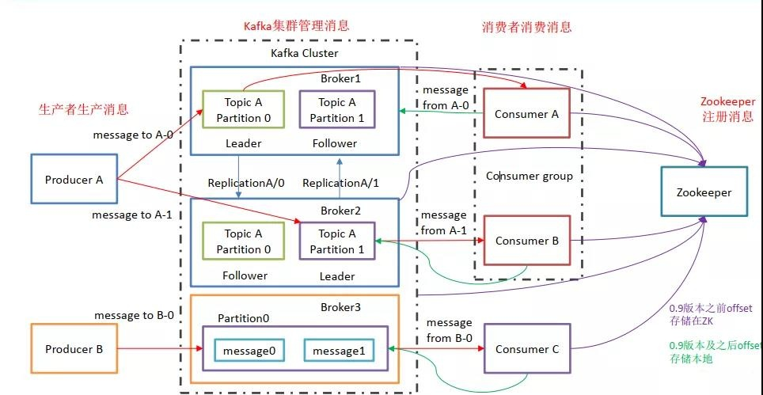
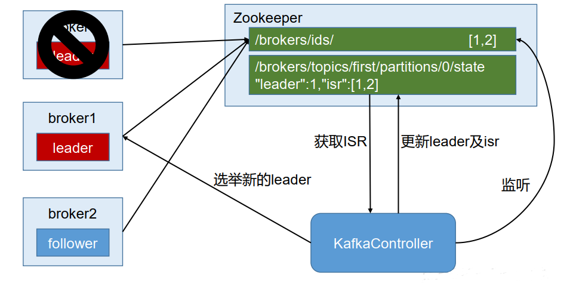
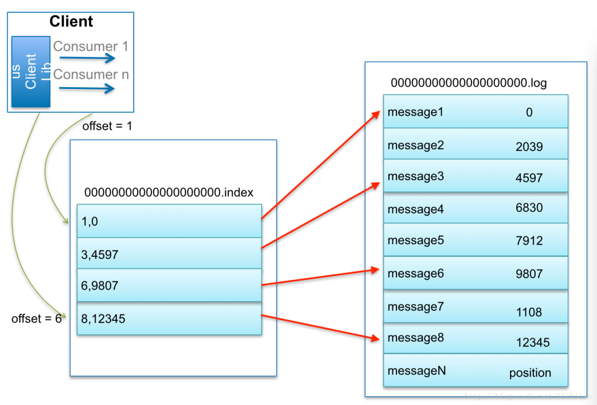

# 名词解释

1）Producer ：消息生产者，就是向 kafka broker 发消息的客户端；  
2）Consumer：消息消费者，向kafka broker 取消息的客户端；  
3）Consumer Group （CG）：消费者组，由多个 consumer 组成。消费者组内每个消费者负责消费不同分区的数据，一个分区只能由一个组内消费者消费；消费者组之间互不影响。所有的消费者都属于某个消费者组，即消费者组是逻辑上的一个订阅者。  
4）Broker ：一台 kafka 服务器就是一个 broker。一个集群由多个 broker 组成。一个 broker可以容纳多个 topic。  
5）Topic ：可以理解为一个队列， 生产者和消费者面向的都是一个topic；  
6）Partition：为了实现扩展性，一个非常大的 topic 可以分布到多个 broker（即服务器）上，一个 topic 可以分为多个 partition，每个 partition 是一个有序的队列；  
7）Replica：副本，为保证集群中的某个节点发生故障时， 该节点上的 partition 数据不丢失，且 kafka 仍然能够继续工作， kafka 提供了副本机制，一个 topic 的每个分区都有若干个副本，一个 leader 和若干个 follower。  
8）leader：每个分区多个副本的“主”，生产者发送数据的对象，以及消费者消费数据的对象都是 leader。  
9）follower：每个分区多个副本中的“从”，实时从 leader 中同步数据，保持和 leader 数据的同步。leader 发生故障时，某个 follower 会成为新的 follower。  
Kafka中发布订阅的对象是topic。我们可以为每类数据创建一个topic，把向topic发布消息的客户端称作producer，从topic订阅消息的客户端称作consumer。  
Producers和consumers可以同时从多个topic读写数据。一个kafka集群由一个或多个broker服务器组成，它负责持久化和备份具体的kafka消息。

#集群架构

# Zookeeper在Kafka中的作用

所有的Kafka Broker节点一起去Zookeeper上注册，只有一个 broker 会被选举为 Controller，Controller负责管理集群 broker 的上下线，所有 topic 的分区副本分配和 leader 选举等工作。

# Cluster & Controller

多个Broker构成一个Cluster（集群）对外提供服务，每个集群会选取一个Broker来担任Controller。  

Controller职责：管理分区的状态、管理每个分区的副本状态、监听Zookeeper中数据的变化等工作。

其他Broker：监听Controller Leader的状态。

当Controller出现故障时会重新选取Controller Leader。

# Producer

主要工作是生产消息，Broker响应producer的请求返回topic的元信息，比如哪些leader partition可访问；

写入方式：根据消息key的Hash值选择分区、随机轮询、或者按序轮询全部分区。

通过Producer的参数控制批量写入到partition，参数值可以设置为累计的消息的数量（如500条）、累计的时间间隔（如100ms）或者累计的数据大小(64KB)。

生产者数据可靠性保证和ACK机制：为保证 producer 发送的数据，能可靠的发送到指定的 topic， topic 的每个 partition 收到producer 发送的数据后， 都需要向 producer 发送 ack，如果producer 收到 ack， 就会进行下一轮的发送，否则重新发送数据。

acks参数配置：

0：producer 不等待 broker 的 ack，这一操作提供了一个最低的延迟， broker 一接收到还没有写入磁盘就已经返回，当 broker 故障时有可能丢失数据；

1：producer 等待 broker 的 ack， partition 的 leader 落盘成功后返回 ack，如果在 follower同步成功之前 leader 故障，那么将会丢失数据；

-1（all） ：producer 等待 broker 的 ack， partition 的 leader 和 follower 全部落盘成功后才返回 ack。但是如果在 follower 同步完成后， broker 发送 ack 之前， leader 发生故障，那么会造成数据重复。
# Topic

Kafka 中消息是以 topic 进行分类， 生产者生产消息，消费者消费消息，都是面向 topic；

topic 是逻辑上的概念，而 partition 是物理上的概念，每个 partition 对应于一个log文件，该 log 文件中存储的就是 producer 生产的数据；

Producer 生产的数据会被不断追加到该log 文件末端，且每条数据都有自己的 offset；

消费者组中的每个消费者， 都会实时记录自己消费到了哪个 offset，以便出错恢复时，从上次的位置继续消费。

- [名词解释](#名词解释)
- [Zookeeper在Kafka中的作用](#zookeeper在kafka中的作用)
- [Cluster \& Controller](#cluster--controller)
- [Producer](#producer)
- [Topic](#topic)
- [Kafka文件存储机制](#kafka文件存储机制)
- [ISR集合](#isr集合)
- [Consumer](#consumer)
- [Consumer Group](#consumer-group)
- [kafka幂等性原理](#kafka幂等性原理)
  - [解决的问题](#解决的问题)
  - [解决的办法](#解决的办法)
  - [解决的原理](#解决的原理)
  - [限制条件](#限制条件)

# Kafka文件存储机制
由于生产者生产的消息会不断追加到 log 文件末尾， 为防止 log 文件过大导致数据定位效率低下， Kafka 采取了分片和索引机制，将每个partition 分为多个 segment。

每个 segment对应两个文件——“.index”文件和“.log”文件。这些文件位于一个文件夹下， 该文件夹的命名规则为：topic 名称+分区序号。

index 和 log 文件以当前 segment 的第一条消息的 offset 命名。

# ISR集合
ISR是In-Sync Replica的缩写，ISR集合表示的是目前“可用”（alive）**且消息量与Leader相差不多的副本集合。ISR集合中的副本必须满足下面两个条件：  
- 副本所在节点必须维持着与zookeeper的连接；  
- 副本最后一条消息的offset 与 leader副本的最后一条消息的offset之间 的差值不能超出指定的阈值。

每个分区的leader副本会维护此分区的ISR集合，会将不符合上面两个条件的副本踢出ISR集合外。

1. 每个Topic可以划分成多个分区，同一Topic下的不同分区包含的消息是不同的；

2. Topic的Partition数量大于等于Broker的数量，可以提高吞吐率；

3. 同一个Partition的Replica尽量分散到不同的机器，高可用；

4. 添加Partition时，Partition里面的信息不会重新分配，新增的Partition是空的；

5. Replica数量最小为1，最大为broker的数量；

6. Replica副本数越高，系统虽然越稳定，但是回来带资源和性能上的下降；

7. producer先把message发送到partition leader，再由leader发送给其他partition follower；

8. leader和follower分布在不同的broker，leader所在的broker宕机后，重新选举新的leader继续对外提供服务；

9. 数据保留策略可以有全局配置，也可以针对某个Topic覆盖全局配置；
# Consumer 

consumer 采用 pull（拉）模式从 broker 中读取数据。由于 consumer 在消费过程中可能会出现断电宕机等故障， consumer 恢复后，需要从故障前的位置的继续消费，所以 consumer 需要实时记录自己消费到了哪个 offset，以便故障恢复后继续消费；Kafka 0.9 版本之前， consumer 默认将 offset 保存在 Zookeeper 中，从 0.9 版本开始，consumer 默认将 offset 保存在 Kafka 一个内置的 topic 中，该 topic 为__consumer_offsets；用户也可根据需要自行维护offset信息。
# Consumer Group
1. Consumer group是由各个consumer线程组成的组，partition中的每个message只能被组内的一个consumer线程消费；
2. 新启动的consumer默认从partition队列最头端最新的地方开始阻塞的读message；
3. 一个消费组内不管有多少个线程，都会去消费所有的partition，消费者线程数等于partition数量时效率最高；
4. 消费组支持指定位置消费，从头开始，从最新开始，指定位置，详见KafkaConsumer重置Offset
5. Consumer增加或删除，或者Broker的增加或者减少都会触发 Consumer Rebalance
6. 如果producer的流量增大，可以增加分区数，同时调整consumer线程数，提高吞吐量；
# kafka幂等性原理
## 解决的问题
Producer和Broker之间的通信总有可能出现异常，如果消息已经写入，但ACK在半途丢失了，Producer就会再次发送该消息，造成重复。
## 解决的办法
只需要将Producer的enable.idempotence配置项设为true，就能保证消息就算重发也仅写入一次。
## 解决的原理
究其原因，Kafka加入了以下两个标记值：
- PID，在Producer初始化时分配，作为每个Producer会话的唯一标识；
- 序列号（sequence number），Producer发送的每条消息（更准确地说是每一个消息批次，即ProducerBatch）都会带有此序列号，从0开始单调递增。Broker根据它来判断写入的消息是否可接受。  

Broker会为每个TopicPartition组合维护PID和序列号。对每条接收到的消息，都会检查它的序列号是否比Broker所维护的值严格+1，只有这样才是合法的，其他情况都会丢弃。
## 限制条件
Kafka的幂等性实现了对于单个Producer会话、单个TopicPartition级别的不重不漏，也就是最细粒度的保证。如果Producer重启（PID发生变化），或者写入是跨Topic、跨Partition的，单纯的幂等性就会失效，需要更高级别的事务性来解决了。