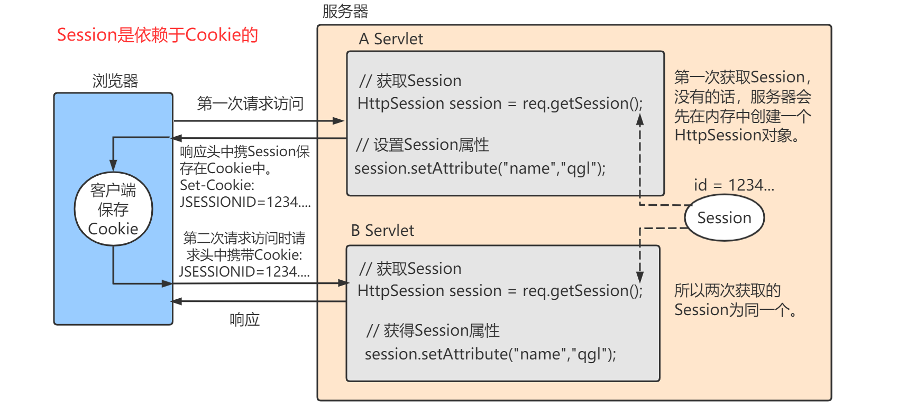

# 什么是SESSION
http是无状态的协议，每次请求之间是独立的。客户端请求访问 web 服务器时，服务器会打开一个会话响应，但是当你多次请求访问服务器，服务器并不知道每次都是你来请求访问，服务器也不会自动维护客户的上下文信息，所以服务器每次都会打开新的会话，每次请求都是独立的。

Session会话的弊端  
（1）服务器压力增大  
通常session是存储在内存中的，每个用户通过认证之后都会将session数据保存在服务器的内存中，而当用户量增大时，服务器的压力增大。  
（2）CSRF跨站伪造请求攻击  
session是基于cookie进行用户识别的, cookie如果被截获，用户就会很容易受到跨站请求伪造的攻击。  
（3）无法实现session共享。  
如果将来搭建了多个服务器，虽然每个服务器都执行的是同样的业务逻辑，但是session数据是保存在内存中的（不是共享的），用户第一次访问的是服务器1，当用户再次请求时可能访问的是另外一台服务器2，服务器2获取不到session信息，就判定用户没有登陆过

# 什么是Cookie
当客户端第一次请求访问服务器时，会建立与服务端的一次会话，并会生成一个Cookie，通过 Response 响应返回给客户端，并将 Cookie 保存到客户端本地。当客户端再次请求访问服务端时，Cookie 会跟着 Request 请求一起到服务器，服务器会先查找 Cookie 中记录的信息，返回相应的信息给用户端。

Cookie 是以键值对（Key:Value）的形式存储在本地硬盘，用户可以手动删除 Cookie 信息或者服务端通过 cookie.setMaxAge(int seconds) 设置 Cookie 在客户端的持久化时间，当过了持久化时间后，浏览器将自动删除该 Cookie 信息（如果不设置持久化时间，默认是在浏览器关闭后销毁 Cookie 信息）。

# session跟Cookie关系图



# 2种Token：
## 去中心化的JWT token  
优点：  
- 去中心化，便于分布式系统使用  
- 基本信息可以直接放在token中。 username，nickname，role  
- 功能权限较少的话，可以直接放在token中。用bit位表示用户所具有的功能权限  

缺点：
- 服务端不能主动让token失效

## 中心化的 redis token / memory session等
优点：
- 服务端可以主动让token失效  

缺点：  
- 依赖内存或redis存储。
- 分布式系统的话，需要redis查询/接口调用增加系统复杂性。


# token如何出现的

token其实借鉴了cookie和session的工作原理，解决session依赖于单个服务器不能实现session共享的问题：单体应用时用户信息保存在session中，不会出现问题，但是如果有多太服务器就会出现问题。比如用户在A服务器登录后，session就存在A服务器中，但是之后第二次请求分到了B服务器，由于B服务器没有用户的session数据，因此用户还要重新登录。

① 在session会话管理中，cookie中保存的是session_id，这是一个具有唯一性标识的字符串，因为我们也可以使用一个具有唯一性标识的字符串返回给浏览器，保存在浏览器内存中。

② 服务器端存放的是session数据，每个session对象包括session_id和session数据中的键值对，这不就是redis中的哈希表吗？因此可以使用redis的哈希类型来模拟服务器的session。

③ 因此我们可以在用户第一次请求是生成一个全局唯一的token返回给浏览器，同时将用户信息保存在redis中并设置过期时间（session的过期时间为30分钟），之后浏览器的每次请求都带着这个token，服务器根据每次请求到redis中查找对应的用户信息。

# JWT（Json web token）
jwt的由三部分组成，官网：https://jwt.io/
```json
头部（Header）
    用于描述关于该JWT的最基本的信息，例如其类型以及签名所用的算法等。这也可以被表示成一个JSON对象。
    然后将其进行base64编码，得到第一部分
{
"typ": "JWT",
"alg": "HS256"
}

载荷（Payload）
    一般添加用户的相关信息或其他业务需要的必要信息。但不建议添加敏感信息，因为该部分在客户端可解密
    （base64是对称解密的，意味着该部分信息可以归类为明文信息）
    然后将其进行base64编码，得到第二部分

{ "iss": "JWT Builder", 
  "iat": 1416797419, 
  "exp": 1448333419, 
  "aud": "www.example.com", 
  "sub": "aaa@example.com", 
  "Email": "aaa@example.com", 
  "Role": [ "admin", "user" ] 
}
iss:该JWT的签发者，是否使用是可选的；
sub:该JWT所面向的用户，是否使用是可选的；
aud:接收该JWT的一方，是否使用是可选的；
exp(expires):什么时候过期，这里是一个Unix时间戳，是否使用是可选的；
iat(issued at):在什么时候签发的(UNIX时间)，是否使用是可选的；
nbf (Not Before):如果当前时间在nbf里的时间之前，则Token不被接受；是否使用是可选的；
jti:JWT的唯一身份标识，主要用来作为一次性token,从而回避重放攻击。

签名（Signature）
    需要base64加密后的header和base64加密后的payload使用"."连接组成的字符串，
    然后通过header中声明的加密方式进行加盐secret组合加密（在加密的时候，我们还需要提供一个密钥（secret），加盐secret组合加密）
    然后就构成了jwt的第三部分。
最后，将这一部分签名也拼接在被签名的字符串后面，我们就得到了完整的JWT

```
jwt认证方式：注册登录->服务端将生成一个token，并将token与user加密生成一个密文->将token+user+密文数据 返回给浏览器->再次访问时传递token+user+密文数据，后台会再次使用token+user生成新密文，与传递过来的密文比较，一致则正确。

具体流程：

①认证成功后，会对当前用户数据进行加密，生成一个加密字符串token，返还给客户端（服务器端并不进行保存）

②浏览器会将接收到的token值存储在Local Storage中，（通过js代码写入Local Storage，通过js获取，并不会像cookie一样自动携带）

③再次访问时服务器端对token值的处理：服务器对浏览器传来的token值进行解密，解密完成后进行用户数据的查询，如果查询成功，则通过认证，实现状态保持，所以，即时有了多台服务器，服务器也只是做了token的解密和用户数据的查询，它不需要在服务端去保留用户的认证信息或者会话信息，这就意味着基于token认证机制的应用不需要去考虑用户在哪一台服务器登录了，这就为应用的扩展提供了便利，解决了session无法共享的弊端。
