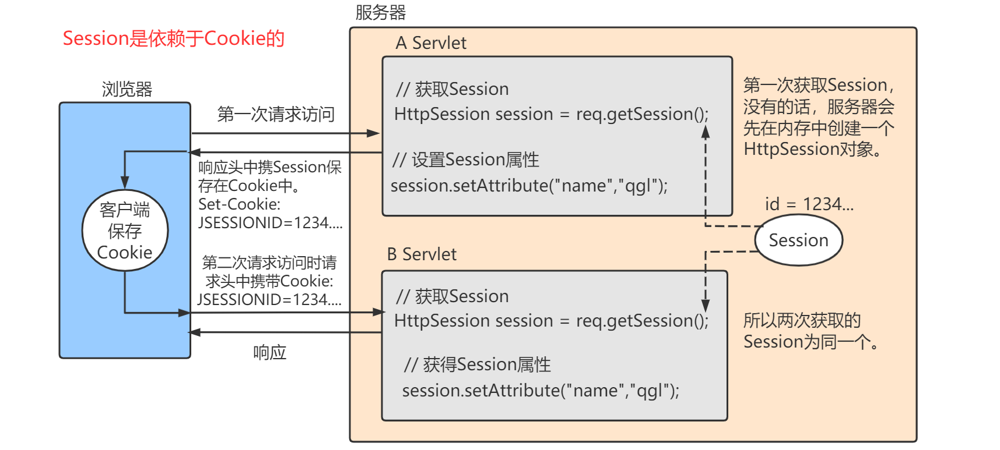

# 什么是SESSION
http是无状态的协议，每次请求之间是独立的。客户端请求访问 web 服务器时，服务器会打开一个会话响应，但是当你多次请求访问服务器，服务器并不知道每次都是你来请求访问，服务器也不会自动维护客户的上下文信息，所以服务器每次都会打开新的会话，每次请求都是独立的。

# 什么是Cookie
当客户端第一次请求访问服务器时，会建立与服务端的一次会话，并会生成一个Cookie，通过 Response 响应返回给客户端，并将 Cookie 保存到客户端本地。当客户端再次请求访问服务端时，Cookie 会跟着 Request 请求一起到服务器，服务器会先查找 Cookie 中记录的信息，返回相应的信息给用户端。

Cookie 是以键值对（Key:Value）的形式存储在本地硬盘，用户可以手动删除 Cookie 信息或者服务端通过 cookie.setMaxAge(int seconds) 设置 Cookie 在客户端的持久化时间，当过了持久化时间后，浏览器将自动删除该 Cookie 信息（如果不设置持久化时间，默认是在浏览器关闭后销毁 Cookie 信息）。

# session跟Cookie关系图
