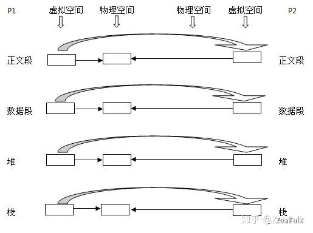

- [enum class](#enum-class)
- [try-catch-finally和return的执行顺](#try-catch-finally和return的执行顺)
- [flexible array member not at end of struct](#flexible-array-member-not-at-end-of-struct)
- [linux socket的epollin/epollout是何时触发的](#linux-socket的epollinepollout是何时触发的)
  - [建议](#建议)
  - [其它](#其它)
- [进程替换](#进程替换)
- [孤儿进程](#孤儿进程)
- [僵尸进程](#僵尸进程)
  - [wait函数](#wait函数)
  - [waitpid函数](#waitpid函数)
- [fork函数](#fork函数)
- [copy-on-write](#copy-on-write)

# enum class
在C++中，变量名字仅仅在一个作用域内生效，出了大括号作用域，那么变量名就不再生效了。但是传统C++的enum却特殊，只要有作用域包含这个枚举类型，那么在这个作用域内这个枚举的变量名就生效了。即枚举量的名字泄露到了包含这个枚举类型的作用域内。在这个作用域内就不能有其他实体取相同的名字。
```cpp
enum Color{black,white,red};	//black、white、red作用域和color作用域相同
auto white = false;	//错误，white已经被声明过了
```
C++11中新增了枚举类，也称作限定作用域的枚举类。  
使用枚举类的第一个优势就是为了解决传统枚举中作用域泄露的问题。在其他地方使用枚举中的变量就要声明命名空间。
```cpp
enum class Color{black,white,red}; //black、white、red作用域仅在大括号内生效
auto white = false;		//正确，这个white并不是Color中的white
Color c = white;	//错误，在作用域范围内没有white这个枚举量
Color c = Color::white;	//正确
auto c = Color::white;	//正确
```
# try-catch-finally和return的执行顺
任何执行try 或者catch中的return语句之前，都会先执行finally语句，如果finally存在的话。

如果finally中有return语句，那么程序就return了，所以finally中的return是一定会被return的。

# flexible array member not at end of struct
error: flexible array member not at end of struct  

在C++之中，给定了一个结构定义和一个指向结构的指针，编译器必须能够通过指针偏移的方式访问该结构的任何成员。由于结构中每个成员的位置都取决于其前导成员的数量和类型，因此访问任何结构都需要知道所有前导成员的数量和类型。 

在结构体之中，如果是数组为结构体之中最后的成员。这并不违反上述的编译规则。但是，如果flexible array member出现在了结构体末尾以外的任何位置，则其后的任意成员的位置都将取决于数组中对应的类型的个数，所以编译器禁止将没有定义长度的数组作为结构体的中间成员。  
例子：
```c
struct __attribute__ ((__packed__)) sdshdr64 {
    uint64_t len; /* used */
    uint64_t alloc; /* excluding the header and null terminator */
    unsigned char flags; /* 3 lsb of type, 5 unused bits */
    char buf[];
};
```
通过
```c
struct __attribute__ ((__packed__)) sdshdr64 {
    uint64_t len; /* used */
    uint64_t alloc; /* excluding the header and null terminator */
    unsigned char flags; /* 3 lsb of type, 5 unused bits */
    char buf[];
    char test;
};
```
报错

# linux socket的epollin/epollout是何时触发的
epollin产生的原因：
1. 有新数据到达，socket可读。
2. 对方关闭了连接或只关闭了SEND_SHUTDOWN，导致我们关闭了RCV_SHUTDOWN。

epollout产生的原因：
1. 建立tcp连接,客户端连接场景  
触发条件：客户端connect上服务端后，得到fd，这时候把fd添加到epoll 事件池里面后，因为连接可写，会触发EPOLLOUT事件
2. 客户端发包场景  
触发条件：缓冲区从满到不满，会触发EPOLLOUT事件  
典型应用场景(数据包发送问题)：  
数据包发送逻辑：将数据包发完内核缓冲区–>进而由内核再将缓冲区的内容发送出去；这边send只是做了第一部分的工作，如果缓存区满的话send将会得到已发送的数据大小(成功放到缓冲区的)，而不是整个数据包大小。
这种情况我们可以借助EPOLLOUT事件加以解决：如果send部分成功，则表示缓存区满了，那么把剩下的部分交给epoll，当检测到EPOLLOUT事件后，再将剩余的包发送出去。
3. 重新注册EPOLLOUT事件  
触发条件：如果当连接可用后，且缓存区不满的情况下，调用epoll_ctl将fd重新注册到epoll事件池(使用EPOLL_CTL_MOD)，这时也会触发EPOLLOUT时间。  
典型应用场景：  
send或write发包函数会涉及系统调用，存在一定开销，如果能将数据包聚合起来，然后调用writev将多个数据包一并发送，则可以减少系统调用次数，提高效率。这时EPOLLOUT事件就派上用场了：当发包时，可以将先数据包发到数据buffer(用户缓存区)中存放，然后通过重新注册EPOLLOUT事件，从而触发EPOLLOUT事件时，再将数据包一起通过writev发送出去。
## 建议
1. 对于服务端listen socket不需要将EPOLLOUT注册到epoll事件模型中。因为listen socket只是负责接收数据（接收客户端建立连接请求），不会发送数据，所以不需要注册时EPOLLOUT。

2. 按需注册EPOLLOUT。当我们调用send接口时，如果返回的-1且errno=EAGAIN时，再注册EPOLLOUT，后续send发送成功后，再将EPOLLOUT从epoll事件模型中移除，这就是按需注册EPOLLOUT。当然我们也可以不用移除，只不过需要判断是否真的有数据需要发送。大名鼎鼎的nginx的做法是：发送完成后会将发送的回调函数设置成一个空函数（这个函数只是定义里面什么都没有做）。nginx为什么不移除呢？因为反复添加、移除EPOLLOUT性能不友好，总是在用户层和内核层来回切换。

## 其它
- [对又一个epoll问题的全面分析](https://cloud.tencent.com/developer/article/1480243?from=15425&areaSource=102001.1&traceId=v8sW2FHaLIJOKXWR78RAy)  
- [socket的epollin/epollout是何时触发的](https://cloud.tencent.com/developer/article/1481046?areaSource=&traceId=)  
- [epoll和shutdown使用不当可能导致死循环](https://cloud.tencent.com/developer/article/1479210?areaSource=&traceId=)

# 进程替换
用fork创建子进程后，子进程执行的是和父进程相同的程序（但有可能执行不同的代码分支），若想让子进程执行另一个程序，往往需要调用一种exec函数。  

当进程调用一种exec函数时，该进程的用户空间代码和数据完全被新程序替换，并从新程序的启动例程开始执行。因为调用exec并不创建新进程，所以前后的进程ID并未改变。exec只是用一个全新的程序替换了当前进程的正文、数据、堆和栈段。  

在Linux中使用exec函数组主要有以下两种情况
1. 当进程认为自己不能再为系统和用户做出任何贡献时，就可以调用任何exec 函数族让自己重生。
2. 如果一个进程想执行另一个程序，那么它就可以调用fork函数新建一个进程，然后调用任何一个exec函数使子进程重生

exec函数会取代执行它的进程, 也就是说, 一旦exec函数执行成功, 它就不会返回了, 进程结束. 但是如果exec函数执行失败, 它会返回失败的信息, 而且进程继续执行后面的代码!  

通常exec会放在fork() 函数的子进程部分, 来替代子进程执行啦, 执行成功后子程序就会消失, 但是执行失败的话, 必须用exit()函数来让子进程退出!

exec函数都有下面这些
```c
(1)execl和execv 这两个函数是最基本的exec，都可以用来执行一个程序，区别是传参的格式不同。execl是把参数列表（本质上是多个字符串，必须以NULL结尾）依次排列而成（l其实就是list的缩写），execv是把参数列表事先放入一个字符串数组中，再把这个字符串数组传给execv函数。
————————————————
(2)execlp和execvp 这两个函数在上面2个基础上加了p，较上面2个来说，区别是：上面2个执行程序时必须指定可执行程序的全路径（如果exec没有找到path这个文件则直接报错），而加了p的传递的可以是file（也可以是path，只不过兼容了file。加了p的这两个函数会首先去找file，如果找到则执行执行，如果没找到则会去环境变量PATH所指定的目录下去找，如果找到则执行如果没找到则报错）
————————————————
(3)execle和execve 这两个函数较基本exec来说加了e，函数的参数列表中也多了一个字符串数组envp形参，e就是environment环境变量的意思，和基本版本的exec的区别就是：执行可执行程序时会多传一个环境变量的字符串数组给待执行的程序
————————————————
```

# 孤儿进程
在一个启动的进程中创建子进程，这时候父子进程同时运行，但是父进程由于某种原因先退出了，子进程还在运行，这时候这个子进程就可以被称之为孤儿进程。  

操作系统是非常关爱运行的每一个进程的，当检测到某一个进程变成了孤儿进程，这时候系统中就会有一个固定的进程领养这个孤儿进程（有干爹了）。如果使用 Linux 没有桌面终端，这个领养孤儿进程的进程就是 init 进程（PID=1），如果有桌面终端，这个领养孤儿进程就是桌面进程。  

系统为什么要领养这个孤儿进程呢？在子进程退出的时候, 进程中的用户区可以自己释放, 但是进程内核区的pcb资源自己无法释放，必须要由父进程来释放子进程的pcb资源，孤儿进程被领养之后，这件事儿干爹就可以代劳了，这样可以避免系统资源的浪费。  

# 僵尸进程
当子进程先于父进程结束,父进程没有获取子进程的退出码,此时子进程变成僵死进程。  

在一个启动的进程中创建子进程，这时候就有了父子两个进程，父进程正常运行，子进程先与父进程结束，子进程无法释放自己的 PCB 资源，需要父进程来做这个件事儿，但是如果父进程也不管，这时候子进程就变成了僵尸进程。  

为了避免僵尸进程的产生，一般我们会在父进程中进行子进程的资源回收，回收方式有两种，一种是阻塞方式 wait()，一种是非阻塞方式 waitpid()。  

## wait函数
```c
#include <sys/wait.h>
pid_t wait(int *status)
```
这是个阻塞函数，如果没有子进程退出，函数会一直阻塞等待，当检测到子进程退出了，该函数阻塞解除回收子进程资源。这个函数被调用一次，只能回收一个子进程的资源，如果有多个子进程需要资源回收，函数需要被调用多次。  

## waitpid函数
```c
#include <sys/wait.h>
// 这个函数可以设置阻塞, 也可以设置为非阻塞
// 这个函数可以指定回收哪些子进程的资源
pid_t waitpid(pid_t pid, int *status, int options);

参数:
pid:
    -1：回收所有的子进程资源，和 wait () 是一样的，无差别回收，并不是一次性就可以回收多个，也是需要循环回收的
    大于0：指定回收某一个进程的资源 ，pid 是要回收的子进程的进程 ID
    0：回收当前进程组的所有子进程 ID
    小于 -1：pid 的绝对值代表进程组 ID，表示要回收这个进程组的所有子进程资源
status: NULL, 和 wait 的参数是一样的
options: 控制函数是阻塞还是非阻塞
    0: 函数是行为是阻塞的 ==> 和 wait 一样
    WNOHANG: 函数是行为是非阻塞的
返回值:
    如果函数是非阻塞的，并且子进程还在运行，返回 0
    成功：得到子进程的进程 ID
    失败: -1
    没有子进程资源可以回收了，函数如果是阻塞的，阻塞会解除，直接返回 - 1
    回收子进程资源的时候出现了异常
```

# fork函数
Negative Value: creation of a child process was unsuccessful.
Zero: Returned to the newly created child process.
Positive value: Returned to parent or caller. The value contains process ID of newly created child process.

# copy-on-write
OS 领域 copy-on-write 核心思想则是 lazy copy。我们知道应用程序通常是不会直接和物理内存打交道的，所谓的内存寻址只是针对虚拟内存空间而言，而从虚拟内存到物理内存的映射则需要借助 MMU （存储管理单元）实现。  

以 linux 为例，当通过系统调用（syscall）从一个已经存在的进程 P1 中 fork 出一个子进程 P2，OS会为 P2 创建一套与 P1 保持一致映射关系的虚拟内存空间，从而实现了 P1 和 P2 对物理空间的共享，这样做的目的是为了减少对物理内存的消耗，毕竟两份完全一样的数据没必要额外占用多一倍物理内存空间。此后，如果 P1 或 P2 需要更改某段内存，则须为其按需分配额外物理内存，将共享数据拷贝出来，供其修改，这里注意，无论父还是子进程，只要有修改，就会涉及到内存拷贝，这里的影响粒度范围是内存页，linux 内存页大小为 4KB。  

  

通过OS copy-on-write 的过程我们可以总结出两个重要的特性：
- 父子进程的内存共享的数据仅仅是fork那一时间点的数据，fork 后的数据不会有任何共享；
- 所谓 lazy copy，就是在需要修改的时候拷贝一个副本出来，如果没有任何改动，则不会占用额外的物理内存。

基于这两个特性我们可以知道，copy-on-write 的在 OS 领域的设计初衷可能并非为了解决并发读的效率问题，参考维基[1]对 copy-on-write 的定义：
```
写入时复制（英语：Copy-on-write，简称COW）是一种计算机程序设计领域的优化策略。其核心思想是，如果有多个调用者（callers）同时请求相同资源（如内存或磁盘上的数据存储），他们会共同获取相同的指针指向相同的资源，直到某个调用者试图修改资源的内容时，系统才会真正复制一份专用副本（private copy）给该调用者，而其他调用者所见到的最初的资源仍然保持不变。
```
很明显，如若我们利用 OS 这层优化策略，我们将大大减少了对物理内存的消耗，同时也提高了创建进程的效率，因为 OS 一开始并不需要给 fork 出来的新进程分配物理内存空间。因此 copy-on-write 非常适合内存快照的 dump，例如 redis 的 rdb dump。至于为什么合适，我认为有如下几点：

1. 考虑到 dump 的对象理应是某一时间点的内存快照信息，根据特性1，这里完美契合；
2. dump 内存过程是耗时的，务必不能占用主线程资源，应当合理利用 CPU 多线程的优势，这里 fork 进程去处理 dump 任务本身就是理所应当的；
3. 如果内存快照本身已经占用了50%以上的内存资源，如果不采用 copy-on-write 策略，显然无法 fork 出任何进程，因为没有足够的物理内存可以分配。

综上，无论 redis 还是数据库，或是其他中间件，采用 OS 层面 copy-on-write 优化策略实现 dump 内存快照功能都是非常合理的，或许会问为什么不用多线程的方式去做，而用多进程？  

copy-on-write 只是一套思想理念，至于你用进程和线程，我相信实现效果上并无差别，唯一的差别是你通过系统调用直接 fork 出来的进程就已经囊括了 copy-on-write 优化策略了，而你却尝试用线程去实现一套与 OS 层面一样的逻辑，这又是何苦呢？

Copy_on_write即写时复制,它的原理是通过引用计数来实现的:  
即在分配空间时多分配额外的空间,用来记录有多少个指针指向该空间.当有新的指针指向该空间,引用计数则加一,当要释放该空间时,引用计数则减一,直到引用计数减为0时,才真正释放该空间.当有指针要改变该空间的值时,再为这个指针分配自己的空间.而我们说的引用计数,存在于堆内存中.