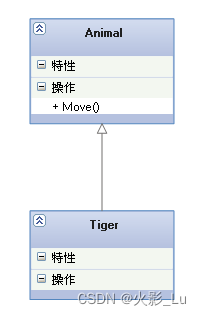

- [泛化（Generalization）](#泛化generalization)
- [实现（Realization）](#实现realization)
- [关联（Association)](#关联association)
- [聚合（Aggregation）和组合(Composition)](#聚合aggregation和组合composition)
- [依赖(Dependency)](#依赖dependency)
- [UML类图概念详解](#uml类图概念详解)
  - [可见性（visibility）：](#可见性visibility)
  - [参数的方向（parameter direction）](#参数的方向parameter-direction)
  - [类成员（变量或者函数）的类型](#类成员变量或者函数的类型)
  - [箭头及指向](#箭头及指向)
# 泛化（Generalization）
一种继承关系
```cpp
// Animal.h  
class CAnimal  
{  
public:  
    // implement  
    virtual HRESULT EatSomething()  
    {  
        // Do something  
    }  
};  
  
// Tiger.h  
#include "Animal.h"  
class CTiger : public CAnimal  
{  
    // Do something  
}; 
```
# 实现（Realization）
类与接口的关系, 表示类是接口所有特征和行为的实现.
```cpp
// Animal.h  
class CAnimal  
{  
public:  
    // interface  
    virtual HRESULT EatSomething() = 0;  
};  
  
// Tiger.h  
#include "Animal.h"  
class CTiger : public CAnimal  
{  
    // Do something  
};
```
# 关联（Association)
一种拥有的关系, 可以分为双向关联, 单向关联和自身关联。  
- 双向关联
```cpp
// Husband.h  
#include "wife.h"  
class CHusband  
{  
public:  
    CWife* pWife;  
};  
  
// Wife.h  
#include "Husband.h"  
class CWife  
{  
public:  
    CHusband* pHuband;  
};  
```
- 单向关联
```cpp
// Husband.h  
class CHusband  
{  
public:  
    int nMoney;  
    void GoShopping();   
};  
  
// Wife.h  
#include "Husband.h"  
class CWife  
{  
public:  
    CHusband* pHuband;  
};  
```
- 自身关联
```cpp
// SingleMan.h  
class CSingleMan  
{  
public:  
    CSingleMan *pSingleMan;  
};  
```
# 聚合（Aggregation）和组合(Composition)
- 聚合关系: 是整体与部分的关系, 且部分可以离开整体而单独存在. 如车和轮胎是整体和部分的关系, 轮胎离开车仍然可以存在.
```cpp
// Car.h  
#include "Tyre.h"  
class CCar  
{  
public:  
    CTyre cTyre;  
};  
  
// Tyre.h  
#include "Car.h"  
class CTyre  
{  
    // Do something  
};  
```
- 组合关系: 是整体与部分的关系, 但部分不能离开整体而单独存在. 如公司和部门是整体和部分的关系, 没有公司就不存在部门.
```cpp
// Company.h  
#include "Department.h"  
class CCompany  
{  
public:  
    CDepartment cDepartment;  
};  
  
// Department.h  
#include "Company.h"  
class CDepartment  
{  
    // Do something  
};  
```
- 区别：  
1、聚合就是在一个类中引用了另一个类作为属性，但没有创建对象，需要通过构造器、setter方法进行传入。  
2、组合关系是指在一个类中引用另一个类作为属性，并且创建了对象。
# 依赖(Dependency)
一种使用的关系,  即一个类的实现需要另一个类的协助
```cpp
// Car.h  
class CCar  
{  
    // Do something  
};  
  
// Person.h  
#include "Car.h"  
class CPerson  
{  
    void MoveFast(CCar &pCar);  
};  
```

# UML类图概念详解
## 可见性（visibility）：
- ‘+’ public
- ‘-’ private
- ‘#’ protected
## 参数的方向（parameter direction）
- ‘in’：用于输入的参数，get the value
- ‘out’：用于输出的参数， set the value
- ‘inout’：既可作为输入又可作为输出， get the value and set the value
## 类成员（变量或者函数）的类型
- 静态成员，下划线表示
- 纯虚函数，斜体
- 
## 箭头及指向
- 聚合  

- 关联  
  
- 组合  
  
- 依赖  
  
- 泛化  
 
- 实现  
 