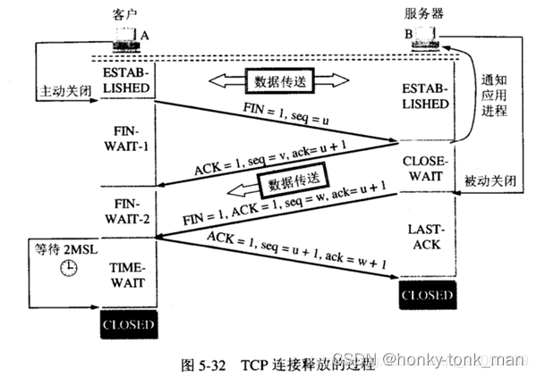

        close(server_sock);
        close(client_sock);
}
```
## 简单客户端例子
``` cpp
#include <stdio.h>
#include <stdlib.h>
#include <string.h>

#include <sys/types.h>
#include <sys/socket.h>
#include <unistd.h>

#include <netinet/in.h>

#include <errno.h>

int main(void){
        //create sock
        int sock = socket(AF_INET, SOCK_STREAM, 0);
        if(sock < 0){
                fprintf(stderr, "can't create socket because of %s\n", strerror(errno));
                exit(EXIT_FAILURE);
        }

        //create address
        struct sockaddr_in server_addr;
        server_addr.sin_addr.s_addr = INADDR_ANY;
        server_addr.sin_port = htons(9001);
        server_addr.sin_family = AF_INET;

        //connect
        if( (connect(sock, (struct sockaddr*)&server_addr, sizeof(server_addr))) == -1  ){
                perror("connect error because of: ");
                close(sock);
                exit(EXIT_FAILURE);

        }

        //create recv buffer and recv
        char recv_buffer[255];
        recv(sock, recv_buffer, sizeof(recv_buffer), 0);

        //print
        printf("printf recv: %s\n", recv_buffer);

        close(sock);
        return 0;
}
```

### 上述程序的问题

我们的服务端起来后会在accept这里block住，但是当我们crtl + c强制退出的时候，listen的端口还会继续占用
这个可以在我们的状态图中找到答案
首先我们正常的四次挥手是客户端发起的(连接也是客户端发起的)，如下
