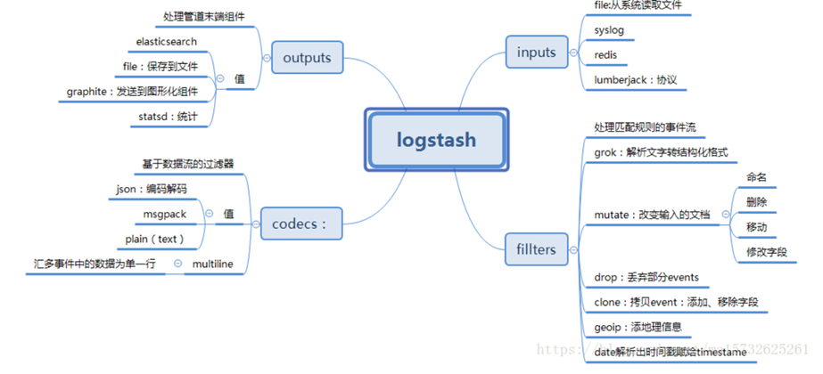
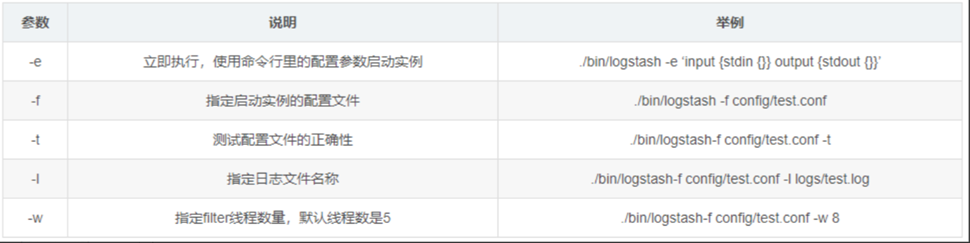

- [Logstash学习](#logstash学习)
  - [date时间处理插件](#date时间处理插件)
  - [mutate数据修改插件](#mutate数据修改插件)
  - [JSON插件](#json插件)
  - [elasticsearch查询过滤插件](#elasticsearch查询过滤插件)
  - [常用输出插件](#常用输出插件)
    - [常用编码插件](#常用编码插件)
- [收集syslog到ES的设置](#收集syslog到es的设置)
- [EMQX的例子](#emqx的例子)
- [发告警邮件](#发告警邮件)
- [logstash 的 mutate 添加、删除字段](#logstash-的-mutate-添加删除字段)


# Logstash学习  

[https://www.cnblogs.com/codehello/articles/16467021.html](https://www.cnblogs.com/codehello/articles/16467021.html)

logstash使用java开发,是一根具备实时数据传输能力的管道，负责将数据信息从管道的输入端传输到管道的输出端；与此同时这根管道还可以让你根据自己的需求在中间加上滤网，Logstash提供里很多功能强大的滤网以满足你的各种应用场景。

Logstash的事件（logstash将数据流中等每一条数据称之为一个event）处理流水线有三个主要角色完成：inputs –> filters –> outputs：

**inpust** ：必须，负责产生事件（Inputs
generate events），常用：File、syslog、redis、beats（如：Filebeats）

**filters** ：可选，负责数据处理与转换（filters modify them），常用：grok、mutate、drop、clone、geoip

**outpus** ：必须，负责数据输出（outputs
ship them elsewhere），常用：elasticsearch、file、graphite、statsd

ogstash常用于日志关系系统中做日志采集设备，最常用于ELK（elasticsearch + logstash + kibane）中作为日志收集器使用；



下载地址：

[https://www.elastic.co/cn/downloads/logstash](https://www.elastic.co/cn/downloads/logstash)

官方文档：

[https://www.elastic.co/guide/en/logstash/current/index.html](https://www.elastic.co/guide/en/logstash/current/index.html)

选择对应系统版本下载

解压，进入conf文件夹

修改配置文件：

```
input {
    # 从文件读取日志信息
    file {
        path => "/var/log/error.log"
        type => "error"//type是给结果增加一个type属性,值为"error"的条目
        start_position => "beginning"//从开始位置开始读取
        # 使用 multiline 插件，传说中的多行合并
        codec => multiline {
            # 通过正则表达式匹配，具体配置根据自身实际情况而定
            pattern => "^\d"
            negate => true
            what => "previous"
        }
    }
}

#可配置多种处理规则，他是有顺序，所以通用的配置写下面
 filter {
    grok {
       match => { "message" => "%{IP:client} %{WORD:method} %{URIPATHPARAM:request} %{NUMBER:bytes} %{NUMBER:duration}" }
     }
 }

output {
    # 输出到 elasticsearch
    elasticsearch {
        hosts => ["192.168.22.41:9200"]
        index => "error-%{+YYYY.MM.dd}"//索引名称
    }
}
```

上面的file可以配置多个：
```
file {  
        type => "tms_inbound.log"  
        path => "/JavaWeb/tms2.wltest.com/logs/tms_inbound.es.*.log"  
        codec => json {  
                charset => "UTF-8"  
            }  
    }  

  file {  
        type => "tms_outbound.log"  
        path => "/JavaWeb/tms2.wltest.com/logs/tms_outbound.es.*.log"  
        codec => json {  
                charset => "UTF-8"  
            }  
    }
```

配置文件结构：

**1)** **区段**

  Logstash通过 `<span lang="EN-US">{}</span>`来定义区域，区域内可以定义插件，一个区域内可以定义多个插件

**2)** **数据类型**

  　　Logstash仅支持少量的数据类型：


　　　　　　Boolean：ssl_enable => true


　　　　　　Number：port => 33


　　　　　　String：name => “Hello world”

　　　　　　Commonts：# this is a comment

**3)** **字段引用**

  　　Logstash数据流中的数据被称之为Event对象，Event以JSON结构构成，Event的属性被称之为字段，如果你像在配置文件中引用这些字段，只需要把字段的名字写在中括号[]里就行了，如[type]，对于嵌套字段每层字段名称都写在[]里就可以了，比如：[tags][type]；除此之外，对于Logstash的arrag类型支持下标与倒序下表，如：[tags][type][0],[tags][type][-1]。

**4)** **条件判断**

  　　Logstash支持下面的操作符：


　　　　equality：==, !=, <, >, <=, >=


　　　　regexp：=~, !~


　　　　inclusion：in, not in


　　　　boolean：and, or, nand, xor


　　　　unary：!

**5)** **环境变量引用**

  　　Logstash支持引用系统环境变量，环境变量不存在时可以设置默认值，例如：

```
export TCP_PORT=12345

input {
  tcp {
    port => "${TCP_PORT:54321}"
  }
}
```

启动参数：


常用输入插件介绍：

　　文件读取插件主要用来抓取文件的变化信息，将变化信息封装成Event进程处理或者传递。

(1)文件读取插件

(2)Beats监听插件  
   Beats插件用于建立监听服务，接收Filebeat或者其他beat发送的Events；

(3)TCP监听插件

(4)Redis读取插件

(5)Syslog监听插件

常用过滤插件介绍：  
 过滤器插件主要处理流经当前Logstash的事件信息，可以添加字段、移除字段、转换字段类型，通过正则表达式切分数据等，也可以根据条件判断来进行不同的数据处理方式。


(1)grok正则捕获

grok 是Logstash中将非结构化数据解析成结构化数据以便于查询的最好工具，非常适合解析syslog logs，apache log， mysql log，以及一些其他的web log

Grok表达式在线debug地址：[http://grokdebug.herokuapp.com/](http://grokdebug.herokuapp.com/)

预定义正则表达式参考地址：[https://github.com/logstash-plugins/logstash-patterns-core/tree/main/patterns](https://github.com/logstash-plugins/logstash-patterns-core/tree/main/patterns)

## date时间处理插件

该插件用于时间字段的格式转换，而且通常情况下，Logstash会为自动给Event打上时间戳，但是这个时间戳是Event的处理时间（主要是input接收数据的时间），和日志记录时间会存在偏差（主要原因是buffer），我们可以使用此插件用日志发生时间替换掉默认是时间戳的值。

* 常用配置参数（空 => 同上）

## mutate数据修改插件

mutate 插件是 Logstash另一个重要插件。它提供了丰富的基础类型数据处理能力。可以重命名，删除，替换和修改事件中的字段。

## JSON插件

  JSON插件用于解码JSON格式的字符串，一般是一堆日志信息中，部分是JSON格式，部分不是的情况下

## elasticsearch查询过滤插件

  用于查询Elasticsearch中的事件，可将查询结果应用于当前事件中

## 常用输出插件

(1)ElasticSearch输出插件

  用于将事件信息写入到Elasticsearch中，官方推荐插件，ELK必备插件,案例：
```
output {
    elasticsearch {
        hosts => ["127.0.0.1:9200"]
        index => "filebeat-%{type}-%{+yyyy.MM.dd}"
        template_overwrite => true
    }
}
```

(2)Redis输出插件

 用于将Event写入Redis中进行缓存，通常情况下Logstash的Filter处理比较吃系统资源，复杂的Filter处理会非常耗时，如果Event产生速度比较快，可以使用Redis作为buffer使用，案例：
```
output {
    redis {
        host => "127.0.0.1"
        port => 6379
        data_type => "list"
        key => "logstash-list"
    }
}
```

(3)File输出插件

  用于将Event输出到文件内，案例：

```
output {
    file {
        path => ...
        codec => line { format => "custom format: %{message}"}
    }
}
```

(4)TCP插件，案例：

```
tcp {
    host => ...
    port => ...
}
```

### 常用编码插件

(1)JSON编码插件

  直接输入预定义好的 JSON 数据，这样就可以省略掉 filter/grok 配置

案例：
```
json {

}
```
注意：

启动logstash慢，输入./bin/logstash没有反应，多出现在新安装的操作系统上

原因

  jruby启动的时候jdk回去从/dev/random中初始化随机数，新版本的jruby会用RPNG算法产生随后的随机数，但是旧版本的jruby会持续从/dev/random中获取数字。但是不幸的是，random发生器会跟不上生成速度，所以获取随机数的过程会被阻塞，直到随机数池拥有足够的熵然后恢复。这在某些系统上，尤其是虚拟化系统，熵数池可能会比较小从而会减慢jruby的启动速度。

  检查一下系统的熵数池 cat
/proc/sys/kernel/random/entropy_avail，正常情况这个数字推荐大于1000，对比了一下独立主机的这个数值，大约在700-900之间晃悠。

解决

  使用伪随机，编辑/usr/local/logstash/logstash-5.4.1/config/jvm.options，在最后增加一行：-Djava.security.egd=file:/dev/urandom

# 收集syslog到ES的设置

Logstash配置,监听UDP协议

```
docker pull docker.elastic.co/logstash/logstash:7.17.8
docker run -d --name=logstash docker.elastic.co/logstash/logstash:7.17.8
sleep 30
docker logs -f logstash

docker cp logstash:/usr/share/logstash /data/elk7/
mkdir /data/elk7/logstash/config/conf.d
chmod 777 -R /data/elk7/logstash

vi /data/elk7/logstash/config/conf.d/syslog.conf

input {
  udp {
    port => 5044
    type => rsyslog
  }
}


filter {
  if [type] == "rsyslog" {
    grok {
      match => { "message" => "%{SYSLOGTIMESTAMP:syslog_timestamp} %{SYSLOGHOST:syslog_hostname} %{DATA:syslog_program}(?:\[%{POSINT:syslog_pid}\])?: %{GREEDYDATA:syslog_message}" }
      add_field => [ "received_at", "%{@timestamp}" ]
      add_field => [ "received_from", "%{host}" ]
    }
    date {
      match => [ "syslog_timestamp", "MMM  d HH:mm:ss", "MMM dd HH:mm:ss" ]
    }
  }
}

output {
  elasticsearch {
    hosts => ["172.1.1.196:9200"]
    user => elastic
    password => elastic
  }

  stdout { codec => rubydebug }
}


cat logstash.yml
http.host: "0.0.0.0"
xpack.monitoring.elasticsearch.hosts: [ "http://172.1.1.196:9200" ]
xpack.monitoring.elasticsearch.username: "elastic"
xpack.monitoring.elasticsearch.password: "elastic"
path.config: /usr/share/logstash/config/conf.d/*.conf
path.logs: /usr/share/logstash/logs

docker run  --name=logstash --restart=always -p 5044:5044/udp -v /data/elk7/logstash:/usr/share/logstash logstash:7.17.8
```

测试：

```
logger -d -P 5044 -n 172.1.1.196 'Dec 15 20:47:42 host-172.1.1-196 systemd[1]: Stopped System Logging Service.'
```

或者

```
yum install nc –y
nc -zvu 172.1.1.196 5044
```

检查logstash日志

```
docker logs -f logstash
```
# EMQX的例子
```yaml
# EMQX配置
cat filebeat.yml | grep -v '#' | grep -v '^$'
fields:
   env:dev
   idc:shenzhen

filebeat.inputs:
- type: log
  enabled: true
  tags: ['mytest_xx.xx.xx.xx']
  paths:
    - /var/log/emqx/emqx.log.[0-9]*
  
output.logstash:
  hosts: ["xx.xx.xx.xx:31074"]


# logstash配置
input {
  beats {
    port => 5046
  }
}

filter {
  grok {
      match => { "message" => "((%{TIMESTAMP_ISO8601:emqx_time} \[%{LOGLEVEL:emqx_log_level}\] (%{USER:emqx_user}@)*(%{HOSTPORT:emqx_clientHostPort})*( \[%{WORD:emqx_message_type}\])*) )*%{GREEDYDATA:emqx_message}" }
    }
}

output {
  elasticsearch {
    hosts => ["es.test.xxxxx.com:9200"]
    data_stream => true
    data_stream_type => "logs"
    data_stream_dataset => "emqx"
    data_stream_namespace => "%{[fields][idc]}-%{[fields][env]}"
    user => elastic
    password => xxxxxx
  }
}
```
# 发告警邮件
```yaml
output {
  elasticsearch {
    hosts => ["localhost:9200"]
    index => "your_index"
  }
  if [c] == 5 {
    email {
      to => 'your.email@example.com'
      subject => 'Alert - Record with c=5'
      body => 'This is an automated message. A record with c=5 was detected.'
    }
  }
}
```

```sh
#!/bin/bash
instance_ip=172.1.1.1
# ES会把时间转换成0时区后存储
begin_time=$(TZ='UTC+0'  date -d"-60 seconds" '+%Y-%m-%dT%H:%M:%S')
end_time=$(TZ='UTC+0'  date -d"seconds" '+%Y-%m-%dT%H:%M:%S')
warnings_num=$(curl -X POST "http://172.1.1.1:9200/_sql?format=json" -uelastic:elastic -H 'Content-Type: application/json' -d "{\"query\": \"SELECT COUNT(*) as cnt FROM \\\"ingress-nginx\\\" WHERE status between 400 and 599 and upstream_status between 400 and 599 and \\\"@timestamp\\\" between '$begin_time' and '$end_time' and proxy_upstream_name like 'evoc1-diving%'\"}" | jq -r '.rows[0] | @tsv')

cat <<EOF | curl --data-binary @- http://172.1.1.1:9001/metrics/job/es-$instance_ip/instance/$instance_ip
  # TYPE warnings_num
  es_warnings $warnings_num
EOF
```

# logstash 的 mutate 添加、删除字段
ingress的日志适配：
```json
filter {
  mutate { 
       remove_field => "Time"
       add_field => { "%{[Contents][0][Key]}" => "%{[Contents][0][Value]}" }
       add_field => { "%{[Contents][1][Key]}" => "%{[Contents][1][Value]}" }
       add_field => { "%{[Contents][2][Key]}" => "%{[Contents][2][Value]}" }
       add_field => { "%{[Contents][3][Key]}" => "%{[Contents][3][Value]}" }
       add_field => { "%{[Contents][4][Key]}" => "%{[Contents][4][Value]}" }
       add_field => { "%{[Contents][5][Key]}" => "%{[Contents][5][Value]}" }
       add_field => { "%{[Contents][6][Key]}" => "%{[Contents][6][Value]}" }
       add_field => { "%{[Contents][7][Key]}" => "%{[Contents][7][Value]}" }
       add_field => { "%{[Contents][8][Key]}" => "%{[Contents][8][Value]}" }
       add_field => { "%{[Contents][9][Key]}" => "%{[Contents][9][Value]}" }
       add_field => { "%{[Contents][10][Key]}" => "%{[Contents][10][Value]}" }
       add_field => { "%{[Contents][11][Key]}" => "%{[Contents][11][Value]}" }
       add_field => { "%{[Contents][12][Key]}" => "%{[Contents][12][Value]}" }
       add_field => { "%{[Contents][13][Key]}" => "%{[Contents][13][Value]}" }
       add_field => { "%{[Contents][14][Key]}" => "%{[Contents][14][Value]}" }
       add_field => { "%{[Contents][15][Key]}" => "%{[Contents][15][Value]}" }
       add_field => { "%{[Contents][16][Key]}" => "%{[Contents][16][Value]}" }
       add_field => { "%{[Contents][17][Key]}" => "%{[Contents][17][Value]}" }
       add_field => { "%{[Contents][18][Key]}" => "%{[Contents][18][Value]}" }
       add_field => { "%{[Contents][19][Key]}" => "%{[Contents][19][Value]}" }
       add_field => { "%{[Contents][20][Key]}" => "%{[Contents][20][Value]}" }
       add_field => { "%{[Contents][21][Key]}" => "%{[Contents][21][Value]}" }
       add_field => { "%{[Contents][22][Key]}" => "%{[Contents][22][Value]}" }
       add_field => { "%{[Contents][23][Key]}" => "%{[Contents][23][Value]}" }
       add_field => { "%{[Contents][24][Key]}" => "%{[Contents][24][Value]}" }
       remove_field => "Contents"
       
      }
      
      
      #date {match => ["time_local"] target => "@timestamp" timezone => "Asia/Shanghai" }
 
 
}
```