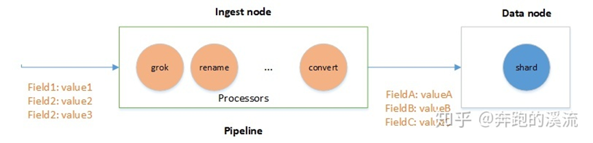

- [Elasticsearch数据预处理pipeline使用分析](#elasticsearch数据预处理pipeline使用分析)
  - [2、使用pipeline](#2使用pipeline)
  - [3、使用Ingest API](#3使用ingest-api)
    - [创建pipeline](#创建pipeline)
    - [写入数据](#写入数据)
    - [模拟pipeline](#模拟pipeline)
    - [4、自定义processor插件](#4自定义processor插件)
    - [初始化IngestPlugin插件](#初始化ingestplugin插件)
    - [Processor.Factory工厂实现](#processorfactory工厂实现)
    - [Processor实现](#processor实现)
    - [效果测试](#效果测试)
  - [小结](#小结)


# Elasticsearch数据预处理pipeline使用分析

[https://zhuanlan.zhihu.com/p/341984620](https://zhuanlan.zhihu.com/p/341984620)

如果我们想把在数据写入ES之前，对数据进行预处理，加工清洗数据生成我们需要的格式，通常的方式是在业务曾进行处理，这需要增加额外的业务服务，也可以通过Logstash filter功能对数据进行加工，但是这种改变往往伴随着架构的调整和业务逻辑的变更，有没有方法在ES内部做处理和转换。在ES 5.x之后的版本中，ES增量了Ingest node功能，Ingest node可以自定义pipeline，用户可在pipeline中自定processor，对数据进行过滤转换提取等操作，功能很强大，为ES提供了一种文档预处理和增强转换的轻量级方案。



如上定义了pipeline的处理流程，数据预处理动作必须在Ingest node节点处理，ES默认所有节点都是Ingest node节点。如果需要禁用Ingest，可以在elasticsearch.yaml 文件设置：

```
node.ingest: false
```

在不同的ES版本中有些许差异最新的版本使用 node.roles 指定专有的ingest 角色。

在我们对索引数据进行预处理前需要定义pipeline指定一些列的processors，每个processor对文档进行特殊的处理，比如我们可以使用一个processor删除指定的field，另一个processor重命名field。在inde和bulk请求中增加pipeline参数设置需要使用的pipeline。

定义pipeline

```
PUT _ingest/pipeline/my_pipeline_id
{
  "description" : "describe pipeline",
  "processors" : [
    {
      "set" : {
        "field": "foo",
        "value": "new"
      }
    }
  ]
}
```

使用pipeline

```
PUT my-index-000001/_doc/my-id?pipeline=my_pipeline_id
{
  "foo": "bar"
}
```

## 2、使用pipeline

pipeline中有两个主要的参数description和processors

```
{
  "description" : "...",
  "processors" : [ ... ]
}
```

description: 说明pipeline的功能，主要是一些描述信息。

processors：是一个list，可以设置多个processor，ES会按照顺序执行processor。

ES内置了大量的processor，我们可以灵活使用。常用的processor有**convert** ，Date，Drop，Grok，Dissect，Remove，Rename，Set，URI等，具体用户可以参考官方文档查看。


ES还提供了ingest插件（ingest-geoip， ingest-user-agent，ingest-attachment），需要自己安装插件使用。

**ingest-geoip** ： 是地理位置处理的数据库插件，在最新的版本已经不作为插件发布，合并到 `<span lang="EN-US">geoip</span>` processor。

**ingest-user-agent** ：扩展浏览器请求信息，在最新的版本已经不作为插件发布，合并到User agent processor。

**ingest-attachment** ：该插件扩展ES处理文本文件的能力，
使用它可以实现对（PDF,DOC,EXCEL等）主流格式文件的文本抽取及自动导入。处理的Field必须是Base64格式的二进制编码。

## 3、使用Ingest API

ES提供四个API使用pipeline，定义、删除、查询、模拟 pipeline。

```
# 创建pipeline
PUT /_ingest/pipeline/<pipeline> 
# 查询pipeline
GET /_ingest/pipeline/<pipeline> 
GET /_ingest/pipeline
# 删除pipeline
DELETE /_ingest/pipeline/<pipeline>
# 模拟pipeline
POST /_ingest/pipeline/<pipeline>/_simulate
GET /_ingest/pipeline/<pipeline>/_simulate
POST /_ingest/pipeline/_simulate
GET /_ingest/pipeline/_simulate
```

### 创建pipeline

pipeline名称是pipeline_uppercase，processors包含一个processor，把message字段的内容转换为大写，其中uppercase是processor名称。

```
PUT _ingest/pipeline/pipeline_uppercase
{
  "description": "uppercase field message",
  "processors": [
    {
      "uppercase": {
        "field": "message",
        "ignore_missing": true
      }
    }
  ]
}
```

### 写入数据

参数pipeline指定使用的pipeline名字。

```
POST index_data/_doc?pipeline=pipeline_uppercase
{
  "name": "pipeline",
  "message": "this is so cool!"
}
```

接下来我们查询下数据看看写入的效果。我们看message已经被转换为大写字母了。

```
GET index_data/_search
```
结果显示
```
{
  "took" : 0,
  "timed_out" : false,
  "_shards" : {
    "total" : 1,
    "successful" : 1,
    "skipped" : 0,
    "failed" : 0
  },
  "hits" : {
    "total" : {
      "value" : 2,
      "relation" : "eq"
    },
    "max_score" : 1.0,
    "hits" : [
      {
        "_index" : "index_data",
        "_type" : "_doc",
        "_id" : "lIiXsnYBv8g5MehmL98X",
        "_score" : 1.0,
        "_source" : {
          "name" : "pipeline",
          "message" : "THIS IS SO COOL!"
        }
      }
    ]
  }
}
```

### 模拟pipeline

此过程主要是为了测试pipeline的处理过程和结果

```
GET /_ingest/pipeline/pipeline_uppercase/_simulate
{
  "docs": [
    {
      "_index": "index",
      "_id": "id",
      "_source": {
        "message": "this is so cool!"
      }
    },
    {
      "_index": "index",
      "_id": "id",
      "_source": {
        "message": "elasticsearch"
      }
    }
  ]
}
```
测试结果
```
{
  "docs" : [
    {
      "doc" : {
        "_index" : "index",
        "_type" : "_doc",
        "_id" : "id",
        "_source" : {
          "message" : "THIS IS SO COOL!"
        },
        "_ingest" : {
          "timestamp" : "2020-12-30T07:44:47.1443329Z"
        }
      }
    },
    {
      "doc" : {
        "_index" : "index",
        "_type" : "_doc",
        "_id" : "id",
        "_source" : {
          "message" : "ELASTICSEARCH"
        },
        "_ingest" : {
          "timestamp" : "2020-12-30T07:44:47.1443329Z"
        }
      }
    }
  ]
}
```

以上只是简单说明下pipeline的使用过程，如果需要更进一步了解pipeline的使用，可以参考官网文档。

### 4、自定义processor插件

虽然ES提供的默认的ingest processors已经可以满足大部分场景的数据预处理。但是对于特定的业务场景默认的processors不足以支撑我们的使用，那这样就需要我们自定义processor，自定义processor可以仿照ES 官方插件实现自己的processor处理。直接完毕直接安装插件就可以使用。

以下以一个简单的示例说明插件的实现步骤。

### 初始化IngestPlugin插件
```
public class CoordinateConvertPlugin extends Plugin implements IngestPlugin {                       @Override  
IngestPlugin {    			@Override    
    public Map<String, Processor.Factory> getProcessors(Processor.Parameters parameters) {        
        return Collections.singletonMap(CoordinateProcessor.TYPE, new CoordinateProcessor.Factory());    
    }
}
```

IngestPlugin内我们只需要实现getProcessors创建processsor工厂方法，其中CoordinateProcessor.TYPE是processor名称不能重复。ES框架会遍历所有的IngestPlugin，加载Processor。

new CoordinateProcessor.Factory()是初始化Processor.Factory工厂类。

### Processor.Factory工厂实现

接下来我们看Processor.Factory的实现。

```
    public static final class Factory implements Processor.Factory {
        static final Set<Property> DEFAULT_PROPERTIES = EnumSet.allOf(Property.class);

        @Override
        public Processor create(Map<String, Processor.Factory> processorFactories, String tag,
                                Map<String, Object> config) throws Exception {
            String field = readStringProperty(TYPE, tag, config, "field");
            String targetField = readStringProperty(TYPE, tag, config, "target_field", "coordinate");
            List<String> propertyNames = readOptionalList(TYPE, tag, config, "properties");
            boolean ignoreMissing = readBooleanProperty(TYPE, tag, config, "ignore_missing", false);

            final Set<Property> properties;
            if (propertyNames != null) {
                properties = EnumSet.noneOf(Property.class);
                for (String fieldName : propertyNames) {
                    try {
                        properties.add(Property.parse(fieldName));
                    } catch (Exception e) {
                        throw newConfigurationException(TYPE, tag, "properties", "illegal field option [" +
                            fieldName + "]. valid values are " + Arrays.toString(Property.values()));
                    }
                }
            } else {
                properties = DEFAULT_PROPERTIES;
            }

            return new CoordinateProcessor(tag, field, targetField, properties, ignoreMissing);
        }
    }
```

Processor.Factory主要是定义processor的命令行格式和初始化CoordinateProcessor。

### Processor实现

CoordinateProcessor是AbstractProcessor的实现，所有的processor都是实现Processor接口，ES框架定义了抽象类AbstractProcessor，不同的Processor实现各自不同的处理逻辑。

```
public class CoordinateProcessor extends AbstractProcessor {
    public static final String TYPE = "location_coordinate";
    public CoordinateProcessor(String tag, String field, String targetField, Set<Property> properties, boolean ignoreMissing) {
        super(tag);
        this.field = field;
        this.targetField = targetField;
        this.properties = properties;
        this.ignoreMissing = ignoreMissing;
        this.mapIDRevertLonLat = new MapIDRevertLonLat();
    }

    @Override
    public IngestDocument execute(IngestDocument ingestDocument) throws Exception {
        Map<String, Object> additionalFields = new HashMap<>();
		String input = ingestDocument.getFieldValue(field, String.class);
		// 此处省略...
		additionalFields.put("longitude", value[0]);
        additionalFields.put("latitude", value[1]);
		
        return ingestDocument;
    }

    @Override
    public String getType() {
        return TYPE;
    }
}
```

这样我们只需要在execute中实现自己的processor处理逻辑就实现了自己的processor了。

### 效果测试

接下来看看效果。

创建pipeline，process指定为location_coordinate。

```
PUT _ingest/pipeline/coordinate
{
  "description": "Extract single location coordinate information",
  "processors": [
    {
      "location_coordinate": {
        "field": "url",
        "ignore_missing": true
      }
    }
  ]
}

```

使用pipeline

```
POST /coordinate_test/_doc?pipeline=coordinate
{
  "url": "x=25357&y=6538&level=15"
}
```

测试效果

```
      {
        "_index" : "coordinate_test",
        "_type" : "_doc",
        "_id" : "l4i4snYBv8g5MehmA9_v",
        "_score" : 1.0,
        "_source" : {
          "coordinate" : {
            "level" : 15,
            "latitude" : "18.17",
            "x" : 25357,
            "y" : 6538,
            "longitude" : "98.59"
          },
          "url" : "x=25357&y=6538&level=15"
        }
      }
```

## 小结
ES的Ingest node pipeline功能很强大，具有强大的数据处理的能力，官方提供了丰富的processes，用户可以灵活选择，也可以通过自定义IngestPlugin实现更为复杂的操作。既可以灵活的变更索引的结构和数据，又可以减少对业务代码的侵入。对数据清洗处理的任务提供了一种轻量级的解决方案。
