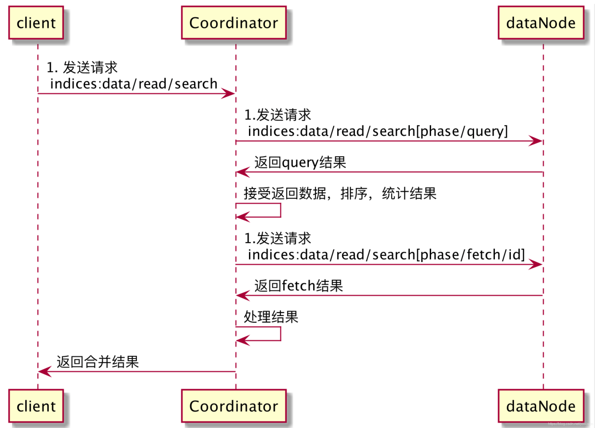

在 Elasticsearch 中，每个文档都有一个版本号，文档在每次被更新时，版本号都会增加。当多个客户端尝试同时修改同一个文档时，就需要使用版本控制机制来确保数据的一致性。这种机制就是 Elasticsearch 中的 Optimistic Concurrency Control。

下面是一个使用 OCC 进行版本控制的例子：

假设我们有一个名为 "customer" 的索引，其中有一条文档内容如下：

```
{
  "_index": "customer",
  "_type": "_doc",
  "_id": "1",
  "_version": 1,
  "_source": {
    "name": "John Doe",
    "email": "johndoe@email.com"
  }
}
```

现在，客户端A和客户端B分别想要更新这个文档的 email 字段。

客户端A 请求更新：

```
POST /customer/_doc/1/_update
{
  "doc": {
    "email": "newemail@email.com"
  },
  "version": 1
}
```

客户端B 请求更新：

```
POST /customer/_doc/1/_update
{
  "doc": {
    "email": "anothernewemail@email.com"
  },
  "version": 1
}
```

在客户端A的请求已经被 Elasticsearch 执行完毕之后，版本号已经从1变成了2。现在，如果客户端B再尝试更新这个文档，则更新请求会失败。因为客户端B的版本号仍然是1，但是 Elasticsearch 上的版本已经更新到了2。在这种情况下，客户端B需要重新获取最新的文档版本号，然后重新进行更新操作。

这就是 OCC 使用的基本原理。通过对文档版本号的控制，客户端可以避免多个并发操作产生的数据冲突问题，确保数据的一致性。


# 查询过程
首先从整体架构上介绍整个查询流程。
我们知道，es的查询分为query then fetch和dfs query then fetch两种，而本文介绍的是前者。es的底层结构是倒排索引，这个查询的过程，query就是先根据查询获取具体的数据的id。fetch就是根据query过程的获取的id拿出具体的数据。整个流程涉及到了三个实体，客户端（client），协调节点（Coordinator），数据节点（DataNode）。三者的具体关系看下图，这个流程在网上也有很多的文章介绍。

