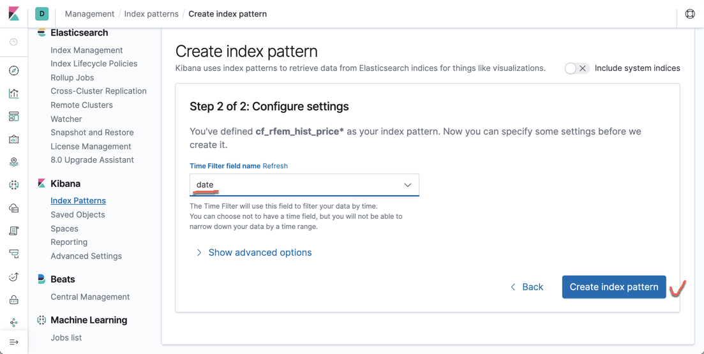
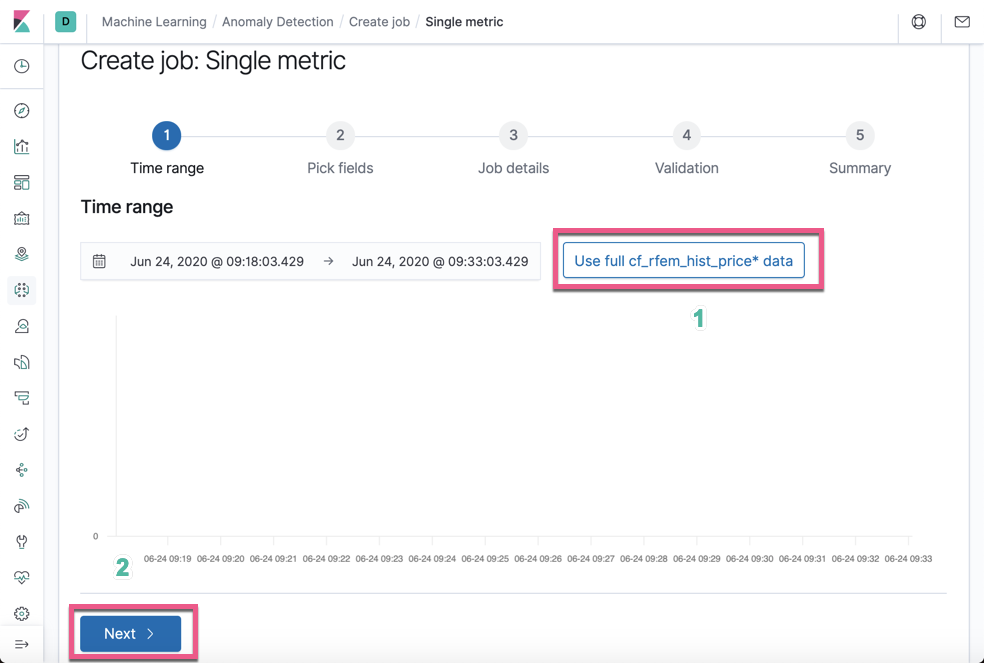
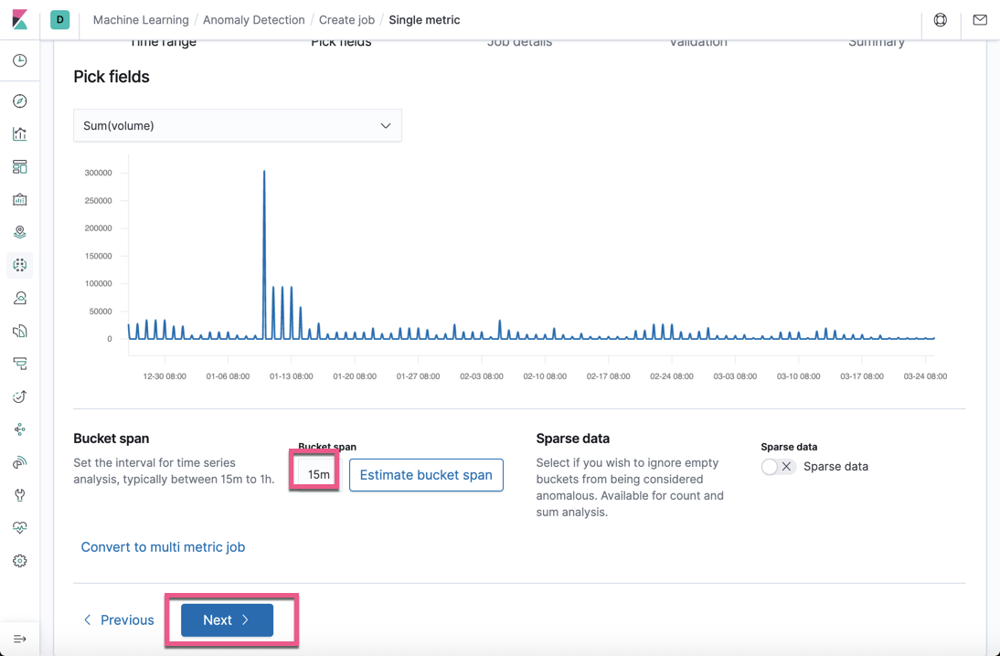

什么是机器学习呢？简单地说：机器学习是对计算机算法的研究，它允许计算机程序通过经验自动改进。在 Elasticsearch 中，可以将机器学习视为搜索和分析的自然扩展。它是对时间序列数据的分析。 Elasticsearch 支持的机器学习功能可以通过运行 metric 任务来自动分析时间序列数据，该 metric 任务包含一个或多个定义了将要分析的字段的检测器。 它可以帮助我们识别单变量时间序列数据中的异常，并向我们显示正常情况。在 Elasticsearch 中，我们可以通过机器学习来检测时间系列中的异常情况。

先前，使用 Elasticsearch 时与机器学习有关的主要问题之一是解决异常检测的问题。基本上，异常检测是一个统计问题，可以通过从输入数据分布的常见统计属性中标记不规则性，以简单的方式解决。那么什么是异常呢？


针对少量的数据，我们可能很快地通过肉眼就能发现数据中的异常，比如上面的海豹就是一个异类。如果我们每天面对大量的数据，我们使用肉眼的方法来进行异常判断，那将是一种非常大的工程。庆幸的是，Elastic Stack 提供了一种完全自动的不需要人工干预的对数据进行异常分析的方法。我们可以使用基于机器学习的方法来解决该问题，例如基于聚合类的异常检测和基于支持向量机的异常检测。 Elastic Stack 提供的机器学习功能可以涉及 Kibana 的数据可视化工具，作业管理，计划程序以及来自 Elasticsearch 的统计任务的指标（metrics）聚合。 我们甚至可以使用 Beats 收集数据。 例如，使用 Metricbeat 收集系统级资源使用情况统计信息。

# 什么叫做异常

我们首先观察一下如下的一个时间系列的图：


我们首先看到绿色的那个统计图，明显地在2016年2月9号4点左右一个叫做 AAL 的航空公司的订票数据明显高于其它天的情况。那么这显然是一个异常的情况。但是如果这个规律是每周或每个月在某个固定的时间段都是这么反复出现，那么这种情况也应该算是正常的情况。另外一个例子就是，我们生活在一个大城市里，比如北京，每到周五晚上高峰期，出城的车辆非常多，明显高于每周的其它工作日，这显然是一个异常的情况，如果我们只拿一周的统计数据来说。然而如果是每周五都是这样的，那么这样的高峰期也就显得非常正常了。这个是需要机器来根据以往的数据来分析而的出来结论的。

通常这种异常的情况是和它的历史数据进行比较，如果变化比较突出，这就是一种异常：


另外一种情况是：


标如果某事物与总体中的其他事物截然不同，则该实体是异常的。

总体来说，如果我们说某个事情不正常，它是一下的一种或两种：

    当实体的行为突然发生重大变化时

    当实体与总体中的其他实体完全不同时

我们可以通过肉眼来识别一些简单的少量数据的异常，比如在一些天里的监测中，突然有一天的温度远远高于平常的范围，股票价格的突然拉高及拉低，这些都是属于异常的范畴。在实际的系统中，我们可能收集的是源源不断的数据，而且我们也不可能时时刻刻盯着电脑的屏幕查看数据。即便如此，我们检测数据的异常也是非常困难的，比如：


在上面的数据中，我们使用肉眼能看出数据的异常吗？这个非常困难。即便我们能看出来，这个异常到底有多异常？
在很多时候，我们甚至使用一个阈值的检测来判定是否异常，比如温度高于多少就是异常。在实际的使用中，我们知道夏天和冬天是完全不同的情况，最高温和最低温的范围也有很大的区别：


针对海量数据及可变的数据，我们可以使用机器学习来自动地帮我们进行异常识别。

在机器学习中，他会根据实际数据自动帮我们选择适当的数据模型：


# 机器学习

机器学习是使用 Elasticsearch 集群中存在的数据，通过无监督的方法来构建数据模型。通过将（新的或替代的）数据与模型进行比较并识别数据中的异常模式或行为，它可以自动分析时间序列数据。在 Elasticsearch 的机器学习中，机器学习实习如下的功能：

* 异常检测
* 异常打分 （分数介于0到100之间，分数越高，代表越不正常）

在我们觉得是否使用机器学习之前，需要验证将使用的数据的适用性。在使用 Elasticsearch 机器学习之前，你必须考虑如下的三件事：

* 你的数据是否是一个时间系列的数据
* 数据需要包含对用例至关重要的关键性能指标（KPI）
* 数据的位置

事实上，你也可以通过机器学习的 API 接口来分析你的数据。这个工作并不一定小在 Kibana 中来完成。为了发现数据的异常，定义自己的数据的 KPI 是非常重要的一个环节。这些 KPI 指标，可以是：

* 在规定的一段时间里，日志的数量
* 在规定的一段时间里，所收到的 404 响应值
* 在规定的一段时间里，磁盘的使用量

IT 组织选择用于跟踪和标记的 KPI 可以跨越各种指标，包括以下各项：

* 客户：影响指标，例如应用程序响应时间或错误计数
* 可用性：面向指标，例如正常运行时间或平均维修时间（MTTR）
* 业务：面向指标，例如每分钟订单数，收入或活跃用户数

定义了 KPI 后，将对此 KPI 进行分析（平均值，最大值，计数等）。 分析功能和 KPI 的组合将称为检测器。我们可以为数据定义 single metric 或 multi metric 的检测器以检查数据中的异常情况。

机器学习另外一个很重要的功能就是预测所分析时序数据的未来发展趋势。一但我们建立了机器学习的作业之后，我们就可以进行预测。除了使用 Kibana 的界面进行预测之外，Elasticsearch 也提供 API 接口来实现。在使用这个功能时，你需要提供相应的时间段来进行预测。

机器学习分类：


# 机器学习是如何工作的

当将ML作业配置为运行时，ML 会将所有这些片段排序在一起。 下图显示了此过程的简化版本：


通常，每个 bucket span 都执行一次上述过程，但是要进行其他优化以最小化 I/O。 这些细节超出了本文章的范围。 但是，关键要点在于，这种编排使 ML 可以联机（即不脱机/批处理），并不断学习新摄取的数据。 ML 也会自动处理此过程，因此用户不必担心实现这一切所需的复杂过程。


# 预置的机器学习任务

基于你所拥有的数据类型，Kibana 已经预置了一些设计好的机器学习的任务，比如，Metricbeat 有几个预置的机器学习任务。它们可以被用来侦测在指标中的各种异常：


# 启用白金功能

在继续使用 Elasticsearch 中 的机器学习功能之前，请确保已安装 Platinum 许可证。 如果下载了 Elasticsearch 软件或使用了开源版本，它将是基本版本。我们必须激活30天试用许可证才能使用 Platinum 功能。

我们可以按照如下的步骤来启动白金功能：


我们按照上面的三个步骤，选择试用版，进而获得白金版功能。


# 机器学习的作业

Kibana 7.0 支持四种类型的机器学习作业，如下所述：

1. Single-metric jobs：数据分析仅在一个索引字段上执行
2. Multi-metric jobs：可以对多个索引字段执行数据分析； 但是，每个字段都分别进行分析
3. Advanced jobs：可以对多个索引字段执行数据分析。提供检测器和影响者的完整配置设置
4. Population jobs：对不常见数据（例如检测总体中的异常值）的分布行为的数据分析

在今天的练习中，我们来展示一个使用 single-metric job 的例子。

# Sample 数据

在今天的机器学中，我们使用如下的方法下载我们的时序数据：

```sh
git clone https://github.com/liu-xiao-guo/machine_learning_data.git
```

等我们下载完数据后，我们运行一下的命令：

```sh
$./cf_rfem_hist_price_bulk_index.sh
```

它将会把我们所需要的数据读入到 Elasticsearch中。我们可以在 Kibana 中查找这个数据。

```sh
GET cf_rfem_hist_price/_count
```

显示：

```json
{
    "count" : 90,
    "_shards" : {
    "total" : 1,
    "successful" : 1,
    "skipped" : 0,
    "failed" : 0
    }
}
```

它显示有90个数据。其中包括61个交易日和29个非交易日的数据。每一条数据的结构是：

```json
"_source" : {
    "date" : "2018-12-26",
    "open" : 55.0803,
    "high" : 56.0999,
    "low" : 54.59,
    "close" : 55.89,
    "volume" : 27038,
    "change" : 0.971,
    "changePercent" : 1.768,
    "label" : "Dec 26, 18",
    "changeOverTime" : 0,
    "symbol" : "RFEM"
}
```

这是一个股票代码为 RFEM 的交易信息。这里它含有每天的开盘价，最高价，最低价，闭市价，交易量等信息。

# 运行一个 single-metric 作业

基本上，single-metric 作业仅使用索引文档中的一个字段作为分析检测器。 下面介绍了针对 volume 字段运行 single-metric 作业的分步说明。

## 创建 Index pattern

为了创建一个 Index pattern，我们按照如下的步骤：

按照上面的1，2，3步骤：


输入 cf_rfem_hist_price *，然后选择  **Next Step** 。



然后在 **Time Filter field name **选择 date，然后再选择 Create index pattern。


这样 cf_rfem_hist_price* index pattern 已创建，可以在机器学习作业中使用。

## 创建一个新的机器学习工作

要创建单指标机器学习作业，我们需要执行以下操作：

1. 单击左侧工具栏上的机器学习按钮，在以下屏幕截图中显示，右侧窗格将显示机器学习面板
   
2. 从顶部菜单中，选择 “Anomaly Detection”。 点击 Create job 按钮，如以下屏幕截图所示：
   
3. 该面板将让我们选择源数据，这些源数据来自于新的搜索，选定的索引或保存的搜索。 单击 cf_rfem_hist_price 索引，如以下屏幕截图所示：
   
4. 有几种作业类型可用于定义机器学习作业。 让我们选择一个 single metric 作业，如以下屏幕截图所示：
   
5. 选择 **Use full cf_rfem_hist_price***  data
   
6. 然后选择 **Next** 按钮
   
7. single-metric 作业必须使用聚合。 由于我们的数据是每日记录，而存储段跨度（间隔）是一天，因此无论我们选择 “Sum”，“Mean” 还是 “Median” 聚合，聚合都是相同的。我们选择 volume 字段的 Sum 聚合用来检查个异常。请注意这个也是我们之前谈到的 KPI 指标。我们的目的是通过检查 voume 的总和是否有异常的情况出现。
   
   

   在上面，我们注意的一点是我们的 Bucket span 设置为15m，尽管我们的时序数据是每天一个数据。在实际的使用中可以根据自己的用例来进行调整。
8. 点击 **Next** 按钮，这样我们可以看到如下的画面：
   
9. 接下来选择 Next：
   
10. 填好 Job ID，然后选择 Next 按钮
    
11. 上面显示 Validation 信息。在这一步，如果有错误的话，它将会用红色的字显示错误信息。上面显示一切都好。然后，我们选择 Next 按钮：
    
12. 我们再选择 Create job 按钮：
    
13. 我们选择 View results：
    

    在上面，在起始的部分，我们可以看见机器学习在学习，我们看不出有什么特别的地方。经过一段时间的学习，它侦测出一个异常的情况。
14. 恭喜你。你已经创建了一个 single-metric 的机器学习的作业！我们可以点击下面的 Anomalies：
    

    异常在上面的图表中，以不同的颜色来表示的：

```
        Warning (blue): 分数低于25
        Minor (yellow): 分数介于25和50之间
        Major (orange): 分数介于50和75之间
        Critical (red): 分数介于75和100之间
```

    我们可以在上面点击 Severity threshold 选择不同的级别来进行显示。如下图，它显示的是只有 Critical （分数高于75的）的异常：

   显然显示有很多异常的情况。点击最上面的那个January 10th 2019，我们可以看到详细的信息：


上面显示的实际值是304198，但是根据机器学习所预测的值应该在22499。显然这是一个异常。对于销售人员来说，他们可以根据这个情况来了解一下，为什么会出现这么一个异常的情况，是什么原因造成交易量的突然增加。是有人背后操作吗？

在上面的图中，由于我们的时间长度并不长，所以在一个画面中都显示完成。我们时间上可以通过调整左右的按钮来进行时间的选择：


这样我们可以专注查看我们所关心时间段的数据。

我们也可以针对我们的数据进行标注:


点击上面的 Create 按钮，我们就可以为这个事件进行标注：


我们也可以点击右上角的那个 Forecast （预测）按钮：

我们填入7天的预测。点击 Run 按钮：


这是最终预测后的结果。

# 关于机器学习的时间选择

在上面的练习中，我们选择了默认的15分钟作为 bucket_span 来对我们的数据进行分析。将 bucket span 视为分析前的聚合间隔，即为了进行分析而聚合一部分数据的时间窗口。 bucket_span 的持续时间越短，分析就越精细，但是数据中产生噪声伪像的可能性也就越高。下图显示了在三个不同时间间隔内聚合的同一数据集：


请注意，如果由于尖峰持续时间短（小于2分钟）而在60分钟间隔内聚集数据几乎消失了，则在5分钟间隔内聚集的版本中看到的突出异常。
实际上，在这60分钟的间隔内，峰值似乎不再显得异常。 从另外一方面来讲，如果 bucket_span 数值较小，那么侦测的时间就越快。
