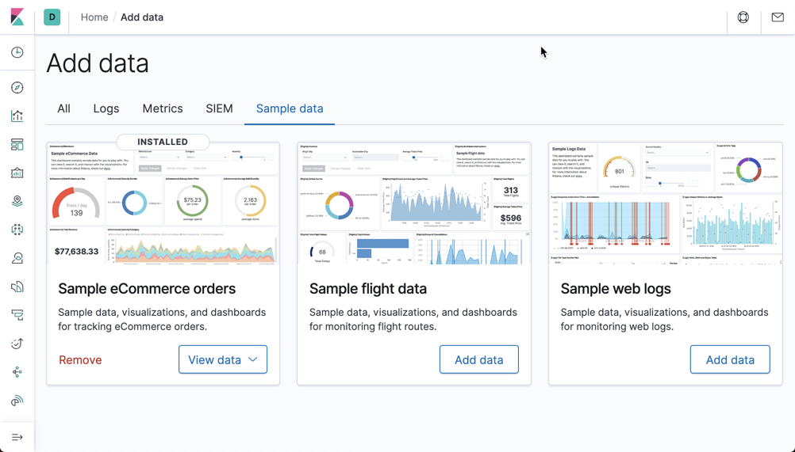
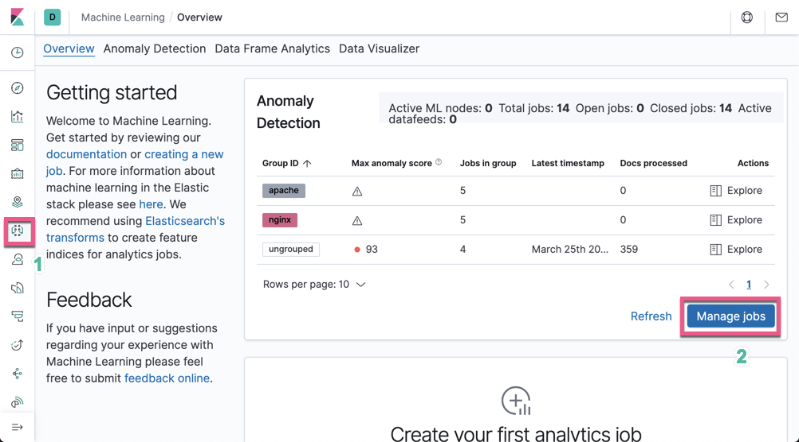

Kibana 中的 multi metric job 向导提供了一种使用多个检测器创建更复杂作业的简单方法。例如，在单个度量标准作业中，你正在跟踪总请求与时间的关系。你可能还希望跟踪其他指标，例如平均响应时间或拒绝请求的最大数量。你可以为多个指标作业合并它们，而不是为每个指标创建作业。

你还可以使用多指标作业，根据分类字段将单个时间序列拆分为多个时间序列。例如，你可以根据数据的主机名，位置或用户拆分数据。每个时间序列都是独立建模的。通过在每个实体的基础上查看时间模式，你可能会发现本来可以隐藏在集中视图中的事物。

通过运用多个指标任务，你可以根据看似无关的字段查找异常，例如你网站上的网络访问量与外界天气情况是否有关联。

从概念上讲，你可以将其视为运行许多独立的单指标作业。但是，通过将它们捆绑在一个多指标作业中，你可以看到该作业中所有指标和所有实体的总体得分和共享影响者。因此，多指标作业比具有许多独立的单个指标作业更好地扩展，并且当影响者在探测器之间共享时，可以提供更好的结果。

# 准备数据

在今天的练习中，我们将使用 Elastic 自带的索引 eCommerce 来做。打开 Kibana:


点击上面的 Add data 按钮，这样，我们就完成了数据的导入：


我们在 Elasticsearch 中可以发现一个叫做 kibana_sample_data_ecommerce 的索引

```
GET _cat/indices
```


# 创建 机器学习 multi metric job

打开机器学习应用：


点击 Manage jobs:


点击 Create job:


选择 kibana_sample_data_ecommerce 索引：

在这里，我们选择 Multi metric。正如上面描述的那样，multi metric 通过按类别字段划分时间序列来检测多指标中的异常。

我们选择使用整个索引的数据。点击 Next 按钮：

我们选择 High sum(taxful_total_price)：

接下来，我们把分析通过 customer_full_name 来进行分别分析。同时，我们也选择 customer_full_name 及 category 来查看我们选择的这些 influencer 有多少是对我们的结果有影响的，影响的程度是什么样的。

点击上面的 Next 按钮：

我们把这个机器学习的任务取一个名字叫做 multi_metric_job。点击 Next 按钮：


上面显示，我们的创建是成功的。点击 Next 按钮：

在上面，我们可以看出来针对每个客户进行分析。点击 Create job 按钮：

等机器学习完成之后，我们点击 View results 按钮：

在上面，我们看出来一些异常。在上面，我们可以看到一些蓝色和黄色的长方形块。按照我们之前的描述：

```
Warning (blue): 分数低于25
Minor (yellow): 分数介于25和50之间
Major (orange): 分数介于50和75之间
Critical (red): 分数介于75和100之间
```

在上面，它显示了整个客户的异常情况，在下面也分别分析了各个客户的异常情况。

我们也可以按照之前选择的 category influencer 来查看每个 category 的影响：


我们的异常蓝色表示异常分数低于25分，而黄色的异常分数介于25-50之间。是 Warning 和 Minor 级别的异常。

向下滚动，我们可以查看异常的详细情况。点击 July 5th 2020 那个异常：


上面标明，这个叫做 Stephanie Baker 的客户，按照正常的分析，他会在 July 5th, 2020 会花钱 0.152，可是他事实上什么也没有花。这个和他的平常的习惯不一样。是有什么事情发生吗？

在左边，我们可以查看到 top 10 的 influencer:


因为这个是一个 multi metric job，我们也可以把它分解成为每一个 single metric job 那样进行查看：


点击 Single Metric Viewer:


