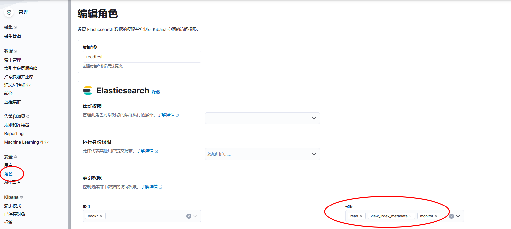

- [discovery 中的 KQL](#discovery-中的-kql)
- [给 开发工具 权限](#给-开发工具-权限)

# discovery 中的 KQL
```sql
proxy_upstream_name : evoc1-diving* and (status : 4* or upstream_status : 4* or status : 5* or upstream_status : 5*)
```

# 给 开发工具 权限
1、创建 test 空间，给它 kibana 的 discovery、索引模式管理 和 开发工具 这两个菜单权限。  


2、`Stack Management --> 角色` 在这个栏目中创建角色 readtest，给指定的索引 `read view_index_metadata monitor` 权限； 给 kibana 的 test 空间的 discovery 和 开发工具 这两个菜单权限。  

)
3、创建 用户，指定它的角色是 readtest

4、登录测试

测试
```
GET 	evoc-iam/_search    # 支持
GET 	evoc-iam/_count     # 支持
PUT evoc-iam-ldc-test       # 不支持
DELETE evoc-iam-ldc-test    # 不支持
GET 	evoc-iam/_settings  # 支持
```