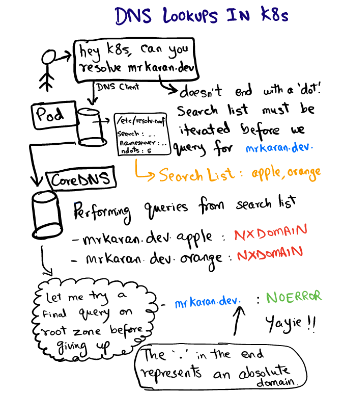
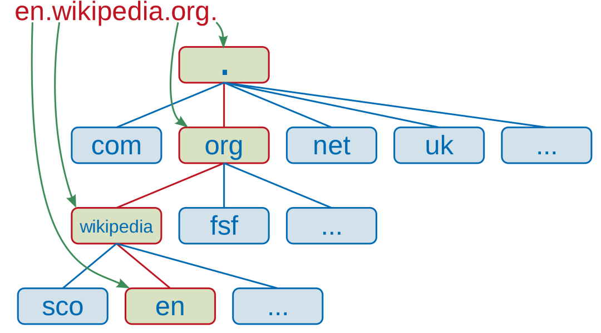

- [DNS 介绍](#dns-介绍)
- [查看某个 pod 的日志](#查看某个-pod-的日志)
- [修改日志级别](#修改日志级别)
- [查看某个服务的DNS](#查看某个服务的dns)
- [给 POD 创建 DNS](#给-pod-创建-dns)
- [查看 DNS 解析地址](#查看-dns-解析地址)
# DNS 介绍
在 Kubernetes 中部署应用的主要优势之一就是可以做到无缝的应用发现。Service 的概念使群集内通信变得容易，Service 代表了支持一组 Pod IP 的虚拟 IP。在 Kubernetes 内部可以直接通过 Service 来访问服务，现在的问题是谁解决了服务的 DNS 查询问题？

DNS 解析是通过 Kubernetes 集群中配置的 CoreDNS 完成的，kubelet 将每个 Pod 的 /etc/resolv.conf 配置为使用 coredns pod 作为 nameserver。我们可以在任何 Pod 中看到 /etc/resolv.conf 的内容，如下所示：
```sh
cat /etc/resolv.conf
nameserver 169.254.25.10
search lindeci-project.svc.cluster.local svc.cluster.local cluster.local
options ndots:5
```
DNS 客户端使用此配置将 DNS 查询转发到 DNS 服务器， resolv.conf 是解析程序的配置文件，其中包含以下信息：
- nameserver：DNS 查询转发到的服务地址，实际上就是 CoreDNS 服务的地址。
- search：表示特定域的搜索路径，有趣的是 google.com 或 mrkaran.dev 不是 FQDN 形式的域名。大多数 DNS 解析器遵循的标准约定是，如果域名以 . 结尾（代表根区域），该域就会被认为是 FQDN。有一些 DNS 解析器会尝试用一些自动的方式将 . 附加上。所以， mrkaran.dev. 是 FQDN，但 mrkaran.dev 不是。
- ndots：这是最有趣的一个参数，也是这篇文章的重点， ndots 代表查询名称中的点数阈值，Kubernetes 中默认为5，如果查询的域名包含的点 “.” 不到5个，那么进行 DNS 查找，将使用非完全限定名称，如果你查询的域名包含点数大于等于5，那么 DNS 查询默认会使用绝对域名进行查询。  
ndots 点数少于 5个，先走 search 域，最后将其视为绝对域名进行查询；点数大于等于5个，直接视为绝对域名进行查找，只有当查询不到的时候，才继续走 search 域。



```sh
FQDN 维基解释：完全限定域名（英语：Fully qualified domain name），缩写为 FQDN，又译为完全资格域名、完整领域名称，又称为绝对领域名称（absolute domain name）、 绝对域名，域名的一种，能指定其在域名系统 (DNS) 树状图下的一个确实位置。一个完全资格域名会包含所有域名级别，包括 顶级域名 和 根域名。完整域名由主机名称与母域名两部分所组成，例如有一部服务器的本地主机名为 myhost，而其母域名为 example.com，那指向该服务器的完整域名就是 myhost.example.com。虽然世界上可能有很多服务器的本地主机名是 myhost，但 myhost.example.com 是唯一的，因此完整域名能识别该特定服务器。
```



我们来检查一下在 Pod 中查询 mrkaran.dev 时会发生什么：
```sh
nslookup mrkaran.dev
Server:         169.254.25.10
Address:        169.254.25.10:53

Non-authoritative answer:
Name:   mrkaran.dev
Address: 2606:4700:3030::ac43:bbef
Name:   mrkaran.dev
Address: 2606:4700:3035::6815:7a8

Non-authoritative answer:
Name:   mrkaran.dev
Address: 172.67.187.239
Name:   mrkaran.dev
Address: 104.21.7.168
```

# 查看某个 pod 的日志
```sh
# 查看 DNS 服务
kubectl get pods --namespace=kube-system -l k8s-app=kube-dns
NAME                      READY   STATUS    RESTARTS   AGE
coredns-558b97598-kccxf   1/1     Running   0          7d5h
coredns-558b97598-vzsg7   1/1     Running   0          7d5h

# 查看日志
kubectl logs -f coredns-558b97598-kccxf -n kube-system
```
# 修改日志级别
```sh
kubectl -n kube-system edit configmap coredns

# Please edit the object below. Lines beginning with a '#' will be ignored,
# and an empty file will abort the edit. If an error occurs while saving this file will be
# reopened with the relevant failures.
#
apiVersion: v1
data:
  Corefile: |
    .:53 {
        errors
        health {
           lameduck 5s
        }
        ready
        kubernetes cluster.local in-addr.arpa ip6.arpa {
           pods insecure
           fallthrough in-addr.arpa ip6.arpa
           ttl 30
        }
        prometheus :9153
        forward . /etc/resolv.conf {
           max_concurrent 1000
        }
        cache 30
        loop
        reload
        loadbalance
        log . {
           class all
        }
    }
kind: ConfigMap
metadata:
  creationTimestamp: "2023-09-04T06:24:26Z"
  name: coredns
  namespace: kube-system
  resourceVersion: "280"
  uid: f8a20e7b-9678-4d7d-afc8-98c0f3eb8ef9
```
改坏了 ks-controller-manager

修复脚本
```sh
kubectl -n kube-system delete pod -l k8s-app=kube-dns
```

# 查看某个服务的DNS
当你创建一个服务时，Kubernetes会为该服务创建一个DNS记录。然而，对于Pod，Kubernetes默认情况下并不会为其创建DNS记录

默认的 DNS 名字是：`<service-name>.<project-name>.svc.cluster.local`
```sh
# 登录某个容器终端
nslookup ldc-app-hello.lindeci-project.svc.cluster.local
Server:         169.254.25.10
Address:        169.254.25.10:53


Name:   ldc-app-hello.lindeci-project.svc.cluster.local
Address: 10.233.51.233
```
# 给 POD 创建 DNS
在Kubernetes中，Pod默认是不会有自己的DNS记录的。这是因为Pod的生命周期通常比较短，而且Pod的IP地址在重启后可能会改变。因此，直接使用Pod的IP地址进行通信可能会带来问题。

在Kubernetes中，Pod的DNS设置是在创建Pod时定义的，一旦Pod被创建，就不能更改其DNS设置。

如果你确实需要为Pod创建DNS记录，你可以创建一个Headless Service，并在Pod的spec中设置subdomain字段为该Service的名称。这样，Pod就会有一个与Service相关联的DNS名称。
```sh

```

# 查看 DNS 解析地址
cat /etc/resolv.conf
```
nameserver 169.254.25.10
search lindeci-project.svc.cluster.local svc.cluster.local cluster.local
options ndots:5
```
