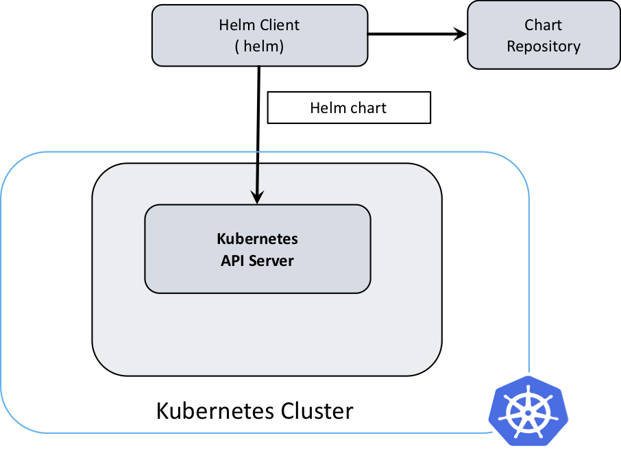
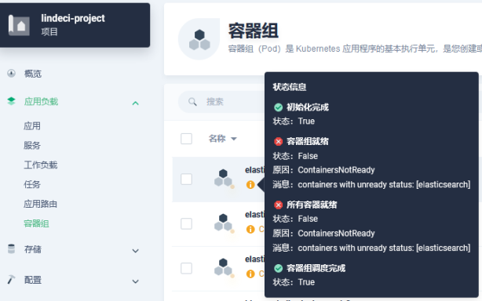

- [官网](#官网)
- [helm 仓库](#helm-仓库)
- [为什么要使用helm](#为什么要使用helm)
- [helm 是什么](#helm-是什么)
- [helm 架构](#helm-架构)
  - [Helm的目标](#helm的目标)
- [安装](#安装)
- [Helm CLI工作流](#helm-cli工作流)
  - [搜索Chart](#搜索chart)
  - [使用仓库](#使用仓库)
  - [安装Chart](#安装chart)
  - [创建你自己的 charts](#创建你自己的-charts)
    - [Helm Chart目录结构综述](#helm-chart目录结构综述)
      - [Chart.yaml](#chartyaml)
      - [templates/](#templates)
      - [values.yaml](#valuesyaml)
      - [values.schema.json](#valuesschemajson)
      - [crds/](#crds)
- [K8S 的 Service 类型](#k8s-的-service-类型)
- [K8S 的资源对象类型](#k8s-的资源对象类型)
- [chart 目录介绍](#chart-目录介绍)
- [Helm 的渲染顺序](#helm-的渲染顺序)
- [使用 helm template 渲染 chart](#使用-helm-template-渲染-chart)
- [使用 helm 安装 elasticsearch](#使用-helm-安装-elasticsearch)
  - [安装](#安装-1)
  - [查看安装状态](#查看安装状态)
  - [查看 pod 对应的 yaml 文件](#查看-pod-对应的-yaml-文件)
  - [登录容器查看进程状态](#登录容器查看进程状态)
  - [查看 hosts](#查看-hosts)
  - [查看 POD 对应的 DNS](#查看-pod-对应的-dns)
  - [查看 ES 的安装目录](#查看-es-的安装目录)
  - [查看 ES 配置文件](#查看-es-配置文件)
  - [查看 容器跟主机 的目录对应关系](#查看-容器跟主机-的目录对应关系)
  - [查看容器运行时对应的宿主机目录](#查看容器运行时对应的宿主机目录)
  - [卸载](#卸载)
- [Chart仓库指南](#chart仓库指南)

# 官网

https://helm.sh/zh/

Helm 是查找、分享和使用软件构建 Kubernetes 的最优方式。

# helm 仓库

https://artifacthub.io/

# 为什么要使用helm

在kubernetes 系统上部署容器化应用时需要事先手动编写资源配置清单文件以定义资源对象，而且其每一次的配置定义基本上都是硬编码，基本上无法实现复用。对于较大规模的应用场景，应用程序的配置，分发，版本控制，查找，回滚甚至是查看都将是用户的噩梦。 Helm可大大简化应用管理的难度。

# helm 是什么

Helm 帮助您管理 Kubernetes 应用—— Helm Chart，即使是最复杂的 Kubernetes 应用程序，都可以帮助您定义，安装和升级。

Helm Chart 易于创建、发版、分享和发布，所以停止复制粘贴，开始使用 Helm 吧。

Helm 是 CNCF 的毕业项目，由 Helm 社区维护。

# helm 架构



## Helm的目标

Helm管理名为chart的Kubernetes包的工具。Helm可以做以下的事情：

- 从头开始创建新的chart
- 将chart打包成归档(tgz)文件
- 与存储chart的仓库进行交互
- 在现有的Kubernetes集群中安装和卸载chart
- 管理与Helm一起安装的chart的发布周期

对于Helm，有三个重要的概念：

- chart 创建Kubernetes应用程序所必需的一组信息。
- config 包含了可以合并到打包的chart中的配置信息，用于创建一个可发布的对象。
- release 是一个与特定配置相结合的chart的运行实例。

# 安装

```sh
wget https://get.helm.sh/helm-v3.12.3-linux-amd64.tar.gz
tar -zxvf helm-v3.12.3-linux-amd64.tar.gz
cd linux-amd64
```

# Helm CLI工作流

## 搜索Chart

Helm允许从两种来源搜索目标Chart

- `helm search hub`：从CNCF的Artifact Hub上面查找并罗列Helm Charts。

```sh
./helm search hub mysql8
URL                                                     CHART VERSION   APP VERSION     DESCRIPTION
https://artifacthub.io/packages/helm/saber/mysql8       1.0.3           8.0.27          mysql8
```

- `helm search repo`：从本地的（helm repo list）仓库中查找并罗列Helm Charts。

```sh
./helm repo add brigade https://brigadecore.github.io/charts
"brigade" has been added to your repositories

./helm search repo brigade
NAME                            CHART VERSION   APP VERSION     DESCRIPTION                                     
brigade/brigade                 1.10.0          v1.5.0          Brigade provides event-driven scripting of Kube...
brigade/brigade-github-app      0.8.0           v0.4.1          The Brigade GitHub App, an advanced gateway for...
brigade/brigade-github-oauth    0.4.0           v0.20.0         The legacy OAuth GitHub Gateway for Brigade     
brigade/brigade-k8s-gateway     0.3.0                           A Helm chart for Kubernetes                     
brigade/brigade-project         1.1.0           v1.0.0          Create a Brigade project                        
brigade/kashti                  0.7.0           v0.4.0          A Helm chart for Kubernetes
```

## 使用仓库

Helm 3 不再附带一个默认的 chart 仓库。helm repo 提供了一组命令用于添加、列出和移除仓库。

使用 helm repo list 来查看配置的仓库：

```sh
helm repo list
NAME            URL
stable          https://charts.helm.sh/stable
mumoshu         https://mumoshu.github.io/charts
```

使用 helm repo add 来添加新的仓库：

```sh
helm repo add dev https://example.com/dev-charts
```

因为 chart 仓库经常在变化，在任何时候你都可以通过执行 helm repo update 命令来确保你的 Helm 客户端是最新的。

使用 `helm repo remove` 命令来移除仓库。

## 安装Chart

Helm通过 `helm install`命令来安装Chart，最简单的方式只需要传入两个参数：你命名的Release名称和你希望安装的Chart名称。

```sh
helm install happy-panda bitnami/wordpress
```

更多安装方法
helm install 命令可以从多个来源进行安装：

- chart 的仓库（如上所述）
- 本地 chart 压缩包（helm install foo foo-0.1.1.tgz）
- 解压后的 chart 目录（helm install foo path/to/foo）
- 完整的 URL（helm install foo https://example.com/charts/foo-1.2.3.tgz）

## 创建你自己的 charts

```sh
helm create deis-workflow
cd deis-workflow
tree  .


.
├── charts
├── Chart.yaml
├── templates
│   ├── deployment.yaml
│   ├── _helpers.tpl
│   ├── hpa.yaml
│   ├── ingress.yaml
│   ├── NOTES.txt
│   ├── serviceaccount.yaml
│   ├── service.yaml
│   └── tests
│       └── test-connection.yaml
└── values.yaml
```

现在，./deis-workflow 目录下已经有一个 chart 了。你可以编辑它并创建你自己的模版。

在编辑 chart 时，可以通过 helm lint 验证格式是否正确。

当准备将 chart 打包分发时，你可以运行 helm package 命令：

```sh
helm package deis-workflow
Successfully packaged chart and saved it to: /data/linux-amd64/deis-workflow-0.1.0.tgz
```

然后这个 chart 就可以很轻松的通过 helm install 命令安装：

```sh
helm install deis-workflow ./deis-workflow-0.1.0.tgz
```

打包好的 chart 可以上传到 chart 仓库中

### Helm Chart目录结构综述

一个完整的Helm Chart主要包括如下内容：

```sh
wordpress/
  Chart.yaml          # 包含了chart信息的YAML文件
  LICENSE             # 可选: 包含chart许可证的纯文本文件
  README.md           # 可选: 可读的README文件
  values.yaml         # chart 默认的配置值
  values.schema.json  # 可选: 一个使用JSON结构的values.yaml文件
  charts/             # 包含chart依赖的其他chart
  crds/               # 自定义资源的定义
  templates/          # 模板目录， 当和values 结合时，可生成有效的Kubernetes manifest文件
  templates/NOTES.txt # 可选: 包含简要使用说明的纯文本文件
```

#### Chart.yaml

Chart.yaml文件是Chart必需的，包括如下内容：

```yaml
apiVersion: chart API 版本 （必需）
name: chart名称 （必需）
version: 语义化2 版本（必需）
kubeVersion: 兼容Kubernetes版本的语义化版本（可选）
description: 一句话对这个项目的描述（可选）
type: chart类型 （可选）
keywords:
  - 关于项目的一组关键字（可选）
home: 项目home页面的URL （可选）
sources:
  - 项目源码的URL列表（可选）
dependencies: # chart 必要条件列表 （可选）
  - name: chart名称 (nginx)
    version: chart版本 ("1.2.3")
    repository: （可选）仓库URL ("https://example.com/charts") 或别名 ("@repo-name")
    condition: （可选） 解析为布尔值的yaml路径，用于启用/禁用chart (e.g. subchart1.enabled )
    tags: # （可选）
      - 用于一次启用/禁用 一组chart的tag
    import-values: # （可选）
      - ImportValue 保存源值到导入父键的映射。每项可以是字符串或者一对子/父列表项
    alias: （可选） chart中使用的别名。当你要多次添加相同的chart时会很有用
maintainers: # （可选）
  - name: 维护者名字 （每个维护者都需要）
    email: 维护者邮箱 （每个维护者可选）
    url: 维护者URL （每个维护者可选）
icon: 用做icon的SVG或PNG图片URL （可选）
appVersion: 包含的应用版本（可选）。不需要是语义化，建议使用引号
deprecated: 不被推荐的chart （可选，布尔值）
annotations:
  example: 按名称输入的批注列表 （可选）.
```

#### templates/

templates/目录是定义Chart资源对象模板的核心目录，遵循Go语言的模板引擎规则。例如：

```yaml
apiVersion: v1
kind: ReplicationController
metadata:
  name: deis-database
  namespace: deis
  labels:
    app.kubernetes.io/managed-by: deis
spec:
  replicas: 1
  selector:
    app.kubernetes.io/name: deis-database
  template:
    metadata:
      labels:
        app.kubernetes.io/name: deis-database
    spec:
      serviceAccount: deis-database
      containers:
        - name: deis-database
          image: {{ .Values.imageRegistry }}/postgres:{{ .Values.dockerTag }}
          imagePullPolicy: {{ .Values.pullPolicy }}
          ports:
            - containerPort: 5432
          env:
            - name: DATABASE_STORAGE
              value: {{ default "minio" .Values.storage }}
```

#### values.yaml

values.yaml提供给用户自定义Chart配置的能力。例如：

```yaml
imageRegistry: "quay.io/deis"
dockerTag: "latest"
pullPolicy: "Always"
storage: "s3"
```

#### values.schema.json

values.schema.json将会通过JSON格式的内容对Helm CLI（例如：helm install、helm upgrade、helm lint、helm template）进行schema校验。例如：

```yaml
{
  "$schema": "https://json-schema.org/draft-07/schema#",
  "properties": {
    "image": {
      "description": "Container Image",
      "properties": {
        "repo": {
          "type": "string"
        },
        "tag": {
          "type": "string"
        }
      },
      "type": "object"
    },
    "name": {
      "description": "Service name",
      "type": "string"
    },
    "port": {
      "description": "Port",
      "minimum": 0,
      "type": "integer"
    },
    "protocol": {
      "type": "string"
    }
  },
  "required": [
    "protocol",
    "port"
  ],
  "title": "Values",
  "type": "object"
}
```

#### crds/

Kubernetes支持自定义资源对象CRD。Helm v3中，CRD被视为特殊的资源对象，将会在所有的Chart安装之前安装。

注意：CRD文件无法被模板化，必须是普通的yaml文件!

```yaml
crontabs/
  Chart.yaml
  crds/
    crontab.yaml
  templates/
    mycrontab.yaml
```

```yaml
kind: CustomResourceDefinition
metadata:
  name: crontabs.stable.example.com
spec:
  group: stable.example.com
  versions:
    - name: v1
      served: true
      storage: true
  scope: Namespaced
  names:
    plural: crontabs
    singular: crontab
    kind: CronTab
```

# K8S 的 Service 类型

在 Kubernetes 中，除了 Headless Service，还有以下几种类型的 Service：

1. **ClusterIP**：这是默认的 Service 类型。Kubernetes 会为 ClusterIP 服务分配一个集群内部 IP 地址，使得服务只能在集群内部访问。
2. **NodePort**：NodePort 服务是 ClusterIP 服务的扩展。它通过在 ClusterIP 之上添加一个集群范围的端口来公开集群外部的服务。NodePort 在静态端口（NodePort）上公开每个节点 IP 上的服务。每个节点将该端口代理到你的服务中，因此，外部流量可以访问每个节点上的固定端口。
3. **LoadBalancer**：LoadBalancer 服务是 NodePort 服务的扩展。外部负载均衡器路由到的 NodePort 和 ClusterIP 服务是自动创建的。它将 NodePort 与基于云的负载均衡器集成在一起，使用云厂商的负载均衡器在外部公开服务。
4. **ExternalName**：ExternalName 类型的服务将 Service 映射到 DNS 名称，而不是典型的选择器。你可以使用 `spec.externalName` 参数指定这些服务。它通过返回带有其值的 CNAME 记录，将服务映射到 externalName 字段（例如 foo.bar.example.com）的内容。
5. **Headless Service**：Headless Service 是没有集群 IP 的 Service。当其他 Pod 需要通过 DNS 访问它时，DNS 服务器会返回后端 Pod 的 IP 地址列表，而不是返回 Service 的 IP 地址。这对于需要直接访问后端 Pod 的应用程序非常有用。

查看 Service 类型

```sh
kubectl get svc -n lindeci-project
NAME            TYPE        CLUSTER-IP      EXTERNAL-IP   PORT(S)    AGE
ldc-app-hello   ClusterIP   10.233.51.233   <none>        8000/TCP   132m
```

# K8S 的资源对象类型

在 Kubernetes 中，`kind` 字段用于指定资源对象的类型。以下是一些常见的 `kind` 类型：

- **Pod**：Pod 是可以在 Kubernetes 中创建和管理的最小部署单元。一个 Pod 表示集群中正在运行的一个进程。
- **Service**：Service 是一种抽象方式，用于将逻辑上相同的一组 Pod 暴露为网络服务。Kubernetes 中有四种类型的服务 — ClusterIP、NodePort、LoadBalancer 和 ExternalName。
- **Volume**：Volume 是一个包含某些数据的目录，可以直接挂载到 Pod 中的一个或多个容器中。
- **Namespace**：Namespace 是对一组资源和对象的抽象集合，用于将集群资源划分为多个独立的部分。
- **Deployment**：Deployment 控制器提供了对描述部署状态的更新。
- **StatefulSet**：StatefulSet 是一种工作负载 API 对象，用于管理有状态应用。
- **DaemonSet**：DaemonSet 确保所有（或某些）节点上都运行一个 Pod 的副本。
- **Job**：Job 创建一个或多个 Pod，并确保指定数量的 Pod 成功终止。
- **ConfigMap**：ConfigMap是一种API对象，用于存储非机密数据的键值对。Pod可以将ConfigMap作为环境变量、命令行参数或作为卷中的配置文件进行消费。
- **Secret**：Secret是一种API对象，用于存储敏感数据，如密码、OAuth令牌和SSH密钥12。Pod可以通过以下方式之一引用Secret：1、作为卷中的文件，由Pod中运行的容器化应用程序使用；2、作为环境变量，由Pod中的容器使用；3、当kubelet从私有仓库拉取容器镜像时，作为镜像注册表凭据。
- **ServiceAccount**：用于为Pod提供身份认证信息，以便它们可以与Kubernetes API服务器进行交互。每个Pod都可以与一个ServiceAccount关联，它定义了Pod的身份和权限。通常用于授权Pod执行特定操作，例如访问其他服务或资源。
- **RoleBinding**：用于将特定的RBAC（Role-Based Access Control）角色与用户、组或ServiceAccount绑定在一起。它定义了谁可以在集群中执行哪些操作。通过将用户或ServiceAccount与特定角色绑定，可以实现细粒度的权限控制。
- **Role**：定义了一组权限，允许用户或ServiceAccount在命名空间级别执行特定操作，如创建、读取、更新或删除资源。用于定义在命名空间内的角色和权限，实现了基于角色的访问控制。
- **PodSecurityPolicy**：定义了Pod的安全策略规则，如允许使用的特权、容器映像源、卷的使用等。这有助于确保Pod的安全性。用于强制执行容器运行时的安全性标准，以减少潜在的安全风险。
- **PodDisruptionBudget**：定义了一个容忍的Pod被驱逐的最小阈值，以确保在维护或故障情况下不会中断应用程序的可用性。用于管理在Pod维护过程中或节点故障期间的可用性要求。
- **NetworkPolicy**：定义了Pod之间的网络通信规则，如允许或拒绝的流量、端口和IP范围等。用于实施网络层面的安全策略，以控制Pod之间的通信。
- **Ingress**：定义了HTTP和HTTPS流量的路由规则，允许外部流量访问集群内的服务。用于在Kubernetes集群中管理HTTP和HTTPS流量的入口点，通常与反向代理一起使用，以将流量路由到不同的服务和后端。

以上只是 Kubernetes 中可用的 `kind` 类型的一部分。实际上，Kubernetes 提供了许多其他类型的资源对象，可以满足各种各样的使用场景和需求。

# chart 目录介绍

```sh
├── charts
├── Chart.yaml
├── templates
│   ├── deployment.yaml
│   ├── _helpers.tpl
│   ├── hpa.yaml
│   ├── ingress.yaml
│   ├── NOTES.txt
│   ├── serviceaccount.yaml
│   ├── service.yaml
│   └── tests
│       └── test-connection.yaml
└── values.yaml
```

这是一个典型的Helm Chart目录结构，下面是每个文件和目录的作用：

- **charts**：这个目录包含chart的依赖charts。
- **Chart.yaml**：这是一个必需的文件，包含了chart的基本信息，如api版本、名称、版本号等。
- **templates**：这个目录包含了一组用于生成Kubernetes manifest文件的模板。模板结合values生成有效的Kubernetes manifest文件。

  - **deployment.yaml**：这个文件定义了Deployment资源，用于描述应用的生命周期，如何更新，如何回滚等。
  - **_helpers.tpl**：这个文件定义了一组模板帮助函数，可以在其他模板中调用。
  - **hpa.yaml**：这个文件定义了Horizontal Pod Autoscaler资源，用于根据CPU利用率或者自定义metric自动扩展Pod副本数。
  - **ingress.yaml**：这个文件定义了Ingress资源，用于控制外部访问到集群内部服务。
  - **NOTES.txt**：这个文件包含了一些关于如何使用chart的提示信息，helm install命令执行成功后会显示这些信息。
  - **serviceaccount.yaml**：这个文件定义了ServiceAccount资源，ServiceAccount提供了一个身份给Pod运行的进程，以便访问Kubernetes API。
  - **service.yaml**：这个文件定义了Service资源，Service为你的应用提供稳定的网络接口。
  - **tests/test-connection.yaml**：这个文件定义了用于测试chart是否部署成功的测试脚本。
- **values.yaml**：这个文件定义了在模板中使用的默认配置值。用户可以在安装chart时提供自己的values来覆盖这些默认值。

以上就是你提供的Helm Chart目录中每个文件和目录的作用。如果你有更多问题，欢迎随时向我提问。

# Helm 的渲染顺序

Helm 在处理 chart 时，会遍历 templates/ 目录下的所有文件，并将其中的模板渲染为 Kubernetes 资源定义。然而，Helm 并不是按照文件的某个顺序来执行的，而是根据文件内容的 Kind，按照 Kubernetes 的定义顺序执行1。

这意味着，尽管你可以自由地为 templates/ 目录下的文件命名，但这并不会影响 Helm 的渲染顺序。Helm 会根据 Kubernetes 资源类型（如 `Pod、Service、Deployment` 等）的依赖关系来确定渲染顺序1。

# 使用 helm template 渲染 chart

在 Helm 中，你可以使用 `helm template` 命令来渲染 chart。这个命令会将 `values.yaml` 文件中的值填充到 `templates/` 目录下的模板中，然后输出渲染后的 Kubernetes 资源定义。

例如，如果你的 chart 名称为 `mychart`，你可以运行以下命令来渲染 chart：

```shell
helm template mychart
```

这个命令会输出一个包含了所有已经填充了 `values.yaml` 中的值的 Kubernetes 资源定义的列表。

如果你想要使用一个不同的 `values.yaml` 文件来渲染 chart，你可以使用 `-f` 或 `--values` 参数来指定文件路径。例如：

```shell
helm template -f myvalues.yaml mychart
```

这个命令会使用 `myvalues.yaml` 文件中的值来渲染 `mychart` chart。
# 使用 helm 安装 elasticsearch
## 安装
```sh
wget https://helm.elastic.co/helm/elasticsearch/elasticsearch-7.17.1.tgz
helm install -n lindeci-project elasticsearch elasticsearch-7.17.1.tgz   

# 打印内容：效果等同 helm status -n lindeci-project elasticsearch
NAME: elasticsearch
LAST DEPLOYED: Thu Sep 14 10:24:26 2023
NAMESPACE: lindeci-project
STATUS: deployed
REVISION: 1
NOTES:
1. Watch all cluster members come up.
  $ kubectl get pods --namespace=lindeci-project -l app=elasticsearch-master -w2. Test cluster health using Helm test.
  $ helm --namespace=lindeci-project test elasticsearch
```
## 查看安装状态  


## 查看 pod 对应的 yaml 文件
```sh
kubectl get pod -n lindeci-project elasticsearch-master-0 -o yaml
```
```yaml
apiVersion: v1
kind: Pod
metadata:
  annotations:
    cni.projectcalico.org/containerID: 2b116eadcab3c32485545b416980b80cda916a28864a188e9259573b3f1d27b3
    cni.projectcalico.org/podIP: 10.233.108.22/32
    cni.projectcalico.org/podIPs: 10.233.108.22/32
  creationTimestamp: "2023-09-14T02:24:29Z"
  generateName: elasticsearch-master-
  labels:
    app: elasticsearch-master
    chart: elasticsearch
    controller-revision-hash: elasticsearch-master-c94b6cbbf
    release: elasticsearch
    statefulset.kubernetes.io/pod-name: elasticsearch-master-0
  name: elasticsearch-master-0
  namespace: lindeci-project
  ownerReferences:
  - apiVersion: apps/v1
    blockOwnerDeletion: true
    controller: true
    kind: StatefulSet
    name: elasticsearch-master
    uid: d2863267-09d8-4bdd-a207-b45954f8ff61
  resourceVersion: "431779"
  uid: 6a4fa112-9845-411f-875c-27750799d196
spec:
  affinity:
    podAntiAffinity:
      requiredDuringSchedulingIgnoredDuringExecution:
      - labelSelector:
          matchExpressions:
          - key: app
            operator: In
            values:
            - elasticsearch-master
        topologyKey: kubernetes.io/hostname
  automountServiceAccountToken: true
  containers:
  - env:
    - name: node.name
      valueFrom:
        fieldRef:
          apiVersion: v1
          fieldPath: metadata.name
    - name: cluster.initial_master_nodes
      value: elasticsearch-master-0,elasticsearch-master-1,elasticsearch-master-2,
    - name: discovery.seed_hosts
      value: elasticsearch-master-headless
    - name: cluster.name
      value: elasticsearch
    - name: network.host
      value: 0.0.0.0
    - name: cluster.deprecation_indexing.enabled
      value: "false"
    - name: node.data
      value: "true"
    - name: node.ingest
      value: "true"
    - name: node.master
      value: "true"
    - name: node.ml
      value: "true"
    - name: node.remote_cluster_client
      value: "true"
    image: docker.elastic.co/elasticsearch/elasticsearch:7.17.1
    imagePullPolicy: IfNotPresent
    name: elasticsearch
    ports:
    - containerPort: 9200
      name: http
      protocol: TCP
    - containerPort: 9300
      name: transport
      protocol: TCP
    readinessProbe:
      exec:
        command:
        - bash
        - -c
        - |
          set -e
          # If the node is starting up wait for the cluster to be ready (request params: "wait_for_status=green&timeout=1s" )
          # Once it has started only check that the node itself is responding
          START_FILE=/tmp/.es_start_file

          # Disable nss cache to avoid filling dentry cache when calling curl
          # This is required with Elasticsearch Docker using nss < 3.52
          export NSS_SDB_USE_CACHE=no

          http () {
            local path="${1}"
            local args="${2}"
            set -- -XGET -s

            if [ "$args" != "" ]; then
              set -- "$@" $args
            fi

            if [ -n "${ELASTIC_PASSWORD}" ]; then
              set -- "$@" -u "elastic:${ELASTIC_PASSWORD}"
            fi

            curl --output /dev/null -k "$@" "http://127.0.0.1:9200${path}"
          }

          if [ -f "${START_FILE}" ]; then
            echo 'Elasticsearch is already running, lets check the node is healthy'
            HTTP_CODE=$(http "/" "-w %{http_code}")
            RC=$?
            if [[ ${RC} -ne 0 ]]; then
              echo "curl --output /dev/null -k -XGET -s -w '%{http_code}' \${BASIC_AUTH} http://127.0.0.1:9200/ failed with RC ${RC}"
              exit ${RC}
            fi
            # ready if HTTP code 200, 503 is tolerable if ES version is 6.x
            if [[ ${HTTP_CODE} == "200" ]]; then
              exit 0
            elif [[ ${HTTP_CODE} == "503" && "7" == "6" ]]; then
              exit 0
            else
              echo "curl --output /dev/null -k -XGET -s -w '%{http_code}' \${BASIC_AUTH} http://127.0.0.1:9200/ failed with HTTP code ${HTTP_CODE}"
              exit 1
            fi

          else
            echo 'Waiting for elasticsearch cluster to become ready (request params: "wait_for_status=green&timeout=1s" )'
            if http "/_cluster/health?wait_for_status=green&timeout=1s" "--fail" ; then
              touch ${START_FILE}
              exit 0
            else
              echo 'Cluster is not yet ready (request params: "wait_for_status=green&timeout=1s" )'
              exit 1
            fi
          fi
      failureThreshold: 3
      initialDelaySeconds: 10
      periodSeconds: 10
      successThreshold: 3
      timeoutSeconds: 5
    resources:
      limits:
        cpu: "1"
        memory: 2Gi
      requests:
        cpu: "1"
        memory: 2Gi
    securityContext:
      capabilities:
        drop:
        - ALL
      runAsNonRoot: true
      runAsUser: 1000
    terminationMessagePath: /dev/termination-log
    terminationMessagePolicy: File
    volumeMounts:
    - mountPath: /usr/share/elasticsearch/data
      name: elasticsearch-master
    - mountPath: /var/run/secrets/kubernetes.io/serviceaccount
      name: kube-api-access-q5p6t
      readOnly: true
  dnsPolicy: ClusterFirst
  enableServiceLinks: true
  hostname: elasticsearch-master-0
  initContainers:
  - command:
    - sysctl
    - -w
    - vm.max_map_count=262144
    image: docker.elastic.co/elasticsearch/elasticsearch:7.17.1
    imagePullPolicy: IfNotPresent
    name: configure-sysctl
    resources: {}
    securityContext:
      privileged: true
      runAsUser: 0
    terminationMessagePath: /dev/termination-log
    terminationMessagePolicy: File
    volumeMounts:
    - mountPath: /var/run/secrets/kubernetes.io/serviceaccount
      name: kube-api-access-q5p6t
      readOnly: true
  nodeName: master03
  preemptionPolicy: PreemptLowerPriority
  priority: 0
  restartPolicy: Always
  schedulerName: default-scheduler
  securityContext:
    fsGroup: 1000
    runAsUser: 1000
  serviceAccount: default
  serviceAccountName: default
  subdomain: elasticsearch-master-headless
  terminationGracePeriodSeconds: 120
  tolerations:
  - effect: NoExecute
    key: node.kubernetes.io/not-ready
    operator: Exists
    tolerationSeconds: 300
  - effect: NoExecute
    key: node.kubernetes.io/unreachable
    operator: Exists
    tolerationSeconds: 300
  volumes:
  - name: elasticsearch-master
    persistentVolumeClaim:
      claimName: elasticsearch-master-elasticsearch-master-0
  - name: kube-api-access-q5p6t
    projected:
      defaultMode: 420
      sources:
      - serviceAccountToken:
          expirationSeconds: 3607
          path: token
      - configMap:
          items:
          - key: ca.crt
            path: ca.crt
          name: kube-root-ca.crt
      - downwardAPI:
          items:
          - fieldRef:
              apiVersion: v1
              fieldPath: metadata.namespace
            path: namespace
status:
  conditions:
  - lastProbeTime: null
    lastTransitionTime: "2023-09-14T02:24:49Z"
    status: "True"
    type: Initialized
  - lastProbeTime: null
    lastTransitionTime: "2023-09-14T02:26:17Z"
    status: "True"
    type: Ready
  - lastProbeTime: null
    lastTransitionTime: "2023-09-14T02:26:17Z"
    status: "True"
    type: ContainersReady
  - lastProbeTime: null
    lastTransitionTime: "2023-09-14T02:24:42Z"
    status: "True"
    type: PodScheduled
  containerStatuses:
  - containerID: docker://ef27ed516e4fdf6ade41b0200d7ec220d5833faff86f91b74dedbe34f0baa5bd
    image: docker.elastic.co/elasticsearch/elasticsearch:7.17.1
    imageID: docker-pullable://docker.elastic.co/elasticsearch/elasticsearch@sha256:35f81ab02dda48d6f81ad9be52b25cdbd3a832e8660b48218af805d6de3ddba8
    lastState: {}
    name: elasticsearch
    ready: true
    restartCount: 0
    started: true
    state:
      running:
        startedAt: "2023-09-14T02:24:51Z"
  hostIP: 172.1.1.198
  initContainerStatuses:
  - containerID: docker://1ca5e347f059867a125a8f0e1fbd6602c6ee9c57c6cd2c3c353d10f885fe85dc
    image: docker.elastic.co/elasticsearch/elasticsearch:7.17.1
    imageID: docker-pullable://docker.elastic.co/elasticsearch/elasticsearch@sha256:35f81ab02dda48d6f81ad9be52b25cdbd3a832e8660b48218af805d6de3ddba8
    lastState: {}
    name: configure-sysctl
    ready: true
    restartCount: 0
    state:
      terminated:
        containerID: docker://1ca5e347f059867a125a8f0e1fbd6602c6ee9c57c6cd2c3c353d10f885fe85dc
        exitCode: 0
        finishedAt: "2023-09-14T02:24:48Z"
        reason: Completed
        startedAt: "2023-09-14T02:24:48Z"
  phase: Running
  podIP: 10.233.108.22
  podIPs:
  - ip: 10.233.108.22
  qosClass: Burstable
  startTime: "2023-09-14T02:24:42Z"
```
## 登录容器查看进程状态
```java
ps -ef| grep elasticsearch | grep -v grep
elastic+     8     1  1 02:24 ?        00:03:06 /usr/share/elasticsearch/jdk/bin/java -Xshare:auto -Des.networkaddress.cache.ttl=60 -Des.networkaddress.cache.negative.ttl=10 -XX:+AlwaysPreTouch -Xss1m -Djava.awt.headless=true -Dfile.encoding=UTF-8 -Djna.nosys=true -XX:-OmitStackTraceInFastThrow -XX:+ShowCodeDetailsInExceptionMessages -Dio.netty.noUnsafe=true -Dio.netty.noKeySetOptimization=true -Dio.netty.recycler.maxCapacityPerThread=0 -Dio.netty.allocator.numDirectArenas=0 -Dlog4j.shutdownHookEnabled=false -Dlog4j2.disable.jmx=true -Dlog4j2.formatMsgNoLookups=true -Djava.locale.providers=SPI,COMPAT --add-opens=java.base/java.io=ALL-UNNAMED -XX:+UseG1GC -Djava.io.tmpdir=/tmp/elasticsearch-12618411167070435732 -XX:+HeapDumpOnOutOfMemoryError -XX:+ExitOnOutOfMemoryError -XX:HeapDumpPath=data -XX:ErrorFile=logs/hs_err_pid%p.log -Xlog:gc*,gc+age=trace,safepoint:file=logs/gc.log:utctime,pid,tags:filecount=32,filesize=64m -Des.cgroups.hierarchy.override=/ -Xms1024m -Xmx1024m -XX:MaxDirectMemorySize=536870912 -XX:G1HeapRegionSize=4m -XX:InitiatingHeapOccupancyPercent=30 -XX:G1ReservePercent=15 -Des.path.home=/usr/share/elasticsearch -Des.path.conf=/usr/share/elasticsearch/config -Des.distribution.flavor=default -Des.distribution.type=docker -Des.bundled_jdk=true -cp /usr/share/elasticsearch/lib/* org.elasticsearch.bootstrap.Elasticsearch -Ecluster.deprecation_indexing.enabled=false -Enode.ml=true -Enode.data=true -Enode.remote_cluster_client=true -Ediscovery.seed_hosts=elasticsearch-master-headless -Enode.name=elasticsearch-master-0 -Enode.master=true -Enetwork.host=0.0.0.0 -Ecluster.name=elasticsearch -Enode.ingest=true -Ecluster.initial_master_nodes=elasticsearch-master-0,elasticsearch-master-1,elasticsearch-master-2,
elastic+   181     8  0 02:25 ?        00:00:00 /usr/share/elasticsearch/modules/x-pack-ml/platform/linux-x86_64/bin/controller
```
ES 的 启动参数  
```yaml
-Ecluster.deprecation_indexing.enabled=false 
-Enode.ml=true 
-Enode.data=true 
-Enode.remote_cluster_client=true 
-Ediscovery.seed_hosts=elasticsearch-master-headless 
-Enode.name=elasticsearch-master-0 
-Enode.master=true 
-Enetwork.host=0.0.0.0 
-Ecluster.name=elasticsearch 
-Enode.ingest=true 
-Ecluster.initial_master_nodes=elasticsearch-master-0,elasticsearch-master-1,elasticsearch-master-2
```
## 查看 hosts
cat /etc/hosts
```yaml
# Kubernetes-managed hosts file.
127.0.0.1       localhost
::1     localhost ip6-localhost ip6-loopback
fe00::0 ip6-localnet
fe00::0 ip6-mcastprefix
fe00::1 ip6-allnodes
fe00::2 ip6-allrouters
10.233.108.22   elasticsearch-master-0.elasticsearch-master-headless.lindeci-project.svc.cluster.local  elasticsearch-master-0
```
## 查看 POD 对应的 DNS
找个支持 nslooup 命令的 docker 上执行 `nslookup elasticsearch-master-0.elasticsearch-master-headless.lindeci-project.svc.cluster.local`
```sh
Server:         169.254.25.10
Address:        169.254.25.10:53


Name:   elasticsearch-master-0.elasticsearch-master-headless.lindeci-project.svc.cluster.local
Address: 10.233.108.2
```

## 查看 ES 的安装目录
`ls -l /usr/share/elasticsearch /usr/share/elasticsearch/config`
```yaml
/usr/share/elasticsearch:
total 632
-r--r--r--.  1 root          root            3860 Feb 23  2022 LICENSE.txt
-r--r--r--.  1 root          root          627787 Feb 23  2022 NOTICE.txt
-r--r--r--.  1 root          root            2710 Feb 23  2022 README.asciidoc
drwxrwxr-x.  1 elasticsearch root               6 Feb 24  2022 bin
drwxrwxr-x.  1 elasticsearch root              36 Sep 14 02:24 config
drwxrwsrwx.  3 root          elasticsearch     19 Sep 14 02:25 data
dr-xr-xr-x.  1 root          root              17 Feb 23  2022 jdk
dr-xr-xr-x.  3 root          root            4096 Feb 23  2022 lib
drwxrwxr-x.  1 elasticsearch root              37 Sep 14 02:24 logs
dr-xr-xr-x. 61 root          root            4096 Feb 23  2022 modules
drwxrwxr-x.  1 elasticsearch root               6 Feb 23  2022 plugins

/usr/share/elasticsearch/config:
total 56
-rw-rw-r--. 1 root          root           1042 Feb 23  2022 elasticsearch-plugins.example.yml
-rw-rw----. 1 elasticsearch elasticsearch   199 Sep 14 02:24 elasticsearch.keystore
-rw-rw-r--. 1 root          root             53 Feb 24  2022 elasticsearch.yml
-rw-rw-r--. 1 root          root           3257 Feb 23  2022 jvm.options
drwxrwxr-x. 1 elasticsearch root              6 Feb 23  2022 jvm.options.d
-rw-rw-r--. 1 root          root          19304 Feb 23  2022 log4j2.file.properties
-rw-rw-r--. 1 root          root          10643 Feb 24  2022 log4j2.properties
-rw-rw-r--. 1 root          root            473 Feb 23  2022 role_mapping.yml
-rw-rw-r--. 1 root          root            197 Feb 23  2022 roles.yml
-rw-rw-r--. 1 root          root              0 Feb 23  2022 users
-rw-rw-r--. 1 root          root              0 Feb 23  2022 users_roles
```
## 查看 ES 配置文件
`cat /usr/share/elasticsearch/config/elasticsearch.yml`
```sh
cluster.name: "docker-cluster"
network.host: 0.0.0.0
```
## 查看 容器跟主机 的目录对应关系
执行 `kubectl get pod -n lindeci-project elasticsearch-master-0 -o yaml`，查找该 pod 的 `pvc`
```sh
……
spec:
  ……
  volumes:
  - name: elasticsearch-master
    persistentVolumeClaim:
      claimName: elasticsearch-master-elasticsearch-master-0 # 这个是 pvc
```
执行 `kubectl get pvc elasticsearch-master-elasticsearch-master-0` 查找对应的 `pv`
```yaml
NAME                                          STATUS   VOLUME                                     CAPACITY   ACCESS MODES   STORAGECLASS   AGE
elasticsearch-master-elasticsearch-master-0   Bound    pvc-0db392bf-d0a1-42ad-986c-f114d773fbff   30Gi       RWO            local          4h10m
```
执行 `kubectl get pv pvc-0db392bf-d0a1-42ad-986c-f114d773fbff -o yaml` 查看该 pv 资源信息
```yaml
apiVersion: v1
kind: PersistentVolume
metadata:
  annotations:
    pv.kubernetes.io/provisioned-by: openebs.io/local
  creationTimestamp: "2023-09-14T02:07:22Z"
  finalizers:
  - kubernetes.io/pv-protection
  labels:
    openebs.io/cas-type: local-hostpath
  name: pvc-0db392bf-d0a1-42ad-986c-f114d773fbff
  resourceVersion: "427968"
  uid: b016fc17-93a0-4252-a633-6ef3ce78656a
spec:
  accessModes:
  - ReadWriteOnce
  capacity:
    storage: 30Gi
  claimRef:
    apiVersion: v1
    kind: PersistentVolumeClaim
    name: elasticsearch-master-elasticsearch-master-0
    namespace: default
    resourceVersion: "427860"
    uid: 0db392bf-d0a1-42ad-986c-f114d773fbff
  local:
    fsType: ""
    path: /var/openebs/local/pvc-0db392bf-d0a1-42ad-986c-f114d773fbff
  nodeAffinity:
    required:
      nodeSelectorTerms:
      - matchExpressions:
        - key: kubernetes.io/hostname
          operator: In
          values:
          - master03
  persistentVolumeReclaimPolicy: Delete
  storageClassName: local
  volumeMode: Filesystem
status:
  phase: Bound
```
其中 `metadata.spec.path.local: /var/openebs/local/pvc-0db392bf-d0a1-42ad-986c-f114d773fbff` 为对应的本地目录

在宿主机上查看该目录的内容
```sh
ll /var/openebs/local/pvc-0db392bf-d0a1-42ad-986c-f114d773fbff
total 0
drwxrwsr-x. 3 1000 1000 15 Sep 14 10:14 nodes
```


## 查看容器运行时对应的宿主机目录
执行 `docker ps | grep elasticsearch` 查看容器ID
```sh
CONTAINER ID   IMAGE                                             COMMAND                 CREATED        STATUS      PORTS     NAMES
ef27ed516e4f   515ab4fba870                                     "/bin/tini -- /usr/l…"   4 hours ago    Up 4 hours            k8s_elasticsearch_elasticsearch-master-0_lindeci-project_6a4fa112-9845-411f-875c-27750799d196_0
2b116eadcab3   dockerhub.kubekey.local/kubesphereio/pause:3.5   "/pause"                 4 hours ago    Up 4 hours            k8s_POD_elasticsearch-master-0_lindeci-project_6a4fa112-9845-411f-875c-27750799d196_0
```
执行`docker inspect 2b116eadcab3`查看容器的详细信息
```yaml
[
    {
        "Id": "2b116eadcab3c32485545b416980b80cda916a28864a188e9259573b3f1d27b3",
        "Created": "2023-09-14T02:24:42.448126561Z",
        "Path": "/pause",
        "Args": [],
        "State": {
            "Status": "running",
            "Running": true,
            "Paused": false,
            "Restarting": false,
            "OOMKilled": false,
            "Dead": false,
            "Pid": 8809,
            "ExitCode": 0,
            "Error": "",
            "StartedAt": "2023-09-14T02:24:44.354393572Z",
            "FinishedAt": "0001-01-01T00:00:00Z"
        },
        "Image": "sha256:ec2853bda1b0cfe7b386f03ff53ffd06b70f6730f40fe468ffeafd47a7704940",
        "ResolvConfPath": "/var/lib/docker/containers/2b116eadcab3c32485545b416980b80cda916a28864a188e9259573b3f1d27b3/resolv.conf",
        "HostnamePath": "/var/lib/docker/containers/2b116eadcab3c32485545b416980b80cda916a28864a188e9259573b3f1d27b3/hostname",
        "HostsPath": "/var/lib/docker/containers/2b116eadcab3c32485545b416980b80cda916a28864a188e9259573b3f1d27b3/hosts",
        "LogPath": "/var/lib/docker/containers/2b116eadcab3c32485545b416980b80cda916a28864a188e9259573b3f1d27b3/2b116eadcab3c32485545b416980b80cda916a28864a188e9259573b3f1d27b3-json.log",
        "Name": "/k8s_POD_elasticsearch-master-0_lindeci-project_6a4fa112-9845-411f-875c-27750799d196_0",
        "RestartCount": 0,
        "Driver": "overlay2",
        "Platform": "linux",
        "MountLabel": "",
        "ProcessLabel": "",
        "AppArmorProfile": "",
        "ExecIDs": null,
        "HostConfig": {
            "Binds": null,
            "ContainerIDFile": "",
            "LogConfig": {
                "Type": "json-file",
                "Config": {
                    "max-file": "3",
                    "max-size": "5m"
                }
            },
            "NetworkMode": "none",
            "PortBindings": {},
            "RestartPolicy": {
                "Name": "",
                "MaximumRetryCount": 0
            },
            "AutoRemove": false,
            "VolumeDriver": "",
            "VolumesFrom": null,
            "CapAdd": null,
            "CapDrop": null,
            "CgroupnsMode": "host",
            "Dns": null,
            "DnsOptions": null,
            "DnsSearch": null,
            "ExtraHosts": null,
            "GroupAdd": [
                "1000"
            ],
            "IpcMode": "shareable",
            "Cgroup": "",
            "Links": null,
            "OomScoreAdj": -998,
            "PidMode": "",
            "Privileged": true,
            "PublishAllPorts": false,
            "ReadonlyRootfs": false,
            "SecurityOpt": [
                "no-new-privileges",
                "label=disable"
            ],
            "UTSMode": "",
            "UsernsMode": "",
            "ShmSize": 67108864,
            "Runtime": "runc",
            "ConsoleSize": [
                0,
                0
            ],
            "Isolation": "",
            "CpuShares": 2,
            "Memory": 0,
            "NanoCpus": 0,
            "CgroupParent": "kubepods-burstable-pod6a4fa112_9845_411f_875c_27750799d196.slice",
            "BlkioWeight": 0,
            "BlkioWeightDevice": null,
            "BlkioDeviceReadBps": null,
            "BlkioDeviceWriteBps": null,
            "BlkioDeviceReadIOps": null,
            "BlkioDeviceWriteIOps": null,
            "CpuPeriod": 0,
            "CpuQuota": 0,
            "CpuRealtimePeriod": 0,
            "CpuRealtimeRuntime": 0,
            "CpusetCpus": "",
            "CpusetMems": "",
            "Devices": null,
            "DeviceCgroupRules": null,
            "DeviceRequests": null,
            "KernelMemory": 0,
            "KernelMemoryTCP": 0,
            "MemoryReservation": 0,
            "MemorySwap": 0,
            "MemorySwappiness": null,
            "OomKillDisable": false,
            "PidsLimit": null,
            "Ulimits": null,
            "CpuCount": 0,
            "CpuPercent": 0,
            "IOMaximumIOps": 0,
            "IOMaximumBandwidth": 0,
            "MaskedPaths": null,
            "ReadonlyPaths": null
        },
        "GraphDriver": {
            "Data": {
                "LowerDir": "/var/lib/docker/overlay2/2656fab619499c77528eef65b638c5079e98a64118d042c155acecce69f51895-init/diff:/var/lib/docker/overlay2/64b3a8171b28e16be5f918601bbb2648b915642c40b075e15cd289195bf0787f/diff",
                "MergedDir": "/var/lib/docker/overlay2/2656fab619499c77528eef65b638c5079e98a64118d042c155acecce69f51895/merged",
                "UpperDir": "/var/lib/docker/overlay2/2656fab619499c77528eef65b638c5079e98a64118d042c155acecce69f51895/diff",
                "WorkDir": "/var/lib/docker/overlay2/2656fab619499c77528eef65b638c5079e98a64118d042c155acecce69f51895/work"
            },
            "Name": "overlay2"
        },
        "Mounts": [],
        "Config": {
            "Hostname": "elasticsearch-master-0",
            "Domainname": "",
            "User": "1000",
            "AttachStdin": false,
            "AttachStdout": false,
            "AttachStderr": false,
            "Tty": false,
            "OpenStdin": false,
            "StdinOnce": false,
            "Env": [
                "PATH=/usr/local/sbin:/usr/local/bin:/usr/sbin:/usr/bin:/sbin:/bin"
            ],
            "Cmd": null,
            "Image": "dockerhub.kubekey.local/kubesphereio/pause:3.5",
            "Volumes": null,
            "WorkingDir": "/",
            "Entrypoint": [
                "/pause"
            ],
            "OnBuild": null,
            "Labels": {
                "annotation.kubernetes.io/config.seen": "2023-09-14T10:24:42.082429965+08:00",
                "annotation.kubernetes.io/config.source": "api",
                "app": "elasticsearch-master",
                "chart": "elasticsearch",
                "controller-revision-hash": "elasticsearch-master-c94b6cbbf",
                "io.kubernetes.container.name": "POD",
                "io.kubernetes.docker.type": "podsandbox",
                "io.kubernetes.pod.name": "elasticsearch-master-0",
                "io.kubernetes.pod.namespace": "lindeci-project",
                "io.kubernetes.pod.uid": "6a4fa112-9845-411f-875c-27750799d196",
                "release": "elasticsearch",
                "statefulset.kubernetes.io/pod-name": "elasticsearch-master-0"
            }
        },
        "NetworkSettings": {
            "Bridge": "",
            "SandboxID": "f40c87f474f37704cbfc78cb7076cad14705a85cafef570b2040a90c6535e672",
            "HairpinMode": false,
            "LinkLocalIPv6Address": "",
            "LinkLocalIPv6PrefixLen": 0,
            "Ports": {},
            "SandboxKey": "/var/run/docker/netns/f40c87f474f3",
            "SecondaryIPAddresses": null,
            "SecondaryIPv6Addresses": null,
            "EndpointID": "",
            "Gateway": "",
            "GlobalIPv6Address": "",
            "GlobalIPv6PrefixLen": 0,
            "IPAddress": "",
            "IPPrefixLen": 0,
            "IPv6Gateway": "",
            "MacAddress": "",
            "Networks": {
                "none": {
                    "IPAMConfig": null,
                    "Links": null,
                    "Aliases": null,
                    "NetworkID": "49f29a40618e6a40bf351a823287f7f175b00d5cb7e4c72df357eaab0816fdcf",
                    "EndpointID": "2f88f5139914f01be65e45a6e28b8943a246ff313047e187d633de1de4024ca1",
                    "Gateway": "",
                    "IPAddress": "",
                    "IPPrefixLen": 0,
                    "IPv6Gateway": "",
                    "GlobalIPv6Address": "",
                    "GlobalIPv6PrefixLen": 0,
                    "MacAddress": "",
                    "DriverOpts": null
                }
            }
        }
    }
]
```
查找GraphDriver部分，你会看到一个名为Data的字段，该字段包含一个名为MergedDir的子字段，该子字段表示在宿主机上与容器目录对应的路径。
```sh
"LowerDir": "/var/lib/docker/overlay2/2656fab619499c77528eef65b638c5079e98a64118d042c155acecce69f51895-init/diff:/var/lib/docker/overlay2/64b3a8171b28e16be5f918601bbb2648b915642c40b075e15cd289195bf0787f/diff",

"MergedDir": "/var/lib/docker/overlay2/2656fab619499c77528eef65b638c5079e98a64118d042c155acecce69f51895/merged",

"UpperDir": "/var/lib/docker/overlay2/2656fab619499c77528eef65b638c5079e98a64118d042c155acecce69f51895/diff",

"WorkDir": "/var/lib/docker/overlay2/2656fab619499c77528eef65b638c5079e98a64118d042c155acecce69f51895/work
```

在Docker的OverlayFS文件系统中，有四个重要的目录：LowerDir、MergedDir、UpperDir和WorkDir：

1. **LowerDir**：这是只读的镜像层。因为镜像层可以分为多层，所以LowerDir可以有多个目录。

2. **MergedDir**：这是容器的挂载层，即显示出来的文件系统层。这是OverlayFS文件系统的结果，它合并了LowerDir和UpperDir的内容。

3. **UpperDir**：这是数据读写层，所有对容器数据的修改都发生在这一层。对于Docker来说，这相当于容器特定的层，包含了该容器所做的更改。

4. **WorkDir**：这是OverlayFS的工作目录。OverlayFS需要一个空目录用于内部使用。

总的来说，这四个目录共同构成了Docker的OverlayFS文件系统，支持Docker镜像和容器的存储和运行。

查看这些目录的内容
`ll /var/lib/docker/overlay2/2656fab619499c77528eef65b638c5079e98a64118d042c155acecce69f51895-init/diff /var/lib/docker/overlay2/64b3a8171b28e16be5f918601bbb2648b915642c40b075e15cd289195bf0787f/diff /var/lib/docker/overlay2/2656fab619499c77528eef65b638c5079e98a64118d042c155acecce69f51895/merged /var/lib/docker/overlay2/2656fab619499c77528eef65b638c5079e98a64118d042c155acecce69f51895/diff /var/lib/docker/overlay2/2656fab619499c77528eef65b638c5079e98a64118d042c155acecce69f51895/work`
```yaml
/var/lib/docker/overlay2/2656fab619499c77528eef65b638c5079e98a64118d042c155acecce69f51895/diff:
total 0

/var/lib/docker/overlay2/2656fab619499c77528eef65b638c5079e98a64118d042c155acecce69f51895-init/diff:
total 0
drwxr-xr-x. 4 root root 43 Sep 14 10:24 dev
drwxr-xr-x. 2 root root 66 Sep 14 10:24 etc
drwxr-xr-x. 2 root root  6 Sep 14 10:24 proc
drwxr-xr-x. 2 root root  6 Sep 14 10:24 sys

/var/lib/docker/overlay2/2656fab619499c77528eef65b638c5079e98a64118d042c155acecce69f51895/merged:
total 668
drwxr-xr-x. 4 root root     43 Sep 14 10:24 dev
drwxr-xr-x. 2 root root     66 Sep 14 10:24 etc
-rwxr-xr-x. 1 root root 682696 Mar 16  2021 pause
drwxr-xr-x. 2 root root      6 Sep 14 10:24 proc
drwxr-xr-x. 2 root root      6 Sep 14 10:24 sys

/var/lib/docker/overlay2/2656fab619499c77528eef65b638c5079e98a64118d042c155acecce69f51895/work:
total 0
d---------. 2 root root 6 Sep 14 10:24 work

/var/lib/docker/overlay2/64b3a8171b28e16be5f918601bbb2648b915642c40b075e15cd289195bf0787f/diff:
total 668
-rwxr-xr-x. 1 root root 682696 Mar 16  2021 pause
```

查看挂载的目录内容
```sh
df -h | grep 2656fab619499c77528eef65b638c5079e98a64118d042c155acecce69f51895
overlay         200G   26G  175G  13% /var/lib/docker/overlay2/2656fab619499c77528eef65b638c5079e98a64118d042c155acecce69f51895/merged
```
```sh
tree /var/lib/docker/overlay2/2656fab619499c77528eef65b638c5079e98a64118d042c155acecce69f51895
/var/lib/docker/overlay2/2656fab619499c77528eef65b638c5079e98a64118d042c155acecce69f51895
├── diff
├── link
├── lower
├── merged
│   ├── dev
│   │   ├── console
│   │   ├── pts
│   │   └── shm
│   ├── etc
│   │   ├── hostname
│   │   ├── hosts
│   │   ├── mtab -> /proc/mounts
│   │   └── resolv.conf
│   ├── pause
│   ├── proc
│   └── sys
└── work
    └── work

10 directories, 8 files
```

容器的其它系统配置  
执行`docker inspect 2b116eadcab3`查看容器的详细信息
```yaml
……
        "ResolvConfPath": "/var/lib/docker/containers/2b116eadcab3c32485545b416980b80cda916a28864a188e9259573b3f1d27b3/resolv.conf",
        "HostnamePath": "/var/lib/docker/containers/2b116eadcab3c32485545b416980b80cda916a28864a188e9259573b3f1d27b3/hostname",
        "HostsPath": "/var/lib/docker/containers/2b116eadcab3c32485545b416980b80cda916a28864a188e9259573b3f1d27b3/hosts",
        "LogPath": "/var/lib/docker/containers/2b116eadcab3c32485545b416980b80cda916a28864a188e9259573b3f1d27b3/2b116eadcab3c32485545b416980b80cda916a28864a188e9259573b3f1d27b3-json.log"
……
```
执行`tree /var/lib/docker/containers/2b116eadcab3c32485545b416980b80cda916a28864a188e9259573b3f1d27b3`
```yaml
/var/lib/docker/containers/2b116eadcab3c32485545b416980b80cda916a28864a188e9259573b3f1d27b3
├── 2b116eadcab3c32485545b416980b80cda916a28864a188e9259573b3f1d27b3-json.log
├── checkpoints
├── config.v2.json
├── hostconfig.json
├── hostname
├── hosts
├── mounts
│   └── shm
├── resolv.conf
└── resolv.conf.hash

3 directories, 7 files
```

## 卸载
```sh
helm uninstall -n lindeci-project elasticsearch
```

# Chart仓库指南
