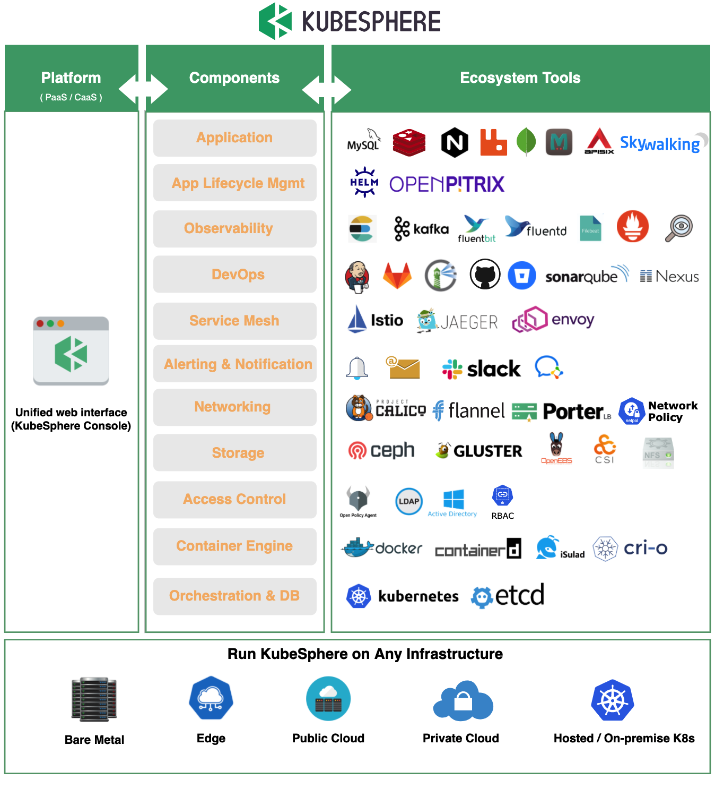
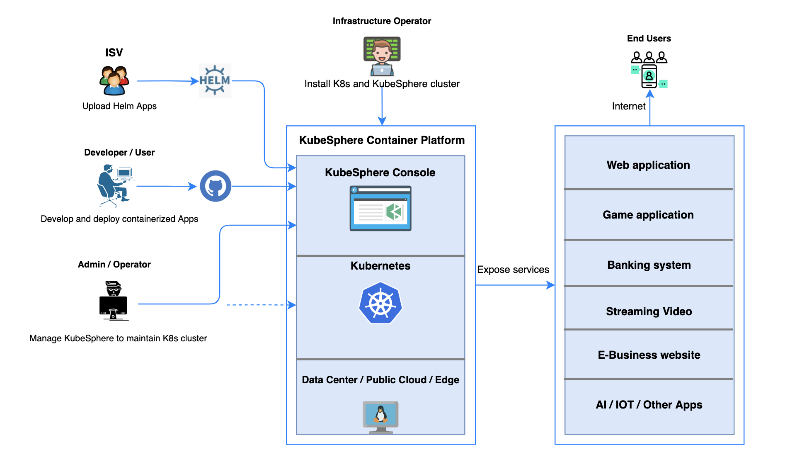
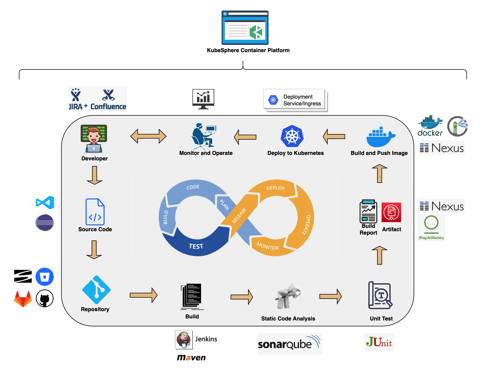
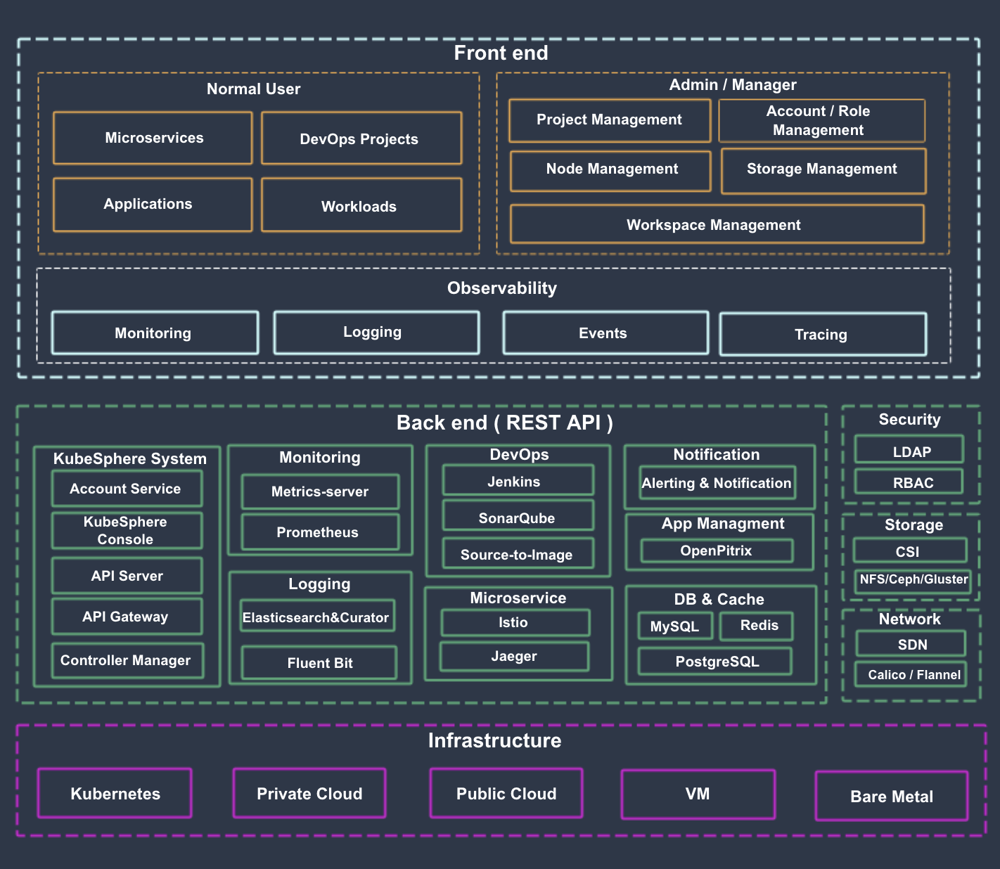
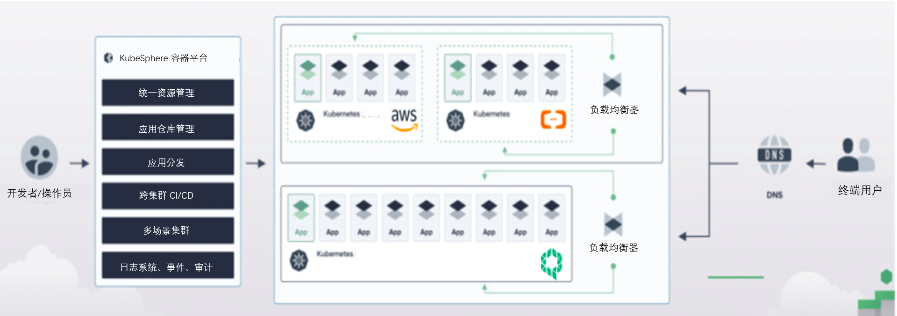
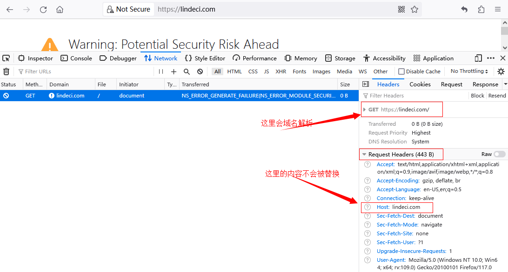

- [官网](#官网)
- [产品介绍](#产品介绍)
  - [什么是 KubeSphere](#什么是-kubesphere)
  - [生态工具](#生态工具)
  - [平台功能](#平台功能)
  - [架构说明](#架构说明)
    - [组件列表](#组件列表)
    - [服务组件](#服务组件)
  - [应用场景](#应用场景)
- [快速入门](#快速入门)
  - [创建企业空间、项目、用户和平台角色](#创建企业空间项目用户和平台角色)
    - [架构](#架构)
    - [内置角色](#内置角色)
    - [企业空间](#企业空间)
    - [创建项目](#创建项目)
      - [创建应用路由](#创建应用路由)
    - [创建角色](#创建角色)
  - [启用可插拔组件](#启用可插拔组件)
    - [在安装前启用可插拔组件](#在安装前启用可插拔组件)
    - [在安装后启用可插拔组件](#在安装后启用可插拔组件)
- [在 Linux 上安装 KubeSphere](#在-linux-上安装-kubesphere)
  - [概述](#概述)
    - [KubeKey](#kubekey)
    - [存储配置](#存储配置)
    - [集群运维](#集群运维)
    - [卸载](#卸载)
  - [KubeKey](#kubekey-1)
  - [多节点安装](#多节点安装)
    - [概念](#概念)
  - [端口要求](#端口要求)
  - [Kubernetes 集群配置](#kubernetes-集群配置)
  - [高可用配置](#高可用配置)
    - [使用 KubeKey 内置 HAproxy 创建高可用集群](#使用-kubekey-内置-haproxy-创建高可用集群)
    - [使用负载均衡器创建高可用集群](#使用负载均衡器创建高可用集群)
    - [使用 Keepalived 和 HAproxy 创建高可用 Kubernetes 集群](#使用-keepalived-和-haproxy-创建高可用-kubernetes-集群)
  - [持久化存储配置](#持久化存储配置)
    - [安装持久化存储](#安装持久化存储)
    - [默认存储类型](#默认存储类型)
    - [多存储解决方案](#多存储解决方案)
  - [在公共云上安装](#在公共云上安装)
  - [在本地环境中安装](#在本地环境中安装)
  - [添加或删除节点](#添加或删除节点)
  - [卸载 KubeSphere 和 Kubernetes](#卸载-kubesphere-和-kubernetes)
- [在 Kubernetes 上安装 KubeSphere](#在-kubernetes-上安装-kubesphere)
- [多集群管理](#多集群管理)
- [启用可插拔组件](#启用可插拔组件-1)
  - [卸载可插拔组件](#卸载可插拔组件)
- [升级](#升级)
- [集群管理](#集群管理)
  - [节点管理](#节点管理)
    - [节点状态](#节点状态)
    - [节点管理](#节点管理-1)
    - [添加和删除节点](#添加和删除节点)
  - [集群状态监控](#集群状态监控)
    - [集群状态监控](#集群状态监控-1)
      - [集群节点状态](#集群节点状态)
      - [组件状态](#组件状态)
      - [集群资源用量](#集群资源用量)
    - [物理资源监控](#物理资源监控)
      - [CPU 用量](#cpu-用量)
      - [内存用量](#内存用量)
      - [CPU 平均负载](#cpu-平均负载)
      - [磁盘用量](#磁盘用量)
      - [Inode 用量](#inode-用量)
      - [磁盘吞吐](#磁盘吞吐)
      - [IOPS](#iops)
      - [网络带宽](#网络带宽)
      - [容器组状态](#容器组状态)
    - [etcd 监控](#etcd-监控)
    - [API Server 监控](#api-server-监控)
    - [调度器监控](#调度器监控)
    - [节点用量排行](#节点用量排行)
  - [应用资源监控](#应用资源监控)
    - [使用情况](#使用情况)
    - [用量排行](#用量排行)
  - [集群告警和通知](#集群告警和通知)
  - [集群设置](#集群设置)
    - [集群可见性和授权](#集群可见性和授权)
    - [日志接收器](#日志接收器)
      - [为容器日志添加日志接收器](#为容器日志添加日志接收器)
      - [为资源事件或审计日志添加日志接收器](#为资源事件或审计日志添加日志接收器)
      - [启用或停用日志接收器](#启用或停用日志接收器)
      - [编辑或删除日志接收器](#编辑或删除日志接收器)
    - [集群网关](#集群网关)
      - [创建集群网关](#创建集群网关)
      - [集群网关详情页面](#集群网关详情页面)
      - [查看项目网关](#查看项目网关)
  - [存储类](#存储类)
    - [介绍](#介绍)
    - [创建存储类](#创建存储类)
    - [设置存储类](#设置存储类)
      - [QingCloud CSI](#qingcloud-csi)
      - [参数设置项](#参数设置项)
    - [管理存储类](#管理存储类)
  - [卷快照类](#卷快照类)
    - [操作步骤](#操作步骤)
  - [关闭和重启集群](#关闭和重启集群)
- [企业空间管理和用户指南](#企业空间管理和用户指南)
  - [企业空间概述](#企业空间概述)
    - [创建企业空间](#创建企业空间)
    - [删除企业空间](#删除企业空间)
  - [上传基于 Helm 的应用程序](#上传基于-helm-的应用程序)
  - [应用仓库](#应用仓库)
    - [导入 Helm 仓库](#导入-helm-仓库)
      - [添加应用仓库](#添加应用仓库)
    - [上传应用至 KubeSphere 的 GitHub 仓库](#上传应用至-kubesphere-的-github-仓库)
      - [上传应用](#上传应用)
  - [企业空间角色和成员管理](#企业空间角色和成员管理)
    - [内置角色](#内置角色-1)
    - [创建企业空间角色](#创建企业空间角色)
    - [邀请新成员](#邀请新成员)
  - [企业空间网络隔离](#企业空间网络隔离)
    - [开启或关闭企业空间网络隔离](#开启或关闭企业空间网络隔离)
    - [最佳做法](#最佳做法)
  - [项目配额](#项目配额)
  - [企业空间配额](#企业空间配额)
  - [部门管理](#部门管理)
    - [创建部门](#创建部门)
    - [分配用户至部门](#分配用户至部门)
    - [从部门中移除用户](#从部门中移除用户)
    - [删除和编辑部门](#删除和编辑部门)
- [项目用户指南](#项目用户指南)
  - [应用程序](#应用程序)
- [负载均衡设置](#负载均衡设置)
- [应用路由的域名作用](#应用路由的域名作用)

# 官网

https://www.kubesphere.io/

https://github.com/kubesphere/kubesphere

# 产品介绍

## 什么是 KubeSphere

KubeSphere 是在 Kubernetes 之上构建的面向云原生应用的分布式操作系统，完全开源，支持多云与多集群管理，提供全栈的 IT 自动化运维能力，简化企业的 DevOps 工作流。

KubeSphere 为用户提供构建企业级 Kubernetes 环境所需的多项功能，例如多云与多集群管理、Kubernetes 资源管理、DevOps、应用生命周期管理、微服务治理（服务网格）、日志查询与收集、服务与网络、多租户管理、监控告警、事件与审计查询、存储管理、访问权限控制、GPU 支持、网络策略、镜像仓库管理以及安全管理等。

## 生态工具

KubeSphere 围绕 Kubernetes 集成了多个云原生生态主流的开源软件，同时支持对接大部分流行的第三方组件，从应用和应用生命周期管理到集群底层的运行时，将这些开源项目作为其后端组件，通过标准的 API 与 KubeSphere 控制台交互，最终在一个统一的控制台界面提供一致的用户体验，以降低对不同工具的学习成本和复杂性。


## 平台功能

拥有企业级 Kubernetes 所需的最常见的功能，如工作负载管理，网络策略配置，微服务治理（基于 Istio），DevOps 项目 (CI/CD) ，安全管理，Source to Image/Binary to Image，多租户管理，多维度监控，日志查询和收集，告警通知，审计，应用程序管理和镜像管理、应用配置密钥管理等功能模块。

它还支持各种开源存储和网络解决方案以及云存储服务。


部署 Kubernetes 集群、多集群管理和部署、DevOps支持、基于 Istio 的服务网络、多租户管理、可观测性、日志查询与收集、应用程序管理和编排、多种存储解决方案、多种网络解决方案


## 架构说明

KubeSphere 将 前端 与 后端 分开，实现了面向云原生的设计，后端的各个功能组件可通过 REST API 对接外部系统。KubeSphere 无底层的基础设施依赖，可以运行在任何 Kubernetes、私有云、公有云、VM 或物理环境（BM）之上。


### 组件列表

| 后端组件              | 功能说明                                                                                            |
| --------------------- | --------------------------------------------------------------------------------------------------- |
| ks-apiserver          | 整个集群管理的 API 接口和集群内部各个模块之间通信的枢纽，以及集群安全控制。                         |
| ks-console            | 提供 KubeSphere 的控制台服务。                                                                      |
| ks-controller-manager | 实现业务逻辑的，例如创建企业空间时，为其创建对应的权限；或创建服务策略时，生成对应的 Istio 配置等。 |
| metrics-server        | Kubernetes 的监控组件，从每个节点的 Kubelet 采集指标信息。                                          |
| Prometheus            | 提供集群，节点，工作负载，API对象的监视指标和服务。                                                 |
| Elasticsearch         | 提供集群的日志索引、查询、数据管理等服务，在安装时也可对接您已有的 ES 减少资源消耗。                |
| Fluent Bit            | 提供日志接收与转发，可将采集到的⽇志信息发送到 ElasticSearch、Kafka。                               |
| Jenkins               | 提供 CI/CD 流水线服务。                                                                             |
| Source-to-Image       | 将源代码自动将编译并打包成 Docker 镜像，方便快速构建镜像。                                          |
| Istio                 | 提供微服务治理与流量管控，如灰度发布、金丝雀发布、熔断、流量镜像等。                                |
| Jaeger                | 收集 Sidecar 数据，提供分布式 Tracing 服务。                                                        |
| OpenPitrix            | 提供应用程序生命周期管理，例如应用模板、应用部署与管理的服务等。                                    |
| Alert                 | 提供集群、Workload、Pod、容器级别的自定义告警服务。                                                 |
| Notification          | 是一项综合通知服务； 它当前支持邮件传递方法。                                                       |
| Redis                 | 将 ks-console 与 ks-account 的数据存储在内存中的存储系统。                                          |
| OpenLDAP              | 负责集中存储和管理用户帐户信息与对接外部的 LDAP。                                                   |
| Storage               | 内置 CSI 插件对接云平台存储服务，可选安装开源的 NFS/Ceph/Gluster 的客户端。                         |
| Network               | 可选安装 Calico/Flannel 等开源的网络插件，支持对接云平台 SDN。                                      |

### 服务组件

以上列表中每个功能组件下还有多个服务组件，关于服务组件的说明，可参考 [服务组件说明](https://www.kubesphere.io/zh/docs/v3.3/pluggable-components/) 。

## 应用场景

KubeSphere 适用于多种场景，为企业提供容器化的环境，借助完善的管理和运维功能，让企业在数字化转型过程中从容应对各种挑战和各类业务场景，如多云多集群管理、敏捷软件开发、自动化运维、微服务治理、流量管理、高可用以及 DevOps 持续集成与交付等。

多集群部署、多维度监控、微服务和云原生架构、DevOps 落地实践、裸机环境部署

# 快速入门

## 创建企业空间、项目、用户和平台角色

### 架构

KubeSphere 的多租户系统分三个层级，即集群、企业空间和项目。KubeSphere 中的项目等同于 Kubernetes 的命名空间。

您需要创建一个新的企业空间进行操作，而不是使用系统企业空间，系统企业空间中运行着系统资源，绝大部分仅供查看。

### 内置角色

| 内置角色                      | 描述                                                               |
| ----------------------------- | ------------------------------------------------------------------ |
| `platform-self-provisioner` | 创建企业空间并成为所创建企业空间的管理员。                         |
| `platform-regular`          | 平台普通用户，在被邀请加入企业空间或集群之前没有任何资源操作权限。 |
| `platform-admin`            | 平台管理员，可以管理平台内的所有资源。                             |

### 企业空间

作为管理项目、DevOps 项目和组织成员的基本逻辑单元，企业空间是 KubeSphere 多租户系统的基础。

### 创建项目

#### 创建应用路由

在创建应用路由（即 Kubernetes 中的 Ingress）之前，需要启用该项目的网关。网关是在项目中运行的 NGINX Ingress 控制器。若要设置网关，请转到项目设置中的网关设置，然后点击设置网关。

### 创建角色

## 启用可插拔组件

参照下表了解 KubeSphere 的全部可插拔组件

| 配置项             | 功能组件                         | 描述                                                                                                                 |
| ------------------ | -------------------------------- | -------------------------------------------------------------------------------------------------------------------- |
| `alerting`       | KubeSphere 告警系统              | 可以为工作负载和节点自定义告警策略。告警策略被触发后，告警消息会通过不同的渠道（例如，邮件和 Slack）发送至接收人。   |
| `auditing`       | KubeSphere 审计日志系统          | 提供一套与安全相关并按时间顺序排列的记录，记录平台上不同租户的活动。                                                 |
| `devops`         | KubeSphere DevOps 系统           | 基于 Jenkins 提供开箱即用的 CI/CD 功能，提供一站式 DevOps 方案、内置 Jenkins 流水线与 B2I & S2I。                    |
| `events`         | KubeSphere 事件系统              | 提供一个图形化的 Web 控制台，用于导出、过滤和警告多租户 Kubernetes 集群中的 Kubernetes 事件。                        |
| `logging`        | KubeSphere 日志系统              | 在统一的控制台中提供灵活的日志查询、收集和管理功能。可以添加第三方日志收集器，例如 Elasticsearch、Kafka 和 Fluentd。 |
| `metrics_server` | HPA                              | 根据设定指标对 Pod 数量进行动态伸缩，使运行在上面的服务对指标的变化有一定的自适应能力。                              |
| `networkpolicy`  | 网络策略                         | 可以在同一个集群内部之间设置网络策略（比如限制或阻止某些实例 Pod 之间的网络请求）。                                  |
| `kubeedge`       | KubeEdge                         | 为集群添加边缘节点并在这些节点上运行工作负载。                                                                       |
| `openpitrix`     | KubeSphere 应用商店              | 基于 Helm 的应用程序商店，允许用户管理应用的整个生命周期。                                                           |
| `servicemesh`    | KubeSphere 服务网格 (基于 Istio) | 提供细粒度的流量治理、可观测性、流量追踪以及可视化流量拓扑图。                                                       |
| `ippool`         | 容器组 IP 池                     | 创建容器组 IP 池并从 IP 池中分配 IP 地址到 Pod。                                                                     |
| `topology`       | 服务拓扑图                       | 集成[Weave Scope](https://www.weave.works/oss/scope/) 以查看应用和容器的服务间通信（拓扑图）。                          |

### 在安装前启用可插拔组件

### 在安装后启用可插拔组件

1. 以 admin 身份登录控制台。点击左上角的平台管理 ，然后选择集群管理
2. 点击定制资源定义，然后在搜索栏中输入 clusterconfiguration，点击搜索结果进入其详情页面
3. 在自定义资源中，点击 ks-installer 右侧的三个点，然后选择编辑 YAML
4. 在该配置文件中，将对应组件 enabled 的 false 更改为 true，以启用要安装的组件。完成后，点击确定以保存配置
5. 执行以下命令，使用 Web kubectl 来检查安装过程

```sh
kubectl logs -n kubesphere-system $(kubectl get pod -n kubesphere-system -l 'app in (ks-install, ks-installer)' -o jsonpath='{.items[0].metadata.name}') -f
```

6. 如果组件安装成功，输出将显示以下消息

```sh
#####################################################
###              Welcome to KubeSphere!           ###
#####################################################

Console: http://192.168.0.2:30880
Account: admin
Password: P@88w0rd

NOTES：
  1. After you log into the console, please check the
     monitoring status of service components in
     "Cluster Management". If any service is not
     ready, please wait patiently until all components 
     are up and running.
  2. Please change the default password after login.

#####################################################
https://kubesphere.io             20xx-xx-xx xx:xx:xx
#####################################################
```

7. 登录 KubeSphere 控制台，在系统组件中可以查看不同组件的状态

# 在 Linux 上安装 KubeSphere

## 概述

以下是可用的安装选项：

- All-in-One：在单个节点上安装 KubeSphere（仅为让用户快速熟悉 KubeSphere）。
- 多节点安装：在多个节点上安装 KubeSphere（用于测试或开发）。
- 在 Linux 上离线安装：将 KubeSphere 的所有镜像打包（便于在 Linux 上进行离线安装）。
- 高可用安装：安装具有多个节点的高可用 KubeSphere 集群，该集群用于生产环境。
- 最小化安装：仅安装 KubeSphere 所需的最少系统组件。以下是最低资源要求：

```
2 个 CPU
4 GB 运行内存
40 GB 存储空间
```

- 全家桶安装：安装 KubeSphere 的所有可用系统组件，例如 DevOps、服务网格、告警等。

[离线环境安装 KubeSphere](https://www.kubesphere.io/zh/docs/v3.3/installing-on-linux/introduction/air-gapped-installation/)

### KubeKey

KubeKey 为集群的安装和配置提供了一种有效的方法。您可以使用它来创建、扩缩和升级 Kubernetes 集群。您也可以在设置集群时使用 KubeKey 安装云原生组件（YAML 或 Chart）。

### 存储配置

可以在 KubeSphere 安装前或安装后配置持久化储存服务。同时，KubeSphere 支持各种开源存储解决方案（例如 Ceph 和 GlusterFS）以及商业存储产品。

### 集群运维

添加新节点、删除节点、

### 卸载

## KubeKey

## 多节点安装

### 概念

- Control plane node：主节点，通常托管控制平面，控制和管理整个系统。
- Worker node：工作节点，运行部署在工作节点上的实际应用程序。

## 端口要求

## Kubernetes 集群配置

```yaml
cat config-sample.yaml 

apiVersion: kubekey.kubesphere.io/v1alpha2
kind: Cluster
metadata:
  name: sample
spec:
  hosts:
  - {name: node1, address: 172.1.1.2, internalAddress: 172.1.1.2, user: ubuntu, password: "test123"}
  - {name: node2, address: 172.1.1.4, internalAddress: 172.1.1.4, user: ubuntu, password: "test123"}
  - {name: node3, address: 172.1.1.14, internalAddress: 172.1.1.14, user: ubuntu, password: "test123"}
  roleGroups:
    etcd:
    - node1
    - node2
    - node3
    control-plane:
    - node1
    - node2
    - node3
    worker:
    - node1
    - node2
    - node3
  controlPlaneEndpoint:
    ## Internal loadbalancer for apiservers 
    internalLoadbalancer: haproxy

    domain: lb.kubesphere.local
    address: ""
    port: 6443
  kubernetes:
    version: v1.24.0
    clusterName: cluster.local
    autoRenewCerts: true
    containerManager: containerd
  etcd:
    type: kubekey
  network:
    plugin: calico
    kubePodsCIDR: 10.233.64.0/18
    kubeServiceCIDR: 10.233.0.0/18
    ## multus support. https://github.com/k8snetworkplumbingwg/multus-cni
    multusCNI:
      enabled: false
  registry:
    privateRegistry: ""
    namespaceOverride: ""
    registryMirrors: []
    insecureRegistries: []
  addons: []


---
apiVersion: installer.kubesphere.io/v1alpha1
kind: ClusterConfiguration
metadata:
  name: ks-installer
  namespace: kubesphere-system
  labels:
    version: v3.3.2
spec:
  persistence:
    storageClass: ""
  authentication:
    jwtSecret: ""
  zone: ""
  local_registry: ""
  namespace_override: ""
  # dev_tag: ""
  etcd:
    monitoring: false
    endpointIps: localhost
    port: 2379
    tlsEnable: true
  common:
    core:
      console:
        enableMultiLogin: true
        port: 30880
        type: NodePort
    # apiserver:
    #  resources: {}
    # controllerManager:
    #  resources: {}
    redis:
      enabled: false
      volumeSize: 2Gi
    openldap:
      enabled: false
      volumeSize: 2Gi
    minio:
      volumeSize: 20Gi
    monitoring:
      # type: external
      endpoint: http://prometheus-operated.kubesphere-monitoring-system.svc:9090
      GPUMonitoring:
        enabled: false
    gpu:
      kinds:
      - resourceName: "nvidia.com/gpu"
        resourceType: "GPU"
        default: true
    es:
      # master:
      #   volumeSize: 4Gi
      #   replicas: 1
      #   resources: {}
      # data:
      #   volumeSize: 20Gi
      #   replicas: 1
      #   resources: {}
      logMaxAge: 7
      elkPrefix: logstash
      basicAuth:
        enabled: false
        username: ""
        password: ""
      externalElasticsearchHost: ""
      externalElasticsearchPort: ""
  alerting:
    enabled: false
    # thanosruler:
    #   replicas: 1
    #   resources: {}
  auditing:
    enabled: false
    # operator:
    #   resources: {}
    # webhook:
    #   resources: {}
  devops:
    enabled: false
    # resources: {}
    jenkinsMemoryLim: 8Gi
    jenkinsMemoryReq: 4Gi
    jenkinsVolumeSize: 8Gi
  events:
    enabled: false
    # operator:
    #   resources: {}
    # exporter:
    #   resources: {}
    # ruler:
    #   enabled: true
    #   replicas: 2
    #   resources: {}
  logging:
    enabled: false
    logsidecar:
      enabled: true
      replicas: 2
      # resources: {}
  metrics_server:
    enabled: false
  monitoring:
    storageClass: ""
    node_exporter:
      port: 9100
      # resources: {}
    # kube_rbac_proxy:
    #   resources: {}
    # kube_state_metrics:
    #   resources: {}
    # prometheus:
    #   replicas: 1
    #   volumeSize: 20Gi
    #   resources: {}
    #   operator:
    #     resources: {}
    # alertmanager:
    #   replicas: 1
    #   resources: {}
    # notification_manager:
    #   resources: {}
    #   operator:
    #     resources: {}
    #   proxy:
    #     resources: {}
    gpu:
      nvidia_dcgm_exporter:
        enabled: false
        # resources: {}
  multicluster:
    clusterRole: none
  network:
    networkpolicy:
      enabled: false
    ippool:
      type: none
    topology:
      type: none
  openpitrix:
    store:
      enabled: false
  servicemesh:
    enabled: false
    istio:
      components:
        ingressGateways:
        - name: istio-ingressgateway
          enabled: false
        cni:
          enabled: false
  edgeruntime:
    enabled: false
    kubeedge:
      enabled: false
      cloudCore:
        cloudHub:
          advertiseAddress:
            - ""
        service:
          cloudhubNodePort: "30000"
          cloudhubQuicNodePort: "30001"
          cloudhubHttpsNodePort: "30002"
          cloudstreamNodePort: "30003"
          tunnelNodePort: "30004"
        # resources: {}
        # hostNetWork: false
      iptables-manager:
        enabled: true
        mode: "external"
        # resources: {}
      # edgeService:
      #   resources: {}
  terminal:
    timeout: 600 
```

以下表格会详细描述上面的参数

| 参数                                                                                       | 描述                                                                                                                                                                                                                                                                                             |
| ------------------------------------------------------------------------------------------ | ------------------------------------------------------------------------------------------------------------------------------------------------------------------------------------------------------------------------------------------------------------------------------------------------ |
| `kubernetes`                                                                             |                                                                                                                                                                                                                                                                                                  |
| `version`                                                                                | Kubernetes 安装版本。如未指定 Kubernetes 版本，[KubeKey](https://www.kubesphere.io/zh/docs/installing-on-linux/introduction/kubekey) v3.0.7 默认安装 Kubernetes v1.23.10。有关更多信息，请参阅[支持矩阵](https://www.kubesphere.io/zh/docs/installing-on-linux/introduction/kubekey/#support-matrix)。 |
| `imageRepo`                                                                              | 用于下载镜像的 Docker Hub 仓库                                                                                                                                                                                                                                                                   |
| `clusterName`                                                                            | Kubernetes 集群名称。                                                                                                                                                                                                                                                                            |
| `masqueradeAll`*                                                                         | 如果使用纯 iptables 代理模式，`masqueradeAll` 即让 kube-proxy 对所有流量进行源地址转换 (SNAT)。它默认值为 `false`。                                                                                                                                                                          |
| `maxPods`*                                                                               | Kubelet 可运行 Pod 的最大数量，默认值为 `110`。                                                                                                                                                                                                                                                |
| `nodeCidrMaskSize`*                                                                      | 集群中节点 CIDR 的掩码大小，默认值为 `24`。                                                                                                                                                                                                                                                    |
| `proxyMode`*                                                                             | 使用的代理模式，默认为 `ipvs`。                                                                                                                                                                                                                                                                |
| `network`                                                                                |                                                                                                                                                                                                                                                                                                  |
| `plugin`                                                                                 | 是否使用 CNI 插件。KubeKey 默认安装 Calico，您也可以指定为 Flannel。请注意，只有使用 Calico 作为 CNI 插件时，才能使用某些功能，例如 Pod IP 池。                                                                                                                                                  |
| `calico.ipipMode`*                                                                       | 用于集群启动时创建 IPv4 池的 IPIP 模式。如果值设置除 `Never` 以外的值，则参数 `vxlanMode` 应该被设置成 `Never`。此参数允许设置值 `Always`，`CrossSubnet` 和 `Never`。默认值为 `Always`。                                                                                           |
| `calico.vxlanMode`*                                                                      | 用于集群启动时创建 IPv4 池的 VXLAN 模式。如果该值不设为 `Never`，则参数 `ipipMode` 应该设为 `Never`。此参数允许设置值 `Always`，`CrossSubnet` 和 `Never`。默认值为 `Never`。                                                                                                       |
| `calico.vethMTU`*                                                                        | 最大传输单元（maximum transmission unit 简称 MTU）设置可以通过网络传输的最大数据包大小。默认值为 `1440`。                                                                                                                                                                                      |
| `kubePodsCIDR`                                                                           | Kubernetes Pod 子网的有效 CIDR 块。CIDR 块不应与您的节点子网和 Kubernetes 服务子网重叠。                                                                                                                                                                                                         |
| `kubeServiceCIDR`                                                                        | Kubernetes 服务的有效 CIDR 块。CIDR 块不应与您的节点子网和 Kubernetes Pod 子网重叠。                                                                                                                                                                                                             |
| `registry`                                                                               |                                                                                                                                                                                                                                                                                                  |
| `registryMirrors`                                                                        | 配置 Docker 仓库镜像以加速下载。有关详细信息，请参阅[配置 Docker 守护进程](https://docs.docker.com/registry/recipes/mirror/#configure-the-docker-daemon)。                                                                                                                                          |
| `insecureRegistries`                                                                     | 设置不安全镜像仓库的地址。有关详细信息，请参阅[测试不安全仓库](https://docs.docker.com/registry/insecure/)。                                                                                                                                                                                        |
| `privateRegistry`*                                                                       | 配置私有镜像仓库，用于离线安装（例如，Docker 本地仓库或 Harbor）。有关详细信息，请参阅[离线安装](https://www.kubesphere.io/zh/docs/v3.3/installing-on-linux/introduction/air-gapped-installation/)。                                                                                                |
| [更多详细信息](https://github.com/kubesphere/kubekey/blob/release-2.2/docs/config-example.md) |                                                                                                                                                                                                                                                                                                  |

## 高可用配置

### 使用 KubeKey 内置 HAproxy 创建高可用集群

### 使用负载均衡器创建高可用集群

### 使用 Keepalived 和 HAproxy 创建高可用 Kubernetes 集群


## 持久化存储配置

### 安装持久化存储

持久化存储是安装 KubeSphere 的必备条件。使用 KubeKey 搭建 KubeSphere 集群时，可以安装不同的存储系统作为插件。在 Linux 上通过 KubeKey 安装 KubeSphere 的一般步骤如下：

1. 安装 Kubernetes。
2. 安装所提供的任何插件。
3. 通过 ks-installer 安装 KubeSphere。

在第 2 步中，必须安装可用的 StorageClass，包括：

- StorageClass 本身
- 必要情况下，还需为 StorageClass 安装存储插件

### 默认存储类型

KubeKey 支持安装不同的存储插件和存储类型。无论您要安装哪种存储系统，都可以在其配置文件中指定是否设为默认存储类型。如果 KubeKey 检测到未指定默认存储类型，则将默认安装 OpenEBS。

OpenEBS 本地 PV 动态供应器可以使用节点上的唯一 HostPath（目录）来创建 Kubernetes 本地持久卷，以持久化数据。用户没有特定的存储系统时，可以通过默认的 OpenEBS 快速上手。

### 多存储解决方案

如果打算安装多个存储插件，那么只能将其中一个设置为默认存储类型。否则，KubeKey 将无法识别使用哪种存储类型。

## 在公共云上安装

## 在本地环境中安装

## 添加或删除节点

## 卸载 KubeSphere 和 Kubernetes

```sh
./kk delete cluster [-f config-sample.yaml]
```

# 在 Kubernetes 上安装 KubeSphere

KubeSphere 承诺为用户提供即插即用架构，您可以轻松地将 KubeSphere 安装在现有的 Kubernetes 集群上。更具体地说，KubeSphere 既可以部署于托管在云端（例如 AWS EKS、青云QingCloud QKE 和 Google GKE 等）的 Kubernetes 服务上，也可以部署在本地 Kubernetes 集群上。这是因为 KubeSphere 不会侵入 Kubernetes，它仅与 Kubernetes API 交互，以管理 Kubernetes 集群资源。换句话说，KubeSphere 可以安装在任何原生 Kubernetes 集群和 Kubernetes 发行版上。

# 多集群管理

如今，各种组织跨不同的云厂商或者在不同的基础设施上运行和管理多个 Kubernetes 集群的做法非常普遍。由于每个 Kubernetes 集群都是一个相对独立的单元，上游社区正在艰难地研究和开发多集群管理解决方案。即便如此，Kubernetes 集群联邦（Kubernetes Cluster Federation，简称 KubeFed）可能是其中一种可行的方法。

多集群管理最常见的使用场景包括服务流量负载均衡、隔离开发和生产环境、解耦数据处理和数据存储、跨云备份和灾难恢复、灵活分配计算资源、跨区域服务的低延迟访问以及避免厂商锁定等。

开发 KubeSphere 旨在解决多集群和多云管理（包括上述使用场景）的难题，为用户提供统一的控制平面，将应用程序及其副本分发到位于公有云和本地环境的多个集群。KubeSphere 还拥有跨多个集群的丰富可观测性，包括集中监控、日志系统、事件和审计日志等。


# 启用可插拔组件

## 卸载可插拔组件

# 升级

# 集群管理

## 节点管理

Kubernetes 将容器放入容器组（Pod）中并在节点上运行，从而运行工作负载。取决于具体的集群环境，节点可以是虚拟机，也可以是物理机。每个节点都包含运行容器组所需的服务，这些服务由控制平面管理。

### 节点状态

- 名称：节点的名称和子网 IP 地址。
- 状态：节点的当前状态，标识节点是否可用。
- 角色：节点的角色，标识节点是工作节点还是主节点。
- CPU 用量：节点的实时 CPU 用量。
- 内存用量：节点的实时内存用量。
- 容器组：节点的实时容器组用量。
- 已分配 CPU：该指标根据节点上容器组的总 CPU 请求数计算得出。它表示节点上为工作负载预留的 CPU 资源。工作负载实际正在使用 CPU 资源可能低于该数值。该指标对于 Kubernetes 调度器 (kube-scheduler) 非常重要。在大多数情况下，调度器在调度容器组时会偏向配得 CPU 资源较少的节点。有关更多信息，请参阅为容器管理资源。
- 已分配内存：该指标根据节点上容器组的总内存请求计算得出。它表示节点上为工作负载预留的内存资源。工作负载实际正在使用内存资源可能低于该数值。

### 节点管理

- 停止调度/启用调度：点击集群节点右侧的 ，然后点击停止调度或启用调度停止或启用调度节点。您可以在节点重启或维护期间将节点标记为不可调度。Kubernetes 调度器不会将新容器组调度到标记为不可调度的节点。但这不会影响节点上现有工作负载。
- 打开终端：点击集群节点右侧的 ,然后点击打开终端。该功能让您更加便捷地管理节点，如修改节点配置、下载镜像等。
- 编辑污点：污点允许节点排斥一些容器组。勾选目标节点前的复选框，在上方弹出的按钮中点击编辑污点。在弹出的编辑污点对话框，您可以添加或删除污点。

同时，您也可以点击列表中的某个节点打开节点详情页面。除了停止调度/启用调度和编辑污点外，您还可以执行以下操作：

- 编辑标签：您可以利用节点标签将容器组分配给特定节点。首先标记节点（例如，用 node-role.kubernetes.io/gpu-node 标记 GPU 节点），然后在创建工作负载时在高级设置中添加此标签，从而使容器组在 GPU 节点上运行。要添加节点标签，请点击更多操作 > 编辑标签。
- 查看节点运行状态、容器组、元数据、监控和事件。

### 添加和删除节点

前版本不支持通过 KubeSphere 控制台添加或删除节点。您可以使用 KubeKey 来进行此类操作

## 集群状态监控

KubeSphere 支持对集群 CPU、内存、网络和磁盘等资源的相关指标进行监控。

### 集群状态监控

监控告警下的集群状态以查看集群状态概览，包括集群节点状态、组件状态、集群资源用量、etcd 监控和服务组件监控。

#### 集群节点状态

#### 组件状态

KubeSphere 监控集群中各种服务组件的健康状态。当关键组件发生故障时，系统可能会变得不可用。

KubeSphere 的监控机制确保平台可以在组件出现故障时将所有问题通知租户，以便快速定位问题并采取相应的措施。

#### 集群资源用量

集群资源用量显示集群中所有节点的 CPU 用量、内存用量、磁盘用量和容器组数量。

### 物理资源监控

您可以利用物理资源监控页面提供的数据更好地掌控物理资源状态，并建立正常资源和集群性能的标准。KubeSphere 允许用户查看最近 7 天的集群监控数据，包括 CPU 用量、内存用量、CPU 平均负载（1 分钟/5 分钟/15 分钟）、磁盘用量、Inode 用量、磁盘吞吐（读写）、IOPS（读写）、网络带宽和容器组状态。您可以在 KubeSphere 中自定义时间范围和时间间隔以查看物理资源的历史监控数据。以下简要介绍每个监控指标。

#### CPU 用量

#### 内存用量

#### CPU 平均负载

CPU 平均负载是单位时间内系统中处于可运行状态和非中断状态的平均进程数（亦即活动进程的平均数量）。CPU 平均负载和 CPU 利用率之间没有直接关系。理想情况下，平均负载应该等于 CPU 的数量。因此，在查看平均负载时，需要考虑 CPU 的数量。只有当平均负载大于 CPU 数量时，系统才会超载。

#### 磁盘用量

#### Inode 用量

每个文件都有一个 inode，用于存储文件的创建者和创建日期等元信息。inode 也会占用磁盘空间，众多的小缓存文件很容易导致 inode 资源耗尽。此外，在 inode 已用完但磁盘未满的情况下，也无法在磁盘上创建新文件。

#### 磁盘吞吐

#### IOPS

IOPS 表示每秒读写操作数。具体来说，磁盘的 IOPS 是每秒连续读写的总和。当传输小块非连续数据时，该指示器具有重要的参考意义。

#### 网络带宽

网络带宽是网卡每秒接收或发送数据的能力，单位为 Mbps。

#### 容器组状态

容器组状态显示不同状态的容器组的总数，包括运行中、已完成和异常状态。标记为已完成的容器组通常为任务（Job）或定时任务（CronJob）。标记为异常的容器组需要特别注意。

### etcd 监控

**etcd 监控** 可以帮助您更好地利用 etcd，特别用于是定位性能问题。etcd 服务提供了原生的指标接口。

KubeSphere 监控系统提供了高度图形化和响应性强的仪表板，用于显示原生数据。

| 指标             | 描述                                                                                                                                                                                                                                                                                                                                                                                                                                                                                                                                                                                                                                                                                                                                                                                                                                                                                                                                             |
| ---------------- | ------------------------------------------------------------------------------------------------------------------------------------------------------------------------------------------------------------------------------------------------------------------------------------------------------------------------------------------------------------------------------------------------------------------------------------------------------------------------------------------------------------------------------------------------------------------------------------------------------------------------------------------------------------------------------------------------------------------------------------------------------------------------------------------------------------------------------------------------------------------------------------------------------------------------------------------------ |
| 服务状态         | -**是否有 Leader** 表示成员是否有 Leader。如果成员没有 Leader，则成员完全不可用。如果集群中的所有成员都没有任何 Leader，则整个集群完全不可用。``- **1 小时内 Leader 变更次数** 表示集群成员观察到的 1 小时内 Leader 变更总次数。频繁变更 Leader 将显著影响 etcd 性能，同时这还表明 Leader 可能由于网络连接问题或 etcd 集群负载过高而不稳定。                                                                                                                                                                                                                                                                                                                                                                                                                                                                                                                                                                                         |
| 库大小           | etcd 的底层数据库大小，单位为 MiB。图表中显示的是 etcd 的每个成员数据库的平均大小。                                                                                                                                                                                                                                                                                                                                                                                                                                                                                                                                                                                                                                                                                                                                                                                                                                                              |
| 客户端流量       | 包括发送到 gRPC 客户端的总流量和从 gRPC 客户端接收的总流量。有关该指标的更多信息，请参阅[ etcd Network](https://github.com/etcd-io/etcd/blob/v3.2.17/Documentation/metrics.md#network)。                                                                                                                                                                                                                                                                                                                                                                                                                                                                                                                                                                                                                                                                                                                                                            |
| gRPC 流式消息    | 服务器端的 gRPC 流消息接收速率和发送速率，反映集群内是否正在进行大规模的数据读写操作。有关该指标的更多信息，请参阅[ go-grpc-prometheus](https://github.com/grpc-ecosystem/go-grpc-prometheus#counters)。                                                                                                                                                                                                                                                                                                                                                                                                                                                                                                                                                                                                                                                                                                                                            |
| WAL 日志同步时间 | WAL 调用 fsync 的延迟。在应用日志条目之前，etcd 会在持久化日志条目到磁盘时调用 `wal_fsync`。有关该指标的更多信息，请参阅[ etcd Disk](https://etcd.io/docs/v3.3.12/metrics/#disk)。                                                                                                                                                                                                                                                                                                                                                                                                                                                                                                                                                                                                                                                                                                                                                                |
| 库同步时间       | 后端调用提交延迟的分布。当 etcd 将其最新的增量快照提交到磁盘时，会调用 `backend_commit`。需要注意的是，磁盘操作延迟较大（WAL 日志同步时间或库同步时间较长）通常表示磁盘存在问题，这可能会导致请求延迟过高或集群不稳定。有关该指标的详细信息，请参阅[ etcd Disk](https://etcd.io/docs/v3.3.12/metrics/#disk)。                                                                                                                                                                                                                                                                                                                                                                                                                                                                                                                                                                                                                                     |
| Raft 提议        | -**提议提交速率** 记录提交的协商一致提议的速率。如果集群运行状况良好，则该指标应随着时间的推移而增加。etcd 集群的几个健康成员可以同时具有不同的一般提议。单个成员与其 Leader 之间的持续较大滞后表示该成员缓慢或不健康。 - **提议应用速率** 记录协商一致提议的总应用率。etcd 服务器异步地应用每个提交的提议。**提议提交速率** 和**提议应用速率** 的差异应该很小（即使在高负载下也只有几千）。如果它们之间的差异持续增大，则表明 etcd 服务器过载。当使用大范围查询或大量 txn 操作等大规模查询时，可能会出现这种情况。- **提议失败速率** 记录提议失败的总速率。这通常与两个问题有关：与 Leader 选举相关的临时失败或由于集群成员数目达不到规定数目而导致的长时间停机。- **排队提议数** 记录当前待处理提议的数量。待处理提议的增加表明客户端负载较高或成员无法提交提议。目前，仪表板上显示的数据是 etcd 成员的平均数值。有关这些指标的详细信息，请参阅[ etcd Server](https://etcd.io/docs/v3.3.12/metrics/#server)。 |

### API Server 监控

API Server 是 Kubernetes 集群中所有组件交互的中枢。下表列出了 API Server 的主要监控指标。

| 指标         | 描述                                                             |
| ------------ | ---------------------------------------------------------------- |
| 请求延迟     | 资源请求响应延迟，单位为毫秒。该指标按照 HTTP 请求方法进行分类。 |
| 每秒请求次数 | kube-apiserver 每秒接受的请求数。                                |

### 调度器监控

| 指标     | 描述                                           |
| -------- | ---------------------------------------------- |
| 调度次数 | 包括调度成功、错误和失败的次数。               |
| 调度频率 | 包括调度成功、错误和失败的频率。               |
| 调度延迟 | 端到端调度延迟，即调度算法延迟和绑定延迟之和。 |

### 节点用量排行

您可以按 CPU 用量、CPU 平均负载、内存用量、本地存储用量、Inode 用量和容器组用量等指标对节点进行升序和降序排序。您可以利用这一功能快速发现潜在问题和节点资源不足的情况。

## 应用资源监控

除了在物理资源级别监控数据外，集群管理员还需要密切跟踪整个平台上的应用资源，例如项目和 DevOps 项目的数量，以及特定类型的工作负载和服务的数量。应用资源提供了平台的资源使用情况和应用级趋势的汇总信息。

### 使用情况

### 用量排行

## 集群告警和通知

## 集群设置

### 集群可见性和授权

在 KubeSphere 中，您可以通过授权将一个集群分配给多个企业空间，让企业空间资源都可以在该集群上运行。同时，一个企业空间也可以关联多个集群。拥有必要权限的企业空间用户可以使用分配给该企业空间的集群来创建多集群项目。

### 日志接收器

KubeSphere 提供灵活的日志接收器配置方式。基于 Fluent Operator，用户可以轻松添加、修改、删除、启用或禁用 Elasticsearch、Kafka 和 Fluentd 接收器。接收器添加后，日志会发送至该接收器。

#### 为容器日志添加日志接收器

添加 Elasticsearch 作为日志接收器、添加 Kafka 作为日志接收器、添加 Fluentd 作为日志接收器

#### 为资源事件或审计日志添加日志接收器

#### 启用或停用日志接收器

#### 编辑或删除日志接收器

### 集群网关

KubeSphere 3.3 提供集群级别的网关，使所有项目共用一个全局网关。

#### 创建集群网关

1. 以 `admin` 身份登录 web 控制台，点击左上角的**平台管理** 并选择**集群管理** 。
2. 点击导航面板中**集群设置** 下的**网关设置** ，选择**集群网关** 选项卡，并点击**启用网关** 。
3. 在显示的对话框中，从以下的两个选项中选择网关的访问模式：

   * **NodePort** ：通过网关使用对应节点端口来访问服务。NodePort 访问模式提供以下配置：

     * **链路追踪** ：打开**链路追踪** 开关以启用 KubeSphere 的链路追踪功能。功能开启后，如应用路由不可访问，请检查是否为应用路由是否添加注解（`nginx.ingress.kubernetes.io/service-upstream: true`）。如注解没有添加，则添加注解至您的应用路由中。
     * **配置选项** ：在集群网关中加入键值对。
   * **LoadBalancer** ：通过网关使用单个 IP 地址访问服务。LoadBalancer 访问模式提供以下配置：

     * **链路追踪** ：打开**链路追踪** 开关以启用 KubeSphere 的链路追踪功能。功能开启后，如应用路由不可访问，请检查是否为应用路由是否添加注解（`nginx.ingress.kubernetes.io/service-upstream: true`）。如注解没有添加，则添加注解至您的应用路由中。
     * **负载均衡器提供商** ：从下拉列表中选择负载均衡器提供商。
     * **注解** ：添加注解至集群网关。
     * **配置选项** : 添加键值对至集群网关。

     信息

     * 为了使用链路追踪功能，请在创建自制应用时打开**应用治理** 。
   * 有关如何使用配置选项的更多信息，请参见[Configuration options](https://kubernetes.github.io/ingress-nginx/user-guide/nginx-configuration/configmap/#configuration-options)。
4. 点击**确定** 创建集群网关。
5. 在这个页面中会展示创建的集群网关和该网关的基本信息。

```
备注
同时还创建了名为 kubesphere-router-kubesphere-system 的网关，作为集群中所有项目的全局网关。
```

7. 点击**管理** ，从下拉菜单中选择一项操作：

   * **查看详情** ：转至集群网关详情页面。
   * **编辑** ：编辑集群网关配置。
   * **关闭** ：关闭集群网关。
8. 创建集群网关后，有关如何创建应用路由的更多信息，请参见[应用路由](https://www.kubesphere.io/zh/docs/v3.3/project-user-guide/application-workloads/routes/#create-a-route)

#### 集群网关详情页面

#### 查看项目网关

## 存储类

### 介绍

PV 是集群中的一块存储，可以由管理员事先供应，或者使用存储类来动态供应。和卷 (Volume) 一样，PV 通过卷插件实现，但是它的生命周期独立于任何使用该 PV 的容器组。PV 可以静态供应或动态供应。

PV 是集群中的一块存储，可以由管理员事先供应，或者使用存储类来动态供应。和卷 (Volume) 一样，PV 通过卷插件实现，但是它的生命周期独立于任何使用该 PV 的容器组。PV 可以[静态](https://kubernetes.io/zh/docs/concepts/storage/persistent-volumes/#static)供应或[动态](https://kubernetes.io/zh/docs/concepts/storage/persistent-volumes/#dynamic)供应。

PVC 是用户对存储的请求。它与容器组类似，容器组会消耗节点资源，而 PVC 消耗 PV 资源。

KubeSphere 支持基于存储类的[动态卷供应](https://kubernetes.io/zh/docs/concepts/storage/dynamic-provisioning/)，以创建 PV。

[存储类](https://kubernetes.io/zh/docs/concepts/storage/storage-classes/)是管理员描述其提供的存储类型的一种方式。不同的类型可能会映射到不同的服务质量等级或备份策略，或由集群管理员制定的任意策略。每个存储类都有一个 Provisioner，用于决定使用哪个卷插件来供应 PV。该字段必须指定。有关使用哪一个值，请参阅 [Kubernetes 官方文档](https://kubernetes.io/zh/docs/concepts/storage/storage-classes/#provisioner)或与您的存储管理员确认。

下表总结了各种 Provisioner（存储系统）常用的卷插件。

| 类型                 | 描述信息                                                                                                                                                                                                                                                                                                                              |
| -------------------- | ------------------------------------------------------------------------------------------------------------------------------------------------------------------------------------------------------------------------------------------------------------------------------------------------------------------------------------- |
| In-tree              | 内置并作为 Kubernetes 的一部分运行，例如[RBD](https://kubernetes.io/zh/docs/concepts/storage/storage-classes/#ceph-rbd) 和 [GlusterFS](https://kubernetes.io/zh/docs/concepts/storage/storage-classes/#glusterfs)。有关此类插件的更多信息，请参见 [Provisioner](https://kubernetes.io/zh/docs/concepts/storage/storage-classes/#provisioner)。 |
| External-provisioner | 独立于 Kubernetes 部署，但运行上类似于树内 (in-tree) 插件，例如[NFS 客户端](https://kubernetes-sigs.github.io/nfs-subdir-external-provisioner/)。有关此类插件的更多信息，请参见 [External Storage](https://github.com/kubernetes-retired/external-storage)。                                                                                |
| CSI                  | 容器存储接口，一种将存储资源暴露给 CO（例如 Kubernetes）上的工作负载的标准，例如[QingCloud-CSI](https://github.com/yunify/qingcloud-csi) 和 [Ceph-CSI](https://github.com/ceph/ceph-csi)。有关此类插件的更多信息，请参见 [Drivers](https://kubernetes-csi.github.io/docs/drivers.html)。                                                       |

### 创建存储类

### 设置存储类

下表列举了几个通用存储类设置项。

| 参数       | 描述信息                                                                                                                                                                                                                                      |
| ---------- | --------------------------------------------------------------------------------------------------------------------------------------------------------------------------------------------------------------------------------------------- |
| 卷扩展     | 在 YAML 文件中由 `allowVolumeExpansion` 指定。                                                                                                                                                                                              |
| 回收机制   | 在 YAML 文件中由 `reclaimPolicy` 指定。                                                                                                                                                                                                     |
| 访问模式   | 在 YAML 文件中由 `.metadata.annotations.storageclass.kubesphere.io/supported-access-modes` 指定。默认 `ReadWriteOnce`、`ReadOnlyMany` 和 `ReadWriteMany` 全选。                                                                       |
| 供应者     | 在 YAML 文件中由 `provisioner` 指定。如果您使用 [NFS-Subdir 的 Chart](https://kubernetes-sigs.github.io/nfs-subdir-external-provisioner/) 来安装存储类型，可以设为 `cluster.local/nfs-subdir-external-provisioner/`。                        |
| 卷绑定模式 | 在 YAML 文件中由 `volumeBindingMode` 指定。它决定使用何种绑定模式。**延迟绑定** 即持久性声明创建后，当使用此持久性声明的容器组被创建时，此持久性声明才绑定到一个持久卷。**立即绑定** 即持久卷声明创建后，立即绑定到一个持久卷。 |

#### QingCloud CSI

QingCloud CSI 是 Kubernetes 上的 CSI 插件，供青云QingCloud 存储服务使用。KubeSphere 控制台上可以创建 QingCloud CSI 的存储类。

#### 参数设置项

| 参数         | 描述信息                                                                                                                                                         |
| ------------ | ---------------------------------------------------------------------------------------------------------------------------------------------------------------- |
| 类型         | 在青云云平台中，0 代表性能型硬盘；2 代表容量型硬盘；3 代表超高性能型硬盘；5 代表企业级分布式 SAN（NeonSAN）型硬盘；100 代表基础型硬盘；200 代表 SSD 企业型硬盘。 |
| 容量上限     | 卷容量上限。                                                                                                                                                     |
| 步长         | 卷的增量值。                                                                                                                                                     |
| 容量下限     | 卷容量下限。                                                                                                                                                     |
| 文件系统类型 | 支持 ext3、ext4 和 XFS。默认类型为 ext4。                                                                                                                        |
| 标签         | 为卷添加标签。使用半角逗号（,）分隔多个标签。                                                                                                                    |

有关存储类参数的更多信息，请参见 [QingCloud CSI 用户指南](https://github.com/yunify/qingcloud-csi/blob/master/docs/user-guide.md#set-storage-class)。

### 管理存储类

创建存储类型后，点击此存储类型的名称前往其详情页。在详情页点击**编辑 YAML** 来编辑此存储类型的清单文件。您也可以点击**更多操作** 并在下拉菜单中选择一项操作：

* **设为默认存储类** ：将此存储类设为集群的默认存储类。一个 KubeSphere 集群中仅允许设置一个默认存储类。
* **设置授权规则** ：只允许特定项目和企业空间使用该存储类。
* **设置卷操作** ：管理持久卷声明，包括**卷克隆** 、**卷快照创建** 、**卷扩容** 。开启任意功能前，请联系系统管理员确认存储系统是否支持这些功能。
* **设置自动扩展** ：设置系统在卷剩余空间低于阈值时自动扩容卷。您也可以开启是否自动重启工作负载。
* **删除** ：删除此存储类。

## 卷快照类

卷快照类（Volume Snapshot Class）用于定义卷快照的存储种类

### 操作步骤

1. 以`project-regular` 用户登录 KubeSphere Web 控制台并进入项目。在左侧导航栏选择**存储** 下的**卷快照类** 。
2. 在右侧的**卷快照类** 页面，点击**创建** 。
3. 在弹出的对话框中，设置卷快照类的名称，点击**下一步** 。您也可以设置别名和添加描述信息。
4. 在**卷快照类设置** 页签，选择供应者和删除策略。
   删除策略目前支持以下两种：
   * Delete：底层的存储快照会和 VolumeSnapshotContent 对象一起删除。
   * Retain：底层快照和 VolumeSnapshotContent 对象都会被保留。

## 关闭和重启集群

# 企业空间管理和用户指南

## 企业空间概述

企业空间是用来管理项目、DevOps 项目、应用模板和应用仓库的一种逻辑单元。您可以在企业空间中控制资源访问权限，也可以安全地在团队内部分享资源。

最佳的做法是为租户（集群管理员除外）创建新的企业空间。同一名租户可以在多个企业空间中工作，并且多个租户可以通过不同方式访问同一个企业空间。

### 创建企业空间

### 删除企业空间

## 上传基于 Helm 的应用程序

KubeSphere 提供应用程序的全生命周期管理。例如，企业空间管理员可以上传或创建新的应用模板，并进行快速测试。此外，管理员会将经过充分测试的应用发布到应用商店，这样其他用户能一键部署这些应用。为了开发应用模板，企业空间管理员首先需要将打包的 Helm chart 上传到 KubeSphere。

## 应用仓库

### 导入 Helm 仓库

KubeSphere 构建的应用仓库可以让用户使用基于 Helm Chart 的 Kubernetes 应用程序。KubeSphere 基于OpenPitrix 提供应用仓库服务，OpenPitrix 是由青云QingCloud 发起的开源跨云应用程序管理平台，支持基于 Helm Chart 类型的 Kubernetes 应用程序。在应用仓库中，每个应用程序都是基础软件包存储库。您需要事先创建应用仓库，才能从中部署和管理应用。

为了创建仓库，您可以使用 HTTP 或 HTTPS 服务器或者对象存储解决方案来存储文件包。具体地说，应用仓库依靠独立于 OpenPitrix 的外部存储，例如 MinIO 对象存储、QingStor 对象存储以及 AWS 对象存储。这些对象存储服务用于存储开发者创建的配置包和索引文件。注册仓库后，配置包就会自动被索引为可部署的应用程序。

#### 添加应用仓库

### 上传应用至 KubeSphere 的 GitHub 仓库

KubeSphere 提供一个可供测试和开发的应用仓库，用户可以上传应用至该仓库，应用审核通过后即可作为应用模板使用。

#### 上传应用

## 企业空间角色和成员管理

### 内置角色
**企业空间角色** 页面列出了以下四个可用的内置角色。创建企业空间时，KubeSphere 会自动创建内置角色，并且内置角色无法进行编辑或删除。您只能查看内置角色的权限或将其分配给用户。

| **名称**                 | **描述**                                                             |
| ------------------------------ | -------------------------------------------------------------------------- |
| `workspace-viewer`           | 企业空间观察员，可以查看企业空间中的所有资源。                             |
| `workspace-self-provisioner` | 企业空间普通成员，可以查看企业设置、管理应用模板、创建项目和 DevOps 项目。 |
| `workspace-regular`          | 企业空间普通成员，可以查看企业空间设置。                                   |
| `workspace-admin`            | 企业空间管理员，可以管理企业空间中的所有资源。                             |
### 创建企业空间角色
### 邀请新成员
## 企业空间网络隔离
### 开启或关闭企业空间网络隔离
企业空间网络隔离默认关闭。您可以在**企业空间设置**下的**基本信息**页面开启网络隔离。
```
备注
当网络隔离开启时，默认允许出站流量，而不同企业空间的进站流量将被拒绝。如果您需要自定义网络策略，则需要开启项目网络隔离并在项目设置中添加网络策略。
```
### 最佳做法

要确保企业空间中的所有容器组都安全，一个最佳做法是开启企业空间网络隔离。

当网络隔离开启时，其他企业空间无法访问该企业空间。如果企业空间的默认网络隔离无法满足您的需求，请开启项目网络隔离并自定义您的项目网络策略。
## 项目配额
KubeSphere 使用预留（Request）和限制（Limit）来控制项目中的资源（例如 CPU 和内存）使用情况，在 Kubernetes 中也称为资源配额。请求确保项目能够获得其所需的资源，因为这些资源已经得到明确保障和预留。相反地，限制确保项目不能使用超过特定值的资源。

除了 CPU 和内存，您还可以单独为其他对象设置资源配额，例如项目中的容器组、部署、任务、服务和配置字典。
## 企业空间配额
企业空间配额用于管理企业空间中所有项目和 DevOps 项目的总资源用量。企业空间配额与项目配额相似，也包含 CPU 和内存的预留（Request）和限制（Limit）。预留确保企业空间中的项目能够获得其所需的资源，因为这些资源已经得到明确保障和预留。相反，限制则确保企业空间中的所有项目的资源用量不能超过特定数值。
## 部门管理
### 创建部门
### 分配用户至部门
### 从部门中移除用户
### 删除和编辑部门

# 项目用户指南
## 应用程序

# 负载均衡设置
QingCloud 负载均衡器的注解：  
`service.beta.kubernetes.io/qingcloud-load-balancer-type` 注解用于指定 QingCloud 负载均衡器的类型。目前，这个注解支持两种类型的值：  
- "internal"：表示创建一个内网负载均衡器。
- "external"：表示创建一个公网负载均衡器。

`service.beta.kubernetes.io/qingcloud-load-balancer-eip-ids` 是一个 Kubernetes 注解，它用于在 KubeSphere 中指定 QingCloud 负载均衡器的弹性公网 IP（EIP）ID。这个注解允许您在创建负载均衡器服务时指定一个或多个 EIP ID，以便将这些 EIP 关联到负载均衡器上。

# 应用路由的域名作用
先在hosts文件中配置
```sh
172.1.1.198 lindeci.com
```
然后再浏览器里输入
```sh
https://lindeci.com/
```
在浏览器里按F12，然后进行分析

