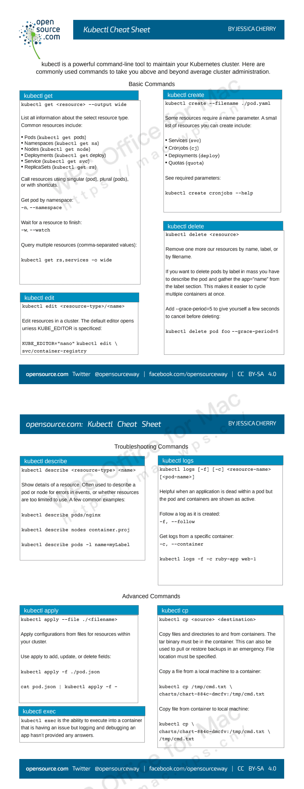

- [K8S的安装](#k8s的安装)
- [K8S的操作](#k8s的操作)
  - [创建资源对象](#创建资源对象)
    - [YAML配置例子](#yaml配置例子)
    - [分步骤创建](#分步骤创建)
    - [一次性创建](#一次性创建)
    - [根据目录下所有的 yaml 文件定义内容进行创建](#根据目录下所有的-yaml-文件定义内容进行创建)
    - [使用 url 来创建资源](#使用-url-来创建资源)
  - [查看资源对象](#查看资源对象)
    - [查看所有 Node 或 Namespace 对象](#查看所有-node-或-namespace-对象)
    - [查看所有 Pod 对象](#查看所有-pod-对象)
  - [查看所有 RC 对象](#查看所有-rc-对象)
  - [查看所有 Deployment 对象](#查看所有-deployment-对象)
  - [查看所有 Service 对象](#查看所有-service-对象)
  - [查看不同 Namespace 下的 Pod 对象](#查看不同-namespace-下的-pod-对象)
  - [查看资源描述](#查看资源描述)
    - [显示 Pod 详细信息](#显示-pod-详细信息)
    - [查看 Node 详细信息](#查看-node-详细信息)
    - [查看 RC 关联的 Pod 信息](#查看-rc-关联的-pod-信息)
  - [更新修补资源](#更新修补资源)
    - [滚动更新](#滚动更新)
    - [修补资源](#修补资源)
    - [Scale 资源](#scale-资源)
  - [删除资源对象](#删除资源对象)
    - [基于 xxx.yaml 文件删除 Pod 对象](#基于-xxxyaml-文件删除-pod-对象)
    - [删除包括某个 label 的 pod 对象](#删除包括某个-label-的-pod-对象)
    - [删除包括某个 label 的 service 对象](#删除包括某个-label-的-service-对象)
    - [删除包括某个 label 的 pod 和 service 对象](#删除包括某个-label-的-pod-和-service-对象)
    - [删除所有 pod/services 对象](#删除所有-podservices-对象)
  - [编辑资源文件](#编辑资源文件)
  - [直接执行命令](#直接执行命令)
    - [执行 pod 的 date 命令，默认使用 pod 的第一个容器执行](#执行-pod-的-date-命令默认使用-pod-的第一个容器执行)
    - [指定 pod 中某个容器执行 date 命令](#指定-pod-中某个容器执行-date-命令)
    - [进入某个容器](#进入某个容器)
  - [查看容器日志](#查看容器日志)
    - [直接查看日志](#直接查看日志)
    - [查看日志实时刷新](#查看日志实时刷新)
  - [常用命令总结](#常用命令总结)
- [kubectl 帮助](#kubectl-帮助)
  - [工具使用参数](#工具使用参数)

# K8S的安装
https://www.cnblogs.com/devopsyyds/p/16244053.html
# K8S的操作

## 创建资源对象
### YAML配置例子
```yaml
# 定义VIP服务
apiVersion: v1 # API版本
kind: Service # Kubernetes资源类型  
metadata: # 元数据
  name: mysql # 服务名称
  labels: # 标签
    app: mysql # 应用标签
spec: # 规范
  ports: # 端口配置
  - port: 3306 # 端口号  
  selector: # 选择器
    app: mysql # 应用标签
  clusterIP: 10.96.101.10 # VIP地址
  
--- 

# 定义主节点Deployment
apiVersion: apps/v1 # API版本 
kind: Deployment # 资源类型
metadata: # 元数据
  name: mysql-master # 名称 
  labels: # 标签
    app: mysql
    tier: master
spec: # 详情规范
  selector: # 选择器
    matchLabels: # 匹配标签
      app: mysql
      tier: master
  template: # 模板
    metadata: # 元数据
      labels: # 标签
        app: mysql
        tier: master
    spec: # 规范
      nodeSelector: # 节点选择器
        node: master # 选择节点
      containers: # 容器配置
      - name: master # 容器名称
        image: mysql # 镜像名称
        env: # 环境变量
        - name: MYSQL_ROOT_PASSWORD # 变量名
          value: password # 变量值
        - name: MYSQL_DATABASE 
          value: test
        - name: MYSQL_USER
          value: admin  
        - name: MYSQL_PASSWORD
          value: admin
        ports: # 端口配置
        - containerPort: 3306  
          name: mysql
        command: # 容器启动命令
        - sh 
        - -c
        - mysql_install_db --user=mysql && mysqld --character-set-server=utf8 --collation-server=utf8_general_ci --explicit_defaults_for_timestamp=true --lower_case_table_names=1
        
---

# 定义从节点Deployment
apiVersion: apps/v1 
kind: Deployment
metadata:
  name: mysql-slave 
  labels:
    app: mysql
    tier: slave
spec:
  selector:
    matchLabels:
      app: mysql
      tier: slave
  template:
    metadata:
      labels:
        app: mysql
        tier: slave
    spec:
      nodeSelector:
        node: slave 
      containers:
      - name: slave
        image: mysql
        env:
        - name: MYSQL_ROOT_PASSWORD
          value: password   
        ports:
        - containerPort: 3306
          name: mysql
        command:
        - sh
        - -c
        - mysqld --character-set-server=utf8 --collation-server=utf8_general_ci --explicit_defaults_for_timestamp=true --lower_case_table_names=1 --server-id=2 --log-bin --relay-log --log-slave-updates=true --read-only=true --slave-parallel-workers=2 --slave-parallel-type=logical_clock --report-host=slave1 --report-port=3306 --master-user=admin --master-password=admin --master-host=mysql --master-port=3306 --master-connect-retry=30
```
### 分步骤创建
```sh
# yaml
kubectl create -f xxx-rc.yaml
kubectl create -f xxx-service.yaml

# json
kubectl create -f ./pod.json
cat pod.json | kubectl create -f -

# yaml2json
kubectl create -f docker-registry.yaml --edit -o json
```
### 一次性创建
```
kubectl create -f xxx-service.yaml -f xxx-rc.yaml
```
### 根据目录下所有的 yaml 文件定义内容进行创建
```sh
kubectl create -f <目录>
```
### 使用 url 来创建资源
```sh
kubectl create -f https://git.io/vPieo
```

## 查看资源对象
### 查看所有 Node 或 Namespace 对象
```sh
kubectl get nodes
NAME          STATUS   ROLES           AGE   VERSION
k8s-master2   Ready    control-plane   45m   v1.28.0
k8s-master3   Ready    control-plane   42m   v1.28.0
node          Ready    control-plane   50m   v1.28.0
```
```sh
kubectl get namespace
NAME                STATUS   AGE
default             Active   68m
kube-node-lease     Active   68m
kube-public         Active   68m
kube-system         Active   68m
kubesphere-system   Active   25m
```
### 查看所有 Pod 对象
```sh
# 查看子命令帮助信息
kubectl get --help

# 列出默认namespace中的所有pod
kubectl get pods

# 列出指定namespace中的所有pod
kubectl get pods --namespace=test

# 列出所有pod并显示详细信息
kubectl get pods -o wide
kubectl get replicationcontroller web
kubectl get -k dir/
kubectl get -f pod.yaml -o json
kubectl get rc/web service/frontend pods/web-pod-13je7
kubectl get pods/app-prod-78998bf7c6-ttp9g --namespace=test -o wide
kubectl get -o template pod/web-pod-13je7 --template={{.status.phase}}

# 列出该namespace中的所有pod包括未初始化的
kubectl get pods,rc,services --include-uninitialized
```
## 查看所有 RC 对象
```sh
kubectl get rc
```
在 `kubectl get rc` 命令中，`rc` 是 `ReplicationController` 的缩写。`ReplicationController` 是 Kubernetes 中的一种资源控制器，它用来确保容器应用的副本数始终保持在用户定义的副本数，即如果有容器异常退出，会自动创建新的 Pod 来替代；而异常多出来的容器也会自动回收。在新版的 Kubernetes 中建议使用 `ReplicaSet (RS)` 来取代 `ReplicationController`。

## 查看所有 Deployment 对象
```sh
# 查看全部deployment
kubectl get deployment

# 列出指定deployment
kubectl get deployment my-app
```
在 `kubectl get deployment` 命令中，`deployment` 是 `Deployment` 的缩写。`Deployment` 是 Kubernetes 中的一种资源控制器，它提供了一种声明式的方法来更新 Pod 和 ReplicaSet。您可以在 `Deployment` 中描述期望的状态，然后 `Deployment` 控制器会以受控的速率将实际状态更改为期望状态。您可以定义 `Deployment` 来创建新的 ReplicaSet，或者删除现有的 `Deployment` 并使用新的 `Deployment` 接管它们的所有资源。

总之，`Deployment` 可以让您更方便地管理应用程序的部署、扩展和更新。
## 查看所有 Service 对象
```sh
kubectl get svc
kubectl get service
```
在 `kubectl get service` 命令中，`service` 是 `Service` 的缩写。`Service` 是 Kubernetes 中的一种资源，它定义了一组 Pod 的逻辑访问策略，通常称为微服务。您可以使用 `Service` 来暴露应用程序的某个部分，以便其他部分可以访问它。

`Service` 可以将访问流量路由到一组 Pod，这些 Pod 通常是由 `Deployment` 或 `ReplicaSet` 等控制器管理的。您可以使用标签选择器来指定哪些 Pod 应该接收流量。

总之，`Service` 可以让您更方便地管理应用程序的网络访问。

## 查看不同 Namespace 下的 Pod 对象
```sh
kubectl get pods -n default
kubectl get pods --all-namespace
```
## 查看资源描述
### 显示 Pod 详细信息
```sh
kubectl describe pods/nginx
kubectl describe pods my-pod
kubectl describe -f pod.json
```
Pod的详细信息的中文注释
```yaml
Name:                 coredns-558b97598-7v267                    # Pod的名称
Namespace:            kube-system                                # Pod所属的命名空间
Priority:             2000000000                                # 优先级
Priority Class Name:  system-cluster-critical                   # 优先级类别名称
Node:                 master03/172.1.1.198                     # 分配的节点和节点IP地址
Start Time:           Tue, 12 Sep 2023 01:11:06 +0800            # 启动时间
Labels:               k8s-app=kube-dns                           # 标签
                      pod-template-hash=558b97598
Annotations:          cni.projectcalico.org/containerID: f6f3d509af7ff924e2d00a964b4e7d6027e673a9da9141a591db5f9d9fbb14f9    # 注释
                      cni.projectcalico.org/podIP: 10.233.108.38/32
                      cni.projectcalico.org/podIPs: 10.233.108.38/32
Status:               Running                                    # Pod状态
IP:                   10.233.108.38                              # Pod的IP地址
IPs:
  IP:           10.233.108.38                                    # Pod的IP地址
Controlled By:  ReplicaSet/coredns-558b97598                     # 受控于哪个ReplicaSet
Containers:          # 容器列表开始
  coredns:
    Container ID:  docker://755e768f2e9c52377078ca74cf66c1e14aea3a65cbb5b8d89de62e007323c93a   # 容器ID
    Image:         dockerhub.kubekey.local/kubesphereio/coredns:1.8.0       # 容器镜像
    Image ID:      docker-pullable://dockerhub.kubekey.local/kubesphereio/coredns@sha256:7c733b17f929f7c7f24aeae082a0a0db0278d192557366a4eada3da829c46cb1  # 容器镜像ID
    Ports:         53/UDP, 53/TCP, 9153/TCP                        # 容器端口
    Host Ports:    0/UDP, 0/TCP, 0/TCP
    Args:
      -conf
      /etc/coredns/Corefile                                      # 容器的命令参数
    State:          Running                                        # 容器状态
      Started:      Tue, 12 Sep 2023 01:12:40 +0800                # 容器启动时间
    Ready:          True                                           # 容器是否就绪
    Restart Count:  0                                              # 容器重启次数
    Limits:
      memory:  170Mi                                                # 容器资源限制
    Requests:
      cpu:        100m                                             # 容器资源请求
      memory:     70Mi
    Liveness:     http-get http://:8080/health delay=60s timeout=5s period=10s #success=1 #failure=5   # 容器的存活探针配置
    Readiness:    http-get http://:8181/ready delay=0s timeout=1s period=10s #success=1 #failure=3    # 容器的就绪探针配置
    Environment:  <none>                                          # 容器的环境变量
    Mounts:
      /etc/coredns from config-volume (ro)                         # 挂载的卷配置
      /var/run/secrets/kubernetes.io/serviceaccount from kube-api-access-p8k76 (ro)
Conditions:
  Type              Status                                       # Pod条件类型和状态
  Initialized       True                                         # 是否已初始化
  Ready             True                                         # 是否就绪
  ContainersReady   True                                         # 容器是否就绪
  PodScheduled      True                                         # 是否已调度
Volumes:            # 卷列表开始
  config-volume:
    Type:      ConfigMap (a volume populated by a ConfigMap)   # 卷类型和来源
    Name:      coredns                                           # 卷名称
    Optional:  false
  kube-api-access-p8k76:
    Type:                    Projected (a volume that contains injected data from multiple sources)  # 卷类型和来源
    TokenExpirationSeconds:  3607
    ConfigMapName:           kube-root-ca.crt
    ConfigMapOptional:       <nil>
    DownwardAPI:             true
QoS Class:                   Burstable                                 # QoS类别
Node-Selectors:              kubernetes.io/os=linux                        # 节点选择器
Tolerations:                 CriticalAddonsOnly op=Exists
                             node-role.kubernetes.io/control-plane:NoSchedule
                             node-role.kubernetes.io/master:NoSchedule
                             node.kubernetes.io/not-ready:NoExecute op=Exists for 300s
                             node.kubernetes.io/unreachable:NoExecute op=Exists for 300s
Events:                      <none>                                     # 事件列表

```
### 查看 Node 详细信息
```sh
kubectl describe nodes c1
```
### 查看 RC 关联的 Pod 信息
```sh
kubectl describe pods <rc-name>
```
## 更新修补资源
### 滚动更新
```sh
# 滚动更新 pod frontend-v1
kubectl rolling-update frontend-v1 -f frontend-v2.json

# 更新资源名称并更新镜像
kubectl rolling-update frontend-v1 frontend-v2 --image=image:v2

# 更新 frontend pod 中的镜像
kubectl rolling-update frontend --image=image:v2

# 退出已存在的进行中的滚动更新
kubectl rolling-update frontend-v1 frontend-v2 --rollback

# 强制替换; 删除后重新创建资源; 服务会中断
kubectl replace --force -f ./pod.json

# 添加标签
kubectl label pods my-pod new-label=awesome

# 添加注解
kubectl annotate pods my-pod icon-url=http://goo.gl/XXBTWq
```
### 修补资源
```sh
# 部分更新节点
kubectl patch node k8s-node-1 -p '{"spec":{"unschedulable":true}}'

# 更新容器镜像；spec.containers[*].name 是必须的，因为这是合并的关键字
kubectl patch pod valid-pod -p \
    '{"spec":{"containers":[{"name":"kubernetes-serve-hostname","image":"new image"}]}}'
```
### Scale 资源
```sh
# Scale a replicaset named 'foo' to 3
kubectl scale --replicas=3 rs/foo

# Scale a resource specified in "foo.yaml" to 3
kubectl scale --replicas=3 -f foo.yaml

# If the deployment named mysql's current size is 2, scale mysql to 3
kubectl scale --current-replicas=2 --replicas=3 deployment/mysql

# Scale multiple replication controllers
kubectl scale --replicas=5 rc/foo rc/bar rc/baz
```
## 删除资源对象
### 基于 xxx.yaml 文件删除 Pod 对象
```sh
# yaml文件名字按照你创建时的文件一致
kubectl delete -f xxx.yaml
```
### 删除包括某个 label 的 pod 对象
```sh
kubectl delete pods -l name=<label-name>
```
### 删除包括某个 label 的 service 对象
```sh
kubectl delete services -l name=<label-name>
```
### 删除包括某个 label 的 pod 和 service 对象
```sh
kubectl delete pods,services -l name=<label-name>
```
### 删除所有 pod/services 对象
```sh
kubectl delete pods --all
kubectl delete service --all
kubectl delete deployment --all
```
## 编辑资源文件
在编辑器中编辑任何 API 资源
```sh
# 编辑名为docker-registry的service
kubectl edit svc/docker-registry
```
## 直接执行命令
在寄主机上，不进入容器直接执行命令
### 执行 pod 的 date 命令，默认使用 pod 的第一个容器执行
```sh
kubectl exec mypod -- date
kubectl exec mypod --namespace=test -- date
```
### 指定 pod 中某个容器执行 date 命令
```sh
kubectl exec mypod -c ruby-container -- date
```
### 进入某个容器
```sh
kubectl exec mypod -c ruby-container -it -- bash
```
## 查看容器日志
### 直接查看日志
```sh
# 不实时刷新
kubectl logs mypod
kubectl logs mypod --namespace=test
```
### 查看日志实时刷新
```sh
kubectl logs -f mypod -c ruby-container
```
## 常用命令总结
OpenSource: 总结的快捷键使用文档！


# kubectl 帮助
```yaml
kubectl --help

kubectl controls the Kubernetes cluster manager.

 Find more information at: https://kubernetes.io/docs/reference/kubectl/

Basic Commands (Beginner):
  create          Create a resource from a file or from stdin
  expose          Take a replication controller, service, deployment or pod and expose it as a new Kubernetes service
  run             Run a particular image on the cluster
  set             Set specific features on objects

Basic Commands (Intermediate):
  explain         Get documentation for a resource
  get             Display one or many resources
  edit            Edit a resource on the server
  delete          Delete resources by file names, stdin, resources and names, or by resources and label selector

Deploy Commands:
  rollout         Manage the rollout of a resource
  scale           Set a new size for a deployment, replica set, or replication controller
  autoscale       Auto-scale a deployment, replica set, stateful set, or replication controller

Cluster Management Commands:
  certificate     Modify certificate resources
  cluster-info    Display cluster information
  top             Display resource (CPU/memory) usage
  cordon          Mark node as unschedulable
  uncordon        Mark node as schedulable
  drain           Drain node in preparation for maintenance
  taint           Update the taints on one or more nodes

Troubleshooting and Debugging Commands:
  describe        Show details of a specific resource or group of resources
  logs            Print the logs for a container in a pod
  attach          Attach to a running container
  exec            Execute a command in a container
  port-forward    Forward one or more local ports to a pod
  proxy           Run a proxy to the Kubernetes API server
  cp              Copy files and directories to and from containers
  auth            Inspect authorization
  debug           Create debugging sessions for troubleshooting workloads and nodes
  events          List events

Advanced Commands:
  diff            Diff the live version against a would-be applied version
  apply           Apply a configuration to a resource by file name or stdin
  patch           Update fields of a resource
  replace         Replace a resource by file name or stdin
  wait            Experimental: Wait for a specific condition on one or many resources
  kustomize       Build a kustomization target from a directory or URL

Settings Commands:
  label           Update the labels on a resource
  annotate        Update the annotations on a resource
  completion      Output shell completion code for the specified shell (bash, zsh, fish, or powershell)

Other Commands:
  api-resources   Print the supported API resources on the server
  api-versions    Print the supported API versions on the server, in the form of "group/version"
  config          Modify kubeconfig files
  plugin          Provides utilities for interacting with plugins
  version         Print the client and server version information

Usage:
  kubectl [flags] [options]

Use "kubectl <command> --help" for more information about a given command.
Use "kubectl options" for a list of global command-line options (applies to all commands).
```
## 工具使用参数
```sh
get       #显示一个或多个资源
describe  #显示资源详情
create    #从文件或标准输入创建资源
update   #从文件或标准输入更新资源
delete   #通过文件名、标准输入、资源名或者 label 删除资源
log       #输出 pod 中一个容器的日志
rolling-update  #对指定的 RC 执行滚动升级
exec  #在容器内部执行命令
port-forward #将本地端口转发到 Pod
proxy   #为 Kubernetes API server 启动代理服务器
run     #在集群中使用指定镜像启动容器
expose   #将 SVC 或 pod 暴露为新的 kubernetes service
label     #更新资源的 label
config   #修改 kubernetes 配置文件
cluster-info #显示集群信息
api-versions #以”组/版本”的格式输出服务端支持的 API 版本
version       #输出服务端和客户端的版本信息
help         #显示各个命令的帮助信息
ingress-nginx  #管理 ingress 服务的插件(官方安装和使用方式)
```
