- [参考文献](#参考文献)
- [K8S架构](#k8s架构)
- [CNI基础](#cni基础)
- [Overlay networks](#overlay-networks)
- [边界网关协议（BGP）](#边界网关协议bgp)
- [可路由性（routability）](#可路由性routability)
  - [路由不可达](#路由不可达)
  - [路由可达](#路由可达)
  - [可路由性的决定因素](#可路由性的决定因素)
- [K8S服务暴露](#k8s服务暴露)
  - [Workload与SVC](#workload与svc)
  - [SVC的种类](#svc的种类)
    - [Headless Services](#headless-services)
    - [ClusterIP Services](#clusterip-services)
    - [NodePort Service](#nodeport-service)
    - [LoadBalancer Service](#loadbalancer-service)
- [Port概念辨析](#port概念辨析)
- [K8S中的DNS服务](#k8s中的dns服务)
  - [DNS创建规则](#dns创建规则)
  - [DNS策略配置](#dns策略配置)
  - [DNS解析规则](#dns解析规则)
  - [DNS解析流程](#dns解析流程)
    - [当ndots小于options ndots](#当ndots小于options-ndots)
    - [当ndots大于等于options ndots](#当ndots大于等于options-ndots)
  - [小结](#小结)
- [四层服务暴露](#四层服务暴露)
- [七层服务暴露](#七层服务暴露)
  - [Ingress](#ingress)
  - [Ingress Controllers](#ingress-controllers)
- [总结](#总结)

# 参考文献
https://www.sobyte.net/post/2022-07/k8s-service-discovery-and-traffic-exposure/

# K8S架构
下图为K8S官方文档中对K8S架构设计的一个简要介绍示意图，这个架构图侧重于从云厂商的角度展示了云厂商的API、K8S集群中控制面（Control Plane）和工作节点（Node）之间的关系，但是将留给第三方实现的如CRI、CNI、CSI等从中剥离出去了。
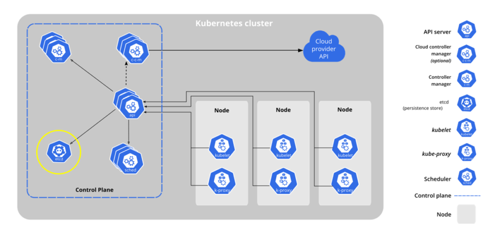

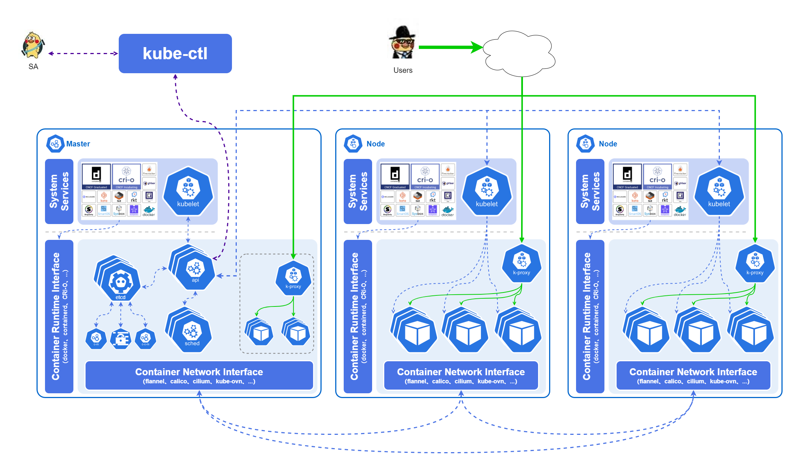

- kube-apiserver对外暴露了Kubernetes API。它是的 Kubernetes 前端控制层。它被设计为水平扩展，即通过部署更多实例来缩放。
- etcd用于 Kubernetes 的后端存储。etcd 负责保存Kubernetes Cluster的配置信息和各种资源的状态信息，始终为 Kubernetes 集群的 etcd 数据提供备份计划。当数据发生变化时，etcd 会快速地通知Kubernetes相关组件。
- kube-scheduler主要的工作就是调度新创建的Pod，当集群中出现了新的Pod还没有确定分配到哪一个Node节点的时候，kube-scheduler会根据各个节点的负载，以及应用对高可用、性能、数据亲和性的需求等各个方面进行分析并将其分配到最合适的节点上。
- kube-controller-manager运行控制器，它们是处理集群中常规任务的后台线程。逻辑上，每个控制器是一个单独的进程，但为了降低复杂性，它们都被编译成独立的可执行文件，并在单个进程中运行。这些控制器包括：节点控制器(Node Controller)、副本控制器(Replication Controller)、端点控制器(Endpoints Controller)、服务帐户和令牌控制器(Service Account & Token Controllers)等
- kube-proxy是集群中每个节点上运行的网络代理， kube-proxy通过维护主机上的网络规则并执行连接转发，实现了Kubernetes服务抽象。service在逻辑上代表了后端的多个Pod，外界通过service访问Pod。service接收到的请求就是通过kube-proxy转发到Pod上的，kube-proxy服务负责将访问service的TCP/UDP数据流转发到后端的容器。如果有多个副本，kube-proxy会实现负载均衡。
- K8S的三大插件分别管控运行时、网络和存储，即Container Runtime Interface (CRI)、Container Network Interface (CNI)和Container-Storage-Interface (CSI)。注意CRI和CNI是每个K8S集群都必须要部署的基础组件，而CSI则不一定，一般来说只有在我们需要运行有状态服务的时候才需要用到CSI。

# CNI基础
K8S本身不实现集群内的网络模型，而是通过将其抽象出来提供了CNI接口给第三方实现，这样一来节省了开发资源可以集中精力到K8S本身，二来可以利用开源社区的力量打造一整个丰富的生态，CNI的一些实现细节和要求我们都可以在github上面找到，我们这里暂不深入解析。

重点来看一下K8S对集群内的网络模型定义：
- K8S集群中任意两个POD可以直接通信，并且不需要进行NAT
- K8S集群中的每个Pod都必须要有自己的唯一、独立且可被访问的IP(IP-per-Pod)

K8S并不关心各个CNI如何具体实现上述基础规则，只要最终的网络模型符合标准即可。因此我们可以确保不论使用什么CNI，K8S集群内的Pod网络都是一张巨大的平面网络，每个Pod在这张网络中地位是平等的，这种设计对于集群内的服务发现、负载均衡、服务迁移、应用配置等诸多场景都带来了极大的便利。

# Overlay networks
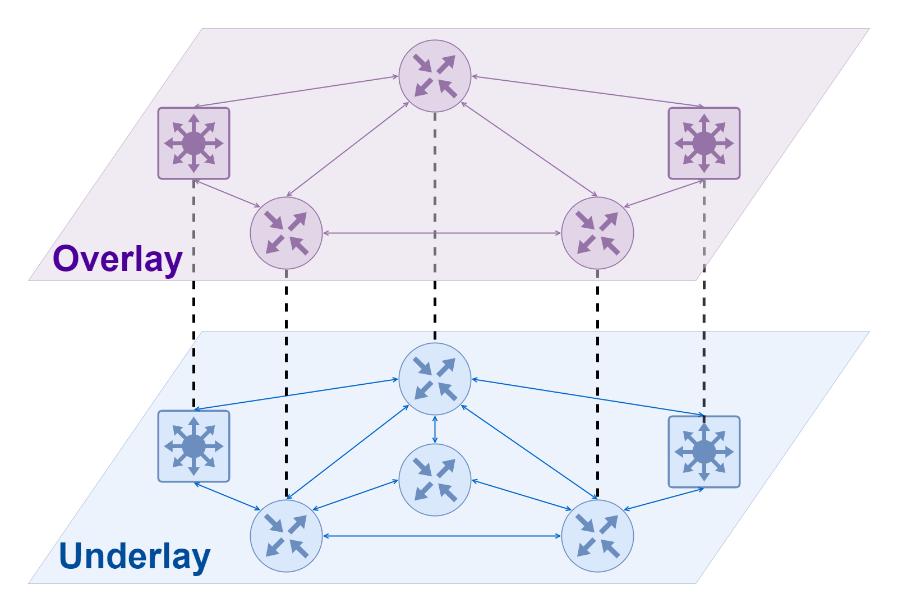
Overlay网络可以理解为建立在另一个网络之上的虚拟网络，这个概念在SDN里面里面经常出现。和虚拟网卡需要依赖实际存在的物理网卡才能通信类似，Overlay网络也不能凭空出现，它需要依赖的底层网络通常被称为Underlay网络。Underlay 网络是专门用来承载用户 IP 流量的基础架构层，它与 Overlay 网络之间的关系有点类似物理机和虚拟机。Underlay 网络和物理机都是真正存在的实体，它们分别对应着真实存在的网络设备和计算设备，而 Overlay 网络和虚拟机都是依托在下层实体使用软件虚拟出来的层级。

在使用了Overlay网络的K8S集群中，我们可以把底层的Underlay网络看作是K8S集群的Node节点所在的网络，而上层的Overlay网络一般用来处理Pod之间的网络通信。正常情况下，Underlay网络和Overlay网络之间互不干扰，两者并不知道对方的网络情况。但是由于Overlay网络是需要依赖Underlay网络进行传输数据的，因此在Overlay网络的数据发送到Underlay网络进行传输的时候，需要进行数据包的封装，将其变为Underlay网络可以理解的数据包；反之当数据从Underlay网络传送回Overlay网络的时候需要进行数据包的解封。在K8S的Overlay网络实现中，用于封装的两种常见网络协议是 VXLAN 和 IP-in-IP。

使用Overlay网络的主要优点是：
- 高度灵活性，Overlay网络和底层硬件网络设施分离，因此在跨机房、跨数据中心等场景有着传统的Underlay网络无法比拟的优势

使用Overlay网络的主要缺点是：
- 轻微的性能影响。封装数据包的过程占用少量 CPU，数据包中用于编码封装（VXLAN 或 IP-in-IP 标头）所需的额外字节减少了可以发送的内部数据包的最大大小，进而可以意味着需要为相同数量的总数据发送更多数据包。
- Pod IP 地址不可在集群外路由。

# 边界网关协议（BGP）
BGP（Border Gateway Protocol/边界网关协议）是一种基于标准的网络协议，用于在网络中共享路由。它是互联网的基本组成部分之一，具有出色的扩展特性。在K8S中，BGP是出场率很高的一个路由协议，有很多相关的CNI或者是LoadBalancer都会使用BGP协议来实现诸如路由可达或者是ECMP等特性。

目前对BGP协议支持最好、使用最广泛的CNI应该是Calico，另外Cilium也有仍处于beta阶段的BGP模式的支持。

# 可路由性（routability）
不同的K8S集群网络的一个重要区别就是Pod的IP在K8S集群外的可路由性。  
`由于K8S集群内的Pod之间必然是路由可达的，因此这里探讨的是集群外的服务到集群内的Pod之间的路由可达。`
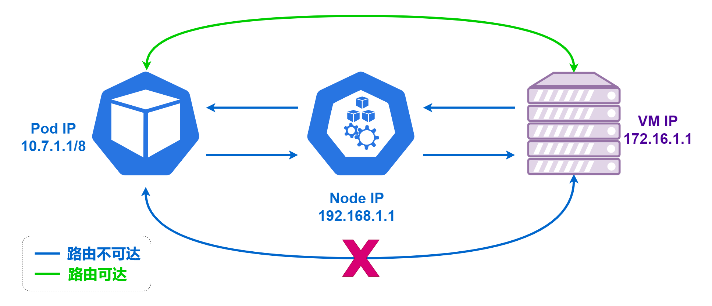

## 路由不可达
所谓路由不可达，即K8S集群外的机器没办法和集群内的Pod直接建立连接，集群外的服务器不知道如何将数据包路由到 Pod IP。

这种情况下当集群内的Pod需要主动和集群外的服务建立连接的时候，会通过K8S进行SNAT(Source Network Address Translation)。此时在集群外的服务器看到的连接对端IP是这个Pod所在的K8S集群节点的Node IP而不是Pod自身的IP，对于集群外的服务器发送返回数据的目的IP也永远都是这个K8S集群节点的Node IP，数据在Node IP上面再转换发送回Pod。这种情况下，集群外的服务器是无法得知Pod的IP，也无法直接获取真实的请求IP。

反之则更复杂，因为集群外的服务器不知道如何将数据包路由到 Pod IP ，所以也没办法主动去请求这些Pod，此时只能通过K8S的services（NodePort、LoadBalancer、Ingress）来将服务暴露到集群外，此时集群外的服务器的访问对象是某个K8S的服务，而不是具体的某个Pod。

## 路由可达
如果 Pod IP 地址可在集群外部路由，则 pod 可以在没有 SNAT 的情况下直接连接到集群外的服务器，而集群外的服务器也可以直接连接到 pod，而无需通过 通过K8S的services（NodePort、LoadBalancer、Ingress）。

可在集群外路由的 Pod IP 地址的优点是：
- 减少网络层级、降低网络层面架构复杂性、降低使用人员的理解成本、维护成本和Debug成本等
- 针对一些特殊的应用场景（如集群外的机器需要直接和Pod进行连接），在这种架构中实现更加简单

可在集群外路由的 Pod IP 地址的主要缺点是：
- Pod IP 在集群外的网络中也必须要唯一。如果有多个K8S集群都需要实现集群外路由可达，那么就需要给每个集群的Pod使用不同的CIDR。这对内部IP的使用规划有一定的要求，并且当集群足够大的时候，还需要考虑内网IP耗尽的可能。

## 可路由性的决定因素
- 如果集群使用的是overlay网络，一般来说Pod IP无法在集群外部路由
- 如果不使用overlay网络，则取决于部署的环境（云厂商/本地部署）、使用的CNI（Calico-BGP、Cilium-BGP等）以及实际网络规划等
- 目前K8S网络的集群外可路由性实现一般都是通过BGP协议

# K8S服务暴露
正常情况下，我们部署在K8S集群中的工作负载是需要对外提供服务的。这里的“对外”指的是对该负载以外的所有外部服务器提供服务，而根据这些外部服务器是否位于K8S集群中，我们可以分为K8S集群内部流量和K8S集群外流量。

## Workload与SVC
开始之前，我们要明确几个点：
- K8S中的工作负载（Workload）一般指的是集群中的真实工作任务。比如无状态服务常用的deployments、有状态服务常用的statefulsets、一些特殊用途的daemonsets、定时服务常用的cronjobs等，这些都属于是K8S中的工作负载（Workload）。
- K8S中的service（SVC）更多倾向于是一种规则集合，将符合某些特定条件的pod全部归属到一个Service中，然后组成一个特定的Service。注意这些pod是可以属于不同的工作负载（Workload）。
- K8S中的每个SVC都会有一个对应的域名，域名的组成格式为$service_name.$namespace_name.svc.$cluster_name，一般来说k8s集群中的$cluster_name就是cluster.local，这个字段一般在集群创建的时候就会设定好，之后想要再更改会十分麻烦。

综上所诉，我们可以得出以下结论：
- K8S中的工作负载（Workload）和服务暴露（service）是相互隔离开来的，分别交给不同的api来实现
- 每个SVC都会有一个服务名+命名空间+svc+集群名/$service_name.$namespace_name.svc.$cluster_name的域名可以用来访问（如app.namespace.svc.cluster.local）
- K8S集群内的服务之间访问主要就是通过这个域名来实现的

## SVC的种类
一般来说svc可以分为四类：Headless、ClusterIP、NodePort、LoadBalancer。四者之间的关系并非是完全互斥，具体如下：
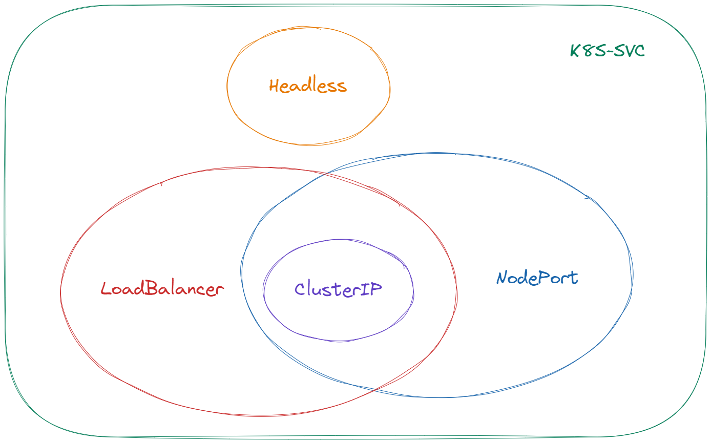
### Headless Services
- Headless类型服务和其他三者完全互斥，可以通过指定 Cluster IP（spec.clusterIP）的值为 "None" 来创建 Headless Service；
- 此时该服务的域名解析的结果就是这个服务关联的所有Pod IP，使用该域名访问的时候请求会直接到达pod；这时的负载均衡策略相当于是仅使用了DNS解析做负载均衡，并没有使用k8s内置的kube-proxy进行负载均衡；
- Headless类型服务不会创建对应域名所属的SRV记录；

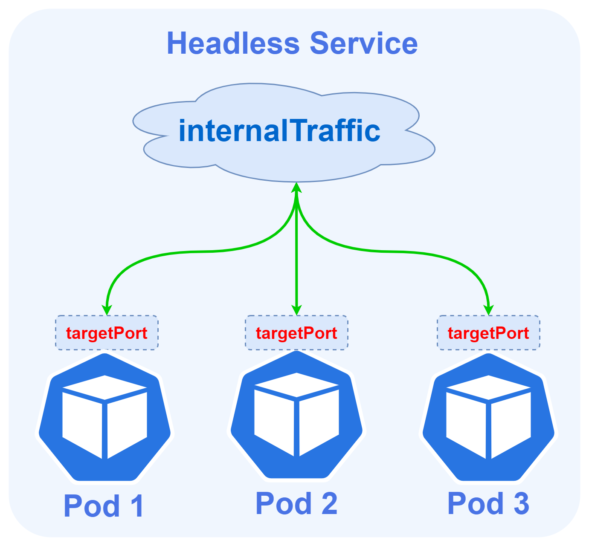

Headless Services这种方式优点在于足够简单、请求的链路短，但是缺点也很明显，就是DNS的缓存问题带来的不可控。很多程序查询DNS并不会参考规范的TTL值，要么频繁的查询给DNS服务器带来巨大的压力，要么查询之后一直缓存导致服务变更了还在请求旧的IP。

### ClusterIP Services
在 Kubernetes 集群中，每个 Node 运行一个 kube-proxy 进程。 kube-proxy 负责为 Service 实现了一种 VIP（虚拟 IP）的形式，一般称之为ClusterIP Services。
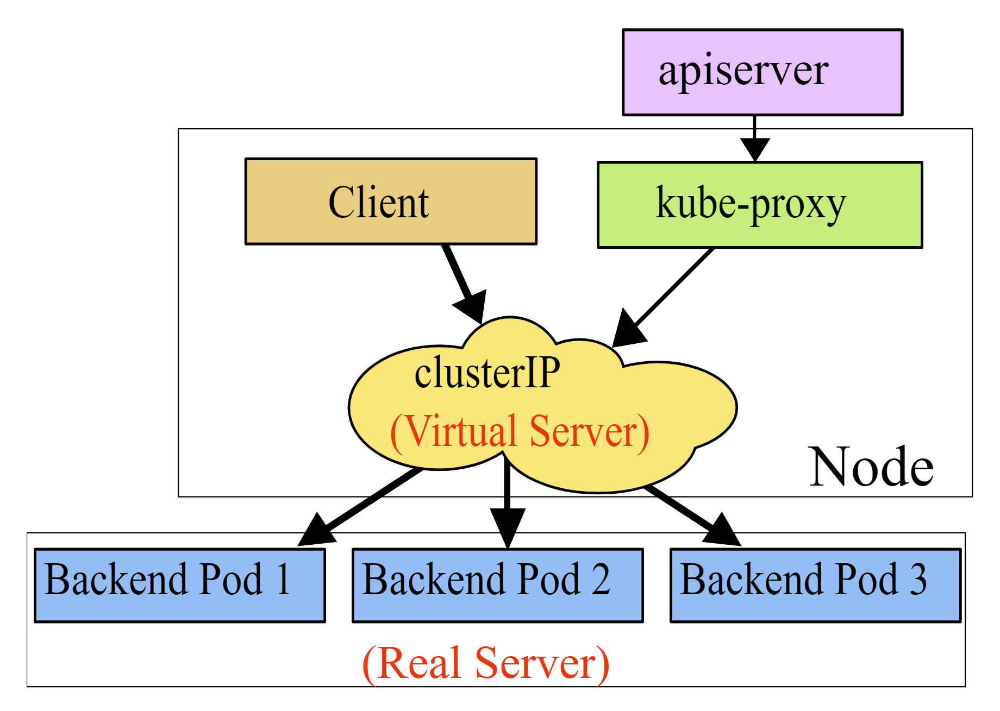
- ClusterIP是最常用的服务类型，也是默认的服务类型，同时也是NodePort、LoadBalancer这两个服务的基础；
- 对于ClusterIP类型的服务，K8S会给该服务分配一个称为CLUSTER-IP的VIP；
- ClusterIP是单独的IP网段，区别于K8S的宿主机节点IP网段和Pod IP网段，也是在集群初始化的时候定义的；
- ClusterIP可以在每一台k8s宿主机节点上面的kube-ipvs0网卡里面看到；
- ClusterIP类型的服务的域名解析的结果就是这个VIP，请求会先经过VIP，再由kube-proxy分发到各个pod上面；
- 如果k8s使用了ipvs，可以在K8S宿主机节点上面使用ipvsadm命令来查看这些负载均衡的转发规则；
- ClusterIP类型服务还会创建对应域名所属的SRV记录，SRV记录中的端口为ClusterIP的端口

ClusterIP Services这种方式的优点是有VIP位于Pod前面，可以有效避免前面提及的直接DNS解析带来的各类问题；缺点也很明显，当请求量大的时候，kube-proxy组件的处理性能会首先成为整个请求链路的瓶颈。

### NodePort Service
- 从NodePort开始，服务就不仅局限于在K8S集群内暴露，开始可以对集群外提供服务
- NodePort类型会从K8S的宿主机节点上面挑选一个端口分配给某个服务（默认范围是30000-32767），用户可以通过请求任意一个K8S节点IP的该指定端口来访问这个服务
- NodePort服务域名解析的解析结果是一个CLUSTER-IP，在集群内部请求的负载均衡逻辑和实现与ClusterIP Service是一致的
- NodePort服务的请求路径是从K8S节点IP直接到Pod，并不会经过ClusterIP，但是这个转发逻辑依旧是由kube-proxy实现

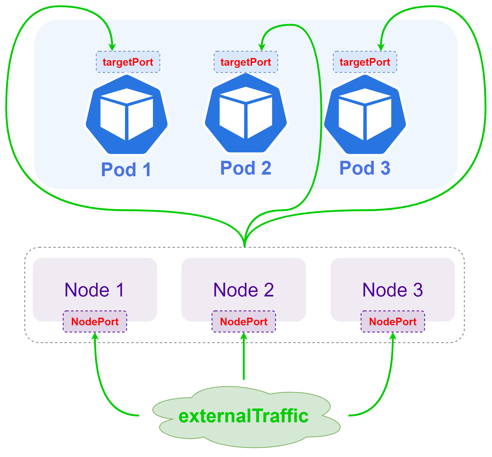

### LoadBalancer Service
- LoadBalancer服务类型是K8S对集群外服务暴露的最高级最优雅的方式，同时也是门槛最高的方式；
- LoadBalancer服务类型需要K8S集群支持一个云原生的LoadBalancer，这部分功能K8S本身没有实现，而是将其交给云厂商/第三方，因此对于云环境的K8S集群可以直接使用云厂商提供的LoadBalancer，当然也有一些开源的云原生LoadBalancer，如MetalLB、OpenELB、PureLB等；
- LoadBalancer服务域名解析的解析结果是一个CLUSTER-IP；
- LoadBalancer服务同时会分配一个EXTERNAL-IP，集群外的机器可以通过这个EXTERNAL-IP来访问服务；
- LoadBalancer服务默认情况下会同时创建NodePort，也就是说一个LoadBalancer类型的服务同时是一个NodePort服务，同时也是一个clusterIP服务；一些云原生LoadBalancer可以通过指定allocateLoadBalancerNodePorts: false来拒绝创建NodePort服务；

`我们还是借用OpenELB官网的图来解释一下这个流程，注意这里为BGP模式。`
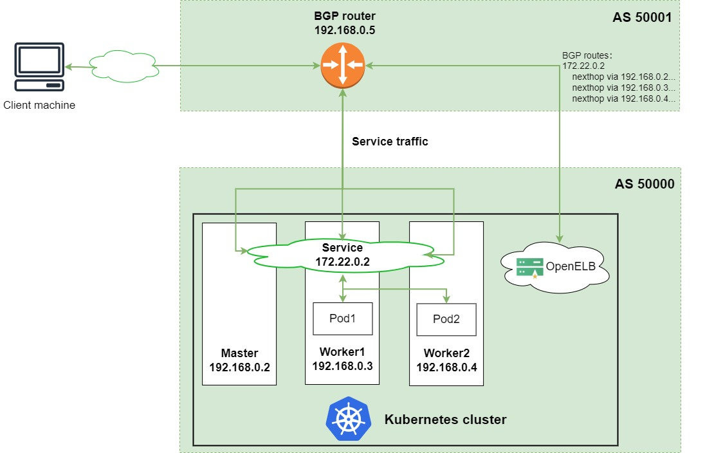

LoadBalancer Service这种方式的优点是方便、高效、适用场景广泛，几乎可以覆盖所有对外的服务暴露；缺点则是成熟可用的云原生LoadBalancer选择不多，实现门槛较高。

# Port概念辨析
在我们进行SVC和Workload部署配置的时候，经常会碰到各种名字中带有Port的配置项，这也是K8S中容易让人混淆的几个概念之一，这里主要介绍一下NodePort、Port、targetPort和containerPort这个四个概念。四者的关系我们可以通过下面这种图比较清晰地区分出来：

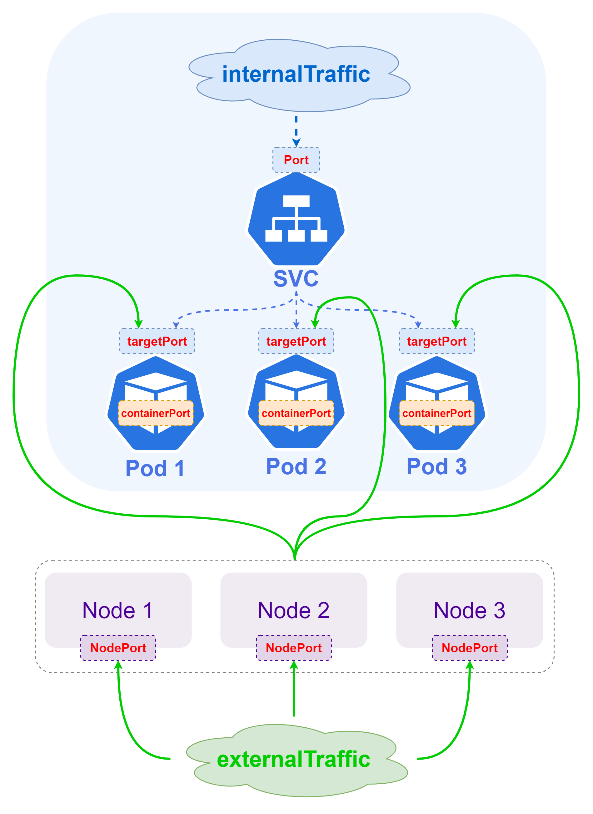

- nodePort: 只存在于Loadbalancer服务和NodePort服务中，用于指定K8S集群的宿主机节点的端口，默认范围是30000-32767，K8S集群外部可以通过NodeIP:nodePort 来访问某个service；
- port: 只作用于CLUSTER-IP和EXTERNAL-IP，也就是对Loadbalancer服务、NodePort服务和ClusterIP服务均有作用，K8S集群内部可以通过CLUSTER-IP:port来访问，K8S集群外部可以通过EXTERNAL-IP:port来访问；
- targetPort: Pod的外部访问端口，port和nodePort的流量会参照对应的ipvs规则转发到Pod上面的这个端口，也就是说数据的转发路径是NodeIP:nodePort -> PodIP:targetPort、CLUSTER-IP:port -> PodIP:targetPort、EXTERNAL-IP:port -> PodIP:targetPort
- containerPort：和其余三个概念不属于同一个维度，containerPort主要是在工作负载（Workload）中配置，其余三者均是在service中配置。containerPort主要作用在Pod内部的container，用来告知K8S这个container内部提供服务的端口，因此理论上containerPort应该要和container内部实际监听的端口一致，这样才能确保服务正常；但是实际上由于各个CNI的实现不通以及K8S配置的网络策略差异，containerPort的作用并不明显，很多时候配置错误或者是不配置也能正常工作；

综上所述，我们可以得知四者的主要区别，那么我们在实际使用的时候，最好就需要确保targetPort、containerPort和Pod里面运行程序实际监听的端口三者保持一致，即可确保请求的数据转发链路正常。

# K8S中的DNS服务
众所周知，在K8S中，IP是随时会发生变化的，变化最频繁的就是Pod IP，Cluster IP也并不是一定不会发生变化，EXTERNAL-IP虽然可以手动指定静态IP保持不变，但是主要面向的是集群外部的服务；因此在K8S集群中，最好的服务之间相互访问的方式就是通过域名。

## DNS创建规则
在K8S集群中，Kubernetes 为 Service 和 Pod 创建 DNS 记录。

前面我们介绍了K8S中的每个SVC都会有一个对应的域名，域名的组成格式为$service_name.$namespace_name.svc.$cluster_name，同时也会给这个SVC下的所有Pod都创建一个$pod_name.$service_name.$namespace_name.svc.$cluster_name的这种域名，这个域名的解析结果就是Pod IP。

Pod域名有两个比较明显的特征：
- 一是域名的组成比较特殊，因为域名中使用了Pod的名称，而pod名称在K8S中是会发生变化的（例如在服务更新或者滚动重启时），同时由于默认情况下Pod的命名是没有太明显的规律（大部分名字中会包含一串随机UUID）
- 二是域名的解析结果特殊，相较于集群内的其他类型域名，Pod域名的解析是可以精确到特定的某个Pod，因此一些特殊的需要点对点通信的服务可以使用这类Pod域名

## DNS策略配置
DNS 策略可以逐个 Pod 来设定。目前 Kubernetes 支持以下特定 Pod 的 DNS 策略。 这些策略可以在 Pod 规约中的 dnsPolicy 字段设置：
- Default: Pod 从运行所在的K8S宿主机节点继承域名解析配置；
- ClusterFirst: 不指定任何dnsPolicy配置情况下的默认选项，所有查询的域名都会根据生成的集群的K8S域名等信息生成的 /etc/resolv.conf 配置进行解析和转发到集群内部的DNS服务进行解析；
- ClusterFirstWithHostNet：主要用于以 hostNetwork 方式运行的 Pod，如果这些pod想要使用K8S集群内的DNS服务，则可以配置为这个字段；
- None: 此设置允许 Pod 忽略 Kubernetes 环境中的 DNS 设置，Pod 会使用其 dnsConfig 字段 所配置的 DNS 设置；

说明： 下面主要介绍ClusterFirst模式

## DNS解析规则
DNS 查询参照 Pod 中的 /etc/resolv.conf 配置，kubelet 会为每个 Pod 生成此文件。因此在每个pod里面都有一个类似下面这样的 /etc/resolv.conf文件，通过修改其中的配置可以更改DNS的查询规则：
```sh
nameserver 10.32.0.10
search <namespace>.svc.cluster.local svc.cluster.local cluster.local
options ndots:5
```
这里的配置有几个需要注意的点：
- nameserver：集群中的DNS服务器IP，一般来说就是CoreDNS的ClusterIP
- search：需要搜索的域，默认情况下会从该pod所属的namespace开始逐级补充options n
- dots：触发上面的search的域名点数，默认为1，上限15，在K8S中一般为5；例如在Linux中tinychen.com这个域名的ndots是1，tinychen.com.这个域名的ndots才是2（需要注意所有域名其实都有一个根域.，因此tinychen.com的全称应该是tinychen.com.）

这是一个比较通用的案例，我们再来看一个比较特殊的配置
```sh
作者：tinychen
链接：https://www.zhihu.com/question/526869937/answer/2577263407
来源：知乎
著作权归作者所有。商业转载请联系作者获得授权，非商业转载请注明出处。

# 首先进入一个pod查看里面的DNS解析配置
[root@tiny-calico-master-88-1 tiny-calico]# kubectl exec -it -n ngx-system ngx-ex-deploy-6bf6c99d95-5qh2w /bin/bash
kubectl exec [POD] [COMMAND] is DEPRECATED and will be removed in a future version. Use kubectl exec [POD] -- [COMMAND] instead.
[root@ngx-ex-deploy-6bf6c99d95-5qh2w /]# cat /etc/resolv.conf
nameserver 10.88.0.10
search ngx-system.svc.cali-cluster.tclocal svc.cali-cluster.tclocal cali-cluster.tclocal k8s.tcinternal
options ndots:5
[root@ngx-ex-deploy-6bf6c99d95-5qh2w /]# exit
```
这个pod里面的/etc/resolv.conf配置文件有两个和前面不同的地方：
- cluster.local变成了cali-cluster.tclocal
这里我们可以看到coredns的配置中就是配置的cali-cluster.tclocal，也就是说/etc/resolv.conf中的配置其实是和coredns中的配置一样，更准确的说是和该K8S集群初始化时配置的集群名一样  
再查看K8S集群中的coredns的configmap	
```sh
kubectl get configmaps -n kube-system coredns -oyaml
apiVersion: v1
data:
  Corefile: |
    .:53 {
        errors
        health {
           lameduck 5s
        }
        ready
        kubernetes cali-cluster.tclocal in-addr.arpa ip6.arpa {
           pods insecure
           fallthrough in-addr.arpa ip6.arpa
           ttl 30
        }
        prometheus :9153
        forward . 10.31.100.100 {
           max_concurrent 1000
        }
        cache 30
        loop
        reload
        loadbalance
    }
kind: ConfigMap
metadata:
  creationTimestamp: "2022-05-06T05:19:08Z"
  name: coredns
  namespace: kube-system
  resourceVersion: "3986029"
  uid: 54f5f803-a5ab-4c77-b149-f02229bcad0a
```
- search新增了一个k8s.tcinternal
实际上我们再查看K8S的宿主机节点的DNS配置规则时会发现这个k8s.tcinternal是从宿主机上面继承而来的
```sh
# 最后查看宿主机节点上面的DNS解析配置
[root@tiny-calico-master-88-1 tiny-calico]# cat /etc/resolv.conf
# Generated by NetworkManager
search k8s.tcinternal
nameserver 10.31.254.253
```
## DNS解析流程
### 当ndots小于options ndots
前面我们说过options ndots的值默认情况下是1，在K8S中为5，为了效果明显，我们这里使用K8S中的5作为示例：

这里同样是在一个命名空间demo-ns中有两个SVC，分别为demo-svc1和demo-svc2，那么他们的/etc/resolv.conf应该是下面这样的：
```sh
nameserver 10.32.0.10
search demo-ns.svc.cluster.local svc.cluster.local cluster.local
options ndots:5
```
我们在demo-svc1中直接请求域名demo-svc2，此时ndots为1，小于配置中的5，因此会触发上面的search规则，这时第一个解析的域名就是demo-svc2.demo-ns.svc.cluster.local，当解析不出来的时候继续下面的demo-svc2.svc.cluster.local、demo-svc2.cluster.local，最后才是直接去解析demo-svc2.。

注意上面的规则适用于任何一个域名，也就是当我们试图在pod中去访问一个外部域名如tinychen.com的时候也会依次进行上述查询。
### 当ndots大于等于options ndots
我们在demo-svc1中直接请求域名demo-svc2.demo-ns.svc.cluster.local，此时的ndots为4，还是会触发上面的search规则。

而请求域名demo-svc2.demo-ns.svc.cluster.local.，ndots为5，等于配置中的5，因此不会触发上面的search规则，直接去解析demo-svc2.demo-ns.svc.cluster.local.这个域名并返回结果

如果我们请求更长的域名如POD域名pod-1.demo-svc2.demo-ns.svc.cluster.local.，此时的ndots为6，大于配置中的5，因此也不会触发上面的search规则，会直接查询域名并返回解析

## 小结
通过上面的分析我们不难得出下面几点结论：
- 同命名空间（namespace）内的服务直接通过$service_name进行互相访问而不需要使用全域名（FQDN），此时DNS解析速度最快；
- 跨命名空间（namespace）的服务，可以通过$service_name.$namespace_name进行互相访问，此时DNS解析第一次查询失败，第二次才会匹配到正确的域名；
- 所有的服务之间通过全域名（FQDN）$service_name.$namespace_name.svc.$cluster_name.访问的时候DNS解析的速度最快；
- 在K8S集群内访问大部分的常见外网域名（ndots小于5）都会触发search规则，因此在访问外部域名的时候可以使用FQDN，即在域名的结尾配置一个点号.

# 四层服务暴露
对于K8S集群中的服务暴露到集群外部提供服务，一般的方式可以分为四层服务暴露和七层服务暴露，因为前者一般来说是后者的基础，因此这里我们先对四层服务暴露进行介绍。

在开始之前我们需要明确四层的概念，这里的四层指的是OSI七层模型中的第四层，即TCP、UDP协议所处于的传输层，也就是我们常说的协议+IP+端口层面的负载均衡，常见的四层负载均衡器有LVS、DPVS、Haproxy(四层七层均可)、nginx(四层七层均可)等，在K8S中的四层服务暴露最常用的两种手段就是我们前面提及的Nodeport和LoadBalancer。

我们先来看下面的这个架构图，注意整个蓝色的点线范围内的是一个K8S集群，为了方便区分，我们这里假设从集群外部进来的流量都是南北流量（客户端-服务器流量），集群内部的流量全部都是东西流量（服务器-服务器流量）。

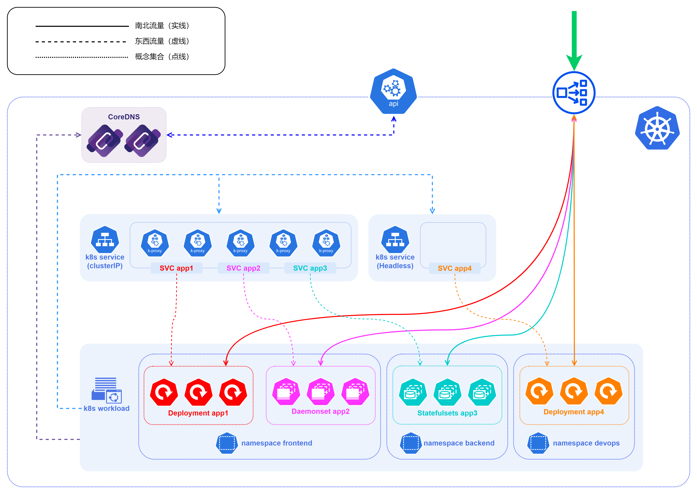

我们从下到上开始看起
- 图中有frontend、backend、devops等多个命名空间，这是常见的用来隔离不同资源的手段，在实际的落地场景中可以根据不同的业务、使用人群等进行划分，具体的划分维度和标准最好视实际业务情况而定；
- 实际上不止是workload，service也是会根据不同的namespace进行划分，包括K8S集群中的大部分api，我们在查找的时候都是需要指定namespace
- 在k8s service这一层，图中主要展示了用于集群内部访问的Cluster-IP和Headless两种方式
- 需要注意的是Headless服务是和其余三种服务类型相斥的，同时它也不会经过kube-proxy进行负载均衡，因此在Headless服务的蓝色实线框中是空白的，而Cluster-IP中则是kube-proxy组件
- 再往上就是每个K8S集群中一般都会有的DNS服务，CoreDNS从K8S的v1.11版本开始可以用来提供命名服务，从v1.13 开始替代 kube-dns成为默认DNS 服务
- 在 Kubernetes 1.21 版本中，kubeadm 移除了对将 kube-dns 作为 DNS 应用的支持。 对于 kubeadm v1.24，所支持的唯一的集群 DNS 应用是 CoreDNS
- CoreDNS本身也是一个workload，它是位于kube-system这个命名空间下的一个deployments.apps
- CoreDNS也是通过请求K8S集群内的api-server来获取k8s集群内的服务信息
- 再往上就是位于整个K8S集群的边界处，这里首先必然会有一个api-server，它会同时对集群内和集群外暴露控制接口，我们可以通过这个接口来获取K8S集群的信息
- api-server本身并不存储信息，K8S集群本身的集群信息大部分都是存储在etcd服务中，api-server会去etcd中读取相关数据并返回；
- 最后就是用来暴露四层服务的服务，一般是NodePort或者是LoadBalancer，因为端口和IP等原因，实际上使用的时候大部分都是以LoadBalancer的方式暴露出去；
- LoadBalancer服务对外暴露的并不是一个IP，而是一个IP+端口，也就是说实际上一个IP的多个端口可以为不同类型的服务提供服务，例如80和443端口提供http/https服务，3306提供数据库服务等；
- K8S并没有内置LoadBalancer，因此需要实现LoadBalancer，目前主流有两种方式：一是使用云厂商如AWS、Azure、阿里腾讯等提供的LoadBalancer，这些LoadBalancer基本都是闭源的解决方案，基本仅适用于他们自家的云环境，但是作为收费服务，在技术支持和售后已经产品成熟度方面均有不错的表现；二是使用已有的一些开源LoadBalancer，主要就是MetalLB、OpenELB以及PureLB，关于三者的详细介绍，之前已经写过相关的文章，有兴趣的可以点击链接进去看看。
- 开源的LoadBalancer基本都是拥有两种主要工作模式：Layer2模式和BGP模式。无论是Layer2模式还是BGP模式，核心思路都是通过某种方式将特定VIP的流量引到k8s集群中，然后再通过kube-proxy将流量转发到后面的特定服务。

# 七层服务暴露
四层LoadBalancer服务暴露的方式优点是适用范围广，因为工作在四层，因此几乎能适配所有类型的应用。但是也有一些缺点：
- 对于大多数应用场景都是http协议的请求来说，并不需要给每个服务都配置一个EXTERNAL-IP来暴露服务，这样一来资源严重浪费（公网IP十分珍贵），二来包括IP地址已经HTTPS使用的证书管理等均十分麻烦
- 比较常见的场景是对应的每个配置都配置一个域名（virtual host）或者是路由规则（routing rule），然后统一对外暴露一个或者少数几个EXTERNAL-IP，将所有的请求流量都导入到一个统一个集中入口网关（如Nginx），再由这个网关来进行各种负载均衡（load balancing）、路由管理（routing rule）、证书管理（SSL termination）等等

在K8S中，一般交由ingress来完成上述这些事情。

## Ingress
Ingress 是对集群中服务的外部访问进行管理的 API 对象，典型的访问方式是 HTTP。Ingress 可以提供负载均衡（load balancing）、路由管理（routing rule）、证书管理（SSL termination）等功能。Ingress 公开从集群外部到集群内服务的 HTTP 和 HTTPS 路由。 流量路由由 Ingress 资源上定义的规则控制。

下图为K8S官方提供的一个关于ingres工作的示意图：
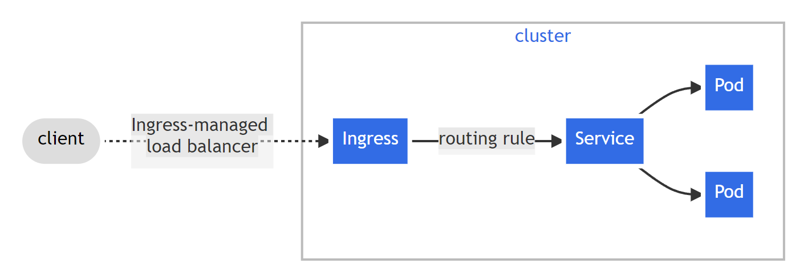
这里我们需要注意区分Ingress和Ingress Controllers，两者是两个不同的概念，并不等同
- 从概念上来看，Ingress和前面提到的service很像，Ingress本身并不是一个真实存在的工作负载（workload）
- 而Ingress Controllers更倾向于部署在K8S集群中的一些特殊网关（如NGX），以K8S官方维护的ingress-nginx为例，它本质上其实是一个带有Ingress资源类型的特殊deployments，Ingress Controllers是Ingress的具体实现
## Ingress Controllers
上面我们得知所谓的Ingress Controllers本身其实就是特殊的workload（一般是deployment），因此它们本身也是需要通过某种方式暴露到集群外才能提供服务，这里一般都是选择通过LoadBalancer进行四层服务暴露。

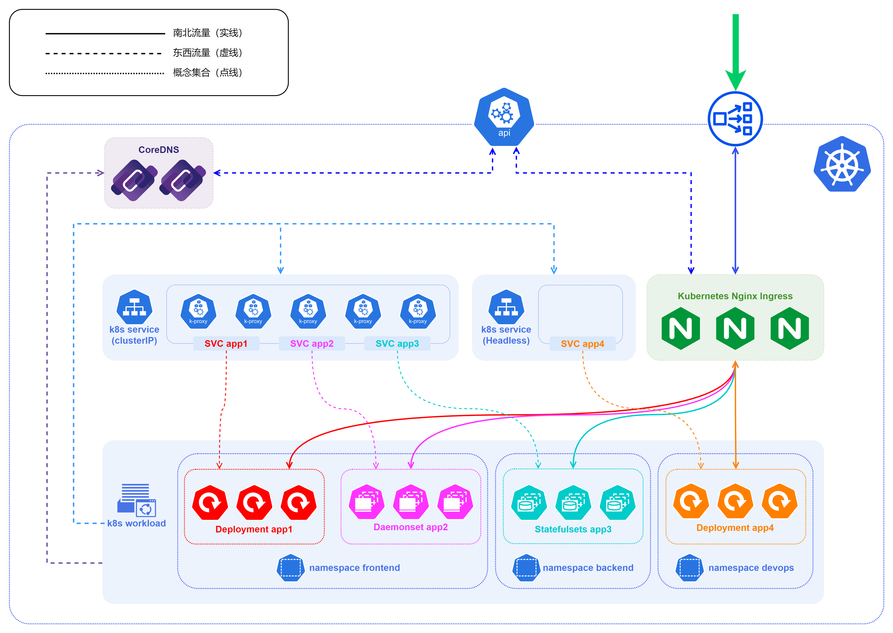
针对上面四层服务暴露的架构图，我们在入口处的LoadBalancer后面加入一个Ingress，就可以得到七层Ingress服务暴露的架构图。

- 在这个图中的处理逻辑和四层服务暴露一致，唯一不同的就是HTTP协议的流量是先经过入口处的loadbalancer，再转发到ingress里面，ingress再根据里面的ingress rule来进行判断转发；
- k8s的ingress-nginx是会和集群内的api-server通信并且获取服务信息，因为Ingress Controllers本身就具有负载均衡的能力，因此在把流量转发到后端的具体服务时，不会经过ClusterIP（就算服务类型是ClusterIP也不经过），而是直接转发到所属的Pod IP上；

# 总结
到这里关于K8S的基本服务暴露所需要了解的知识就介绍完了，由于K8S本身确实十分复杂，本文在介绍的时候只能蜻蜓点水，随着K8S的不断发展，现在普通的服务暴露已经不能很好的满足部分场景的高端需求，随后又引发了很多诸如服务网格（service mesh）、边车模型（sidecar）、无边车模型（sidecarless）等等的进化。